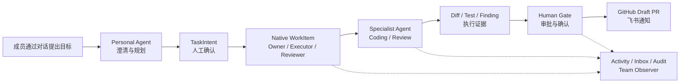
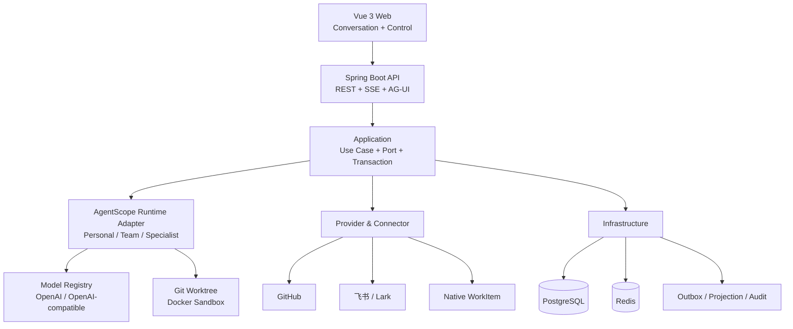

<p align="center">
  
</p>

<h1 align="center">CrewScope</h1>

<p align="center">
  面向技术团队的协作式 AI 工作执行平台<br>
  <sub>Team-collaborative AI work execution, powered by AgentScope Java 2.0</sub>
</p>

<p align="center">
  <a href="https://github.com/zhangkaixuan01/crewscope/actions/workflows/ci.yml"></a>
  <a href="LICENSE"></a>
  
  
  
  
</p>

CrewScope 将技术团队的对话目标转化为可执行、可协作、可追踪的工作闭环。每位成员拥有代表自己的 Personal Agent；Team Agent 提供共享团队视野；Coding、Reviewer 等 Specialist Agent 承担专业执行；人始终负责目标、授权、Review 和最终决策。

当前 **Team Beta MVP** 的 M0–M9 工作包均已交付（`M9-Q02` 的真实环境验收保持待执行）。[M6 MVP Release Gate](docs/testing/M6-Q04-MVP-Release-Gate.md) 已正式关闭，[M7 开放用户体系 Release Gate](docs/testing/M7-Q04-Release-Gate.md) 的本机与 Linux amd64 Server RC 结论均为 `PASS`，M8 交付 Setup Center、职责收口、依赖治理与运维可观测。平台提供正式注册、登录、服务端 Session、首次 Team Onboarding、账号安全和团队邀请入口，并已通过 OPEN、INVITE_ONLY、DISABLED 三种注册 Profile 的真实生产链路验证。

M9 完成全站产品体验重构：设计系统 v2 令牌、个人工作台首页、**状态徽章即动作入口**的四呈现面动作模型、Diff 语法高亮与行级 Review 评论、配置体验重构与十二项体验门禁。收口证据见 [M9-Q01 质量门禁与基线](docs/testing/M9-Q01-质量门禁与基线.md)，本机发布预检与待执行项见 [M9-Q02 Release Gate](docs/testing/M9-Q02-Release-Gate.md)。

下一阶段为 [M9b：核心流程与使用体验收口](docs/plans/M9b-核心流程与使用体验收口.md)（未开始）。[最新 Review](docs/reviews/M9后-全流程使用体验与竞品对照Review.md) 累计记录 43 项待优化问题（17 + 15 + 7 + 4 项）；23 个页面及 15 个一级、9 个二级菜单纳入产品验收矩阵。[逐操作清单](docs/reviews/M9b-菜单逐操作产品Review.md) 覆盖填写、提交、反馈与恢复；[Multica 用户迁移 Review](docs/reviews/M9b-Multica用户迁移体验Review.md) 补充内容阅读、个人视图、发送意图、真实模型限制及固定迁移场景验证。采用自动化/代理浏览器证据，不设真人测评门槛。计划已建立，不代表已修复、实机验收或已优于竞品。


## 核心工作流



## 核心能力

| 能力 | 说明 |
|---|---|
| 对话式工作执行 | 从 Conversation、澄清问题和 TaskIntent 进入 Native WorkItem 与持久化 TaskExecution |
| 团队协作 | 明确 Owner、Executor、Gate Reviewer、Handoff、Takeover 与同级 Review，成员共享工作上下文 |
| 可解释的动作 | 状态徽章即动作入口，列表行、看板卡片、详情抽屉与首页卡片共用同一动作模型与撤销窗口；服务端为每个动作给出 `enabled`、稳定 `reason` 与站内 `remedy` |
| 原生 Agent Runtime | 基于 AgentScope Java `HarnessAgent`、Model、Toolkit、Skill、Middleware、State 和 AG-UI 构建 Personal、Team 与 Specialist Agent |
| Coding 闭环 | Git 镜像与 Worktree、Docker Sandbox、计划版本、Checkpoint、DiffArtifact、TestEvidence 和 Draft PR |
| Human-in-the-loop | 高风险外部副作用进入 PlannedAction、授权、Human Gate、Receipt 与 Reconcile 链路 |
| Provider 架构 | 内置 Native WorkItem、GitHub 与飞书 Provider；模型支持 OpenAI 及 OpenAI-compatible Adapter，可继续扩展企业系统 |
| 团队可观测 | Activity、个人 Inbox、Audit Explorer、Team Observer、Operations、SSE 恢复、OTel 与 Prometheus |
| 可靠与可恢复 | Outbox、幂等、Lease/Fencing、Projection Generation、Dead Letter、备份恢复与故障收敛 |

## Agent 协作模型

- **Personal Agent**：代表成员理解目标、维护对话上下文、生成 TaskIntent，并编排个人工作。
- **Team Agent / Team Observer**：使用团队或组织级连接，提供只读的团队进度、阻塞和风险汇总。
- **Specialist Agent**：执行 Coding、Reviewer 等专业任务；内置类型提供稳定合同，用户可通过 AgentTemplate 创建受控的自定义类型。
- **Human Member**：拥有工作目标与责任边界，负责授权、Review、确认、接管和最终交付决策。

Personal 与 Specialist Agent 可绑定个人模型连接和个人 Provider 连接；团队级 Agent 使用团队或组织连接。运行时会固定模型、凭据版本、Tool Surface、Skill Bundle 和 Agent 配置哈希，避免执行过程中发生隐式漂移。

## 系统架构



### 工程模块

| 模块 | 职责 |
|---|---|
| `crewscope-domain` | 领域模型、状态机、权限与稳定业务不变量 |
| `crewscope-application` | 用例、Port、事务边界、命令与查询服务 |
| `crewscope-agentscope` | AgentScope Java Runtime、Agent、Model、Tool、Skill 与 Middleware 适配 |
| `crewscope-integration` | GitHub、飞书、Native WorkItem 等 Provider 与 Connector |
| `crewscope-infrastructure` | PostgreSQL、Redis、Outbox、Projection、凭据与持久化实现 |
| `crewscope-server` | Spring Boot 装配、REST、SSE、AG-UI、安全与运维端点 |
| `crewscope-web` | Vue 3 团队工作台、对话模式与传统管理模式 |

## 技术栈

- Java 17、Spring Boot 4.0.6、Maven
- AgentScope Java 2.0.0
- PostgreSQL 17、Redis 7.4、Flyway
- Vue 3.5、TypeScript 5.9、Vite 7、pnpm 11、Vitest 4、Playwright、Histoire
- Docker Compose、OpenTelemetry、Prometheus

## 部署（本机与服务器通用）

需要 Git、Docker Engine / Docker Compose v2 和 OpenSSL。后端与前端在 Docker 内从源码构建，无需宿主机安装 Java、Node 或 pnpm。

在仓库根目录运行：

```bash
./deploy/team-beta/quickstart.sh up
```

首次启动自动生成配置和随机密钥、构建镜像并初始化数据库。打开 `http://<服务器地址>:8080`（本机用 `127.0.0.1`），注册账号后创建团队。Operator 用户名为 `crewscope-monitor`，初始密码保存在 `deploy/team-beta/.runtime/bootstrap_password`。

只有四个长期运行服务：**PostgreSQL、Redis、API、Web**。API 同时运行 Worker，保留个人对话、普通任务执行、仓库导入和 Coding/Review 运行能力。模型、GitHub、飞书需另外配置；当前构建方案仅内置 Maven/Java 17，尚无完整的自定义构建方案管理页面。远端 HTTP 的浏览器兼容及 GitHub 空环境导入断点已纳入 M9b、尚未修复，详见上方 Review；不能将“服务启动成功”视为全部业务路径已经验收。

不需要证书、域名、外部 Secret 目录、镜像 Digest、监控栈或 Socket Proxy。默认 HTTP，Web 发布 8080；数据库与 Redis 不发布宿主端口。Coding 使用本机 Docker Socket 创建 Sandbox，脚本自动准备执行目录和 Socket 组权限；应用因此具备管理本机 Docker 的权限，适用于自己的单机或团队专用主机。

### 常用操作

```bash
./deploy/team-beta/quickstart.sh status
./deploy/team-beta/quickstart.sh logs
./deploy/team-beta/quickstart.sh down
```

`down` 保留数据；再次 `up` 复用本地镜像。更新源码后显式构建并启动：

```bash
git pull --ff-only
./deploy/team-beta/quickstart.sh build
./deploy/team-beta/quickstart.sh up
```

### 修改配置

首次启动后编辑 `deploy/team-beta/.runtime/.env`；也可先执行 `quickstart.sh init` 只生成配置：

```dotenv
CREWSCOPE_WEB_PORT=8080
CREWSCOPE_REGISTRATION_MODE=OPEN
CREWSCOPE_DEMO_ORGANIZATION_NAME=CrewScope Team Beta
```

修改后执行 `quickstart.sh up`。切换注册策略也可以直接运行：

```bash
./deploy/team-beta/quickstart.sh set-registration-mode INVITE_ONLY
# 可选值：OPEN、INVITE_ONLY、DISABLED
```

配置检查使用 `quickstart.sh config`；需要原生 Compose 子命令时使用 `quickstart.sh compose <参数>`，脚本会自动带上配置文件和项目名。

备份、恢复、旧版本迁移、可选 HTTPS 和常见问题见 [单机运维手册](docs/runbooks/Team-Beta单机运维手册.md)。更新前请备份数据及 `.runtime/.env`，其中的加密密钥不能丢失。

`quickstart.sh reset` 会删除当前项目的数据库、Redis、Artifact 和 Agent 数据卷；配置及执行仓库目录保留。只在明确需要清空测试数据时使用。

`deploy/team-beta/demo.sh` 与 `deploy/local-demo.sh` 默认转发至同一入口、同一项目和数据目录。旧版七/十服务部署仅作为 [M6 历史验收记录](docs/testing/M6-I09-生产镜像与Team-Beta部署.md) 保留，不适用于当前部署。

## 从源码开发

### 环境要求

- JDK 17 或更高版本，Language level 使用 Java 17
- Docker / Docker Compose
- Node.js 24、pnpm 11
- Git

### 启动后端

```bash
cp .env.example .env
# Generate a local Credential encryption key, then write it to
# CREWSCOPE_CREDENTIAL_KEYS as v1=<generated-value> without committing .env.
openssl rand -base64 32
# The API-only source profile keeps login admission defense disabled. If you enable it in .env,
# generate a separate key and set CREWSCOPE_LOGIN_DEFENSE_HMAC_KEY before starting the server.
docker compose up -d postgres redis

set -a
. ./.env
set +a

./mvnw -pl crewscope-server -am clean package -DskipTests
java -jar crewscope-server/target/crewscope-server-0.1.0-SNAPSHOT.jar
```

根目录 `.env.example` 用于 API-only 源码调试，默认 `server + bootstrap`，需要填写本地 Credential 加密 Key。完整浏览器、任务、仓库导入和 Coding 流程统一使用上面的 Team Beta Quickstart；它自动建立运行身份并在 API 进程内启动 Worker。监控机器凭证不能作为业务登录方式。

### 启动前端

```bash
cd crewscope-web
nvm use
pnpm install --frozen-lockfile
pnpm dev
```

访问 `http://localhost:5173`。Vite 会将 `/api` 与 `/actuator` 代理到 `http://localhost:8080`。

提交前运行依赖与配置合同检查：

```bash
node scripts/check-config-contract.mjs
node scripts/check-dependency-contract.mjs
./mvnw -q -DskipTests compile
```

Backend CI 还会运行 `dependency:analyze`，并用
[`config/maven-dependency-analyze.allowlist`](config/maven-dependency-analyze.allowlist)
阻断未审阅的新依赖诊断。

后端健康与系统信息：

```text
GET http://localhost:8080/actuator/health
GET http://localhost:8080/api/v1/system/info
```

服务可以在未配置模型时以 API-only 方式启动。执行 Agent 任务前，在“模型与凭证”页面选择平台已登记的厂商/模型并配置个人或团队连接；当前默认目录为 DeepSeek，虽然已有 OpenAI-compatible Adapter，但自定义 Endpoint/模型目录的完整页面管理仍待 M9b 交付。Personal Agent 执行时会读取会话锁定的 AgentConfigurationVersion，经过 Provider、Connection、Catalog、价格和授权预检后，从 CredentialStore 动态装配对应连接的 AgentScope Model；不依赖全局 `OPENAI_API_KEY`，也不会把个人密钥复制到环境变量。

## 质量与发布证据

Team Beta MVP 采用固定攻击集、故障集、真实 Linux Release Candidate 和跨平台视觉基线验收：

| 门禁 | 结果 |
|---|---:|
| M7 Maven 全量回归 | `3056 / 3056`；547 个 Suite，零失败、零错误、零跳过 |
| M7 Web Vitest / Coverage | `652 / 652`；Statements `80.18%`、Branches `73.91%`、Functions `82.72%`、Lines `83.90%` |
| M7 Web Playwright / Visual / Axe | 桌面与 390px 共 `240 / 240` |
| M7 Histoire | `21` Stories / `153` Variants |
| M7 Web 敏感字段门禁 | `78` 个生产文件 / `21` 个 Stories |
| M7 固定认证攻击集 | `128 / 128` 阻断 |
| M7 固定并发故障集 | `72 / 72` 收敛 |
| M7 双用户生产 E2E | Desktop/Narrow `2 / 2 passed` |
| M7 注册 Profile E2E | OPEN → INVITE_ONLY → DISABLED，`1 / 1 passed` |
| M7 Linux amd64 Server RC | 原生镜像构建、V30→V32、Operator 登录、API 重启 Session 与 Secure Cookie 合同通过 |
| Canonical 生产负载 | 三轮各 `5,960` 请求，错误率 `0` |
| 空目标恢复 | RPO `26s`、RTO `71s` |
| 供应链门禁 | 本机生产依赖无已知漏洞；CI 强制 OSV、Backend/Web Trivy |

完整发布证据见 [M7-Q04 Release Gate](docs/testing/M7-Q04-Release-Gate.md)，前端收口证据见 [M7-F08 认证与 Onboarding 前端收口](docs/testing/M7-F08-认证与Onboarding前端收口.md)，持续集成状态见 [GitHub Actions](https://github.com/zhangkaixuan01/crewscope/actions/workflows/ci.yml)。

README 中的 M6/M7 数字均为历史发布证据，分别绑定对应 Release Gate 文档记录的 Git Revision、Artifact 和 CI Run；它们不会随当前工作区自动更新。当前前端全生产代码 Coverage 基线、分层门禁和验证命令见 [M8-Q01 质量反馈与分层门禁](docs/testing/M8-Q01-质量反馈与分层门禁.md)；M9 的十二项体验门禁、计数式基线与当前回归值见 [M9-Q01 质量门禁与基线](docs/testing/M9-Q01-质量门禁与基线.md)。

本地执行完整 Release Gate：

```bash
./scripts/m7-release-gate.sh local-preflight
```

该门禁会运行完整后端、前端、Docker、浏览器、评测和文档检查，耗时与资源占用均明显高于普通单元测试。

## 文档

- [产品与技术设计](docs/CrewScope-团队协作式AI工作执行平台设计文档.md)
- [实施计划](docs/CrewScope-实施计划.md)
- [前端设计规范](docs/CrewScope-前端设计规范.md)
- [里程碑执行清单](docs/plans/README.md)
- [M9 产品体验重构与设计系统](docs/plans/M9-产品体验重构与设计系统.md)
- [M9b 核心流程与使用体验收口](docs/plans/M9b-核心流程与使用体验收口.md)
- [M9 后全流程使用体验与竞品对照 Review](docs/reviews/M9后-全流程使用体验与竞品对照Review.md)
- [M9-Q01 质量门禁与基线](docs/testing/M9-Q01-质量门禁与基线.md)
- [架构决策记录](docs/adr/README.md)
- [Team Beta 运维手册](docs/runbooks/Team-Beta单机运维手册.md)

## 当前边界

当前交付形态为可自部署的 Team Beta MVP。默认路径为从源码构建的四服务 HTTP Compose，API 内含 Worker，Coding Sandbox 使用本机 Docker。模型与协作凭据需要自行配置，监控、TLS 和高可用按需扩展。M9 已交付体验基础，下一步先完成 M9b 的核心路径与真实使用验收，再进入 M10 知识闭环；未执行的真实环境与外部 Provider 验收保持待执行。

## 参与贡献

欢迎通过 Issue 提交使用反馈、Provider 需求和缺陷报告，也欢迎提交 Pull Request。代码变更应补充必要注释与自动化测试，并通过对应里程碑的 Release Gate。

## 许可证

CrewScope 基于 [Apache License 2.0](LICENSE) 开源，允许商业使用、修改和分发，使用与分发时须遵守许可证条款。
