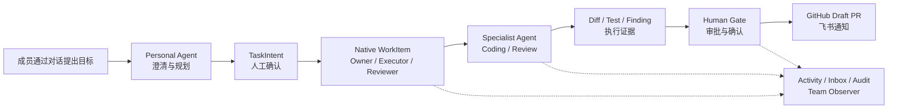
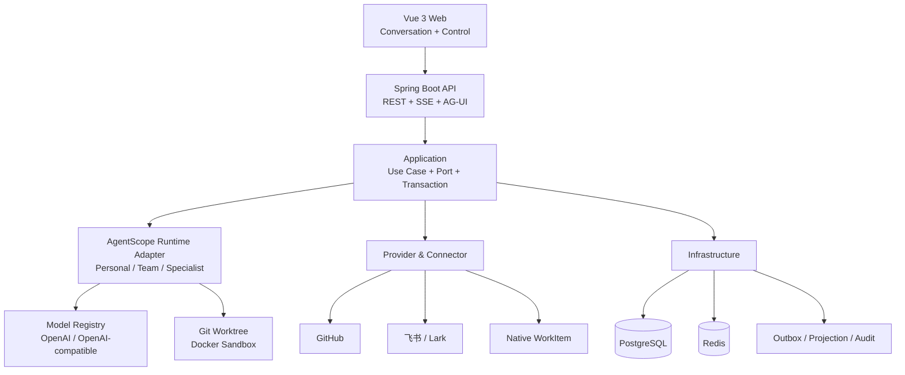

<p align="center">
  
</p>

<h1 align="center">CrewScope</h1>

<p align="center">
  面向技术团队的协作式 AI 工作执行平台<br>
  <sub>Team-collaborative AI work execution, powered by AgentScope Java 2.0</sub>
</p>

<p align="center">
  <a href="https://github.com/zhangkaixuan01/crewscope/actions/workflows/ci.yml"></a>
  <a href="LICENSE"></a>
  
  
  
  
</p>

CrewScope 将技术团队的对话目标转化为可执行、可协作、可追踪的工作闭环。每位成员拥有代表自己的 Personal Agent；Team Agent 提供共享团队视野；Coding、Reviewer 等 Specialist Agent 承担专业执行；人始终负责目标、授权、Review 和最终决策。

当前 **Team Beta MVP** 已完成 M0–M7 全部里程碑，[M6 MVP Release Gate](docs/testing/M6-Q04-MVP-Release-Gate.md) 已正式关闭，[M7 开放用户体系 Release Gate](docs/testing/M7-Q04-Release-Gate.md) 的本机与 Linux amd64 Server RC 结论均为 `PASS`。平台提供正式注册、登录、服务端 Session、首次 Team Onboarding、账号安全和团队邀请入口，并已通过 OPEN、INVITE_ONLY、DISABLED 三种注册 Profile 的真实生产链路验证。


## 核心工作流



## 核心能力

| 能力 | 说明 |
|---|---|
| 对话式工作执行 | 从 Conversation、澄清问题和 TaskIntent 进入 Native WorkItem 与持久化 TaskExecution |
| 团队协作 | 明确 Owner、Executor、Gate Reviewer、Handoff、Takeover 与同级 Review，成员共享工作上下文 |
| 原生 Agent Runtime | 基于 AgentScope Java `HarnessAgent`、Model、Toolkit、Skill、Middleware、State 和 AG-UI 构建 Personal、Team 与 Specialist Agent |
| Coding 闭环 | Git 镜像与 Worktree、Docker Sandbox、计划版本、Checkpoint、DiffArtifact、TestEvidence 和 Draft PR |
| Human-in-the-loop | 高风险外部副作用进入 PlannedAction、授权、Human Gate、Receipt 与 Reconcile 链路 |
| Provider 架构 | 内置 Native WorkItem、GitHub 与飞书 Provider；模型支持 OpenAI 及 OpenAI-compatible Adapter，可继续扩展企业系统 |
| 团队可观测 | Activity、个人 Inbox、Audit Explorer、Team Observer、Operations、SSE 恢复、OTel 与 Prometheus |
| 可靠与可恢复 | Outbox、幂等、Lease/Fencing、Projection Generation、Dead Letter、备份恢复与故障收敛 |

## Agent 协作模型

- **Personal Agent**：代表成员理解目标、维护对话上下文、生成 TaskIntent，并编排个人工作。
- **Team Agent / Team Observer**：使用团队或组织级连接，提供只读的团队进度、阻塞和风险汇总。
- **Specialist Agent**：执行 Coding、Reviewer 等专业任务；内置类型提供稳定合同，用户可通过 AgentTemplate 创建受控的自定义类型。
- **Human Member**：拥有工作目标与责任边界，负责授权、Review、确认、接管和最终交付决策。

Personal 与 Specialist Agent 可绑定个人模型连接和个人 Provider 连接；团队级 Agent 使用团队或组织连接。运行时会固定模型、凭据版本、Tool Surface、Skill Bundle 和 Agent 配置哈希，避免执行过程中发生隐式漂移。

## 系统架构



### 工程模块

| 模块 | 职责 |
|---|---|
| `crewscope-domain` | 领域模型、状态机、权限与稳定业务不变量 |
| `crewscope-application` | 用例、Port、事务边界、命令与查询服务 |
| `crewscope-agentscope` | AgentScope Java Runtime、Agent、Model、Tool、Skill 与 Middleware 适配 |
| `crewscope-integration` | GitHub、飞书、Native WorkItem 等 Provider 与 Connector |
| `crewscope-infrastructure` | PostgreSQL、Redis、Outbox、Projection、凭据与持久化实现 |
| `crewscope-server` | Spring Boot 装配、REST、SSE、AG-UI、安全与运维端点 |
| `crewscope-web` | Vue 3 团队工作台、对话模式与传统管理模式 |

## 技术栈

- Java 17、Spring Boot 4.0.6、Maven
- AgentScope Java 2.0.0
- PostgreSQL 17、Redis 7.4、Flyway
- Vue 3、TypeScript、Vite、pnpm、Vitest、Playwright、Histoire
- Docker Compose、OpenTelemetry、Prometheus

## 运行与部署方式

| 方式 | 适用场景 | 入口与安全边界 |
|---|---|---|
| Team Beta Demo | 本机体验、功能验证、开发联调 | 从源码构建，默认 `OPEN` 注册，通过 `http://127.0.0.1:8080` 访问，不用于公网 |
| 源码开发 | 后端或前端单独调试 | API `localhost:8080`，Vite `localhost:5173`，基础设施由 Docker Compose 提供 |
| Team Beta 单机部署 | 内部团队试用、受控的单机生产环境 | 使用不可变镜像、外部 Secret、HTTPS、Secure Cookie，公网只开放 80/443 |

正式 Compose 固定运行 PostgreSQL、Redis、API、Worker、Web、OpenTelemetry Collector 和 Prometheus 七个服务。Web 是唯一宿主入口并只绑定 `127.0.0.1`；API、Worker、数据库、Redis、Prometheus 和 OTel 都不发布宿主端口。

> GitHub Actions 会验证并扫描 Backend/Web 镜像，但当前不会替部署方发布镜像。正式部署前需要把两个镜像推送到自己的 Registry，并在 Operator 环境文件中填写不可变的 `@sha256:` Digest。

## 本地 Demo

本地 Demo 是首次体验 CrewScope 的推荐方式。需要可用的 Docker Engine、Docker Compose v2、OpenSSL，以及用于首次拉取基础镜像和依赖的网络连接。建议至少提供 4 核 CPU、8 GB 内存和 20 GB 可用磁盘；首次构建耗时取决于 Maven、pnpm 和镜像下载速度。

准备 Docker 和 OpenSSL，在仓库根目录执行：

```bash
./deploy/team-beta/demo.sh up
```

脚本会生成本地随机 Secret，构建并启动 PostgreSQL、Redis、API、Worker、Web、OpenTelemetry Collector 和 Prometheus。启动完成后访问：

```text
http://127.0.0.1:8080
```

Demo 使用 `OPEN` 注册模式。普通用户可以直接打开：

```text
http://127.0.0.1:8080/register
```

注册后会进入首次 Team Onboarding，并创建默认 Personal Agent。Demo 同时预置一个 Operator 账号；通过 `http://127.0.0.1:8080/login` 使用用户名 `crewscope-monitor` 登录，随机密码保存在：

```text
deploy/team-beta/.runtime/secrets/bootstrap_password
```

`crewscope-prometheus` 及 `monitoring_password` 只用于 Prometheus 机器抓取，不能登录 Web 或访问业务 API。邀请新成员时，由具备成员管理权限的用户在 Team 成员页创建一次性链接；链接会进入公开 `/invite` 页面，不在邀请列表或浏览器持久化中保存明文 Token。

查看状态、日志或停止服务：

```bash
./deploy/team-beta/demo.sh status
./deploy/team-beta/demo.sh logs
./deploy/team-beta/demo.sh down
```

`down` 会保留本地数据与 Secret，便于下次继续体验。真实模型、GitHub 和飞书连接需要进入对应管理页面单独配置。

需要切换注册策略时执行：

```bash
./deploy/team-beta/demo.sh set-registration-mode OPEN
./deploy/team-beta/demo.sh set-registration-mode INVITE_ONLY
./deploy/team-beta/demo.sh set-registration-mode DISABLED
```

`reset` 会删除该 Demo Compose Project 的数据库、Redis 和 Prometheus Volume，属于破坏性操作；运行目录中的外部 Secret 与绑定目录仍会保留，不等同于安全擦除整个运行目录。

## Team Beta 单机部署

### 1. 宿主机与网络

发布证据使用 Linux amd64、8 vCPU、16 GB 内存和至少 100 GiB 磁盘，推荐 200 GiB。宿主机需要 Docker Engine、Docker Compose v2、Git、OpenSSL、Node.js 24、pnpm 11、JDK 17、`jq`、`tar` 和 `gzip`。Worker 会挂载 Docker Socket，因此应部署在专用主机，不与不受信任的工作负载混用。

云安全组或宿主机防火墙的入站规则建议为：

| 端口 | 来源 | 用途 |
|---|---|---|
| TCP 22 | 管理员固定 IP 或受控堡垒机 | SSH 运维；不建议向全网开放 |
| TCP 80 | 需要访问的公网或企业网段 | HTTP 跳转 HTTPS，也可在证书签发后关闭 |
| TCP 443 | 需要访问的公网或企业网段 | CrewScope HTTPS 入口 |

不要开放 `5432`、`6379`、`8080`、`8081`、`9090`、`4317` 或 `4318`。正式 Web 容器只监听宿主机环回地址，因此直接访问 `公网IP:8080` 不会生效，也不应修改为对公网监听来绕过 TLS。

### 2. 不可变镜像

使用 [Backend Dockerfile](deploy/team-beta/backend.Dockerfile) 和 [Web Dockerfile](deploy/team-beta/web.Dockerfile) 为 `linux/amd64` 构建镜像，推送到部署方控制的 Registry。记录 Registry 返回的两个内容摘要，Operator 环境文件必须使用以下形式，不能只写可漂移的 Tag：

```bash
crewscope_revision="$(git rev-parse HEAD)"
crewscope_registry="registry.example.com/crewscope"

docker buildx build \
  --platform linux/amd64 \
  --file deploy/team-beta/backend.Dockerfile \
  --tag "${crewscope_registry}/backend:${crewscope_revision}" \
  --push .

docker buildx build \
  --platform linux/amd64 \
  --file deploy/team-beta/web.Dockerfile \
  --tag "${crewscope_registry}/web:${crewscope_revision}" \
  --push .

docker buildx imagetools inspect "${crewscope_registry}/backend:${crewscope_revision}"
docker buildx imagetools inspect "${crewscope_registry}/web:${crewscope_revision}"
```

将示例 Registry 替换为实际地址。构建应从干净、已审阅的 Git Revision 执行，Backend 与 Web 使用同一个 Revision 发布；不要把本地 `.env`、Secret 或运行目录加入构建上下文。

```dotenv
CREWSCOPE_BACKEND_IMAGE=registry.example.com/crewscope/backend@sha256:<64-hex-digest>
CREWSCOPE_WEB_IMAGE=registry.example.com/crewscope/web@sha256:<64-hex-digest>
```

私有 Registry 需要先在宿主机执行相应的 `docker login`。部署前可运行 `docker pull <image@digest>`，确认宿主机能够解析并拉取两个摘要。

### 3. Operator 配置与 Secret

从 [Team Beta 环境变量模板](deploy/team-beta/.env.example) 创建权限为 `0600` 的绝对路径配置文件，例如 `/etc/crewscope/team-beta.env`。至少替换镜像摘要、数据/备份目录、Organization UUID、Runtime Principal UUID、Docker Socket GID、Git Revision 和恢复 Schema 坐标。

按照 [Secret 文件说明](deploy/team-beta/secrets.example/README.md) 在 `CREWSCOPE_SECRETS_ROOT` 创建全部 Secret。模型 API Key、GitHub Token 和飞书 Secret 不写入 Operator 环境文件或 Compose 文件，而是在应用管理页面中单向录入。Secret 准备完成后，在仓库根目录执行：

```bash
sudo ./deploy/team-beta/operations/prepare-secret-permissions.sh /etc/crewscope/team-beta.env
node scripts/check-team-beta-deployment.mjs
docker compose \
  --env-file /etc/crewscope/team-beta.env \
  -p crewscope-team-beta \
  -f deploy/team-beta/compose.yaml \
  config --quiet
```

上述检查不会替代 Secret 备份。`credential_keys`、Cursor/Token Key 和备份口令必须由部署方独立保存；丢失密钥可能导致已保存凭据、游标、待执行任务或备份无法恢复。

### 4. 启动与 HTTPS

```bash
docker compose \
  --env-file /etc/crewscope/team-beta.env \
  -p crewscope-team-beta \
  -f deploy/team-beta/compose.yaml \
  up --detach --wait

docker compose \
  --env-file /etc/crewscope/team-beta.env \
  -p crewscope-team-beta \
  -f deploy/team-beta/compose.yaml \
  ps
```

七个服务都应进入 `healthy`。使用 [宿主机 Nginx TLS 示例](deploy/team-beta/nginx-host-tls.conf.example) 将域名的 80/443 转发至 `127.0.0.1:8080`，替换示例域名和证书路径后再开放公网。正式 Profile 强制 Secure Cookie，必须通过受信任域名和 HTTPS 访问；仅使用公网 IP 或 HTTP 会导致浏览器无法建立正式 Session。

推荐用以下入口完成验收：

```text
https://crewscope.example.com/healthz
https://crewscope.example.com/login
https://crewscope.example.com/register
```

默认注册策略是 `INVITE_ONLY`。首次启动会幂等创建部署 Organization、Runtime Principal、Operator 账号和非秘密模型目录，不会生成可用的模型连接或测试 API Key。Operator 用户名默认为 `crewscope-monitor`，密码来自外部 `bootstrap_password` Secret；登录后在“模型与凭证”页面创建 USER、TEAM 或 ORGANIZATION 连接。

### 5. 升级、备份与排障

升级前先创建 Release 备份，构建并扫描新镜像，再只修改 Operator 环境文件中的镜像 Digest 与 Git Revision：

```bash
./deploy/team-beta/operations/backup.sh /etc/crewscope/team-beta.env release

docker compose \
  --env-file /etc/crewscope/team-beta.env \
  -p crewscope-team-beta \
  -f deploy/team-beta/compose.yaml \
  pull

docker compose \
  --env-file /etc/crewscope/team-beta.env \
  -p crewscope-team-beta \
  -f deploy/team-beta/compose.yaml \
  up --detach --wait
```

API 启动时执行 Flyway 迁移。镜像回退不代表数据库自动降级；只有旧镜像明确支持当前 Schema 时才可以回退，否则使用已验证的空目标恢复流程。

常用排障命令：

```bash
docker compose \
  --env-file /etc/crewscope/team-beta.env \
  -p crewscope-team-beta \
  -f deploy/team-beta/compose.yaml \
  ps

docker compose \
  --env-file /etc/crewscope/team-beta.env \
  -p crewscope-team-beta \
  -f deploy/team-beta/compose.yaml \
  logs --tail 200 api worker web
```

| 现象 | 优先检查 |
|---|---|
| 登录、注册或 Session 恢复失败 | `api`、`redis` 是否 Healthy；是否通过 HTTPS 域名访问；宿主机 Nginx 是否覆盖正确的 `Host` 和 `X-Forwarded-*` |
| 页面提示 Template 元数据不可用 | Backend/Web 是否来自同一 Git Revision；API 是否已完成 Flyway；不要只升级 Web |
| “没有可用 Provider” | API 启动日志与平台模型目录是否完成初始化；目录存在后仍需在页面创建模型连接并录入 Key |
| Agent 一直等待或 Worker 不健康 | Worker 日志、Docker Socket GID、数据目录 Owner、磁盘空间和 Sandbox 镜像拉取能力 |
| GitHub/飞书动作失败 | Connection 健康状态、最小权限、Team/Project Binding、Action/Notification Worker 与 Inbox 回执 |

日志对外发送前应移除密码、Token、Key Material、模型正文、成员信息和宿主路径。完整的备份、保留、空目标恢复、故障处理和发布演练步骤见 [Team Beta 单机运维手册](docs/runbooks/Team-Beta单机运维手册.md)。

## 从源码开发

### 环境要求

- JDK 17 或更高版本，Language level 使用 Java 17
- Docker / Docker Compose
- Node.js 24、pnpm 11
- Git

### 启动后端

```bash
cp .env.example .env
docker compose up -d postgres redis

set -a
. ./.env
set +a

./mvnw -pl crewscope-server -am clean package -DskipTests
java -jar crewscope-server/target/crewscope-server-0.1.0-SNAPSHOT.jar
```

根目录 `.env.example` 面向 API 与 Worker 源码调试，默认不建立可供浏览器使用的占位身份。需要验证完整账号、Session、Onboarding 和邀请流程时，使用上面的 Team Beta Demo 入口；不要把 Bootstrap 兼容凭证或 Prometheus 机器凭证作为业务登录方式。

### 启动前端

```bash
cd crewscope-web
nvm use
pnpm install --frozen-lockfile
pnpm dev
```

访问 `http://localhost:5173`。Vite 会将 `/api` 与 `/actuator` 代理到 `http://localhost:8080`。

后端健康与系统信息：

```text
GET http://localhost:8080/actuator/health
GET http://localhost:8080/api/v1/system/info
```

服务可以在未配置模型时以 API-only 方式启动。执行 Agent 任务前，在“模型与凭证”页面配置模型厂商、模型和个人或团队连接；OpenAI-compatible Adapter 可接入 DeepSeek 等兼容服务。

## 质量与发布证据

Team Beta MVP 采用固定攻击集、故障集、真实 Linux Release Candidate 和跨平台视觉基线验收：

| 门禁 | 结果 |
|---|---:|
| M7 Maven 全量回归 | `3056 / 3056`；547 个 Suite，零失败、零错误、零跳过 |
| M7 Web Vitest / Coverage | `652 / 652`；Statements `80.18%`、Branches `73.91%`、Functions `82.72%`、Lines `83.90%` |
| M7 Web Playwright / Visual / Axe | 桌面与 390px 共 `240 / 240` |
| M7 Histoire | `21` Stories / `153` Variants |
| M7 Web 敏感字段门禁 | `78` 个生产文件 / `21` 个 Stories |
| M7 固定认证攻击集 | `128 / 128` 阻断 |
| M7 固定并发故障集 | `72 / 72` 收敛 |
| M7 双用户生产 E2E | Desktop/Narrow `2 / 2 passed` |
| M7 注册 Profile E2E | OPEN → INVITE_ONLY → DISABLED，`1 / 1 passed` |
| M7 Linux amd64 Server RC | 原生镜像构建、V30→V32、Operator 登录、API 重启 Session 与 Secure Cookie 合同通过 |
| Canonical 生产负载 | 三轮各 `5,960` 请求，错误率 `0` |
| 空目标恢复 | RPO `26s`、RTO `71s` |
| 供应链门禁 | 本机生产依赖无已知漏洞；CI 强制 OSV、Backend/Web Trivy |

完整发布证据见 [M7-Q04 Release Gate](docs/testing/M7-Q04-Release-Gate.md)，前端收口证据见 [M7-F08 认证与 Onboarding 前端收口](docs/testing/M7-F08-认证与Onboarding前端收口.md)，持续集成状态见 [GitHub Actions](https://github.com/zhangkaixuan01/crewscope/actions/workflows/ci.yml)。

本地执行完整 Release Gate：

```bash
./scripts/m7-release-gate.sh local-preflight
```

该门禁会运行完整后端、前端、Docker、浏览器、评测和文档检查，耗时与资源占用均明显高于普通单元测试。

## 文档

- [产品与技术设计](docs/CrewScope-团队协作式AI工作执行平台设计文档.md)
- [实施计划](docs/CrewScope-实施计划.md)
- [前端设计规范](docs/CrewScope-前端设计规范.md)
- [里程碑执行清单](docs/plans/README.md)
- [架构决策记录](docs/adr/README.md)
- [Team Beta 运维手册](docs/runbooks/Team-Beta单机运维手册.md)

## 当前边界

当前交付形态为可自部署的 Team Beta MVP，覆盖技术团队从对话、任务、Coding、Review、Human Gate 到 GitHub/飞书交付的完整闭环，并提供经过验证的 Linux amd64 单机七服务部署、HTTPS、外部 Secret、备份与空目标恢复合同。高可用生产集群、Kubernetes、跨区域容灾、多组织 OIDC、MFA、插件市场和更多企业 Provider 属于后续演进范围。

## 参与贡献

欢迎通过 Issue 提交使用反馈、Provider 需求和缺陷报告，也欢迎提交 Pull Request。代码变更应补充必要注释与自动化测试，并通过对应里程碑的 Release Gate。

## 许可证

CrewScope 基于 [Apache License 2.0](LICENSE) 开源，允许商业使用、修改和分发，使用与分发时须遵守许可证条款。
