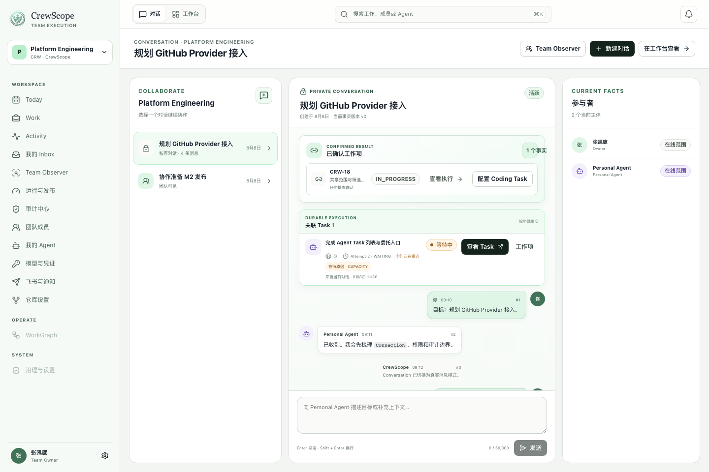
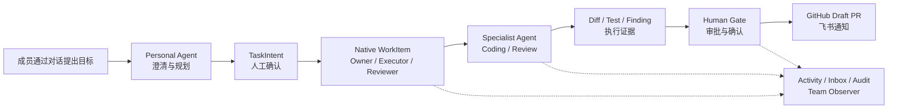
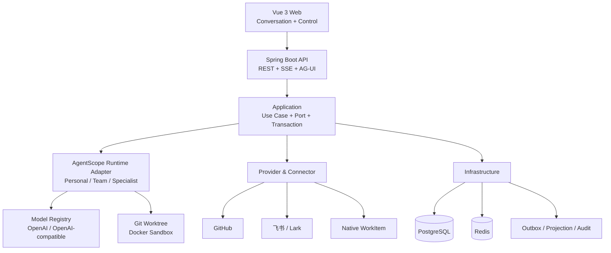

<p align="center">
  
</p>

<h1 align="center">CrewScope</h1>

<p align="center">
  面向技术团队的协作式 AI 工作执行平台<br>
  <sub>Team-collaborative AI work execution, powered by AgentScope Java 2.0</sub>
</p>

<p align="center">
  <a href="https://github.com/zhangkaixuan01/crewscope/actions/workflows/ci.yml"></a>
  <a href="LICENSE"></a>
  
  
  
  
</p>

CrewScope 将技术团队的对话目标转化为可执行、可协作、可追踪的工作闭环。每位成员拥有代表自己的 Personal Agent；Team Agent 提供共享团队视野；Coding、Reviewer 等 Specialist Agent 承担专业执行；人始终负责目标、授权、Review 和最终决策。

当前 **Team Beta MVP** 已完成 M0–M6 全部里程碑，MVP Release Gate 结论为 [`PASS`](docs/testing/M6-Q04-MVP-Release-Gate.md)。



## 核心工作流



## 核心能力

| 能力 | 说明 |
|---|---|
| 对话式工作执行 | 从 Conversation、澄清问题和 TaskIntent 进入 Native WorkItem 与持久化 TaskExecution |
| 团队协作 | 明确 Owner、Executor、Gate Reviewer、Handoff、Takeover 与同级 Review，成员共享工作上下文 |
| 原生 Agent Runtime | 基于 AgentScope Java `HarnessAgent`、Model、Toolkit、Skill、Middleware、State 和 AG-UI 构建 Personal、Team 与 Specialist Agent |
| Coding 闭环 | Git 镜像与 Worktree、Docker Sandbox、计划版本、Checkpoint、DiffArtifact、TestEvidence 和 Draft PR |
| Human-in-the-loop | 高风险外部副作用进入 PlannedAction、授权、Human Gate、Receipt 与 Reconcile 链路 |
| Provider 架构 | 内置 Native WorkItem、GitHub 与飞书 Provider；模型支持 OpenAI 及 OpenAI-compatible Adapter，可继续扩展企业系统 |
| 团队可观测 | Activity、个人 Inbox、Audit Explorer、Team Observer、Operations、SSE 恢复、OTel 与 Prometheus |
| 可靠与可恢复 | Outbox、幂等、Lease/Fencing、Projection Generation、Dead Letter、备份恢复与故障收敛 |

## Agent 协作模型

- **Personal Agent**：代表成员理解目标、维护对话上下文、生成 TaskIntent，并编排个人工作。
- **Team Agent / Team Observer**：使用团队或组织级连接，提供只读的团队进度、阻塞和风险汇总。
- **Specialist Agent**：执行 Coding、Reviewer 等专业任务；内置类型提供稳定合同，用户可通过 AgentTemplate 创建受控的自定义类型。
- **Human Member**：拥有工作目标与责任边界，负责授权、Review、确认、接管和最终交付决策。

Personal 与 Specialist Agent 可绑定个人模型连接和个人 Provider 连接；团队级 Agent 使用团队或组织连接。运行时会固定模型、凭据版本、Tool Surface、Skill Bundle 和 Agent 配置哈希，避免执行过程中发生隐式漂移。

## 系统架构



### 工程模块

| 模块 | 职责 |
|---|---|
| `crewscope-domain` | 领域模型、状态机、权限与稳定业务不变量 |
| `crewscope-application` | 用例、Port、事务边界、命令与查询服务 |
| `crewscope-agentscope` | AgentScope Java Runtime、Agent、Model、Tool、Skill 与 Middleware 适配 |
| `crewscope-integration` | GitHub、飞书、Native WorkItem 等 Provider 与 Connector |
| `crewscope-infrastructure` | PostgreSQL、Redis、Outbox、Projection、凭据与持久化实现 |
| `crewscope-server` | Spring Boot 装配、REST、SSE、AG-UI、安全与运维端点 |
| `crewscope-web` | Vue 3 团队工作台、对话模式与传统管理模式 |

## 技术栈

- Java 17、Spring Boot 4.0.6、Maven
- AgentScope Java 2.0.0
- PostgreSQL 17、Redis 7.4、Flyway
- Vue 3、TypeScript、Vite、pnpm、Vitest、Playwright、Histoire
- Docker Compose、OpenTelemetry、Prometheus

## 快速体验

准备 Docker 和 OpenSSL，在仓库根目录执行：

```bash
./deploy/team-beta/demo.sh up
```

脚本会生成本地随机 Secret，构建并启动 PostgreSQL、Redis、API、Worker、Web、OpenTelemetry Collector 和 Prometheus。启动完成后访问：

```text
http://127.0.0.1:8080
```

登录用户为 `crewscope-monitor`，随机密码保存在：

```text
deploy/team-beta/.runtime/secrets/bootstrap_password
```

查看状态、日志或停止服务：

```bash
./deploy/team-beta/demo.sh status
./deploy/team-beta/demo.sh logs
./deploy/team-beta/demo.sh down
```

`down` 会保留本地数据与 Secret，便于下次继续体验。真实模型、GitHub 和飞书连接需要进入对应管理页面单独配置。

## 从源码开发

### 环境要求

- JDK 17 或更高版本，Language level 使用 Java 17
- Docker / Docker Compose
- Node.js 24、pnpm 11
- Git

### 启动后端

```bash
cp .env.example .env
docker compose up -d postgres redis

set -a
. ./.env
set +a

./mvnw -pl crewscope-server -am clean package -DskipTests
java -jar crewscope-server/target/crewscope-server-0.1.0-SNAPSHOT.jar
```

使用 `.env.example` 时，本地账号为 `crewscope / change-me`。该账号仅用于本机开发，部署环境必须设置独立强密码。

### 启动前端

```bash
cd crewscope-web
nvm use
pnpm install --frozen-lockfile
pnpm dev
```

访问 `http://localhost:5173`。Vite 会将 `/api` 与 `/actuator` 代理到 `http://localhost:8080`。

后端健康与系统信息：

```text
GET http://localhost:8080/actuator/health
GET http://localhost:8080/api/v1/system/info
```

服务可以在未配置模型时以 API-only 方式启动。执行 Agent 任务前，在“模型与凭证”页面配置模型厂商、模型和个人或团队连接；OpenAI-compatible Adapter 可接入 DeepSeek 等兼容服务。

## 质量与发布证据

Team Beta MVP 采用固定攻击集、故障集、真实 Linux Release Candidate 和跨平台视觉基线验收：

| 门禁 | 结果 |
|---|---:|
| Maven 全量回归 | `2554 / 2554` |
| Vitest | `450 / 450` |
| Playwright / Visual / Axe | macOS 与 Linux 均 `180 / 180` |
| 固定安全攻击集 | `110 / 110` 阻断 |
| 固定故障与恢复集 | `121 / 121` 收敛 |
| Canonical 生产负载 | 三轮各 `5,960` 请求，错误率 `0` |
| 空目标恢复 | RPO `26s`、RTO `71s` |
| 供应链门禁 | 固定 Digest、OSV、Backend/Web Trivy 全部通过 |

完整证据见 [M6-Q04 MVP Release Gate](docs/testing/M6-Q04-MVP-Release-Gate.md) 和 [GitHub Actions](https://github.com/zhangkaixuan01/crewscope/actions/workflows/ci.yml)。

本地执行完整 Release Gate：

```bash
./scripts/m6-release-gate.sh local-preflight
```

该门禁会运行完整后端、前端、Docker、浏览器、评测和文档检查，耗时与资源占用均明显高于普通单元测试。

## 文档

- [产品与技术设计](docs/CrewScope-团队协作式AI工作执行平台设计文档.md)
- [实施计划](docs/CrewScope-实施计划.md)
- [前端设计规范](docs/CrewScope-前端设计规范.md)
- [里程碑执行清单](docs/plans/README.md)
- [架构决策记录](docs/adr/README.md)
- [Team Beta 运维手册](docs/runbooks/Team-Beta单机运维手册.md)

## 当前边界

当前交付形态为可自部署的 Team Beta MVP，覆盖技术团队从对话、任务、Coding、Review、Human Gate 到 GitHub/飞书交付的完整闭环。正式生产部署、Kubernetes、跨区域容灾、多组织 OIDC、插件市场和更多企业 Provider 属于后续演进范围。

## 参与贡献

欢迎通过 Issue 提交使用反馈、Provider 需求和缺陷报告，也欢迎提交 Pull Request。代码变更应补充必要注释与自动化测试，并通过对应里程碑的 Release Gate。

## 许可证

CrewScope 基于 [Apache License 2.0](LICENSE) 开源，允许商业使用、修改和分发，使用与分发时须遵守许可证条款。
