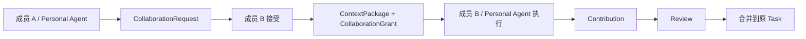
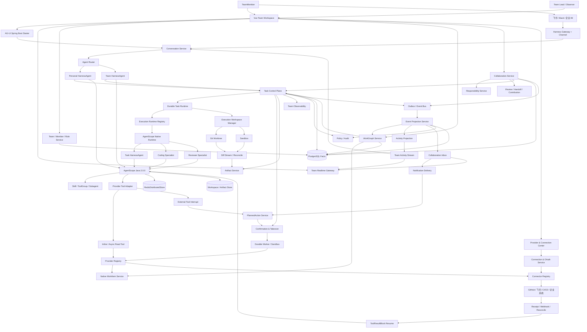
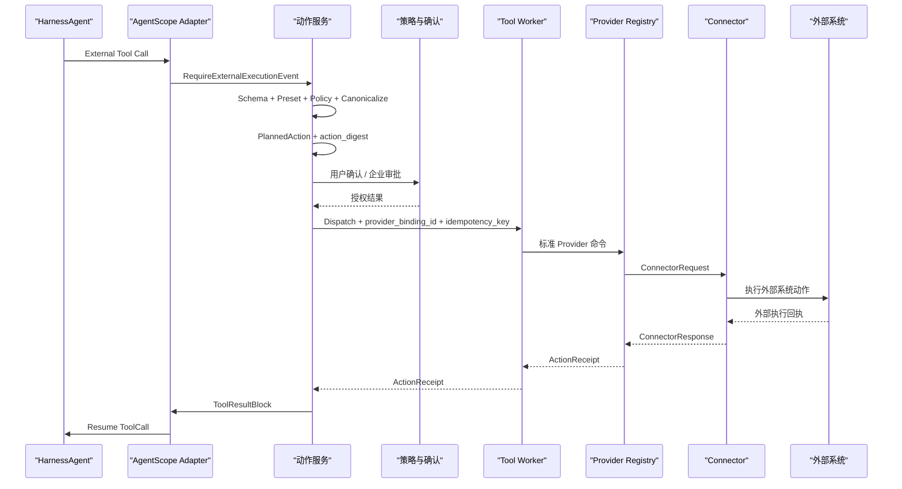

# CrewScope 团队协作式 AI 工作执行平台设计文档

> 文档版本：v4.0<br>
> 产品名称：`CrewScope`  
> 工程仓库：`crewscope-java`  
> AgentScope Java：`2.0.0 GA`（Git Tag：`v2.0.0`，Commit：`44c304ec84d5fbd8588c1af8bc71b1edb9663380`）  
> 技术栈：Java 17、Spring Boot 4.0.4、AgentScope Java 2.0.0、Vue 3、PostgreSQL、Redis、Docker/Kubernetes

## 1. 产品定义

CrewScope 是面向技术团队的协作式 AI 工作执行平台。

`Crew` 表示成员、Personal Agent、Team Agent 和 Specialist Agent 组成的执行团队；`Scope` 表示共享工作上下文、能力范围、责任边界与治理视野。

每个成员拥有 Personal Agent，团队拥有 Team Workspace、Team Agent、共享 WorkItem、ProviderBinding、Skill、Artifact、责任关系和活动时间线。成员、个人 Agent 与团队 Agent 围绕同一个工作目标分工、协作、Review、Handoff 和交付。

CrewScope 把自然语言目标转换为可观察、可协作、可确认、可暂停、可恢复的跨系统任务。AgentScope 承载对话、推理、规划、工具和多 Agent 运行；CrewScope 承载团队、责任、协作、任务、身份授权、耐久执行、制品、观测和审计。

CrewScope 以 AgentScope Java 构建原生执行 Agent。原生 Coding Agent 直接理解 WorkItem、责任、验收标准、仓库范围、PolicySnapshot 和 Review Gate，在隔离的 Git Worktree 与 Sandbox 中完成代码分析、修改、测试、自检和结构化交付。

CrewScope 的核心结构：

```text
Team Workspace
  -> 创建 WorkItem 并指定 Owner
  -> 成员通过对话发起 Agent Task
  -> Personal Agent / Team Agent 制定计划
  -> AgentScope 原生 Specialist Agent 执行分析、编码、测试和复核
  -> 成员、Agent 和子 Agent 并行贡献
  -> Review、Handoff、确认和审批
  -> Provider 执行跨系统动作
  -> 团队实时观测责任、进度、成本和风险
  -> 交付 Artifact 并形成完整审计
  -> 任务经验沉淀为 Team Skill 和 Team Memory
```

### 1.1 目标用户

首批团队包括研发团队、平台工程团队、SRE/DevOps 团队、测试团队和技术产品团队。

核心成员：

- 软件工程师：WorkItem 分析、代码修改、测试、PR 和研发协作；
- 技术负责人：责任分配、项目进度、风险观测、Review 和交付质量；
- SRE/DevOps：故障调查、发布检查、Runbook 执行和事件复盘；
- 测试工程师：测试计划、缺陷分析、环境检查和结果同步；
- 技术产品经理：需求信息汇总、WorkItem 跟进、协作组织和发布说明；
- 安全与管理人员：权限策略、动作审批、成本治理和审计检索。

### 1.2 产品形态

CrewScope 采用个人执行、团队协作与企业治理结合的产品形态。

成员拥有：

- Personal Agent、私有 Conversation、Memory 和 Skill；
- 用户级 ProviderBinding 和 Connection；
- 自己负责、参与和关注的 WorkItem 与 Task；
- 写操作确认权和任务接管权。

团队拥有：

- Team Workspace、WorkProject、WorkItem 和 WorkGraph；
- Team Agent、Team Skill、Team Memory 和共享 Artifact；
- Owner、Executor、Collaborator、Reviewer、Approver 和 Watcher；
- CollaborationRequest、Contribution、Review 和 Handoff；
- 团队级 ProviderBinding、Service Account 和 PolicyPack；
- 任务看板、执行观测、活动时间线和审计记录。

企业提供：

- 统一登录、组织关系和身份映射；
- Provider、Connector 与 Plugin 市场；
- 模型、工具、数据和网络策略；
- 高风险动作审批、审计和成本治理；
- 私有化部署与企业内部系统接入。

### 1.3 核心产品价值

1. 一个 Team Workspace 连接成员、Agent 和企业系统。
2. 一张 WorkGraph 统一 WorkItem、Task、Step、责任、依赖、Artifact 和外部资源。
3. 一套责任模型明确结果负责人、当前执行者、协作者、Reviewer、Approver 和 Watcher。
4. 一套横向协作机制支持请求协助、邀请参与、Review、Handoff 和 Takeover。
5. 一个任务运行时承载跨系统长任务、并行贡献和后台恢复。
6. 一个团队观测面实时展示进度、阻塞、风险、成本和 Provider 状态。
7. 一条审计链记录成员、Agent、Provider、身份、动作、确认和外部回执。
8. 一套 Provider、Plugin 和 Skill 机制连接系统并沉淀团队工作方法。
9. 一套 Team Memory 和 Skill Promotion 机制形成团队知识资产。
10. 一组 AgentScope 原生执行 Agent 把责任、权限、代码上下文、Review 和交付证据纳入统一运行时。

AgentScope Java 2.0.0 提供智能运行时：

- `HarnessAgent` 和 `ReActAgent`；
- 多轮对话与类型化事件流；
- Structured Output；
- Plan Mode 和 Agent 任务清单；
- Toolkit、Permission 和 External Tool；
- AgentState、DistributedStore、Workspace 和 Sandbox；
- Memory、Compaction 和 Tool Result Eviction；
- Skill、ToolGroup、MCP 和子 Agent；
- AG-UI、Gateway 和企业通信 Channel；
- Interrupt、Graceful Shutdown 和 Pending Tool Recovery；
- 模型注册、重试、Fallback 和 OpenTelemetry。

CrewScope 提供任务执行控制面：

- Team、TeamMember、Workspace、WorkItem、Responsibility、Collaboration、Task、Action、Artifact 和 Audit 领域模型；
- 计划版本、策略版本和工具版本；
- 耐久调度、租约、检查点、Outbox 和 Webhook；
- 用户委托授权、企业 IAM、RBAC/ABAC 和职责分离；
- 动作幂等、结果对账、人工接管和任务恢复；
- 团队看板、任务观测、协作时间线、确认、制品和审计工作台。

### 1.4 产品竞争力

CrewScope 的产品竞争力来自团队执行网络：

1. 共享工作上下文：WorkGraph 把对话、WorkItem、责任、任务、证据、制品和外部资源组织成团队事实。
2. 责任驱动交付：Owner、Executor、Reviewer 和 Approver 形成清晰的结果责任链。
3. 横向协作协议：成员和 Personal Agent 通过 ContextPackage、CollaborationGrant、Contribution、Review 与 Handoff 完成可控协作。
4. 团队实时观测：负责人查看进度、阻塞、风险、成本、身份、动作和审计；成员查看自己的任务、协作和 Review 队列。
5. 企业执行能力：Provider、Connector、Connection 和 PolicyPack 把 GitHub、飞书与内部系统变成受身份和策略约束的执行能力。
6. 团队知识复利：成功任务沉淀为 Team Skill、Team Memory 和可复用 Artifact，持续提升团队执行效率。
7. 原生可治理 Agent：AgentScope 原生 Agent 在服务端可信责任、PolicySnapshot、任务级身份和结构化交付协议内运行。
8. 受控代码交付：Git Worktree、Sandbox、Diff Stream、Test Evidence、Review Gate、Draft PR 和 ActionReceipt 形成可恢复、可审计的研发闭环。

### 1.5 对话到团队交付

对话是 CrewScope 的统一工作入口。平台根据目标持续性、执行复杂度和协作范围，把对话逐步升级为 Task、WorkItem 和团队协作对象：

```text
问答、解释、搜索和轻量查询
  -> Conversation

后台执行、多步骤计划、工具调用和可恢复运行
  -> Conversation + Task

团队责任、长期跟踪、多人协作和正式交付
  -> Conversation + Task + WorkItem

成员协助
  -> CollaborationRequest + Contribution

正式评审、责任转移和接管
  -> ReviewRequest / Handoff / TakeoverRequest
```

MVP 的首条产品闭环：

```text
团队对话提出研发目标
  -> Agent 建议创建 WorkItem、Owner 和 Reviewer
  -> Task Runtime 领取执行并签发任务级短期身份
  -> Personal Agent 与 Coding Specialist 读取代码并生成计划
  -> 隔离 Git Worktree 与 Sandbox 修改代码、测试并流式生成 Diff
  -> 同级成员完成 Review
  -> Owner 确认源码写操作
  -> GitHub Provider 创建 Draft PR
  -> WorkItem、Activity、Notification 和 Audit 同步更新
```

### 1.6 产品范围

| 范围 | 首期实现 | 后续扩展 |
|---|---|---|
| 交互端 | Web 团队工作台与飞书通知 | Desktop、Mobile 和更多企业 IM |
| Agent Runtime | AgentScope Java 原生 Personal、Task Orchestrator、Coding 与 Reviewer Agent | 经评测接入外部 Coding Runtime Adapter |
| 代码场景 | Java/Spring Boot 仓库的缺陷修复、小功能、测试和 Draft PR | 多语言、复杂重构、预览和发布 |
| Provider | Native WorkItem、GitHub SourceCode、Lark Collaboration | GitLab、Gitee、禅道、TAPD、CI/CD 与可观测系统 |
| 自动化 | 用户发起的对话任务和 Webhook 恢复 | 定时任务、Autopilot 和团队主动工作 |
| 扩展机制 | 内置 Provider 与稳定应用 Port | Plugin 市场、第三方 Connector 和私有扩展仓库 |

首期代码交付到 Draft PR 结束。PR 合并、生产发布和生产变更进入高风险 Provider Action 与后续阶段。

## 2. 建设目标

1. 通过 Team Workspace 聚合成员、Agent、WorkItem、Provider、Skill、Task 和 Artifact。
2. 通过 WorkGraph 表达责任、依赖、协作、贡献、Review、执行和交付关系。
3. 通过 Personal Agent 支持成员执行，通过 Team Agent 支持共享任务和团队自动化。
4. 通过统一责任模型承载 Owner、Executor、Collaborator、Reviewer、Approver 和 Watcher。
5. 通过 CollaborationRequest、Contribution、Review 和 Handoff 支持成员横向协作。
6. 通过内置 WorkItem 管理需求、任务、缺陷、事件、评论和执行关联。
7. 通过 Capability Provider 统一工作项、源码、协作、CI/CD、可观测和运行环境能力。
8. 通过 Connector 承载外部系统的认证、API 与 Webhook。
9. 通过 Plugin 打包 Provider 实现、Connector、Tool、Skill、事件和界面扩展。
10. 通过 AgentScope Java 承载对话、规划、工具编排、上下文治理和多 Agent 协作。
11. 通过确定性控制面承载状态、授权、确认、幂等、恢复、对账和审计。
12. 通过 AG-UI 与团队事件流提供实时执行和协作体验。
13. 通过 RedisDistributedStore、PostgreSQL 和 Outbox 支持长任务跨实例恢复。
14. 通过 Sandbox、短期凭证和网络策略提供隔离执行环境。
15. 通过 Team Skill、Team Memory 和 Artifact 沉淀可审核的团队知识。
16. 通过企业策略层支持 SSO、权限、审批、数据边界和私有化部署。
17. 通过 AgentScope 原生 Coding Agent 与 Reviewer Agent 承载代码分析、修改、测试、自检和结构化交付。
18. 通过 Runtime Port 保持执行内核可扩展，后续按效果、安全和成本评测接入外部 Coding Runtime。
19. 通过 TaskExecution Claim、ExecutionLease、Heartbeat、Retry 和 Recovery 实现多实例耐久执行。
20. 通过 Git Worktree、Diff Stream、Test Evidence 和 Review Gate 实现可审查的代码交付。

## 3. 设计原则

### 3.1 对话驱动

对话承载目标表达、信息澄清、计划协作、成员邀请、过程干预、动作确认、结果交付和后续追问。目标进入后台执行时创建 Task，进入团队责任和长期交付时创建 WorkItem。

### 3.2 Team Workspace 与 WorkGraph

Team Workspace 是共享工作边界。WorkGraph 连接 WorkItem、Task、Step、责任、协作、Artifact、Provider 和外部资源。

### 3.3 责任明确

每个 WorkItem 保持一个 Owner。Task 和 Step 明确 Executor，协作、Review、审批和关注关系使用独立角色记录。

### 3.4 横向协作

成员可以请求协助、邀请参与、创建子任务、提交 Contribution、请求 Review、发起 Handoff 和申请 Takeover。

### 3.5 Personal Agent 与 Team Agent

Personal Agent 使用成员身份和个人上下文。Team Agent 使用团队身份、团队 ProviderBinding、Team Skill 和 Team Policy。

### 3.6 Provider 产生能力

Connection 把用户在外部系统中的身份授权给 CrewScope。ProviderBinding 把统一业务能力绑定到具体 Provider 实现和 Connection。Agent 仅能使用当前用户、当前 Workspace 和当前任务允许的 Provider、工具与资源。

### 3.7 任务承载执行

Task、Step、Action 和 Confirmation 构成可靠执行边界。任务状态以 PostgreSQL 记录为准。

### 3.8 智能与控制分层

AgentScope 负责语义理解、开放式分析、计划生成、工具选择和结果表达。CrewScope 负责连接授权、计划校验、状态迁移、写操作确认、调度和审计。

### 3.9 副作用外部执行

快速只读工具由 AgentScope 直接执行。所有外部副作用统一形成 PlannedAction：Agent 写操作由 External Tool 触发，领域事件驱动的通知和自动化由 Application Command 触发；动作经授权后由耐久 Worker 执行。

### 3.10 人在回路

成员可以查看计划、跟踪步骤、评论、贡献、Review、确认动作、暂停任务、补充信息、修改目标、恢复运行和接管执行。高风险操作同时遵循企业审批策略。

### 3.11 版本固化

任务创建时生成初始 PlanVersion 和 PolicySnapshot，固化 Agent 配置、模型、Prompt、Plugin、Provider、Connector、Skill 和 Tool 版本。计划能力范围、责任主体或 ProviderBinding 变化时生成带父版本的新快照。每次调用和执行引用精确快照，SafetyEnforcementOverlay 实时收紧权限。

### 3.12 最小权限

每次运行仅获得当前组织、Team、成员、角色、Workspace、ProviderBinding、Connection、Task、Step 和目标资源需要的工具与短期身份。

### 3.13 幂等与对账

每个写动作具有稳定幂等键。结果状态为 `UNKNOWN` 时进入外部系统对账流程。

### 3.14 全链路追踪

Team、Workspace、WorkItem、Responsibility、Collaboration、ProviderBinding、Conversation、AgentRun、Task、Action、Confirmation 和 ExternalOperation 共享统一关联链。

### 3.15 AgentScope 原生优先

Personal Agent、Team Agent、Task Orchestrator、Coding Specialist 和 Reviewer Specialist 使用 AgentScope Java 原生运行时。Agent 的 Plan、Todo、ToolCall、Structured Output、Memory、Subagent、Interrupt 和 Resume 直接映射到 CrewScope 任务事实。Runtime Port 保持边界稳定，扩展运行时遵循同一责任、策略、制品和审计协议。

### 3.16 执行工作区隔离

每个代码 TaskExecution 使用独立 Git Worktree、稳定分支、Sandbox 和 Artifact 路径。Workspace Manager 对创建、并发锁、校验、重试、冷恢复、归档和清理负责。Diff Stream 通过文件系统事件、Git 状态和周期对账保持最终一致。

## 4. 核心领域模型

| 概念 | 定义 |
|---|---|
| `Organization` | 企业组织、成员、策略和共享能力边界 |
| `Team` | 成员、角色、资源、策略和协作的团队边界 |
| `TeamMember` | 用户在 Team 中的身份、角色和状态 |
| `TeamRole` | 团队级管理、配置、观测和审计权限集合 |
| `Principal` | 用户、Personal Agent、Team Agent、Specialist Agent 和 Service Principal 的统一行为主体 |
| `Workspace` | `PERSONAL` 或 `TEAM` 类型的长期工作边界 |
| `AgentProfile` | Personal、Team 或 Specialist Agent 的角色、模型、Prompt 和能力配置 |
| `WorkGraph` | 从领域事实生成的 WorkItem、Task、责任、依赖、贡献、Artifact 和外部资源关系读模型 |
| `WorkProject` | WorkItem、成员、代码仓库和项目配置的组织单元 |
| `WorkItem` | 需求、任务、缺陷和事件的长期工作记录 |
| `WorkItemRef` | CrewScope 或外部系统工作项的统一引用 |
| `ResponsibilityAssignment` | 工作对象上的 Owner、Executor、Collaborator、Reviewer、Approver 和 Watcher 关系 |
| `TaskParticipant` | 用户或 Agent 在具体 Task 中的角色、状态和可见范围 |
| `CollaborationRequest` | 成员之间的协助和参与邀请 |
| `ContextPackage` | 向协作者交付的目标、计划、证据、制品、权限和期望贡献快照 |
| `Contribution` | 成员或 Agent 提交的分析、代码、文档、证据、Artifact 和建议 |
| `ReviewRequest` | 对 Plan、Contribution、Artifact 或 Action 的结构化评审 |
| `ReviewDecision` | Reviewer 针对精确 Subject 版本提交的 Finding、结论和 Gate 结果 |
| `Handoff` | Owner 或 Executor 的受控责任移交 |
| `TakeoverRequest` | 成员在阻塞、超时或原责任人不可用时发起的受控接管请求 |
| `InboxItem` | 面向成员的协作、Review、Handoff、Takeover、确认和异常待办投影 |
| `NotificationPreference` | 成员的通知 Channel、免打扰、值班和升级偏好 |
| `NotificationDelivery` | InboxItem 的站内、邮件或协作 Provider 投递记录 |
| `WatchSubscription` | 成员对工作对象的事件订阅和通知偏好 |
| `ActivityEvent` | 面向团队协作的可读活动时间线事件 |
| `Conversation` | 成员与 Agent 的私有或共享持续会话 |
| `Message` | 文本、多模态内容、任务卡片、确认卡片和系统事件 |
| `ConversationTaskLink` | Conversation 与 Task 的多对多关联 |
| `TaskDefinition` | 可选的版本化任务模板和步骤图 |
| `Task` | Agent 为用户执行的一次具体目标 |
| `TaskExecution` | Task 的一次执行尝试 |
| `StepDefinition` | 任务模板中的步骤定义 |
| `StepExecution` | 步骤运行实例和检查点 |
| `ExecutionRuntime` | AgentScope 原生或扩展 Coding Runtime 的能力、版本、健康、并发和运行位置 |
| `ExecutionLease` | Worker 对 TaskExecution 的有期执行所有权；MVP 的 Step 由所属 TaskExecution 串行驱动 |
| `ExecutionWorkspace` | TaskExecution 的 Git Worktree、分支、Sandbox、路径、仓库基线和恢复状态 |
| `PlanVersion` | 校验并确认后的固化执行计划 |
| `PluginDefinition` | Provider 实现、Connector、Tool、Skill、事件和 UI 扩展的发布包 |
| `PluginInstallation` | Plugin 在组织或 Workspace 中的安装实例 |
| `ProviderDefinition` | WorkItem、SourceCode、Collaboration 等稳定能力契约 |
| `ProviderImplementation` | Provider 契约在具体系统上的实现 |
| `ProviderBinding` | Workspace 或 WorkProject 对 Provider 实现和 Connection 的绑定 |
| `ConnectorDefinition` | 外部系统的认证、API、Webhook 和协议定义 |
| `Connection` | 用户、Team 或 Organization 对一个外部系统实例的授权连接 |
| `ConnectionGrant` | Connection 可访问的 Scope、资源和有效期 |
| `AgentRuntimeSession` | CrewScope 与 AgentScope 会话的绑定 |
| `AgentRun` | 一次 Agent 调用、恢复、唤醒或中断 |
| `AgentInterrupt` | Agent 工具确认或外部执行挂起记录 |
| `ToolBinding` | AgentScope Tool、Provider Tool、Provider 实现与 Connector 操作的映射 |
| `SkillBinding` | Skill 来源、版本、可见性和策略绑定 |
| `PlannedAction` | 对外部系统写操作的规范化执行请求 |
| `ActionReceipt` | 外部动作的请求标识、结果、外部版本和对账证据 |
| `Confirmation` | 用户确认或企业审批形成的动作授权事实 |
| `PolicyPack` | Agent、模型、工具、资源、审批、预算和审计策略 |
| `PolicySnapshot` | Task 创建及责任、计划或能力变更时生成的不可变策略、配置和能力版本快照 |
| `SafetyEnforcementOverlay` | 对运行中任务实时生效的撤权、禁用和 Kill Switch |
| `RuntimeArtifact` | 报告、文件、Plan、日志、Diff、Patch 和工具大结果 |
| `DiffArtifact` | 基线 Commit、当前 Commit、变更文件、行统计、Patch、流游标与 Review 状态 |
| `AuditEvent` | 面向安全、治理和合规检索的追加写投影 |
| `DomainEvent` | 领域状态变化产生的版本化事实事件和 Outbox 来源 |

### 4.1 Workspace 类型

```text
PERSONAL
  成员的 Personal Agent、私有 Memory、私有 Skill 和用户级 ProviderBinding

TEAM
  Team Agent、WorkProject、WorkItem、WorkGraph、Team Skill、Team Memory、共享 Artifact 和团队级 ProviderBinding
```

CrewScope Workspace 是产品中的成员与团队工作边界。AgentScope `Workspace` 是 Agent 运行时访问文件和制品的抽象。`AgentRuntimeSession` 把产品 Workspace 映射到隔离的 AgentScope Workspace、Sandbox 和 Artifact 路径。

MVP 为每个 TeamMember 创建一个默认 Personal Agent，而不是为同一用户创建一个跨所有 Team 的全局执行身份。Personal Agent Principal 使用当前 Team Scope、成员 USER Principal 作为 Owner，并保持 PRIVATE 可发现性；AgentProfile 绑定该 TeamMember 和 Team Workspace。这样同一用户加入不同 Team 时拥有隔离的 Agent 身份、权限、ProviderBinding 和审计链，同时仍由同一个 USER Principal 统一承担最终责任。

默认 Personal Agent 的 Principal ID 与 AgentProfile ID 分别由稳定 TeamMember ID 派生。重复请求生成同一候选身份，持久化 Port 在事务内执行 `initializeIfAbsent`，数据库通过 active 默认 Profile 唯一约束完成并发裁决。Principal 与 AgentProfile 必须同时提交或同时回滚。M1 的 AgentProfile 保存稳定身份、Owner、Workspace、类型、状态、版本和审计字段；模型、Prompt、Tool、Skill、Memory 与 Policy 配置在 M2 运行时接入时扩展并生成 PolicySnapshot。

Conversation、Task 和 Artifact 使用 `visibility`：

```text
PRIVATE
PARTICIPANTS
PROJECT
TEAM
ORGANIZATION
```

共享范围由创建者、TeamPolicy、工作对象和数据分类共同决定。

### 4.2 责任模型

TeamRole 管理稳定的团队权限，首批内置角色为：

| TeamRole | 权限范围 |
|---|---|
| `TEAM_OWNER` | Team 生命周期、所有权、核心策略和最终治理 |
| `TEAM_ADMIN` | 成员、角色、Workspace、Provider 和 Team Agent 配置 |
| `TEAM_LEAD` | WorkProject 管理、责任分配、全局进度、风险和交付观测 |
| `MEMBER` | 创建和参与工作、发起协作、使用授权 Provider 与 Agent |
| `AUDITOR` | 审计检索、治理报告和合规导出 |

ResponsibilityAssignment 管理工作对象上的动态责任。TeamRole 决定成员可以执行的管理动作，责任角色决定成员或 Agent 在具体 WorkItem、Task、Step 和 Action 中承担的职责。同级成员依据可见性、责任关系和 PolicyPack 相互发起协助、Review、Handoff 与 Takeover。

责任角色：

| 角色 | 含义 |
|---|---|
| `OWNER` | 对最终结果负责；每个 WorkItem 保持一个有效 Owner |
| `EXECUTOR` | 当前执行者，可以是成员、Personal Agent 或 Team Agent |
| `COLLABORATOR` | 提交分析、代码、文档、证据或其他 Contribution |
| `REVIEWER` | 评审 Plan、Contribution、Artifact 和交付结果 |
| `APPROVER` | 授权高风险 Action |
| `WATCHER` | 订阅进度、风险和结果事件 |

角色主体约束：

| 责任角色 | 允许主体 | 决策效力 |
|---|---|---|
| `OWNER` | TeamMember | 对工作结果承担最终责任 |
| `EXECUTOR` | TeamMember、Personal Agent、Team Agent、Specialist Agent | 执行 Task、Step 和 Action |
| `COLLABORATOR` | TeamMember 或 Agent | 提交 Contribution |
| `REVIEWER` | TeamMember 或 Specialist Agent | Agent 产生 `ADVISORY` Finding；TeamMember 可以产生 `GATE` Decision |
| `APPROVER` | TeamMember | 对高风险动作产生人工审批事实 |
| `WATCHER` | TeamMember | 接收进度和结果通知 |

`POLICY_AUTO_GRANT` 由 Policy Engine 产生，记录策略版本和授权条件。它与 TeamMember 的 Approver 身份分别记录。

责任不变式由应用层和数据库共同保证：一个 WorkItem 只有一个有效 Owner；Owner、Gate Reviewer 和 Approver 必须是有效 TeamMember；每个成员只有一个有效默认 Personal Agent Principal 与 AgentProfile；Gate Reviewer 是否可以同时担任 Owner/Executor 由 ReviewerEligibilityPolicy 决定，MVP 默认要求职责分离，单人团队只能通过显式 PolicyPack 降级。ResponsibilityAssignment 是责任事实源，WorkItem 中的 Owner 引用属于受约束引用或读模型字段。

```text
ResponsibilityAssignment
  subject_type       WORK_ITEM（M1） / TASK / STEP / ACTION
  subject_id
  role               OWNER / EXECUTOR / COLLABORATOR / REVIEWER / APPROVER / WATCHER
  actor_type         USER / PERSONAL_AGENT / TEAM_AGENT / SPECIALIST_AGENT / SERVICE
  actor_id
  actor_member_id    USER 在 Team 内的资格引用，Agent 为空
  status             ACTIVE / RELEASED
  assigned_by
  assigned_at
  accepted_at
  released_by
  released_at
  version
```

M1 直接分配在创建时即生效，`accepted_at` 与 `assigned_at` 相同。Assignment 释放后进入 `RELEASED` 终态，历史责任不覆盖和复活。Owner 替换在一个事务内释放旧 Assignment 并创建新 Assignment，不提供使 WorkItem 失去 Owner 的单独释放入口。Handoff 接受后使用相同的原子替换语义。Executor 可以按 Step 分配。Reviewer 与 Approver 根据 WorkProject、PolicyPack 和动作风险自动建议或人工选择。

Gate Reviewer 必须是同 Team 的 Active TeamMember，默认不能同时担任当前 Owner 或 Executor。单人团队降级必须引用明确的 PolicyPack ID、版本和原因，且只在 Reviewer 是唯一 Active TeamMember 时生效。策略决策记录 `STRICT_SEPARATION/SINGLE_MEMBER_OVERRIDE`、冲突角色和 PolicyPack 证据。Specialist Agent Reviewer 只具有 `ADVISORY` 效力，不能通过降级获得 `GATE` 效力。

Owner、Executor 和 Gate Reviewer 的变更共享 WorkItem 责任链串行化边界。应用服务在同一事务内锁定 WorkItem，读取 Active Assignment，执行职责分离策略，再写入新责任。Owner/Executor 变更也反向检查 Active Gate Reviewer，防止通过变更其他角色绕过策略。

责任管理 API 只接受目标 Principal ID，Principal 类型、状态、Team Scope 和 USER Membership 由服务端解析。读取责任链要求 ACTIVE Membership；写入要求 Team Scope 或目标 WorkProject Scope 的 `RESPONSIBILITY_MANAGE`。Owner 替换同时比较当前 Assignment ID 和 Version，防止 ABA 覆盖；非 Owner 释放使用 Assignment 强 ETag。每个写命令以 `Idempotency-Key` 原子提交 ResponsibilityAssignment、DomainEvent、Outbox 和 CommandReceipt。

Gate Reviewer Policy 由服务端 Provider 根据 Team、WorkProject 和 PolicyPack 解析。默认严格分离 Owner、Executor 与 Gate Reviewer；客户端不能提交 PolicyPack 或降级理由。单人团队降级决策把 PolicyPack ID、版本、冲突角色和原因固化到领域事件，作为时间线和 Audit 证据。SPECIALIST_AGENT Reviewer 始终是 Advisory，不具有 Gate 效力。

WorkItem 时间线通过完整 Organization/Team/WorkProject/WorkItem Scope 路径读取，要求当前 USER 具有目标 Team ACTIVE Membership。M1 直接合并 DomainEvent 与对应 AuditEvent，以 DomainEvent ID 作为规范事件身份，在分页前去重并优先保留 DomainEvent 事实；M6 在保持 Application Port 与 HTTP 契约稳定的前提下切换到物化 Activity 读模型。

时间线只公开当前里程碑已评审的 WorkItem、Comment、ResourceLink 和 Responsibility 业务事件。返回值包含 Event、Aggregate、Actor、Correlation、Causation、Outcome 和结构化 Payload，不将 Idempotency Key、认证凭证和未知安全审计暴露给 WorkItem 详情页。列表按 `occurredAt + canonicalEventId` 倒序 Keyset 分页，使用时间线专用、带类型版本的不透明 Cursor；DomainEvent/Audit 重复投影只展示一次，同一微秒内使用 PostgreSQL UUID 顺序保证断点续传稳定。

### 4.3 横向协作模型

CollaborationRequest 类型：

```text
REQUEST_HELP
INVITE_COLLABORATOR
```

状态：

```text
PROPOSED -> SENT -> ACCEPTED -> IN_PROGRESS -> CONTRIBUTED -> COMPLETED
PROPOSED -> WITHDRAWN
SENT -> DECLINED / EXPIRED / WITHDRAWN
ACCEPTED -> WITHDRAWN
IN_PROGRESS -> WITHDRAWN
```

成员接受请求后获得 TaskParticipant、ContextPackage 和范围化 CollaborationGrant。Contribution 回到原 Task，经 Review 后合并到 Plan、Artifact 或执行结果。



### 4.4 Review、Handoff 与 Takeover

ReviewRequest 可以绑定：

```text
PLAN_VERSION
CONTRIBUTION
ARTIFACT
CODE_CHANGE
PLANNED_ACTION
TASK_RESULT
```

ReviewDecision 结论：

```text
APPROVED
CHANGES_REQUESTED
REJECTED
COMMENTED
```

Review 权限：

```text
ADVISORY  Agent 或成员产生建议、Finding 和修改意见
GATE      指定 TeamMember 产生通过、修改或拒绝结论，并控制后续状态迁移
```

Agent Reviewer 的输出始终进入 `ADVISORY`。PolicyPack 指定需要人工 Gate 的 Subject、风险等级和 Reviewer 角色。

Handoff 流程：

1. 当前 Owner 或 Executor 创建 Handoff；
2. CrewScope 生成 ContextPackage；
3. 接收者查看目标、状态、证据、制品、权限和未完成项；
4. 接收者接受后，在一个事务中释放原 Assignment、创建新 ResponsibilityAssignment，并生成关联新责任与 ProviderBinding 的 PolicySnapshot；
5. 原责任版本绑定的未执行 PlannedAction 和 Confirmation 进入 `EXPIRED`；
6. Personal Agent 使用新成员身份、新 PolicySnapshot 与当前 ConnectionGrant 恢复任务；
7. DomainEvent 驱动 ActivityEvent、InboxItem、NotificationDelivery 和 AuditEvent 记录责任变化。

Takeover 流程：

1. 候选接管人针对 WorkItem、Task 或 Step 创建 TakeoverRequest；
2. PolicyPack 根据阻塞时间、原责任人状态、TeamRole 和风险计算 Reviewer 或 Approver；
3. 通过后生成 ContextPackage，并在一个事务中释放原 Assignment、创建新 ResponsibilityAssignment 和新 PolicySnapshot；
4. 原责任版本绑定的未执行 PlannedAction 和 Confirmation 进入 `EXPIRED`；
5. 新 Executor 使用新的 RuntimeContext、PolicySnapshot、ConnectionGrant 和 Agent Session 恢复任务；
6. DomainEvent 同步更新 Inbox、Activity、NotificationDelivery 和 Audit 投影。

### 4.5 Agent 协作模型

| Agent | 所有者 | 身份 | 主要职责 |
|---|---|---|---|
| Personal Agent | TeamMember | 成员委托身份 | 个人执行、协作响应、私人上下文和用户级 Provider |
| Team Agent | Team | Team Service Principal | 团队共享任务、定时任务、协调和团队级 Provider |
| Task Orchestrator | TaskExecution | 发起方的范围化执行身份 | 保存任务级计划，编排 Step、协作、工具和结构化交付 |
| Contribution Agent | CollaborationRequest | 接收成员的范围化委托身份 | 使用 ContextPackage 完成协作并提交 Contribution |
| Specialist Agent | 父 Agent/Task | 继承后的范围化身份 | Coder、Reviewer、Analyst、Researcher 和 Writer |

Task Orchestrator 与 Contribution Agent 是任务级运行实例，责任主体沿用对应的 Personal Agent、Team Agent 或 TeamMember。Personal Agent 向其他成员发起 CollaborationRequest。接收者确认或 TeamPolicy 授权后，Collaboration Service 创建共享上下文和权限。Team Agent 可以向成员分配 Step、请求 Review 和汇总 Contribution。

#### 4.5.1 AgentScope 原生 Coding Agent

Coding Agent 是 Specialist Agent 的内置类型，使用 AgentScope `HarnessAgent`、Plan Mode、Todo、Structured Output、Toolkit、Sandbox Filesystem、Compaction、Tool Result Eviction 和 Subagent 能力。执行输入由服务端组装：

```text
WorkItem + AcceptanceCriteria
ResponsibilitySnapshot
RepositoryBaseline + AllowedPaths
PlanVersion + PolicySnapshot
ProviderBindings + ConnectionGrants
PriorSession + PriorWorkspace
ReviewFindings + HandoffContext
```

Coding Agent 执行稳定循环：

```text
仓库分析
  -> 结构化实现计划
  -> 范围与风险校验
  -> 文件修改与命令执行
  -> 测试、静态检查与失败修复
  -> Git Diff 与自检
  -> CodeChangeResult + TestEvidence + DiffArtifact
  -> ReviewRequest
```

Coding Agent 使用范围化文件、Shell、Git 和构建工具。推送分支、创建 PR、合并和发布使用 SourceCodeProvider 的 PlannedAction 链路。Reviewer Agent 基于精确基线、Diff、测试证据和验收标准生成 `ADVISORY` Finding，TeamMember 提交 `GATE` Decision。

### 4.6 对话模式

| 模式 | 交互内容 |
|---|---|
| `ASSIST` | 问答、解释、搜索和轻量查询 |
| `TASK_CREATION` | 目标提取、连接检查、澄清和任务确认 |
| `TASK_COLLABORATION` | 成员邀请、信息补充、贡献、方案选择和计划变更 |
| `TASK_MONITORING` | 步骤、证据、成本、制品和结果查看 |
| `REVIEW` | Plan、Contribution、Artifact 和结果评审 |
| `HANDOFF` | 责任移交、上下文确认和接管 |
| `ACTION_CONFIRMATION` | 精确写操作的用户确认或企业审批 |
| `RESULT_FOLLOW_UP` | 追问、修改制品和创建后续任务 |

对象升级规则：

1. `ASSIST` 保持 Conversation 形态；
2. 目标需要后台运行、两个以上步骤、工具写入或暂停恢复时创建 Task；
3. 目标需要 Owner、期限、团队可见性、多人参与或正式交付时创建 WorkItem；
4. Agent 提出升级建议，成员确认目标、Owner、Reviewer、可见性和 ProviderBinding；
5. Conversation 继续作为 Task 和 WorkItem 的对话入口，历史关联由 ConversationTaskLink 与 WorkGraph 保存。

### 4.7 步骤类型

```text
SERVICE_STEP       确定性 Java 逻辑
AGENT_STEP         AgentScope 分析、规划、评审和生成
TOOL_STEP          Inline、Async 或 External 工具调用
CONFIRMATION_STEP  用户确认或企业审批
COLLABORATION_STEP 成员协作、Contribution 和 Handoff
REVIEW_STEP        人工或 Agent Review
WAIT_EVENT_STEP    Webhook、定时器和外部状态等待
WAIT_INPUT_STEP    用户输入等待
MANUAL_STEP        人工处理
SUBFLOW_STEP       版本化子流程
```

### 4.8 内置 WorkItem

WorkItem 是用户持续管理的工作对象，Task 是 Agent 为目标发起的一次执行。一个 WorkItem 可以关联多次 TaskExecution、多个 Conversation、PR、Artifact 和外部资源。

```text
WorkProject
  └── WorkItem
        ├── Comment
        ├── Attachment
        ├── Activity
        ├── ResponsibilityAssignment
        ├── CollaborationRequest
        ├── Contribution / Review / Handoff / Takeover
        ├── InboxItem Projection
        ├── ResourceLink
        └── TaskExecution
```

WorkItem 类型：

```text
TASK
BUG
FEATURE
INCIDENT
```

WorkItem 状态：

```text
BACKLOG
READY
IN_PROGRESS
IN_REVIEW
BLOCKED
DONE
CANCELLED
ARCHIVED
```

主状态流：

```text
BACKLOG -> READY -> IN_PROGRESS -> IN_REVIEW -> DONE
                         |              |
                         +-> BLOCKED <--+
DONE / CANCELLED -> ARCHIVED
```

`BLOCKED` 可以返回 `READY/IN_PROGRESS/IN_REVIEW`，由解除阻塞时所处的工作阶段决定。`DONE` 与 `CANCELLED` 只允许进入 `ARCHIVED`；`ARCHIVED` 是终态，不再接受字段修改、评论或 ResourceLink。完成和取消的 WorkItem 在归档前仍可追加复盘评论与交付资源。

WorkItem 优先级：

```text
LOW
MEDIUM
HIGH
URGENT
```

核心字段：

```text
key                    CRW-1024
project_id             所属项目
type                   TASK / BUG / FEATURE / INCIDENT
title / description    标题和 Markdown 描述
status / priority      状态和优先级
reporter               创建人
owner_assignment_id    当前 Owner Assignment
labels                 标签
source_code_provider_binding_id 默认源码 ProviderBinding
collaboration_provider_binding_id 默认协作 ProviderBinding
repository_refs        关联代码仓库和目录
due_at                 计划完成时间
source_provider        CREWSCOPE / JIRA / ZENTAO / TAPD
source_ref             外部系统引用
version                乐观锁版本
```

内置 WorkItem 提供列表、看板、详情、搜索、责任分配、评论、@成员、附件、活动时间线、Provider 绑定和“交给 Agent 处理”入口。

WorkProject Key 使用 2–10 位大写字母或数字并以字母开头。WorkItem Key 使用 `{projectKey}-{sequence}`，总长度不超过 32。WorkProject 归档后停止创建 WorkItem；WorkItem 的 Organization、Team、Workspace 和 WorkProject Scope 必须完整一致。

Native WorkItem 创建者自动成为初始 Owner。WorkItem 与 ACTIVE Owner ResponsibilityAssignment 在同一事务内创建，`WORK_ITEM_CREATED` Payload 固化初始 Owner Assignment ID 和 Principal ID，并与 Outbox、CommandReceipt 原子提交。生产组合根只暴露执行完整 Membership、Role Scope、项目锁和 Owner 初始化规则的 M1 WorkItem Command Service。

原生 Comment 是不可变 Markdown 记录，保存作者 Principal、Scope、创建审计和 `CREWSCOPE` 来源。外部 Comment 额外保存 Provider 来源和外部 Comment ID，用于同步幂等。ResourceLink 是不可变 WorkGraph 关系，首批支持 Task、Conversation、Repository、Branch、Commit、Pull Request、Artifact 和 External URL。角色与 TeamMember 授权由应用层解析，领域对象始终校验 Principal ACTIVE 状态以及 Organization/Team Scope。

WorkItem 列表固定在 Team 下的指定 WorkProject，使用状态筛选和 `updatedAt + WorkItemId` Keyset Cursor。详情在同一事务快照中返回 WorkItem、Comment 和 ResourceLink。查询要求目标 Team ACTIVE Membership；追加 Comment 和 ResourceLink 要求 Team Scope 或目标 WorkProject Scope 的 `WORK_PARTICIPATE`。其他 WorkProject Grant 不提供权限。所有 Scope 不匹配按不可见资源处理。

Comment 与 ResourceLink 创建使用 `Idempotency-Key`，在一个事务内提交业务事实、DomainEvent、Outbox 和 CommandReceipt。Native 与外部来源 WorkItem 均可追加 CrewScope 协作信息；归档 WorkItem 拒绝新增协作事实。External URL 只允许无嵌入凭证、无控制字符、具有有效 Host 的绝对 HTTP/HTTPS URL。

统一 Provider 接口：

```java
public interface WorkItemProvider extends CapabilityProvider {
    WorkItemView get(WorkItemRef ref);
    Page<WorkItemView> search(WorkItemQuery query);
    WorkItemRef create(CreateWorkItemCommand command);
    WorkItemView update(WorkItemRef ref, UpdateWorkItemCommand command);
    WorkItemComment addComment(WorkItemRef ref, AddCommentCommand command);
    WorkItemView linkResource(WorkItemRef ref, ResourceLink link);
}
```

`NativeWorkItemProvider` 使用 PostgreSQL。后续 `JiraWorkItemProvider`、`ZentaoWorkItemProvider` 和 `TapdWorkItemProvider` 通过 Connector 调用外部系统。Agent 使用统一 `workitem_*` Tool，Provider 负责读写实际来源。

原生工具映射：

| Tool | 路径 | 用途 |
|---|---|---|
| `workitem_get` | Inline Tool | 读取详情、评论、资源和活动 |
| `workitem_search` | Inline Tool | 按项目、负责人、状态和关键词查询 |
| `workitem_create` | External Tool | 创建工作项 |
| `workitem_update` | External Tool | 修改字段和状态 |
| `workitem_add_comment` | External Tool | 添加处理记录 |
| `workitem_link_resource` | External Tool | 关联 Task、PR、Commit 和 Artifact |

WorkItem 写工具进入 PlannedAction，由 NativeWorkItemProvider 或外部 Provider 执行。当前用户拥有的低风险更新可以获得当前 PlanVersion 范围内的策略授权，共享字段和状态变更遵循精确确认策略。

### 4.9 WorkGraph 读模型

WorkGraph 是从 PostgreSQL 领域事实生成的可重建读模型。MVP 使用关系表和投影查询，节点和关系拥有稳定 ID、版本、可见性和来源引用。

节点类型：

```text
WORK_ITEM
TASK
STEP
CONVERSATION
ACTOR
RESPONSIBILITY
COLLABORATION_REQUEST
CONTRIBUTION
REVIEW
HANDOFF
TAKEOVER
ARTIFACT
EXTERNAL_RESOURCE
```

关系类型：

```text
OWNS
EXECUTES
PARTICIPATES_IN
DEPENDS_ON
BLOCKS
PRODUCES
REVIEWS
TRANSFERS_TO
LINKS_TO
DERIVED_FROM
```

WorkGraph 规则：

1. 领域表是事实源，WorkGraph 是查询投影；
2. DomainEvent 和 Outbox 增量更新图投影；
3. 投影可以从领域事实全量重建；
4. 节点和关系继承 Subject 的可见性与数据分类；
5. 查询限制深度、节点数量、关系类型和时间范围；
6. MVP 使用 PostgreSQL，组织级复杂图分析达到规模阈值后评估图数据库。

### 4.10 外部 WorkItem Provider

`WorkItemRef` 使用统一引用：

```text
provider_type       CREWSCOPE / JIRA / ZENTAO / TAPD
connection_id       外部 Provider 使用的 Connection
external_id         外部稳定 ID
display_key         CRW-1024 / PROJ-1024
external_version    ETag、更新时间或外部版本
```

Provider 规则：

1. 每个 WorkItem 绑定一个事实源。
2. Native Provider 直接提交 PostgreSQL 事务和 Outbox。
3. 外部 Provider 通过 Connector 写入来源系统，并根据回执更新本地投影。
4. 外部状态和类型映射到统一枚举，原始值保存在 Provider 扩展字段。
5. Webhook 提供实时同步，定时 Reconcile 补齐事件和版本差异。
6. 更新命令携带 `external_version`，版本冲突进入重新读取与用户确认流程。
7. Agent Tool Schema 保持统一，Provider 承担系统差异。

### 4.11 Capability Provider

Capability Provider 是 Agent 和 Skill 使用的稳定业务能力契约。Connector 是 Provider 实现访问具体系统的技术适配层。

| Provider 类型 | 标准能力 | 首个实现 | 后续实现 |
|---|---|---|---|
| `WORK_ITEM` | 工作项查询、创建、更新、评论和资源关联 | `NativeWorkItemProvider` | Jira、禅道、TAPD、GitHub Issues |
| `SOURCE_CODE` | 仓库、代码、分支、Commit、PR 和 Review | `GitHubSourceCodeProvider` | GitLab、Gitee、Bitbucket |
| `COLLABORATION` | 用户、会话、消息、文件和通知 | `LarkCollaborationProvider` | Slack、钉钉、企业微信、Teams |
| `CI_CD` | 流水线、构建、制品、部署和回滚 | Phase 4 | Jenkins、GitHub Actions、GitLab CI、Argo CD |
| `OBSERVABILITY` | 指标、日志、Trace、告警和仪表盘 | Phase 4 | Prometheus、Loki、Elasticsearch、Grafana |
| `RUNTIME` | 工作负载、Pod、配置、扩缩容和重启 | Phase 4 | Kubernetes、云平台 |
| `KNOWLEDGE` | 文档搜索、读取、创建和更新 | Phase 3 | 飞书文档、Confluence、企业 Wiki |

基础契约：

```java
public interface CapabilityProvider {
    ProviderDescriptor descriptor();
    ProviderCapabilities capabilities();
    ProviderHealth health(ProviderContext context);
}
```

源码 Provider：

```java
public interface SourceCodeProvider extends CapabilityProvider {
    RepositoryView getRepository(RepositoryRef ref);
    Page<CodeSearchResult> searchCode(CodeSearchQuery query);
    FileContent getFile(RepositoryRef ref, String revision, String path);
    DiffView getDiff(ChangeRef ref);
    BranchRef createBranch(CreateBranchCommand command);
    CommitRef pushChanges(PushChangesCommand command);
    PullRequestRef createPullRequest(CreatePullRequestCommand command);
    PullRequestView getPullRequest(PullRequestRef ref);
}
```

协作 Provider：

```java
public interface CollaborationProvider extends CapabilityProvider {
    CollaborationUser getCurrentUser(ProviderContext context);
    Page<ConversationView> searchConversations(ConversationQuery query);
    Page<CollaborationMessage> searchMessages(MessageQuery query);
    SentMessageRef sendMessage(SendMessageCommand command);
    UploadedFileRef uploadFile(UploadFileCommand command);
}
```

首个实现关系：

```text
GitHub Plugin
  ├── GitHubConnector
  └── GitHubSourceCodeProvider implements SourceCodeProvider

Lark Plugin
  ├── LarkConnector
  └── LarkCollaborationProvider implements CollaborationProvider
```

ProviderBinding 保存所有者类型、Provider 类型、实现版本、Connection、执行身份、资源范围和默认用途。Binding Resolver 按动作所需执行身份解析：Action 显式绑定、Task 显式绑定、WorkProject 绑定、当前执行身份对应的 Team/Personal Workspace 绑定、Organization 默认绑定。

选择顺序只处理默认值优先级，不把用户级、团队级和组织级身份互相替换。最终 Binding 必须位于当前主体、责任、ConnectionGrant、PolicySnapshot、SafetyEnforcementOverlay 和目标资源的权限交集内。相同优先级出现多个匹配项时拒绝执行并要求用户选择，任何显式绑定都无法扩大授权范围。解析结果固化 ProviderBinding、ConnectionGrant、Credential Subject 和资源范围，写入 PolicySnapshot 与 ActionDigest。

Agent 使用标准 Tool：

```text
workitem_get
workitem_update
sourcecode_search_code
sourcecode_get_file
sourcecode_create_branch
sourcecode_push_changes
sourcecode_create_pull_request
collaboration_search_messages
collaboration_send_message
collaboration_upload_file
```

Provider 实现可以注册系统扩展 Tool。通用 Skill 使用标准 Tool，系统专用 Skill 使用扩展 Tool。

Provider 运行规则：

1. Provider 接口、DTO、Tool Schema 和错误码独立版本化。
2. `capabilities()` 决定当前实现注册的标准 Tool 子集。
3. 标准字段进入统一领域模型，系统特有字段进入 `extensions`。
4. 分页统一使用 Cursor，Provider 实现转换外部页码和 Token。
5. 外部错误归一化为 `AUTHENTICATION`、`PERMISSION`、`NOT_FOUND`、`CONFLICT`、`RATE_LIMITED`、`TRANSIENT` 和 `VALIDATION`。
6. ProviderBinding 固化到 TaskExecution 和 PlannedAction。
7. Provider 写操作统一进入 External Tool、Confirmation、Worker、Receipt 和 Reconcile 链路。

## 5. 总体架构



### 5.1 组件职责

| 组件 | 职责 |
|---|---|
| Team Workspace | 团队看板、WorkGraph、对话、协作、任务、观测、审计和制品 |
| AG-UI 接入 | Web SSE、Agent 事件、Interrupt 和 Resume |
| Team Realtime Gateway | Presence、评论、@成员、责任变化、协作请求和活动事件推送 |
| Gateway/Channel | 企业 IM 身份、会话、路由、FIFO 和流式输出 |
| Conversation Service | 私有/共享消息、参与者、Agent 路由、任务卡片和事件补发 |
| Team Service | Team、TeamMember、TeamRole、成员状态和组织关系 |
| Workspace Service | Personal/Team Workspace、Memory、Skill、ProviderBinding 和可见范围 |
| WorkGraph Service | WorkItem、Task、责任、依赖、Contribution、Artifact 和外部资源关系 |
| Responsibility Service | Owner、Executor、Collaborator、Reviewer、Approver 和 Watcher |
| Collaboration Service | 协助请求、邀请、ContextPackage、Contribution 和 CollaborationGrant |
| Review/Handoff Service | ReviewRequest、结论、责任移交、接管和版本冲突处理 |
| Personal Agent | 使用成员身份完成个人执行和响应团队协作 |
| Team Agent | 使用 Team Service Principal 协调共享任务、定时任务和团队自动化 |
| Native WorkItem Service | WorkProject、WorkItem、评论、看板和 Agent 任务入口 |
| Connection Service | OAuth、Token Vault、Scope、刷新、撤销和身份映射 |
| Plugin Registry | Plugin 安装、签名、升级、Provider 实现、Connector 和 Skill 管理 |
| Provider Registry | Provider 契约、实现发现、Binding、标准 Tool 和能力路由 |
| Connector Registry | Connector、Connection、认证、API 操作和 Webhook 管理 |
| Task Control Plane | 任务创建、计划固化、状态查询和用户控制入口 |
| Durable Task Runtime | 队列、Claim、状态机、并发配额、租约、Heartbeat、重试、检查点、超时和 Outbox |
| Execution Runtime Registry | 运行时类型、能力、版本、健康、可用位置、并发和任务路由 |
| AgentScope Adapter | Agent 构建、调用、恢复、中断、事件和工具结果映射 |
| AgentScope Native Runtime | Personal、Team、Task Orchestrator、Coding、Reviewer 和其他 Specialist Agent 的原生运行时 |
| Execution Workspace Manager | Git Worktree、分支、Sandbox、文件锁、创建回滚、冷恢复、归档和清理 |
| Diff Stream | 文件变更监视、Git 状态检查、周期 Reconcile、变更统计、Patch 流和内容上限 |
| PlannedAction Service | 写操作规范化、确认、审批、调度和对账 |
| Tool Worker | 使用用户委托身份或企业服务身份执行外部动作 |
| Artifact Service | 报告、文件、Diff、Patch、日志结果和预览元数据 |
| Team Observability | 责任、状态、阻塞、成本、风险、Provider 健康和质量指标 |
| Event Projection Service | 消费 Outbox，生成 WorkGraph、Activity、Inbox、Audit、Notification 和实时事件投影 |
| Collaboration Inbox | 汇总成员待处理的协作、Review、Handoff、Takeover、Confirmation、异常和风险 |
| Notification Delivery | 根据成员偏好、值班、免打扰和升级规则生成站内通知；外部投递进入 PlannedAction、Worker、Receipt 和 Reconcile 链路 |
| Team Activity Stream | 面向成员的可读协作事件流与团队游标 |
| Policy/Audit Service | 策略决策、不可变事件、脱敏、检索、导出和保留 |

以上组件是模块化单体中的逻辑组件。MVP 由 `crewscope-server` 统一装配和部署，组件通过应用 Port、领域事件和事务边界协作。

### 5.2 线程与事务模型

CrewScope 使用 WebFlux 承载 AG-UI、SSE、WebSocket、模型流和 WebClient。PostgreSQL 持久化使用 Spring Data JPA、JDBC 与 Flyway，并通过专用阻塞线程池隔离：

```text
Netty EventLoop
  -> AG-UI / SSE / WebSocket / WebClient / Reactor 流

crewscope-db Scheduler
  -> JPA / JDBC / Flyway 运行后的数据库访问

crewscope-worker Executor
  -> Step 调度 / Provider Action / Connector 调用 / Reconcile

Sandbox Executor
  -> 文件 / 命令 / 构建 / 测试 / 扫描
```

运行规则：

1. Netty EventLoop 执行流式协议和非阻塞编排；
2. JPA、JDBC、文件、同步 SDK 和 Sandbox 调用进入有界专用线程池；
3. 数据库事务只包含领域状态、DomainEvent 和 Outbox 写入；
4. 模型、Connector、MCP 和外部系统调用在数据库事务提交后执行；
5. Worker 使用 Claim Token、租约、Heartbeat、并发配额、超时和背压保护执行资源与外部系统；
6. `all` Profile 继续使用隔离线程池，`server/worker` Profile 使用相同执行语义。
7. Worker 仅持有当前 TaskExecution 签发的短期执行身份，凭证解析与 Provider 写操作在服务端或 Connector Worker 完成。

### 5.3 领域事件与投影

每个领域事实由一份规范化 DomainEvent 表示，一次事务可以生成同一 Aggregate 内有序的多个 DomainEvent。Activity、Audit、Inbox、Notification 和其他查询视图由投影生成：

```text
领域状态 + DomainEvent + Outbox 同事务提交
  -> WorkGraphProjection
  -> ActivityEvent
  -> WorkItemActivityProjection
  -> InboxItem
  -> AuditEvent
  -> NotificationDelivery
  -> Team Realtime Event
```

DomainEvent Envelope：

```text
eventId
eventType
schemaVersion
organizationId
teamId
workspaceId
aggregateType
aggregateId
aggregateVersion
actorType
actorId
correlationId
causationId
idempotencyKey
occurredAt
payload
```

Payload 只保存业务事实。Envelope 保存事件身份、租户范围、聚合版本、可信 Actor 和调用关联链。`teamId`、`workspaceId`、`actorId`、`causationId` 和 `idempotencyKey` 是可选字段。`schemaVersion` 是从 `1` 开始的十进制字符串，并按 `eventType` 独立演进。

JSON 使用 camelCase；可选字段固定写出具体值或 `null`；读取时接受缺失可选字段并忽略未知 Envelope 字段；Envelope 与 Payload 都使用 JSON Object。领域层保持纯 Java，application 层使用 Jackson 3 的 JSON Tree 显式映射强类型 ID、UTC 时间和可选值。

数据库 `subject_type/subject_id` 对应 Envelope 的 `aggregateType/aggregateId`。V3 增加 `aggregate_version` 并建立领域状态、DomainEvent 与 Outbox 的同事务映射。

应用服务通过 REQUIRED `TransactionExecutor` 依次提交聚合快照、追加 DomainEvent、创建 PENDING Outbox，DomainEvent Store 与 Outbox Repository 只在现有事务中执行。任一步失败时三类记录一起回滚。Outbox 使用 Topic `crewscope.domain-events.v1`，分区键为 `{organizationId}:{aggregateType}:{aggregateId}`，并通过 `domain_event_id` 读取唯一一份事件事实。模型、Provider、Connector、Webhook 和消息发布在数据库事务提交后执行。

Outbox Publisher 使用 `FOR UPDATE SKIP LOCKED` 领取批次，领取事务只写入 Claim Token、Worker 和租约到期时间。外部发布在事务外并发执行，成功与失败分别使用短事务条件更新。同一 Topic 和分区键按 Aggregate Version 只领取最早的活跃事件，不同分区可并发。

Outbox 状态为 `PENDING`、`CLAIMED`、`DELIVERED` 和 `DEAD_LETTER`。发布失败和过期 Claim 都增加 `retry_count`，未达上限时使用有上限的指数退避，达到上限后进入 `DEAD_LETTER`。旧 Claim Token 不能确认新租约。发布语义为至少一次，消费者通过 `consumerName + eventId` 回执在本地事务中去重，消费失败时回执与副作用一起回滚。

Projection Runner 以 `organizationId + projectionName + partitionKey` 锁定持久化 Checkpoint。新分区从 Aggregate Version 0 开始；一次聚合提交产生多个 DomainEvent 时，同版本事件继续按 OccurredAt 和 Event ID 推进，下一聚合版本为当前版本加一。过期重放不产生副作用，版本缺口使整个消费事务回滚。Consumer Receipt、AuditEvent 和 Checkpoint 在同一事务提交，进程重启后从数据库 Checkpoint 继续。

DomainEvent 是业务变化事实，ActivityEvent 是团队可读投影，AuditEvent 是安全治理投影，NotificationDelivery 是面向成员的投递记录。投影失败通过 Outbox 重试和游标补偿恢复。

## 6. 交互入口与连接协议

### 6.1 Web 工作台

Web 工作台使用 `agentscope-agui-spring-boot-starter`：

- `RUN_STARTED / RUN_FINISHED / RUN_ERROR`；
- 文本和推理增量；
- Tool Call 和 Tool Result；
- State 和 Custom Event；
- Token Usage；
- HITL Interrupt 和 `resume[]`。

CrewScope 扩展：

- `AgentEventConverter`：计划、步骤、确认、证据和制品语义转换；
- `AguiEventEnricher`：时间、Organization、Workspace、Conversation、Correlation 和事件游标；
- `AguiRuntimeContextResolver`：从 Spring Security 主体注入可信运行上下文；
- `ToolMergeMode.AGENT_ONLY`：生产默认工具合并策略。

Web 工作台采用三区域布局：左侧承载 Team、WorkProject、WorkItem 和成员导航；中间承载对话与协作；右侧承载责任、计划、实时步骤、工具调用、Review、确认和 Artifact。成员可以评论、@协作者、提交 Contribution、请求 Review、发起 Handoff、暂停、恢复、取消或接管。

### 6.2 企业通信 Channel

飞书、钉钉、企业微信、GitHub 和 GitLab 交互入口使用 Gateway 与内置 Channel：

- 外部身份到平台主体映射；
- 外部会话到稳定 Session ID 映射；
- 同一会话 FIFO 串行处理；
- 多 Agent 路由；
- 流式回复；
- 用户可见子 Agent 会话；
- DistributedStore 跨节点恢复。

Channel 负责用户与 Agent 的消息入口。CollaborationProvider 负责搜索消息、发送通知、上传文件和操作协作资源。MVP 只提供 LarkCollaborationProvider 的成员查询与固定模板出站通知；Lark Channel 入站对话、消息驱动任务和自由文本发送进入后续里程碑。

### 6.3 Provider 绑定与 Connector 授权

用户从 Provider、Connection 与 Plugin 中心启用能力。Phase 1 的 Native WorkItem、GitHub 和 Lark 实现由平台预注册；Phase 3 的实现通过 Plugin 市场安装。

1. 选择已注册的 Provider 类型和实现；
2. 动态实现先安装包含 ProviderImplementation 与 Connector 的 Plugin；
3. 使用 OAuth、GitHub App、PAT、API Key 或企业 SSO 创建 Connection；
4. 查看并确认请求的 Scope 和可访问资源；
5. 平台通过 CredentialStore 把密钥保存到开发加密存储或部署环境 Vault/KMS；
6. Connection Service 校验外部身份和连接健康状态；
7. 创建 ProviderBinding，绑定实现、Connection、资源范围和默认用途；
8. Policy Engine 计算当前 Workspace 可用的标准 ToolGroup；
9. 用户可以暂停 ProviderBinding，或重新授权和撤销 Connection。

Agent 接收 `provider_binding_id`、`connection_id` 和标准 Tool Schema。真实凭证只在 Connector Worker 中解析。

ProviderBinding 所有权：

```text
USER          成员个人授权
TEAM          团队共享 Service Account 或 Bot
ORGANIZATION  组织统一服务身份
```

执行身份：

```text
DELEGATED_USER
TEAM_SERVICE_ACCOUNT
ORGANIZATION_SERVICE_ACCOUNT
```

每次 ToolCall 和 PlannedAction 保存发起成员、执行 Agent、ProviderBinding、Credential Subject、确认人和审批人。

### 6.4 团队实时协作协议

AG-UI 提供单次 AgentRun 流式事件。Team Realtime Gateway 提供共享工作对象事件：

```text
MEMBER_PRESENCE_CHANGED
RESPONSIBILITY_ASSIGNED
COLLABORATION_REQUESTED
COLLABORATION_ACCEPTED
CONTRIBUTION_SUBMITTED
REVIEW_REQUESTED
REVIEW_COMPLETED
HANDOFF_REQUESTED
HANDOFF_ACCEPTED
TAKEOVER_REQUESTED
TAKEOVER_COMPLETED
WORK_ITEM_CHANGED
TASK_STATE_CHANGED
ACTION_CONFIRMATION_REQUIRED
ARTIFACT_CREATED
INBOX_ITEM_CREATED
NOTIFICATION_DELIVERED
RISK_DETECTED
```

客户端按 `team_event_cursor` 断线续传。当前状态、DomainEvent 和 Outbox 在同一事务提交，ActivityEvent 与团队游标由投影器生成。评论、责任变更、Review、Handoff 和 Takeover 使用实体版本执行乐观并发控制。

AG-UI、Conversation Event 与 Team Event 使用统一实时事件信封：`eventId`、`domainEventId`、`streamType`、`eventType`、`schemaVersion`、`aggregateType`、`aggregateId`、`aggregateVersion`、`correlationId`、`causationId`、`occurredAt` 和 `payload`。一个 DomainEvent 进入多个流时保持相同 `domainEventId`、`aggregateVersion` 和 `correlationId`，每个流生成独立 `eventId`。AG-UI 瞬时进度事件不携带 DomainEvent 和 Aggregate 坐标。前端按 `eventId` 去重并按各自 Cursor 续传。

### 6.5 事件与定时入口

内置 WorkItem 事件、GitHub、飞书、告警和 CI/CD Webhook，以及用户定时任务进入 Task Entry Service。Jira、禅道和 TAPD Provider 实现与 Connector 使用相同事件入口：

- 验签；
- 事件 ID 去重；
- Source Key 归一化；
- Organization、Team、Workspace、TeamMember、ProviderBinding、Connection 和用户映射；
- AgentProfile、TaskDefinition 和 PolicyPack 选择；
- Conversation 唤醒或 Task 创建；
- Outbox 事务提交。

### 6.6 会话键

```text
Personal Agent userId = organization_id + ":member:" + principal_id
Team Agent userId = organization_id + ":team:" + team_id + ":service"
Task Orchestrator userId = 当前 Executor 对应的 Personal Agent 或 Team Agent userId
Contribution Agent userId = 接收成员的 Personal Agent userId

Personal Agent sessionId = "workspace:" + workspace_id + ":conv:" + conversation_id
Team Agent sessionId = "team:" + team_id + ":conv:" + conversation_id
Task Orchestrator sessionId = "task:" + task_execution_id
Step Agent sessionId = "task:" + task_execution_id + ":step:" + step_execution_id
Contribution Agent sessionId = "collab:" + collaboration_request_id + ":member:" + principal_id
```

Task Orchestrator Session 保存任务级 Plan、Todo 和执行摘要，Step Agent Session 隔离并行步骤和重试。Step 完成后以结构化结果和 Artifact 回写 Task Orchestrator。其他同一 `(userId, sessionId)` 调用由 AgentScope FIFO Gate 串行执行。成员 Agent 之间通过 ContextPackage 和 Contribution 共享任务上下文。团队事实以 PostgreSQL 和 WorkGraph 为准，多副本 Agent 运行态使用 `RedisDistributedStore`。

## 7. AgentScope 运行时

### 7.1 Agent 类型

| 类型 | 生命周期 | 能力 |
|---|---|---|
| Personal Agent | TeamMember/Conversation 级 | 成员执行、协作响应、私人上下文、用户 Provider 和 Contribution |
| Team Agent | Team/Conversation/定时任务级 | 团队协调、WorkGraph 分析、责任建议、共享任务和团队 Provider |
| Task Orchestrator | TaskExecution 级 | 保存任务级 Plan、Todo、进度摘要并编排 Step、协作和交付 |
| Step Agent | StepExecution 级 | 隔离执行单个步骤、重试和并行分支，结构化回写 Task Orchestrator |
| Coding Specialist | StepExecution/ExecutionWorkspace 级 | 仓库分析、计划、修改、测试、Diff 自检和交付证据 |
| Reviewer Specialist | ReviewRequest 级 | 对精确基线、Diff、测试证据和验收标准生成 Advisory Finding |
| Contribution Agent | CollaborationRequest/TeamMember 级 | 使用接收成员身份、ContextPackage 和 CollaborationGrant 完成范围化贡献 |
| 专家子 Agent | 父 Agent 委派 | Researcher、Coder、Reviewer、Analyst 和 Writer |

### 7.2 HarnessAgent 基线配置

```java
HarnessAgent.Builder builder = HarnessAgent.builder()
    .agentId(agentConfig.agentId())
    .name(agentConfig.name())
    .model(agentConfig.primaryModelId())
    .maxRetries(2)
    .fallbackModel(agentConfig.fallbackModelId())
    .distributedStore(redisDistributedStore)
    .workspace(workspacePath)
    .filesystem(remoteFilesystemSpec)
    .enablePlanMode(agentConfig.planModeEnabled())
    .enableTaskList(true)
    .enablePendingToolRecovery(true)
    .enableMetaTool(agentConfig.metaToolEnabled())
    .compaction(compactionConfig)
    .toolResultEviction(toolResultEvictionConfig)
    .skillRepositories(skillRepositories)
    .messageBus(messageBus)
    .asyncToolTimeout(agentConfig.asyncToolTimeout())
    .middleware(platformRuntimeContextMiddleware)
    .middleware(responsibilityMiddleware)
    .middleware(collaborationGrantMiddleware)
    .middleware(untrustedContentMiddleware)
    .middleware(platformPolicyMiddleware)
    .middleware(platformAuditMiddleware)
    .middleware(platformBudgetMiddleware)
    .middleware(new OtelTracingMiddleware());

if (agentConfig.longTermMemoryEnabled()) {
    builder.memory(memoryConfig);
} else {
    builder.disableMemoryHooks().disableMemoryTools();
}

return builder.build();
```

Coding、数据处理和高风险内容分析 Agent 使用 `SandboxFilesystemSpec`。当前 2.0.0 Builder 默认配置 Compaction、Tool Result Eviction 和 Memory，CrewScope 对每项能力显式配置开关与参数。

### 7.3 RuntimeContext

```text
AgentScope 核心会话字段
userId
sessionId

CrewScope 类型化属性 PlatformExecutionContext
organizationId
teamId
principalId
workspaceId
workspaceType
teamRoles
agentProfileId
conversationId
workItemId
taskId
taskExecutionId
stepExecutionId
responsibilityRole
collaborationRequestId
contextPackageId
collaborationGrantId
visibility
policyPackId
policyVersion
correlationId
traceId
dataClassification
providerBindingIds
providerCapabilities
allowedConnectionIds
connectionGrantSet
allowedResourceScopes
modelBudget
toolBudget
executionRuntimeId
executionWorkspaceId
claimTokenRef
repositoryBaseline
allowedRepositoryIds
allowedPaths
allowedCommands
```

`userId` 与 `sessionId` 构成 AgentScope 状态隔离键。CrewScope 通过 RuntimeContext 类型化属性注入 `PlatformExecutionContext`。组织、Team、TeamMember、角色、Workspace、责任、CollaborationGrant、ProviderBinding、Connection、资源范围、凭证引用和确认结论均由服务端解析。RuntimeContext 属性只在单次调用内有效，每次调用、恢复和唤醒都从 PostgreSQL、Policy Service 与 Credential Service 重建。

### 7.4 Middleware

| Middleware | 职责 |
|---|---|
| `PlatformRuntimeContextMiddleware` | 校验 Team、TeamMember、TeamRole、Workspace、会话、任务、责任快照、CollaborationGrant、ProviderBinding、Connection、可见性和策略绑定 |
| `ResponsibilityMiddleware` | 校验 Owner、Executor、Reviewer、Approver 和参与关系 |
| `CollaborationGrantMiddleware` | 限制协作者的 ContextPackage、Tool、Artifact 和数据范围 |
| `PlatformPolicyMiddleware` | 模型与工具调用的硬限制 |
| `PlatformAuditMiddleware` | 模型、工具、恢复和异常审计 |
| `PlatformBudgetMiddleware` | Token、模型次数、工具次数、时长和成本 |
| `UntrustedContentMiddleware` | 外部内容边界标记和安全上下文 |
| `OtelTracingMiddleware` | AgentScope Trace |

### 7.5 模型配置

AgentScope 提供 `ModelRegistry`、`ModelCard`、Model Provider Starter、Retry 和 Fallback。CrewScope 通过 AgentProfile 与 PolicyPack 生成 PolicySnapshot，固化：

- Model Provider 和模型 ID；
- 数据区域与分类；
- 主模型和备用模型；
- GenerateOptions；
- Token、次数、时长和成本预算；
- Prompt 和 Structured Output Schema 版本。

### 7.6 Execution Runtime Port

CrewScope 对执行运行时使用稳定 Port：

```java
public interface ExecutionRuntime {
    RuntimeDescriptor descriptor();
    RuntimeCapabilities capabilities();
    ExecutionHandle start(ExecutionRequest request);
    ExecutionHandle resume(ResumeRequest request);
    void cancel(CancelRequest request);
    RuntimeHealth health();
}
```

`RuntimeCapabilities` 声明 `SESSION_RESUME`、`SESSION_FORK`、`PLAN`、`STRUCTURED_OUTPUT`、`TOOL_APPROVAL`、`CONTEXT_USAGE`、`SANDBOX`、`WORKTREE`、`MULTI_REPOSITORY` 和支持的语言/构建系统。Task Scheduler 使用能力交集路由任务，PolicySnapshot 固化本次选中的 Runtime 类型、实现版本和能力快照。

`ExecutionRequest` 携带 TaskExecution、StepExecution、Principal、Initiator、ResponsibilitySnapshot、PolicySnapshot、PlanVersion、ExecutionWorkspace、ProviderBinding、任务级短期身份和恢复上下文。运行时返回统一事件：

```text
TEXT_DELTA
THINKING_SUMMARY
PLAN_CHANGED
TOOL_STARTED
TOOL_RESULT
PROGRESS
ARTIFACT_CREATED
APPROVAL_REQUIRED
STATUS_CHANGED
USAGE_REPORTED
ERROR
```

Phase 0 和 Phase 1 只注册 `AgentScopeNativeRuntime`。扩展 Coding Runtime 通过同一 Port 接入，使用相同 ExecutionWorkspace、Task Token、Artifact、Review Gate、PlannedAction 和 Audit 协议。

### 7.7 原生 Coding Agent 工具面

| 工具组 | 原子能力 | 控制边界 |
|---|---|---|
| Repository Read | 仓库元数据、目录、文件、搜索、Git 历史和基线 | RepositoryBinding、AllowedPaths、数据分类 |
| Workspace Write | 创建、修改、Patch、重命名和删除 Worktree 内文件 | Worktree 根目录、路径规则、文件数和体积限制 |
| Shell | 构建、测试、静态检查和受控辅助命令 | 命令策略、超时、CPU/内存、网络和凭证隔离 |
| Git Local | status、diff、log、show、本地 commit 和基线校验 | 当前 Worktree 和稳定 Branch |
| Validation | Maven 测试、项目校验、验收标准映射 | PlanVersion 验证步骤和预算 |
| SourceCode Provider | Push、Draft PR、PR 查询与 Review 回写 | PlannedAction、Confirmation、Worker、Receipt 和 Reconcile |

Coding Agent 对每次文件变更记录 ToolCall 与路径，对每次命令记录退出码、耗时和脱敏输出引用。大日志进入 RuntimeArtifact，Agent 上下文保留摘要和 Artifact 引用。

HarnessAgent 原生 workspace 文件与 Shell 工具继续复用 AgentScope 能力。CrewScope 通过 Sandbox FilesystemSpec、Tool allow/deny、PermissionContext、PlatformPolicyMiddleware、Task Token、AllowedPaths 和命令策略收紧工具面，不再并行注册可绕过这些边界的原始文件或 Shell Tool。Provider 写操作只注册 SchemaOnly External Tool，由 PlannedAction Worker 执行。

## 8. 结构化输出与执行计划

### 8.1 Structured Output

以下 Agent 结果使用版本化 JSON Schema：

```text
TaskIntentV1
ClarificationRequestV1
RepositoryAnalysisV1
ConnectionRequirementV1
ProviderRequirementV1
WorkItemCreateV1
WorkItemUpdateProposalV1
ResponsibilityProposalV1
CollaborationRequestProposalV1
ContributionManifestV1
ReviewRequestProposalV1
ReviewDecisionV1
HandoffSummaryV1
TakeoverRequestProposalV1
ProposedPlanV1
CodeChangeResultV1
TestEvidenceV1
DiffManifestV1
PlannedActionProposalV1
EvidenceSummaryV1
ReviewFindingListV1
ArtifactManifestV1
TaskResultSummaryV1
```

AgentScope 使用模型原生 JSON Schema；模型能力缺少原生支持时使用合成 `generate_response` 工具。CrewScope 对结果执行 Bean Validation、业务规则和 PolicyPack 校验。

### 8.2 Plan Mode

```mermaid
flowchart LR
  GOAL["对话目标"] --> CAP["Provider / Tool / Skill 解析"]
  CAP --> ENTER["plan_enter"]
  ENTER --> READ["只读探索与子 Agent 分析"]
  READ --> WRITE["plan_write"]
  WRITE --> EXIT["plan_exit + HITL"]
  EXIT --> PROPOSED["ProposedPlan"]
  PROPOSED --> VALIDATE["Schema / Policy / DAG / Budget 校验"]
  VALIDATE --> ASSIGN["责任 / 协作 / Review 校验"]
  ASSIGN --> CONFIRM["计划确认策略"]
  CONFIRM --> VERSION["PlanVersion"]
  VERSION --> EXECUTE["任务引擎执行"]
```



Plan 文件是候选计划制品。`todo_write` 是 Agent 当前执行清单。PlanVersion 是 CrewScope 的固化执行计划。

查询、研究和报告类任务可以按用户偏好自动进入执行。包含代码推送、消息发送、WorkItem 修改、部署和资源变更的计划展示写操作边界，并在实际执行前完成精确动作确认。

### 8.3 动态计划校验

1. Schema 和版本；
2. 步骤类型；
3. Owner、Executor、Collaborator、Reviewer 和 Approver 覆盖；
4. CollaborationRequest、Contribution、Review、Handoff 和 Takeover 约束；
5. Plugin、Provider、ProviderBinding、Connection、Tool、Skill、MCP 和 Subagent 白名单；
6. ProviderCapabilities、ConnectionGrant、参数、资源和环境范围；
7. 用户确认、企业审批、职责分离与验证步骤；
8. DAG、依赖和可达性；
9. 步骤、并行、模型、Token、时长和成本预算；
10. 外部内容和危险动作检查。

计划变更创建新 PlanVersion，保存父版本、差异、原因和重新确认范围。

## 9. 长对话与上下文治理

### 9.1 数据分层

| 数据 | 存储 | 用途 |
|---|---|---|
| Team/Member/Role/Workspace | PostgreSQL | 团队身份、角色和共享边界 |
| Responsibility/Collaboration/Review/Handoff/Takeover | PostgreSQL | 责任与协作事实 |
| Workspace/ProviderBinding/Connection | PostgreSQL/Vault | 个人配置、能力实现、外部系统授权和 Scope |
| Conversation/Message | PostgreSQL/对象存储 | 用户消息、附件、卡片和历史 |
| AgentState/SessionWorkingState/Todo | RedisDistributedStore/Workspace | Agent 运行态、当前上下文和推理恢复 |
| AgentStateSnapshot | PostgreSQL/对象存储 | Redis 状态丢失后的二级重建快照 |
| Memory/Compaction/Session Log | Workspace/Remote FS | 跨会话记忆和上下文压缩 |
| PlanVersion/Task/Step/Action/Confirmation | PostgreSQL | 计划、任务执行和动作授权事实 |
| DomainEvent/Outbox | PostgreSQL | 领域事实事件与可靠投递 |
| WorkGraph/Activity/Inbox/NotificationDelivery/Checkpoint | PostgreSQL | 可重建的团队查询、待办和通知投影 |
| AuditEvent | PostgreSQL/归档存储 | 安全治理、检索、导出和长期保留 |
| RuntimeArtifact | 对象存储/Workspace | 报告、文件、Diff、日志和工具大结果 |

### 9.2 Memory

Personal Agent 使用成员私有 Memory：

- `memory/YYYY-MM-DD.md`：每日候选记忆；
- `MEMORY.md`：整理后的长期记忆。

Memory 策略包含：

- 组织、Workspace、用户和 Agent 隔离；
- 敏感字段脱敏；
- PII 排除提示；
- 专用低成本模型；
- Flush、Consolidation 和保留周期；
- 用户查看、纠正、删除和组织清退；
- 记忆记录来源、生成时间和置信度；
- 外部系统事实在执行前重新查询；
- Memory 作为个人偏好和对话辅助信息。

Team Agent 使用团队 Memory：

- `team-memory/YYYY-MM-DD.md`：团队任务、决策和经验候选；
- `TEAM_MEMORY.md`：审核后的长期团队知识；
- 来源绑定 WorkItem、Task、Contribution、Artifact 和 AuditEvent；
- Promotion Gate 执行准确性、敏感数据、适用范围和 Reviewer 审核；
- TeamMember 可以提出纠正、废弃和版本升级；
- Personal Memory 通过成员主动 Contribution 进入 Team Memory 候选；
- Team Memory 按 Team、WorkProject、数据分类和保留周期隔离。

### 9.3 Compaction 与 Tool Result Eviction

- Compaction 在消息或 Token 达到阈值时生成结构化摘要；
- Session JSONL 保存压缩前的原始会话日志；
- Tool Result Eviction 将大型日志、Diff 和扫描结果写入 RuntimeArtifact；
- Agent 上下文保留摘要、头尾预览和受控引用；
- Context Overflow 触发强制压缩与一次恢复重试。

## 10. Plugin、Provider、Connector 与工具

### 10.1 能力模型

```text
PluginDefinition
  ├── ConnectorDefinition
  │     ├── Authentication
  │     ├── ApiOperation
  │     └── EventDefinition
  ├── ProviderImplementation
  │     ├── ProviderType
  │     ├── StandardToolDefinition
  │     └── ConnectorOperationMapping
  ├── Skill
  ├── UI Extension
  └── Policy Template

PluginInstallation
  ├── Connection
  │     ├── ConnectorDefinition
  │     ├── External Identity
  │     ├── Credential Reference
  │     ├── Granted Scopes
  │     └── Allowed Resources
  └── ProviderBinding
        ├── ProviderImplementation
        ├── Connection
        ├── Resource Scope
        └── Default Usage
```

概念边界：

| 概念 | 职责 | 示例 |
|---|---|---|
| Plugin | 可安装、可版本化、可发布的能力包 | GitHub Plugin |
| Provider | Agent 使用的稳定业务能力契约 | SourceCodeProvider |
| ProviderImplementation | Provider 在具体系统上的实现 | GitHubSourceCodeProvider |
| ProviderBinding | Workspace 对 Provider 实现、Connection 和资源范围的选择 | 默认源码 Provider |
| Connector | 外部系统认证、API、Webhook 和协议适配 | GitHubConnector |
| Connection | 用户、Team 或 Organization 授权的具体系统实例 | 张三或团队的 GitHub Connection |
| Tool | Provider 向 Agent 暴露的标准原子能力 | `sourcecode_create_pull_request` |
| Skill | 组合知识、步骤和工具的工作方法 | WorkItem 到 Draft PR |
| MCP Server | 动态提供工具和资源的标准协议端点 | 企业研发 MCP |

Plugin 可以包含一个 Connector 和多个 Provider 实现。GitHub Plugin 可以同时实现 SourceCodeProvider、WorkItemProvider 和 CiCdProvider；飞书 Plugin 可以同时实现 CollaborationProvider、KnowledgeProvider 和 WorkItemProvider。Native Provider 可以直接访问 CrewScope 服务。

### 10.2 Plugin Manifest

```yaml
id: crewscope.github
version: 1.0.0
displayName: GitHub
connectors:
  - id: github-cloud
    auth: oauth2
    operations: [repository.get, code.search, file.get, branch.create, changes.push, pull_request.create]
providers:
  - id: github-source-code
    type: SOURCE_CODE
    interfaceVersion: 1.0.0
    connector: github-cloud
    tools:
      - name: sourcecode_search_code
        operation: code.search
        mode: INLINE_READ
        risk: READ_ONLY
      - name: sourcecode_create_pull_request
        operation: pull_request.create
        mode: EXTERNAL_WRITE
        risk: LOW_RISK_WRITE
events:
  - pull_request.updated
  - workflow.completed
skills:
  - workitem-to-draft-pr
```

Lark Plugin 使用 `lark-collaboration` 作为实现 ID，Provider 类型保持标准 `COLLABORATION`，并把标准 `collaboration_*` Tool 映射到飞书 OpenAPI 操作。

Plugin 发布前完成 Manifest Schema、Provider 接口兼容性、签名、依赖、权限、外部域名、工具风险和内容安全检查。安装时显示 Provider 类型、所需权限、数据流向、网络访问和维护方。

### 10.3 Provider 实现与 Connector SPI

Provider 实现负责领域对象、标准错误、分页、版本和 Tool Schema。Connector 负责技术调用：

```java
public interface CrewScopeConnector {
    ConnectorDescriptor descriptor();
    AuthFlow authFlow();
    ConnectionHealth verify(ConnectionContext context);
    ConnectorResponse execute(ConnectionContext context, ConnectorRequest request);
    EventSubscription subscribe(ConnectionContext context, EventSink sink);
    ActionStatus reconcile(ConnectionContext context, ActionReceipt receipt);
}
```

`ToolDescriptor` 包含：

- Plugin、Provider 类型、Provider 实现、Connector、标准 Tool、AgentScope Tool、版本和所有者；
- 输入 Schema、输出 Schema 和资源类型；
- `INLINE_READ / ASYNC_READ / EXTERNAL_WRITE`；
- 风险等级、默认确认方式和审批模板；
- 幂等、状态查询和补偿能力；
- 超时、重试、并发、速率和成本；
- 所需身份、Scope、网络和资源范围；
- 敏感字段、外部内容和脱敏规则；
- 适用组织、Workspace、ProviderBinding、环境和 PolicyPack。

Provider Registry 根据 `provider_binding_id` 定位 ProviderImplementation。ProviderImplementation 将标准命令转换为 ConnectorRequest，并把 ConnectorResponse 转换为统一领域结果。

### 10.4 三条执行路径

| 路径 | 场景 | AgentScope | CrewScope |
|---|---|---|---|
| Inline Tool | 快速只读查询 | 直接执行并返回 ToolResult | ProviderBinding、ConnectionGrant、资源校验、限流和审计 |
| Async Tool | 耗时且可重算的只读分析 | 后台继续、Inbox 推送、Wakeup 唤醒 | 关联 AgentRun 和 RuntimeArtifact |
| External Tool | 写操作和关键长任务 | 挂起 ToolCall，等待 ToolResult | PlannedAction、确认、Worker、幂等和对账 |

### 10.5 External Tool 执行链



AgentScope 2.0.0 的 External Tool 在普通 Tool Schema 校验、Preset 注入和内部调度之前返回 Suspended。CrewScope 在动作服务执行完整校验：

1. ToolBinding 和版本解析；
2. JSON Schema 校验；
3. 服务端 Preset 覆盖；
4. Organization、Workspace、ProviderBinding、ProviderCapabilities、Connection、资源和环境校验；
5. 参数规范化和敏感值引用化；
6. 风险计算和 `action_digest`；
7. 幂等键生成；
8. 用户确认、企业审批、调度和对账。

### 10.6 Permission

| 决策 | 使用场景 |
|---|---|
| `ALLOW` | ProviderBinding、ConnectionGrant 和 EffectivePolicy 授权的只读工具 |
| `ASK` | Plan 退出、授权范围扩大和低风险写操作确认 |
| `DENY` | 当前运行上下文范围外的工具 |
| Platform Confirmation | 用户写操作确认、企业审批和职责分离 |

用户确认和企业审批统一形成 Confirmation 记录。External Tool 的真实写逻辑运行在 Tool Worker。

### 10.7 ToolGroup 与 Meta Tool

```text
workitem-read
workitem-write
sourcecode-read
sourcecode-write
collaboration-read
collaboration-write
observability-read
operations-write
ci-cd-read
ci-cd-write
coding-sandbox
```

- ProviderBinding、ConnectionGrant 和 EffectivePolicy 共同选择可注册的 ToolGroup；
- SkillToolGroup 随 Skill 激活；
- Meta Tool 在已授权工具组之间切换；
- 每次调用继续执行平台授权校验。

### 10.8 MCP 与企业内部系统

MCP 作为通用工具 Provider：

```java
public interface ToolProvider {
    List<PlatformToolDescriptor> discover(ToolProviderContext context);
    ToolInvocationResult invoke(ToolInvocation request);
}
```

MCP 运行规则：

- MCP Server 通过 McpConnector 注册到能力目录；
- Tool Schema 生成版本和哈希；
- 默认生成 GenericToolProvider 实现和 ProviderBinding；
- Adapter Manifest 可以把 MCP Tool 映射到 WorkItem、SourceCode 等标准 Provider；
- 远程读取能力映射为 Inline/Async Tool；
- 远程写能力映射为 External Tool；
- 服务身份与短期 Token 由平台注入；
- Higress 承载认证、路由、配额和可观测性；
- MCP 返回内容进入外部内容安全边界。

## 11. Skill 与多 Agent

### 11.1 Skill 内容

Skill 承载：

- WorkItem 到 Draft PR 的执行方法；
- 发布检查清单；
- 故障调查 Runbook；
- 代码审查规范；
- 个人日报、团队周报和项目状态模板；
- 团队协作约定；
- Owner、Review、Handoff 和升级规则；
- 工具使用说明；
- 项目约定和业务术语。

PolicyPack 承载权限、审批、数据范围、工具白名单、幂等和保留策略。

### 11.2 Skill 分层

| 层级 | 来源 | 场景 |
|---|---|---|
| 平台基础 | Classpath/Git | 通用研究、写作和代码能力 |
| Plugin 内置 | Plugin Package | 与 Provider 配套的操作流程 |
| 企业共享 | Git/PostgreSQL/Nacos | 企业 Skill 市场 |
| 团队共享 | Team Workspace/Git | 团队流程、规范、模板和最佳实践 |
| 项目空间 | Workspace `skills/` | 仓库、团队和项目约定 |
| 用户私有 | `<userId>/skills/` | 个人工作方式和输出偏好 |

通用 Skill 声明 Provider 能力需求：

```yaml
providerRequirements:
  - type: WORK_ITEM
    capabilities: [read, update, comment, link_resource]
  - type: SOURCE_CODE
    capabilities: [read_code, create_branch, push_changes, create_pull_request]
  - type: COLLABORATION
    capabilities: [send_message]
```

Skill 激活时，Provider Registry 解析满足能力要求的 ProviderBinding。多个 Binding 满足要求时使用 WorkProject 默认值或由用户选择。

### 11.3 Skill 生命周期

```text
DRAFT -> REVIEWING -> APPROVED -> ACTIVE -> DEPRECATED -> REVOKED
```

- Agent 使用 `propose_skill` 创建草稿；
- Promotion Gate 完成内容、安全、工具引用和数据范围审核；
- Curator 整理已批准内容；
- SkillBinding 保存版本、哈希、来源、所有者和适用 PolicyPack；
- SkillVersion 保存 Manifest 与多 SkillFile，文件路径、内容和哈希共同确定不可变版本；
- Runtime Skill Bundle 按 Runtime 能力与 Task 快照组装，使用 Bundle Hash 缓存并在 TaskExecution 中固化；
- 成员可以把成功 Task 或 Contribution 提炼为 Skill 草稿；
- Team Reviewer 审核后发布为 Team Skill；
- Organization Curator 审核后提升为企业共享 Skill；
- Task 创建时固化 Skill 版本。

### 11.4 子 Agent

| 子 Agent | 职责 |
|---|---|
| Researcher | 多证据源并行研究 |
| Analyst | 日志、指标和业务数据分析 |
| Coder | Patch 和测试生成 |
| Reviewer | 独立质量与风险复核 |
| Writer | 报告和结果组织 |

PolicyPack 控制子 Agent 类型、数量、深度、并行度、预算、工具、Sandbox、责任角色、协作范围、持久会话和用户可见性。

AgentScope 后台子任务使用 `agent_spawn`、`agent_send`、`task_output`、`task_cancel` 和 `task_list`，限定为短时、可重算、无外部副作用的内部分析。CrewScope 的耐久 Subflow、Coding Specialist、Reviewer Specialist 和任何会修改制品或触发外部动作的执行均由任务引擎创建 StepExecution 并调度。AgentScope 子任务状态不是耐久任务事实源。

### 11.5 Async Tool、MessageBus Inbox 与 Wakeup

Async Tool 用于可重算的只读分析。工具达到异步阈值后继续在当前 JVM 运行，完成结果写入 MessageBus Inbox，WakeupDispatcher 唤醒空闲 Agent。

MessageBus Inbox 是 AgentScope 的 Agent 运行时消息队列。Collaboration Inbox 的 InboxItem 是 CrewScope 面向成员的 PostgreSQL 待办投影，两者通过 DomainEvent、Conversation Event 和 Wakeup Hint 连接。

平台事件回推链：

```text
External Event / TaskEvent 写入领域状态、DomainEvent 和 Outbox
  -> Event Projection Service 创建 ActivityEvent、InboxItem 和 Conversation Event
  -> Conversation Service 创建消息或卡片
  -> MessageBus Inbox 写入 Hint
  -> WakeupDispatcher 唤醒 Agent
  -> Agent 更新任务并生成用户解释
```

写操作和关键长任务使用耐久 Tool Worker。

## 12. 耐久任务执行

### 12.1 Task 与 TaskExecution 状态

Task 表示业务目标生命周期：

```text
CREATED -> ACTIVE -> WAITING -> COMPLETED
CREATED / ACTIVE / WAITING -> CANCELLED
ACTIVE / WAITING -> FAILED
```

Task 的 `WAITING` 由当前 TaskExecution、Review、Confirmation 或外部事件解释具体等待原因。Task 不承载 Claim、Worker、Lease、Prepare、Recover 和执行尝试状态。

TaskExecution 表示一次执行尝试：

```text
CREATED
READY
CLAIMED
PREPARING
RUNNING
WAITING_RUNTIME
WAITING_COLLABORATION
WAITING_REVIEW
WAITING_CONFIRMATION
WAITING_USER_INPUT
WAITING_EXTERNAL_EXECUTION
WAITING_EVENT
WAITING_MANUAL
PAUSE_REQUESTED
PAUSED
RECOVERING
COMPLETED
FAILED
CANCEL_REQUESTED
CANCELLED
MANUAL_TAKEOVER
```

TaskExecution 主状态迁移：

```text
CREATED -> READY -> CLAIMED -> PREPARING -> RUNNING -> COMPLETED
READY -> WAITING_RUNTIME -> READY
RUNNING -> FAILED
RUNNING -> WAITING_* -> READY
RUNNING -> PAUSE_REQUESTED -> PAUSED -> READY
CLAIMED / PREPARING / RUNNING -> RECOVERING -> READY
RUNNING / WAITING_* / PAUSED -> CANCEL_REQUESTED -> CANCELLED
RUNNING / WAITING_* -> MANUAL_TAKEOVER -> COMPLETED / FAILED / CANCELLED
```

状态迁移由 Application Service 执行，携带期望版本、Actor、原因和幂等键。`CLAIMED` 表示 Worker 获得短期领取权，`PREPARING` 表示准备 Runtime、Task Token 和 ExecutionWorkspace，`RECOVERING` 表示租约过期后的恢复判定。TaskExecution 终态不可逆；失败重试创建带 `parent_execution_id` 的新 TaskExecution，Task 继续关联当前有效尝试；已发送 Action 在 Task 取消后继续进入 Reconcile。

### 12.2 Step 状态

```text
PENDING
READY
RUNNING
WAITING_AGENT_INTERRUPT
WAITING_COLLABORATION
WAITING_REVIEW
WAITING_HANDOFF
WAITING_TAKEOVER
WAITING_CONFIRMATION
WAITING_EXTERNAL_EXECUTION
WAITING_EVENT
WAITING_USER_INPUT
WAITING_MANUAL
SUCCEEDED
FAILED_RETRYABLE
FAILED_FINAL
SKIPPED
CANCELLED
```

Step 从任一明确 `WAITING_*` 状态返回 `READY` 后重新校验所属 TaskExecution 的有效 Lease 与 Claim Token，不单独获取租约。`FAILED_RETRYABLE` 根据重试策略返回 `READY`，超过次数进入 `FAILED_FINAL`。TaskExecution 根据关键 Step、可选 Step 和补偿结果计算尝试终态，Task 再根据当前有效尝试计算业务状态。

### 12.3 Action 状态

```text
PREPARING
PREPARED
AWAITING_CONFIRMATION
CONFIRMED
EXECUTING
SUCCEEDED
FAILED_RETRYABLE
FAILED_FINAL
UNKNOWN
RECONCILING
COMPENSATING
COMPENSATED
REJECTED
EXPIRED
```

`UNKNOWN` 表示外部请求已发送，执行结果等待确认。动作进入 `RECONCILING`，通过查询接口、业务唯一键、外部流水或回调确认最终状态。

Confirmation 状态：

```text
PENDING -> PARTIALLY_APPROVED -> CONFIRMED
PENDING / PARTIALLY_APPROVED -> REJECTED / REVOKED / EXPIRED
CONFIRMED -> REVOKED / EXPIRED
```

`USER_AND_ORGANIZATION` 在用户确认和组织审批完成后进入 `CONFIRMED`。PolicyPack、责任、目标前置版本、Connection 或 SafetyEnforcementOverlay 变化会使已确认但尚未执行的授权进入 `EXPIRED`。

### 12.4 AgentRun 状态

```text
CREATED
STREAMING
INTERRUPTED_CONFIRMATION
INTERRUPTED_EXTERNAL_TOOL
INTERRUPTED_SHUTDOWN
WAITING_ASYNC_RESULT
WAITING_COLLABORATION
WAITING_REVIEW
WAITING_HANDOFF
WAITING_TAKEOVER
RESUMING
SUCCEEDED
FAILED
CANCELLED
```

### 12.5 协作状态

```text
CollaborationRequest
  PROPOSED -> SENT -> ACCEPTED -> IN_PROGRESS -> CONTRIBUTED -> COMPLETED
  PROPOSED -> WITHDRAWN
  SENT -> DECLINED / EXPIRED / WITHDRAWN
  ACCEPTED -> WITHDRAWN
  IN_PROGRESS -> WITHDRAWN

Contribution
  DRAFT -> SUBMITTED -> UNDER_REVIEW -> ACCEPTED
                                   -> CHANGES_REQUESTED
                                   -> REJECTED
           -> WITHDRAWN

ReviewRequest
  CREATED -> ASSIGNED -> IN_REVIEW -> COMPLETED
  CREATED / ASSIGNED / IN_REVIEW -> CANCELLED / EXPIRED

ReviewDecision
  COMMENTED / APPROVED / CHANGES_REQUESTED / REJECTED

Handoff
  REQUESTED -> ACCEPTED -> TRANSFERRING -> COMPLETED
            -> DECLINED
            -> EXPIRED
            -> WITHDRAWN

TakeoverRequest
  REQUESTED -> UNDER_REVIEW -> APPROVED -> TRANSFERRING -> COMPLETED
            -> DECLINED
            -> EXPIRED
            -> WITHDRAWN

InboxItem
  UNREAD -> READ -> ACTED -> ARCHIVED
  UNREAD / READ -> ARCHIVED / EXPIRED

NotificationDelivery
  PENDING -> DELIVERED
  PENDING -> WAITING_AUTHORIZATION -> SENDING -> SENT -> DELIVERED
  SENDING / SENT -> FAILED_RETRYABLE -> PENDING
  PENDING / WAITING_AUTHORIZATION / FAILED_RETRYABLE -> FAILED_FINAL / CANCELLED
```

CollaborationRequest 撤回或过期时立即撤销对应 CollaborationGrant。Contribution 接受、Review 完成、Handoff 完成和 Takeover 完成时，领域状态、DomainEvent 和 Outbox 在同一事务提交；Activity、WorkGraph、Inbox、Notification 和 Audit 通过投影更新。

### 12.6 调度、Claim 与租约

TaskExecution 使用 PostgreSQL 作为耐久队列事实源。Worker 按优先级、可运行时间和创建时间排序，在事务内完成候选选择、运行时能力匹配、并发配额检查和 Claim：

MVP 采用 TaskExecution 级 Lease。一个 Worker 在一次有效 Lease 内串行驱动该 TaskExecution 的 StepExecution；StepExecution 使用状态、检查点和乐观锁，不单独 Claim 或续租。Phase 2 引入并行 Step 时再增加独立 Step Lease 协议，TaskExecution Lease 与 Step Lease 使用不同表意和条件更新。

```text
READY
  -> SELECT ... FOR UPDATE SKIP LOCKED
  -> 校验 RuntimeCapabilities / Agent 配额 / Team 配额
  -> 生成 claim_token_hash
  -> 写入 runtime_id / worker_id / lease_expires_at
  -> CLAIMED
```

调度规则：

1. Claim Token 是本次领取的一次性随机值，数据库仅保存哈希；
2. Worker 调用 Start、Heartbeat、Progress、Complete 和 Fail 时同时校验 `task_execution_id + attempt + claim_token`；
3. `PREPARING` 使用独立短租约，用于准备 Sandbox、Worktree、Skill Bundle 和 Agent Session；
4. `RUNNING` 使用可续租约，Worker 按固定间隔更新 `last_heartbeat_at` 和 `lease_expires_at`；
5. Complete、Fail、Cancel 与 Lease Sweeper 使用条件更新处理终态竞争；
6. 租约过期后进入 `RECOVERING`，先对账 AgentRun、ExecutionWorkspace 和 PlannedAction，再决定续租、重新排队、创建后继尝试或转人工；
7. RetryPolicy 保存 `attempt`、`max_attempts`、`parent_execution_id`、`failure_class`、退避和可恢复条件；
8. Runtime 及 Agent 的并发上限由数据库运行事实与定期 Reconcile 共同维护。

TaskExecution Claim 返回范围化执行快照：

```text
Task / TaskExecution / StepExecution
Principal / Initiator / RequestingMember
WorkItem / ResponsibilitySnapshot / AcceptanceCriteria
PlanVersion / PolicySnapshot
ExecutionRuntime / ExecutionWorkspace
ProviderBindings / ConnectionGrants
RepositoryBindings / ProjectResources
PriorSession / PriorWorktree / Checkpoint
TriggerMessage / CoalescedMessages
ReviewFindings / HandoffContext
TaskScopedToken
```

任务在 `READY` 期间收到的多条连续追加消息可按 Conversation 和 Task 合并为一次执行输入。合并保留每条消息的 ID、作者、时间、Thread 和内容引用，执行结果显式回应所有输入。

### 12.7 登录身份映射

CrewScope 使用 Principal 统一承载用户、Agent 和服务身份。登录认证只处理 USER Principal：

```text
Bootstrap Basic -> bootstrap + username
OIDC Login      -> oidc/{registrationId} + sub
```

外部身份唯一键为 `Organization + Provider + Subject`。OIDC `sub` 是稳定 Subject，`name/preferred_username/email` 只用于显示名。首次认证通过 PostgreSQL `INSERT ... ON CONFLICT DO NOTHING` 原子创建 ACTIVE、Organization Scope、ORGANIZATION 可见的 USER Principal；并发请求返回同一个 Principal。

MVP 的一个 OIDC 部署实例通过 `CREWSCOPE_OIDC_ORGANIZATION_ID` 绑定一个 Organization。认证解析同时产生 Organization Constraint，请求路径中的 Organization 必须匹配该约束。单实例多 Organization 登录在后续里程碑使用持久化 Issuer/Registration Binding 扩展。

首次映射在同一事务写入 Principal、`USER_IDENTITY_MAPPED` DomainEvent 和 Outbox。事件保存 Provider，不保存原始 Subject。已有映射必须保持 USER 类型、Organization Scope 和相同 ExternalIdentity；类型或 Scope 冲突返回稳定冲突；`SUSPENDED/DISABLED/ARCHIVED` 账户拒绝访问。

登录建立 Principal，Team 业务用例建立 TeamMember。Team 创建为当前 Principal 创建 Owner Membership；成员管理命令为目标 Principal 创建 MEMBER Membership；读取 Team 资源要求已有 ACTIVE Membership。该边界阻止认证用户通过访问 Team URL 获得成员权限。

`crewscope.security.mode` 支持 `bootstrap` 与 `oidc`。Bootstrap Profile 启用 HTTP Basic 和服务端管理员 Authority。OIDC Profile 启用 OAuth2 Login、浏览器 Session 和 Cookie CSRF Token。未知模式、缺少 OIDC Organization Binding 和缺少 OIDC ClientRegistration 的部署配置在启动阶段失败。

### 12.8 任务级身份

Claim 完成后由 Credential Service 签发短期 Task Token。Token 绑定：

- Organization、Team、Workspace、TaskExecution 和 StepExecution；
- Principal、Initiator、ResponsibilitySnapshot 和委托用户；
- Runtime、Worker、ProviderBinding、ConnectionGrant 和资源范围；
- Tool、路径、命令、网络、动作类型和有效期；
- PolicySnapshot、SafetyEnforcementOverlay 版本和 Claim Token 引用。

Runtime 向 Agent 注入 Task Token，Provider 和 Connector 使用 Token 换取当前动作需要的短期访问能力。Runtime 凭证、Worker 服务凭证和用户长期 OAuth Token 不进入 Agent 环境。Task Token 缺失、过期、与 Claim 不匹配或范围不足时，写任务终止并生成安全审计事件。

### 12.9 ExecutionWorkspace 生命周期

```text
ALLOCATING
  -> CREATING_BRANCH
  -> CREATING_WORKTREE
  -> PREPARING_SANDBOX
  -> READY
  -> IN_USE
  -> ARCHIVED
  -> CLEANED

ALLOCATING / CREATING_* / PREPARING_SANDBOX
  -> FAILED
  -> ROLLED_BACK
```

Workspace Manager 使用 `repository_id + task_execution_id` 级锁串行同一 Worktree 的创建与恢复。每次使用前校验目录、Git 元数据、分支、基线 Commit 和 Sandbox 挂载。多仓库创建使用补偿回滚，任一仓库失败时清理已创建 Worktree 与分支记录。

Diff Stream 同时消费文件系统事件、Git HEAD/索引变化和定时 Reconcile，按游标输出变更文件、新增行、删除行、Patch 和重置事件。单文件和累计 Diff 超过配额时只保留统计、哈希和可按需读取的 Artifact 引用。

MVP 的物理拓扑固定为同机 Execution Worker：Worker、Git Worktree、Docker Sandbox bind mount 和 Diff Watcher 位于同一台受控执行节点，Worktree 是代码变更的唯一文件事实源。AgentScope Kubernetes Sandbox 不进入 MVP 交付路径。

Kubernetes 执行拓扑进入后续里程碑，采用专用 Execution Worker DaemonSet、节点级 Worktree 根目录、Sandbox Pod 节点亲和性和 SandboxExecutionGuard。使用 RWX PVC 时，Workspace Manager、Watcher、锁、调度和清理统一按共享存储语义设计。禁止让普通 API Pod 创建本地 Worktree 后交给任意节点的 Sandbox Pod 挂载。

### 12.10 检查点

- Step 运行前校验所属 TaskExecution 的有效 Lease、Claim Token、Step owner 和 version；
- 状态迁移使用乐观锁；
- Step 结果、下一状态、DomainEvent 和 Outbox 在同一事务提交；
- Webhook 以外部事件 ID 和 Source Key 去重；
- 已成功 Action 通过幂等键和外部执行回执识别；
- AgentState 保存 Agent 上下文；
- StepExecution 保存耐久任务检查点。

### 12.11 Agent 恢复

- RedisDistributedStore 优先恢复 AgentState、MessageBus、Workspace 运行态和子 Agent 绑定；
- PostgreSQL 中的 Message、PlanVersion、Task、Step、Action、Receipt 与对象存储中的 AgentStateSnapshot 提供二级恢复；
- `enablePendingToolRecovery(true)` 为孤立 ToolCall 补充合成错误结果；
- External Tool 恢复先读取 PlannedAction、Confirmation 和 ActionReceipt；
- Graceful Shutdown 使用 `PartialReasoningPolicy.SAVE` 保存部分推理；
- 用户暂停和取消使用 `interrupt(userId, sessionId)`；
- Task 和 Step 状态记录跨节点暂停、取消和恢复意图；
- CollaborationRequest 通过 ContextPackage 恢复协作者上下文；
- Handoff 与 Takeover 接收者使用新的 ResponsibilityAssignment、后继 PolicySnapshot、当前 ConnectionGrant 和 Agent Session 恢复；
- ReviewRequest 从固化的 Plan、Contribution、Artifact 和 Evidence 版本恢复。
- Coding Agent 从 PriorSession、ExecutionWorkspace、基线 Commit、当前 Diff、测试证据和未完成 Todo 恢复；
- Session 无法精确续接时，新 AgentRun 显式记录 continuity gap，基于已提交领域事实和 Worktree 状态继续。

### 12.12 取消流程

1. Task 写入 `CANCEL_REQUESTED` 过渡状态；
2. 调度器停止分配新 Step 和 Action；
3. Agent 会话接收 Interrupt；
4. 子 Agent 接收 `task_cancel`；
5. Worker 接收取消请求；
6. 已发送 Action 进入结果确认；
7. 所有运行单元到达安全点后写入 `CANCELLED`。

### 12.13 恢复优先级与交付语义

恢复优先级：

1. 使用 RedisDistributedStore 恢复原 AgentState；
2. 使用最近的 AgentStateSnapshot、Message、PlanVersion 和 Step 检查点重建 Agent Session；
3. 上下文无法精确恢复时创建新的 AgentRun，从最后一个已提交 Step 继续，并向成员展示恢复说明；
4. JVM 内 Async Tool 丢失后按相同输入重新计算；
5. 已进入外部系统的 Action 先 Reconcile，再决定 Resume、Retry 或 Manual Step。

任务调度采用至少一次交付。平台通过幂等键、业务唯一键、目标前置版本、ActionReceipt 和 Reconcile 收敛外部结果。平台重复调度故障测试目标为 0，外部系统不支持幂等键时使用执行前查询、稳定业务键和执行后对账。

## 13. PolicyPack 与动作授权

### 13.1 PolicyPack

```text
PolicyPack
  ├── 适用组织、Team、Workspace、成员和 TeamRole
  ├── Responsibility、Collaboration、Review、Handoff 和 Takeover 规则
  ├── Conversation、Artifact、Memory 和 Activity 可见范围
  ├── AgentProfile、模型、Prompt 和 Structured Output Schema
  ├── Plugin、Provider、Connector、Skill、ToolGroup、MCP 和 Subagent 白名单
  ├── ProviderBinding、Connection、Scope、工具参数、资源、环境和数据范围
  ├── Inline / Async / External 执行方式
  ├── Permission、用户确认和企业审批规则
  ├── Sandbox、网络和凭证策略
  ├── 迭代、并行、Token、成本和时长预算
  ├── SLA、超时、重试、升级和人工接管
  └── 审计、Memory 和数据保留规则
```

Task 创建时生成可复现的初始 PolicySnapshot。PlanVersion 改变能力范围、Handoff、Takeover 或 ProviderBinding 重绑定时，Policy Engine 基于当前责任和授权生成新的不可变 PolicySnapshot，并保存 `parent_snapshot_id`、变化原因和授权证据。能力范围扩大时进入确认或企业审批。每次模型调用、ToolCall、恢复和 Action 执行使用 TaskExecution 当前快照，并叠加 SafetyEnforcementOverlay：

```text
EffectivePolicy = PolicySnapshot ∩ SafetyEnforcementOverlay
```

SafetyEnforcementOverlay 只收紧运行权限，承载 TeamMember 停用、Connection 与凭证撤销、ProviderBinding 禁用、Plugin Kill Switch、资源封禁、模型停用和紧急工具禁用。AgentScope 的模型参数、ToolGroup、SkillFilter 和 Subagent 配置由 AgentProfile、TeamRole、ResponsibilityAssignment、CollaborationGrant、ProviderBinding、ConnectionGrant、PolicySnapshot 与当前安全覆盖共同生成。

### 13.2 风险等级

| 风险等级 | 动作 | 授权方式 |
|---|---|---|
| `READ_ONLY` | 查询代码、WorkItem、流水线和日志 | Workspace 与 ConnectionGrant 范围内自动授权 |
| `LOW_RISK_WRITE` | 创建 Draft PR、本人草稿、成员待办、向预授权团队 Channel 投递固定模板通知 | Owner/Executor 确认；策略可授予当前计划内的窄范围自动执行 |
| `HIGH_RISK_WRITE` | 推送代码、修改共享 WorkItem、触发流水线、发送自由文本团队消息或跨团队消息 | 精确动作确认、Reviewer 校验；企业策略可以追加审批 |
| `DESTRUCTIVE` | 删除资源、合并代码、生产发布和生产变更 | 精确动作确认、强策略和企业审批 |

通信动作根据受众、内容和传播范围动态定级：本人草稿使用 `LOW_RISK_WRITE`；预授权团队 Channel 的固定模板状态通知可以由 PolicyPack 自动授权；自由文本团队消息、跨团队消息、外部联系人消息和大范围广播使用 `HIGH_RISK_WRITE`。数据分类策略在发送前校验敏感内容、附件、提及对象和目标 Channel。

### 13.3 PlannedAction

```text
action_digest = SHA-256(
  organization_id
  + team_id
  + workspace_id
  + initiator_id
  + execution_identity
  + provider_binding_id
  + connection_id
  + task_id
  + task_execution_id
  + step_execution_id
  + plan_version_id
  + tool_name
  + tool_version
  + canonical_arguments
  + target_resource
  + target_precondition_hash
  + responsibility_version
  + policy_version
  + safety_enforcement_version
)
```

Confirmation 绑定 `action_digest`。Team、发起成员、执行 Agent、执行身份、责任版本、ProviderBinding、工具、参数、目标、Task 和策略版本共同确定授权对象。

ActionBundle 使用有序 PlannedAction ActionDigest 计算 `bundle_digest`。用户可以一次确认整个 Bundle，Confirmation 绑定 `bundle_digest` 和全部子 ActionDigest；任一动作的参数、顺序、依赖、目标前置版本、责任、Binding 或策略变化都会使整个 Bundle 授权失效。每个 PlannedAction 仍独立执行、重试、对账并保存 ActionReceipt。

### 13.4 Confirmation

Confirmation 类型：

```text
POLICY_AUTO_GRANT
USER_CONFIRMATION
ORGANIZATION_APPROVAL
USER_AND_ORGANIZATION
```

Confirmation 保存：

- Task、Step、Action 和 AgentInterrupt；
- Team、WorkProject、WorkItem 和 ResponsibilityAssignment；
- `action_digest` 或 `bundle_digest` 及其全部子 ActionDigest；
- 工具、目标和参数摘要；
- ProviderBinding、Connection、外部身份和授权 Scope；
- 证据、风险、预期影响、验证方法和回滚建议；
- 发起成员、执行 Agent、Credential Subject、确认人、Reviewer、审批人、角色和组织；
- PolicySnapshot、SafetyEnforcementOverlay、Plan、Step、目标前置版本和 Tool 版本；
- 结论、意见、时间、有效期和撤销状态；
- 实际执行结果。

AG-UI `resume[]` 承载交互恢复协议。服务端根据 Confirmation 记录生成 `ConfirmResult` 或 `ToolResultBlock`。任何工具、参数、目标资源、前置版本、PlanVersion、Step、ProviderBinding、Connection、身份、责任版本或策略变化都会产生新的 `action_digest` 并重新确认。Handoff、Takeover、成员停用和 Connection 撤销会立即使关联的待执行 Confirmation 与 PlannedAction 进入 `EXPIRED`。

### 13.5 幂等与对账

- 一个用户确认可以授权一个 `ActionBundle`，Bundle 内每个 PlannedAction 拥有独立 ActionDigest、幂等键、状态和 ActionReceipt；
- MVP 的源码交付 Bundle 包含 `PUSH_BRANCH` 与 `CREATE_DRAFT_PR` 两个动作，按依赖顺序执行；
- Push 成功后保存远端 Branch 与 Head SHA，Draft PR 创建失败时只重试第二个动作；
- GitHub Connector Worker 使用系统 Git 的类型化参数数组、一次性 GitHub App installation token 和临时 `GIT_ASKPASS`，Agent Sandbox 不获得 Provider 凭证；
- PlannedAction 生成稳定 `idempotency_key`；
- Connector 在外部系统支持时传递幂等键；
- 外部系统缺少原生幂等能力时使用执行前查询、稳定业务唯一键和执行记录去重；
- `external_operation_id` 关联外部流水；
- `UNKNOWN` 动作进入查询对账；
- 人工确认通过 Manual Step 完成；
- 补偿动作创建新的 PlannedAction 和 Confirmation。

## 14. 数据模型

所有核心表包含 `organization_id`。团队数据包含 `team_id` 和 `workspace_id`，成员行为包含 `principal_id`。高频查询字段使用显式列，动态配置和快照使用 JSONB。

### 14.1 审计与生命周期字段

成员或 Agent 可以直接创建和修改的业务事实表统一包含：

```text
created_at
created_by_principal_id
updated_at
updated_by_principal_id
version
```

`created_by_principal_id` 和 `updated_by_principal_id` 指向统一 Principal，能够表示用户、Personal Agent、Team Agent、Specialist Agent 和 Service。快照字段保存实际执行修改的 Principal；Initiator、Actor、Agent、授权上下文、变更原因和前后版本由 DomainEvent 与 AuditEvent 保存。历史迁移、系统引导和投影重建允许操作者为空，新业务 Command 必须提供服务端解析的可信 Principal。

`updated_at` 由 Repository 在成功更新时显式写入，并与乐观锁版本在同一语句中提交。数据库默认值只负责初始化，不承担自动更新时间语义。

团队业务表的数据库外键携带完整 Scope。Workspace 校验 Organization 与 Team，WorkProject 校验
Organization、Team 与 Workspace，WorkItem 校验 Organization、Team、Workspace 与 WorkProject。
单列主键外键只负责对象存在性，复合外键负责范围一致性；Repository 查询条件和数据库复合外键共同
构成租户隔离的纵深防御。

业务生命周期使用明确状态表达：Organization、Team、Workspace 和 WorkProject 使用 `ARCHIVED`，WorkItem 使用 `CANCELLED/ARCHIVED`，Principal 使用 `DISABLED/ARCHIVED`，TeamMember 使用 `LEFT/REMOVED`，授权和凭证使用 `REVOKED/EXPIRED`。MVP 不为所有表增加通用 `is_deleted`、`deleted_at`、`deleted_by` 或 `delete_reason`。

支持回收站与恢复的资源可以单独增加 `deleted_at` 和 `deleted_by_principal_id`，删除状态以 `deleted_at IS NOT NULL` 为唯一判定，不增加重复的 `is_deleted`。删除原因使用 AuditEvent 的结构化 `reason_code` 和可选 `reason_note`；只有存在高频当前状态查询时才在业务表冗余 `delete_reason_code`。

DomainEvent 和 AuditEvent 是追加写事实，不支持逻辑删除。Outbox、ProjectionCheckpoint、缓存、快照和临时执行数据按照投递、重建与保留策略清理，不套用业务创建人、修改人和逻辑删除字段。

### 14.2 Team、Workspace 与连接数据

| 表 | 核心内容 |
|---|---|
| `organization` | 企业、部署、域名、数据区域和状态 |
| `team` | 名称、组织、Owner、状态、默认策略和默认 Workspace |
| `principal` | `USER/PERSONAL_AGENT/TEAM_AGENT/SPECIALIST_AGENT/SERVICE`、所有者、可见性、状态和审计标识 |
| `team_member` | Team、用户、成员状态、加入方式、加入时间和最后活动 |
| `team_role` | 内置/自定义角色、权限集合、作用范围、版本和状态 |
| `team_member_role` | TeamRole、作用范围、授予人、有效期和状态 |
| `workspace` | `PERSONAL/TEAM`、所有者、名称、默认 Agent、配额、可见性和状态 |
| `agent_profile` | `PERSONAL/TEAM/SPECIALIST`、所有者、模型、Prompt、能力、Memory 和版本 |
| `plugin_definition` | Manifest、版本、签名、来源、依赖和发布状态 |
| `plugin_installation` | 安装范围、配置、版本、状态和升级策略 |
| `provider_definition` | Provider 类型、接口版本、标准资源、命令和 Tool Schema |
| `provider_implementation` | Plugin、实现版本、Connector 依赖、能力和扩展 Tool |
| `provider_binding` | `USER/TEAM/ORGANIZATION`、Workspace、WorkProject、实现、Connection、执行身份、资源范围和默认用途 |
| `connector_definition` | 认证方式、API Operation、Webhook、Event 和网络要求 |
| `connection` | 所有者类型、Workspace、外部实例、外部身份、凭证引用和健康状态 |
| `connection_grant` | OAuth Scope、资源范围、用途、有效期和撤销状态 |

M1 的 `agent_profile` 保存 Organization、Team、Team Workspace、Agent Principal、Owner TeamMember、类型、默认标记、状态、版本和审计字段。一个 Agent Principal 只对应一个 Profile；每个 TeamMember 最多存在一个 active 默认 Personal Profile。模型、Prompt、Tool、Skill、Memory 与 Policy 配置在 M2 扩展。

Team 的 `owner_member_id/default_workspace_id` 使用完整 Scope 延后外键。V5 升级数据允许两列成对为空，新 Team 初始化事务必须成对写入，并在提交时证明 Owner 属于当前 Team、默认 Workspace 属于当前 Team。M1 Repository 使用专用初始化状态查询读取未补全的遗留 Team，Team API 将该状态转换为可查询、可授权补全的产品流程。

Team 基础 API 使用 `/api/v1/organizations/{organizationId}/teams` 作为资源根。Team 创建自动闭合 Owner、默认 Team Workspace、五个内置角色、Owner Grant 和默认 Personal Agent；成员加入自动闭合 Membership、MEMBER Grant 和默认 Personal Agent。Team 列表和详情按当前 ACTIVE Membership 授权，成员管理只接受有效 Team Scope Grant 提供的 `MEMBER_MANAGE` 权限，WorkProject Scope Grant 不提升为 Team 管理权限。成员加入使用 Team 行锁串行化并发写入，保证重复请求收敛为稳定业务结果。

WorkProject 使用 `/api/v1/organizations/{organizationId}/teams/{teamId}/work-projects` 作为资源根。创建者必须是 ACTIVE TeamMember，并通过有效 Team Scope Grant 具有 `WORK_PROJECT_MANAGE`；项目固定使用 Team 默认 Workspace。列表和详情要求 ACTIVE Membership，列表使用 `updated_at + id` 降序 Keyset Cursor。Key 可用性查询用于创建表单即时反馈，创建命令仍在 Team 行锁内检查唯一性，并由数据库 `(team_id, project_key)` 唯一约束兜底。创建事务原子提交 WorkProject、`WORK_PROJECT_CREATED`、Outbox 和 CommandReceipt。

WorkItem 使用 `/api/v1/organizations/{organizationId}/teams/{teamId}/work-projects/{projectId}/work-items` 作为资源根。Native WorkItem 创建要求 ACTIVE Membership 以及 Team Scope 或目标 WorkProject Scope 的 `WORK_CREATE`，状态迁移要求 `WORK_PARTICIPATE`。创建事务以 WorkProject 行串行化项目内 Key，并由 `(project_id, item_key)` 唯一约束兜底。状态迁移只接受强 `If-Match` 版本，使用版本条件原子更新；外部 Provider 投影的状态通过 Provider 同步，不接受本地迁移。成功命令原子提交 WorkItem、DomainEvent、Outbox 和 CommandReceipt。

V5 遗留 Team 的 `owner_member_id/default_workspace_id` 成对为空时，对外状态为 `INITIALIZATION_REQUIRED`。平台管理员通过补全命令选择同 Organization 的 ACTIVE USER Owner，服务在同一事务内补齐 Owner Membership、默认 Workspace、内置角色、Owner Grant 和默认 Personal Agent。遗留状态不进入要求完整引用的 Team Aggregate Mapper。

### 14.3 责任与协作数据

| 表 | 核心内容 |
|---|---|
| `responsibility_assignment` | Subject、角色、Actor、主体资格、分配人、接受、释放、版本和状态 |
| `task_participant` | Task、用户/Agent、协作角色、可见范围、加入与离开时间 |
| `collaboration_request` | `REQUEST_HELP/INVITE_COLLABORATOR`、请求人、接收人、WorkItem、Task、状态、期限和消息 |
| `context_package` | 目标、Plan、Todo、Evidence、Artifact、权限、未完成项和哈希 |
| `collaboration_grant` | 协作者、Task、Tool、Provider、Artifact、数据范围和有效期 |
| `contribution` | 贡献者、类型、内容、Artifact、父版本、状态和合并结果 |
| `review_request` | Subject、版本、ContextPackage、`ADVISORY/GATE`、Reviewer、检查项、期限和状态 |
| `review_decision` | ReviewRequest、Reviewer、Subject 版本、Finding、结论、Gate 效力、提交时间和版本 |
| `handoff` | Subject、原责任人、接收人、ContextPackage、状态和完成时间 |
| `takeover_request` | Subject、申请人、原责任人、理由、审核人、ContextPackage、状态和完成时间 |
| `watch_subscription` | 成员、Subject、事件类型、通知 Channel 和免打扰设置 |

ResponsibilityAssignment、CollaborationRequest、Contribution、ReviewRequest、Handoff 和 TakeoverRequest 使用乐观锁。协作对象完成状态迁移时写入 DomainEvent 与 Outbox。

M1 的 ResponsibilityAssignment Subject 固定为 WorkItem，并直接保存完整 WorkItem Scope。数据库使用部分唯一索引保证每个 WorkItem 最多一个 active Owner，以及同一 WorkItem、Role、Actor 最多一个 active Assignment。Native WorkItem 创建事务同步建立创建者的初始 Owner Assignment，后续 Owner 通过原子替换变更。USER Actor 必须关联匹配的 TeamMember；Actor 类型、责任角色、接受/释放时间和状态由检查约束保护。Repository 使用只读取 WorkItem ID 的 `SELECT ... FOR UPDATE` 串行化责任链变更，不加载 WorkItem 内容快照。

### 14.4 WorkItem 数据

| 表 | 核心内容 |
|---|---|
| `work_project` | Team Workspace、项目 Key、名称、成员、责任规则和 ProviderBinding |
| `work_item` | Key、类型、标题、描述、状态、优先级、Owner Assignment、标签、来源和版本 |
| `work_item_comment` | 作者、Markdown 内容、来源、外部 ID 和创建时间 |
| `work_item_attachment` | 文件、类型、大小、哈希、上传者和 Artifact 引用 |
| `work_item_activity_projection` | 从 DomainEvent 生成的字段变更、操作者、前后值、来源和时间 |
| `work_item_resource_link` | Task、Conversation、Repository、Branch、Commit、PR 和 Artifact 关联 |
| `work_item_provider_binding` | Provider、Connection、外部 ID、外部 Key、同步版本和游标 |
| `work_graph_edge_projection` | 可重建的节点、关系、来源、版本、可见性和更新时间 |

`source_provider=CREWSCOPE` 时，`work_item` 是事实源。使用 Jira、禅道或 TAPD Provider 时，外部系统是事实源，`work_item` 保存本地投影，`work_item_provider_binding` 保存外部引用和同步位置。所有状态更新携带期望版本，Webhook 和主动同步使用外部事件 ID 去重。

M1 使用 JSONB 数组保存最多 20 个规范化 Label，并为 Label 查询建立 GIN 索引。Comment 和 ResourceLink 保存完整 WorkItem Scope 并使用复合外键约束；外部 Comment 必须携带 Provider 外部 ID，同一 WorkItem 内按 Provider 去重。WorkProject、WorkItem、AgentProfile 和 ResponsibilityAssignment 使用乐观锁版本。

### 14.5 对话数据

`conversation`：Team、Workspace、参与者、Agent 配置、可见性、标题、状态、最后活动和摘要引用。

`conversation_participant`：用户/Agent、协作角色、加入来源、可见范围、加入和离开时间。

`message`：角色、类型、ContentBlock、附件、引用、流式状态、AG-UI thread/run ID、事件游标和审计 ID。

```text
USER_MESSAGE
AGENT_MESSAGE
SYSTEM_NOTICE
TASK_CARD
TASK_EVENT
COLLABORATION_CARD
CONTRIBUTION_CARD
REVIEW_CARD
HANDOFF_CARD
TAKEOVER_CARD
CONFIRMATION_CARD
NOTIFICATION_CARD
INTERRUPT_CARD
ARTIFACT_CARD
ERROR_NOTICE
```

`conversation_task_link`：Conversation 与 Task 的关联原因、创建消息、主任务标记和可见性。

### 14.6 任务数据

| 表 | 核心内容 |
|---|---|
| `task_definition` | 定义键、版本、输入输出 Schema、步骤图和发布状态 |
| `task` | Team、Workspace、WorkItem、目标、类型、策略、Owner、可见性和关联 ID |
| `task_execution` | 执行尝试、父尝试、PlanVersion、PolicySnapshot、责任快照、Runtime、状态、预算、失败分类和恢复信息 |
| `step_execution` | 步骤类型、Executor、Runtime、状态、输入输出、错误、检查点和 Agent 会话 |
| `execution_lease` | TaskExecution、attempt、Runtime、Worker、Claim Token Hash、租约期限、Heartbeat、续租和释放信息；MVP 不创建 Step Lease |
| `task_credential_grant` | TaskExecution、Principal、Runtime、Provider/Tool/资源范围、Token JTI Hash、签发、过期、撤销和使用状态 |
| `execution_workspace` | TaskExecution、仓库、分支、基线 Commit、Worktree、Sandbox、状态、归档和清理信息 |
| `task_input_message` | 触发消息、Thread、作者、合并批次、执行处理状态和结果引用 |
| `plan_version` | 候选来源、结构化计划、校验、确认、父版本和差异 |

### 14.7 Agent 数据

| 表 | 核心内容 |
|---|---|
| `agent_runtime_session` | `PERSONAL/TEAM/TASK/STEP/CONTRIBUTION/SPECIALIST` 运行类型、Owner、配置版本、userId、sessionId 和状态引用 |
| `execution_runtime` | `AGENTSCOPE_NATIVE/EXTERNAL_CODING`、实现版本、能力、运行位置、健康、所有者、可见性和并发上限 |
| `runtime_worker` | Runtime、Worker Instance、Profile、能力、状态、Heartbeat、容量和当前负载 |
| `agent_run` | Team、发起成员、执行身份、责任、协作请求、输入输出、模型、成本、状态和 Trace |
| `agent_interrupt` | Interrupt 类型、ToolCall、Action、Confirmation、Resume 和时间 |
| `agent_state_snapshot` | Agent Session、检查点版本、对象存储引用、哈希、创建时间和保留期限 |

### 14.8 动作与制品数据

| 表 | 核心内容 |
|---|---|
| `planned_action` | Team、发起成员、执行 Agent、Plan/Step/责任版本、目标前置版本、ProviderBinding、身份、Tool、参数、风险、幂等键和状态 |
| `action_bundle` | 一次精确确认覆盖的动作集合、动作顺序、依赖、整体摘要和状态 |
| `action_receipt` | PlannedAction、请求尝试、外部 Operation ID、结果、目标版本、响应哈希、证据、接收时间和对账状态 |
| `confirmation` | 类型、摘要、ActionDigest、PolicySnapshot、安全覆盖版本、用户确认、审批路由、结论、有效期和执行结果 |
| `tool_binding` | Plugin、Provider、ProviderImplementation、Connector、AgentScope Tool、平台 Tool、MCP、版本和风险 |
| `skill_binding` | Skill、仓库、版本、哈希、可见性和发布状态 |
| `skill_definition` | 所有者、名称、描述、能力需求、可见性和生命周期 |
| `skill_version` | Skill、版本、Manifest、内容哈希、审核状态和发布时间 |
| `skill_file` | SkillVersion、相对路径、内容、大小、哈希和媒体类型 |
| `runtime_skill_bundle` | Runtime、SkillVersion 集合、Bundle Hash、存储引用、缓存状态和生成时间 |
| `policy_pack` | Agent、模型、工具、资源、审批、预算和保留策略 |
| `policy_snapshot` | Task、父快照、变化原因、责任版本、PolicyPack、Agent、ProviderBinding、ConnectionGrant、Tool、Skill、授权证据和版本快照 |
| `safety_enforcement_overlay` | 实时禁用成员、Connection、Provider、Plugin、模型、工具和资源的安全覆盖 |
| `runtime_artifact` | Team、Workspace、Task、Contribution、可见性、URI、类型、版本、哈希、敏感级别和保留期限 |
| `diff_artifact` | ExecutionWorkspace、基线/当前 Commit、文件和行统计、Patch Artifact、流游标、截断标记和 Review 状态 |
| `test_evidence` | TaskExecution、命令、环境、退出码、耗时、摘要、日志 Artifact 和验收标准映射 |
| `change_request` | 仓库、分支、commit、PR/MR、CI、Review 和制品 |

### 14.9 事件、收件箱与通知数据

| 表 | 核心内容 |
|---|---|
| `domain_event` | Event ID、SchemaVersion、Subject、Actor、Correlation、Causation、幂等键和 Payload |
| `command_receipt` | Organization 内 Idempotency-Key、Command Type、Request Hash、Command ID、DomainEvent、提交版本、Correlation 和状态 |
| `outbox_event` | DomainEvent、Topic、分区键、投递状态、重试次数、下一次投递时间、Claim Token、Worker、租约到期时间和最后错误码 |
| `event_consumer_receipt` | Consumer 名称、DomainEvent 和处理时间组成的幂等消费回执 |
| `activity_event` | 团队可读摘要、Actor、Subject、引用、可见性和团队游标 |
| `inbox_item` | 成员、来源对象、待办类型、优先级、状态、截止时间和已读时间 |
| `notification_preference` | 成员、事件类型、Channel、免打扰时间、值班规则、频率和升级策略 |
| `notification_delivery` | InboxItem、Channel、ProviderBinding、PlannedAction、去重键、投递状态、外部回执和重试信息 |
| `event_projection_checkpoint` | Organization、投影名称、分区、最后 Event ID、Aggregate Version Cursor、发生时间、乐观版本和更新时间 |
| `audit_event` | 追加写安全事实、Initiator、Actor、Agent、Credential Subject、授权、结果、Correlation 和时间 |

InboxItem 类型覆盖 Collaboration、Review、Handoff、Takeover、Confirmation、Assignment、Mention、Failure 和 Risk。通知策略根据成员偏好、值班状态、免打扰时间、风险等级和升级规则选择站内、邮件或 CollaborationProvider。

### 14.10 AuditEvent

AuditEvent 追加记录：

- Team、TeamMember、TeamRole、Workspace 和成员状态；
- Responsibility、Collaboration、Contribution、ReviewRequest、ReviewDecision、Handoff、Takeover、Watch、Inbox 和 NotificationDelivery 状态；
- WorkItem、Plugin、ProviderBinding、Connection 和授权状态；
- Conversation、Task、Step、Artifact 和 Action 状态；
- Runtime 路由、TaskExecution Claim、ExecutionLease、Heartbeat、Task Token 和 ExecutionWorkspace 生命周期；
- Plan 生成、校验、确认和变更；
- AgentRun、模型、Token、Retry 和 Fallback；
- ToolGroup、Skill、MCP 和 Subagent；
- External Tool、用户确认、企业审批、Worker、回执和对账；
- Webhook、Sandbox、人工接管和系统错误。

统一字段：

```text
organization_id
team_id
workspace_id
principal_id
initiator_id
responsibility_assignment_id
collaboration_request_id
contribution_id
review_request_id
review_decision_id
handoff_id
takeover_request_id
inbox_item_id
notification_delivery_id
domain_event_id
provider_binding_id
connection_id
conversation_id
work_item_id
task_id
task_execution_id
step_execution_id
execution_runtime_id
runtime_worker_id
execution_lease_id
execution_workspace_id
task_credential_grant_id
agent_run_id
planned_action_id
action_receipt_id
confirmation_id
external_operation_id
correlation_id
causation_id
trace_id
event_id
schema_version
actor_type
actor_id
occurred_at
```

## 15. API 与事件

### 15.1 API 契约

公开 API 使用 `/api/v1`。所有创建和状态变更命令接受 `Idempotency-Key`，所有更新和状态迁移接受 `If-Match` 或 `expectedVersion`。列表接口使用 Cursor 分页并统一接受 `after` 与 `limit`，下列路径只展示与资源相关的参数。

统一错误信封：

```json
{
  "code": "optimistic_lock_conflict",
  "message": "Responsibility version conflict",
  "correlationId": "...",
  "retryable": false,
  "currentVersion": 12,
  "details": {
    "expectedVersion": "11",
    "actualVersion": "12"
  }
}
```

HTTP 状态、错误码、Idempotency-Key 范围、`If-Match` 强 ETag、Cursor 编码和持久化 Command Receipt 按 [ADR-007](adr/ADR-007-API命令与并发协议.md) 执行。API 与事件 Schema 独立版本化。Correlation、Trace、日志安全和指标标签按 [ADR-008](adr/ADR-008-可观测性与日志安全协议.md) 执行。服务端接收一个规范 `X-Correlation-Id`，缺失、重复或非法时生成新值，并在响应、Command、DomainEvent、Outbox、Projection 和 Audit 中保持一致。服务端只使用 W3C `traceparent` 继续技术调用链。命令成功响应统一返回 `commandId`、`domainEventId`、`committedVersion` 和 `correlationId`。前端在目标投影 Cursor 到达对应 `domainEventId/committedVersion` 后清理 optimistic state；超时则回读当前事实，不用瞬时 AG-UI 事件覆盖领域状态。

### 15.2 Team、Workspace、Provider 与连接 API

```text
POST   /api/v1/teams
GET    /api/v1/teams/{teamId}
PATCH  /api/v1/teams/{teamId}
GET    /api/v1/teams/{teamId}/members
POST   /api/v1/teams/{teamId}/members
PATCH  /api/v1/teams/{teamId}/members/{memberId}
DELETE /api/v1/teams/{teamId}/members/{memberId}
GET    /api/v1/teams/{teamId}/roles
POST   /api/v1/teams/{teamId}/roles
PATCH  /api/v1/teams/{teamId}/roles/{roleId}
PUT    /api/v1/teams/{teamId}/members/{memberId}/roles
GET    /api/v1/teams/{teamId}/activity?after={cursor}

GET    /api/v1/workspaces/{workspaceId}
PATCH  /api/v1/workspaces/{workspaceId}

GET    /api/v1/plugins
POST   /api/v1/workspaces/{workspaceId}/plugins/{pluginId}/install
DELETE /api/v1/workspaces/{workspaceId}/plugins/{pluginId}

GET    /api/v1/providers
GET    /api/v1/provider-implementations?type={providerType}
POST   /api/v1/workspaces/{workspaceId}/provider-bindings
GET    /api/v1/provider-bindings/{providerBindingId}
PATCH  /api/v1/provider-bindings/{providerBindingId}
POST   /api/v1/provider-bindings/{providerBindingId}/verify
DELETE /api/v1/provider-bindings/{providerBindingId}

GET    /api/v1/connectors
POST   /api/v1/workspaces/{workspaceId}/connections
GET    /api/v1/connections/{connectionId}
POST   /api/v1/connections/{connectionId}/verify
POST   /api/v1/connections/{connectionId}/reauthorize
DELETE /api/v1/connections/{connectionId}
```

### 15.3 责任与协作 API

```text
GET  /api/v1/subjects/{subjectType}/{subjectId}/responsibilities
POST /api/v1/subjects/{subjectType}/{subjectId}/responsibilities
POST /api/v1/responsibilities/{assignmentId}/accept
POST /api/v1/responsibilities/{assignmentId}/release

POST /api/v1/collaboration-requests
GET  /api/v1/collaboration-requests/{requestId}
POST /api/v1/collaboration-requests/{requestId}/accept
POST /api/v1/collaboration-requests/{requestId}/decline
POST /api/v1/collaboration-requests/{requestId}/withdraw

POST /api/v1/collaboration-requests/{requestId}/contributions
POST /api/v1/contributions/{contributionId}/submit
POST /api/v1/contributions/{contributionId}/withdraw

POST /api/v1/review-requests
GET  /api/v1/review-requests/{reviewId}
POST /api/v1/review-requests/{reviewId}/assign
POST /api/v1/review-requests/{reviewId}/decisions
POST /api/v1/review-requests/{reviewId}/cancel

POST /api/v1/handoffs
GET  /api/v1/handoffs/{handoffId}
POST /api/v1/handoffs/{handoffId}/accept
POST /api/v1/handoffs/{handoffId}/decline
POST /api/v1/handoffs/{handoffId}/withdraw

POST /api/v1/takeover-requests
GET  /api/v1/takeover-requests/{takeoverId}
POST /api/v1/takeover-requests/{takeoverId}/approve
POST /api/v1/takeover-requests/{takeoverId}/decline
POST /api/v1/takeover-requests/{takeoverId}/withdraw

POST   /api/v1/subjects/{subjectType}/{subjectId}/watchers
DELETE /api/v1/subjects/{subjectType}/{subjectId}/watchers/{memberId}
```

`CollaborationRequest` 的公开类型限定为 `REQUEST_HELP` 和 `INVITE_COLLABORATOR`。Review、Handoff 与 Takeover 使用独立资源和状态机。

### 15.4 WorkGraph 与 WorkItem API

```text
POST /api/v1/organizations/{organizationId}/teams/{teamId}/work-projects
GET  /api/v1/organizations/{organizationId}/teams/{teamId}/work-projects?after={cursor}&limit={limit}
GET  /api/v1/organizations/{organizationId}/teams/{teamId}/work-projects/{projectId}
GET  /api/v1/organizations/{organizationId}/teams/{teamId}/work-projects/keys/{projectKey}
GET  /api/v1/organizations/{organizationId}/teams/{teamId}/work-projects/{projectId}/work-items
GET  /api/v1/organizations/{organizationId}/teams/{teamId}/work-projects/{projectId}/graph?after={cursor}

POST  /api/v1/organizations/{organizationId}/teams/{teamId}/work-projects/{projectId}/work-items
GET   /api/v1/organizations/{organizationId}/teams/{teamId}/work-projects/{projectId}/work-items/{workItemId}
PATCH /api/v1/organizations/{organizationId}/teams/{teamId}/work-projects/{projectId}/work-items/{workItemId}
POST  /api/v1/organizations/{organizationId}/teams/{teamId}/work-projects/{projectId}/work-items/{workItemId}/transitions
POST  /api/v1/organizations/{organizationId}/teams/{teamId}/work-projects/{projectId}/work-items/{workItemId}/comments
POST  /api/v1/organizations/{organizationId}/teams/{teamId}/work-projects/{projectId}/work-items/{workItemId}/attachments
POST  /api/v1/organizations/{organizationId}/teams/{teamId}/work-projects/{projectId}/work-items/{workItemId}/resource-links
POST  /api/v1/organizations/{organizationId}/teams/{teamId}/work-projects/{projectId}/work-items/{workItemId}/responsibilities
POST  /api/v1/organizations/{organizationId}/teams/{teamId}/work-projects/{projectId}/work-items/{workItemId}/agent-tasks
POST  /api/v1/organizations/{organizationId}/teams/{teamId}/work-projects/{projectId}/work-items/{workItemId}/collaboration-requests
GET   /api/v1/organizations/{organizationId}/teams/{teamId}/work-projects/{projectId}/work-items/{workItemId}/timeline?after={cursor}&limit={limit}
GET   /api/v1/organizations/{organizationId}/teams/{teamId}/work-projects/{projectId}/work-items/{workItemId}/graph?depth={depth}
```

`POST /api/v1/organizations/{organizationId}/teams/{teamId}/work-projects/{projectId}/work-items/{workItemId}/agent-tasks` 根据 WorkItem、仓库绑定和用户指令创建 Conversation、Task 与首个 TaskExecution。

### 15.5 对话、收件箱与通知 API

```text
POST /api/v1/conversations
GET  /api/v1/conversations/{conversationId}
GET  /api/v1/conversations/{conversationId}/messages
GET  /api/v1/conversations/{conversationId}/events?after={cursor}
GET  /api/v1/conversations/{conversationId}/tasks
POST /api/v1/conversations/{conversationId}/attachments
POST /api/v1/conversations/{conversationId}/messages
POST /api/v1/conversations/{conversationId}/participants
DELETE /api/v1/conversations/{conversationId}/participants/{participantId}

GET  /api/v1/me/inbox?after={cursor}&status={status}
POST /api/v1/me/inbox/{inboxItemId}/read
POST /api/v1/me/inbox/{inboxItemId}/archive
GET  /api/v1/me/notification-preferences
PUT  /api/v1/me/notification-preferences
GET  /api/v1/me/notification-deliveries?after={cursor}&status={status}
POST /api/v1/me/notification-deliveries/{deliveryId}/retry
```

AG-UI SSE 提供当前 AgentRun 的瞬时推理和工具事件。Conversation Event API 按游标补发持久化业务事件，Team Event API 补发团队投影事件。AG-UI 不作为 WorkItem、Task、Review、Action 和责任状态的事实源；三条流通过统一事件信封、DomainEvent ID 和投影版本完成合并与去重。

### 15.6 任务与制品 API

```text
POST /api/v1/tasks
GET  /api/v1/tasks/{taskId}
POST /api/v1/tasks/{taskId}/pause
POST /api/v1/tasks/{taskId}/resume
POST /api/v1/tasks/{taskId}/cancel
GET  /api/v1/tasks/{taskId}/participants
GET  /api/v1/tasks/{taskId}/collaboration-requests
GET  /api/v1/tasks/{taskId}/contributions
GET  /api/v1/tasks/{taskId}/reviews
GET  /api/v1/tasks/{taskId}/handoffs
GET  /api/v1/tasks/{taskId}/takeover-requests

GET  /api/v1/executions/{executionId}/timeline
GET  /api/v1/executions/{executionId}/events
GET  /api/v1/executions/{executionId}/workspace
GET  /api/v1/executions/{executionId}/diff
GET  /api/v1/executions/{executionId}/diff/events?after={cursor}
GET  /api/v1/executions/{executionId}/test-evidence
POST /api/v1/steps/{stepExecutionId}/retry
POST /api/v1/manual-steps/{stepExecutionId}/complete

GET  /api/v1/tasks/{taskId}/artifacts
GET  /api/v1/artifacts/{artifactId}
GET  /api/v1/artifacts/{artifactId}/content
```

### 15.7 确认与 Agent API

```text
GET  /api/v1/confirmations
POST /api/v1/confirmations/{confirmationId}/confirm
POST /api/v1/confirmations/{confirmationId}/reject
POST /api/v1/confirmations/{confirmationId}/revoke

GET  /api/v1/actions/{actionId}
GET  /api/v1/actions/{actionId}/receipts
POST /api/v1/actions/{actionId}/reconcile

GET  /api/v1/agent-runs/{agentRunId}
POST /api/v1/agent-runs/{agentRunId}/interrupt
POST /api/v1/agent-interrupts/{interruptId}/resume
```

### 15.8 Webhook

```text
POST /api/v1/webhooks/github
POST /api/v1/webhooks/gitlab
POST /api/v1/webhooks/cicd
POST /api/v1/webhooks/observability
POST /api/v1/webhooks/work-items/{provider}
```

Webhook 处理包含验签、ProviderBinding 与 Connection 映射、限流、去重、自身事件过滤、稳定 Conversation ID 和稳定 Task Source Key。

### 15.9 内部命令

```text
PrepareExternalToolCall
ClaimTaskExecution
StartTaskExecution
HeartbeatExecutionLease
ReportExecutionProgress
CompleteTaskExecution
FailTaskExecution
RecoverExpiredLease
AllocateExecutionWorkspace
ReconcileExecutionWorkspace
ArchiveExecutionWorkspace
AssignResponsibility
CreateCollaborationRequest
BuildContextPackage
SubmitContribution
CreateReviewRequest
CompleteReview
CreateHandoff
CompleteHandoff
CreateTakeoverRequest
CompleteTakeover
RequestActionConfirmation
AuthorizePlannedAction
DispatchAction
ReportActionReceipt
ReconcileAction
ResumeAgentToolCall
ProjectDomainEvent
CreateInboxItem
DeliverNotification
```

内部命令携带 Organization、Team、Workspace、Member、Responsibility、Collaboration、ProviderBinding、Connection、Correlation、期望版本和幂等键。

## 16. 安全设计

### 16.1 可信上下文

- Spring Security/SSO 提供用户身份；
- RuntimeContext 使用服务端解析的 Organization、Team、TeamMember、TeamRole、Workspace 和身份；
- ResponsibilityAssignment 提供 Owner、Executor、Reviewer 和 Approver 事实；
- CollaborationGrant 提供协作者的临时上下文、Tool、Artifact 和数据范围；
- ProviderBinding 提供能力实现、Connection 和资源范围；
- ConnectionGrant 提供外部身份、Scope 和资源范围；
- TaskExecution 当前 PolicySnapshot 提供已固化的工具、数据、环境、确认和预算范围；
- ExecutionLease 与 Claim Token 提供当前 Worker 的有期执行所有权；
- Task Token 提供当前 TaskExecution、Runtime、Provider、工具和资源的短期访问范围；
- SafetyEnforcementOverlay 提供实时撤权、禁用和 Kill Switch；
- Confirmation 提供写操作授权事实；
- Tool Worker 获取用户委托身份、Team Service Account 或组织服务身份；
- 客户端参数只参与 UI 展示和交互关联，授权判定统一使用服务端可信上下文。
- Application Service 分离可信 Command Context 与业务 Command。Organization、Team、Workspace、
  Principal、Correlation 和授权事实只从服务端 Context 进入领域对象，请求体不直接绑定这些字段。

有效权限取以下范围的交集：

```text
用户在外部系统中的权限
∩ TeamMember / TeamRole
∩ Object Visibility
∩ ProviderBinding
∩ ConnectionGrant
∩ Workspace 配置
∩ PolicySnapshot
∩ SafetyEnforcementOverlay
∩ 当前 Task/Step 资源范围
∩ ExecutionLease / Task Token
∩ SubjectAuthorization

SubjectAuthorization =
  active ResponsibilityAssignment
  ∪ active CollaborationGrant
  ∪ purpose-bound Review / Handoff / Takeover ContextPackage access
```

`SubjectAuthorization` 先合并当前主体在该工作对象上的有效职责与临时授权，再与其余安全边界求交集。ContextPackage access 只开放查看、评审、接受或拒绝所需的内容与动作。

### 16.2 团队可见性与数据访问

- 服务端根据 `visibility`、TeamRole、TaskParticipant 和 ResponsibilityAssignment 过滤对象；
- Personal Conversation 和 Personal Memory 使用 `PRIVATE`；
- CollaborationRequest 接受后共享 ContextPackage 中列出的内容；
- ReviewRequest、Handoff 和 TakeoverRequest 分别共享各自 ContextPackage 中列出的内容；
- Team Agent 读取 Team Workspace、Team Memory 和团队可见 Artifact；
- Personal Agent 使用成员委托身份读取成员可见内容；
- Team Lead 的观测权限按项目、数据分类和管理角色授权；
- Artifact 分享创建可审计的 VisibilityChange 事件；
- 敏感日志、密钥、客户数据和安全报告使用字段级脱敏与下载授权；
- 协作活动时间线展示工作摘要，AuditEvent 保存安全与治理事实。

### 16.3 外部内容

WorkItem、网页、消息、日志、代码、MCP、Skill 和工具结果进入外部内容边界：

- 系统策略、可信上下文和外部内容分区；
- 动态计划执行 Schema、Policy 和预算校验；
- 工具参数执行服务端规范化；
- Plugin、Provider、Connector、ToolGroup、Skill 和 MCP 通过注册目录加载；
- 读取到的外部指令不改变系统策略、授权范围和确认规则；
- 敏感工具通过 External Tool、用户确认和企业审批执行；
- 外部内容使用安全标记和引用来源。

### 16.4 凭证

- 应用层定义 `CredentialStore` Port，Credential Service 只依赖该 Port；
- 开发与 Team Beta 使用 `DatabaseEnvelopeCredentialStore`：凭证采用 AES-256-GCM 信封加密，数据库保存 ciphertext、key_id 和算法元数据，主密钥由进程外 Secret 注入；生产加固通过同一 Port 接入 Vault/KMS；
- Credential ID 由调用方生成，Credential Reference 固化 Organization ID 和 Credential ID，查询、轮换和撤销始终带 Organization 谓词；
- AES-256-GCM 每次写入使用 12 字节随机 Nonce 和 16 字节 Tag，AAD 绑定 Credential、Organization、Subject、Provider、Connection、Type、Expiry、Metadata、Algorithm 和 Key ID；
- Credential Secret 使用可关闭且可清零的短生命周期 byte 容器，Descriptor、异常和 `toString()` 不暴露明文；
- Resolve 只接受 Credential Service 根据 Task Token 和 PlannedAction 生成的显式 Credential 允许集合，已撤销、已过期、跨组织和未授权凭证不返回明文；
- 主密钥环通过 `CREWSCOPE_CREDENTIAL_CURRENT_KEY_ID` 和 `CREWSCOPE_CREDENTIAL_KEYS` 从进程外注入，仓库不保存默认密钥，缺失或非法配置阻止启动；
- 新信封使用 Current Key，历史 Key 只用于解密与批量 Rewrap；Rewrap 先认证旧信封，再用新 Nonce 和 Current Key 加密，以 Credential Version 和旧 Key ID 乐观锁提交；
- Actuator 只暴露 Health、Info 和 Prometheus，`env/configprops` 固定不显示配置值，任何指标不包含密钥材料、密文和凭证明文；
- Agent 接收 ProviderBinding 引用、Connection 引用和 Task Token；
- OAuth Token、PAT、API Key 和企业密钥保存在 Credential Vault；
- Credential Service 根据 Task Token、PlannedAction 和 ProviderBinding 为 Tool Worker 签发动作级短期凭证；
- Agent 环境只获得 Task Token，不获得 Runtime Worker 凭证、Vault 凭证或用户长期 Token；
- Task Token 不可用时将当前 TaskExecution 转入安全失败，Runtime 不回退使用 Worker 或 Workspace Owner 凭证；
- 凭证绑定组织、Team、成员或 Service Principal、ProviderBinding、Connection、资源、动作和有效期；
- Git 使用 GitHub App 或 GitLab OAuth；
- Git Push 由 Connector Worker 使用一次性 installation token 和临时 `GIT_ASKPASS` 执行，凭证不写入远端 URL，执行后立即清理临时文件和环境变量；
- MCP/Higress 使用服务身份和 Tool Scope；
- 日志、模型上下文、Memory 和 Artifact 不保存凭证明文；
- AuditEvent 保存凭证引用、授权范围和使用结果。

### 16.5 Sandbox

- Coding 和高风险分析运行在短生命周期容器；
- 开发与 CI 默认使用 Docker Sandbox；本地进程仅允许显式 `trusted-repository` Profile，不能用于 CI、故障测试和 MVP 验收；
- 容器使用普通用户、只读镜像层和资源限额；
- 网络按域名、端口和协议白名单开放；
- ExecutionWorkspace 按 TaskExecution 与 Repository 隔离，Git Worktree 仅挂载当前仓库和允许路径；
- Sandbox 启动时校验基线 Commit、Worktree 元数据、挂载、Task Token 和网络策略；
- DistributedStore 提供 Snapshot 和 Execution Guard；
- 产物离开 Sandbox 前完成敏感信息和恶意内容扫描；
- 镜像、代码基线、模型、Skill 和 Tool 版本进入审计链。

### 16.6 数据保护

- Message、Personal/Team Memory、ContextPackage、Contribution、Plan、Session JSONL 和 RuntimeArtifact 具有数据分类；
- 模型输入输出按字段脱敏；
- Memory 提取 Prompt 排除 PII、密钥和高敏感业务原文；
- 数据保留按 Organization、Workspace 和任务类型配置；
- 成员退出、Team 删除、Connection 撤销与组织清退覆盖 PostgreSQL、Vault、AgentState、Workspace、Memory 和对象存储；
- 审计导出通过授权流程完成。

### 16.7 Artifact 与 Snapshot 存储

- 应用层定义流式 `ArtifactStore` Port，RuntimeArtifact、DiffArtifact、测试日志和 AgentStateSnapshot 保存不可变对象引用、SHA-256、大小、数据分类、可见性和保留期限；
- 写入请求携带调用方生成的稳定 Artifact ID、Scope、Content Type、声明大小、预期哈希、Producer 和正 TTL；Store 校验实际大小与哈希并原子提交，同 ID 同请求保持幂等；
- Artifact Scope 使用 Organization、可选 Team 和可选 Workspace，读取上下文携带 Principal 已授权的 Team/Workspace 集合；`PRIVATE`、`WORKSPACE`、`TEAM`、`ORGANIZATION` 逐级表达可见范围；
- 数据分类使用 `PUBLIC`、`INTERNAL`、`CONFIDENTIAL` 和 `RESTRICTED`，与可见范围分别治理；凭证明文不进入任何分类的 Artifact；
- 开发环境使用 `FilesystemArtifactStore`，部署环境使用 `S3/MinIOArtifactStore`；
- Filesystem 实现将 SHA-256 内容对象与 Artifact ID JSON Sidecar 分离；内容对象支持跨逻辑引用复用，权限、Producer、TTL 和 Tombstone 保持引用级隔离；
- Filesystem 写入使用同根目录临时文件、流式大小与哈希校验、文件 `fsync`、JVM 条带锁、跨进程文件锁和 `ATOMIC_MOVE`；Descriptor 发布完成后 Artifact 才可读取；
- Filesystem 读取只使用规范 ID/哈希推导路径，校验 Sidecar Storage URI、实际大小和 SHA-256；
- Filesystem 清理先删除符合条件的逻辑引用，最后一个 Sidecar 移除后再删除共享内容对象；
- AgentScope Sandbox Snapshot 通过同一 ArtifactStore 的 Snapshot Adapter 保存，避免平台制品与 AgentScope Snapshot 形成两套生命周期；
- 上传采用内容哈希校验和原子提交，读取执行授权、完整性与恶意内容校验；
- 部署存储启用服务端加密或信封加密，密钥由 KMS/Vault 管理；
- TTL 从 Store 接收时刻开始计算；到期对象停止内容读取，删除先记录 Tombstone 和 AuditEvent，物理清理只处理已 Tombstone 且保留期结束的对象；
- Tombstone 保存稳定原因、操作 Principal、安全说明和 UTC 时间；批量清理返回 Artifact ID 供审计与引用对账；
- Redis 只保存运行态和小型短期数据，不保存大 Workspace Snapshot。

### 16.8 Plugin 供应链

- Plugin 包使用发布者签名和内容哈希；
- Provider 实现声明接口版本、标准能力、Connector 依赖和扩展 Tool；
- Connector 声明外部域名、协议、数据分类和最小 Scope；
- Tool Schema、风险等级和确认策略经过审核；
- Plugin 安装按 Organization 或 Workspace 授权；
- 版本升级展示权限差异和新增网络访问；
- 高风险升级需要重新审核与重新授权；
- 已撤销版本停止新任务；SafetyEnforcementOverlay 阻止运行中任务继续调用并使待执行 Action 过期；运行审计完整保留。

### 16.9 管理面

AgentScope Admin Starter 部署在内部管理网络。CrewScope IAM 包装以下能力：

- Session 和消息查询；
- Compact；
- Abort；
- Undo/Redo；
- Plan Mode；
- Agent 任务清单；
- 子 Agent 查询与取消；
- Team Agent、CollaborationRequest、Contribution、Review、Handoff、Takeover 和 Inbox 查询；
- Agent、模型、工具和 Usage 运行状态。

### 16.10 模型与数据出站

- Model Registry 记录模型 Provider、区域、数据保留、训练使用、日志策略和支持的数据分类；
- PolicySnapshot 根据 Workspace、数据分类和组织策略选择可用模型；
- 敏感字段在进入模型前完成脱敏、引用化或摘要化；
- Prompt、Tool Result、Memory 和 Attachment 分别执行出站策略；
- 模型请求保存 Provider、模型、区域、数据分类、脱敏规则版本和 Trace；
- SafetyEnforcementOverlay 可以实时停用模型、区域和数据类型组合；
- 企业模型网关统一实施认证、速率、配额、审计和内容策略。

## 17. 可观测性与评测

### 17.1 Trace 关联

```text
correlation_id
  -> organization_id / team_id / workspace_id / work_item_id
  -> responsibility_assignment_id / collaboration_request_id
  -> contribution_id / review_request_id / handoff_id
  -> takeover_request_id / inbox_item_id
  -> provider_binding_id / connection_id
  -> conversation_id / AG-UI threadId
  -> agent_run_id / AG-UI runId
  -> task_id / task_execution_id / step_execution_id
  -> execution_runtime_id / runtime_worker_id / execution_lease_id
  -> execution_workspace_id / task_credential_grant_id
  -> tool_call_id / planned_action_id
  -> confirmation_id / external_operation_id
```

`OtelTracingMiddleware` 记录模型与工具 Span。CrewScope 在 Application Service、Worker 和 Connector 上继续相同 Trace。

### 17.2 技术指标

- AG-UI Run 延迟、SSE 连接和 Resume 成功率；
- Team Realtime 在线数、推送延迟、游标补发和事件积压；
- DomainEvent、Outbox、投影延迟、Inbox 积压和 Notification 投递；
- Responsibility 覆盖率和版本冲突；
- CollaborationRequest 接受率、响应时间和完成时间；
- ContextPackage 生成、大小、脱敏和恢复成功率；
- Contribution 提交、Review 周期、修改轮次和合并率；
- Handoff 接受率、转移耗时和恢复成功率；
- ProviderBinding 解析、能力匹配、健康检查和调用成功率；
- Connection 授权、刷新、撤销和调用成功率；
- Plugin 安装、升级、签名和 Schema 校验；
- Gateway 会话队列、FIFO 等待和 Channel 投递；
- 模型延迟、Retry、Fallback、Token 和成本；
- Structured Output 校验成功率；
- Plan 校验和版本变更；
- ToolGroup、Skill、MCP 和 Subagent 使用；
- Async Tool 完成和 Wakeup 延迟；
- AgentState 恢复和 Shutdown Interrupt；
- Task 吞吐、Step 延迟、租约冲突和恢复；
- Claim 延迟、Prepare Lease 超时、Heartbeat 中断、后继尝试和并发配额；
- ExecutionWorkspace 创建、回滚、冷恢复、归档和清理；
- Diff Stream 延迟、重置、Reconcile、截断和游标续传；
- Action 超时、UNKNOWN 和对账耗时；
- Sandbox 启动、资源和退出状态。

上线后的目标 SLO：

| 指标 | 目标 |
|---|---|
| API 可用性 | 月度 `99.9%` |
| Team Activity 与 Inbox 投影延迟 | P95 小于 2 秒 |
| AgentRun 中断恢复成功率 | 大于等于 `99%` |
| Worker 租约冲突后的自动恢复率 | 大于等于 `99%` |
| READY TaskExecution 的 Claim 延迟 | P95 小于 2 秒 |
| Worktree 创建失败后回滚完整率 | 故障注入测试 `100%` |
| UNKNOWN Action 在 5 分钟内进入确定状态或人工队列 | 大于等于 `99%` |
| 越权工具与资源访问阻断率 | 安全测试集 `100%` |
| 平台重复 Action Dispatch | 故障注入测试为 0 |

月度可用性和线上延迟属于发布后的运营 SLO。MVP 发布前使用固定样本量、并发量、故障注入次数和通过率作为 Release Gate；每项测试保存环境、版本、随机种子和运行证据，不能用尚未产生的月度数据阻塞发布。

Web 前端的 Vitest Release Gate 固定全局最低覆盖率：Statements 80%、Branches 70%、Functions 75%、Lines 80%。报告生成与门槛判定在同一命令中执行，任一指标不足即阻断合并。

### 17.3 团队观测面

团队负责人和成员可以查看：

- WorkItem、Task 和 Step 的 Owner、Executor、Reviewer、状态和时间线；
- 等待协作、等待 Review、等待 Handoff、等待 Takeover、等待确认、执行失败和长时间无进展；
- 成员与 Agent 的任务负载、完成量、协作请求和 Review 队列；
- Personal Agent、Team Agent、Task Orchestrator、Step Agent、Contribution Agent 和 Specialist Agent 的运行状态；
- Provider、Connection、Sandbox、模型和 Worker 健康状态；
- DomainEvent、Outbox、WorkGraph 投影延迟、Inbox 积压和 Notification 投递健康；
- Token、模型、工具、Sandbox 和外部服务成本；
- 高风险 Action、越权拒绝、审批等待和 UNKNOWN 对账；
- WorkProject 的交付趋势、阻塞分布和团队协作效率。

任务详情展示目标、责任、参与者、Plan、Todo、Step、Contribution、Review、Handoff、Takeover、ToolCall、Evidence、Artifact、Confirmation 和外部回执。Agent 过程以决策摘要、证据引用、工具调用、风险判断和下一步计划呈现。

### 17.4 产品指标

北极星指标：每周完成至少一个多人参与、通过 Review 并交付有效 Artifact 或 PR 的活跃 Team 数量。

- 周活跃 Team、周活跃成员和团队任务周频次；
- 新 Team 完成成员邀请、ProviderBinding 和首个协作 Task 的转化率；
- WorkItem Owner 覆盖率和 Task Executor 覆盖率；
- Task 完成率、协作完成率、成员接管率和中途放弃率；
- CollaborationRequest 接受率和首次 Contribution 时间；
- Review 周期、修改轮次、通过率和 Reviewer 负载；
- Handoff 完成率和接管后的任务恢复时间；
- Personal Agent 与 Team Agent 的任务完成贡献；
- 自动执行、用户确认和企业审批比例；
- 从目标提出到首个有效结果、首次协作和最终交付的时间；
- 团队节省时间和跨系统操作减少量；
- 结果继续操作率、Artifact 下载/复用率和 Skill 复用率；
- Provider 激活率、实现分布、调用成功率和用户留存贡献；
- 单 Task、WorkProject、Team、Workspace 和模型成本；
- 越权动作、平台重复 Dispatch 和外部 Reconcile 数量。

平台重复 Dispatch 的故障注入发布目标为 0。外部系统结果以最终对账状态和人工队列清零率衡量。

### 17.5 Agent 评测

评测集覆盖：

- TaskIntent 和 Structured Output；
- 信息澄清；
- Plan 完整性和步骤合法性；
- Responsibility 建议、协作者选择、Review 路由和 Handoff 摘要；
- ContextPackage 完整性、最小共享范围和 Contribution 可合并性；
- Personal Agent 与 Team Agent 的身份边界和协作行为；
- ProviderBinding、Connection、Tool、ToolGroup、Skill 和 Subagent 选择；
- Evidence 与结论一致性；
- External Tool 参数；
- 外部内容安全与确认欺骗；
- Personal/Team Memory 准确性、Promotion、组织隔离和 PII；
- 仓库理解、文件定位、Patch 正确性、构建成功率和测试通过率；
- AllowedPaths、命令、网络、Task Token 和 Provider 资源越权阻断；
- Diff 自检、TestEvidence 完整性、Review Finding 准确性和验收标准覆盖；
- 暂停、进程退出、租约过期、Session 续接失败和 Worktree 恢复；
- AgentScope Native Runtime 与候选外部 Coding Runtime 在固定任务集上的成功率、规范遵循、成本和延迟；
- 模型、Prompt、Skill 和 Policy 版本对比；
- 效果、成本和延迟。

## 18. 前端产品设计

### 18.1 Team Workspace 首页

- Team、WorkProject 和成员切换；
- 新建团队对话主入口，以及从对话确认创建 Task 和 WorkItem 的升级卡片；
- 我的负责、我的执行、待 Review、待确认和关注列表；
- 团队正在运行、等待协作、等待 Handoff、阻塞和失败的 Task；
- 成员与 Agent 负载、Provider 健康、风险、成本和交付趋势；
- Team Activity Stream；
- 常用 Team Skill、Team Agent 和最近 Artifact。

### 18.2 WorkGraph 与 WorkItem 中心

- WorkItem 列表、看板、依赖图、搜索和筛选；
- Owner、Executor、Collaborator、Reviewer、Approver 和 Watcher；
- 类型、状态、优先级、标签和计划时间；
- Markdown 描述、评论、@成员、附件和活动时间线；
- Conversation、Task、Contribution、Review、Branch、Commit、PR 和 Artifact 关联；
- “交给 Personal Agent”“交给 Team Agent”“邀请协作”和“继续处理”入口；
- CrewScope、Jira、禅道和 TAPD Provider 标识。

### 18.3 协作收件箱

- 请求协助、邀请参与、Review、Handoff、Takeover、Confirmation、Assignment、Mention、Failure 和 Risk；
- 未读、已读、已处理、归档、优先级、截止时间和来源对象；
- ContextPackage 目标、进度、证据、制品、权限和期望贡献预览；
- 接受、拒绝、转派和过期处理；
- Contribution 草稿、提交、Review 结论和修改请求；
- Review 队列、检查项、Diff、Artifact 和结构化结论；
- Handoff 责任变化和接管恢复状态；
- 站内、邮件和 CollaborationProvider 通知状态、去重和重新投递。

### 18.4 对话与执行工作区

- 多成员、多 Agent 对话和 AG-UI 流式输出；
- Presence、参与者、责任角色和正在输入状态；
- `@Member`、`@Agent`、`@Provider`、`@Resource` 和文件引用；
- 结构化澄清、Collaboration、Review、Handoff、Takeover 和 Confirmation 卡片；
- 实时 Plan、可编辑 Todo、责任分配和协作 Step；
- ToolCall、Evidence、Contribution、Artifact、成本和风险；
- Markdown、代码、Diff、终端结果、报告和网页预览；
- 仓库基线、执行分支、Worktree、Sandbox 和 Runtime 状态；
- 实时 Diff 文件列表、行内评论、测试证据、验收标准和 Review Gate；
- Personal Agent、Team Agent 和 Specialist Agent 标签页。

Web 工作台采用左侧团队导航、中间对话协作、右侧责任与执行制品的三区域布局。后续 Desktop 和 Mobile 复用相同对话、协作、执行和制品模型。

### 18.5 任务观测中心

- Task 列表、Owner、Executor、参与者、状态、风险、耗时和成本；
- PlanVersion、步骤图、Contribution、Review、Handoff 和 Takeover；
- 等待成员输入、等待协作、等待 Review、等待 Handoff、等待 Takeover、等待确认和 UNKNOWN；
- Step 输入输出、Evidence、错误、恢复和人工接管；
- PlannedAction、Reconcile、Compensation 和外部回执；
- Personal/Team/Task Orchestrator/Step/Contribution/Specialist Agent 状态和 Provider 调用时间线。

### 18.6 Activity 与 Audit 中心

- 面向成员的 Team Activity Stream；
- Owner、Executor、Reviewer 和 Handoff 变化；
- Agent、Tool、Provider、Action、Confirmation 和企业审批时间线；
- Collaboration、Review、Handoff、Takeover、Inbox 和 Notification 状态；
- Actor、Initiator、Credential Subject 和外部身份；
- 按 Team、成员、WorkItem、Task、Provider、风险和时间检索；
- 审计导出、保留策略和敏感字段脱敏。

### 18.7 Provider、Connection 与 Plugin 中心

- Plugin 搜索、详情、版本、发布者和权限声明；
- Provider 类型、实现、标准能力和扩展能力；
- `USER/TEAM/ORGANIZATION` ProviderBinding；
- 用户身份、Team Service Account 和组织服务身份；
- OAuth 授权、Scope、资源范围、健康检查和重新授权；
- Team 默认 Provider、WorkProject Provider 和成员覆盖配置；
- 组织私有 Connector 和 MCP 注册。

### 18.8 个人、团队与企业设置

- Personal Agent、Team Agent、模型和输出偏好；
- Personal Memory 与 Team Memory 查看、纠正、Promotion 和删除；
- Personal Skill、Team Skill、审核、发布和撤销；
- TeamMember、TeamRole、默认责任和通知策略；
- PolicyPack、Confirmation、企业审批和职责分离；
- Usage、Cost、Quality、Collaboration 和 Risk Dashboard。

### 18.9 断线恢复

1. AG-UI 恢复当前 AgentRun；
2. Team Event API 按 `team_event_cursor` 补齐团队活动；
3. Conversation Event API 按游标补齐对话事件；
4. 服务端重建 Collaboration、Review、Handoff、Takeover、Inbox、Confirmation 和 Interrupt 卡片；
5. UI 从 WorkItem、Responsibility、Task、Contribution、Review、Handoff、Takeover、Inbox、Action 和 Artifact API 读取当前事实。

### 18.10 双入口界面模型

Web 产品采用“对话执行入口 + 管理控制入口”，两个入口操作同一份领域事实。

**对话执行入口（Conversation Mode）**

- 通过 Personal Agent 接收目标、补充上下文和生成 TaskIntent；
- 在同一工作区展示 Plan、Step、ToolCall、Diff、Evidence、Artifact、Review 和 Confirmation；
- 支持从对话卡片进入 WorkItem、Task、Review、Action 和 Artifact 详情；
- 支持把传统管理页面中的对象引用回对话，继续分析或执行。

**管理控制入口（Control Mode）**

- 通过列表、看板、表格、WorkGraph 和时间线管理 Team、WorkItem、责任与执行；
- 提供 Inbox、Review、Task、Activity、Audit、Provider、Agent、Usage 和 Policy 管理页面；
- 所有关键对象提供“与 Agent 讨论”“继续执行”和“查看对话上下文”入口；
- 适合批量筛选、分配责任、状态维护、治理配置和审计检索。

两个入口调用相同的 Application Command 和 Query。命令提交后依据 `domainEventId/committedVersion` 等待投影，AG-UI 负责流式体验，领域 API 负责最终事实。

### 18.11 信息架构与工作区布局

一级导航按团队工作流组织：

| 导航域 | 主要页面 | 用户目标 |
|---|---|---|
| Today | 团队首页、我的工作、待处理 | 聚合当日责任、风险和下一步动作 |
| Work | WorkGraph、WorkItem、WorkProject | 组织目标、依赖、责任和交付物 |
| Collaborate | Conversation、Inbox、Review | 对话、协助、Handoff 和同级 Review |
| Observe | Task、Activity、Audit | 观察执行、回执、成本、故障和审计链 |
| Capabilities | Agent、Skill、Provider、Connection | 管理执行能力和系统连接 |
| Governance | Member、Policy、Usage、Settings | 管理团队、授权、额度和组织策略 |

桌面端使用可折叠主导航、中央主工作区和上下文抽屉。上下文抽屉根据页面显示责任链、Agent 状态、Task Timeline、Review Gate、Action Receipt 或 Artifact。对话执行页可扩展为多面板工作台；日常管理页保持主列表与详情抽屉的稳定结构。页面、筛选、视图、选中对象和抽屉状态进入 URL，支持分享与恢复。

### 18.12 CrewScope 视觉语言

CrewScope 的视觉身份表达可靠协作、持续执行和责任透明：

- 森林绿作为品牌与主动作色，薄荷绿用于 Agent 在线和安全完成状态；
- 暖灰作为应用背景和分隔层，减少长时间工作时的视觉疲劳；
- 琥珀、红、蓝、紫分别表达等待/风险、失败/阻断、信息/人工动作、Agent/自动化；
- 品牌标题和关键空状态可使用克制的 Serif，导航、正文和数据使用 Sans Serif，代码、ID、Commit 和日志使用 Monospace；
- 工作页面采用中高信息密度，依靠层级、留白、描边和局部底色组织内容；
- 状态同时使用文字、图标和颜色，责任与风险信息不依赖颜色单独传达；
- 动效用于状态变化、流式执行和面板切换，常规时长控制在 120–240ms，并支持 `prefers-reduced-motion`。

详细 Token、组件、响应式和验收规则见 [CrewScope 前端设计规范](CrewScope-前端设计规范.md)。

### 18.13 核心界面对象

CrewScope 优先建立与领域语言一致的界面组件：

- `ResponsibilityChain`：Owner、Executor、Collaborator、Reviewer 和 Approver 的责任关系；
- `AgentPresence`：Personal、Team 和 Specialist Agent 的状态、当前动作与接管入口；
- `WorkItemCard`：目标、责任、依赖、进度、风险和交付证据；
- `TaskTimeline`：Plan、Step、ToolCall、等待、恢复、成本和 Artifact；
- `ReviewGateCard`：Reviewer 资格、检查项、Finding、决策和修改请求；
- `ActionReceiptCard`：动作内容、授权主体、Confirmation、外部回执和对账状态；
- `ArtifactPreview`：Diff、代码、测试日志、报告和网页制品；
- `TeamActivityItem`：成员与 Agent 对共享事实的变更记录。

这些组件共享领域状态、权限规则和事件语义，在对话卡片、详情页、抽屉、列表和时间线中复用。

### 18.14 竞品参考边界

前端交互研究参考 `vibe-kanban` 和 `multica`：

| 参考来源 | 吸收的设计模式 | CrewScope 的领域化实现 |
|---|---|---|
| `vibe-kanban` | 对话、执行状态、Diff 与 Git 上下文联动；高密度工作台；快捷操作 | 围绕 WorkItem、责任链、Task Timeline、Review Gate 和 Action Receipt 组织执行工作区 |
| `multica` | 列表/看板/表格等多视图；Agent、Runtime、Usage 等传统管理页面 | 围绕 Today、Work、Collaborate、Observe、Capabilities 和 Governance 建立控制面 |

实现遵循以下边界：

1. 参考用户目标、信息关系和交互反馈，形成 CrewScope 自己的任务流；
2. 使用独立的导航分组、页面命名、路由结构、Design Token 和 Vue 组件；
3. 使用独立的配色、字体层级、图标组合、间距、圆角、阴影、动效和响应式方案；
4. 不复用竞品 DOM、组件源码、CSS/Tailwind 组合、品牌资产、文案和空状态；
5. 每个参考模式必须映射到 CrewScope 领域对象，并体现责任、协作、Review、授权或审计价值；
6. 主要页面在合并前执行视觉回归与参考截图对比，记录设计来源和差异说明。

## 19. 工程结构

CrewScope 首期采用模块化单体。业务能力保持清晰边界，后端收敛为 6 个 Maven 模块，运行时使用一个 Spring Boot 应用。Vue 工程使用独立的前端构建链。

### 19.1 物理工程结构

```text
crewscope-java/
├── pom.xml                         Maven 父工程与版本管理
├── crewscope-domain/               领域对象、值对象、状态机和领域事件
├── crewscope-application/          用例、事务边界、应用 Port 和权限编排
├── crewscope-agentscope/           AgentScope、AG-UI、Channel、Tool 和 Agent 适配
├── crewscope-integration/          Provider、Connector 和外部系统实现
├── crewscope-infrastructure/       JPA、PostgreSQL、Redis、Outbox、对象存储和凭证设施
├── crewscope-server/               Spring Boot 启动、按业务边界装配、REST、Webhook、实时事件和 Worker
├── crewscope-web/                  Vue 3 + AG-UI 工作台，使用 pnpm 构建
└── deploy/                         Docker Compose、Helm 和环境配置
```

后端 Maven Reactor 包含：

```xml
<modules>
    <module>crewscope-domain</module>
    <module>crewscope-application</module>
    <module>crewscope-agentscope</module>
    <module>crewscope-integration</module>
    <module>crewscope-infrastructure</module>
    <module>crewscope-server</module>
</modules>
```

`crewscope-web` 是同仓库前端工程，不加入 Maven Reactor。

### 19.2 Maven 模块职责

| Maven 模块 | 内容 | 依赖规则 |
|---|---|---|
| `crewscope-domain` | Team、Workspace、WorkItem、Responsibility、Collaboration、Task、Action、Artifact、Policy 和 Audit 核心模型 | 保持纯 Java，承载最稳定的业务规则 |
| `crewscope-application` | 应用服务、命令、查询、事务、Provider SPI、Repository Port 和领域事件编排 | 依赖 `crewscope-domain` |
| `crewscope-agentscope` | HarnessAgent 工厂、PlatformExecutionContext、RuntimeContext Middleware、AG-UI、Gateway、Tool、Skill、Memory、Subagent 和恢复适配 | 依赖 `crewscope-application` 与 AgentScope Java |
| `crewscope-integration` | NativeWorkItemProvider、GitHubSourceCodeProvider、LarkCollaborationProvider、GitHubConnector 和 LarkConnector | 实现 `crewscope-application` 中的 Provider 与 Connector Port |
| `crewscope-infrastructure` | Spring Data JPA/JDBC、PostgreSQL、Flyway、RedisDistributedStore、Outbox、ArtifactStore、CredentialStore、调度和 Worker 基础设施 | 实现 `crewscope-application` 中的 Repository 与运行时 Port |
| `crewscope-server` | Spring Boot 装配、REST、Webhook、SSE/WebSocket、安全配置、后台 Worker 和管理端点 | 聚合其余模块并生成可执行 Jar |

模块依赖方向：

```text
crewscope-server
  ├──> crewscope-agentscope ──────┐
  ├──> crewscope-integration ─────┤
  ├──> crewscope-infrastructure ──┤
  └──> crewscope-application <────┘
               └──> crewscope-domain
```

领域层和应用层只定义业务规则与 Port。AgentScope、数据库、Redis、GitHub、飞书和 Web 框架都位于外层模块。

### 19.3 业务包结构

业务边界通过包结构表达，无需为每个边界创建 Maven 模块：

```text
io.crewscope
├── team/              Team、TeamMember 和 TeamRole
├── workspace/         Personal/Team Workspace 和 AgentProfile
├── workitem/          WorkProject、WorkItem、看板和同步
├── workgraph/         依赖、责任、Task、Artifact 和外部关系
├── conversation/      Conversation、Message 和卡片
├── responsibility/    Owner、Executor、Reviewer、Approver 和 Watcher
├── collaboration/     Request、ContextPackage、Grant 和 Contribution
├── review/            Review、Handoff、Takeover 和责任转移
├── execution/         Task、Step、Action、Worker、检查点和恢复
├── provider/          ProviderDefinition、Binding、SPI 和 Tool 映射
├── connection/        Connector、Connection、OAuth 和凭证引用
├── agent/             Personal、Team、Task Orchestrator、Step、Contribution 和 Specialist Agent
├── artifact/          文件、报告、Diff、预览和对象存储
├── notification/      Inbox、投递偏好、去重、升级和外部通知
├── policy/            策略、权限、确认、审批和预算
└── audit/             Activity、Audit、观测、评测和检索
```

同一业务边界可以在 `domain`、`application` 和外层模块中拥有对应包。例如 WorkItem 的领域对象位于 `crewscope-domain/.../workitem`，用例位于 `crewscope-application/.../workitem`，API 位于 `crewscope-server/.../workitem`。

### 19.4 Spring Boot 装配规范

Spring Boot 是模块化单体的运行容器，依赖注入集中在 `crewscope-server` 组合根。Spring 注解按模块边界使用：

| 位置 | Spring 使用规则 |
|---|---|
| `crewscope-domain` | 保持纯 Java，不使用 `@Component`、`@Service`、`@Repository`、`@Transactional` 或 Spring 类型 |
| `crewscope-application` | Application Service、Command、Query 和 Port 保持纯 Java，不使用组件扫描注解；依赖通过构造器显式声明 |
| `crewscope-infrastructure` | Adapter 使用 `@Repository`，基础设施配置使用 `@Configuration`，事务注解只放在持久化和基础设施边界 |
| `crewscope-integration` | Provider/Connector Adapter 通过专用配置或外层组件注册，不向应用层泄漏 SDK 类型 |
| `crewscope-server` | `@RestController`、Security、Web 配置和 Application Service 的 `@Bean` 装配；作为唯一应用组合根 |

Application Service 按业务边界装配：

```text
crewscope-server/src/main/java/io/crewscope/server/config/application/
├── PlatformApplicationConfiguration.java
├── IdentityApplicationConfiguration.java
├── TeamApplicationConfiguration.java
├── WorkItemApplicationConfiguration.java
└── <Business>ApplicationConfiguration.java
```

每个 `<Business>ApplicationConfiguration` 使用 `@Configuration(proxyBeanMethods = false)`，只创建该业务边界的 Application Service。跨业务共享的 `TimeProvider` 等基础依赖由 `PlatformApplicationConfiguration` 提供。禁止重新建立包含所有业务 Bean 的集中式 `ApplicationServiceConfiguration`。

Controller 使用 `@RestController` 和构造器注入；`@RestController` 是 `@Controller + @ResponseBody` 的组合注解。单构造器不写 `@Autowired`，不使用字段注入。配置方法通过参数接收已注册 Port/Adapter，由 Spring 完成依赖解析。新增业务边界时同步新增或扩展对应配置类，并在 Spring Context 契约测试中证明关键 Application Service 恰好装配一次、无循环依赖和缺失 Port。

这种装配方式让 Domain/Application 可以脱离 Spring 进行快速单元测试，同时让运行时实现、事务、HTTP 和安全能力留在外层。需要 Spring AOP 的事务、缓存、重试和观测能力由外层 Adapter、Decorator 或显式 Executor 提供，不通过给领域对象添加注解实现。

### 19.5 Provider 与 Connector 组织

MVP 的实现集中在 `crewscope-integration`：

```text
crewscope-integration/
└── src/main/java/io/crewscope/integration/
    ├── provider/
    │   ├── workitem/native/
    │   ├── sourcecode/github/
    │   └── collaboration/lark/
    └── connector/
        ├── github/
        └── lark/
```

Phase 3 发布 Plugin SDK 后，Provider 可以升级为独立发布单元：

```text
crewscope-plugin-sdk
crewscope-plugin-workitem-native
crewscope-plugin-github
crewscope-plugin-lark
```

独立 Plugin 拥有版本、Manifest、签名、权限声明、依赖隔离和升级生命周期。

### 19.6 运行与部署

`crewscope-server` 生成一个可执行 Jar，通过 Spring Profile 支持三种运行方式：

```text
all     API、Agent Runtime 与 Worker，适合本地开发和 MVP
server  REST、AG-UI、Webhook 与实时事件入口
worker  Step 调度、Provider Action、Connector 调用、Sandbox 和对账
```

MVP 使用 `all` 模式部署一个应用实例，Execution Worker、Worktree 根目录、Docker Daemon 和 Diff Watcher 位于同一执行主机。生产环境可以使用同一镜像分别启动 `server` 和 `worker`，按交互流量与任务负载独立扩缩容；进入 Kubernetes 前必须先实现专用 Worker 节点调度与共享/节点存储 ADR。

### 19.7 编码与注释规范

新增和修改代码必须同步补充必要注释。注释说明业务意图、设计原因、边界条件和风险约束，代码本身负责表达具体实现。

1. 核心类、公共接口、SPI、公有方法和重要领域对象使用 Javadoc 或 TSDoc 说明职责、参数、返回值、异常与使用约束。
2. 状态迁移、权限判定、并发控制、幂等、重试、事务、最终一致性、中断恢复和降级逻辑必须说明不可见的前置条件与不变式。
3. AgentScope Adapter 需要注释平台概念与 AgentScope 概念的映射、运行时生命周期、Context 传递、Memory 边界、Tool 副作用以及中断和恢复语义。
4. Provider 与 Connector 需要注释外部 API 映射、认证方式、限流、超时、重试、幂等策略、错误转换和外部副作用。
5. 安全、授权、凭证、审批和高风险动作代码必须标明信任边界、拒绝条件和审计要求。
6. Flyway 迁移中的表、核心字段、索引、唯一约束和数据修复逻辑需要说明业务含义与设计目的。
7. 配置项需要说明用途、可选值、默认值、生效范围和安全影响，敏感信息不得写入注释或示例。
8. `TODO` 和 `FIXME` 必须关联 Issue 或明确责任与触发条件，不保留无上下文的临时标记。
9. 修改实现时同步修改失效注释。与实现不一致的注释按缺陷处理。
10. 新增 Application Service 时同步维护对应 `<Business>ApplicationConfiguration` 和 Spring Context 装配测试，不使用字段注入或跨业务集中配置类。

禁止对赋值、循环、条件分支和方法调用进行逐行复述。代码评审同时检查注释的完整性、准确性和时效性。

### 19.8 拆分条件

以下条件触发物理模块或独立服务拆分：

1. Provider 需要独立发布、安装、升级和回滚；
2. Connector 引入冲突依赖、专用网络或独立凭证边界；
3. Worker 需要独立扩缩容、资源配额或故障隔离；
4. Sandbox 需要独立计算集群；
5. 业务边界由独立团队维护并形成稳定接口；
6. 单体构建、测试或发布周期达到团队设定阈值。

拆分后的服务继续复用领域事件、Provider SPI、Connector 协议、Outbox、幂等键和审计关联链。

## 20. Maven 依赖

### 20.1 基础配置

```xml
<properties>
    <java.version>17</java.version>
    <spring-boot.version>4.0.4</spring-boot.version>
    <agentscope.version>2.0.0</agentscope.version>
</properties>

<dependencyManagement>
    <dependencies>
        <dependency>
            <groupId>org.springframework.boot</groupId>
            <artifactId>spring-boot-dependencies</artifactId>
            <version>${spring-boot.version}</version>
            <type>pom</type>
            <scope>import</scope>
        </dependency>
        <dependency>
            <groupId>io.agentscope</groupId>
            <artifactId>agentscope-bom</artifactId>
            <version>${agentscope.version}</version>
            <type>pom</type>
            <scope>import</scope>
        </dependency>
    </dependencies>
</dependencyManagement>
```

### 20.2 MVP 依赖

```xml
<dependency>
    <groupId>io.agentscope</groupId>
    <artifactId>agentscope-harness</artifactId>
</dependency>

<dependency>
    <groupId>io.agentscope</groupId>
    <artifactId>agentscope-agui-spring-boot-starter</artifactId>
</dependency>

<dependency>
    <groupId>io.agentscope</groupId>
    <artifactId>agentscope-openai-spring-boot-starter</artifactId>
</dependency>

<dependency>
    <groupId>io.agentscope</groupId>
    <artifactId>agentscope-extensions-redis</artifactId>
</dependency>

<dependency>
    <groupId>org.springframework</groupId>
    <artifactId>spring-tx</artifactId>
</dependency>

<dependency>
    <groupId>jakarta.validation</groupId>
    <artifactId>jakarta.validation-api</artifactId>
</dependency>

<dependency>
    <groupId>org.springframework.boot</groupId>
    <artifactId>spring-boot-starter-webflux</artifactId>
</dependency>

<dependency>
    <groupId>org.springframework.boot</groupId>
    <artifactId>spring-boot-starter-security</artifactId>
</dependency>

<dependency>
    <groupId>org.springframework.boot</groupId>
    <artifactId>spring-boot-starter-oauth2-resource-server</artifactId>
</dependency>

<dependency>
    <groupId>org.springframework.boot</groupId>
    <artifactId>spring-boot-starter-oauth2-client</artifactId>
</dependency>

<dependency>
    <groupId>org.springframework.boot</groupId>
    <artifactId>spring-boot-starter-validation</artifactId>
</dependency>

<dependency>
    <groupId>org.springframework.boot</groupId>
    <artifactId>spring-boot-starter-actuator</artifactId>
</dependency>

<dependency>
    <groupId>org.springframework.boot</groupId>
    <artifactId>spring-boot-starter-data-jpa</artifactId>
</dependency>

<dependency>
    <groupId>org.springframework.boot</groupId>
    <artifactId>spring-boot-starter-flyway</artifactId>
</dependency>

<dependency>
    <groupId>org.flywaydb</groupId>
    <artifactId>flyway-database-postgresql</artifactId>
</dependency>

<dependency>
    <groupId>org.postgresql</groupId>
    <artifactId>postgresql</artifactId>
    <scope>runtime</scope>
</dependency>

<dependency>
    <groupId>io.micrometer</groupId>
    <artifactId>micrometer-registry-prometheus</artifactId>
    <scope>runtime</scope>
</dependency>

<dependency>
    <groupId>org.springframework.boot</groupId>
    <artifactId>spring-boot-starter-test</artifactId>
    <scope>test</scope>
</dependency>

<dependency>
    <groupId>io.projectreactor</groupId>
    <artifactId>reactor-test</artifactId>
    <scope>test</scope>
</dependency>

<dependency>
    <groupId>org.testcontainers</groupId>
    <artifactId>testcontainers-junit-jupiter</artifactId>
    <scope>test</scope>
</dependency>

<dependency>
    <groupId>org.testcontainers</groupId>
    <artifactId>testcontainers-postgresql</artifactId>
    <scope>test</scope>
</dependency>
```

Spring Boot `4.0.4` 与 AgentScope Java `2.0.0` 源码依赖基线保持一致。AgentScope BOM 统一锁定全部 AgentScope 依赖版本。模型 Provider 可选择 OpenAI、DashScope、Gemini、Anthropic 或 Ollama Starter。JPA/JDBC 调用统一进入 `crewscope-db` 有界 Scheduler。

MVP 的 Docker Sandbox 由 `agentscope-harness` 内置 `DockerFilesystemSpec` 提供，不需要 Kubernetes Sandbox 扩展。仓库中现有 `agentscope-extensions-sandbox-kubernetes` 依赖保持未启用状态，完成 Kubernetes 执行拓扑 ADR 后再进入运行配置。

### 20.3 Maven 模块依赖归属

父工程只负责模块聚合、BOM、插件版本和统一构建规则。每个子模块声明自己编译和运行所需的直接依赖：

| 模块 | 主要直接依赖 |
|---|---|
| 根 `pom.xml` | Spring Boot BOM、AgentScope BOM、Compiler、Surefire、JaCoCo 和 Spring Boot Plugin 版本管理 |
| `crewscope-domain` | Java 标准库；核心领域模型保持框架独立 |
| `crewscope-application` | `spring-tx`、`jakarta.validation-api`；事务边界、命令校验和 Port |
| `crewscope-agentscope` | `agentscope-harness`、模型 Provider Starter、Harness 内置 Docker Sandbox；Agent、Middleware、Tool、Skill、Memory、Sandbox 和恢复适配 |
| `crewscope-integration` | WebClient、OAuth Client、GitHub/Lark SDK；Provider 与 Connector 实现 |
| `crewscope-infrastructure` | `agentscope-extensions-redis`、Spring Data JPA/JDBC、Flyway、PostgreSQL、对象存储和凭证实现 |
| `crewscope-server` | AG-UI Starter、WebFlux、Security、OAuth2 Resource Server、Validation、Actuator 和 Prometheus |
| 测试所在模块 | Spring Boot Test、Reactor Test、Testcontainers JUnit/PostgreSQL |

`crewscope-server` 配置可执行 Jar：

```xml
<build>
    <plugins>
        <plugin>
            <groupId>org.springframework.boot</groupId>
            <artifactId>spring-boot-maven-plugin</artifactId>
            <executions>
                <execution>
                    <goals>
                        <goal>repackage</goal>
                    </goals>
                </execution>
            </executions>
        </plugin>
    </plugins>
</build>
```

### 20.4 扩展依赖

第二阶段：

```text
agentscope-admin-spring-boot-starter
agentscope-extensions-skill-git-repository
agentscope-extensions-skill-postgresql-repository
agentscope-extensions-higress
agentscope-extensions-channel-feishu
agentscope-extensions-channel-dingtalk
agentscope-extensions-channel-wecom
agentscope-extensions-channel-github
agentscope-extensions-channel-gitlab
```

生态阶段：

```text
agentscope-extensions-a2a-client/server
agentscope-a2a-spring-boot-starter
agentscope-extensions-nacos-prompt/skill/a2a
agentscope-extensions-scheduler-quartz/xxl-job
agentscope-extensions-rag-simple/dify/ragflow/bailian/haystack
agentscope-extensions-studio
agentscope-extensions-training
agentscope-chat-completions-web-starter
```

项目锁定 AgentScope `2.0.0`。升级流程执行 Adapter 契约、会话恢复、Plan、External Tool、AG-UI Resume、Subagent、Sandbox 和 DistributedStore 测试。

## 21. 典型团队任务

### 21.1 创建 Team Workspace

1. Team Owner 创建 Team 并邀请成员。
2. 管理员配置 TeamRole、WorkProject、责任规则和 Team PolicyPack。
3. 团队启用内置 GitHub 和飞书集成，创建团队 Connection。
4. 团队绑定 GitHubSourceCodeProvider 和 LarkCollaborationProvider。
5. 成员可以创建用户级 ProviderBinding 处理个人身份动作。
6. 团队创建 Team Agent、Team Skill 和 Team Memory。
7. Team Workspace 展示成员、Agent、WorkItem、Provider、Activity 和审计状态。

### 21.2 WorkItem、Personal Agent 与同级 Review

张三在团队对话中提出研发目标。Personal Agent 识别到目标需要后台执行、团队责任和正式交付，建议创建 `CRW-1024`，并建议张三担任 Owner/Executor、李四担任 Gate Reviewer。张三确认后进入执行。

```mermaid
flowchart LR
  Q["团队对话提出目标"] --> I["TaskIntent + WorkItem 建议"]
  I --> W["确认 CRW-1024 + Owner + Reviewer"]
  W --> A["张三 Personal Agent 生成计划"]
  A --> C["Sandbox 修改代码并测试"]
  C --> R["创建李四的 GATE ReviewRequest"]
  R --> P["ContextPackage"]
  P --> B["李四接受并启动 Personal Agent"]
  B --> V["提交 Advisory Finding + Gate ReviewDecision"]
  V --> F["张三 Agent 根据意见修改"]
  F --> U["张三确认源码写操作"]
  U --> PR["SourceCodeProvider 创建 Draft PR"]
  PR --> D["WorkItem 更新 + Team Activity + Audit"]
```



关键事实：

- WorkItem 保持一个有效 Owner；
- 张三和李四具有独立 Personal Agent、Memory 和用户身份；
- ReviewRequest 明确请求人、Reviewer、Subject 版本、权限和期限；
- ContextPackage 固化目标、Plan、Evidence、Diff、测试结果和权限；
- ReviewRequest 绑定精确 Diff Artifact、Commit 基线与代码版本；
- Team Lead 实时看到责任、执行、Review、成本、风险和结果；
- SourceCodeProvider、CollaborationProvider 和 NativeWorkItemProvider 形成统一审计链。

### 21.3 请求协助与 Contribution

1. 张三的 Task 在日志分析步骤进入 `WAITING_COLLABORATION`。
2. 张三向同级成员王五发起 `REQUEST_HELP`。
3. 王五接受请求并获得范围化 CollaborationGrant。
4. 王五的 Personal Agent 使用 ContextPackage 查询日志和代码。
5. 王五提交原因分析、Evidence 和报告 Artifact。
6. 张三 Review 并接受 Contribution。
7. Task Orchestrator 合并结果并恢复原 Plan。
8. Owner 责任保持张三，王五记录为 Collaborator。

### 21.4 Handoff 与接管

1. 张三创建 Handoff，目标成员为王五。
2. CrewScope 生成包含进度、未完成项、Evidence、Artifact、权限和风险的 ContextPackage。
3. 王五查看并接受 Handoff。
4. Responsibility Service 原子释放张三的 Assignment 并创建王五的 Assignment。
5. 王五的 Personal Agent 使用新成员身份恢复 Task。
6. Team Activity Stream 展示责任转移和恢复结果。
7. AuditEvent 保存发起人、接收人、责任版本和上下文哈希。

### 21.5 团队故障调查

1. 告警触发 Team Agent 创建 `INCIDENT` WorkItem 并建议 Owner。
2. Team Agent 将指标、日志、Trace、Kubernetes、发布记录拆分为并行 Step。
3. 多名成员和 Analyst 子 Agent 接受协作任务并提交 Contribution。
4. Team Agent 汇总 Evidence 和原因假设，Reviewer 完成技术校验。
5. 重启、扩容、回滚和配置修改形成 PlannedAction。
6. Owner 确认、Approver 审批后由 Provider Worker 执行。
7. Team Agent 等待监控恢复，生成复盘 Artifact 和 Team Memory 候选。

### 21.6 团队发布与 Review Gate

1. Team Agent 查询 WorkItem、PR、代码扫描、CI、制品和环境状态。
2. Release Checklist Skill 生成检查报告。
3. 缺失项分配给对应 Executor，阻塞项显示在团队看板。
4. Reviewer 对发布 Plan、制品和回滚方案完成 Review。
5. Approver 对生产 PlannedAction 完成授权。
6. Provider Worker 执行发布并等待 CI/CD 和监控事件。
7. Team Activity Stream 向成员推送结果，AuditEvent 保存完整发布链。

### 21.7 团队周报与知识沉淀

1. Team Agent 汇总本周 WorkItem、Task、Contribution、Review、Handoff、PR、会议和故障记录。
2. Writer 子 Agent 生成团队周报和项目状态 Artifact。
3. Team Lead Review 后通过 CollaborationProvider 发布。
4. 成功任务提炼为 Team Skill 草稿。
5. 关键决策、故障模式和处理经验进入 Team Memory 候选。
6. Reviewer 审核后完成 Skill 与 Memory Promotion。

## 22. 交付路线

### Phase 0：AgentScope 2.0.0 技术验证

1. Spring Boot `4.0.4`、AgentScope `2.0.0`、Maven BOM 和六模块工程启动；
2. AG-UI WebFlux、Token Usage、Custom Event、Interrupt 和 Resume；
3. RuntimeContext 使用 `userId/sessionId` 和类型化 `PlatformExecutionContext` 注入可信上下文；
4. Structured Output、Plan Mode、Todo 和 PlanVersion；
5. AgentScope 原生 Coding Specialist 完成 Java/Spring Boot 样例仓库的分析、Patch、Maven 测试、Diff 自检和结构化交付；
6. ExecutionRuntime Port、统一运行事件与 AgentScopeNativeRuntime；
7. PostgreSQL 耐久队列、TaskExecution Claim、Prepare/Run Lease、Heartbeat、Retry 和过期恢复；
8. ExecutionWorkspace Manager、Git Worktree 创建回滚、Sandbox 和 Diff Stream/Reconcile；
9. Task Token、AllowedPaths、命令策略、网络、凭证和资源隔离；
10. SchemaOnly External Tool、ActionDigest、Confirmation、Worker、ToolResult Resume 和 Reconcile；
11. RedisDistributedStore 恢复与 AgentStateSnapshot 二级重建；
12. OTel Agent、Task、Lease、Workspace、Action、Connector 和 Worker Trace。

### Phase 1：团队协作 MVP

- 基础 OIDC 登录、Team、TeamMember、内置 TeamRole 和 Team Workspace；
- 团队对话、TaskIntent 和 Conversation 到 Task/WorkItem 的升级确认；
- WorkProject、Native WorkItem、Owner、Executor、Gate Reviewer、评论和看板；
- Personal Agent、Task Orchestrator、Coding Specialist、Reviewer Specialist 和只读 Team Agent；
- ReviewRequest、ContextPackage、ADVISORY Finding 和 GATE ReviewDecision；
- NativeWorkItemProvider、SourceCodeProvider 与 CollaborationProvider SPI；
- 内置 GitHub 集成提供仓库读取、代码读取、Branch、Push 和 Draft PR；
- 内置 Lark 集成提供成员查询和消息通知；
- 用户级/团队级 ProviderBinding、ConnectionGrant 和 Credential Vault；
- Principal、Task Token、ExecutionRuntime、RuntimeWorker、TaskExecution Claim、ExecutionLease 和 Heartbeat；
- 同机 Execution Worker、Git Worktree、Docker Sandbox、Maven 测试、Diff Stream、TestEvidence 和共享 Artifact；
- Inline Read Tool、External Write Tool、Confirmation、Pause、Resume 和 Cancel；
- DomainEvent、Outbox、最小 WorkGraph、Team Activity、Inbox、Notification 和 Audit；
- PostgreSQL、Flyway、Redis 恢复、ArtifactStore、AgentStateSnapshot、Worktree 冷恢复和故障注入；
- “团队对话到同级 Review 再到 Draft PR”纵向验收用例。

### Phase 2：协作与 WorkGraph 深化

- REQUEST_HELP、INVITE_COLLABORATOR、Contribution 和 CollaborationGrant；
- Handoff、TakeoverRequest 和责任原子转移；
- WorkGraph 依赖、子任务、阻塞和关键路径；
- 多 Contribution 并行执行、版本冲突和合并；
- Plan、Artifact、Code Change、Action 和 Task Result Review Gate；
- Team Skill、Team Memory、Promotion Gate 和知识治理；
- Team Agent 写操作、定时任务、协作协调和主动风险提示；
- Compaction、Eviction、Memory、Subagent、Async Tool、MessageBus Inbox 和 Wakeup 深化；
- 实时 Diff 行内评论、Dev Server、隔离 Preview Proxy 和端内调试；
- 固定 Coding 任务集建设，对比 AgentScope Native Runtime 与候选执行器的效果、越权、成本和延迟；
- 根据评测结果接入一个 External Coding Runtime Adapter，继续使用 CrewScope 责任、Workspace、Artifact、Review 和审计协议；
- 成员/Agent 负载、Review 队列、协作效率和成本看板；
- 团队周报、项目状态和交付趋势。

### Phase 3：Plugin、Provider 与 Connector 平台

- Plugin Manifest、签名、安装、升级和撤销；
- 内置 GitHub、Lark 和 Native WorkItem 集成迁移为独立 Plugin；
- Provider Registry、ProviderBinding、接口版本和能力发现；
- Connector SDK、认证适配、API/Event 注册和健康检查；
- Jira、禅道和 TAPD WorkItemProvider 实现与 Connector；
- GitLab/Gitee SourceCodeProvider 实现与 Connector；
- ToolGroup、Meta Tool 和能力按需加载；
- MCP ToolProvider、Higress 和企业 OpenAPI Connector；
- Webhook、定时任务和 Connection 事件唤醒；
- 私有 Plugin 仓库和组织审核流程。

### Phase 4：团队发布与故障协作

- CI/CD、Grafana、Prometheus、Loki、Elasticsearch 和 Kubernetes Connector；
- 发布检查、部署验证和回滚 Skill；
- 多人故障调查、受控处置和复盘 Skill；
- Analyst、Researcher 和 Operations 子 Agent；
- Incident Owner、并行 Contribution、Review 和升级规则；
- 高风险操作审批、对账和补偿。
- 基于 Schedule、Webhook 和 API 的 Autopilot，支持 `SKIP/QUEUE/REPLACE` 并发策略与独立 Run 时间线。

### Phase 5：企业规模化

- 企业 IdP 联邦、多 IdP、SCIM、RBAC/ABAC、职责分离和双人审批；
- 跨 Team 协作、资源分享、责任移交和组织级 WorkGraph；
- 模型网关、数据区域、成本配额和质量评测；
- Plugin 供应链、安全扫描和权限变更审核；
- Admin Starter、Higress、A2A、Nacos 和企业 Agent 生态；
- Helm、多租户隔离、容灾、审计导出和安全运营。
- 根据 Web 使用数据评估 Desktop 与 Mobile 客户端，复用统一 API、事件和权限模型。

## 23. 验收标准

### 23.1 MVP 发布门槛

1. 成员通过基础 OIDC 登录，创建 Team、WorkProject 和 Team Workspace。
2. 成员在团队对话中提出研发目标，Agent 生成 TaskIntent，并在确认后创建 WorkItem、Owner 和 Gate Reviewer。
3. Owner 与 Approver 始终为 TeamMember；Agent 以 Executor、Collaborator 或 Advisory Reviewer 身份参与。
4. TaskExecution 由 AgentScopeNativeRuntime 通过 Claim、ExecutionLease 和 Task Token 领取，执行期间持续 Heartbeat。
5. Personal Agent 与 AgentScope 原生 Coding Specialist 读取 GitHub 代码，完成仓库分析、计划、修改、测试、Diff 自检和结构化交付。
6. ExecutionWorkspace 创建独立分支、Git Worktree 和 Sandbox，Diff Stream 生成可续传 DiffArtifact 与 TestEvidence。
7. 指定 TeamMember 完成 GATE Review，ReviewRequest 绑定精确 Diff、Commit 基线和版本。
8. Owner 一次确认包含 Push Branch 与 Create Draft PR 的 ActionBundle，两个 PlannedAction 分别保存 Receipt 并最终创建唯一 Draft PR。
9. NativeWorkItemProvider 更新状态，LarkCollaborationProvider 投递团队通知。
10. DomainEvent 和 Outbox 驱动 WorkGraph、Activity、Inbox、Notification 与 Audit 投影。
11. 进程退出后能够恢复 AgentRun、Task、Step、ExecutionWorkspace 和 External Tool；Redis 丢失时能够从二级快照与领域事实重建。
12. MVP 预发布功能、安全、性能与故障注入 Release Gate 全部达标，上线后开始计算目标 SLO。

### 23.2 MVP 产品体验

1. Team Owner 完成 Team 创建、成员邀请、角色配置和 Team Workspace 初始化。
2. 团队完成 WorkProject、ProviderBinding 和 Team Agent 配置。
3. 成员通过 WorkItem 或共享对话发起团队任务。
4. Agent 实时展示责任、参与者、计划、步骤、Review、工具和结果。
5. 成员完成 ReviewRequest、Advisory Finding、Gate Decision、修改轮次和动作确认交互。
6. Team Lead 查看任务责任、阻塞、风险、成本和交付趋势。
7. 报告、代码 Diff、测试结果和外部链接以共享 Artifact 交付。
8. Team Activity Stream 和 AuditEvent 展示完整团队执行链。

REQUEST_HELP、INVITE_COLLABORATOR、Contribution、Handoff 和 Takeover 属于 Phase 2 产品体验，不进入 MVP 发布门槛。

### 23.3 WorkItem

1. 团队创建 WorkProject、绑定 Provider 并创建 `CRW-*` WorkItem。
2. 列表、看板、WorkGraph、详情、搜索、评论、附件和活动时间线读取一致。
3. 状态迁移遵循状态机，版本冲突返回当前版本和差异。
4. 每个 WorkItem 保持一个有效 Owner Assignment。
5. “交给 Agent 处理”创建 Conversation、Task、TaskExecution、Executor 和资源关联。
6. Agent 使用 `workitem_*` Tool 读取和更新 WorkItem。
7. Contribution、Review、Handoff、PR、Commit、Artifact 和 Task 状态回写 WorkItem 时间线。
8. Native Provider 的数据变更、DomainEvent 和 Outbox 在同一事务提交，ActivityEvent 通过投影生成。
9. Native Provider 与外部 Provider 使用相同 Tool Schema 和 WorkItemRef。

### 23.4 责任与协作

1. WorkItem 保持唯一有效 Owner，Task 和 Step 具有明确 Executor。
2. ResponsibilityAssignment 的接受、释放和版本变化可审计。
3. 同级成员可以创建 CollaborationRequest、ReviewRequest、Handoff 和 TakeoverRequest。
4. 协助接收者获得范围化 CollaborationGrant；Review、Handoff 和 Takeover 使用各自的 ContextPackage。
5. ContextPackage 固化目标、版本、Evidence、Artifact、权限和未完成项。
6. Contribution 独立版本化并绑定贡献者、父 Task 和 Artifact。
7. ReviewRequest 绑定精确 Subject 与版本，Agent Finding 为 ADVISORY，TeamMember Decision 可以成为 GATE。
8. Handoff 原子释放原 Assignment、创建新 Assignment 与 PolicySnapshot，并恢复接收者 Agent。
9. Takeover 在策略授权后原子转移 Assignment 与 PolicySnapshot，使旧责任版本的 Action 与 Confirmation 过期，并从检查点恢复接管者 Agent。
10. Team Activity Stream 实时推送责任、协作、Review、Handoff 和 Takeover 事件。
11. CollaborationRequest、Contribution、Review、Handoff 和 Takeover 重复请求保持幂等。

### 23.5 Provider、Connector 与 Plugin

1. Plugin Manifest 通过 Schema、Provider 接口兼容性、签名、权限和网络校验。
2. ProviderImplementation 声明 Provider 类型、接口版本、标准能力和 Connector 依赖。
3. ProviderBinding 完成实现、Connection、资源范围、默认用途和健康校验。
4. Agent 只能发现 ProviderBinding、ConnectionGrant 与 EffectivePolicy 交集内的标准 Tool。
5. SourceCodeProvider Skill 可以在 GitHub 和 GitLab 实现之间复用。
6. CollaborationProvider Skill 可以在飞书和 Slack 实现之间复用。
7. Connector 返回统一 ConnectorResponse、ActionReceipt 和外部错误模型。
8. Webhook 通过签名、ProviderBinding/Connection 映射、去重和自身事件过滤。
9. Plugin 升级展示 Provider 接口、Scope 与网络访问差异。

### 23.6 对话与 Agent

1. Agent 输出符合版本化 Schema。
2. Plan Mode 生成 ProposedPlan，平台生成 PlanVersion。
3. 同一会话 FIFO 执行，多会话并行执行。
4. AgentRun 中断后通过服务端 Resume 恢复。
5. Pod 重启后从 RedisDistributedStore 恢复 AgentState。
6. Personal Agent、Team Agent、Task Orchestrator、Step Agent 和 Contribution Agent 使用独立身份与 Session。
7. Compaction、Eviction、Personal Memory 和 Team Memory 按可见范围隔离。
8. Team Agent 使用 Team Service Principal、Team Provider 和 Team Policy。
9. 子 Agent 遵循父任务的责任、CollaborationGrant、工具、预算和数据范围。
10. Coding Specialist 输出 RepositoryAnalysis、CodeChangeResult、TestEvidence 和 DiffManifest，Reviewer Specialist 只输出 ADVISORY Finding。
11. AgentScopeNativeRuntime 与扩展 Runtime 使用相同运行事件、Task Token、Artifact、Review 和 Audit 协议。

### 23.7 任务与动作

1. Task、Step、Collaboration、Review、Handoff、Takeover、Action 和 Confirmation 具有完整状态时间线。
2. Inline Tool 自动执行并产生审计。
3. External Tool 创建 PlannedAction 和 AgentInterrupt。
4. Confirmation 绑定 `action_digest`。
5. Worker 使用幂等键执行并保存 ActionReceipt。
6. ToolResultBlock 恢复原 ToolCall。
7. `UNKNOWN` Action 完成对账或人工确认。
8. Pause、Resume、Cancel、Handoff 和 Takeover 到达安全状态，旧责任版本的待执行授权自动过期。
9. TaskExecution Claim 在单事务内完成运行时匹配、并发检查、Claim Token Hash 和 ExecutionLease 写入。
10. Heartbeat、Complete、Fail、Cancel 和 Lease Sweeper 通过 Claim Token 与条件更新处理竞争。
11. Task Token 只允许访问当前 TaskExecution、ProviderBinding、工具和资源范围。
12. ExecutionWorkspace 支持创建回滚、冷恢复、Diff Reconcile、归档和可审计清理。

### 23.8 团队观测与审计

1. Team Lead 查看 WorkItem、Task、责任、协作、Review、阻塞、风险和成本。
2. 成员查看自己有权限访问的对话、Contribution、Artifact 和活动事件。
3. 任务详情展示决策摘要、Evidence、ToolCall、Agent、Provider 和外部回执。
4. ActivityEvent 面向团队协作，AuditEvent 面向安全与治理。
5. AuditEvent 识别 Initiator、Actor、Agent、Credential Subject、ProviderBinding 和 Approver。
6. 责任变化、Handoff、Artifact 分享和 Team Memory Promotion 可检索。
7. Team Event Cursor 支持断线续传和完整事件补发。
8. 观测指标关联 Team、WorkProject、WorkItem、Task 和 Trace。
9. Inbox 积压、通知去重、投递重试、免打扰和升级状态可观测。

### 23.9 安全与治理

1. Organization、Team、TeamMember、TeamRole、Workspace、责任和凭证来自服务端可信上下文。
2. 前端工具合并策略使用 `AGENT_ONLY`。
3. Plugin、Provider、Connector、ToolGroup、Skill、MCP 和 Subagent 受 PolicySnapshot 与 SafetyEnforcementOverlay 管理。
4. Personal Agent、Team Agent 和协作者遵循各自的身份与 CollaborationGrant。
5. 写操作由 External Tool 和耐久 Worker 执行。
6. 高风险动作完成精确责任人确认、Reviewer 校验和企业审批。
7. 外部内容无法改变工具授权、动作参数校验和确认策略。
8. Message、ContextPackage、Contribution、Memory、Artifact 和 Audit 执行数据分类与保留策略。
9. Trace 关联 Team、Responsibility、Collaboration、Provider、AgentRun、Task、Action 和 ExternalOperation。

### 23.10 故障注入

测试场景：

- External Tool 挂起前后进程退出；
- PlannedAction 创建前后进程退出；
- Confirmation 完成前后进程退出；
- Worker 调度前后进程退出；
- 外部动作成功后回执保存前进程退出；
- ToolResult 保存后 Agent Resume 前进程退出；
- AG-UI Resume 重复到达；
- Webhook 重复到达；
- CollaborationRequest 接受请求重复到达；
- 两名成员并发提交 Contribution；
- Review 期间目标版本发生变化；
- Handoff 接受前后进程退出；
- Takeover 审批和责任转移前后进程退出；
- ResponsibilityAssignment 原子转移期间进程退出；
- ContextPackage 生成后成员权限变化；
- TeamMember 在 Task 运行中被停用；
- Confirmation 完成后、Action 执行前 SafetyEnforcementOverlay 撤权；
- Team Event WebSocket 断线和重复事件；
- OAuth Token 刷新失败或 Connection 被撤销；
- 两个实例同时恢复 Step；
- Graceful Shutdown 保存部分推理；
- Pending ToolCall 缺少 ToolResult；
- Redis 短时故障；
- Redis AgentState 丢失后从 AgentStateSnapshot 和领域事实重建；
- DomainEvent、Outbox、WorkGraph、Activity、Inbox 和 Notification 重复投递；
- Notification 投递超时、回执丢失和重试；
- REST 命令使用相同 Idempotency-Key 重复到达；
- Async Tool 进程退出；
- Sandbox 和 Connector Worker 失联；
- 两个 Worker 并发 Claim 同一 TaskExecution；
- Worker 在 `CLAIMED`、`PREPARING` 和 `RUNNING` 各状态中失联；
- Heartbeat 丢失、延迟与 Complete/Lease Sweeper 终态竞争；
- Task Token 缺失、过期、范围不足与 Claim 不匹配；
- 多仓库 Worktree 部分创建失败与回滚；
- Worktree 目录存在但 Git 元数据缺失；
- 文件事件丢失、Git HEAD 重置与 Diff Reconcile。

“团队对话到同级 Review 再到 Draft PR”用例的平台重复 Assignment、Review、Action Dispatch、WorkItem 更新、InboxItem 和通知投递数量为 0。外部结果最终进入成功、失败、UNKNOWN 对账或人工处理，并保存唯一 ActionReceipt 或明确的多回执关联。

## 24. 首个里程碑

> Team Lead 创建研发 Team、邀请张三和李四，并启用内置 GitHub 与飞书集成。张三在团队对话中提出研发目标，Personal Agent 生成 TaskIntent，并建议创建 WorkItem `CRW-1024`、由张三担任 Owner/Executor、李四担任 Gate Reviewer。张三确认后，AgentScopeNativeRuntime 通过 Claim、ExecutionLease 和 Task Token 领取任务。ExecutionWorkspace Manager 创建专用分支、Git Worktree 和 Sandbox。Task Orchestrator 生成计划，Coding Specialist 分析仓库、修改代码、运行 Maven 测试并生成实时 DiffArtifact 与 TestEvidence。平台创建绑定精确版本的 ReviewRequest。李四通过自己的 Personal Agent 查看 ContextPackage，Reviewer Specialist 提交 Advisory Finding，李四提交 Gate ReviewDecision。Coding Specialist 根据意见完成修改。张三确认源码写操作后，SourceCodeProvider 创建 Draft PR，NativeWorkItemProvider 更新状态，CollaborationProvider 通知团队。Team Lead 在工作台查看责任、Runtime、Worktree、Review、成本、风险、Artifact、Inbox 和完整审计链。

里程碑验证：

- Team、TeamMember、TeamRole、Personal/Team Workspace 和 WorkProject；
- Conversation、TaskIntent、WorkItem、Owner、Executor、Gate Reviewer 和最小 WorkGraph；
- Personal Agent、Task Orchestrator、Coding Specialist、Reviewer Specialist 和只读 Team Agent；
- ReviewRequest、ContextPackage、Advisory Finding 和 Gate ReviewDecision；
- Team Activity Stream、Inbox、Notification、事件游标和断线恢复；
- 内置 Provider、ProviderBinding、Connector、Connection 和团队/用户执行身份；
- Structured Output、Plan Mode、Todo、责任校验和 PlanVersion；
- WorkItem、SourceCode、Collaboration 标准 Tool 与 External Tool；
- AgentScopeNativeRuntime、RuntimeWorker、TaskExecution Claim、ExecutionLease、Heartbeat 和 Task Token；
- ExecutionWorkspace、Git Worktree、Sandbox、Diff Stream、TestEvidence 和共享 Artifact；
- RedisDistributedStore 与 AgentStateSnapshot 二级恢复；
- AgentInterrupt、Confirmation 和 ToolResult Resume；
- Worker 幂等、UNKNOWN 和 Reconcile；
- DomainEvent、Outbox、Team、Responsibility、ProviderBinding、Conversation、AgentRun、Task、Action、Activity、Inbox、Notification 和 Audit 全链路。

## 附录 A：AgentScope 2.0.0 源码映射

CrewScope 直接复用 AgentScope 的对话式 Agent Runtime、Harness、Middleware、结构化输出、计划、工具、Memory、Subagent、Sandbox、分布式状态、协议、模型和可观测能力。平台领域服务通过 RuntimeContext、Middleware、CustomEvent、External Tool、Interrupt/Resume 和状态存储与 AgentScope 连接。

| 能力 | AgentScope 模块或入口 | CrewScope 落点 |
|---|---|---|
| ReAct/Harness | `ReActAgent`、`HarnessAgent` | `crewscope-agentscope` 的 Agent 工厂与运行适配 |
| 原生 Coding Agent | `HarnessAgent`、Plan Mode、Todo、Structured Output、Toolkit、Sandbox、Compaction 和 Subagent | `crewscope-agentscope` 的 Coding/Reviewer Specialist 与 `crewscope-application/execution` 交付协议 |
| 调用上下文 | `RuntimeContext` 的 `userId`、`sessionId` 与类型化属性 | `crewscope-agentscope` 的 `PlatformExecutionContext` |
| 会话隔离 | `(userId, sessionId)`、`AgentStateStore` | Personal/Team/Task/Step/Contribution Session 与 `crewscope-infrastructure` 状态存储 |
| Middleware 扩展 | `MiddlewareBase`、`HarnessRuntimeMiddleware` | 责任、协作授权、PolicySnapshot、安全覆盖、Audit 和 Budget Middleware |
| AG-UI | `agentscope-extensions-agui`、AG-UI Starter | `crewscope-agentscope` 事件适配与 `crewscope-server` SSE 入口 |
| Gateway/Channel | `HarnessGateway`、`GatewayBootstrap`、`ChatUiChannel`、`FeishuChannel` | `crewscope-agentscope` Channel 适配与 `crewscope-server` 消息入口 |
| External Tool | `SchemaOnlyTool`、`RequireExternalExecutionEvent`、`ExternalExecutionResultEvent` | `crewscope-agentscope` Tool 适配与 `crewscope-application/execution` |
| Permission | `RequireUserConfirmEvent`、`ConfirmResult` | `crewscope-agentscope` Interrupt 映射与 `crewscope-application/policy` |
| Structured Output | `ReActAgent`、`Msg.getStructuredData` | `crewscope-agentscope` 版本化 DTO 和 Schema |
| Plan/Todo | `PlanModeMiddleware`、`PlanModeTools`、`PlanModeContextState` | `crewscope-agentscope` Plan 适配与 `crewscope-application/execution` PlanVersion |
| Distributed Runtime | `DistributedStore`、`RedisDistributedStore` | Redis Agent 运行态与 AgentStateSnapshot 二级恢复 |
| Interrupt/Shutdown | `InterruptControl`、`GracefulShutdownMiddleware` | `crewscope-agentscope` 与 `crewscope-application/execution` |
| Pending Tool Recovery | `enablePendingToolRecovery` | `crewscope-agentscope` Agent 上下文恢复 |
| Memory/Compaction | `MemoryConfig`、`CompactionConfig`、`ToolResultEvictionMiddleware` | `crewscope-agentscope` 上下文治理与 `crewscope-infrastructure` Memory 存储 |
| Async/Wakeup | `AsyncToolMiddleware`、`InboxMiddleware`、`MessageBus`、`WakeupDispatcher` | `crewscope-agentscope` 只读后台分析和事件唤醒 |
| Sandbox | `SandboxClient`、`AbstractBaseSandbox`、Kubernetes/AgentRun/Daytona/E2B Extension | `crewscope-agentscope` Sandbox 适配与 `crewscope-infrastructure` 隔离执行设施 |
| Skill | `AgentSkillRepository` 和扩展 Repository | `crewscope-agentscope/skill` 与 `crewscope-infrastructure` Skill 存储 |
| ToolGroup | `ToolGroup`、`SkillToolGroup`、`ToolGroupManager` | `crewscope-agentscope/tool` |
| MCP/Higress | `McpClientBuilder`、`McpServerRegistrar`、`HigressToolkit` | `crewscope-agentscope/tool` 与 `crewscope-integration` |
| Model | `ModelRegistry`、`ModelCard`、Provider Starter | `crewscope-agentscope/agent` 与 `crewscope-application/policy` |
| Tracing | `OtelTracingMiddleware`、`AgentTraceMiddleware` | `crewscope-agentscope` Trace 与 `crewscope-infrastructure` Audit |
| Admin | Admin Spring Boot Starter | `crewscope-server` 内部 Agent 运行中心 |
| Multimodal | `ContentBlock`、`DataBlock` | `crewscope-domain/conversation` 和 `crewscope-server` 附件 API |
| A2A | A2A Client/Server 和 Starter | `crewscope-agentscope` 与 Phase 5 企业 Agent 接入 |
| Scheduler | Quartz/XXL-Job AgentScheduler | `crewscope-infrastructure` 定时任务入口 |

Team、WorkItem、Responsibility、Collaboration、Review、Handoff、Takeover、ExecutionRuntime、ExecutionLease、ExecutionWorkspace、Task Token、PolicyPack、DomainEvent、Outbox、WorkGraph、InboxItem、NotificationDelivery、PlannedAction 和 AuditEvent 由 CrewScope 原生领域与应用层实现。AgentScope 专注 Agent 运行，CrewScope 专注团队协作与企业执行控制，两层通过稳定 Adapter 契约组合。

## 附录 B：参考实现

| 示例 | 参考内容 |
|---|---|
| `agentscope-dataagent` | WebFlux、JWT、Redis、Workspace、Overlay、能力审核、SSE 和管理页 |
| `agentscope-codingagent` | 稳定 Thread ID、Webhook 去重、忙时排队、预算、Fallback、Sandbox 和 Structured Finding |
| `agentscope-builder` | Agent 配置、ACL、Workspace、Skill、Subagent、MCP 和 Session UI |
| `vibe-kanban` | 对话、执行反馈、Diff、Git 上下文和高信息密度工作台的交互研究；不复用源码与视觉资产 |
| `multica` | 多视图工作项、Agent/Runtime/Usage 管理控制面的产品研究；不复用源码与视觉资产 |
