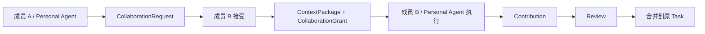
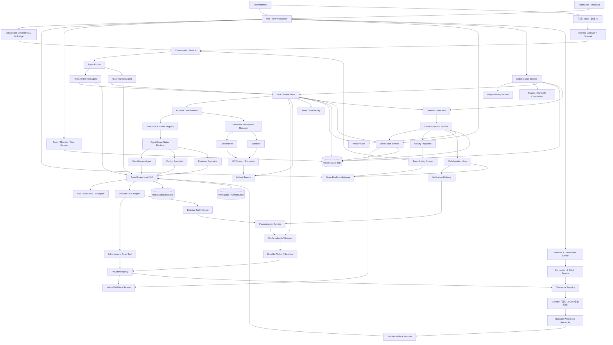
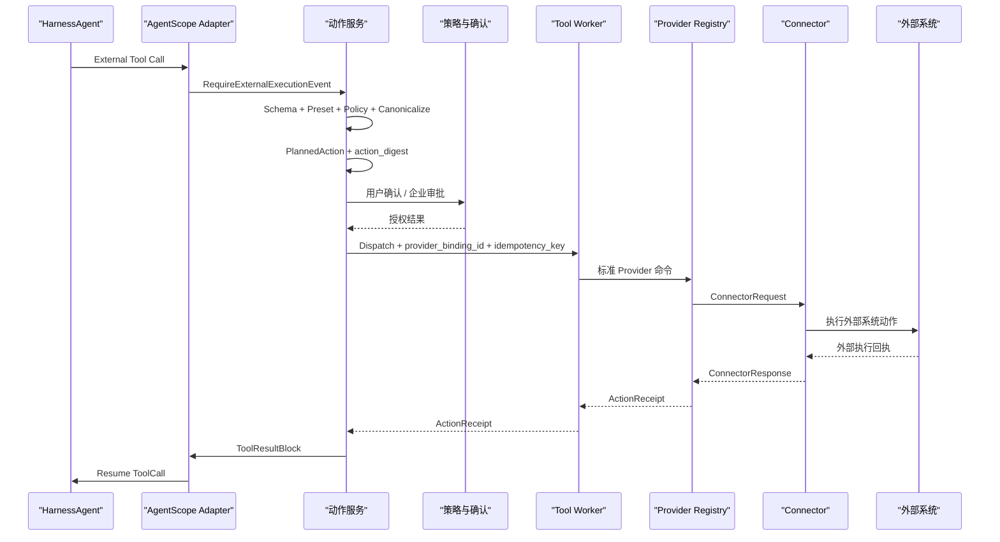

# CrewScope 团队协作式 AI 工作执行平台设计文档

> 文档版本：v5.34<br>
> 产品名称：`CrewScope`  
> 工程仓库：`crewscope-java`  
> AgentScope Java：`2.0.0 GA`（Git Tag：`v2.0.0`，Commit：`44c304ec84d5fbd8588c1af8bc71b1edb9663380`）  
> 技术栈：Java 17、Spring Boot 4.0.6、AgentScope Java 2.0.0、Vue 3、PostgreSQL、Redis、Docker/Kubernetes

## 1. 产品定义

CrewScope 是面向技术团队的协作式 AI 工作执行平台。

`Crew` 表示成员、Personal Agent、Team Agent 和 Specialist Agent 组成的执行团队；`Scope` 表示共享工作上下文、能力范围、责任边界与治理视野。

每个成员拥有一个默认对话式 Personal Agent，并可以从批准的 AgentTemplate 创建多个个人执行 Agent；团队拥有 Team Workspace、Team Agent、共享 Specialist、WorkItem、ProviderBinding、Skill、Artifact、责任关系和活动时间线。成员、个人 Agent 与团队 Agent 围绕同一个工作目标分工、协作、Review、Handoff 和交付。

CrewScope 把自然语言目标转换为可观察、可协作、可确认、可暂停、可恢复的跨系统任务。AgentScope 承载对话、推理、规划、工具和多 Agent 运行；CrewScope 承载团队、责任、协作、任务、身份授权、耐久执行、制品、观测和审计。

CrewScope 以 AgentScope Java 构建原生执行 Agent。原生 Coding Agent 直接理解 WorkItem、责任、验收标准、仓库范围、PolicySnapshot 和 Review Gate，在隔离的 Git Worktree 与 Sandbox 中完成代码分析、修改、测试、自检和结构化交付。

CrewScope 的核心结构：

```text
Team Workspace
  -> 创建 WorkItem 并指定 Owner
  -> 成员通过对话发起 Agent Task
  -> Personal Agent / Team Agent 制定计划
  -> AgentScope 原生 Specialist Agent 执行分析、编码、测试和复核
  -> 成员、Agent 和子 Agent 并行贡献
  -> Review、Handoff、确认和审批
  -> Provider 执行跨系统动作
  -> 团队实时观测责任、进度、成本和风险
  -> 交付 Artifact 并形成完整审计
  -> 任务经验沉淀为 Team Skill 和 Team Memory
```

### 1.1 目标用户

首批团队包括研发团队、平台工程团队、SRE/DevOps 团队、测试团队和技术产品团队。

核心成员：

- 软件工程师：WorkItem 分析、代码修改、测试、PR 和研发协作；
- 技术负责人：责任分配、项目进度、风险观测、Review 和交付质量；
- SRE/DevOps：故障调查、发布检查、Runbook 执行和事件复盘；
- 测试工程师：测试计划、缺陷分析、环境检查和结果同步；
- 技术产品经理：需求信息汇总、WorkItem 跟进、协作组织和发布说明；
- 安全与管理人员：权限策略、动作审批、成本治理和审计检索。

### 1.2 产品形态

CrewScope 采用个人执行、团队协作与企业治理结合的产品形态。

成员拥有：

- Personal Agent、私有 Conversation、Memory 和 Skill；
- 用户级 ProviderBinding 和 Connection；
- 自己负责、参与和关注的 WorkItem 与 Task；
- 写操作确认权和任务接管权。

团队拥有：

- Team Workspace、WorkProject、WorkItem 和 WorkGraph；
- Team Agent、Team Skill、Team Memory 和共享 Artifact；
- Owner、Executor、Collaborator、Reviewer、Approver 和 Watcher；
- CollaborationRequest、Contribution、Review 和 Handoff；
- 团队级 ProviderBinding、Service Account 和 PolicyPack；
- 任务看板、执行观测、活动时间线和审计记录。

企业提供：

- 统一登录、组织关系和身份映射；
- Provider、Connector 与 Plugin 市场；
- 模型、工具、数据和网络策略；
- 高风险动作审批、审计和成本治理；
- 私有化部署与企业内部系统接入。

### 1.3 核心产品价值

1. 一个 Team Workspace 连接成员、Agent 和企业系统。
2. 一张 WorkGraph 统一 WorkItem、Task、Step、责任、依赖、Artifact 和外部资源。
3. 一套责任模型明确结果负责人、当前执行者、协作者、Reviewer、Approver 和 Watcher。
4. 一套横向协作机制支持请求协助、邀请参与、Review、Handoff 和 Takeover。
5. 一个任务运行时承载跨系统长任务、并行贡献和后台恢复。
6. 一个团队观测面实时展示进度、阻塞、风险、成本和 Provider 状态。
7. 一条审计链记录成员、Agent、Provider、身份、动作、确认和外部回执。
8. 一套 Provider、Plugin 和 Skill 机制连接系统并沉淀团队工作方法。
9. 一套 Team Memory 和 Skill Promotion 机制形成团队知识资产。
10. 一组 AgentScope 原生执行 Agent 把责任、权限、代码上下文、Review 和交付证据纳入统一运行时。

AgentScope Java 2.0.0 提供智能运行时：

- `HarnessAgent` 和 `ReActAgent`；
- 多轮对话与类型化事件流；
- Structured Output；
- Plan Mode 和 Agent 任务清单；
- Toolkit、Permission 和 External Tool；
- AgentState、DistributedStore、Workspace 和 Sandbox；
- Memory、Compaction 和 Tool Result Eviction；
- Skill、ToolGroup、MCP 和子 Agent；
- AG-UI、Gateway 和企业通信 Channel；
- Interrupt、Graceful Shutdown 和 Pending Tool Recovery；
- 模型注册、重试、Fallback 和 OpenTelemetry。

CrewScope 提供任务执行控制面：

- Team、TeamMember、Workspace、WorkItem、Responsibility、Collaboration、Task、Action、Artifact 和 Audit 领域模型；
- 计划版本、策略版本和工具版本；
- 耐久调度、租约、检查点、Outbox 和 Webhook；
- 用户委托授权、企业 IAM、RBAC/ABAC 和职责分离；
- 动作幂等、结果对账、人工接管和任务恢复；
- 团队看板、任务观测、协作时间线、确认、制品和审计工作台。

### 1.4 产品竞争力

CrewScope 的产品竞争力来自团队执行网络：

1. 共享工作上下文：WorkGraph 把对话、WorkItem、责任、任务、证据、制品和外部资源组织成团队事实。
2. 责任驱动交付：Owner、Executor、Reviewer 和 Approver 形成清晰的结果责任链。
3. 横向协作协议：成员和 Personal Agent 通过 ContextPackage、CollaborationGrant、Contribution、Review 与 Handoff 完成可控协作。
4. 团队实时观测：负责人查看进度、阻塞、风险、成本、身份、动作和审计；成员查看自己的任务、协作和 Review 队列。
5. 企业执行能力：Provider、Connector、Connection 和 PolicyPack 把 GitHub、飞书与内部系统变成受身份和策略约束的执行能力。
6. 团队知识复利：成功任务沉淀为 Team Skill、Team Memory 和可复用 Artifact，持续提升团队执行效率。
7. 原生可治理 Agent：AgentScope 原生 Agent 在服务端可信责任、PolicySnapshot、任务级身份和结构化交付协议内运行。
8. 受控代码交付：Git Worktree、Sandbox、Diff Stream、Test Evidence、Review Gate、Draft PR 和 ActionReceipt 形成可恢复、可审计的研发闭环。

### 1.5 对话到团队交付

对话是 CrewScope 的统一工作入口。平台根据目标持续性、执行复杂度和协作范围，把对话逐步升级为 Task、WorkItem 和团队协作对象：

```text
问答、解释、搜索和轻量查询
  -> Conversation

后台执行、多步骤计划、工具调用和可恢复运行
  -> Conversation + Task

团队责任、长期跟踪、多人协作和正式交付
  -> Conversation + Task + WorkItem

成员协助
  -> CollaborationRequest + Contribution

正式评审、责任转移和接管
  -> ReviewRequest / Handoff / TakeoverRequest
```

MVP 的首条产品闭环：

```text
团队对话提出研发目标
  -> Agent 建议创建 WorkItem、Owner 和 Reviewer
  -> Task Runtime 领取执行并签发任务级短期身份
  -> Personal Agent 与 Coding Specialist 读取代码并生成计划
  -> 隔离 Git Worktree 与 Sandbox 修改代码、测试并流式生成 Diff
  -> 同级成员完成 Review
  -> Owner 确认源码写操作
  -> GitHub Provider 创建 Draft PR
  -> WorkItem、Activity、Notification 和 Audit 同步更新
```

### 1.6 产品范围

| 范围 | 首期实现 | 后续扩展 |
|---|---|---|
| 交互端 | Web 团队工作台与飞书通知 | Desktop、Mobile 和更多企业 IM |
| Agent Runtime | AgentScope Java 原生 Personal、Task Orchestrator、Coding 与 Reviewer Agent | 经评测接入外部 Coding Runtime Adapter |
| 代码场景 | Java/Spring Boot 仓库的缺陷修复、小功能、测试和 Draft PR | 多语言、复杂重构、预览和发布 |
| Provider | Native WorkItem、GitHub SourceCode、Lark Collaboration | GitLab、Gitee、禅道、TAPD、CI/CD 与可观测系统 |
| 自动化 | 用户发起的对话任务和 Webhook 恢复 | 定时任务、Autopilot 和团队主动工作 |
| 扩展机制 | 内置 Provider 与稳定应用 Port | Plugin 市场、第三方 Connector 和私有扩展仓库 |

首期代码交付到 Draft PR 结束。PR 合并、生产发布和生产变更进入高风险 Provider Action 与后续阶段。

## 2. 建设目标

1. 通过 Team Workspace 聚合成员、Agent、WorkItem、Provider、Skill、Task 和 Artifact。
2. 通过 WorkGraph 表达责任、依赖、协作、贡献、Review、执行和交付关系。
3. 通过 Personal Agent 支持成员执行，通过 Team Agent 支持共享任务和团队自动化。
4. 通过统一责任模型承载 Owner、Executor、Collaborator、Reviewer、Approver 和 Watcher。
5. 通过 CollaborationRequest、Contribution、Review 和 Handoff 支持成员横向协作。
6. 通过内置 WorkItem 管理需求、任务、缺陷、事件、评论和执行关联。
7. 通过 Capability Provider 统一工作项、源码、协作、CI/CD、可观测和运行环境能力。
8. 通过 Connector 承载外部系统的认证、API 与 Webhook。
9. 通过 Plugin 打包 Provider 实现、Connector、Tool、Skill、事件和界面扩展。
10. 通过 AgentScope Java 承载对话、规划、工具编排、上下文治理和多 Agent 协作。
11. 通过确定性控制面承载状态、授权、确认、幂等、恢复、对账和审计。
12. 通过 AG-UI 与团队事件流提供实时执行和协作体验。
13. 通过 RedisDistributedStore、PostgreSQL 和 Outbox 支持长任务跨实例恢复。
14. 通过 Sandbox、短期凭证和网络策略提供隔离执行环境。
15. 通过 Team Skill、Team Memory 和 Artifact 沉淀可审核的团队知识。
16. 通过企业策略层支持 SSO、权限、审批、数据边界和私有化部署。
17. 通过 AgentScope 原生 Coding Agent 与 Reviewer Agent 承载代码分析、修改、测试、自检和结构化交付。
18. 通过 Runtime Port 保持执行内核可扩展，后续按效果、安全和成本评测接入外部 Coding Runtime。
19. 通过 TaskExecution Claim、ExecutionLease、Heartbeat、Retry 和 Recovery 实现多实例耐久执行。
20. 通过 Git Worktree、Diff Stream、Test Evidence 和 Review Gate 实现可审查的代码交付。

## 3. 设计原则

### 3.1 对话驱动

对话承载目标表达、信息澄清、计划协作、成员邀请、过程干预、动作确认、结果交付和后续追问。目标进入后台执行时创建 Task，进入团队责任和长期交付时创建 WorkItem。

### 3.2 Team Workspace 与 WorkGraph

Team Workspace 是共享工作边界。WorkGraph 连接 WorkItem、Task、Step、责任、协作、Artifact、Provider 和外部资源。

### 3.3 责任明确

每个 WorkItem 保持一个 Owner。Task 和 Step 明确 Executor，协作、Review、审批和关注关系使用独立角色记录。

### 3.4 横向协作

成员可以请求协助、邀请参与、创建子任务、提交 Contribution、请求 Review、发起 Handoff 和申请 Takeover。

### 3.5 Personal Agent 与 Team Agent

Personal Agent 使用成员身份和个人上下文。Team Agent 使用团队身份、团队 ProviderBinding、Team Skill 和 Team Policy。

### 3.6 Provider 产生能力

Connection 把用户在外部系统中的身份授权给 CrewScope。ProviderBinding 把统一业务能力绑定到具体 Provider 实现和 Connection。Agent 仅能使用当前用户、当前 Workspace 和当前任务允许的 Provider、工具与资源。

### 3.7 任务承载执行

Task、Step、Action 和 Confirmation 构成可靠执行边界。任务状态以 PostgreSQL 记录为准。

### 3.8 智能与控制分层

AgentScope 负责语义理解、开放式分析、计划生成、工具选择和结果表达。CrewScope 负责连接授权、计划校验、状态迁移、写操作确认、调度和审计。

### 3.9 副作用外部执行

快速只读工具由 AgentScope 直接执行。所有外部副作用统一形成 PlannedAction：Agent 写操作由 External Tool 触发，领域事件驱动的通知和自动化由 Application Command 触发；动作经授权后由耐久 Worker 执行。

### 3.10 人在回路

成员可以查看计划、跟踪步骤、评论、贡献、Review、确认动作、暂停任务、补充信息、修改目标、恢复运行和接管执行。高风险操作同时遵循企业审批策略。

### 3.11 版本固化

任务创建时生成初始 PolicySnapshot 和 SafetyEnforcementOverlay，固化执行 Principal、AgentProfile、PolicyPack、ProviderBinding、能力、Tool 和预算。Task Orchestrator 生成的候选计划通过服务端校验后发布首个 PlanVersion。计划能力范围、责任主体或 ProviderBinding 变化时生成带父版本的新快照。每次调用和执行引用精确快照，SafetyEnforcementOverlay 实时收紧权限。

### 3.12 最小权限

每次运行仅获得当前组织、Team、成员、角色、Workspace、ProviderBinding、Connection、Task、Step 和目标资源需要的工具与短期身份。

### 3.13 幂等与对账

每个写动作具有稳定幂等键。结果状态为 `UNKNOWN` 时进入外部系统对账流程。

### 3.14 全链路追踪

Team、Workspace、WorkItem、Responsibility、Collaboration、ProviderBinding、Conversation、AgentRun、Task、Action、Confirmation 和 ExternalOperation 共享统一关联链。

### 3.15 AgentScope 原生优先

Personal Agent、Team Agent、Task Orchestrator、Coding Specialist 和 Reviewer Specialist 使用 AgentScope Java 原生运行时。Agent 的 Plan、Todo、ToolCall、Structured Output、Memory、Subagent、Interrupt 和 Resume 直接映射到 CrewScope 任务事实。Runtime Port 保持边界稳定，扩展运行时遵循同一责任、策略、制品和审计协议。

### 3.16 执行工作区隔离

每个代码 TaskExecution 使用独立 Git Worktree、稳定分支、Sandbox 和 Artifact 路径。Workspace Manager 对创建、并发锁、校验、重试、冷恢复、归档和清理负责。Diff Stream 通过文件系统事件、Git 状态和周期对账保持最终一致。

## 4. 核心领域模型

| 概念 | 定义 |
|---|---|
| `Organization` | 企业组织、成员、策略和共享能力边界 |
| `Team` | 成员、角色、资源、策略和协作的团队边界 |
| `TeamMember` | 用户在 Team 中的身份、角色和状态 |
| `TeamRole` | 团队级管理、配置、观测和审计权限集合 |
| `Principal` | 用户、Personal Agent、Team Agent、Specialist Agent 和 Service Principal 的统一行为主体 |
| `Workspace` | `PERSONAL` 或 `TEAM` 类型的长期工作边界 |
| `AgentProfile` | Personal、Team 或 Specialist Agent 的角色、模型、Prompt 和能力配置 |
| `AgentConfigurationVersion` | AgentProfile 追加的不可变运行配置，固定主/Fallback 模型、Prompt、GenerateOptions、Tool、Skill、Memory、Policy 和预算 |
| `ModelProviderDefinition` | 模型厂商、AgentScope Adapter、Endpoint、区域与数据政策元数据 |
| `ModelCatalogEntry` | 可选模型的 Model ID/Revision、能力、Token 上限、Region 和生命周期 |
| `ModelPriceSchedule` | 绑定精确 Catalog Revision 的只追加 Token 价格时间片 |
| `ModelConnection` | `USER/TEAM/ORGANIZATION` 所有的模型 Endpoint、Region、Credential Reference、账单主体和健康事实 |
| `WorkGraph` | 从领域事实生成的 WorkItem、Task、责任、依赖、贡献、Artifact 和外部资源关系读模型 |
| `WorkProject` | WorkItem、成员、代码仓库和项目配置的组织单元 |
| `WorkItem` | 需求、任务、缺陷和事件的长期工作记录 |
| `WorkItemRef` | CrewScope 或外部系统工作项的统一引用 |
| `ResponsibilityAssignment` | 工作对象上的 Owner、Executor、Collaborator、Reviewer、Approver 和 Watcher 关系 |
| `TaskParticipant` | 用户或 Agent 在具体 Task 中的角色、状态和可见范围 |
| `CollaborationRequest` | 成员之间的协助和参与邀请 |
| `ContextPackage` | 向协作者交付的目标、计划、证据、制品、权限和期望贡献快照 |
| `Contribution` | 成员或 Agent 提交的分析、代码、文档、证据、Artifact 和建议 |
| `ReviewRequest` | 对 Plan、Contribution、Artifact 或 Action 的结构化评审 |
| `ReviewDecision` | Reviewer 针对精确 Subject 版本提交的 Finding、结论和 Gate 结果 |
| `Handoff` | Owner 或 Executor 的受控责任移交 |
| `TakeoverRequest` | 成员在阻塞、超时或原责任人不可用时发起的受控接管请求 |
| `InboxItem` | 面向成员的协作、Review、Handoff、Takeover、确认和异常待办投影 |
| `NotificationPreference` | 成员的通知 Channel、免打扰、值班和升级偏好 |
| `NotificationDelivery` | InboxItem 的站内、邮件或协作 Provider 投递记录 |
| `WatchSubscription` | 成员对工作对象的事件订阅和通知偏好 |
| `ActivityEvent` | 面向团队协作的可读活动时间线事件 |
| `Conversation` | 成员与 Agent 的私有或共享持续会话 |
| `Message` | 文本、多模态内容、任务卡片、确认卡片和系统事件 |
| `ConversationWorkItemLink` | Conversation 与已建档 WorkItem 的稳定关联 |
| `ConversationTaskLink` | Conversation 与 Task 的多对多关联 |
| `TaskDefinition` | 可选的版本化任务模板和步骤图 |
| `Task` | Agent 为用户执行的一次具体目标 |
| `TaskExecution` | Task 的一次执行尝试 |
| `StepDefinition` | 任务模板中的步骤定义 |
| `StepExecution` | 步骤运行实例和检查点 |
| `ExecutionRuntime` | AgentScope 原生或扩展 Coding Runtime 的能力、版本、健康、并发和运行位置 |
| `ExecutionLease` | Worker 对 TaskExecution 的有期执行所有权；MVP 的 Step 由所属 TaskExecution 串行驱动 |
| `ExecutionWorkspace` | TaskExecution 的 Git Worktree、分支、Sandbox、路径、仓库基线和恢复状态 |
| `PlanVersion` | 校验并确认后的固化执行计划 |
| `PluginDefinition` | Provider 实现、Connector、Tool、Skill、事件和 UI 扩展的发布包 |
| `PluginInstallation` | Plugin 在组织或 Workspace 中的安装实例 |
| `ProviderDefinition` | WorkItem、SourceCode、Collaboration 等稳定能力契约 |
| `ProviderImplementation` | Provider 契约在具体系统上的实现 |
| `ProviderBinding` | Workspace 或 WorkProject 对 Provider 实现和 Connection 的绑定 |
| `ConnectorDefinition` | 外部系统的认证、API、Webhook 和协议定义 |
| `Connection` | 用户、Team 或 Organization 对一个外部系统实例的授权连接 |
| `ConnectionGrant` | Connection 可访问的 Scope、资源和有效期 |
| `AgentRuntimeSession` | CrewScope 与 AgentScope 会话的绑定 |
| `AgentRun` | 一次 Agent 调用、恢复、唤醒或中断 |
| `AgentInterrupt` | Agent 工具确认或外部执行挂起记录 |
| `ToolBinding` | AgentScope Tool、Provider Tool、Provider 实现与 Connector 操作的映射 |
| `SkillBinding` | Skill 来源、版本、可见性和策略绑定 |
| `PlannedAction` | 对外部系统写操作的规范化执行请求 |
| `ActionReceipt` | 外部动作的请求标识、结果、外部版本和对账证据 |
| `Confirmation` | 用户确认或企业审批形成的动作授权事实 |
| `PolicyPack` | Agent、模型、工具、资源、审批、预算和审计策略 |
| `PolicySnapshot` | Task 创建及责任、计划或能力变更时生成的不可变策略、配置和能力版本快照 |
| `SafetyEnforcementOverlay` | 对运行中任务实时生效的撤权、禁用和 Kill Switch |
| `RuntimeArtifact` | 报告、文件、Plan、日志、Diff、Patch 和工具大结果 |
| `DiffArtifact` | ExecutionWorkspace、基线 Commit、交付 Commit、最终 DiffManifest、完整 Patch Artifact 引用与最终 Hash |
| `AuditEvent` | 面向安全、治理和合规检索的追加写投影 |
| `DomainEvent` | 领域状态变化产生的版本化事实事件和 Outbox 来源 |

### 4.1 Workspace 类型

```text
PERSONAL
  成员的 Personal Agent、私有 Memory、私有 Skill 和用户级 ProviderBinding

TEAM
  Team Agent、WorkProject、WorkItem、WorkGraph、Team Skill、Team Memory、共享 Artifact 和团队级 ProviderBinding
```

CrewScope Workspace 是产品中的成员与团队工作边界。AgentScope `Workspace` 是 Agent 运行时访问文件和制品的抽象。`AgentRuntimeSession` 把产品 Workspace 映射到隔离的 AgentScope Workspace、Sandbox 和 Artifact 路径。

Conversation 级 `AgentRuntimeSession` 由 Organization、TeamMember、Personal Agent、AgentProfile、Workspace 和 Conversation 服务端事实共同建立。Session ID 从 Conversation、TeamMember 和 Personal Agent 的规范 UUID 确定性派生；应用层在事务内执行 `initializeIfAbsent`，数据库通过唯一约束裁决并发初始化。Repository 返回的既有 Session 必须重新与当前服务端事实闭合校验，客户端提交的 Agent、Thread、Session 或状态引用不能参与绑定。

Session 保存 AgentProfile 配置版本、版本化 AgentScope `userId/sessionId`、外部 Agent State 引用、ACTIVE/DISABLED/ARCHIVED 生命周期、乐观锁版本与审计元数据。DISABLED 保留原状态槽以支持恢复；重新启用与配置刷新必须重新解析当前 ACTIVE Personal Agent；ARCHIVED 仅在 Conversation 已归档后进入并保持终态。AgentScope Key 和状态引用在生命周期内保持不变，防止恢复到其他成员、Team 或 Conversation 的运行态。

AgentScope `ReActAgent` 以 `(userId, sessionId)` 为键在单 JVM 内串行同一 Session 调用，不同 Session 并行运行。Harness Gateway 的 `SessionTurnGate` 提供额外的单 JVM 公平 Turn Gate。M2 采用单活动 CrewScope Server 执行 Agent 调用，Redis 环境级所有权租约在启动时拒绝第二个活动实例，并通过续期、Token 原子释放和有限 TTL 处理正常退出与崩溃。滚动发布按“停止接收、排空或中断保存、旧实例退出、新实例接管”切换所有权。Redis AgentStateStore 使用 `crewscope:{environment}:agentscope:v1:session:` 前缀保存最后一次检查点并支持新进程重载；Invoke 和 Resume 在模型前复验所有权、目标状态可读性和隔离写探针。AgentState 不设置 TTL，Conversation 归档或生命周期过期后显式删除完整状态槽。横向执行由后续带 fencing token 的分布式 Session Lease 裁决。完整边界见 [ADR-009](adr/ADR-009-会话执行所有权与恢复协议.md)。

MVP 为每个 TeamMember 创建一个默认 Personal Agent，而不是为同一用户创建一个跨所有 Team 的全局执行身份。Personal Agent Principal 使用当前 Team Scope、成员 USER Principal 作为 Owner，并保持 PRIVATE 可发现性；AgentProfile 绑定该 TeamMember 和 Team Workspace。这样同一用户加入不同 Team 时拥有隔离的 Agent 身份、权限、ProviderBinding 和审计链，同时仍由同一个 USER Principal 统一承担最终责任。

默认 Personal Agent 的 Principal ID 与 AgentProfile ID 分别由稳定 TeamMember ID 派生。重复请求生成同一候选身份，持久化 Port 在事务内执行 `initializeIfAbsent`，数据库通过 active 默认 Profile 唯一约束完成并发裁决。Principal 与 AgentProfile 必须同时提交或同时回滚。M1 的 AgentProfile 保存稳定身份、Owner、Workspace、类型、状态、版本和审计字段；M2–M4 使用环境支撑的版本化配置 Port；M5 将模型、Prompt、Tool、Skill、Memory 与 Policy 迁入持久的 AgentConfigurationVersion 并生成 PolicySnapshot。

AgentProfile 保持稳定产品身份与生命周期，`AgentConfigurationVersion` 保存单调追加的运行配置。乐观锁 Version、状态迁移和 Configuration Revision 使用独立字段。成员修改 Personal Agent 模型时创建新 Configuration Revision；新 Conversation 使用当前版本，已存在 Conversation 保持 AgentRuntimeSession 固定版本，并可在没有活动调用或 Pending Interrupt 的安全点显式刷新。

Conversation、Task 和 Artifact 使用 `visibility`：

```text
PRIVATE
PARTICIPANTS
PROJECT
TEAM
ORGANIZATION
```

共享范围由创建者、TeamPolicy、工作对象和数据分类共同决定。

### 4.2 责任模型

TeamRole 管理稳定的团队权限，首批内置角色为：

| TeamRole | 权限范围 |
|---|---|
| `TEAM_OWNER` | Team 生命周期、所有权、核心策略和最终治理 |
| `TEAM_ADMIN` | 成员、角色、Workspace、Provider 和 Team Agent 配置 |
| `TEAM_LEAD` | WorkProject 管理、责任分配、全局进度、风险和交付观测 |
| `MEMBER` | 创建和参与工作、发起协作、使用授权 Provider 与 Agent |
| `AUDITOR` | 审计检索、治理报告和合规导出 |

ResponsibilityAssignment 管理工作对象上的动态责任。TeamRole 决定成员可以执行的管理动作，责任角色决定成员或 Agent 在具体 WorkItem、Task、Step 和 Action 中承担的职责。同级成员依据可见性、责任关系和 PolicyPack 相互发起协助、Review、Handoff 与 Takeover。

责任角色：

| 角色 | 含义 |
|---|---|
| `OWNER` | 对最终结果负责；每个 WorkItem 保持一个有效 Owner |
| `EXECUTOR` | 当前执行者，可以是成员、Personal Agent 或 Team Agent |
| `COLLABORATOR` | 提交分析、代码、文档、证据或其他 Contribution |
| `REVIEWER` | 评审 Plan、Contribution、Artifact 和交付结果 |
| `APPROVER` | 授权高风险 Action |
| `WATCHER` | 订阅进度、风险和结果事件 |

角色主体约束：

| 责任角色 | 允许主体 | 决策效力 |
|---|---|---|
| `OWNER` | TeamMember | 对工作结果承担最终责任 |
| `EXECUTOR` | TeamMember、Personal Agent、Team Agent、Specialist Agent | 执行 Task、Step 和 Action |
| `COLLABORATOR` | TeamMember 或 Agent | 提交 Contribution |
| `REVIEWER` | TeamMember 或 Specialist Agent | Agent 产生 `ADVISORY` Finding；TeamMember 可以产生 `GATE` Decision |
| `APPROVER` | TeamMember | 对高风险动作产生人工审批事实 |
| `WATCHER` | TeamMember | 接收进度和结果通知 |

`POLICY_AUTO_GRANT` 由 Policy Engine 产生，记录策略版本和授权条件。它与 TeamMember 的 Approver 身份分别记录。

责任不变式由应用层和数据库共同保证：一个 WorkItem 只有一个有效 Owner；Owner、Gate Reviewer 和 Approver 必须是有效 TeamMember；每个成员只有一个有效默认 Personal Agent Principal 与 AgentProfile；Gate Reviewer 是否可以同时担任 Owner/Executor 由 ReviewerEligibilityPolicy 决定，MVP 默认要求职责分离，单人团队只能通过显式 PolicyPack 降级。ResponsibilityAssignment 是责任事实源，WorkItem 中的 Owner 引用属于受约束引用或读模型字段。

```text
ResponsibilityAssignment
  subject_type       WORK_ITEM（M1） / TASK / STEP / ACTION
  subject_id
  role               OWNER / EXECUTOR / COLLABORATOR / REVIEWER / APPROVER / WATCHER
  actor_type         USER / PERSONAL_AGENT / TEAM_AGENT / SPECIALIST_AGENT / SERVICE
  actor_id
  actor_member_id    USER 在 Team 内的资格引用，Agent 为空
  status             ACTIVE / RELEASED
  assigned_by
  assigned_at
  accepted_at
  released_by
  released_at
  version
```

M1 直接分配在创建时即生效，`accepted_at` 与 `assigned_at` 相同。Assignment 释放后进入 `RELEASED` 终态，历史责任不覆盖和复活。Owner 替换在一个事务内释放旧 Assignment 并创建新 Assignment，不提供使 WorkItem 失去 Owner 的单独释放入口。Handoff 接受后使用相同的原子替换语义。Executor 可以按 Step 分配。Reviewer 与 Approver 根据 WorkProject、PolicyPack 和动作风险自动建议或人工选择。

Gate Reviewer 必须是同 Team 的 Active TeamMember，默认不能同时担任当前 Owner 或 Executor。单人团队降级必须引用明确的 PolicyPack ID、版本和原因，且只在 Reviewer 是唯一 Active TeamMember 时生效。策略决策记录 `STRICT_SEPARATION/SINGLE_MEMBER_OVERRIDE`、冲突角色和 PolicyPack 证据。Specialist Agent Reviewer 只具有 `ADVISORY` 效力，不能通过降级获得 `GATE` 效力。

Owner、Executor 和 Gate Reviewer 的变更共享 WorkItem 责任链串行化边界。应用服务在同一事务内锁定 WorkItem，读取 Active Assignment，执行职责分离策略，再写入新责任。Owner/Executor 变更也反向检查 Active Gate Reviewer，防止通过变更其他角色绕过策略。

责任管理 API 只接受目标 Principal ID，Principal 类型、状态、Team Scope 和 USER Membership 由服务端解析。读取责任链要求 ACTIVE Membership；写入要求 Team Scope 或目标 WorkProject Scope 的 `RESPONSIBILITY_MANAGE`。Owner 替换同时比较当前 Assignment ID 和 Version，防止 ABA 覆盖；非 Owner 释放使用 Assignment 强 ETag。每个写命令以 `Idempotency-Key` 原子提交 ResponsibilityAssignment、DomainEvent、Outbox 和 CommandReceipt。

Gate Reviewer Policy 由服务端 Provider 根据 Team、WorkProject 和 PolicyPack 解析。默认严格分离 Owner、Executor 与 Gate Reviewer；客户端不能提交 PolicyPack 或降级理由。单人团队降级决策把 PolicyPack ID、版本、冲突角色和原因固化到领域事件，作为时间线和 Audit 证据。SPECIALIST_AGENT Reviewer 始终是 Advisory，不具有 Gate 效力。

WorkItem 时间线通过完整 Organization/Team/WorkProject/WorkItem Scope 路径读取，要求当前 USER 具有目标 Team ACTIVE Membership。M1 直接合并 DomainEvent 与对应 AuditEvent，以 DomainEvent ID 作为规范事件身份，在分页前去重并优先保留 DomainEvent 事实；M6 在保持 Application Port 与 HTTP 契约稳定的前提下切换到物化 Activity 读模型。

时间线只公开当前里程碑已评审的 WorkItem、Comment、ResourceLink 和 Responsibility 业务事件。返回值包含 Event、Aggregate、Actor、Correlation、Causation、Outcome 和结构化 Payload，不将 Idempotency Key、认证凭证和未知安全审计暴露给 WorkItem 详情页。列表按 `occurredAt + canonicalEventId` 倒序 Keyset 分页，使用时间线专用、带类型版本的不透明 Cursor；DomainEvent/Audit 重复投影只展示一次，同一微秒内使用 PostgreSQL UUID 顺序保证断点续传稳定。

### 4.3 横向协作模型

CollaborationRequest 类型：

```text
REQUEST_HELP
INVITE_COLLABORATOR
```

状态：

```text
PROPOSED -> SENT -> ACCEPTED -> IN_PROGRESS -> CONTRIBUTED -> COMPLETED
PROPOSED -> WITHDRAWN
SENT -> DECLINED / EXPIRED / WITHDRAWN
ACCEPTED -> WITHDRAWN
IN_PROGRESS -> WITHDRAWN
```

成员接受请求后获得 TaskParticipant、ContextPackage 和范围化 CollaborationGrant。Contribution 回到原 Task，经 Review 后合并到 Plan、Artifact 或执行结果。



### 4.4 Review、Handoff 与 Takeover

ReviewRequest 可以绑定：

```text
PLAN_VERSION
CONTRIBUTION
ARTIFACT
CODE_CHANGE
PLANNED_ACTION
TASK_RESULT
```

ReviewDecision 结论：

```text
APPROVED
CHANGES_REQUESTED
REJECTED
COMMENTED
```

Review 权限：

```text
ADVISORY  Agent 或成员产生建议、Finding 和修改意见
GATE      指定 TeamMember 产生通过、修改或拒绝结论，并控制后续状态迁移
```

Agent Reviewer 的输出始终进入 `ADVISORY`。PolicyPack 指定需要人工 Gate 的 Subject、风险等级和 Reviewer 角色。

Handoff 流程：

1. 当前 Owner 或 Executor 创建 Handoff；
2. CrewScope 生成 ContextPackage；
3. 接收者查看目标、状态、证据、制品、权限和未完成项；
4. 接收者接受后，在一个事务中释放原 Assignment、创建新 ResponsibilityAssignment，并生成关联新责任与 ProviderBinding 的 PolicySnapshot；
5. 原责任版本绑定的未执行 PlannedAction 和 Confirmation 进入 `EXPIRED`；
6. Personal Agent 使用新成员身份、新 PolicySnapshot 与当前 ConnectionGrant 恢复任务；
7. DomainEvent 驱动 ActivityEvent、InboxItem、NotificationDelivery 和 AuditEvent 记录责任变化。

Takeover 流程：

1. 候选接管人针对 WorkItem、Task 或 Step 创建 TakeoverRequest；
2. PolicyPack 根据阻塞时间、原责任人状态、TeamRole 和风险计算 Reviewer 或 Approver；
3. 通过后生成 ContextPackage，并在一个事务中释放原 Assignment、创建新 ResponsibilityAssignment 和新 PolicySnapshot；
4. 原责任版本绑定的未执行 PlannedAction 和 Confirmation 进入 `EXPIRED`；
5. 新 Executor 使用新的 RuntimeContext、PolicySnapshot、ConnectionGrant 和 Agent Session 恢复任务；
6. DomainEvent 同步更新 Inbox、Activity、NotificationDelivery 和 Audit 投影。

### 4.5 Agent 协作模型

| Agent | 所有者 | 身份 | 主要职责 |
|---|---|---|---|
| Personal Agent | TeamMember | 成员委托身份 | 个人执行、协作响应、私人上下文和用户级 Provider |
| Team Agent | Team | Team Service Principal | 团队共享任务、定时任务、协调和团队级 Provider |
| Task Orchestrator | TaskExecution | 发起方的范围化执行身份 | 保存任务级计划，编排 Step、协作、工具和结构化交付 |
| Contribution Agent | CollaborationRequest | 接收成员的范围化委托身份 | 使用 ContextPackage 完成协作并提交 Contribution |
| Specialist Agent | 父 Agent/Task | 继承后的范围化身份 | Coder、Reviewer、Analyst、Researcher 和 Writer |

Task Orchestrator 与 Contribution Agent 是任务级运行实例，责任主体沿用对应的 Personal Agent、Team Agent 或 TeamMember。Personal Agent 向其他成员发起 CollaborationRequest。接收者确认或 TeamPolicy 授权后，Collaboration Service 创建共享上下文和权限。Team Agent 可以向成员分配 Step、请求 Review 和汇总 Contribution。

#### 4.5.1 AgentScope 原生 Coding Agent

Coding Agent 是 Specialist Agent 的内置类型，使用 AgentScope `HarnessAgent`、Plan Mode、Todo、Structured Output、Toolkit、Sandbox Filesystem、Compaction、Tool Result Eviction、AgentState 和只读 Skill Repository。M4 关闭 Subagent，Reviewer Specialist 在 M5 由平台编排。执行输入由服务端组装：

```text
WorkItem + AcceptanceCriteria
ResponsibilitySnapshot
RepositoryBaseline + AllowedPaths
PlanVersion + PolicySnapshot
ProviderBindings + ConnectionGrants
PriorSession + PriorWorkspace
ReviewFindings + HandoffContext
```

Coding Agent 执行稳定循环：

```text
仓库分析
  -> 结构化实现计划
  -> 范围与风险校验
  -> 文件修改与命令执行
  -> 测试、静态检查与失败修复
  -> Git Diff 与自检
  -> CodeChangeResult + TestEvidence + DiffArtifact
  -> ReviewRequest
```

Coding Agent 使用范围化检查、文件修改、结构化构建命令和 Git 投影工具。推送分支、创建 PR、合并和发布使用 SourceCodeProvider 的 PlannedAction 链路。Reviewer Agent 基于精确基线、Diff、测试证据和验收标准生成 `ADVISORY` Finding，TeamMember 提交 `GATE` Decision。

M4-I11 的 `CodingSpecialistFactory` 为每次 Specialist 调用创建短生命周期 HarnessAgent，按 AgentProfile 版本解析主模型、Fallback Model 与独立 Compaction Model。Factory 在构建前、构建后和 Structured Output 完成后三次校验固定 Tool 面。固定 Skill Bundle 位于 classpath，只包含 `java-spring-v1`，加载前复验 SHA-256、Skill ID 和只读属性。AgentState 完成后从同一 AgentScope Session 槽读取，安全点同时提取 Agent Workspace 中的真实 Plan 和 AgentState Todo。实现与验证见 [M4-I11 AgentScope Coding Specialist 运行时](testing/M4-I11-AgentScope-Coding-Specialist运行时.md)。

M4-I12 的 `CodingSpecialistStepRuntime` 将 Specialist 调用绑定到当前 TaskExecution、StepExecution、ExecutionLease、Fencing、RuntimeSession、AgentRun 与 Segment。测试失败按 WorkspacePolicy 的修复轮次预算在同一 attempt、Run 和 Session 内继续；每轮按耐久事件、AgentState Snapshot、CodingCheckpoint、StepCheckpoint 顺序提交。Worker 在 Task Agent 与 Specialist 共用的 Lease 窗口内把成员 Pause/Cancel 路由到当前活动 Session；Specialist Pause 保留 Workspace 与 Sandbox 的恢复边界。模型调用、Structured Output 恢复和 Tool 调用逐项形成连续事件序列，成功、失败、暂停和取消结果的计数均来自该累计遥测。Resume 先完成 Workspace 对账和 Snapshot 恢复，再进入同 Run 的 RESUME Segment。模型生成 changeSummary、limitations 和 risks；M4-A03 在测试成功后固化 DiffArtifact，并使用平台权威 RepositoryAnalysis、CodingTarget、Workspace、DiffArtifact 和 TestEvidence 坐标构造最终 CodeChangeResultV1，再执行完整输出复验。Task Agent 与 Coding Specialist 分别使用 `crewscope-task-*` 和 `crewscope-coding-*` 稳定 namespace。`CodingSpecialistAuthorityGateway` 连接 Worktree、Sandbox、Tool Session、Diff Monitor 与 Finalizer。实现与验证见 [M4-I12 Coding Specialist Step 执行与恢复](testing/M4-I12-Coding-Specialist-Step执行与恢复.md)与 [M4-A03 Coding Workspace 执行生命周期](testing/M4-A03-Coding-Workspace执行生命周期.md)。

M5-I05 使用 `AgentTemplateRuntimeAssembler + AgentTemplateRuntimeRegistry` 将 Active AgentProfile、精确 TemplateVersion、ConfigurationRevision/Hash、完整 Preflight 结果和动态 Primary/Fallback Model 组装为受控运行定义。Registry 要求 Personal、Team、Specialist 三类 Factory 各且仅有一个。每次创建前同时闭合 Agent Principal、Profile ID/Version、Ownership、RuntimeRole、AgentScope SessionKey、StateReference、Tool、Skill 与 Structured Output Schema；Runtime Toolkit 必须和启用 Tool 完全相同。成员补充指令追加在 Template Baseline 之后，只收窄任务，不参与 Tool、Skill、Schema、数据、模型、审批或 Sandbox 解析。Personal 使用 Conversation Session，Team 使用 Task/Step Session，Specialist 使用 Specialist Session；不同个人 Coding/Reviewer Agent 使用各自 Principal、Profile、Session 与 State 槽。`coding` Template 继续委托 M4 Coding Factory，保留固定 Toolkit/Skill、Plan/Todo、Compaction、Eviction、Telemetry 与 AgentState；Reviewer 使用关闭 Filesystem、Shell、Subagent、Memory、Dynamic Skill 和 Compaction 的受限入口，M5-I06 以零 Tool 和一次性有界 ContextPackage 接入 Finding 执行。实现与验证见 [M5-I05 TemplateRegistry 与 Agent Factory](testing/M5-I05-TemplateRegistry与Agent-Factory.md)。

实时修改以 `DiffManifest + Generation` 投影，经 RESET/DELTA Event 和不透明 Cursor 提供可恢复观察；`DiffFileEntry` 保存 canonical 当前路径、Rename/Copy 原路径、变更类型、增删行、二进制、截断标记、完整单文件 Patch Hash 和有界 Preview。Manifest 当前路径唯一并按 Unicode 代码点排序，Content Hash 覆盖排序后的 Git 权威事实，不覆盖 Generation 和 Preview；权威 Hash 未变化时不增加 Generation。

Worker 使用 `WorkspaceDiffWatcher` 将 AllowedPaths 内的 WatchService 事件合并为路径无关提示，`WorkspaceDiffMonitor` 串行执行完整 Git Reconcile。未跟踪文件通过不修改 Index 的类型化 `diff --no-index` 进入实时投影。`WorkspaceDiffEventStore` 按 Workspace Fingerprint 与 Recovery Generation 隔离 Stream Epoch，提供有界 RESET/DELTA Replay；部署稳定的 HMAC 密钥保护 Cursor，旧 Epoch 和过期窗口返回 RESET，签名篡改被拒绝。单文件 Patch、累计 Patch、Preview 和 Event 均受预算限制，非权威 Preview 可在 Event 超限时省略。实现与验证见 [M4-I08 Workspace Diff 与最终 DiffArtifact](testing/M4-I08-Workspace-Diff与最终DiffArtifact.md)。

最终 `DiffArtifact` 只在 ExecutionWorkspace 进入 `FINALIZING` 后，从精确 Baseline Commit 与 Delivery Commit 重新生成并保持不可变。Finalizer 验证 Archive Ref、单父 Baseline、Delivery Tree、Workspace 版本与 Fingerprint，先写完整 Restricted Patch Artifact，再原子发布关系元数据；相同交付重试返回既有结果，不同 Commit 对失败。制品固化完整 WorkProject Scope、TaskExecution/attempt、ExecutionWorkspace、CodingTarget、Commit 对、最终 Manifest、完整 Patch Artifact 引用和审计创建事实。最终 Hash 闭合 ExecutionWorkspace、Baseline、Delivery、Generation、Manifest Hash 与 Patch Hash；每个 ExecutionWorkspace 只能原子发布一个最终制品。领域规则见 [M4-D05 DiffArtifact 领域模型](testing/M4-D05-DiffArtifact领域模型.md)，基础设施实现见 [M4-I08 Workspace Diff 与最终 DiffArtifact](testing/M4-I08-Workspace-Diff与最终DiffArtifact.md)。

Patch、构建日志与测试报告统一通过 `CodingArtifactPublisher` 保存为 Restricted Workspace Artifact。Patch 的稳定 Artifact ID 绑定 ExecutionWorkspace，构建日志与测试报告绑定 ExecutionWorkspace 和 EvidenceSequence；同一事实相同内容重试幂等，不同内容确定冲突。三个类型使用同一部署保留期、单对象上限和单次 Range 上限。`CodingArtifactReader` 先将 ArtifactStore Descriptor 与 DiffArtifact、CommandEvidence 或 TestEvidence 已提交的 Scope、TaskExecution、Producer、Content Type、大小和 SHA-256 完整闭合，再返回整对象或精确 Range；Range 前校验完整 Blob Hash。公开摘要只保留 ID、用途、Content Type、大小、Hash、安全生命周期状态和保留期限。

`CodingArtifactAccessService` 从 Team Membership、Task、TaskExecution 和用途固定的 DiffArtifact、CommandEvidence 或 TestEvidence 建立完整授权链，只生成当前 Task Workspace 的 ArtifactAccessContext。HTTP API 提供最终 Patch、指定 CommandEvidence 构建日志和指定 TestEvidence 测试报告三个入口，接受标准单 Range 或 `offset + limit` 字节分页，返回类型化下载名、Content Type、Content-Length、Content-Range、SHA-256 ETag 与安全缓存头。Range 起点有效时将超出对象的结束位置截断到对象末尾，起点越界或空对象 Range 返回 `416`。单次响应预算和共享并发流上限由部署配置控制，Permit 持有至响应完成、失败或取消关闭。每次授权传输产生低基数指标与关联 Scope、Actor、Correlation ID、Artifact ID 和响应字节数的结构化审计事实。实现与验证见 [M4-I09 Coding Artifact 读写与生命周期](testing/M4-I09-Coding-Artifact读写与生命周期.md)与 [M4-A06 Coding Artifact 内容 API](testing/M4-A06-Coding-Artifact内容API.md)。

每次受控命令执行形成不可变 `CommandEvidence`。`CommandSpec` 固化精确 WorkspacePolicy、BuildProfile、命令槽、typed argv、仓库相对工作目录、超时和 Sandbox 镜像 Digest；`CommandEvidence` 固化 Workspace Fingerprint、平台观察终态、Exit Code、日志 Artifact、有界摘要、稳定失败分类和证据 Hash。命令成功只由 `EXITED + exitCode=0` 推导。

命令能力由短生命周期 `SandboxCommandSession` 注册唯一的 `coding_run_command`。模型只提交 CommandKind、模块白名单成员、精确测试类/方法选择器和有界 timeout；Maven、Maven Wrapper、Gradle Wrapper 与项目脚本的入口和固定 argv 来自精确 BuildProfile，Runner 生成选择器参数并逐参数安全编码。Workspace 命令次数和 EvidenceSequence 在同一 Worker 的重复 Session 间累计；完整有界 stdout/stderr 先写 Restricted Workspace Artifact，Agent 只接收部署上限内的 UTF-8 前缀。AgentScope 2.0.0 超时时，CrewScope 停止并重启当前独占容器，以容器边界终止内部完整进程树，再发布平台观察到的 CommandTermination。原始命令字符串、任意 argv、工作目录、环境、镜像和 Docker 参数不存在于 Tool Schema。实现与验证见 [M4-I07 结构化 SandboxCommandTool 与 CommandEvidence](testing/M4-I07-结构化SandboxCommandTool与CommandEvidence.md)。

`TestEvidence` 按 EvidenceSequence 引用同一 Workspace、Policy 和 attempt 的 CommandEvidence，保存测试统计、测试报告 Artifact 与逐条 `AcceptanceResult`。验收结果的数量、Index、文本和顺序与 CodingTargetSnapshot 完全一致，引用只能指向当前证据集合。M4-A03 在 TEST、VERIFY、ACCEPTANCE 命令结束后解析 Maven Surefire/Failsafe `Results` 汇总，发布完整有界输出作为 TestReport Artifact，并在同一 Tool 调用内执行 Git Reconcile，将证据绑定到命令结束后的 DiffManifest。部署批准的验证命令成功、解析到至少一个测试且统计无失败时，当前验收项引用该 CommandEvidence 并通过。平台按命令失败、报告缺失、零测试、测试失败、验收未完成、验收失败的固定优先级推导结果；调用方不能提交成功布尔值。完整规则见 [M4-D06 Command 与 TestEvidence 领域模型](testing/M4-D06-Command与TestEvidence领域模型.md)与 [M4-A03 Coding Workspace 执行生命周期](testing/M4-A03-Coding-Workspace执行生命周期.md)。

Coding Specialist 使用 `RepositoryAnalysisV1`、`DiffManifestV1`、`TestEvidenceV1` 与 `CodeChangeResultV1`。四份 Schema 在每层对象固定全字段 required 和 `additionalProperties=false`，通过 AgentScope 2.0.0 JsonNode Structured Output 发送，并在 DTO 转换前再次校验原始 Map。模型输出只引用 CodingTarget、Workspace、Policy、DiffArtifact 与 TestEvidence；服务端逐项复验路径、代次、统计、顺序和 Hash，并要求 TestEvidence 的被测 DiffGeneration/Manifest Hash 与最终 DiffArtifact 精确一致，最终成功只读取领域 TestEvidence。`CodingCheckpoint` 将 Plan/Todo、Run Segment、Workspace Fingerprint、Diff Generation、最近 TestEvidence 和 AgentStateSnapshot 形成不可变 Hash 闭包。完整规则见 [M4-D07 Coding 结构化输出与 Checkpoint 契约](testing/M4-D07-Coding结构化输出与Checkpoint契约.md)。

#### 4.5.2 Reviewer Specialist 与成员 Gate

Reviewer Specialist 使用 `reviewer@1` Template 和独立 HarnessAgent。服务端为每个 ReviewRequest 构建版本化 `ContextPackageV1`，只提供完成评审所需的精确事实：

```text
ReviewSubjectId + SubjectHash
CodingTargetSnapshotId + Revision + Hash
ReviewerTemplateVersion + PolicySnapshot
BaselineCommit + DeliveryCommit
DiffArtifactId + FinalHash + ManifestHash
有界 Changed Hunk + PatchHash
TestEvidenceId + EvidenceHash
CommandEvidence 摘要 + 完整 AcceptanceResult
服务端推导的 ReviewerRelationship
ContextPackageHash
```

默认预算为 128 个变更 Hunk、512 KiB Patch 内容、64 个 CommandEvidence 和 100 条 AcceptanceResult。Reviewer Agent 不持有 Artifact Tool；服务端在调用前读取并复验完整 Restricted Patch，再一次性构建有界 ContextPackage。超限交付拒绝自动评审，由调用方拆分交付或转人工评审。完整仓库、完整会话、原始环境、任意原始命令、凭证和 Context 外 Artifact 不进入 Reviewer Prompt。

M5-D06 将该协议实现为独立 `review` 领域：`ReviewSubject` 固定 WorkItem Scope、Task、TaskExecution attempt、CodingTarget 与最终 Diff；`ContextPackageV1` 规范排序并 Hash 闭合 Diff、Hunk、TestEvidence、CommandEvidence 摘要、完整 AcceptanceResult、Reviewer AgentProfile、TemplateVersion、ConfigurationRevision 和 PolicySnapshot v2。`ReviewRequest` 使用 `OPEN -> IN_PROGRESS -> COMPLETED` 状态机，任何非失效状态均可因 Subject、Diff、TestEvidence、Reviewer Configuration、Policy 或 Context 漂移进入不可逆 `INVALIDATED`。Reviewer 启动、恢复和输出完成命令必须携带当前 ContextPackage 并复验完整坐标，调用方无法绕过陈旧检查；旧 Request 失效后才能创建连续 Revision 的后继请求。

M5-D07 将 Finding 与成员 Gate 实现为两条独立的领域链路。`ReviewFinding` 只接受精确 `IN_PROGRESS` ReviewRequest 上的 Reviewer Specialist Agent 输出，创建前复验 Request ETag 和当前 ContextPackage；每条 Evidence 必须命中当前 DiffArtifact ID/Hash、ManifestHash、TestEvidence ID/Hash、Acceptance Index 及真实 Hunk 行号范围。服务端使用 SubjectHash、Category、规范路径、行号范围和 Unicode NFKC 规范 Claim 计算 Fingerprint；Title、Severity 和 SuggestedFix 不改变 Finding 身份，相同 Fingerprint 的后续输出作为只追加 `ReviewFindingObservation` 保留。Finding 始终为 `ADVISORY`，`SELF_REVIEW` 同样不获得 Gate 效力。

M5-I06 使用 `ContextPackageBuilder` 将精确 M4 Diff、Test、Command 与 Patch Artifact 转换为 Review 上下文。Builder 复验 Scope、TaskExecution、attempt、CodingTarget、DiffGeneration、ManifestHash、Command 引用顺序、ArtifactAccess、完整字节数、已提交 Hash、重新计算 SHA-256、Canonical UTF-8、Manifest Path 和 Unified Diff Hunk 计数。新文件段重置路径权威，Patch 内形似 `---/+++` 的真实删除或新增内容仍按 Hunk 操作解析。

`ReviewerSpecialistRuntime` 精确锁定 `reviewer@1`、Agent Principal、AgentProfile ID/Version、Template Hash、Configuration Revision/Hash、Structured Output Schema Hash、当前 ContextPackage 和 ReviewRequest ETag。Reviewer 使用独立 AgentScope Specialist Session 和原生 Structured Output，Tool Surface 为空，并关闭 Filesystem、Shell、Subagent、Memory、Dynamic Skill、Workspace Context 与 Compaction。Context JSON 内全部字符串与 Patch 均被标记为不可信证据。严格 Decoder 之后由领域 Evidence Resolver 决定证据效力，服务端生成 Relationship、Effect 和 Fingerprint；单批重复与恢复重放只追加 Observation。最多 20 条 Finding 进入后续 Coding 修复摘要。实现与验证见 [M5-I06 Reviewer Specialist 与 Evidence Resolver](testing/M5-I06-Reviewer-Specialist与Evidence-Resolver.md)。

M5-I07 将 ReviewSubject、ContextPackage、ReviewRequest、Finding、Observation、Decision 和 ModificationRound 保存为 Organization Scope 内的权威事实。ContextPackage 使用关系列保存可索引权威坐标，并使用显式非秘密 JSONB 保存完整 Diff、Hunk、TestEvidence、Acceptance 与 Reviewer 执行快照；恢复时重新计算 Context Hash，逐项校验 JSONB、标量列和三个子投影，任何漂移都失败关闭。V24 补齐 Decision 的冲突职责、PolicyPack 与完整 Override Reason，V21 至 V23 保持不可变。

Review Workbench 查询使用可删除、可按 Request 或 Organization 重建的 `review_request_projection`，按 Request、Execution Attempt 和 Task History 提供有界索引查询。ReviewRequest 以 Version 乐观锁更新；相同 Request/Fingerprint 通过数据库唯一约束保留首条 Finding，Finding 行锁串行追加连续 Observation。Review 事件在一个 REQUIRED 事务写入 DomainEvent、TaskEvent 与 Outbox，再由既有 Audit 投影消费；事件载荷排除 Claim、SuggestedFix、Patch、Prompt 和凭证。新的 Final Diff 发布后，消费者会将旧 ReviewRequest 原子标记为 `DIFF_CHANGED` 并发布安全失效事件。实现与验证见 [M5-I07 Review 持久化与失效监听](testing/M5-I07-Review持久化与失效监听.md)。

`ReviewDecision` 是已完成且当前有效 ReviewRequest 上的独立 `GATE` 命令。调用者必须同时是 Active USER Principal、Active TeamMember 和当前 Active USER Reviewer Assignment 持有者，资格校验复用 M1 `ReviewerEligibilityPolicy` 与 Owner/Executor 职责分离；单人团队只能按显式 PolicyPack 降级。Agent 和 Service 无法创建 Gate Decision。`COMMENTED` 可连续追加，`APPROVED/CHANGES_REQUESTED/REJECTED` 是当前请求不可替换的终结结论；`CHANGES_REQUESTED` 创建只追加修改轮次，后续轮次必须来自同一 Task 下连续 Revision 的 ReviewRequest。领域实现与验证见 [M5-D07 ReviewFinding 与成员 Gate 领域契约](testing/M5-D07-ReviewFinding与成员Gate领域契约.md)。

Reviewer Prompt 固定要求：只报告影响正确性、安全、可靠性、可维护性、测试或验收的可执行问题；正确变更返回空 Finding；每条 Finding 同时引用真实变更 Hunk、DiffArtifact、TestEvidence 和 AcceptanceResult；不推断 Context 外事实；不产生 Gate Decision。

`ReviewFindingListV1` 根对象只包含 `schemaVersion` 和 `findings`。Finding 的 Severity 为 `BLOCKER/HIGH/MEDIUM/LOW`，Category 为 `CORRECTNESS/SECURITY/RELIABILITY/MAINTAINABILITY/TESTING/ACCEPTANCE`，并包含 Title、Claim、SuggestedFix 与 1–8 个 Evidence 坐标。Evidence 固定规范路径、起止行、DiffArtifact ID/Hash、ManifestHash、TestEvidence ID/Hash 和 Acceptance Criterion Index。所有字段 required，所有对象 `additionalProperties=false`。

AgentScope 使用模型原生 Structured Output 或合成 `generate_response`。CrewScope 在 DTO 转换前执行严格 Schema 校验，再使用 Evidence Resolver 复验路径、Hunk、ID、Revision、Hash、Diff Generation 和 Acceptance Index。无证据、伪造路径、越界行号、旧 Hash 和 Context 外结论失败关闭。

平台按以下规范身份合并重复 Finding，模型不能提交 Fingerprint：

```text
SHA-256(subjectHash + category + canonicalPath + normalizedRange + normalizedClaim)
```

`ReviewerRelationship` 由 Reviewer Agent Owner 与被审对象责任事实推导为 `INDEPENDENT/SELF_REVIEW`。Agent Finding 的 Effect 始终为 `ADVISORY`。`SELF_REVIEW` 支持交付自检和修复，不满足职责分离或 Gate Policy。

Gate Decision 是独立的成员命令。`ReviewFindingListV1` 不包含 Approval、Gate Effect 或状态迁移字段；Gate Application Service 只接受通过 `ReviewerEligibilityPolicy` 的当前 TeamMember。Agent Principal、Service Principal、模型输出、模板配置和管理员降级都不能形成 `APPROVED/CHANGES_REQUESTED/REJECTED`。完整决策和验证见 [ADR-017](adr/ADR-017-Reviewer证据与人工Gate边界.md)与 [M5-S03 Reviewer 证据与 Gate 边界验证记录](spikes/M5-S03-Reviewer证据与Gate边界验证记录.md)。

### 4.6 对话模式

| 模式 | 交互内容 |
|---|---|
| `ASSIST` | 问答、解释、搜索和轻量查询 |
| `TASK_CREATION` | 目标提取、连接检查、澄清和任务确认 |
| `TASK_COLLABORATION` | 成员邀请、信息补充、贡献、方案选择和计划变更 |
| `TASK_MONITORING` | 步骤、证据、成本、制品和结果查看 |
| `REVIEW` | Plan、Contribution、Artifact 和结果评审 |
| `HANDOFF` | 责任移交、上下文确认和接管 |
| `ACTION_CONFIRMATION` | 精确写操作的用户确认或企业审批 |
| `RESULT_FOLLOW_UP` | 追问、修改制品和创建后续任务 |

对象升级规则：

1. `ASSIST` 保持 Conversation 形态；
2. 目标需要后台运行、两个以上步骤、工具写入或暂停恢复时创建 Task；
3. 目标需要 Owner、期限、团队可见性、多人参与或正式交付时创建 WorkItem；
4. Agent 提出升级建议，成员确认目标、Owner、Reviewer、可见性和 ProviderBinding；
5. Conversation 继续作为 Task 和 WorkItem 的对话入口，历史关联由 ConversationWorkItemLink、ConversationTaskLink 与 WorkGraph 保存。

### 4.7 步骤类型

```text
SERVICE_STEP       确定性 Java 逻辑
AGENT_STEP         AgentScope 分析、规划、评审和生成
TOOL_STEP          Inline、Async 或 External 工具调用
CONFIRMATION_STEP  用户确认或企业审批
COLLABORATION_STEP 成员协作、Contribution 和 Handoff
REVIEW_STEP        人工或 Agent Review
WAIT_EVENT_STEP    Webhook、定时器和外部状态等待
WAIT_INPUT_STEP    用户输入等待
MANUAL_STEP        人工处理
SUBFLOW_STEP       版本化子流程
```

### 4.8 内置 WorkItem

WorkItem 是用户持续管理的工作对象，Task 是 Agent 为目标发起的一次执行。一个 WorkItem 可以关联多次 TaskExecution、多个 Conversation、PR、Artifact 和外部资源。

```text
WorkProject
  └── WorkItem
        ├── Comment
        ├── Attachment
        ├── Activity
        ├── ResponsibilityAssignment
        ├── CollaborationRequest
        ├── Contribution / Review / Handoff / Takeover
        ├── InboxItem Projection
        ├── ResourceLink
        └── TaskExecution
```

WorkItem 类型：

```text
TASK
BUG
FEATURE
INCIDENT
```

WorkItem 状态：

```text
BACKLOG
READY
IN_PROGRESS
IN_REVIEW
BLOCKED
DONE
CANCELLED
ARCHIVED
```

主状态流：

```text
BACKLOG -> READY -> IN_PROGRESS -> IN_REVIEW -> DONE
                         |              |
                         +-> BLOCKED <--+
DONE / CANCELLED -> ARCHIVED
```

`BLOCKED` 可以返回 `READY/IN_PROGRESS/IN_REVIEW`，由解除阻塞时所处的工作阶段决定。`DONE` 与 `CANCELLED` 只允许进入 `ARCHIVED`；`ARCHIVED` 是终态，不再接受字段修改、评论或 ResourceLink。完成和取消的 WorkItem 在归档前仍可追加复盘评论与交付资源。

WorkItem 优先级：

```text
LOW
MEDIUM
HIGH
URGENT
```

核心字段：

```text
key                    CRW-1024
project_id             所属项目
type                   TASK / BUG / FEATURE / INCIDENT
title / description    标题和 Markdown 描述
status / priority      状态和优先级
reporter               创建人
owner_assignment_id    当前 Owner Assignment
labels                 标签
source_code_provider_binding_id 默认源码 ProviderBinding
collaboration_provider_binding_id 默认协作 ProviderBinding
repository_refs        关联代码仓库和目录
due_at                 计划完成时间
source_provider        CREWSCOPE / JIRA / ZENTAO / TAPD
source_ref             外部系统引用
version                乐观锁版本
```

内置 WorkItem 提供列表、看板、详情、搜索、责任分配、评论、@成员、附件、活动时间线、Provider 绑定和“交给 Agent 处理”入口。

WorkProject Key 使用 2–10 位大写字母或数字并以字母开头。WorkItem Key 使用 `{projectKey}-{sequence}`，总长度不超过 32。WorkProject 归档后停止创建 WorkItem；WorkItem 的 Organization、Team、Workspace 和 WorkProject Scope 必须完整一致。

Native WorkItem 创建者自动成为初始 Owner。WorkItem 与 ACTIVE Owner ResponsibilityAssignment 在同一事务内创建，`WORK_ITEM_CREATED` Payload 固化初始 Owner Assignment ID 和 Principal ID，并与 Outbox、CommandReceipt 原子提交。生产组合根只暴露执行完整 Membership、Role Scope、项目锁和 Owner 初始化规则的 M1 WorkItem Command Service。

原生 Comment 是不可变 Markdown 记录，保存作者 Principal、Scope、创建审计和 `CREWSCOPE` 来源。外部 Comment 额外保存 Provider 来源和外部 Comment ID，用于同步幂等。ResourceLink 是不可变 WorkGraph 关系，首批支持 Task、Conversation、Repository、Branch、Commit、Pull Request、Artifact 和 External URL。角色与 TeamMember 授权由应用层解析，领域对象始终校验 Principal ACTIVE 状态以及 Organization/Team Scope。

WorkItem 列表固定在 Team 下的指定 WorkProject，使用状态筛选和 `updatedAt + WorkItemId` Keyset Cursor。详情在同一事务快照中返回 WorkItem、Comment 和 ResourceLink。查询要求目标 Team ACTIVE Membership；追加 Comment 和 ResourceLink 要求 Team Scope 或目标 WorkProject Scope 的 `WORK_PARTICIPATE`。其他 WorkProject Grant 不提供权限。所有 Scope 不匹配按不可见资源处理。

Comment 与 ResourceLink 创建使用 `Idempotency-Key`，在一个事务内提交业务事实、DomainEvent、Outbox 和 CommandReceipt。Native 与外部来源 WorkItem 均可追加 CrewScope 协作信息；归档 WorkItem 拒绝新增协作事实。External URL 只允许无嵌入凭证、无控制字符、具有有效 Host 的绝对 HTTP/HTTPS URL。

统一 Provider 接口：

```java
public interface WorkItemProvider extends CapabilityProvider {
    WorkItemView get(WorkItemRef ref);
    Page<WorkItemView> search(WorkItemQuery query);
    WorkItemRef create(CreateWorkItemCommand command);
    WorkItemView update(WorkItemRef ref, UpdateWorkItemCommand command);
    WorkItemComment addComment(WorkItemRef ref, AddCommentCommand command);
    WorkItemView linkResource(WorkItemRef ref, ResourceLink link);
}
```

`NativeWorkItemProvider` 使用 PostgreSQL。后续 `JiraWorkItemProvider`、`ZentaoWorkItemProvider` 和 `TapdWorkItemProvider` 通过 Connector 调用外部系统。Agent 使用统一 `workitem_*` Tool，Provider 负责读写实际来源。

原生工具映射：

| Tool | 路径 | 用途 |
|---|---|---|
| `workitem_get` | Inline Tool | 读取详情、评论、资源和活动 |
| `workitem_search` | Inline Tool | 按项目、负责人、状态和关键词查询 |
| `workitem_create` | External Tool | 创建工作项 |
| `workitem_update` | External Tool | 修改字段和状态 |
| `workitem_add_comment` | External Tool | 添加处理记录 |
| `workitem_link_resource` | External Tool | 关联 Task、PR、Commit 和 Artifact |

WorkItem 写工具进入 PlannedAction，由 NativeWorkItemProvider 或外部 Provider 执行。当前用户拥有的低风险更新可以获得当前 PlanVersion 范围内的策略授权，共享字段和状态变更遵循精确确认策略。

### 4.9 WorkGraph 读模型

WorkGraph 是从 PostgreSQL 领域事实生成的可重建读模型。MVP 使用关系表和投影查询，节点和关系拥有稳定 ID、版本、可见性和来源引用。

节点类型：

```text
WORK_ITEM
TASK
STEP
CONVERSATION
ACTOR
RESPONSIBILITY
COLLABORATION_REQUEST
CONTRIBUTION
REVIEW
HANDOFF
TAKEOVER
ARTIFACT
EXTERNAL_RESOURCE
```

关系类型：

```text
OWNS
EXECUTES
PARTICIPATES_IN
DEPENDS_ON
BLOCKS
PRODUCES
REVIEWS
TRANSFERS_TO
LINKS_TO
DERIVED_FROM
```

WorkGraph 规则：

1. 领域表是事实源，WorkGraph 是查询投影；
2. DomainEvent 和 Outbox 增量更新图投影；
3. 投影可以从领域事实全量重建；
4. 节点和关系继承 Subject 的可见性与数据分类；
5. 查询限制深度、节点数量、关系类型和时间范围；
6. MVP 使用 PostgreSQL，组织级复杂图分析达到规模阈值后评估图数据库。

### 4.10 外部 WorkItem Provider

`WorkItemRef` 使用统一引用：

```text
provider_type       CREWSCOPE / JIRA / ZENTAO / TAPD
connection_id       外部 Provider 使用的 Connection
external_id         外部稳定 ID
display_key         CRW-1024 / PROJ-1024
external_version    ETag、更新时间或外部版本
```

Provider 规则：

1. 每个 WorkItem 绑定一个事实源。
2. Native Provider 直接提交 PostgreSQL 事务和 Outbox。
3. 外部 Provider 通过 Connector 写入来源系统，并根据回执更新本地投影。
4. 外部状态和类型映射到统一枚举，原始值保存在 Provider 扩展字段。
5. Webhook 提供实时同步，定时 Reconcile 补齐事件和版本差异。
6. 更新命令携带 `external_version`，版本冲突进入重新读取与用户确认流程。
7. Agent Tool Schema 保持统一，Provider 承担系统差异。

### 4.11 Capability Provider

Capability Provider 是 Agent 和 Skill 使用的稳定业务能力契约。Connector 是 Provider 实现访问具体系统的技术适配层。

| Provider 类型 | 标准能力 | 首个实现 | 后续实现 |
|---|---|---|---|
| `WORK_ITEM` | 工作项查询、创建、更新、评论和资源关联 | `NativeWorkItemProvider` | Jira、禅道、TAPD、GitHub Issues |
| `SOURCE_CODE` | 仓库、代码、分支、Commit、PR 和 Review | `GitHubSourceCodeProvider` | GitLab、Gitee、Bitbucket |
| `COLLABORATION` | 用户、会话、消息、文件和通知 | `LarkCollaborationProvider` | Slack、钉钉、企业微信、Teams |
| `CI_CD` | 流水线、构建、制品、部署和回滚 | Phase 4 | Jenkins、GitHub Actions、GitLab CI、Argo CD |
| `OBSERVABILITY` | 指标、日志、Trace、告警和仪表盘 | Phase 4 | Prometheus、Loki、Elasticsearch、Grafana |
| `RUNTIME` | 工作负载、Pod、配置、扩缩容和重启 | Phase 4 | Kubernetes、云平台 |
| `KNOWLEDGE` | 文档搜索、读取、创建和更新 | Phase 3 | 飞书文档、Confluence、企业 Wiki |

基础契约：

```java
public interface CapabilityProvider {
    ProviderDescriptor descriptor();
    ProviderCapabilities capabilities();
    ProviderHealth health(ProviderContext context);
}
```

源码 Provider：

```java
public interface SourceCodeProvider extends CapabilityProvider {
    RepositoryView getRepository(RepositoryRef ref);
    Page<CodeSearchResult> searchCode(CodeSearchQuery query);
    FileContent getFile(RepositoryRef ref, String revision, String path);
    DiffView getDiff(ChangeRef ref);
    BranchRef createBranch(CreateBranchCommand command);
    CommitRef pushChanges(PushChangesCommand command);
    PullRequestRef createPullRequest(CreatePullRequestCommand command);
    PullRequestView getPullRequest(PullRequestRef ref);
}
```

协作 Provider：

```java
public interface CollaborationProvider extends CapabilityProvider {
    CollaborationUser getCurrentUser(ProviderContext context);
    Page<ConversationView> searchConversations(ConversationQuery query);
    Page<CollaborationMessage> searchMessages(MessageQuery query);
    SentMessageRef sendMessage(SendMessageCommand command);
    UploadedFileRef uploadFile(UploadFileCommand command);
}
```

首个实现关系：

```text
GitHub Plugin
  ├── GitHubConnector
  └── GitHubSourceCodeProvider implements SourceCodeProvider

Lark Plugin
  ├── LarkConnector
  └── LarkCollaborationProvider implements CollaborationProvider
```

ProviderBinding 保存所有者类型、Provider 类型、实现版本、Connection、执行身份、资源范围和默认用途。只读 Binding Resolver 按 Action 显式绑定、Task 显式绑定、WorkProject、Workspace、Organization Owner 默认项的顺序解析；Organization 默认项是 Organization Owner 的 Workspace Binding，USER/TEAM 查询不自动切换 Owner。

Provider 领域契约按以下事实分层：

- `ProviderDefinition` 保存 Organization、稳定 Key、ProviderType、接口版本和标准能力全集；
- `ProviderImplementation` 绑定精确 Definition 与接口版本，只能声明 Definition 能力子集，并明确 `NONE/REQUIRED` Connection 要求和 Connector Key；
- `Connection` 保存 USER、TEAM 或 ORGANIZATION 外部身份所有权、Connector、外部账户引用、Credential 引用、有效期和 ACTIVE/SUSPENDED/REVOKED/EXPIRED 生命周期；
- `ConnectionGrant` 保存 Connection Owner 向明确 Grantee 授予的能力、资源、有效期和撤销事实；Organization 可向同组织 Team 或 USER 下放，Team 与 USER 不能向其他 Owner 扩权；
- `ProviderBinding` 保存 Team Workspace 或 WorkProject 目标、Binding Owner、Definition/Implementation/Connection/Grant ID 与版本、执行身份、授权交集、默认用途和 ACTIVE/DISABLED/ARCHIVED 生命周期。

外部 Provider 的 Binding 能力必须属于 Implementation 能力，并与当前 ConnectionGrant 的能力和资源取非空交集。Native Provider 使用 connectionless Binding，不保存 Connection、Grant 或外部执行身份。Binding 读取时重新校验所有固化 ID、版本与实时状态；Definition/Implementation 变更、Connection/Grant 撤销或过期立即使 Candidate 失效，不等待 Binding 状态异步更新。

内置 NativeWorkItem 的 Definition Key 为 `work-item`，Implementation Key 为 `native-work-item`，接口与实现版本均为 `1.0.0`，能力全集为 `workitem.read/create/update/comment/resource-link`。每个 READY Team 的默认 Workspace 自动获得 TEAM Owner、默认用途的 connectionless Binding，资源范围精确为 `workspace:{workspaceId}`。新 Team 在 Team foundation 事务内初始化；V9 为既有完整 Team 补齐同一稳定事实。Organization 级 PostgreSQL advisory transaction lock 与稳定 raw MD5 UUID 保证并发和迁移结果一致。重复初始化只校验契约，不重复写入，也不自动恢复停用事实。

选择顺序只处理默认值优先级，不把用户级、团队级和组织级身份互相替换。最高存在的 ACTIVE 层级形成授权占位：该层候选因 Grant 撤销、Connection 暂停、版本变化或能力交集为空而失效时返回 `NOT_FOUND`，不回退到更宽层级；显式 Binding 失效时同样不回退。同层唯一默认项优先且默认项失效时失败关闭；没有默认项时，一个当前有效候选返回 `RESOLVED`，多个返回 `AMBIGUOUS`。最终 Binding 必须位于当前主体、责任、ConnectionGrant、PolicySnapshot、SafetyEnforcementOverlay 和目标资源的权限交集内。解析结果固化 ProviderBinding、ConnectionGrant、Credential Subject 和资源范围，写入 PolicySnapshot 与 ActionDigest。协议与实现证据见 [ADR-006](adr/ADR-006-ProviderBinding解析与授权.md)和 [M2-I01 验证记录](testing/M2-I01-BindingResolver.md)。

Agent 使用标准 Tool：

```text
workitem_get
workitem_update
sourcecode_search_code
sourcecode_get_file
sourcecode_create_branch
sourcecode_push_changes
sourcecode_create_pull_request
collaboration_search_messages
collaboration_send_message
collaboration_upload_file
```

Provider 实现可以注册系统扩展 Tool。通用 Skill 使用标准 Tool，系统专用 Skill 使用扩展 Tool。

Provider 运行规则：

1. Provider 接口、DTO、Tool Schema 和错误码独立版本化。
2. `capabilities()` 决定当前实现注册的标准 Tool 子集。
3. 标准字段进入统一领域模型，系统特有字段进入 `extensions`。
4. 分页统一使用 Cursor，Provider 实现转换外部页码和 Token。
5. 外部错误归一化为 `AUTHENTICATION`、`PERMISSION`、`NOT_FOUND`、`CONFLICT`、`RATE_LIMITED`、`TRANSIENT` 和 `VALIDATION`。
6. ProviderBinding 固化到 TaskExecution 和 PlannedAction。
7. Provider 写操作统一进入 External Tool、Confirmation、Worker、Receipt 和 Reconcile 链路。

## 5. 总体架构



### 5.1 组件职责

| 组件 | 职责 |
|---|---|
| Team Workspace | 团队看板、WorkGraph、对话、协作、任务、观测、审计和制品 |
| AG-UI 接入 | Web SSE、Agent 事件、Interrupt 和 Resume |
| Team Realtime Gateway | Presence、评论、@成员、责任变化、协作请求和活动事件推送 |
| Gateway/Channel | 企业 IM 身份、会话、路由、FIFO 和流式输出 |
| Conversation Service | 私有/共享消息、参与者、Agent 路由、任务卡片和事件补发 |
| Team Service | Team、TeamMember、TeamRole、成员状态和组织关系 |
| Workspace Service | Personal/Team Workspace、Memory、Skill、ProviderBinding 和可见范围 |
| WorkGraph Service | WorkItem、Task、责任、依赖、Contribution、Artifact 和外部资源关系 |
| Responsibility Service | Owner、Executor、Collaborator、Reviewer、Approver 和 Watcher |
| Collaboration Service | 协助请求、邀请、ContextPackage、Contribution 和 CollaborationGrant |
| Review/Handoff Service | ReviewRequest、结论、责任移交、接管和版本冲突处理 |
| Personal Agent | 使用成员身份完成个人执行和响应团队协作 |
| Team Agent | 使用 Team Service Principal 协调共享任务、定时任务和团队自动化 |
| Native WorkItem Service | WorkProject、WorkItem、评论、看板和 Agent 任务入口 |
| Connection Service | OAuth、Token Vault、Scope、刷新、撤销和身份映射 |
| Plugin Registry | Plugin 安装、签名、升级、Provider 实现、Connector 和 Skill 管理 |
| Provider Registry | Provider 契约、实现发现、Binding、标准 Tool 和能力路由 |
| Connector Registry | Connector、Connection、认证、API 操作和 Webhook 管理 |
| Task Control Plane | 任务创建、计划固化、状态查询和用户控制入口 |
| Durable Task Runtime | 队列、Claim、状态机、并发配额、租约、Heartbeat、重试、检查点、超时和 Outbox |
| Execution Runtime Registry | 运行时类型、能力、版本、健康、可用位置、并发和任务路由 |
| AgentScope Adapter | Agent 构建、调用、恢复、中断、事件和工具结果映射 |
| AgentScope Native Runtime | Personal、Team、Task Orchestrator、Coding、Reviewer 和其他 Specialist Agent 的原生运行时 |
| Execution Workspace Manager | Git Worktree、分支、Sandbox、文件锁、创建回滚、冷恢复、归档和清理 |
| Diff Stream | 文件变更监视、Git 状态检查、周期 Reconcile、变更统计、Patch 流和内容上限 |
| PlannedAction Service | 写操作规范化、确认、审批、调度和对账 |
| Tool Worker | 使用用户委托身份或企业服务身份执行外部动作 |
| Artifact Service | 报告、文件、Diff、Patch、日志结果和预览元数据 |
| Team Observability | 责任、状态、阻塞、成本、风险、Provider 健康和质量指标 |
| Event Projection Service | 消费 Outbox，生成 WorkGraph、Activity、Inbox、Audit、Notification 和实时事件投影 |
| Collaboration Inbox | 汇总成员待处理的协作、Review、Handoff、Takeover、Confirmation、异常和风险 |
| Notification Delivery | 根据成员偏好、值班、免打扰和升级规则生成站内通知；外部投递进入 PlannedAction、Worker、Receipt 和 Reconcile 链路 |
| Team Activity Stream | 面向成员的可读协作事件流与团队游标 |
| Policy/Audit Service | 策略决策、不可变事件、脱敏、检索、导出和保留 |

以上组件是模块化单体中的逻辑组件。MVP 由 `crewscope-server` 统一装配和部署，组件通过应用 Port、领域事件和事务边界协作。

### 5.2 线程与事务模型

CrewScope 使用 WebFlux 承载 AG-UI、SSE、WebSocket、模型流和 WebClient。PostgreSQL 持久化使用 Spring Data JPA、JDBC 与 Flyway，并通过专用阻塞线程池隔离：

```text
Netty EventLoop
  -> AG-UI / SSE / WebSocket / WebClient / Reactor 流

crewscope-db Scheduler
  -> JPA / JDBC / Flyway 运行后的数据库访问

crewscope-worker Executor
  -> Step 调度 / Provider Action / Connector 调用 / Reconcile

Sandbox Executor
  -> 文件 / 命令 / 构建 / 测试 / 扫描
```

运行规则：

1. Netty EventLoop 执行流式协议和非阻塞编排；
2. JPA、JDBC、文件、同步 SDK 和 Sandbox 调用进入有界专用线程池；
3. 数据库事务只包含领域状态、DomainEvent 和 Outbox 写入；
4. 模型、Connector、MCP 和外部系统调用在数据库事务提交后执行；
5. Worker 使用 Claim Token、租约、Heartbeat、并发配额、超时和背压保护执行资源与外部系统；
6. `all` Profile 继续使用隔离线程池，`server/worker` Profile 使用相同执行语义。
7. Worker 仅持有当前 TaskExecution 签发的短期执行身份，凭证解析与 Provider 写操作在服务端或 Connector Worker 完成。

### 5.3 领域事件与投影

每个领域事实由一份规范化 DomainEvent 表示，一次事务可以生成同一 Aggregate 内有序的多个 DomainEvent。Activity、Audit、Inbox、Notification 和其他查询视图由投影生成：

```text
领域状态 + DomainEvent + Outbox 同事务提交
  -> WorkGraphProjection
  -> ActivityEvent
  -> WorkItemActivityProjection
  -> InboxItem
  -> AuditEvent
  -> NotificationDelivery
  -> Team Realtime Event
```

DomainEvent Envelope：

```text
eventId
eventType
schemaVersion
organizationId
teamId
workspaceId
aggregateType
aggregateId
aggregateVersion
actorType
actorId
correlationId
causationId
idempotencyKey
occurredAt
payload
```

Payload 只保存业务事实。Envelope 保存事件身份、租户范围、聚合版本、可信 Actor 和调用关联链。`teamId`、`workspaceId`、`actorId`、`causationId` 和 `idempotencyKey` 是可选字段。`schemaVersion` 是从 `1` 开始的十进制字符串，并按 `eventType` 独立演进。

JSON 使用 camelCase；可选字段固定写出具体值或 `null`；读取时接受缺失可选字段并忽略未知 Envelope 字段；Envelope 与 Payload 都使用 JSON Object。领域层保持纯 Java，application 层使用 Jackson 3 的 JSON Tree 显式映射强类型 ID、UTC 时间和可选值。

数据库 `subject_type/subject_id` 对应 Envelope 的 `aggregateType/aggregateId`。V3 增加 `aggregate_version` 并建立领域状态、DomainEvent 与 Outbox 的同事务映射。

应用服务通过 REQUIRED `TransactionExecutor` 依次提交聚合快照、追加 DomainEvent、创建 PENDING Outbox，DomainEvent Store 与 Outbox Repository 只在现有事务中执行。任一步失败时三类记录一起回滚。Outbox 使用 Topic `crewscope.domain-events.v1`，分区键为 `{organizationId}:{aggregateType}:{aggregateId}`，并通过 `domain_event_id` 读取唯一一份事件事实。模型、Provider、Connector、Webhook 和消息发布在数据库事务提交后执行。

Outbox Publisher 使用 `FOR UPDATE SKIP LOCKED` 领取批次，领取事务只写入 Claim Token、Worker 和租约到期时间。外部发布在事务外并发执行，成功与失败分别使用短事务条件更新。同一 Topic 和分区键按 Aggregate Version 只领取最早的活跃事件，不同分区可并发。

Outbox 状态为 `PENDING`、`CLAIMED`、`DELIVERED` 和 `DEAD_LETTER`。发布失败和过期 Claim 都增加 `retry_count`，未达上限时使用有上限的指数退避，达到上限后进入 `DEAD_LETTER`。旧 Claim Token 不能确认新租约。发布语义为至少一次，消费者通过 `consumerName + eventId` 回执在本地事务中去重，消费失败时回执与副作用一起回滚。

Projection Runner 以 `organizationId + projectionName + partitionKey` 锁定持久化 Checkpoint。新分区从 Aggregate Version 0 开始；一次聚合提交产生多个 DomainEvent 时，同版本事件继续按 OccurredAt 和 Event ID 推进，下一聚合版本为当前版本加一。过期重放不产生副作用，版本缺口使整个消费事务回滚。Consumer Receipt、AuditEvent 和 Checkpoint 在同一事务提交，进程重启后从数据库 Checkpoint 继续。

DomainEvent 是业务变化事实，ActivityEvent 是团队可读投影，AuditEvent 是安全治理投影，NotificationDelivery 是面向成员的投递记录。投影失败通过 Outbox 重试和游标补偿恢复。

M6 将投影重建收紧为影子 Generation：新代际先登记为实时消费者，再从规范 DomainEvent 全量构建，完成数量、规范 SHA-256、版本缺口和抽样校验后原子切换。现有 Outbox 没有全局单调重放高水位，历史重放不使用时间戳截断。失败或取消保持在线代际，Generation Fencing Token 拒绝旧 Worker 迟到写入。Activity Cursor 绑定 Organization、Team、Generation、投影版本和过滤条件；切换后旧 Cursor 明确过期。Inbox 来源是否仍需处理属于可重建投影，成员 `READ/ACTED/ARCHIVED` 属于独立权威处置事实，重建不能清除成员状态。完整投影契约与验证见 [ADR-020](adr/ADR-020-投影代际重建与游标协议.md) 和 [M6-S01 验证记录](spikes/M6-S01-投影代际与影子重建验证记录.md)。

投影 Registry 使用版本化 `ProjectionDefinition` 固定 Projection Schema、规范编码器和校验器坐标。Generation 完整身份为 Organization、Projection Name 和正整数代际；独立 Pointer 指向唯一在线代际，每个投影最多存在一个 `BUILDING/VALIDATING` 影子代际。RebuildJob 与目标 Generation 一一绑定，终态 Job 和 Generation 保持不可变；失败或取消后的重试创建新 Job、新 Generation 和新 Fencing Token。ValidationResult 精确绑定 Definition Version、Generation、RebuildJob、操作者和校验时间，保存期望/实际 Count、规范 SHA-256、Gap 与仅含 Partition Hash/有界 FailureCode 的失败分区。进入校验、激活、退役、失败或取消均提升 Token，Worker 在写 Receipt、Checkpoint 和投影行的同一事务校验完整 Generation Lease。

原子切换按 Pointer、目标 Generation、旧 ACTIVE、RebuildJob 固定顺序加锁，重新计算目标 Count/Hash 并与成功校验快照完全比较，再一次提交旧代际退役、目标激活、Pointer 更新、Job 完成、Command Receipt、DomainEvent 和 `PROJECTION` Audit。校验后的新事件使快照不同并要求再次校验。管理员命令每次复验当前 Organization 管理权限，携带绑定动作/Projection/目标 Generation 的强确认、Organization 内 Command ID、安全请求指纹和全部强版本；精确重放返回原 Receipt，Command ID 语义复用失败关闭。Checkpoint 和 Dead Letter 引用闭合完整 Generation，公开事件只包含低基数状态、安全身份与有界错误码。领域与应用契约见 [M6-D07 投影代际重建与管理员命令契约](testing/M6-D07-投影代际重建与管理员命令契约.md)。

V27 将该协议落到 PostgreSQL。Projection Definition、Generation、Pointer、RebuildJob、Validation、ConsumerReceipt、Checkpoint、DeadLetter 和管理员 CommandReceipt 组成完整代际图；部分唯一索引限制单 ACTIVE 与单影子，延迟约束在事务提交时校验 Pointer 精确指向唯一 ACTIVE，写入触发器使用 Generation 状态和 Fencing Token 拒绝迟到 Worker。Activity、Inbox 来源和 Notification Intent 按 Generation 隔离，InboxDisposition 只绑定稳定 InboxItem 身份并在旧代际清理后保留。Notification Template/Variable、Preference、独立 PlannedAction、Delivery/Receipt 和 RedeliveryReceipt 保存固定模板授权与不可变投递历史。AuditEvent 增加分类、保留级别、Provider 安全引用、Keyset 索引和追加写保护。滚动升级期间保留既有单代际 Checkpoint，并确定性回填 Generation 1。持久化契约见 [M6-D08 Activity、Inbox、Notification 与投影代际迁移契约](testing/M6-D08-Activity-Inbox-Notification与投影代际迁移契约.md)。

M6-E01 已将 Generation-aware 运行时接入现有 Outbox 与 Idempotent Dispatcher。路由器每次从持久化 Registry 解析 ACTIVE 和影子 Generation，先处理在线代际，再以独立本地事务处理影子代际。Generation Receipt、分区 Checkpoint、Projector 副作用和 Fencing 复验同事务提交；历史重放使用 Aggregate Type/ID/Version、Occurred At 和 Event ID 的有界 Keyset 分页，与实时消费共用同一 Receipt/Checkpoint 协议。校验在目标 Generation 写锁中保存规范 Count、SHA-256 与缺口；切换按 Pointer、目标、旧 ACTIVE、RebuildJob 固定顺序加锁并重算快照，一次提交 RETIRED/ACTIVE/Pointer/COMPLETED 变更。运行时契约见 [M6-E01 Generation-aware 投影运行时与原子切换](testing/M6-E01-Generation-aware投影运行时与原子切换.md)。

ActivityEvent 使用 DomainEvent ID 确定性派生稳定 Activity ID，Projection Generation 不参与身份派生，Team 与 WorkItem 查询返回同一 Canonical Activity Event。Activity 公开字段由版本化 Payload Schema 白名单验证，Subject、Actor 和 Reference 只保存类型化公开身份。TeamSequence 在 Team、Projection 和 Generation 内单调递增。Team Cursor Scope 完整绑定 Organization、Team、Projection Name、Generation、Projection Schema Version、Filter Fingerprint、TeamSequence 和 Event ID；跨 Scope、代际、Schema 或过滤条件的 Cursor 失败关闭。成员可见性按 Team Membership、Team Admin 和精确 WorkItem 访问事实裁决。领域与应用契约见 [M6-D01 Activity 领域与 Cursor Scope 契约](testing/M6-D01-Activity领域与Cursor-Scope契约.md)。

`team-activity` 投影使用 `EventType + DomainEvent SchemaVersion` 精确注册表。当前版本评审并登记 35 个 M0–M5 事件类型、40 个精确 Schema 坐标，覆盖 Team、WorkItem/责任、Task、Review、Action 和 GitHub Provider；Task 委托与成员命令同时支持生产链路正在发布的 V1/V2。每项定义固定 Category、Visibility、Subject、Reference、公开 Payload Schema 与字段来源；Projector 只提取白名单标量，不复制原始 Payload、评论正文、凭证、Token、Provider 请求或响应。未知类型、未登记 Schema 以及有效 USER/ORGANIZATION-owned Provider 生命周期事件不进入 Team Activity，但仍提交 Generation Receipt 与 Checkpoint 并记录不含 Payload 的安全告警；已登记 Team 事件缺失必填字段、类型错误或身份非法时失败关闭，Activity、Receipt 与 Checkpoint 同事务回滚。

首次遇到新 Organization 的投影事件时，运行时以独立本地事务原子登记 `team-activity` Definition、Generation 1 和 Pointer，提交后再启动 Generation 写入事务；已经存在终态 Generation 的投影不会被重新激活，Definition 坐标冲突失败关闭。Projector 在 Generation 事务内锁定 Team 行，再按该 Team、Projection 和 Generation 的最大序号分配下一 TeamSequence，使同 Team 跨 Aggregate 并发写入仍连续；不同 Team 保持并行。规范快照排除 Generation、TeamSequence 和写入时间，包含稳定 Activity/DomainEvent 身份、Scope、事件与公开 Schema、Subject/Actor、规范化 Payload 和有序 Reference，在线代际与历史影子代际使用相同 SHA-256 编码。实现与验证见 [M6-E02 安全 Activity EventType Registry 与 Projector](testing/M6-E02-安全Activity-EventType-Registry与Projector.md)。

Team Event、Conversation Event 与 AG-UI 使用独立恢复坐标。Team Event 使用绑定 Projection Generation、Filter Fingerprint 和 Team Sequence 的签名 Cursor，Conversation Event 使用绑定 Conversation Position/Event ID 的耐久 Cursor，AG-UI 使用 Invocation Segment、Idempotency Key 和流内 Event ID 重放。Team Generation 过期只替换 Team 快照，Scope Epoch 拒绝旧 Team 迟到帧。合并 Conversation 工作面按 DomainEvent ID 去重耐久事实，使用 `occurredAt + eventId` 形成稳定展示顺序，不声明跨流全局事务顺序。完整三流契约与验证见 [ADR-021](adr/ADR-021-三流恢复与前端合并协议.md)、[M6-S02 验证记录](spikes/M6-S02-三流Cursor与Scope恢复验证记录.md) 和 [M6 执行清单](plans/M6-团队观测与MVP发布.md)。

Team Realtime Event Store 为 Activity 快照、JSON 缺口与 Team SSE 提供同源读取契约。快照 Adapter 在同一 PostgreSQL Read Snapshot 内读取活动 Projection Pointer、安全 Activity 行和高水位 Cursor；高水位允许位于最后一条过滤结果之后，也支持空过滤结果。Team Cursor 使用版本化规范 Base64URL 和 HMAC-SHA256，签名 Body 固定包含 Key ID、签发/过期时间、Organization、Team、Projection、Generation、Projection Schema、Filter Fingerprint、TeamSequence 和 Event ID。当前 Key 负责签发，历史 Key 在 Cursor 有效期内负责验证；Scope 或过滤变化返回 `400 invalid_cursor`，有效签名位置因时间、Generation、Schema 或保留策略失效返回 `410 cursor_expired`。

Team SSE 在提交响应前完成 Cursor 验证和首个耐久页读取。每条连接维护独立 Position，首批事件、断线缺口和后续事件按 TeamSequence 逐页串行交付；慢消费者只合并空轮询 Tick，业务事件受下游 Demand 控制并保持零丢失。空闲连接发送无 Data、无 Cursor 的心跳。直接打开无 Cursor SSE 时，截断快照从最后一条已发送可见行继续排空；通过快照入口连接时，从签名高水位补齐快照之后的新事实。实现与验证见 [M6-E05 Team Realtime Event Store 与签名 Cursor/SSE 恢复](testing/M6-E05-Team-Realtime-Event-Store与签名Cursor-SSE恢复.md)。

M6-F02 将 Team Activity 交付为 Control Mode 的独立 `/activity` 页面，并在 WorkItem 详情中嵌入同一公开 Activity 投影。页面展示 Actor、Subject、Outcome、发生时间与类型化证据链接，提供 Category、Actor 筛选、历史分页和事件详情。Team 页面先读取权威 Snapshot，再使用 Organization + Team 分区的耐久 Cursor 连接 SSE；重复 Event ID 只保留一条，Scope 切换取消旧流并拒绝迟到帧。Cursor 过期清除旧恢复坐标并等待显式 Snapshot 恢复，格式错误的帧不能推进耐久 Cursor。离线、补发、无权限、加载、空和错误状态保持公开缓存可读且关闭不成立的实时语义。实现与验证见 [M6-F02 Team 与 WorkItem Activity UI](testing/M6-F02-Team与WorkItem-Activity-UI.md)。

M6-F03 将成员专属 Inbox 交付为 Control Mode 的独立 `/inbox` 页面。五类视图、总数与未读数直接消费服务端当前成员投影，浏览器不提交 Member ID，也不扫描当前列表推导计数。URL 只保存 Team、WorkProject、闭集筛选和 InboxItem ID；分页使用不透明 Cursor 并按稳定 InboxItem ID 去重。详情展示优先级、截止时间、来源 Revision、来源状态和成员处置版本；来源跳转先从服务端解析，再由浏览器只允许 `/work` 与 `/settings/integrations` 站内路由，拒绝外部、协议相对、带 Fragment 或未批准路径。

`READ/ACTED/ARCHIVED` 只修改当前成员的 Disposition，不改变来源业务事实。命令绑定详情强 ETag；可重试传输失败复用原 Idempotency-Key，409 冲突显式回读列表、计数与详情，并把重新确认后的操作作为使用新 Idempotency-Key 的新命令。计数接口失败时页面显示不可用，不能把未知结果表达为权威零值。离线保留已加载公开事实并关闭处置与来源解析；Loading、Empty、Error、Forbidden、Offline、CursorExpired、Conflict、Desktop/Narrow、键盘、Axe 与视觉基线均已覆盖。实现与验证见 [M6-F03 我的 Inbox UI](testing/M6-F03-我的Inbox-UI.md)。

M6-F04 将 Team Admin Audit Explorer 交付为 Control Mode 的独立 `/audit` 页面。URL 保存 Team、可选 WorkProject、时间范围、Category、Outcome、Initiator、Actor、Agent Principal、Subject、ProviderBinding、Correlation、当前 AuditEvent 与打开的 Correlation 链；Team 切换清除全部 Team-bound 审计坐标，单纯补全或切换 WorkProject 不丢失 Team 级 Correlation。查询权限为 `AUDIT_READ`，导出另需 `GOVERNANCE_EXPORT`，前端守卫只裁剪入口和命令，服务端逐请求复验当前 Organization/Team 权限。

Audit Gateway 对 Category、Outcome、Retention 和 ActorType 使用闭集，对 Schema Version、Operation Hash、Summary 数量/长度/控制字符和敏感字段语义失败关闭。页面详情只展示公开身份、Subject、Retention、Schema、Provider 安全引用、Correlation 与 Registry 摘要，不提供原始 Payload、Authorization Context、Credential、Endpoint、Trace、Provider Body 或冗余 Scope 区域。Correlation 查询按 Event ID 与对象类型/ID 去重，合并 RelatedEventIds；`410` 清除续页 Cursor 并保留已加载图。对象链接只允许服务端生成、Gateway 验证的无 Fragment `/activity` 站内路径。

导出只在在线、具备治理导出权限且存在有效显式时间范围时开放，时间跨度最多 31 天，行数上限由成员在 1 至 10,000 之间选择。响应必须满足声明行数、实际事件数与 MaximumRows 一致，再以 `application/vnd.crewscope.audit-export+json` 下载；成功后刷新列表以读取导出自身 Audit。Desktop 使用表格与粘性详情/Correlation 双列，Narrow 将同一语义表格降级为卡片阅读顺序并把详情置前。Loading、Empty、Error、Forbidden、Offline、CursorExpired、导出 Pending/Success/Error、Correlation 全状态、键盘、Axe、Histoire 与双视口视觉均已覆盖。实现与验证见 [M6-F04 Team Admin Audit Explorer UI](testing/M6-F04-Team-Admin-Audit-Explorer-UI.md)。

M6 的飞书通知只允许版本化固定模板和结构化变量白名单。Inbox 使用可重建的来源投影和独立权威的成员处置：来源坐标由 Organization、Member、ItemType、SourceType、Source ID 和 Source Revision 组成，影子重建恢复相同 InboxItem 身份并保留成员 `READ/ACTED/ARCHIVED`；责任释放、Review 被替代、Confirmation 终结和异常恢复通过新事实关闭旧来源并保留 CloseReason 与历史。

Inbox 的五类固定视图为 `OWNERSHIP`、`EXECUTION`、`REVIEW`、`CONFIRMATION` 和 `EXCEPTION`。InboxItem ID 由稳定来源坐标确定性派生，Projection Name、Generation 和 Schema Version 只定位可替换来源行。优先级、截止时间、打开时间、关闭原因和关闭时间属于来源事实。`UNREAD` 由不存在 Disposition 行表示并使用 Version 0；成员命令携带强 ETag，处置单调进入 `READ/ACTED/ARCHIVED`，相同状态的当前版本重试不产生新写入。Disposition 闭合 Organization、Team、Member 和 InboxItem ID，查询由服务端将当前 Generation 来源与 Generation 外处置合并。每次命令重新解析 ACTIVE TeamMember，其他成员不能修改目标成员处置，平台管理员标志不授予额外处置权。领域与应用契约见 [M6-D02 Inbox 来源与成员处置契约](testing/M6-D02-Inbox来源与成员处置契约.md)。

`member-inbox` Projector 使用按 `EventType + SchemaVersion` 精确匹配的 16 个已评审坐标。Owner/Executor 来自当前 USER Responsibility，Reviewer 来自 Review Context 冻结的 `reviewer_owner_member_id`，Confirmer 与 Action 异常来自 ActionBundle 冻结的 Owner Responsibility，Task 异常分配给 WorkItem 当前 ACTIVE Owner。责任释放或替换、Review 完成或失效、Confirmation 完成或取消、Task Retry 和 Action 恢复关闭原来源；非 ACTIVE TeamMember 的 OPEN 来源统一收敛为 `MEMBER_NO_LONGER_ELIGIBLE`。迟到的 Review、Action 和责任打开事件重新读取当前权威终态，不能重新打开已完成工作；成功且未发生异常的 Action 使用 close-only，不生成异常噪声。查询从 `projection_pointer` 读取当前 `member-inbox` Generation，并 LEFT JOIN Generation 外 `InboxDisposition`，无处置行返回 `UNREAD@0`；影子 Generation 使用同源规范 SHA-256 校验并切换后，稳定 InboxItem ID 继续合并原 `READ/ACTED/ARCHIVED`。实现与验证见 [M6-E03 Inbox Projector 与 Disposition 合并查询](testing/M6-E03-Inbox-Projector与Disposition合并查询.md)。

每次自动投递形成 `NOTIFY_COLLABORATION` PlannedAction。`POLICY_PREAUTHORIZED` Authorization Snapshot 和 Action Digest 精确绑定通知来源 Revision、Template ID/Version、规范变量 Hash、Recipient Mapping ID/Version、ProviderBinding ID/Version、Connection/Grant ID/Version、Team Policy Version、成员 Preference Version 和去重键。任一事实变化都会生成新 Digest 并使旧 Dispatch 失效；相同来源和相同事实的重复投影、Outbox 重放与调度只产生一个自动逻辑投递和一个不可变 Receipt。任意正文、未知变量、原始 DomainEvent Payload 和 Agent 自由输出均不能作为消息正文。

固定模板 Registry 只接受当前 `PUBLISHED` 版本。变量集合必须与 Schema 完全相等，`TEXT` 执行长度和控制字符校验，`TRUSTED_LINK` 额外执行 HTTPS 与精确 Scheme/Host/有效 Port Origin 校验。验证后的变量按名称排序、长度前缀编码并生成 SHA-256。Notification Intent 只能从 OPEN InboxSource 创建，稳定 Intent ID 由 InboxItem ID 确定性派生。Intent 与同代 Inbox 一起保持不可变，首次投影钉住精确 Template ID/Version 和变量 Hash；已钉住模板退役时当前代际以 `TEMPLATE` 失败关闭，新模板版本由下一影子 Generation 构建并在 Pointer 切换后生效。成员偏好返回 `ALLOWED/DEFERRED/DENIED`，免打扰将 Action 的 `notBefore` 延后，拒绝偏好不生成投递。

通知使用独立 `NotificationPlannedAction` 和 `NotificationDelivery`，风险固定为 `LOW_RISK_WRITE`。Delivery 状态覆盖 `READY/RUNNING/RETRY_WAIT/UNKNOWN/RECONCILING/SUCCEEDED/FAILED_FINAL/INVALIDATED/CANCELLED`，每次迁移提交强 Version；Timeout 和响应丢失进入 UNKNOWN 并经过查询对账。终态 Receipt 只保存稳定结果、安全 Evidence Code、FailureCode 或 Provider/Message Hash。M5 ActionBundle、Action Worker、Reconciliation Worker 和 ActionReceipt 显式拒绝 `NOTIFY_COLLABORATION`，通知 Planner 只创建通知动作。领域与应用契约见 [M6-D03 固定模板通知与再次投递契约](testing/M6-D03-固定模板通知与再次投递契约.md)。

Notification Intent Projector 作为 `member-inbox` 的后置投影阶段运行。五类 Inbox 使用服务器固定策略选择 `ownership-assigned`、`execution-assigned`、`review-required`、`confirmation-required` 或 `exception-alert`；影子 Generation 只构建 Intent，当前 ACTIVE Pointer Generation 才能创建 PlannedAction。计划前重新校验 ACTIVE TeamMember、Preference、Lark MemberMapping、ProviderBinding、Connection、Grant 和 ExternalTenant 的完整 ID、Version 与 Provider Version 坐标。实现与验证见 [M6-E04 固定模板通知意图投影与失败 Inbox 闭环](testing/M6-E04-固定模板通知意图投影与失败Inbox闭环.md)。

通知最终失败后进入 `EXCEPTION + NOTIFICATION_DELIVERY` 失败 Inbox，该来源不进入通知策略，避免形成递归通知。成员使用新的幂等 Command ID 发起再次投递，平台按当前授权事实创建带 `redeliveryOf` 的新 PlannedAction、Dispatch、Attempt 与 Receipt；相同 Command ID 收敛到同一新动作，成功再次投递将失败 Inbox 关闭为 `EXCEPTION_RESOLVED`。首次执行和 Receipt 回放都重新校验当前成员权限，权限撤销后不返回旧回放结果，原失败 Receipt 保持不可变。`POLICY_PREAUTHORIZED` 只适用于固定模板 `NOTIFY_COLLABORATION`；GitHub Push、Draft PR 和其他 M5 Action 继续要求成员 Gate 与精确 Confirmation。

M6-I01 将查询与通知计划 Port 接入真实 PostgreSQL。Activity 以 `Organization + Team + Projection + Generation + TeamSequence + ActivityEventId` 执行升序 Keyset，每页一次读取事件、一次批量读取 Reference；快照在同一 `REPEATABLE READ` 事务中读取 Pointer、ACTIVE Generation、Projection Schema 和 Team 高水位，退休代际、Schema 漂移或已清理位置返回 Cursor 过期。Audit 以 `occurredAt DESC + AuditEventId DESC` 执行 PostgreSQL UUID Keyset，只映射 Audit 投影中的 Registry 白名单摘要，Legacy 与 Unregistered 行返回空摘要。有界导出继续受 31 天和 10,000 行领域上限约束。

Inbox 查询只读取 Pointer 指向的当前 `member-inbox` Generation，并与 Generation 外的 Disposition 合并；首次处置依赖完整 Organization/Team/Member/Item 唯一坐标，后续处置使用版本 Compare-and-Set。Notification Repository 在同一事务持久化 PlannedAction、Delivery、终态 Receipt 与 Redelivery Command Receipt；并发 Deduplication Key 插入通过 PostgreSQL 冲突收敛并按 Organization 回读同一逻辑计划。持久化重建重新计算 Authorization Digest、Action ID、Action Digest 和 Delivery ID，数据库坐标被修改时失败关闭。Operations Health 在一个只读快照中使用固定查询集合返回 Projection、Outbox、DeadLetter、Cursor 和 Notification 五组件聚合，以及有界 Generation/Rebuild/Recovery 坐标，不读取原始 Payload、异常文本、通知正文或凭证。实现与验证见 [M6-I01 PostgreSQL 查询 Adapter 与 Keyset](testing/M6-I01-PostgreSQL查询Adapter与Keyset.md)。

M6-I02 将 Projection Administration 和 Operations Recovery Port 接入 PostgreSQL。管理员命令遵循 Pointer、目标 Generation、旧 ACTIVE Generation、RebuildJob 的固定锁序，并在同一事务提交状态 CAS、CommandReceipt、安全 DomainEvent、Outbox 和 Audit；Audit Consumer Receipt 随直接 Audit 投影一并落库，后续至少一次分发不会重复追加。投影与通知恢复锁定精确目标并复验 Expected Version，只新增不可变恢复调度，不修改或删除原 DeadLetter、Delivery 和失败历史；通知外部发送仍由后续 Notification Worker 执行。

Projection Supervisor 为 ONLINE 与 SHADOW Generation 保存独立 Claim 坐标，只领取 `BUILDING/VALIDATING` 影子代际，使用数据库 Lease、单调 Worker Fencing、Generation Fencing 和持久化 Keyset Cursor 每次重放有界一页。只有 `RUNNING` Claim 可保留 Owner、Lease 和 Heartbeat；`IDLE/INTERRUPTED/CAUGHT_UP` 必须清空运行所有权坐标，历史 Cursor 与单调 Fencing Token 继续保留。Startup Recovery 把过期 RUNNING Claim 转为可接管状态，正常关机中断本实例仍持有的工作。Retention/Cleanup 只选择超过保护期、未被 Pointer 引用且无有效 Lease 的 `RETIRED/FAILED/CANCELLED` 代际；Audit、DomainEvent、Inbox Disposition、Notification 历史、Generation/Job 墓碑和管理 Receipt 永久排除，`member-inbox` 中被 Notification Intent 引用的来源行继续保留。Actuator 仅输出运行、追平、中断、过期、待恢复和可清理数量。实现与验证见 [M6-I02 投影管理、Supervisor 与受审计恢复](testing/M6-I02-投影管理Supervisor与受审计恢复.md)。

M6-I03 将通知写入和不确定结果恢复拆成两个 Worker。写 Worker 只领取 `READY/RETRY_WAIT`，Claim 事务提交后才签发动作级短期 Credential Handle 并调用 Provider；查询 Worker只领取 `UNKNOWN` 或过期的 `RUNNING/RECONCILING`，过期写 Claim 先提交 `UNKNOWN` 再进入查询，不能直接重发。每次结果回写必须同时匹配 Organization、Delivery Version、Worker ID、单调 Fencing Token 和未过期 Lease，旧 Worker 无法写入状态或 Receipt。稳定 Provider UUID 由 Organization、Connection 与 Action Digest 确定性派生，写入和查询恢复使用同一 UUID。

Provider 返回统一归一化为 `ACCEPTED/RETRYABLE/UNKNOWN/FAILED_FINAL` 与 `FOUND/NOT_FOUND/RETRYABLE/UNKNOWN/FAILED_FINAL`。明确未写入才进入有界指数退避，可能已写入始终停留在查询恢复路径；达到写入或查询上限后保存唯一确定性终态 Receipt。Receipt 只保存 Provider Reference Hash、Message ID Hash、FailureCode 和稳定 Evidence Code，结果对象的 Provider 坐标在日志字符串中固定脱敏。人工再次投递消费 I02 的受审计 Recovery Schedule，以原 Operations Command ID 幂等创建带 `redeliveryOf` 的新 Delivery，再把 Schedule 指向 Replacement Delivery；原 `FAILED_FINAL` Delivery 和 Receipt 永不重置。实现与验证见 [M6-I03 Notification Worker 与查询恢复](testing/M6-I03-Notification-Worker与查询恢复.md)。

M6-I04 的 Lark Connector 使用固定 `https://open.feishu.cn` Origin 和企业自建应用 Tenant Access Token，只暴露 Tenant 查询、精确 `open_id` 成员查询、固定 Text 传输和精确 Message ID 查询，不提供任意 URL、Method 或 Body 入口。成员操作必须具有 `collaboration.member.lookup-exact`，消息操作必须具有 `collaboration.notification.send-fixed-template`；每次 HTTP 调用前重新读取并验证当前 Connection、Grant、Credential 元数据及 Credential Subject，撤权或版本漂移后旧 Token 不可使用。

Token Cache Key 闭合 Organization、Connection/Grant ID 与 Version、Credential ID/Version、Secret Version 和预期 Tenant Key，按 Key Single Flight、有界容量并保留至少 60 秒到期安全余量。401 精确失效当前 Key 并最多刷新一次，第二次 401 同样清除坏 Token；429、5xx 和普通传输失败归一化交给 M6-I03 的耐久 Worker，Connector 内不建立第二套重试状态机。`app_id/app_secret` 只从 CredentialStore 的动作级短期 Handle 读取，临时 Secret 与响应 Buffer 在回调结束后清理；Key、Token、Endpoint、Authorization、原始 Body 和身份值不进入公开结果、异常字符串或可观测数据。Spring 使用构造器注入，生产 Origin 固定，HTTP Loopback 仅允许测试显式开启的 `127.0.0.1` 或 `::1` 字面量。此层提供 M6-I05/I06 的安全传输基础，不承担成员 Mapping、模板 Registry 或 Notification Provider 映射。实现与验证见 [M6-I04 Lark Connector 与 Tenant Token 安全缓存](testing/M6-I04-Lark-Connector与Tenant-Token安全缓存.md)。

M6-I05 的 `LarkCollaborationProvider` 固定声明 `COLLABORATION / lark-collaboration / REQUIRED` 和完整 Lark 能力，只把 Tenant 查询与精确 `open_id` 查询映射为应用 Port。成员身份要求请求与返回 Open ID 完全相同，保存 Union ID 和 Connector 声明的 `contact-user-open-api-v1` 契约版本；显示名、昵称、手机号、邮箱、任意 URL 和模糊搜索均不进入 Provider 接口。

管理员 Preflight 复用 ADR-006 `ProviderBindingResolver.resolveCurrent`，要求精确 Organization、Team、Binding、TEAM Owner、Lark Implementation、当前 Connection/Grant 和所需 Capability。调用者必须是当前 ACTIVE Team Member，并通过 TEAM Scope 的 `PROVIDER_MANAGE`；Preflight 最后执行一次实时 Tenant 查询。安全结果只包含 Binding/Connection/Grant ID 与 Version、封闭健康状态、受限 Retry-After、Evidence Code 和检查时间。授权无法解析时直接返回 `AUTHORIZATION_UNAVAILABLE`，已缓存 Tenant Token 不能绕过每次远端调用前的 Connection、Grant、Credential 与能力复验。

成员映射由 Team Admin 使用 `tenant_key + open_id` 精确确认。验证 Proof 闭合 Organization、Team、Connection/Grant ID 与 Version、Tenant、Open ID、Union ID 和 Provider Version，并且只能由生成 Proof 的同一条当前 Connection/Grant 确认。ExternalTenant 失效后作为不可复活的历史证据保留，重新接入需要新 Connection 与新 Tenant 证据。同一 Organization 内的外部身份和同一 Team Member 均保持单活动 Mapping，不同 Organization 的 Mapping 相互隔离；显示名、姓名、昵称、手机号和模糊邮箱不参与自动绑定。映射管理固定 Organization/Team，可按精确 Status 过滤，按 `updated_at DESC, id DESC` 使用稳定 Keyset 和 1 至 100 的有界页大小；PostgreSQL Adapter 在一个事务内终结旧 Mapping 并插入 Replacement。M6-I05 实现与验证见 [M6-I05 Lark Collaboration Provider 与映射 Preflight](testing/M6-I05-Lark-Collaboration-Provider与映射Preflight.md)。

M6-I06 的固定模板 Renderer 只接受当前发布的精确 Template ID/Version 和封闭变量 Schema，输出字段顺序稳定并与 Lark Operation 共同限制为 4,000 字符。Lark Notification Provider 在写入前重新验证 ACTIVE TeamMember、ACTIVE Mapping 版本、VERIFIED ExternalTenant、Binding/Connection/Grant 版本、变量 Hash 和当前发布模板，再通过 `receive_id_type=open_id` 投递双层 JSON 编码后的固定 Text。调用面不暴露任意正文、任意 Recipient、任意 URL/Method/Body 或飞书入站消息。实现与验证见 [M6-I06 固定模板 Lark 投递与 Receipt 恢复](testing/M6-I06-固定模板Lark投递与Receipt恢复.md)。

每个通知 PlannedAction 使用 Organization、Connection、Action ID、Action Digest 和 Notification Deduplication Key 派生稳定 Provider UUID。同一逻辑投递的重复 Event、Dispatch、Timeout、Lease 接管和查询恢复使用相同 UUID；管理员再次投递通过新的 Redelivery Plan 和 Deduplication Key 获得新的 UUID。发送取得 Message ID 后查询精确消息存在性，Receipt 记录 `ACCEPTED` 和安全证据；该状态表达 Provider 接受消息，不表达成员已读。Lark 没有按 UUID 查询消息的接口，响应丢失恢复会重放完全相同的固定 Recipient、正文和 UUID，依赖 Provider 幂等语义返回原 Message ID；该操作恢复原投递，不创建新的业务投递。超过自动恢复上限进入失败闭环与人工处理。完整协议见 [ADR-022](adr/ADR-022-Inbox与固定模板通知授权协议.md)、[M6-S03 验证记录](spikes/M6-S03-Inbox与固定模板通知授权验证记录.md)、[M6-S04 验证记录](spikes/M6-S04-Lark-OpenAPI与通知投递验证记录.md) 和 [M6-I06 验证记录](testing/M6-I06-固定模板Lark投递与Receipt恢复.md)。

M6-A04 在 `/api/v1/organizations/{organizationId}/teams/{teamId}/lark` 暴露 Team 管理入口。Connection 创建以 `tenant_key`、`app_id` 和 `app_secret` 为单向输入，在同一事务闭合 TEAM Credential、Connection、完整 Capability Grant 和默认 Workspace ProviderBinding；轮换只更新 Credential Secret Version，撤销同时终结 Credential、Grant、Connection 并禁用 Binding。所有读取和命令重新验证当前 `PROVIDER_MANAGE`，所有状态变更要求强 ETag、Idempotency-Key 和持久化 Receipt。成员 Mapping 与 Notification Delivery 使用独立 HMAC 签名域的 Scope/Filter-bound Keyset Cursor；当前管理权限必须在 Cursor 解码前完成复验，不向失去权限的调用者暴露 Token 有效性。所有强 ETag 不匹配统一返回 `409 optimistic_lock_conflict` 和当前版本，不映射为 500。公开 DTO 只返回内部管理坐标和安全状态，不返回 App Secret、Credential/Grant ID、Tenant Key、Open ID、Union ID、变量、授权快照、Digest、Provider Message ID、Endpoint、请求/响应 Body、Claim、Lease 或原始错误。实现与验证见 [M6-A04 Lark 与 Notification 管理 API](testing/M6-A04-Lark与Notification管理API.md)。

M6 为既有 Team 确定性补齐 Team Service Principal、`team-observer@1` 和默认 `DISABLED` Team Observer Profile，但迁移不猜测 ModelConnection 或 Configuration。管理员配置有效 TEAM/ORGANIZATION Binding、完成 Preflight 并显式启用后，Team Observer 才能通过对话和控制台读取团队 Activity、Inbox 统计、WorkItem/Task 与 Artifact 摘要；其 Tool 全部只读，不能创建任务、变更责任、提交 Review、确认 Action 或发送通知。

`team-observer@1` 固定为 Organization 发布、TEAM Ownership、TEAM Execution Scope 和 `TEAM_COORDINATOR` Runtime Role。Tool 精确集合为 `team.activity.read`、`team.inbox.summary.read`、`workitem.summary.read`、`task.summary.read`、`artifact.summary.read`，Approved Skill 和成员可配置槽为空。只有 `MODEL_BINDING` 与 `BUDGET` 由管理员配置。

Observer Principal ID 和 Profile ID 使用不同命名空间按 Team ID 确定性派生。Principal/Profile 以同步 `DISABLED` 状态原子初始化。`DISABLED` Profile 允许追加当前 AgentConfiguration，启用要求 PERSONAL Binding 为空、TEAM Binding 存在、当前 `AGENT_MANAGE` 授权与 TEAM/ORGANIZATION ModelConnection Preflight 成功，再原子同步启用 Principal/Profile。通用 Agent 创建和生命周期命令不处理内置 Observer。

V28 将版本化 Lark ExternalTenant、15 分钟内有效的精确成员 Proof 和管理员确认 Mapping 分表保存。Organization、Team、Member、ProviderBinding、Connection、Grant 与 ExternalTenant 使用复合外键闭合；同一 Team Member 和同一 `tenant_key + open_id` 均通过 ACTIVE 部分唯一索引保持单活动映射。Mapping 只允许从 `ACTIVE` 单调进入 `REVOKED/INVALIDATED`，历史身份与授权快照禁止修改或删除。V27 已存在的通知计划通过 `NOT VALID` Mapping 外键兼容，V28 后的新计划立即校验 Mapping Scope，Mapping Version 在计划和投递时重新与当前版本比较。

V28 只为 Owner Member、Owner USER 和 Default TEAM Workspace 均有效的既有 ACTIVE Team 回填 Observer。模板 Hash 使用与 Java `AgentTemplateDefinition` 相同的长度前缀 SHA-256 规范，Principal/Profile UUID 使用与 `UUID.nameUUIDFromBytes` 相同的 UUID v3。`team-observer@1` 是 Organization 级全局保留坐标；迁移在选择可回填 Team 之前检查所有 Organization 的既有坐标，即使当前没有完整 Team，与内置契约冲突也必须整笔回滚。确定性 Principal/Profile ID 只对当前候选回填 Team 检查冲突。迁移不覆盖旧数据，也不生成 ModelConnection、AgentConfiguration 或模型绑定。数据库部署需要预装或允许迁移用户首次安装 PostgreSQL `pgcrypto` 扩展。

`TeamSummaryRequest` 绑定 Organization、Team、当前 ACTIVE Member 和每段上限。`TeamSummaryResult` 固定返回进度、阻塞、Review 积压、待确认和异常五段数组，每条绑定成员可见性、批准的 Activity/Inbox/WorkItem/Task/Artifact 摘要数据范围和无 Scheme/Query/Fragment、无明文或百分号编码遍历、无空白或控制/格式字符的内部证据路径；摘要正文同样拒绝 Unicode 格式控制字符。打开证据链接时继续重新授权。领域与应用契约见 [M6-D05 Team Observer 领域与启用契约](testing/M6-D05-Team-Observer领域与启用契约.md)。

M6-I07 将 `team-observer@1` 落为独立的 AgentScope 只读运行时。Runtime Registry 在模型 Credential 打开前闭合 ACTIVE Profile、固定 Template、当前 Configuration、TEAM Resolved Configuration、TEAM/ORGANIZATION Connection Owner、五 Tool、空 Skill、空成员补充 Prompt 与 Structured Output Schema Hash。五个 Tool 无模型可控的 Organization、Team、Member、Cursor 或 Limit 参数，每次调用从 Server 绑定的 `TeamSummaryRequest` 重新验证当前 ACTIVE 成员，并只向模型提供 Section、脱敏摘要和内部 Evidence Path。

每次 Observer 调用创建新的 Toolkit 和证据目录。模型输出的每个 `summary + evidencePath` 必须与本次已执行 Tool 返回的同 Section 精确一致，改写摘要、虚构链接、重复选择、引用未读取数据和 Prompt 注入产生的新内容全部失败关闭。模型完成后再次复验成员资格，关闭调用期间离队或停用的披露竞态。AgentScope User/Session Key 与 State Reference 绑定 Organization、Team、Member、确定性 Observer Profile 和服务端 Session UUID；运行时同时关闭文件系统、Shell、Subagent、Memory、动态 Skill 与 Workspace Context。实现与验证见 [M6-I07 Team Observer AgentScope 只读运行时](testing/M6-I07-Team-Observer-AgentScope只读运行时.md)。

M6-A05 使用专用 Team Observer Session 承载团队对话，并复用 Conversation Mode 的 Session、Invocation、SSE、Resume 与显式取消交互语义。专用 Session 绑定 Organization、Team、当前 Member、USER Principal、确定性 Observer Profile 和服务端 UUID；它不写入只允许 Personal Agent 的 `Conversation` 聚合。SSE 断开只终止 Transport Subscriber，运行继续到终态；Resume 重放并继续订阅同一 Invocation，不重复调用模型；业务取消只能通过显式 API 触发。每个安全 SSE 业务帧在写入响应前重新校验当前 ACTIVE 成员、Session 与 Invocation 归属；连接期间离队或停用会终止后续披露，不取消已由平台持有的 AgentScope 业务运行。

生产执行适配器在每次调用重新加载 ACTIVE Observer Profile、精确 `team-observer@1`、当前 Configuration 和 TEAM Resolved Configuration，只枚举 TEAM/ORGANIZATION Model Connection。客户端只提交有界指令和每段条数，不能提交 Agent、Profile、Model、Connection、Provider、Tool、Skill、State 或写命令。公开流固定为 `STARTED / SUMMARY_COMPLETED / CANCELLED / FAILED`，不输出 Thinking、模型文本增量、Tool 参数/结果、Provider 错误和授权事实。

团队摘要生产投影读取当前代际 `TEAM_MEMBERS` Activity、当前成员 Inbox，以及同 Team 的 WorkItem、Task 和 Artifact 白名单元数据；Activity 原始 Payload、管理员事件和 WorkItem 参与者事件不进入模型。摘要 DTO 只返回五段条目和 Evidence Index。证据解析在当前成员复验、Session/Invocation 所属校验和已选择 Evidence 精确匹配后返回内部路径，目标 API 继续独立授权。实现与验证见 [M6-A05 Team Observer 对话与摘要 API](testing/M6-A05-Team-Observer对话与摘要API.md)。

M6-F06 在 Conversation Mode 使用 `assistant=team-observer` 提供 Team Observer 对话入口，在 Control Mode 使用独立 `/team/observer` 页面提供只读团队摘要。两个入口复用一个按 Organization + Team 隔离的 Session/Invocation Store 和同一五段摘要组件；Team Observer 不进入 Personal Conversation 列表，也不写入 Personal Conversation 消息、TaskIntent 或关联缓存。客户端只发送有界 `instruction` 与 `maxItemsPerSection`，公开流按 Sequence 去重，Transport 断开只通过同 Session、同 Invocation 的 Resume 恢复，显式 Cancel 才产生业务取消。

摘要正文始终作为纯文本呈现，不解析 Markdown、HTML 或模型生成的交互控件。证据按钮每次调用 Evidence API 重新授权；Gateway 只接受与当前 Organization/Team 精确匹配的 Activity、Inbox、WorkItem 和 Task 规范 API 路径，并映射为批准的 `/activity`、`/inbox` 或 `/work` 浏览器路由，拒绝跨 Scope、外部、协议相对、Query、Fragment、编码、遍历和未支持资源路径。Team 切换取消旧流、递增代次并清除 Session/Invocation/Summary 与 URL 坐标；WorkProject 规范化保留 Team 级 Observer、Activity 和 Inbox 坐标。实现与验证见 [M6-F06 Team Observer 双入口 UI](testing/M6-F06-Team-Observer双入口UI.md)。

M6-A06 提供成员与管理员分层的运行健康入口。当前 Team 成员从 Team Scope 读取无身份的五组件摘要；Organization Administrator 从 Organization Scope 读取 Projection Name、Definition/Pointer/Generation/RebuildJob 强版本、Lag、Gap、DeadLetter 计数、有界 FailureCode 和三类精确恢复坐标。诊断响应给出服务端计算的强确认短语，公开 DTO 不包含原始 Payload、通知正文、Provider Body、Credential、Worker、Lease、Cursor Token、身份或异常文本。

危险操作通过固定资源路由映射到 Outbox DeadLetter、Projection DeadLetter、Notification Delivery Recovery，以及 Projection Start、Retry、Validate、Switch、Cancel 和 Fail 强类型命令。HTTP 边界不提供通用 Action、SQL、URL、Method、Body、表名或任意目标入口；请求类型不匹配字段和未知属性失败关闭。每条命令要求 Idempotency-Key、完整 Expected Version 和绑定 Action/目标/版本的确认短语，服务端生成稳定 Command UUID，并复用 M6-I02 的锁序、CAS、Receipt、DomainEvent、Outbox 与 Audit 原子事务。实现与验证见 [M6-A06 运行健康与 Projection 管理 API](testing/M6-A06-运行健康与Projection管理API.md)。

M6-F07 使用独立 `/operations` Control Mode 页面承载运行健康与 MVP 证据入口。持有 `scope:read` 的当前 Team 成员只加载 Team Scope 健康摘要，浏览器要求响应精确包含 `PROJECTION / OUTBOX / DEAD_LETTER / CURSOR / NOTIFICATION` 五组件及封闭健康级别；摘要只展示 Backlog、In Flight、Failures、Affected、Oldest Age 和 Stale，不持有 Organization 诊断坐标。固定证据入口按当前页面权限链接 Activity、Inbox、Team Observer、Audit 与 Lark/Notification，表达可核验入口，不把静态演示数据冒充通过结论。

只有持有前端 `operations:manage` 的主体才请求 Organization Diagnostics 并显示 Projection 与恢复管理；服务端 Organization Administrator 校验仍是最终边界。Projection Mapper 对 Name、Definition/Pointer/Active/Shadow Generation、RebuildJob、状态、版本、Lag/Gap/DeadLetter 与 FailureCode 执行闭集和坐标一致性验证。Start、Validate、Switch、Cancel、Fail 仅由当前诊断响应的强版本与服务端确认短语构造；没有服务端确认短语的动作不显示。三类 Recovery 请求按类型重新构造闭集 Target，响应辅助字段 `action/referenceHash/confirmation` 不进入请求 Target。

所有管理动作在强确认模态中显示并要求逐字输入服务端短语，每次打开新命令生成新的 Idempotency-Key；同一未改变输入的传输重试复用该 Key。输入、确认短语和 Idempotency-Key 不进入 URL、持久存储或额外 Store；关闭、成功或 Team 切换立即清除模态状态。成功、冲突和错误均回读健康与诊断，冲突不自动重放旧命令。在线且启用时每 15 秒刷新，离线暂停定时器并保留已加载事实；手动刷新始终可用。模态提供初始焦点、Tab 环、Escape 和触发器焦点恢复，Desktop/Narrow 使用同一语义 DOM 并通过 Axe 与视觉回归。实现与验证见 [M6-F07 运行健康与 MVP 管理 UI](testing/M6-F07-运行健康与MVP管理UI.md)。

M6-F08 将六个 M6 工作台纳入统一页面完成门禁。Activity、Inbox、Audit、Lark/Notification、Team Observer 和 Operations 均以公开缓存为离线只读事实；断网后关闭续页、处置、导出、Provider、证据和运维写操作，联网后由各资源自己的 Snapshot、Cursor 或 Invocation Resume 协议恢复。Team Event、Conversation Event 与 AG-UI 保持三个独立一致性边界，浏览器按 Organization、Team、Conversation 分区保存坐标，损坏坐标删除并回到权威恢复流程。

M6-F01 至 M6-F08 整体 Review 统一补强缓存、命令与异步隔离语义。普通资源在强制刷新失败时保留上一份已授权公开事实，只把资源标记为 Error；首次加载失败仍保持空值。共享 Team Operations Store 同一时刻只接受一个命令，Pending 期间的第二个命令在调用 Gateway 前失败关闭，避免回执、冲突或错误互相覆盖。Team Observer 的 Cancel、Summary 与 Evidence 请求都绑定发起时的 Organization、Team、Session、Invocation 和 Generation，Scope 切换或新 Invocation 会 Abort 旧请求，无法取消的晚到结果也必须静默丢弃。Conversation 切换到 Team Observer 时先推进页面同步代次，再清空 Personal Conversation、Message、Realtime、TaskIntent、Link 与 Task 缓存，旧 Personal Conversation 异步链不得重新启动实时订阅或回填关联事实。

组件状态目录覆盖 Loading、Empty、Error、Forbidden、Offline、CursorExpired、Conflict、Reconnecting、Running、Cancelled、Export、Delivery 和 Diagnostics 等领域状态。模态使用 `aria-modal`、初始焦点、Tab 环、Escape、Pending 禁止关闭和触发器焦点恢复；状态面板使用语义 Role、Live Region 与 `aria-busy`，旋转动效在 Reduced Motion 下关闭。Desktop Chromium 与 390×844 Narrow Chromium 复用同一语义 DOM，并共同执行交互、视觉和 Axe WCAG 2.2 AA 门禁。公开字段扫描继续拒绝 Credential、Secret、外部身份、原始 Payload、Provider Body、内部运行坐标和模型私有输出进入浏览器生产状态或 Story。实现与验证见 [M6-F08 M6 前端全状态与质量门禁](testing/M6-F08-M6前端全状态与质量门禁.md)。

## 6. 交互入口与连接协议

### 6.1 Web 工作台

Web 工作台通过 CrewScope 受控 AG-UI Bridge 使用 AgentScope AG-UI 协议。AgentScope Starter 的通用 `/agui/run` 和 `/agui/run/{agentId}` 自动路由保持关闭，正式入口位于 Conversation Scope API 下：

- `RUN_STARTED / RUN_FINISHED / RUN_ERROR`；
- 文本增量；
- Tool Call 和 Tool Result；
- State 和 Custom Event；
- Token Usage；
- HITL Interrupt 和 `resume[]`。

CrewScope 扩展：

- `AgentEventConverter`：计划、步骤、确认、证据和制品语义转换；
- `AguiEventEnricher`：时间、Organization、Workspace、Conversation、Correlation 和事件游标；
- `AguiRuntimeContextResolver`：从 Spring Security 主体注入可信运行上下文；
- `ControlledAguiBridge`：只接收消息，使用服务端解析的 Agent、Conversation、AgentRuntimeSession、Principal 和 ProviderBinding 重建 AgentScope 输入；
- `AgentScopeEventMapper`：仅允许顶层公开文本和内部控制/终态信号进入平台执行协议；
- `ConversationExecutionEventMapper`：验证 Segment 顺序与精确重放，生成 AG-UI 瞬时信封和 Message/TaskIntent Candidate；
- `AguiEventSanitizer`：对官方 Adapter 输出执行最终白名单、ID 不透明化和安全错误替换；
- `ToolMergeMode.AGENT_ONLY`：生产固定工具合并策略；
- `emitStateEvents(false)`：生产固定关闭内部 State 输出；
- `emitToolCallArgs(false)`：生产固定关闭 Tool 参数输出；
- `enableReasoning(false)`：生产固定关闭 Thinking/Reasoning 输出。

客户端 Agent ID、Thread/Run ID、Tool、Context、State、ForwardedProps、Principal、Role、ProviderBinding、Connection 和 Session 不进入授权裁决或 RuntimeContext。AgentScope `userId/sessionId` 只读取持久化 AgentRuntimeSession 的版本化 Session Key。Thinking、Tool 参数与原始结果、State、Custom、Provider 原始错误和内部授权事实不进入 Web 协议。受控边界见 [ADR-005](adr/ADR-005-事件与投影协议.md)、[ADR-013](adr/ADR-013-AgentScope事件映射与披露协议.md)、[M2-S01 验证记录](spikes/M2-S01-受控AG-UI-Bridge验证记录.md)和 [M2-I06 验证记录](testing/M2-I06-AgentScope事件映射与脱敏.md)。

Agent 调用在同一执行角色内只允许单个活动 CrewScope 实例。Team Beta 的 API 和 Worker 共享同一 CrewScope 环境与 Schema 版本 Redis 前缀，因此 AgentState、Pending Tool 和 Session 检查点可跨角色恢复；执行所有权分别使用 `server` 和 `worker` Scope 的独立租约，防止 API/Worker 启动时互相排斥。每个角色内同 Session FIFO、跨 Session 并行；正常完成和 Graceful Shutdown 检查点可以跨进程恢复，硬中断从最后保存的检查点与 PostgreSQL Conversation 事实继续。部署和恢复协议见 [ADR-009](adr/ADR-009-会话执行所有权与恢复协议.md)和 [ADR-023](adr/ADR-023-Team-Beta单机部署与发布验证协议.md)。

Personal Agent 的任务提案使用 `TaskIntentV1` Structured Output，需要澄清时使用平台内置只读 `request_clarification` Tool 输出 `ClarificationRequestV1`。模型输出依次通过 AgentScope JSON Schema、CrewScope Bean Validation 和当前服务端领域事实校验。澄清 Tool 通过 AgentScope Permission ASK 进入中断，Web 只提交 `fieldKey -> answer`；Bridge 以服务端 Pending Tool 为基线绑定回答，内置 Tool 验证答案属于已声明问题且覆盖全部 Required 问题，再通过 Tool Result 把回答送回模型。客户端不能提交原生 ConfirmResult、ToolUseBlock、PermissionRule、replyId、toolCallId、Session 或 Tool 参数。

Clarification 中断只公开经过约束归一化的 `ClarificationRequestV1`，包含 Summary 和 1–10 个结构化问题。AgentScope Adapter 从服务端 Pending Tool 提取公开字段，校验 SchemaVersion、唯一 FieldKey、文本长度、Required 和 Choices 后进入 `RUN_INTERRUPTED`；原始 Tool Input、ToolCallId、ReplyId、Permission、Session 和 Tool Result 保留在服务端。Web 使用原生单选与文本控件收集回答，按 Conversation Scope 保存 Pending Clarification 和 Resume 恢复坐标。

Agent Invocation Resume 以 Conversation Scope、Invocation、Pending Clarification 和 `Idempotency-Key` 定位。相同 Key 与相同规范回答返回首次 Segment，不再次进入 Model；相同 Key 不同回答返回幂等冲突，终态、错误 Session 和错误 Interrupt Token 在 AgentScope 前失败关闭。M2 使用单活动 Server 与有界进程内 Invocation Registry，AgentScope Pending Tool 和会话状态保存在 Redis；耐久 AgentRun、过期时间、Lease 和跨实例恢复 Receipt 由 M3 建立。协议见 [ADR-007](adr/ADR-007-API命令与并发协议.md)，AgentScope 2.0.0 行为证据见 [M2-S03 验证记录](spikes/M2-S03-结构化意图与澄清恢复验证记录.md)。

Invocation 入口只接收 Markdown 消息，M2-A05 Resume 入口只接收字段化澄清回答，两者都要求 `Idempotency-Key` 并先把 USER Message 提交为 PostgreSQL 事实。Personal Agent 只由 Conversation Owner 驱动；普通 TEAM Participant 的消息不会自动取得 Owner Personal Agent 的执行权。Invocation ID 从已提交 USER Message 稳定派生，应用层只消费一次原生运行流并提供有界进程内重放。Agent 完成回复先原子提交 Conversation Sequence、AGENT Message、DomainEvent 与 Outbox，再发送 `RUN_FINISHED`；TaskIntent Structured Output 同样在成功终态前原子提交 READY TaskIntent、DomainEvent、Conversation Event 与 Outbox。提交失败发送安全 `RUN_ERROR`。M2-A04 负责持久事件补发，M3 再建立耐久 AgentRun 与 Lease。

Web 工作台采用三区域布局：左侧承载 Team、WorkProject、WorkItem 和成员导航；中间承载对话与协作；右侧承载责任、计划、实时步骤、工具调用、Review、确认和 Artifact。成员可以评论、@协作者、提交 Contribution、请求 Review、发起 Handoff、暂停、恢复、取消或接管。

M2-F01 的 Conversation 页面交付服务端 Conversation 事实入口：左侧显示当前 Team 的可见 Conversation，中间显示选中 Conversation，右侧显示 ACTIVE Participant。创建入口只提交标题与 PRIVATE/TEAM 可见范围；Store 在 CommandReceipt 后刷新集合并选择新增服务端事实。`team/project/conversation` 进入 URL，Team 切换清除旧 Conversation，Collection 与 Detail 请求通过取消和版本裁决隔离竞态。窄屏在列表与详情之间显式切换。

M2-F02 在同一页面交付 Message 事实与 Composer。服务端倒序消息页按 `sequence` 转为正序展示，不透明 Cursor 用于续读更早历史，合并时按 Message ID 去重。USER、AGENT 和 SYSTEM 消息保留独立样式。用户发送后先建立本地 Pending，CommandReceipt 后回读最新历史并收口；失败项保留原消息与 `Idempotency-Key` 供安全重试，不覆盖用户的新草稿。Composer 支持 Enter 发送、Shift+Enter 换行和 50,000 字符上限。Markdown 禁用原始 HTML，渲染节点、属性和链接协议都经白名单清理。AG-UI 流式回复与 Conversation Event 恢复在 M2-F03 进入页面，TaskIntent 与确认在 M2-F04 进入页面。

M2-F03 把 Personal Agent 流式执行接入 Conversation 工作区。Owner 提交的文本直接进入 `agent-invocations`，非 Owner Participant 只能追加普通 USER Message。前端通过 Fetch 解析 POST SSE，只接收 `RUN_STARTED`、`TEXT_MESSAGE_CONTENT`、`RUN_INTERRUPTED`、`RUN_FINISHED` 和 `RUN_ERROR`，不保存或渲染 Reasoning、Tool、State、Custom 和未知事件。AG-UI 与 Conversation Event 分别维护有界去重坐标；Segment 在首个终态停止消费，公开文本累计不超过 50,000 字符，非法结构化事件失败关闭。断线后使用原 Invocation 内容与原 `Idempotency-Key` 重放，刷新使用 SessionStorage 中的最小恢复坐标继续同一逻辑调用。HTTP 断开不代表业务取消；用户操作只调用显式 Cancel API。

Conversation Event 连接按 Scope 保存最后一个不透明 Cursor，重连使用 `after` 续传。前端在单流内按 `eventId` 去重，跨持久流按 `domainEventId` 合并，按单 Aggregate Version 检测缺口。Message Posted、Agent 终态与缺口均触发最新历史回读。AG-UI 文本作为瞬时进度，持久 AGENT Message 作为最终事实；两者合并后不生成重复气泡。Clarification 和 TaskIntent 从 M2-F04 进入页面。

M2-F04 在 Conversation 工作区展示 Clarification 卡和最新 TaskIntent 卡。TaskIntent ID 来自持久 Conversation Event 的 Aggregate ID，内容始终通过当前事实 API 读取。Gateway 保留强 ETag；Store 在完整修订、拒绝和确认命令后强制 GET。确认先执行 Confirmation Preview 并逐字段核对 Proposal、Revision、Version 和 ETag，随后发送无请求体命令。并发冲突自动刷新当前事实，Owner 资格提示用于交互引导，服务端继续负责最终授权与职责校验。确认后的 WorkItem 结果和双向跳转由 M2-F05 展示。

M2-F05 使用受权限策略过滤的 `ConversationWorkItemAssociation` 把两个入口连成同一业务闭环。Conversation Mode 在 TaskIntent 确认后回读双向关联 API，仅展示服务端返回的已确认 WorkItem；Control Mode 在 WorkItem 详情中同时展示可发现的关联 Conversation 与 Owner、Executor、Reviewer 责任事实。URL 保留 Team、Project、Conversation、WorkItem 和 Focus，支持确认后跳转、跨入口返回和刷新恢复。客户端不从 CommandReceipt 构造 WorkItem 身份，不为被过滤的 PRIVATE Conversation 生成链接。

M2-F06 建立 Conversation 前端状态与可访问性基线。Loading、Empty、Error、Offline、Reconnecting 和 Cancelled 共享统一语义；错误使用紧急播报，运行与恢复使用克制的 Live Region，Message 历史不作为整体重复播报。离线时保留已加载事实和每个 Conversation 的本地草稿，输入可继续编辑，提交需等待网络恢复。选中、返回、弹窗和创建成功都执行对象级焦点转移与恢复。全局尊重 Reduced Motion，窄屏 Composer 使用 16px 字号、安全区和 42px 最小发送触控区。

M3-F01 建立 Task 前端事实边界。`HttpTaskGateway` 对列表、详情、attempt、Runtime Facts、Task Event 与 WorkItem/Conversation/Task 三向关联执行显式响应白名单映射；Claim Token、Task Token、JTI Hash、Credential、原始 AgentState 和内部 Reasoning 不进入 Web 类型或状态。`TaskStore` 以 Organization + Team 为资源分区，以可选 WorkProject + TaskStatus + Owner Principal 为集合分区，使用 AbortController、请求版本和同步版本阻止旧 Team、旧项目、旧筛选与旧深链接覆盖当前事实。创建与控制命令绑定发起时的 Scope generation，命令响应和后续每个权威回读阶段都重新校验；Scope 切换会废弃本地交互状态，旧命令不得访问新 Scope 的关联、写入新 Store 或将页面切回旧 Team。`/work?team=<teamId>&project=<projectId>&workItem=<workItemId>&task=<taskId>` 是服务端生成的 Task 深链接；Task 详情必须属于已恢复的 Team 和 WorkProject。列表、事件和关联续页原样回传不透明 Cursor，按服务端稳定身份去重。Runtime Facts、事件与关联缓存按 Task/attempt/来源键隔离，命令或事件要求刷新时通过显式失效重新读取服务端事实。

M3-F02 在 Control Mode 交付 Task 列表与 WorkItem 委托入口。列表展示 Task 状态、Owner 责任快照、当前 attempt、TaskExecution 状态和等待原因，支持服务端 `taskStatus` 与 `taskOwner` 筛选。Owner 投影在同一列表查询中读取，不引入逐 Task 查询；不透明 Cursor 同时绑定 Organization、Team、WorkProject、TaskStatus 和 Owner，跨集合重放失败关闭。Loading、Empty 和 Error 为独立状态，桌面宽度和窄屏宽度共用同一事实模型。

WorkItem 详情中的“交给 Agent 处理”先读取 Owner 与 Agent Executor 责任链，并使用同 Team、同 Workspace 且 ACTIVE 的 AgentProfile ID 创建 Task。命令携带 WorkItem 强版本、服务端 AgentProfile ID 和 `Idempotency-Key`；可重试失败保留原始命令与同一幂等键，成功后刷新 Task 列表和 WorkItem/Task 受权关联，再从关联查询恢复服务端 Task ID 与深链接。浏览器不生成领域 Task ID。入口仅向具有 `work:participate` 且当前承担 Owner 或 Executor 的成员展示，服务端继续执行最终授权、强版本和责任闭合校验。

M5-F05 把该入口扩展为 Agent 与执行配置预检面。候选来自当前 ResponsibilityAssignment 中的 Personal/Team Agent Executor，Agent 目录用于补充展示信息，不扩大责任范围。成员可以选择当前或历史 Configuration Revision；选择“当前”时，浏览器先调用 Task Preflight，并在创建命令中提交响应返回的精确 Revision，从而固定预检与创建之间的配置坐标。Conversation TaskIntent 与 WorkItem Control Mode 继续进入同一组件和同一 Task API。

Task Preflight 只展示服务端推导的 ExecutionScope、Binding Source、Template、Primary/Fallback Model、Catalog/Price Revision、PolicyPack 和 Resolution Hash。TEAM Scope 只接受 TEAM/ORGANIZATION Connection，并明确禁止 USER Key。Connection Owner Type 表达实际模型来源，不表达账单责任；Billing Subject 未公开时页面只说明服务端 PolicySnapshot 已固定该事实，不执行客户端推导。Agent、Revision 或 Scope 变化会取消旧预检。无 Binding、默认缺失/歧义、成员离队、责任变化和 Agent/Principal 不可用均失败关闭。

委托草稿以 Organization、Team、WorkProject、WorkItem 分区，仅保存目标、验收标准、AgentProfile ID 和公开 Revision；PolicySnapshot、Endpoint、Credential、Prompt 与 Tool Payload 不进入浏览器持久化。创建进入可重试状态后锁定原请求并复用原 Idempotency-Key。Task Retry 默认沿用父 attempt 的固定配置，成员显式提交新 Revision 时由服务端重新 Preflight 并固定到新 attempt。

M5-F06 在同一 Task 详情交付 Review Workbench。Review 深链接以 `team + project + task + attempt + review` 恢复完整坐标；Store 按 Organization、Team、Task 和 attempt 隔离修订列表，以 ReviewRequest ID 隔离强 ETag 详情。Scope、Task 和 attempt 变化废弃旧请求，重复同坐标恢复复用在途读取；Coding Store 写入规范 attempt/workspace Query 时产生的短暂 loading 不清除相同 Review。

Workbench 把 Agent Advisory 与 Human Gate 分区呈现。Context 区展示 Review revision/version、Reviewer Relationship、Context/Diff Hash、Baseline 与 Delivery；Evidence 区只关联当前 Review 固定的 changed paths 和 TestEvidence ID，展示 M4 Diff 统计、Test 统计及 Acceptance。Finding 包含严重级别、类别、主张、建议修复与服务端验证的路径、行号和 Acceptance Index；成员点击后进入同一 Diff Explorer 的对应文件，只读 Patch 继续遵守 M4 Artifact 授权与完整性协议。DTO 排除 Patch 正文、Prompt、Credential、模型原始输出和 Reasoning。

Reviewer Agent 在 OPEN/IN_PROGRESS Review 上运行或恢复，输出始终标记 `ADVISORY`。`SELF_REVIEW` 表示 Reviewer Agent Owner 与被审对象 Owner 相同，可辅助修复，不满足 Gate Approval。成员 Gate 支持 `COMMENTED`、`APPROVED`、`CHANGES_REQUESTED` 与 `REJECTED`；前端责任提示只控制交互，服务端每次复验 ACTIVE USER Reviewer、ReviewerEligibilityPolicy、职责分离、Review 当前性和 ETag。`CHANGES_REQUESTED` 进入专用 modification 命令并形成连续修改 Round。`INVALIDATED/DIFF_CHANGED` Review 保留 Finding、Decision 与 Round 历史，不接受 Reviewer 或 Gate 命令。

Review 写命令携带当前详情版本的 `If-Match` 与独立 `Idempotency-Key`。可重试错误复用原键，409/412 清除陈旧命令并回读权威列表与详情；403 进入共享 Access Boundary。Gate 对话框要求可审计理由，支持键盘 Escape、Focus Trap、桌面/窄屏阅读顺序与 Axe WCAG 2.2 AA。A05 当前没有 Reviewer PolicySnapshot 浏览器目录，页面空态等待服务端完成 ReviewRequest 创建编排，不提供手填 UUID，也不从 Agent、责任链或 Task Executor PolicySnapshot 生成替代事实。

M5-F07 在同一 Task attempt 的 Review Workbench 后交付 GitHub Delivery。Delivery Store 使用 Organization、Team、Task 与 Execution 分区 GitHub Connection、ProviderBinding、Repository Catalog、授权健康、ActionBundle 列表和强 ETag 详情；Scope 或 attempt 变化取消旧请求并推进 generation，晚到 Connection、Catalog 或 Action 响应不能写回新范围。

成员从 TEAM GitHub App 或 USER OAuth Connection 安全投影中选择当前 Team ACTIVE Binding，再从该 Connection 的 DELIVERABLE Catalog 选择稳定 Repository ID。Catalog Synchronize 与 Remote Preflight 固定 Connection Version，Preflight 同时绑定 Binding 与 Repository。页面不允许输入任意 owner/repo、Remote URL、Branch、Grant、执行身份或通用 Action 参数。

当前 ReviewRequest 必须未失效并包含成员 `APPROVED` Decision；GitHub Authorization 必须 HEALTHY，Remote Preflight 必须匹配当前选择。满足这些条件后，浏览器只提交 ReviewDecision、ProviderBinding、Repository ID、可选 Expected Remote Head、PR Title 与 Body。服务端生成受管 Push Branch、Delivery Head、PR Base、Draft 标记、风险、依赖和 Digest。Review Approval 与 Action Confirmation 是两层独立人工边界。

Workbench 展示完整 Bundle Digest、Version、Repository、Review、Baseline/Delivery 与两个 PlannedAction 的精确参数。成员在 Confirmation Dialog 中再次查看完整 Digest并显式勾选，命令提交 Bundle 强 ETag、Digest 和独立 Idempotency-Key。可重试失败使用原 Key；409/412 回读权威 Bundle；`STALE` Bundle 保留历史并重新规划。浏览器不乐观生成 Confirmation、Dispatch、Receipt 或 ExternalResult。

Push 与 Draft PR 使用两个独立 Stage 展示 Dispatch、Receipt 和 ExternalResult。Push 成功而 PR 失败时不回退 Push，也不生成新的 Push 命令；页面刷新只读取 Webhook/主动查询单调合并后的结果。`UNKNOWN/RECONCILING` 显示只查询对账语义，`MANUAL_REVIEW` 允许合格 Owner 在证明无外部对象后强版本终结为失败。外部结果只展示安全身份 Hash；API 未公开规范 PR URL 时不构造外链，未来链接仅接受无凭证 HTTPS。实现与验证见 [M5-F07 GitHub Delivery Workbench](testing/M5-F07-GitHub-Delivery-Workbench.md)。

M5 前端完成定义覆盖 Agent、Model、Review 与 Action 的全状态、双视口响应式、键盘焦点、ARIA Live、Reduced Motion、Histoire、视觉回归和 Axe WCAG 2.2 AA。Review Gate、ActionBundle 确认与人工终结保持最上层模态焦点边界，关闭后返回精确触发器。CI 扫描公开 Web 契约与 Story，阻止 Credential、Token、Remote URL、Worker/Lease/Fencing 和原始 Provider/模型输出进入浏览器状态；API Key 只作为不进入 Store 的单向命令输入。实现与验证见 [M5-F08 前端全状态与质量门禁](testing/M5-F08-前端全状态与质量门禁.md)。

M5 安全基线使用固定编号攻击集覆盖 Owner/Scope、USER Key 团队注入、Prompt/Tool 扩权、Finding/Decision 伪造、Confirmation 欺骗、SSRF、Webhook 伪造、Artifact 越权和凭证泄漏。成员补充指令经过 XML 元字符编码后进入位于平台基线之后的独立不可信 Prompt 分区；运行时 Tool、Skill 与 Schema 继续来自不可变 Template。Confirmation 恢复与每次授权复验同时比较 Scope、当前人类 Owner、Audit 创建人、Bundle Digest 和全部有序 Action Digest。实现与验证见 [M5-Q01 安全硬化与固定攻击集](testing/M5-Q01-Security-Hardening.md)。

M3-F03 在 Control Mode 交付 Task 详情抽屉。左栏展示 Task 目标、验收标准、不可变责任快照、当前/历史 attempt 和 Team 级 Runtime Fleet 安全摘要；右栏展示所选 attempt 的 PlanVersion、Todo、StepExecution、AgentSession/AgentRun、continuity gap、Lease、Snapshot 和 Interrupt 摘要。窄屏使用同一语义 DOM，按 Task、责任、attempt、Runtime、Plan、Step、AgentRun、恢复事实顺序阅读。

attempt 切换使用 `taskId:executionId` 独立缓存，Team 切换后同时丢弃 Runtime Facts 与 Fleet 摘要，旧请求不能覆盖新 Scope。Fleet 默认只读取成员安全 `/runtime-health`，不读取 `/runtime-health/operations`。HTTP Gateway 对容量、失联 Worker 数和聚合等待原因执行显式白名单映射。具体 Lease 只展示 A02 已公开的截断 Runtime/Worker 标识和时间事实；执行凭证、内部运行载荷和原始状态不进入 Web 状态。关闭 Task 抽屉只移除 `task` 查询参数，保留 Team、WorkProject、WorkItem 和筛选上下文，并恢复来源 Task 控件的焦点。

M3-F04 在 Conversation Mode 把关联 Task 作为独立于消息气泡的耐久事实区域。页面通过受权限过滤的 Conversation/Task 关联查询展示全部可见 Task 的目标、状态、Owner、当前 attempt、TaskExecution 状态和等待原因；PRIVATE Conversation 的可见性完全由服务端结果决定。卡片位于 TaskIntent、已确认 WorkItem 之后和消息列表之前，Personal Agent 的瞬时文本流只更新消息区，不替换、不折叠 Task 卡片。Conversation、WorkItem 和 Task 的 URL 同时保留 Team、Project、Conversation、WorkItem 与 Task 坐标，Task 详情通过 Task 关联查询列出当前成员可见的 Conversation。

每个非终态 Task 建立独立 Fetch SSE 连接。Cursor 以 Organization、Team、Task 分区保存在 SessionStorage；事件按 `eventId` 和 `domainEventId` 有界去重，Scope、Conversation 或 Task 集合变化时取消旧连接，410 时清除失效 Cursor 并强制回读。SSE 只作为失效信号，卡片状态始终重新读取服务端关联摘要，终态回读后停止对应连接。Task Event Payload 不直接拼装 UI 事实。Conversation 进入已确认 WorkItem 时携带最新持久 USER Message 的 `sourceMessage` 坐标，委托确认页明确展示来源，创建命令将其作为 `conversationSource` 提交，服务端由此原子建立 Task 与 Conversation 关联。

M3-F05 在 Task 详情提供耐久执行控制。当前成员同时具有 `work:participate`、当前 WorkItem 的 ACTIVE Owner 或 Executor 责任，且当前 attempt 状态允许时，页面展示 Pause、Resume、Cancel 或 Retry。Pause 与 Cancel 要求团队可见原因，确认界面说明安全点、已发生外部副作用、审计证据、attempt 历史和当前授权复验的影响。离线、请求中和权限不足均关闭提交入口；只读成员不显示操作按钮。

成员命令携带当前 attempt 强版本和独立 `Idempotency-Key`。可重试网络错误保留原命令与原幂等键，409/412 清除陈旧命令并展示提交版本和服务端当前版本。命令请求期间不修改 Task 或 TaskExecution 本地事实；成功、并发冲突和终态竞态统一回读 Task、attempt、Runtime、关联与列表。Retry 由服务端创建后继 attempt，前端只在回读后选择新的 current attempt。Scope 或 Task 切换会废弃旧命令回执，并在回执到达和多阶段回读过程中持续校验 generation，防止旧命令继续请求新 Scope 或将界面切回原 Scope。Cancel 确认关闭后恢复触发按钮焦点，窄屏保持 Task、控制、关联、责任、attempt 与 Runtime 的顺序阅读。

M3-F06 在执行控制之后提供 Task Timeline 与实时 Progress。历史 API 的数组顺序是耐久提交顺序，前端不使用可能因 Runtime 延迟提交而倒退的 `occurredAt` 重排事实；界面为阅读方便倒序展示最近 40 条。Worker Progress 与受控 AgentRun Progress 合并为当前 attempt 的进度卡，Heartbeat、文本 Delta 和 Usage 不形成可视事件。Recovery、AgentRun Resume、`RECOVERING`、continuity gap 和 SSE 投影缺口分别进入时间线或恢复提示。

详情先读取 Task Event 历史，再以历史 `nextCursor` 建立 SSE；未读取历史的 Conversation Task 卡继续从按 Organization、Team、Task 分区的 SessionStorage Cursor 恢复。事件以 `eventId` 和 `domainEventId` 双重去重，410 清除 Cursor 并从流头补齐，慢流关闭从最后 Cursor 重连，完整终态历史不再建立连接，运行中 Task 回读终态后停流。SSE 只即时追加公开 Timeline，并以 350ms 窗口触发 Task/Runtime 权威回读，不从事件推断领域状态。浏览器 Gateway 依据事件类型执行第二层载荷白名单，未知载荷保留信封但丢弃 Payload；Token、Hash、Credential、Fencing、Reasoning、Tool 参数和 Provider 原始错误不进入页面状态。ARIA Live 只合并播报最新有效事实，初次历史静默；Reduced Motion 关闭 Progress 过渡。

M3-F07 建立 Task 前端全状态与质量基线。Control Task 列表、详情、命令、Runtime、Fleet、Timeline 与关联分别表达 Loading、Empty、Error 和旧事实保留；资源 API 的 403 统一进入 Access Boundary。Offline 关闭成员写命令，Conflict 回读服务端版本，Cancelled 保留耐久证据，Recovering、continuity gap、Connecting 和 Reconnecting 保留 Timeline 并说明恢复坐标。WorkItem 与 Task 叠层抽屉只有最上层响应 Escape 和 Tab，关闭后焦点进入仍可见的 Modal；Attempt 使用语义列表和原生按钮，关键颜色满足 WCAG 2.2 AA。

M4-F01 建立 Coding 前端事实边界。`HttpCodingGateway` 对 RepositoryBinding、BuildProfile、Ref Preflight、当前与历史 Coding attempt、ExecutionWorkspace、Sandbox 预算、Diff Manifest、Coding Result、CommandEvidence 和 TestEvidence 执行显式响应白名单映射。宿主路径、容器身份、Sandbox 镜像、命令参数、存储 URI、Lease、Token 和 Agent 内部状态停留在服务端边界。`CodingStore` 使用 Organization + Team + WorkProject 作为完整资源分区，使用 AbortController、请求版本和同步版本隔离旧 Scope 与旧深链接响应；Repository、CodingTarget、Task 和 attempt 拥有独立缓存失效边界。Command/TestEvidence 原样续传服务端不透明 Cursor，并按 Evidence ID 合并分页重叠。`/work?team=<teamId>&project=<projectId>&workItem=<workItemId>&task=<taskId>&attempt=<executionId>&workspace=<workspaceId>` 形成 Coding 深链接；Workspace 必须属于所选 Task attempt，缺失父坐标、重复 Query 和跨 WorkProject 坐标按失败关闭处理。

M4-F02 在 `/settings/repositories?team=<teamId>&project=<projectId>` 交付 RepositoryBinding 管理。服务端通过管理员专用 `repository-catalog` 只读 API 输出稳定 Repository Key、AVAILABLE/UNAVAILABLE 和可选建议默认分支；Worker/All Profile 枚举 Managed Root 的直接 `.git` 子目录并复用 Resolver 校验 Owner、符号链接和 bare repository，文件系统读取拒绝统一进入稳定 `repository_catalog_unavailable`，Pure Server 使用相同错误边界。浏览器使用 AVAILABLE Catalog 与当前 WorkProject Binding Key 的差集形成创建候选，完成 Draft/Existing Preflight、创建、启用与停用；可重试失败保留原 Idempotency Key，409/412 清除陈旧命令并并行回读列表与详情。桌面事实行和窄屏顺序卡片使用同一语义 DOM，覆盖 Loading、Empty、Error、Forbidden、Catalog 不可用和仓库失效。Canonical Path、Managed Root、文件系统用户与原始 Git 输出不进入 DTO、Gateway、Store 或页面。

M4-F03 在 WorkItem 委托表单交付可选 CodingTarget。表单从当前 WorkProject 的 ACTIVE RepositoryBinding 与当前 WorkItem 的 BuildProfile Options 加载服务端选项，默认使用首个仓库、其默认分支、`.` AllowedPaths 和首个精确 Profile。创建 Coding Task 前必须执行 Ref Preflight；Repository、Ref、AllowedPaths 或 Profile 变化立即废弃旧结果。关闭 Coding 开关创建兼容的非 Coding Task。表单草稿只保存稳定 Binding ID、短 Ref、仓库相对路径与公开 Profile 坐标，按 Organization、Team、WorkProject、WorkItem 分区恢复；成功提交清除草稿。可重试失败锁定原表单并复用 Task Store 保存的完整命令与 Idempotency Key。

TaskIntent 确认保持 M2 的空请求体和原子 WorkItem 创建契约。确认后的 WorkItem 事实卡向当前 Owner 提供 Coding 委托入口，并携带 Conversation、WorkItem 与最新持久 USER Message 坐标进入同一个 WorkItem 委托表单。两个入口提交相同 Task API 和 CodingTarget DTO，浏览器在进入 Task Store 前把 Vue 响应对象转换为可克隆的纯 DTO；服务端继续负责责任、强版本、Repository Scope、ACTIVE 状态、Profile 精确版本与 Ref 的最终复验。

视觉层级参考 vibe-kanban 的执行密度与列表到详情切换，以及 multica 的对话工作区和卡片化上下文。CrewScope 保持浅色低饱和团队工作台风格，以耐久 Task、责任、attempt、Plan、Step、AgentRun、Lease、控制权和审计事实为核心，不复刻竞品布局与视觉资产，也不把个人 Coding Agent 进程状态作为团队事实。

### 6.2 企业通信 Channel

飞书、钉钉、企业微信、GitHub 和 GitLab 交互入口使用 Gateway 与内置 Channel：

- 外部身份到平台主体映射；
- 外部会话到稳定 Session ID 映射；
- 同一会话 FIFO 串行处理；
- 多 Agent 路由；
- 流式回复；
- 用户可见子 Agent 会话；
- DistributedStore 跨节点恢复。

Channel 负责用户与 Agent 的消息入口。CollaborationProvider 负责搜索消息、发送通知、上传文件和操作协作资源。MVP 只提供 LarkCollaborationProvider 的成员查询与固定模板出站通知；Lark Channel 入站对话、消息驱动任务和自由文本发送进入后续里程碑。

### 6.3 Provider 绑定与 Connector 授权

用户从 Provider、Connection 与 Plugin 中心启用能力。Phase 1 的 Native WorkItem、GitHub 和 Lark 实现由平台预注册；Phase 3 的实现通过 Plugin 市场安装。

1. 选择已注册的 Provider 类型和实现；
2. 动态实现先安装包含 ProviderImplementation 与 Connector 的 Plugin；
3. 使用 OAuth、GitHub App、PAT、API Key 或企业 SSO 创建 Connection；
4. 查看并确认请求的 Scope 和可访问资源；
5. 平台通过 CredentialStore 把密钥保存到开发加密存储或部署环境 Vault/KMS；
6. Connection Service 校验外部身份和连接健康状态；
7. 创建 ProviderBinding，绑定实现、Connection、资源范围和默认用途；
8. Policy Engine 计算当前 Workspace 可用的标准 ToolGroup；
9. 用户可以暂停 ProviderBinding，或重新授权和撤销 Connection。

M5-A06 固化 GitHub 管理边界。`APP_INSTALLATION` 只能创建 TEAM Owner Connection，Credential Subject 使用同 Team 或由平台管理员批准的 Organization；`OAUTH_USER` 只能创建当前成员 USER Owner Connection，Credential Subject 使用对应 Principal。Connection 创建在一个事务内提交 Credential 密文、Connection、显式 Repository ConnectionGrant、DomainEvent、Outbox 与 Command Receipt；撤销在一个事务内终结 Grant、Credential 和 Connection。创建、Binding 与撤销命令要求 `Idempotency-Key`，更新要求强 `If-Match`。

verify、Catalog synchronize 与 Remote Preflight 执行远端只读校验或本地缓存刷新，不生成领域命令 Command Receipt。它们的 Provider 网络 I/O 不放入数据库事务，请求使用服务端解析的 Connection、Grant、Binding、Credential 和 Repository 版本事实。

GitHub ProviderBinding 只能把已完成远端身份验证的 Connection 绑定到当前成员所在的活动 Team Workspace。TEAM Owner 需要当前 `PROVIDER_MANAGE`，USER Owner 需要 Connection 本人和目标 Team 活动成员身份。Remote Preflight 只接收 Binding ID 和稳定 Repository ID；Connection/Grant/Binding 版本、Execution Identity、Capability、Repository Resource、默认分支和组织策略全部由服务端读取并重新求交集。跨 Connection Repository、旧 Binding、撤销 Grant、版本漂移和默认分支漂移失败关闭。

Repository Catalog API 只返回当前 Connection Version 下缓存未过期的 `DELIVERABLE` Repository。授权健康 API 汇总 Connection、Grant、Credential、Profile、可交付 Repository、RateLimit 和 Webhook Receiver 配置状态。公开 DTO 不包含 Token、Credential ID、外部数字账号 ID、Grant 坐标、Provider Endpoint、Remote URL、原始 OAuth Scope、原始 HTTP Body 和内部异常。

Agent 接收 `provider_binding_id`、`connection_id` 和标准 Tool Schema。真实凭证只在 Connector Worker 中解析。

ProviderBinding 所有权：

```text
USER          成员个人授权
TEAM          团队共享 Service Account 或 Bot
ORGANIZATION  组织统一服务身份
```

执行身份：

```text
DELEGATED_USER
TEAM_SERVICE_ACCOUNT
ORGANIZATION_SERVICE_ACCOUNT
```

每次 ToolCall 和 PlannedAction 保存发起成员、执行 Agent、ProviderBinding、Credential Subject、确认人和审批人。

Conversation、Participant、TaskIntent、AgentRuntimeSession 和 ProviderBinding 的可变事实使用 Organization、Team、Workspace 与 Aggregate ID 组成完整持久化更新谓词。乐观锁失败后的实际版本查询使用同一 Scope：作用域内的并发写入返回版本冲突，Scope 不匹配返回资源不可见。ProviderDefinition、ProviderImplementation、Connection 和 ConnectionGrant 使用 Organization Scope。

### 6.4 团队实时协作协议

AG-UI 提供单次 AgentRun 流式事件。Team Realtime Gateway 提供共享工作对象事件：

```text
MEMBER_PRESENCE_CHANGED
RESPONSIBILITY_ASSIGNED
COLLABORATION_REQUESTED
COLLABORATION_ACCEPTED
CONTRIBUTION_SUBMITTED
REVIEW_REQUESTED
REVIEW_COMPLETED
HANDOFF_REQUESTED
HANDOFF_ACCEPTED
TAKEOVER_REQUESTED
TAKEOVER_COMPLETED
WORK_ITEM_CHANGED
TASK_STATE_CHANGED
ACTION_CONFIRMATION_REQUIRED
ARTIFACT_CREATED
INBOX_ITEM_CREATED
NOTIFICATION_DELIVERED
RISK_DETECTED
```

客户端按 `team_event_cursor` 断线续传。当前状态、DomainEvent 和 Outbox 在同一事务提交，ActivityEvent 与团队游标由投影器生成。评论、责任变更、Review、Handoff 和 Takeover 使用实体版本执行乐观并发控制。

AG-UI、Conversation Event 与 Team Event 使用统一实时事件信封：`eventId`、`domainEventId`、`streamType`、`eventType`、`schemaVersion`、`aggregateType`、`aggregateId`、`aggregateVersion`、`correlationId`、`causationId`、`occurredAt` 和 `payload`。一个 DomainEvent 进入多个流时保持相同 `domainEventId`、`aggregateVersion` 和 `correlationId`，每个流生成独立且稳定的 `eventId`。AG-UI 瞬时进度事件不携带 DomainEvent 和 Aggregate 坐标。前端在单流内按 `eventId` 去重，在 Conversation 与 Team 持久流之间按 `domainEventId` 合并。

Conversation Event 使用与领域状态、DomainEvent 和 Outbox 同事务写入的 `conversation_event` 耐久投影索引。索引的单调 Position 是流内恢复顺序，SSE `id` 是绑定 Organization、Team、Conversation、Position 和 Stream Event ID 的版本化 Cursor。JSON 历史和 SSE 补发共用同一升序 Keyset 查询；SSE 补齐历史后从最后成功发送的位置串行轮询新事实，慢消费者不会造成业务事件丢弃。首页和每轮读取都从耐久身份映射重新解析 Principal，再按当前 Membership、Participant、Conversation 可见性和历史截止时间裁决；授权事实失效会终止或收紧长连接。投影保留压缩导致位置消失时返回 `410 cursor_expired`，非法或跨 Conversation Cursor 返回 `400 invalid_cursor`。

### 6.5 事件与定时入口

内置 WorkItem 事件、GitHub、飞书、告警和 CI/CD Webhook，以及用户定时任务进入 Task Entry Service。Jira、禅道和 TAPD Provider 实现与 Connector 使用相同事件入口：

- 验签；
- 事件 ID 去重；
- Source Key 归一化；
- Organization、Team、Workspace、TeamMember、ProviderBinding、Connection 和用户映射；
- AgentProfile、TaskDefinition 和 PolicyPack 选择；
- Conversation 唤醒或 Task 创建；
- Outbox 事务提交。

### 6.6 会话键

```text
Personal Agent userId = organization_id + ":member:" + principal_id
Team Agent userId = organization_id + ":team:" + team_id + ":service"
Task Orchestrator userId = 当前 Executor 对应的 Personal Agent 或 Team Agent userId
Contribution Agent userId = 接收成员的 Personal Agent userId

Personal Agent sessionId = "workspace:" + workspace_id + ":conv:" + conversation_id
Team Agent sessionId = "team:" + team_id + ":conv:" + conversation_id
Task Orchestrator sessionId = "task:" + task_execution_id
Step Agent sessionId = "task:" + task_execution_id + ":step:" + step_execution_id
Contribution Agent sessionId = "collab:" + collaboration_request_id + ":member:" + principal_id
```

Task Orchestrator Session 保存任务级 Plan、Todo 和执行摘要，Step Agent Session 隔离并行步骤和重试。Step 完成后以结构化结果和 Artifact 回写 Task Orchestrator。其他同一 `(userId, sessionId)` 调用由 AgentScope FIFO Gate 串行执行。成员 Agent 之间通过 ContextPackage 和 Contribution 共享任务上下文。团队事实以 PostgreSQL 和 WorkGraph 为准，多副本 Agent 运行态使用 `RedisDistributedStore`。

## 7. AgentScope 运行时

### 7.1 Agent 类型

| 类型 | 生命周期 | 能力 |
|---|---|---|
| Personal Agent | TeamMember/Conversation 级 | 成员执行、协作响应、私人上下文、用户 Provider 和 Contribution |
| Team Agent | Team/Conversation/定时任务级 | 团队协调、WorkGraph 分析、责任建议、共享任务和团队 Provider |
| Task Orchestrator | TaskExecution 级 | 保存任务级 Plan、Todo、进度摘要并编排 Step、协作和交付 |
| Step Agent | StepExecution 级 | 隔离执行单个步骤、重试和并行分支，结构化回写 Task Orchestrator |
| Coding Specialist | StepExecution/ExecutionWorkspace 级 | 仓库分析、计划、修改、测试、Diff 自检和交付证据 |
| Reviewer Specialist | ReviewRequest 级 | 对精确基线、Diff、测试证据和验收标准生成 Advisory Finding |
| Contribution Agent | CollaborationRequest/TeamMember 级 | 使用接收成员身份、ContextPackage 和 CollaborationGrant 完成范围化贡献 |
| 专家子 Agent | 父 Agent 委派 | Researcher、Coder、Reviewer、Analyst 和 Writer |

### 7.2 HarnessAgent 基线配置

```java
HarnessAgent.Builder builder = HarnessAgent.builder()
    .agentId(agentConfig.agentId())
    .name(agentConfig.name())
    .model(agentConfig.primaryModelId())
    .maxRetries(2)
    .fallbackModel(agentConfig.fallbackModelId())
    .distributedStore(redisDistributedStore)
    .workspace(workspacePath)
    .filesystem(remoteFilesystemSpec)
    .enablePlanMode(agentConfig.planModeEnabled())
    .enableTaskList(true)
    .enablePendingToolRecovery(agentConfig.orphanedToolRecoveryEnabled())
    .enableMetaTool(agentConfig.metaToolEnabled())
    .compaction(compactionConfig)
    .toolResultEviction(toolResultEvictionConfig)
    .skillRepositories(skillRepositories)
    .messageBus(messageBus)
    .asyncToolTimeout(agentConfig.asyncToolTimeout())
    .middleware(platformRuntimeContextMiddleware)
    .middleware(responsibilityMiddleware)
    .middleware(collaborationGrantMiddleware)
    .middleware(untrustedContentMiddleware)
    .middleware(platformPolicyMiddleware)
    .middleware(platformAuditMiddleware)
    .middleware(platformBudgetMiddleware)
    .middleware(new OtelTracingMiddleware());

if (agentConfig.longTermMemoryEnabled()) {
    builder.memory(memoryConfig);
} else {
    builder.disableMemoryHooks().disableMemoryTools();
}

return builder.build();
```

Coding、数据处理和高风险内容分析 Agent 使用 `SandboxFilesystemSpec`。当前 2.0.0 Builder 默认配置 Compaction、Tool Result Eviction 和 Memory，CrewScope 对每项能力显式配置开关与参数。

M4 Coding Specialist 显式启用 Plan Mode、Todo、Compaction、Tool Result Eviction、AgentState 和固定只读 Skill Bundle；显式关闭原生 Filesystem Tool、Shell Tool、Memory、Workspace Context、MCP 配置、Subagent、动态 Subagent、Workspace Skill 和异步等待 Tool。CrewScope 受控 Repository、Coding Filesystem 与 Command Tool 在每次调用中复验 Workspace、Policy、Lease 和 Fencing。

M2 Personal Agent 使用 Redis AgentState 恢复完整对话，关闭 Memory、Compaction、文件、Shell、Subagent、动态 Skill 和 Workspace Context。Compaction 在 Workspace Memory、摘要披露、原始 Session Log 和保留策略落地后启用。主模型与 Fallback Model 由 `ObservableAgentScopeModel` 包装，保留 AgentScope `ExecutionConfig` 的有限重试语义并记录真实 attempt。

### 7.3 RuntimeContext

```text
AgentScope 核心会话字段
userId
sessionId

CrewScope 类型化属性 PlatformExecutionContext
organizationId
teamId
principalId
workspaceId
workspaceType
teamRoles
agentProfileId
conversationId
workItemId
taskId
taskExecutionId
stepExecutionId
responsibilityRole
collaborationRequestId
contextPackageId
collaborationGrantId
visibility
policyPackId
policyVersion
correlationId
traceId
dataClassification
providerBindingIds
providerCapabilities
allowedConnectionIds
connectionGrantSet
allowedResourceScopes
modelBudget
toolBudget
executionRuntimeId
executionWorkspaceId
claimTokenRef
repositoryBaseline
allowedRepositoryIds
allowedPaths
allowedCommands
```

`userId` 与 `sessionId` 构成 AgentScope 状态隔离键。CrewScope 通过 RuntimeContext 类型化属性注入 `PlatformExecutionContext`。组织、Team、TeamMember、角色、Workspace、责任、CollaborationGrant、ProviderBinding、Connection、资源范围、凭证引用和确认结论均由服务端解析。RuntimeContext 属性只在单次调用内有效，每次调用、恢复和唤醒都从 PostgreSQL、Policy Service 与 Credential Service 重建。

### 7.4 Middleware

| Middleware | 职责 |
|---|---|
| `PlatformRuntimeContextMiddleware` | 校验 Team、TeamMember、TeamRole、Workspace、会话、任务、责任快照、CollaborationGrant、ProviderBinding、Connection、可见性和策略绑定 |
| `ResponsibilityMiddleware` | 校验 Owner、Executor、Reviewer、Approver 和参与关系 |
| `CollaborationGrantMiddleware` | 限制协作者的 ContextPackage、Tool、Artifact 和数据范围 |
| `PlatformPolicyMiddleware` | 模型与工具调用的硬限制 |
| `PlatformAuditMiddleware` | 模型、工具、恢复和异常审计 |
| `PlatformBudgetMiddleware` | Token、模型次数、工具次数、时长和成本 |
| `UntrustedContentMiddleware` | 外部内容边界标记和安全上下文 |
| `OtelTracingMiddleware` | AgentScope Trace |

### 7.5 模型配置

AgentScope 提供 `ModelRegistry`、`ModelCard`、Model Provider Starter、Retry 和 Fallback。CrewScope 通过 AgentProfile 与 PolicyPack 生成 PolicySnapshot，固化：

- Model Provider 和模型 ID；
- 数据区域与分类；
- 主模型和备用模型；
- GenerateOptions；
- Token、次数、时长和成本预算；
- Prompt 和 Structured Output Schema 版本。

CrewScope 使用独立 Model Registry 管理模型厂商与运行适配。GitHub、飞书、CI/CD 等业务系统继续使用 Capability Provider 与 ProviderBinding。模型域包含：

| 对象 | 内容 |
|---|---|
| `ModelProviderDefinition` | Provider Key、显示名、AgentScope Adapter Key、Endpoint 规则、Region、数据保留和训练政策 |
| `ModelCatalogEntry` | Model ID、精确 Revision、Tool/Structured Output/Vision 能力、Context/Output Token 上限、Region 和状态 |
| `ModelPriceSchedule` | 绑定精确 Catalog Revision 的输入/输出/缓存 Token 单价、币种、来源和只追加生效时间点 |
| `ModelConnection` | USER/TEAM/ORGANIZATION 所有权、Endpoint、Region、Credential Reference、账单主体、健康和版本 |
| `AgentTemplateDefinition` | Ownership/RuntimeRole 可用范围、Prompt 基线、Tool/Skill/Schema/Memory/Sandbox 策略、所需模型能力和版本 |
| `AgentConfigurationVersion` | AgentProfile 的 PERSONAL/TEAM 主模型与 Fallback、受控 Prompt 扩展、Skill/Memory/Policy 引用和预算 |

Model Registry 将产品厂商、运行 Adapter 和具体模型版本分别建模。`ModelProviderDefinition` 使用稳定 `providerKey`，显式引用受信 `adapterKey`，并固定默认 Endpoint、可用 Region、数据保留与训练政策。DeepSeek 始终保持产品厂商 `deepseek`，运行时通过 `openai-compatible` Adapter 调用。Provider 内容和生命周期状态分离，停用或归档不改变内容 Hash。

`ModelCatalogEntry` 使用稳定 Entry ID 和 `providerKey + modelId` 业务坐标。Catalog Revision 从 1 连续追加，显式引用直接前一 Revision；每个 Revision 固定精确厂商 Model Revision、显示名、Context/Output Token 上限、ModelCapability、Region、Provider Definition Hash 和内容 Hash。能力、Region、数据政策或精确厂商版本变化时追加新 Catalog Revision，不覆盖旧 Revision。

`ModelPriceSchedule` 绑定精确 `ModelCatalogEntry + CatalogRevision`。每个价格 Revision 只保存 `effectiveFrom`、输入/输出/缓存每百万 Token 单价、币种、来源、创建审计和内容 Hash；下一个 `effectiveFrom` 自动形成上一价格的排他上界。价格 Revision 只能按时间和序号向后追加，不更新旧行，因此时间片不重叠，历史 PolicySnapshot 可以继续引用精确价格 Revision 和单价。创建审计不进入价格内容 Hash。

ACTIVE Provider 和 ACTIVE Catalog Revision 才能进入新的模型选择。停用只阻止新选择与新价格追加；历史 AgentConfigurationVersion、TaskExecution、PolicySnapshot、Usage 和成本证据仍按精确 Catalog/Price Revision 复原。

`ModelConnection` 使用稳定 Connection ID，固定精确 Provider Definition Hash、Endpoint、Region、Owner、Credential Binding 和 Billing Subject。Owner 使用 `USER/TEAM/ORGANIZATION`，Credential 与 Billing Subject 使用 `PRINCIPAL/TEAM/ORGANIZATION`：USER Owner 只能使用同一 Principal Subject，TEAM Owner 可使用同 Team 或 Organization Subject，ORGANIZATION Owner 只能使用同 Organization Subject。任一 Subject 都必须与 Connection 的 Organization 一致。

Credential Binding 只保存 `organizationId + credentialId + subject + credentialVersion`，不保存 Key、Secret、Header 或可恢复凭证的元数据。创建和轮换时 Key 只单向交给 `CredentialStore`；ModelConnection Repository、DomainEvent、AuditEvent、API DTO 和异常不接收凭证明文。轮换保持 Connection ID、Credential ID、Owner 和 Subject 不变，Credential Version 必须连续增加。

Credential 使用独立的 Envelope Version 和 Secret Version：Secret Rotate 同时推进两者，KMS Rewrap 和 Revoke 只推进 Envelope Version，ModelConnection 只引用 Secret Version。存量升级从已提交 Connection Binding 回填非零 Secret Version；同一 Credential 的当前绑定版本冲突时迁移失败关闭。

ModelConnection 使用 `ACTIVE/SUSPENDED/REVOKED` 生命周期和独立健康快照。新建及凭证轮换后健康为 `UNKNOWN`；验证只记录 `HEALTHY/UNHEALTHY`、当前 Credential Version、检查时间、最后成功时间、连续失败数和平台稳定错误码，不保存 Provider 原始错误。REVOKED 只保存平台稳定 `ModelConnectionRevocationReason`，不保存可能携带凭证或 Provider 响应的自由文本。新选择要求 Provider ACTIVE、Connection ACTIVE、当前凭证版本的健康为 HEALTHY，并在调用边界再校验 CredentialStore 当前事实。

轮换、验证、停用、恢复和撤销均使用强 Expected Version。健康结果同时校验 Expected Connection Version 和 Expected Credential Version；凭证轮换或其他并发变更后，旧探测结果必须冲突而不得覆盖当前健康。REVOKED 是不可逆终态；SUSPENDED 恢复前必须具有当前凭证版本的 HEALTHY 快照。

Agent 模板领域使用独立 `AgentTemplatePublisherScope` 表达 Organization Catalog 或 Team Catalog，避免借用 Workspace 类型推断发布边界。`AgentTemplateKey` 在发布 Scope 内稳定，`AgentTemplateVersion` 从 1 连续追加并显式引用前一版本；RuntimeRole 在同一 Key 的追加链中保持稳定。Template 的生命周期状态独立于不可变内容，停用只阻止创建新 Agent，历史 AgentProfile、Session、TaskExecution 和 Review 继续引用原精确版本。

`AgentTemplateCapabilities` 分别保存模板声明能力和所需模型能力，并生成规范 `capabilityHash`。`AgentTemplatePolicy` 固定 System Prompt 基线、Tool、批准 Skill、Structured Output Schema 与成员/管理员可配置槽位，并生成规范 `policyHash`。`AgentTemplateDefinition.contentHash` 覆盖 PublisherScope、Key/Version、PreviousVersion、RuntimeRole、允许的 Ownership/ExecutionScope、CapabilityHash 和 PolicyHash。集合进入 Hash 前按稳定键排序，字符串使用长度前缀编码；持久化复原时重新计算并拒绝不一致的 Hash。

成员可配置槽位由服务端枚举，包含名称、描述、补充指令、批准 Skill、知识范围、模型/Provider Binding、预算和输出偏好。System Prompt 基线、Tool 集和 Structured Output Schema 不属于可配置槽位。补充指令只作为低优先级受控扩展；运行 Tool 必须是模板 Tool 的子集，Structured Output Schema 必须与模板 Hash 精确一致，任何扩权请求失败关闭。

`AgentProfile` 保存显式 `AgentOwnership`、`AgentRuntimeRole` 和 `AgentTemplateVersion`，并保留 `AgentProfileType` 作为兼容身份。新 Profile 只能从 ACTIVE Template 创建，Principal 类型、可见性、Workspace Scope 与 Ownership 必须一致。只有 USER-owned Personal Assistant 可以标记为默认 Profile；跨 Profile 的“每成员唯一默认 Personal”继续由 `DefaultPersonalAgentService` 与原子 Repository 约束保证。旧 Profile 仅按 `AgentProfileType + ownerMemberId` 投影到 `personal-assistant@1`、`team-coordinator@1` 或 `coding@1`，不读取显示名、Prompt 或历史输出。

M5-A02 提供 Team-scoped AgentTemplate Catalog 和 Agent 实例管理 API。Catalog 合并 Organization 与当前 Team 每个 Template Key 的最新 ACTIVE 版本，按目标 USER/TEAM Ownership 过滤可实例化策略，并排除平台初始化的默认 Personal Agent。成员可以创建多个彼此隔离的 USER-owned Specialist；TEAM-owned Agent 由有效 Team-wide `AGENT_MANAGE` 或平台管理员创建和管理。普通成员只发现自己的 USER Agent 和 Team Agent；平台管理员可管理当前 Team 全部 Agent。Organization-owned Agent 使用独立 Organization Workspace 路由，不从 Team 路由创建。

M5-F02 在 Control Mode 交付“我的 Agent”目录。页面按默认 Personal、成员所有 Specialist 和 Team Agent 分组，保留 DISABLED/ARCHIVED 事实，展示 TemplateVersion、Configuration Revision 以及 PERSONAL/TEAM 主模型和 Fallback。路由坐标使用 `team + agent + configurationRevision`；跨 Team 或不可见 Agent 深链接只显示安全提示，不回显旧 Scope 事实。列表只消费 Agent/Profile/Configuration 公开 DTO，不读取 Credential、Endpoint、System Prompt 或 Tool Payload。A08 Task Delivery Summary 以 Task/Conversation 为授权坐标，不用于浏览器端反向聚合 Agent 任务数和成本；该统计等待独立的 Agent 聚合投影。

M5-F03 在同一 Control Mode 页面交付 Agent 创建与详情配置。创建向导只接受服务端批准的 Template 坐标、USER/TEAM Ownership 和显示名称；CommandReceipt 不返回 Profile ID，因此页面刷新目录并只在出现唯一新 ID 时自动打开详情，并发新增时不猜测。USER-owned Agent 由 Owner 配置，TEAM-owned Agent 的创建、配置和生命周期要求 Team-wide `AGENT_MANAGE`。

详情设置追加不可变 AgentConfiguration Revision。首次写入使用 `If-Match: "0"`，后续写入使用当前 Revision 强 ETag；PERSONAL 使用 Direct Binding，TEAM 支持 Direct 或继承 Team/Organization 默认，主模型与 Fallback 必须来自服务端计算的实时可选交集。保存事务先对候选 Binding 执行 Preflight，失败不追加 Revision；成功后页面读取已提交 Revision 的公开 Preflight 证据。历史 Revision 只读，新 Task 与新 Conversation 使用新版本，已有 Conversation、运行中 Task 和默认 Retry 保持固定版本。

Template 公共 DTO 只新增 `approvedSkillKeys` 白名单供配置页选择，仍不公开 System Prompt、Allowed Tools 和 Structured Output Schema。MemoryPolicy 与 BudgetPolicy 尚无公开候选目录时，页面只展示并保留当前精确引用，不接受手填 UUID。Credential、Endpoint 和 API Key 不进入 Agent 表单、Store、DOM 或 URL；API Key 只在 M5-F04 模型与凭证页单向录入。

Agent 创建由服务端根据 Template RuntimeRole、Ownership 和当前成员固化 PrincipalType、Visibility、Owner、Team Scope 与默认 Workspace，并在同一事务原子创建 Principal/Profile。启用、停用和归档使用两侧乐观版本谓词同步 Principal/Profile 生命周期；任一冲突回滚完整事务。命令同时写入 DomainEvent、Outbox 和 CommandReceipt，首次执行与 Receipt 回放前均复验当前权限。全部读取使用 `no-store`，详情返回强 ETag；Template DTO 不公开 Prompt/Tool/Schema，Configuration 历史 DTO 只公开 Revision、PreviousRevision、Template/Configuration Hash 与非秘密 Model Coordinate。实现与验证见 [M5-A02 Agent 模板与实例管理 API](testing/M5-A02-Agent模板与实例管理API.md)。

用户可为默认 Personal Agent 和个人创建的 Specialist 选择当前授权范围内的模型厂商、主模型和 Fallback。初始默认值按 `AgentProfile 当前 ExecutionScope 显式配置 -> Team Template + ExecutionScope 默认 -> Organization Template + ExecutionScope 默认` 解析。配置保存后引用精确 ModelConnection 和 ModelCatalogEntry，运行时不使用显示名或模糊匹配。

`AgentConfigurationVersion` 使用从 1 开始的连续 Configuration Revision，并显式引用同一 AgentProfile 的直接前一 Revision。每个版本固定 Organization、AgentProfile、Agent Ownership、Owner USER Principal（仅 USER-owned）、精确 AgentTemplateVersion/ContentHash、PERSONAL/TEAM Binding、模板 Prompt/Tool/Schema 结果、批准 Skill、Memory/Budget Policy Reference、PolicyPack Reference、SafeGenerateOptions、配置 Hash 和创建审计；历史版本不可更新或删除。

`AgentModelSelection` 只保存稳定 Connection ID、不可变 Connection Owner 快照、精确 ModelCatalogCoordinate、Provider Definition Hash 和 Catalog Content Hash。它不保存 Connection 乐观版本、Credential ID/Version、Endpoint、Header、Key 或健康响应。新配置捕获 Selection 时要求 Connection ACTIVE 且当前 Credential Version HEALTHY、Catalog Revision ACTIVE、Provider Definition Hash 一致、Connection Region 属于 Catalog Region；运行前仍由 M5-D05 对当前目录、授权、健康、预算和策略重新 Preflight。

PERSONAL Binding 只能使用 `DIRECT`，主模型必填且 Fallback 可选；TEAM Binding 对执行 Agent使用 `DIRECT` 或 `INHERIT_TEAM_DEFAULT`，默认 Personal Agent 使用 `ORCHESTRATION_ONLY`。Fallback 必须与主模型不同，并按相同 Ownership、ExecutionScope、Provider/Catalog/Region 规则独立校验。PERSONAL Binding 不得继承 Team 默认，TEAM Binding 不得回退到 PERSONAL Binding；模板未允许的 ExecutionScope 不得保存 Binding。

`AgentModelDefault` 按 Organization/Team Scope、精确 TemplateVersion、ExecutionScope 和连续 Default Revision 只追加，固定主/Fallback、PolicyPack 和内容 Hash。Team 默认只引用同 Team 或 Organization Connection，Organization 默认只引用 Organization Connection，任何默认都不能引用 USER Connection。`INHERIT_TEAM_DEFAULT` 在 M5-D05 解析时按精确 Team 默认再到 Organization 默认的顺序选择并固定，不在运行中动态继承。

配置写入使用显式 `AgentConfigurationDraft` 白名单，只接受 Connection ID、Catalog Entry ID/Revision、补充指令、批准 Skill、Memory/Budget Reference 和 SafeGenerateOptions。客户端不能提交 Provider/Adapter Key、Model ID/显示名、Connection Owner、Catalog/Provider Hash、System Prompt、Tool、Schema、PolicyPack、Base URL、Endpoint、Credential Reference、Header 或任意 GenerateOptions Map；这些受信事实由服务端目录和模板补齐。

当前可选集合由服务端取以下交集：

```text
ACTIVE ModelCatalogEntry
∩ ACTIVE ModelConnection 与有效 Credential
∩ AgentTemplate 必需的 Tool / Structured Output / Vision / Context 能力
∩ Organization 数据级别、区域、保留与训练政策
∩ Team 允许列表、成本预算与配额
∩ Principal 对 Connection 的使用权
```

执行 Preflight 在 AgentScope Model Factory 之前复验 Connection 当前状态、当前 Credential Version 的健康快照与 CredentialStore 非秘密元数据。可用性决策只允许使用有界短 TTL 缓存，缓存键同时固定 Organization、请求 Principal、Connection ID/Version 和 Credential Version；不同 Principal 不共享决策，Credential 到期时间构成缓存有效期上限，Connection 创建、验证、轮换和撤销成功后主动失效全部相关缓存。

默认 Personal Agent 和 USER-owned Specialist 的 PERSONAL Binding 可使用 Owner USER Connection 或授权的 TEAM/ORGANIZATION Connection。USER Connection 只在组织 PolicyPack 允许 BYOK 时创建。USER-owned Specialist 的 TEAM Binding、Team Agent 和 TEAM-owned Specialist 使用 TEAM/ORGANIZATION Connection，团队耐久任务保持稳定账单和凭证主体。默认 Personal Agent、各个人 Specialist 和团队 Agent 的配置互不覆盖。

主模型不可用时只切换到同一 AgentConfigurationVersion 中明确声明、且独立通过能力与数据策略校验的 Fallback。没有合法 Fallback 时以 `MODEL_UNAVAILABLE` 失败关闭。SafetyEnforcementOverlay 可在下一个模型边界停用 ModelConnection、ModelCatalogEntry 或数据区域组合。

`crewscope-primary` 保留为本地开发和单模型部署的 Bootstrap Slot。企业多模型运行使用受信 `AgentScopeModelFactory`，根据服务端 ResolvedModelSelection 显式构建 AgentScope `Model`。产品 Provider 和传输 Adapter 独立记录：DeepSeek 在目录、审计和成本中保持 `deepseek`，调用层使用 `openai-compatible`/AgentScope OpenAI Adapter。DeepSeek 同时使用 Tool 和 Structured Output 时由 Adapter 固定 `nativeStructuredOutputWithTools(false)`。

AgentRuntimeSession 固定 AgentConfigurationVersion。新 Conversation 使用当前版本；已存在 Conversation 在安全点通过显式 Configuration Refresh 生成新 Runtime Configuration Segment。TaskExecution 的 PolicySnapshot 固定 AgentConfigurationVersion、Provider、Connection、Model ID/Revision、价格和策略哈希，默认重试沿用原快照。

M5-A03 提供 Team-scoped Agent Configuration、可选模型目录、Model Preflight 和 Conversation Configuration Refresh API。配置写入使用 Configuration Revision 强 ETag 和 CommandReceipt 幂等；Conversation 状态使用 Session Version 强 ETag。刷新只由 Conversation Owner 发起，服务端重新验证 Conversation、Workspace、Member、默认 Personal Agent、Session 和当前配置，且不接受客户端指定目标 Revision。

Conversation 调用启动、Interrupt Resume 和配置刷新使用同一进程内 Conversation 配置边界。`INITIALIZING/ACTIVE/INTERRUPTED` 调用阻止刷新，终态允许刷新；刷新在安全点边界内完成 Session 乐观更新、DomainEvent、Outbox 和 Receipt。Session 只推进 Configuration Revision/Hash，保留 AgentScope Session Key 与 AgentState Reference；Personal Agent 缓存键包含 Configuration Pin，刷新后不复用旧 Revision 的 HarnessAgent。实现与验证见 [M5-A03 Agent 配置与 Conversation 安全刷新 API](testing/M5-A03-Agent配置与Conversation安全刷新API.md)。

模型边界见 [ADR-015：Agent 模型目录、连接与配置解析](adr/ADR-015-Agent模型目录、连接与配置解析.md)，Agent Ownership、Template 和 ExecutionScope 边界见 [ADR-016：Agent 所有权、模板与执行配置](adr/ADR-016-Agent所有权、模板与执行配置.md)。

### 7.6 Execution Runtime Port

CrewScope 对执行运行时使用稳定 Port：

```java
public interface ExecutionRuntime extends ExecutionRuntimeProfile {
    RuntimeDescriptor descriptor();
    RuntimeCapabilities capabilities();
    ExecutionHandle invokeConversation(ConversationExecutionRequest request);
    ExecutionHandle resumeConversation(ConversationResumeRequest request);
    CompletionStage<ExecutionCancelResult> cancel(ConversationCancelRequest request);
}

public interface TaskExecutionRuntime extends ExecutionRuntimeProfile {
    TaskExecutionHandle executeTask(TaskExecutionRequest request);
    CompletionStage<TaskExecutionControlResult> controlTask(
        TaskExecutionControlRequest request);
}
```

M2 的请求由 ACTIVE AgentRuntimeSession、已提交 USER Message、可选 Structured Output 类型和 Correlation ID 组成，直接表达 Conversation Invocation。每次 Invoke 或 Resume 返回单订阅有限事件流，事件序号严格递增并以 `COMPLETED/INTERRUPTED/CANCELED/FAILED` 唯一终态结束。Subscription Cancel 关闭当前传输订阅，显式 Runtime Cancel 取消业务调用。调用、流与错误协议见 [ADR-010](adr/ADR-010-ExecutionRuntime调用与流协议.md)，实现验证见 [M2-I02 ExecutionRuntime Port](testing/M2-I02-ExecutionRuntime-Port.md)。

M2 的 `PersonalAgentFactory` 按 AgentRuntimeSession 固化的 `AgentProfileId + AgentProfileVersion` 解析模型、备用模型、System Prompt、最大迭代和重试配置，并按该版本复用 HarnessAgent。Conversation 状态使用持久化 AgentScope `userId/sessionId` 隔离。`AgentScopeNativeRuntime` 内部持有 AgentScope 调用订阅，将文本、Structured Output、中断、恢复、取消与安全失败映射到 ExecutionRuntime 有限流；Web 订阅断开只影响传输，显式 Cancel 使用同一 RuntimeContext 精确中断。实例与恢复协议见 [ADR-011](adr/ADR-011-AgentScopeNativeRuntime实例与恢复协议.md)。

M3 使用 Domain `ExecutionRuntime` 保存可持久的 Runtime Registry 事实。Registry 按 `Organization + RuntimeEnvironment + runtimeKey` 隔离，runtime key 在该边界内唯一且在重启后保持稳定。调用型 Application `ExecutionRuntime` Port 与 Registry 聚合分属不同包：Port 负责 Invoke/Resume/Cancel 协议，Registry 负责部署身份、实现版本、能力和启停状态。

`RuntimeWorker` 保存 Runtime 内的 stable key、`ALL/WORKER` Profile、`REGISTERED/ACTIVE/DRAINING/DISABLED` 显式状态、能力快照、最大并发数、当前负载、最后心跳时间和心跳序号。`DRAINING` 停止新 Claim 并允许在途执行收敛。心跳新鲜度使用 `lastHeartbeatAt + timeout` 派生，不覆盖显式状态。`server` Profile 不注册 Worker，`all` 和 `worker` Profile 使用配置的稳定 Worker Identity。

M3-I01 使用 `RuntimeRegistryCoordinator` 在短事务中执行幂等注册与对账。首次 Runtime/Worker ID 由稳定 Scope 生成，数据库唯一约束裁决并发首次注册；后续启动按 stable key 重读并沿用持久 ID。Runtime 版本或能力改变时发布新快照，Worker 每次 Heartbeat 发布实际能力、最大并发数和 JVM 权威活跃执行数。`REGISTERED` 只有在完整部署快照提交并成功 Heartbeat 后进入 `ACTIVE`；`DISABLED` Worker 和非 ACTIVE Runtime 保留运维事实，启动过程不自动恢复。

M3-I02 使用 `DurableTaskClaimScheduler` 将 READY 队列、Runtime Registry、并发配额与 ExecutionLease 组合为单一 Claim 事务。候选按 `priority DESC + notBefore ASC + createdAt ASC + executionId ASC` 排序并使用 `FOR UPDATE SKIP LOCKED` 分摊给多个 Worker。Scheduler 从 PostgreSQL `clock_timestamp()` 读取数据库实时权威时间，Worker 本机时钟和事务行锁等待不能改变 notBefore 或 Lease 边界。Scheduler 读取 TaskExecution 固定的 PolicySnapshot，通过显式映射得到 RuntimeCapabilities；当前 Worker 暂时不可领取但存在其他兼容能力载体时保留 READY，没有任何兼容载体时进入 `WAITING + RUNTIME`。

Team、Runtime 和 Worker 配额以 `execution_lease.status = ACTIVE` 为唯一占用事实。Claim 事务使用 Organization 范围的 PostgreSQL advisory transaction lock 串行配额裁决，再统计活动 Lease，不维护会因回滚、进程退出或 Sweeper 竞争而漂移的独立计数器。Team 配额不足时继续扫描其他 Team；固定 Runtime 或 Worker 配额不足时结束本批次。成功 Claim 在同一事务提交 `READY -> CLAIMED`、Fencing Token 递增、Claim Token Hash 和 PREPARE Lease，提交后只向可信 Worker 返回一次 Token 明文。

M3-I03 使用 `DurableTaskExecutionLeaseCoordinator` 收口可信 Worker 的 Prepare、Start、Heartbeat、Progress 和结果释放。Worker 命令携带 Lease ID 与 `TaskExecution + attempt + Runtime + Worker + ClaimTokenHash + FencingToken` 完整坐标；Heartbeat 只使用期望 Lease Version，Progress 只使用期望 TaskExecution Version，Start 与结果释放同时使用两个期望版本。所有边界从 PostgreSQL `clock_timestamp()` 数据库实时时钟计算，PREPARE 与 RUN 使用独立 TTL，部署配置要求 Heartbeat interval 与抖动余量之和严格小于两个 Phase TTL。

`DurableExecutionLeaseSweeper` 在同一事务中读取数据库权威时间、使用 `FOR UPDATE SKIP LOCKED` 锁定有界过期批次、重新验证 `now >= expiresAt`、提交 `TaskExecution -> RECOVERING` 和 `ExecutionLease -> RELEASED(EXPIRED)`，并写入唯一 `TASK_EXECUTION_RECOVERY_STARTED` DomainEvent 与 Outbox。重复 Sweeper、Heartbeat、Complete 和旧 Owner 回写继续由活动状态、完整所有权坐标、Fencing Token 和乐观锁共同裁决。恢复事件只表示需要对账；AgentRun、Snapshot、ExecutionWorkspace 与 PlannedAction 证据接入后才决定重新排队、后继尝试或人工处理。

M3-I04 使用 `DurableTaskTokenService` 从当前 TaskExecution、PlanningContext、ExecutionLease、PolicySnapshot 和 SafetyEnforcementOverlay 签发 5 秒至 15 分钟的短期 Task Token。有效期不超过 Lease，256-bit JTI 明文只进入一次性签发结果，数据库只保存 SHA-256。JWT 使用外部 HS256 Key Ring、显式 Key ID、issuer、audience、subject、Grant ID、Organization、Environment 和完整 `TaskTokenGrantScope` 规范化 SHA-256 承诺；标准秒级 NumericDate 与签名后的 PostgreSQL 微秒级精确时间同时验证。签名 Key 可以先加入验证环，再切换 current key，最长 Token 生命周期后移除旧 Key。

`DurableTaskTokenAuthenticator` 在每次 Worker 请求中回查 ACTIVE Grant、ACTIVE Lease、当前 TaskExecution/Fencing、PlanningContext 和可行动 Execution Principal。Tool 使用检查 Grant Version 和最小 Tool 范围；Provider 使用继续复验当前 ProviderBinding、ConnectionGrant、Capability 和显式 Resource，撤权在下一次使用立即生效。轮换事务提交旧 Grant REVOKED 与新 JTI/Grant，且新范围只能等于或窄于旧范围。`/api/internal/v1/worker/**` 只接受单一 Bearer Task Token，并把服务端解析的 `TaskTokenExecutionContext` 注入 Reactor Context；Basic、OIDC Session、重复 Header 和 Body 身份都不能替代 Task Token。

M3-I05 新增并列的 `TaskExecutionRuntime` Port。`TaskExecutionRuntimeFacts` 闭合当前 Task、TaskExecution attempt、可选 StepExecution、ExecutionLease、TaskTokenExecutionContext、TaskAgentRuntimeSession、AgentRun、PolicySnapshot、SafetyEnforcementOverlay 和可选 PlanVersion。构造器逐项比对 Scope、Lease、Fencing、Principal、AgentProfile、Run/Segment、PlanningContext、Plan 与 Step，Runtime Adapter 不从请求 Body 重建身份、授权或执行归属。

`TaskExecutionHandle` 固定 TaskExecution、attempt、AgentRun 和 Segment。事件流单订阅、有限、按 demand 发送，序号从 1 连续递增，第一项匹配当前 `INVOKE/RESUME/RECOVERY`，唯一终态为 `COMPLETED/INTERRUPTED/PAUSED/CANCELED/FAILED`。Subscription Cancel 只断开传输；带幂等 Control Request ID 的 `PAUSE/RESUME/CANCEL` 通过独立业务控制 Port 传播。Session 禁用后不能开始或恢复，已经运行的调用仍允许 Pause/Cancel 安全停止。

M3-I06 使用独立的 `AgentScopeTaskRuntime` 与 `TaskAgentFactory` 接通该 Port。Factory 按 `AgentProfileId + AgentProfileVersion` 缓存 HarnessAgent，Agent 名称和 ID 固定为 `crewscope-task-{profileId}-v{version}`，Session、PolicySnapshot 与配置源必须固定同一个版本。AgentScope 状态继续使用 TaskAgentRuntimeSession 持久化的 `userId/sessionId`；Worker 重启后重新创建相同版本 Agent，从 AgentStateStore 恢复 Plan Mode、Todo 和 Pending `plan_exit`。

M3-I08 将稳定 Agent 身份明确为 Harness 名称、状态命名空间和 Snapshot Agent ID。AgentScope Java 2.0.0 的 `HarnessAgent#getAgentId()` 是底层进程实例随机 ID，不进入耐久恢复身份。TaskAgentFactory、Writer 和 Reader 共同使用 `crewscope-task-{profileId}-v{version}`，并继续闭合 TaskExecution、AgentRun、TaskAgentRuntimeSession、Agent Principal 和 AgentScope `userId/sessionId`。

`AgentScopeTaskRuntime` 提供 `checkpointState/recoverState`。Checkpoint 支持 `PERIODIC/CALL_COMPLETED/INTERRUPTED/PAUSED/SHUTDOWN`，只在 Segment 有限边界读取完整 `agent_state`。Recovery 只在没有活动 Segment 时执行，将 Reader 返回并再次验证身份的 AgentState 覆盖 AgentStateStore。M3-I09 Worker 在终态 AgentRun Event Receipt 提交后触发 Checkpoint；启动对账将旧 attempt 重新放入 READY，后继 Claim 在 AgentScope 调用前从可用 Snapshot 执行 Recovery。

M3-I09 使用同一个 `TaskWorkerExecutionLoop` 支持 `all` 和独立 `worker` 部署。启动阶段先注册稳定 Runtime/Worker Identity，再使用 PostgreSQL 权威时间执行 Lease Sweep，通过悲观行锁扫描 RECOVERING attempt，关闭遗留的 RUNNING AgentRun 和 StepExecution，确认已无活动 Lease 后重新发布 READY。对账全部成功后才允许首次 Claim。

单次 Worker 执行顺序固定为 `Claim -> PREPARING -> 最小 Task Token -> TaskAgentRuntimeSession/AgentRun -> RUN Lease -> AgentScope 有限流 -> Event Receipt -> AgentState Checkpoint -> TaskExecution 结果/Lease Release -> Token 撤销`。新事件 Receipt 与 Snapshot 元数据在各自提交事务内使用 `SELECT ... FOR UPDATE` 锁定 Lease，校验完整 Owner/Fencing 坐标和 PostgreSQL 权威时间；Heartbeat、Release 和 Sweeper 不能跨过该校验与写入边界。Receipt 提交成功后才请求下一个事件。Heartbeat 结果不确定时取消订阅并唤醒本地等待者，阻止旧 Owner 继续提交。

Worker 关闭时先停止 Claim，将 RuntimeWorker 转为 `DRAINING`，等待在途执行到达有限边界，再请求剩余执行停止。超时不伪造 TaskExecution 业务终态，由 Lease 过期与下一次启动对账收敛。进程内 `TaskWorkerLoadTracker` 同时用于 Claim 容量和 Heartbeat 负载发布，PostgreSQL 活动 Lease 仍是跨进程配额与所有权的唯一权威事实。Actuator Health 只披露启动、Claim、活动数、对账数和失败类型，不披露 Task、Lease、Token 或异常正文。

同一 Worker 上的 WAITING/PAUSED Segment 释放 Lease 后，Resume 在 AgentRun 不变、Segment sequence 增长、新 Lease ID 与更大 Fencing Token 同时成立时续接原 AgentScope Session。旧所有权或仍在运行的 Segment 不能重绑。AgentScope 事件流缺失 Result 时由 Runtime 补全唯一安全 `FAILED`；Pause/Cancel 与上游异常竞争时保留已接受的控制终态。

M3-A01 提供 `POST /api/v1/organizations/{organizationId}/teams/{teamId}/work-projects/{projectId}/work-items/{workItemId}/tasks`。命令要求 `Idempotency-Key` 与 WorkItem 强 `If-Match`，请求只提交成员确认的目标、验收标准、Task Orchestrator AgentProfile、可选 Conversation Message 来源和显式 ProviderBinding。服务端验证当前 Team Membership、完整 WorkItem Scope、当前 Owner/Executor 对象权限，并在 WorkItem 责任锁内重读版本、责任链、Agent Principal/Profile、ProviderBinding、Connection 和 ConnectionGrant。

同一事务依次创建不可变 TaskBrief、Task、责任快照、首个 TaskExecution、初始 PolicySnapshot、SafetyEnforcementOverlay、可选 ConversationTaskLink、`TASK_DELEGATED_TO_AGENT` DomainEvent、Outbox、Conversation Event 和 CommandReceipt，再将 TaskExecution 发布为 READY、Task 切换为 ACTIVE。任何事实失效或写入失败都回滚完整创建图。TaskBrief 独立保存目标与有序验收标准，并使用规范 SHA-256 固化内容，后续 WorkItem 修改不改变已经批准的执行输入。AgentScope 规划 Prompt 将 TaskBrief 放入明确的数据边界并转义提示控制字符。

Task 级 Orchestrator 使用 Personal Agent 或 Team Agent。Personal Agent 代表成员规划和编排任务，Team Agent 承担团队共享编排；Specialist Agent 只绑定后续 StepExecution。V11 为既有 Task 回填 WorkItem 标题与描述，并为新 Task 持久化独立的目标与验收标准。

M4-A02 在同一个 M3-A01 委托命令中增加可选 `codingTarget`，包含 RepositoryBinding ID、用户确认的短 Ref、canonical AllowedPaths 与精确 BuildProfile Key/Version/Hash。省略该对象时保留非 Coding Task 行为。Control Mode 的 WorkItem 表单和 Conversation Mode 的 TaskIntent 确认结果委托都调用同一 Task 创建 API；`conversationSource` 只固化 TaskSource 与 ConversationTaskLink，两种入口使用同一个 CodingTargetSnapshot 模型和事务边界。WorkItem 可见成员通过 CodingTarget Options API 读取部署批准的 Profile Key/Version/Hash、BuildTool、Java Release 与 CommandKind，并可对 ACTIVE Binding 的显式安全短 Ref 执行 Preflight；公开 Profile 不包含 Sandbox Image、CommandCatalog、typed argv、工作目录或环境事实。

CodingTarget 创建先在 WorkItem 责任锁内闭合 Organization、Team、Workspace、WorkProject、当前 ACTIVE RepositoryBinding、部署批准的精确 BuildProfile 与基线 Preflight。Preflight 结果必须回显同一 RepositoryKey 和 Ref，并把解析后的完整 Commit 交给领域模型。Task 创建后、首个 TaskExecution 创建前保存 revision 1 Snapshot，再创建 PolicySnapshot、SafetyOverlay、READY attempt、Task/Conversation Event、Outbox 与 CommandReceipt。任一校验或持久化失败都回滚完整创建图。

委托幂等 Hash 明确区分 Coding 与非 Coding 请求，并闭合 Binding ID、Ref、canonical AllowedPaths、BuildProfile Key/Version/Hash 和既有 TaskBrief/Conversation/ProviderBinding 事实。同键异参不能重放旧 Receipt。AllowedPaths 在 HTTP 边界和领域边界拒绝绝对路径、Windows Drive、反斜杠、空段、`.`/`..`、NUL 与控制字符；跨 Scope/停用 Binding、未知 Profile 和失效 Ref 均在创建任何 Task 事实前失败关闭。M4 初始 Catalog 冻结 `maven-java-17` version 1、摘要固定镜像与 `COMPILE/TEST/VERIFY` typed-argv 槽，Profile 变更通过新增版本交付。完整实现与验证见 [M4-A02 CodingTarget 委托与原子固化](testing/M4-A02-CodingTarget委托与原子固化.md)。

M3-A02 提供 Team 级 Task 列表、详情、attempt 列表和单 attempt Runtime Facts。所有读取先复验当前 ACTIVE Team Membership，并将 Organization、Team、Task 与 TaskExecution Scope 闭合；路由与持久化归属不一致时按不可见处理。列表授权与查询位于同一事务，按 `updatedAt DESC, id DESC` 使用绑定 Organization、Team、WorkProject 和 TaskStatus 的不透明 Keyset Cursor，跨集合重放返回 `invalid_cursor`，列表投影只联接当前 attempt 的展示摘要。Task 详情保留有界的全部 attempt 摘要；Plan、Step、Session、AgentRun、Interrupt、Snapshot 和 Lease 仅在选定当前或历史 attempt 后批量读取，查询数量不随 PlanVersion 或 AgentRun 数量增长。

Runtime Facts 使用显式 HTTP DTO 白名单。成员可见 Execution、Plan/Step/Todo、Session 与 Run 状态、Interrupt 解决摘要、Snapshot 元数据及 Lease 的 Runtime/Worker 归属；Claim Token/Hash、Fencing Token、Task Token、AgentScope userId/sessionId、stateReference、Snapshot contentHash/原始 State、Interrupt Token Hash、Resume responseHash 和内部 Policy/Safety Hash 不进入响应。Runtime/Worker 的全局健康与容量观测由 M3-A07 提供，本边界只返回具体 attempt 已绑定的安全运行事实。

M3-A03 以 `WorkerTaskCommandService` 统一 Claim、Prepare、Start、Heartbeat、Progress、Complete 和 Fail。Claim 在 Task Token 存在之前发生，由已配置稳定 Runtime/Worker Identity 的进程内 Worker Loop 调用，不建立用户 HTTP 路由或长期 Worker Secret。其余 mutation 只暴露在 `/api/internal/v1/worker/executions/{executionId}/...`，仅接受单一 Bearer Task Token；路由 Execution 必须与服务端验证后的 Token Scope 一致。

Worker HTTP Body 不接受 Organization、Team、Task、TaskExecution、attempt、Lease、Runtime、Worker、Claim Token、Fencing Token 和 Execution Principal。这些坐标由 `TaskTokenExecutionContext` 构造 `LeaseCommandScope + LeaseOwnership`，再由 `DurableTaskExecutionLeaseCoordinator` 在 PostgreSQL 权威时间下复验当前 Lease、attempt、Claim Token Hash、Fencing Token 和 Worker 归属。Prepare/Progress 使用强 `If-Match`，Heartbeat 使用 `X-CrewScope-Lease-Version`，Start/Complete/Fail 同时使用两个版本前置条件。Progress 推进 TaskExecution Version 和审计字段，有界公开摘要进入 DomainEvent，不在 TaskExecution 行中累积高频文本。

每个 Worker mutation 要求 `Idempotency-Key`，请求 Hash 绑定 Task Token Grant、Grant Version、完整 Scope 指纹、因果与规范命令内容。首次提交在同一事务中完成 Lease/Fencing mutation、脱敏 `WORKER_TASK_*_ACCEPTED` DomainEvent、Outbox 和 CommandReceipt；相同重放返回原 Receipt 及由已绑定前置条件确定的下一版本，不重复 mutation 或 Audit。无效 Task Token 统一返回 `401 task_token_invalid`；Lease/所有权失配返回无内部坐标的 `409 worker_ownership_invalid`；版本和状态竞争保留 `optimistic_lock_conflict` 与 `invalid_state_transition`。

M3-A04 提供成员面向当前 attempt 的 Pause、Resume、Cancel 和 Retry 命令。路由固定为 `/api/v1/organizations/{organizationId}/teams/{teamId}/tasks/{taskId}/attempts/{executionId}/{operation}`，每个命令要求 `Idempotency-Key`、TaskExecution 强 `If-Match`、当前 USER 身份、ACTIVE Team Membership，且调用者必须持有 WorkItem 当前 Owner 或 Executor 责任。应用服务按 Task、TaskExecution 的固定顺序取悲观写锁，mutation、`MEMBER_TASK_*_ACCEPTED` DomainEvent、Outbox 和 CommandReceipt 在同一事务提交。

Pause 与有活动 Worker 的 Cancel 先写入 TaskExecution 请求态。Worker 在每次 Lease Heartbeat 成功后重读权威 TaskExecution，使用由 Execution ID 和不可变控制请求派生的稳定 Control Request ID 路由到当前活动的 Task Agent 或 Specialist Session。AgentScope 在安全点中断精确 Session，Pause 事件令牌使用同一 Control Request ID，耐久层只保存 Hash。Specialist 已激活时，控制请求不得停留在已终止的 Task Agent Session；Specialist 暂停必须保留 Workspace 与 Sandbox 的可恢复边界。已提交的 `PAUSE_REQUESTED/CANCEL_REQUESTED` 在稍后到达的 Runtime Complete 竞争中优先，分别收敛为 PAUSED/CANCELLED；没有活动 Worker 的 CREATED、READY、WAITING、PAUSED 和 RECOVERING 取消在命令事务内直接收敛。Cancel 同时关闭 Task 业务状态。

Resume 只接受 PAUSED attempt，解析同一 AgentRun 上的当前 Pause Interrupt，用稳定 Control Request ID 重建原始 Interrupt Token，创建 RESUME Segment 并将原 TaskExecution 重新发布为 READY。新 Worker Claim 后先向 AgentScope 提交 RESUME 授权，再执行恢复 Segment。Retry 只接受当前可重试 FAILED attempt，不超过 `maxAttempts`；每次重试都重新验证 Executor Assignment ID/Version/Principal、AgentProfile 状态与版本，以及 ProviderBinding、Connection、ConnectionGrant 当前事实。通过后创建 `attempt + 1`、新 PolicySnapshot 和 SafetyEnforcementOverlay，继承已批准的优先级、PolicyPack、能力、Tool、Binding 和预算，将新 attempt 发布为 READY 并切换 Task 当前 attempt。

M5-A04 将 AgentConfiguration 解析纳入 Task 委托。成员选择 AgentProfile 和可选的精确 Configuration Revision，ExecutionScope 由服务端根据 Agent Ownership 与当前 OWNER/EXECUTOR 责任链推导。TEAM/ORGANIZATION-owned Agent 固定为 TEAM；USER-owned Agent 仅在 Owner 是当前成员且责任链只包含该成员及其 Agent 时为 PERSONAL，其他协作委托为 TEAM。Owner 离队、Agent/Principal 停用或 Executor 责任变化时拒绝创建新 attempt。

每个新 Task 创建 PolicySnapshot Schema v2，固定 AgentProfile、Configuration Revision/Hash、ExecutionScope、Binding Source、Template、主/Fallback Provider/Connection/Model/Catalog/Price Revision、PolicyPack 和 Resolution Hash。只读 Task Agent Preflight API 使用相同解析链并仅返回非敏感坐标。Retry 默认复用父 attempt 固定的 ResolvedAgentExecutionConfiguration，不重新继承变化后的 Team 默认；成员显式选择新的 Configuration Revision 时重新 Preflight，并在后继 attempt 与审计事件中固定新坐标。

M5-A05 提供成员 Review Workbench 应用边界。创建 ReviewRequest 时，服务端从当前 Task attempt 加载唯一最终 DiffArtifact，选择与其 CodingTarget、Diff Generation 和 Manifest Hash 完全一致的 TestEvidence，再按 TestEvidence 引用顺序加载并复验每条 CommandEvidence。调用者只提交 Reviewer PolicySnapshot ID；Organization、Team、Workspace、WorkProject、WorkItem、Task、TaskExecution、attempt、Artifact、Reviewer Agent Principal/Profile、`reviewer@1` Template、Configuration、PolicySnapshot、Agent Owner、subject Owner 和当前 advisory Reviewer Assignment 全部由持久化权威事实解析。

Reviewer Agent Owner 与 subject Owner 相同形成 `SELF_REVIEW`，不同形成 `INDEPENDENT`。两种关系都只生成 ADVISORY Finding。Reviewer 执行要求当前 Active Agent/Profile、Active Agent Owner TeamMember、Active Reviewer Assignment、精确 Specialist Session、PolicySnapshot Hash、ContextPackage 和 ReviewRequest 强 ETag。应用事务先提交 `OPEN -> IN_PROGRESS`、安全事件和 CommandReceipt，再在事务外调用 AgentScope；模型成功后在一个 REQUIRED 事务内完成 Evidence Resolver、Finding/Observation、`IN_PROGRESS -> COMPLETED`、Task Event、Outbox 和 Review Projection。模型失败时保留 IN_PROGRESS，调用者使用新幂等键和当前 ETag 恢复；并发恢复通过 Request 乐观锁、Finding 唯一约束和 Observation 行锁收敛。

人工 Gate 命令在首次执行和 Receipt 回放前都重新验证 Active USER Principal、Active TeamMember、当前 Active USER Reviewer Assignment 与 ReviewerEligibilityPolicy。`COMMENTED` 可以追加，`APPROVED/CHANGES_REQUESTED/REJECTED` 形成不可替换终结结论；`CHANGES_REQUESTED` 同事务追加连续 ReviewModificationRound。Diff、TestEvidence、Reviewer Configuration、Policy 或 Context 变化后旧 Request 进入 INVALIDATED，保留详情审计读取，禁止继续执行、Finding 和 Decision。重新 Review 必须在 URL 中指定失效前驱，并从当前 Artifact 与 Reviewer PolicySnapshot 构建连续 ContextPackage/ReviewRequest Revision。

Review API 使用 `/api/v1/organizations/{organizationId}/teams/{teamId}/tasks/{taskId}/attempts/{executionId}/reviews` 路由根，提供创建、列表、详情、Reviewer 执行、Decision、修改请求和 re-review。命令要求 Idempotency-Key，状态命令同时要求强 If-Match。公开 DTO 只返回 Context/Diff/Test Hash 坐标、变更路径、Finding 文件位置、Decision 和修改轮次；Patch/Hunk 正文继续通过 M4 受限 Artifact 边界读取，Prompt、模型原始输出、Tool 原始结果、Credential、Endpoint、内部 Reasoning 和 Provider 错误不进入响应。实现与验证见 [M5-A05 Review 与 Gate Decision API](testing/M5-A05-Review与Gate-Decision-API.md)。

M5-A07 提供 Action 交付应用边界。Owner 在当前 Task attempt 上选择已批准 ReviewDecision、GitHub ProviderBinding 和稳定 Repository ID；服务端重建 ReviewRequest、ContextPackage、ReviewDecision、OWNER 责任、Binding、Connection、Grant、PolicySnapshot、SafetyEnforcementOverlay、CodingTarget、RepositoryBinding 和已完成 ExecutionWorkspace 权威图。交付分支始终使用 ExecutionWorkspace 的受管 `managedBranch`，浏览器不能提供分支、Connection、Grant 或执行身份坐标。

GitHub Catalog 将外部稳定 Repository ID 映射到规范 `github:repository:{owner}/{name}` Grant Resource Key。规划和确认均要求 Catalog 当前可交付、Connection Version 与 Execution Identity 一致，并且 Binding EffectiveAccess 精确覆盖该 Resource。ActionBundle 固定外部 Repository ID、完整 Effective Access Hash、Delivery Commit、远端前置、Push Branch 与 Draft PR 参数。Worker 执行前继续使用当前远端 Preflight，Catalog 只作为规划和确认的权威资源映射。

Confirmation 要求强 Bundle Version 和小写 SHA-256 Digest，仅接受同 ReviewDecision 的最新 Bundle，并在提交前重新比对 Owner、Review、Provider、Policy、Safety、CodingTarget 和 Repository 当前事实。Confirmation、两个 READY Dispatch、DomainEvent、TaskEvent、Outbox 与 CommandReceipt 在一个事务中提交。取消 Confirmation 只终止仍为 READY 的动作，并为每个动作写入唯一无副作用 Receipt；已运行、UNKNOWN 或已产生外部结果的动作继续由只读 Reconcile 收敛，不执行盲目补偿。

Action API 根路为 `/api/v1/organizations/{organizationId}/teams/{teamId}/tasks/{taskId}/attempts/{executionId}/actions`，提供 Bundle 规划、列表、详情、精确确认、确认取消和人工终结。规划、确认、取消与人工终结统一使用 `Idempotency-Key + CommandReceipt`；人工终结同时绑定 Dispatch 强版本，请求 Hash 固定 Actor、完整路由、结果、外部身份安全 Hash、目标版本、原因和说明，同键回放在重新验证当前 Owner 后返回原 Receipt。ActionReceipt、Dispatch 终态、安全事件、TaskEvent、Outbox 与 CommandReceipt 共享一个事务和 Correlation ID。

浏览器没有 Dispatch 创建、Claim 或 Worker 执行 API。公开投影展示风险、依赖、参数、Dispatch 状态、Receipt 和 ExternalResult；不返回 Connection ID、Credential、Grant、Endpoint、Worker ID、Lease、Fencing Token、内部幂等键、原始外部 ID/Business Key 或 Observation Key。外部对象身份只公开安全 Hash。实现与验证见 [M5-A07 ActionBundle 确认与外部结果 API](testing/M5-A07-ActionBundle确认与外部结果API.md)。

M5-A08 增加统一 Task Delivery Summary。`GET /api/v1/organizations/{organizationId}/teams/{teamId}/tasks/{taskId}/delivery-summary` 将当前 Task attempt 固定的 Agent Template、Configuration Revision、ExecutionScope、Binding Source、主/Fallback 模型公开坐标，与最新 ReviewRequest/Finding/Gate Decision/修改轮次、ActionBundle/Confirmation、Push/Draft PR 分步状态和 GitHub ExternalResult 安全 Hash 合并为一个成员投影。投影不返回 Model/GitHub Connection、Credential、Grant、Policy/Safety 内部 Hash、Worker/Lease/Fencing、幂等键、原始外部 ID、Business Key 或 Observation Key。

Conversation 使用 `/api/v1/organizations/{organizationId}/teams/{teamId}/conversations/{conversationId}/delivery-cards` 读取同一交付摘要。该端点复用 Conversation/Task 关联查询和原有绑定 Organization、Team、Conversation、关联时间与 Task ID 的游标；服务端先重新授权 Conversation，再对每个返回 Task 重新验证当前 WorkItem/Team 可见性。成员退出、权限撤销或 PRIVATE Conversation 失去参与资格后，后续读取失败关闭，不能以空卡片或旧缓存继续展示。

Conversation 交付卡片使用独立读模型预算：默认 `20`、最大 `50`。单页充实在一个事务内完成，直接复用关联查询已返回的 Task 投影，不重复回读 Task。Review 与 Action 充实未切换为批量读模型前不提高该上限；后续批量投影需以 Organization/Team/Task ID 集合为输入，固定 SQL 数量返回 Policy、Review、Action 子事实，并在应用层保留逐 Task 持续授权。

两个端点都使用 `no-store`，并记录关联 Correlation ID 的结构化审计、Trace 和只含 View/Review/Delivery 状态的低基数指标。实现与验证见 [M5-A08 Task 交付摘要与平台观测 API](testing/M5-A08-Task交付摘要与平台观测API.md)。

M3-A05 提供 `/api/v1/organizations/{organizationId}/teams/{teamId}/tasks/{taskId}/events` 的 JSON 历史和 SSE。Task 创建、Worker/成员命令、AgentRun Event/Resume 与 Lease Recovery 在原业务事务内写入 V13 `task_event` 索引，索引关联 Task、TaskExecution、可选 StepExecution、AgentRun 和 ExecutionLease，并通过稳定 Task Stream Event ID 保留源 `domainEventId`。Cursor 绑定完整 Task 路由与 Position；SSE 支持 `Last-Event-ID` 断线补发，每次轮询重新复验当前 Membership 与 Task Scope，终态历史排空后关闭，达到单连接事件上限时在可续传 Cursor 边界轮换连接。

Task Event 载荷使用显式公开类型与字段白名单。AgentRun 只公开安全文本、状态、Artifact/Plan 引用、Usage、Retry/Fallback 和安全失败；Interrupt Token、Claim/Task Token、Tool 参数与原始结果、Provider 错误、AgentState 和内部 Reasoning 不进入 HTTP。事件响应携带关系上下文与 `projectionGap`；前端按单流 `eventId`、跨流 `domainEventId` 去重，并在同 Aggregate Version 出现缺口时回读 Task 与 Runtime Facts。

M3-A06 提供 WorkItem、Conversation 与 Task 的三向关联查询。WorkItem 方向返回其全部 Task，Conversation 方向返回 `ConversationTaskLink` 关联的全部 Task，Task 方向返回唯一 WorkItem 和当前调用者仍可发现的 Conversation。取消、失败、完成和旧执行 Task 都保留在关联历史中。WorkItem/Conversation 到 Task 的页面一次联接当前 TaskExecution 展示摘要与当前 WorkItem，Task 到 Conversation 的页面一次联接 Link、Conversation 和调用者 Participant，查询数量不随关联数量增长。

关联 Cursor 绑定 Organization、Team、来源对象类型、来源对象 ID、关联时间和目标 ID，不能跨 Team、跨来源类型或跨对象重放。WorkItem、Task 和 Conversation 分别执行当前可见性裁决；PRIVATE Conversation 只在 Participant 同时匹配当前 USER Principal 与当前 ACTIVE TeamMember ID 时进入 Task 反向结果。所有关联结果再次核对 Organization、Team、Workspace、WorkProject、WorkItem 与 Task Scope。HTTP 摘要只为已授权对象生成 `/work` 或 `/conversation` Web 深链接，客户端不从 TaskSource 推测隐藏对象。

M3-A07 提供 `/api/v1/organizations/{organizationId}/teams/{teamId}/runtime-health` 和 `/runtime-health/operations`。前者面向当前 ACTIVE TeamMember，只返回环境、观测时间、Fleet 健康、Runtime/Worker 数量、可服务容量、失联/Drain 数量和聚合等待原因；不返回 Runtime/Worker ID、stable key、实现版本、具体能力或 Heartbeat 时间。后者只允许平台管理员或持有 Team 级 `TEAM_OBSERVE` 的 ACTIVE TeamMember 读取；Project 级角色不能提升为 Team 运维权限。

Runtime 观测在同一 PostgreSQL 只读事务和同一权威时刻内派生。持久化固定执行两条查询：第一条读取当前 Organization/environment 的 Runtime 与 Worker，第二条读取当前 Organization/Team 的 `WAITING + RUNTIME` TaskExecution 与当前 PolicySnapshot。应用层再次闭合 Organization、Team、environment、Runtime 谱系、PolicySnapshot ID/Hash、Task、Execution 和 Scope。Worker 或等待执行数量增加不改变查询数。

Fleet 健康使用 `HEALTHY/DEGRADED/UNAVAILABLE`。容量只累计隶属于 ACTIVE Runtime 的新鲜 ACTIVE Worker；禁用或归档 Runtime 下的 Worker 不进入可服务容量，运维明细将这类 Worker 标记为 `RUNTIME_UNAVAILABLE`，不会误报为容量耗尽。没有 ACTIVE Runtime 或没有可服务 Worker 时为 `UNAVAILABLE`；仍可服务但容量耗尽、存在失联/Drain Worker 或 `WAITING_RUNTIME` 时为 `DEGRADED`；其余为 `HEALTHY`。每个 `WAITING_RUNTIME` 执行只返回一个当前诊断：`CAPABILITY_UNAVAILABLE`、`NO_ACTIVE_WORKER`、`DRAINING`、`HEARTBEAT_STALE`、`CAPACITY_EXHAUSTED` 或 `REQUEUE_PENDING`。

运维响应使用显式 DTO 白名单，可返回 Runtime/Worker 注册身份、状态、版本、能力、容量、Heartbeat、审计元数据和等待执行诊断；Token、Claim/Fencing、凭证、内部配置、异常正文、AgentState 和 Reasoning 不进入响应。成功读取记录关联 Principal、Organization、Team、Correlation ID、视图和健康状态的结构化审计日志，Trace 由统一 API 观测边界关联。`crewscope.runtime.observation.requests` 使用 `view/health/workspace_health` 低基数 Tag。

Worker Actuator Health 同时核对本地执行循环和耐久 Runtime Registry：未启动或 `DRAINING` 为 `OUT_OF_SERVICE`，Heartbeat 失联、`DISABLED` 或仅 `REGISTERED` 为 `DOWN`，ACTIVE 且新鲜为 `UP`。容量已满不把存活 Worker 降为 DOWN。Health Details 不披露 Worker ID、stable key、Task、Lease、Token 或异常正文。

M3 计划使用严格的 `# Controlled Task Plan` Markdown 行协议，固定 Step key、类型、标题、前置依赖、Capability、Tool 和 critical 标记。`validate_task_plan` 是 Plan Mode 可调用的只读 Tool，只返回安全校验结果供模型修正；发布边界再次解析完整 Markdown，不信任模型已调用过校验 Tool。AgentScope Todo 映射为 `TodoSummaryItem` 候选，只进入 PlanVersion 摘要，不直接改变 Task、TaskExecution 或 StepExecution。

`TaskPlanPublicationService` 在同一事务重新加载当前 Task、TaskExecution、PolicySnapshot、SafetyEnforcementOverlay、执行 Principal 和可选父 PlanVersion，核对 Execution Version、当前计划指针、Policy Hash、Safety Overlay 和 AgentProfile 版本。服务依次创建 PlanVersion、切换 TaskExecution 当前计划、为每个已发布 Plan Step 创建 StepExecution；任何校验或写入失败回滚整个发布。

M3 Task Toolkit 只保留 `plan_enter/plan_write/plan_exit/todo_write`、只读 `validate_task_plan` 和无外部副作用的 `fixture.inspect/fixture.execute/fixture.validate`。AgentScope 自动加入的异步等待 Tool 在构建后移除；文件、Shell、Subagent、Memory、动态 Skill、Workspace Context、客户端 Tool 配置和 Provider 写 Tool 全部关闭。每次 `fixture.*` 调用继续复验当前 Task Token Tool 范围；Step Session 还必须命中当前 Plan Step 的 requiredTools。

PolicyBudget 对整个运行累计模型调用数、Tool 调用数和 Token，并对每个活动 Segment施加时长上限。模型调用、Structured Output 恢复和 Tool 调用逐项形成连续事件序列，所有成功、失败、暂停和取消结果的计数都来自该累计遥测，不使用 Agent 轮次或测试修复轮次代替。Pause/Cancel 使用精确 RuntimeContext 中断指定 AgentScope Session；Resume 可以在原进程继续，也可以在 Worker 重启后从持久 AgentState 恢复 Pending Tool。运行时拥有 AgentScope 上游订阅，Web/SSE 订阅取消只断开下游传输。

`crewscope.runtime.execution-profile` 支持 `server`、`all` 与 `worker`。`all/worker` 必须配置 `crewscope.runtime.registry.organization-id`、同 Organization 的活动 Actor Principal、环境、Runtime key、语义化实现版本、稳定 Worker key、能力/容量和 Heartbeat 参数。Heartbeat interval 必须为正且小于 `5s..10m` 范围内的 timeout。未知 Profile、身份缺失、Actor 不存在或不可行动、能力非子集、容量越界和心跳参数非法都在 Spring 启动阶段失败。`server` 不创建 `RuntimeWorkerLifecycle`。

`RuntimeCapabilities` 是 M2 调用 Port、M3 Registry/Worker 和 Scheduler 共用的 Domain 能力词汇，同时表达平台特性、语言和构建系统。所有 Task 路由都要求 `TASK_EXECUTION/STREAMING/DURABLE_EVENT_STREAM/PAUSE_RESUME/CANCEL/SESSION_STATE`，PolicySnapshot 的 Plan、Structured Output、Interrupt Resume、External Tool、Sandbox、Worktree 和 Multi-repository 再显式叠加。未实现 Task Port 的 M2 AgentScope Profile 不提前声明 Task 能力。Worker 能力必须是 Runtime 能力的子集。Runtime 能力收缩后，能力尚未对账的 Worker 立即停止路由，下一次心跳可以上报收缩后的子集完成对账。Task Scheduler 只在 Runtime 与 Worker 都为 ACTIVE、心跳未过期、容量可用、能力完整覆盖且 Organization/环境/Runtime 谱系闭合时路由任务。PolicySnapshot 固化授权能力，后续执行快照固化实际选中的 Runtime key、实现版本和能力。

`TaskExecutionRequest` 携带服务端闭合的 TaskExecutionRuntimeFacts、Correlation ID 和由 AgentRun 固定的恢复上下文。运行时返回统一事件：

```text
TEXT_DELTA
THINKING_SUMMARY
PLAN_CHANGED
TOOL_STARTED
TOOL_RESULT
PROGRESS
ARTIFACT_CREATED
APPROVAL_REQUIRED
STATUS_CHANGED
USAGE_REPORTED
ERROR
```

Thinking 只传输安全摘要；Tool 参数、原始结果、私有推理和大正文不进入公开事件。大结果使用 RuntimeArtifactId。业务错误使用安全分类、可重试性和稳定 Runtime Code 的 `FAILED` 终态；Publisher/Adapter 协议损坏使用 `onError`。M3-I07 将 Task 事件的完整内存载荷转为冲突检测指纹，将受控字段映射为耐久 AgentRun、AgentInterrupt、RuntimeArtifact 引用与 DomainEvent。Approval/Pause Token 只保存 SHA-256，Usage 和 Retry/Fallback 作为受控运行事实记录。

Phase 0 注册 Conversation `AgentScopeNativeRuntime`。Phase 1 增加受控 `AgentScopeTaskRuntime`，其描述为 `agentscope-java-task / AgentScope Java Task / 2.0.0`，只声明 `TASK_EXECUTION/STREAMING/DURABLE_EVENT_STREAM/PAUSE_RESUME/CANCEL/SESSION_STATE/PLAN`。扩展 Coding Runtime 通过同一 Port 接入，使用相同 ExecutionWorkspace、Task Token、Artifact、Review Gate、PlannedAction 和 Audit 协议。

### 7.7 原生 Coding Agent 工具面

| 工具组 | 原子能力 | 控制边界 |
|---|---|---|
| Repository Read | 仓库元数据、目录、文件、搜索、Git 历史和基线 | RepositoryBinding、AllowedPaths、数据分类 |
| Workspace Write | 创建、修改、Patch、重命名和删除 Worktree 内文件 | Worktree 根目录、路径规则、文件数和体积限制 |
| Shell | 构建、测试、静态检查和受控辅助命令 | 命令策略、超时、CPU/内存、网络和凭证隔离 |
| Git Local | status、diff、log、show、本地 commit 和基线校验 | 当前 Worktree 和稳定 Branch |
| Validation | Maven 测试、项目校验、验收标准映射 | PlanVersion 验证步骤和预算 |
| SourceCode Provider | Push、Draft PR、PR 查询与 Review 回写 | PlannedAction、Confirmation、Worker、Receipt 和 Reconcile |

Coding Agent 对每次文件变更记录 ToolCall 与路径，对每次命令记录退出码、耗时和脱敏输出引用。大日志进入 RuntimeArtifact，Agent 上下文保留摘要和 Artifact 引用。

HarnessAgent 原生 workspace 文件与 Shell 工具继续复用 AgentScope 能力。CrewScope 通过 Sandbox FilesystemSpec、Tool allow/deny、PermissionContext、PlatformPolicyMiddleware、Task Token、AllowedPaths 和命令策略收紧工具面，不再并行注册可绕过这些边界的原始文件或 Shell Tool。Provider 写操作只注册 SchemaOnly External Tool，由 PlannedAction Worker 执行。

## 8. 结构化输出与执行计划

### 8.1 Structured Output

以下 Agent 结果使用版本化 JSON Schema：

```text
TaskIntentV1
ClarificationRequestV1
RepositoryAnalysisV1
ConnectionRequirementV1
ProviderRequirementV1
WorkItemCreateV1
WorkItemUpdateProposalV1
ResponsibilityProposalV1
CollaborationRequestProposalV1
ContributionManifestV1
ReviewRequestProposalV1
ReviewDecisionV1
HandoffSummaryV1
TakeoverRequestProposalV1
ProposedPlanV1
CodeChangeResultV1
TestEvidenceV1
DiffManifestV1
PlannedActionProposalV1
EvidenceSummaryV1
ReviewFindingListV1
ArtifactManifestV1
TaskResultSummaryV1
```

AgentScope 使用模型原生 JSON Schema；模型能力缺少原生支持时使用合成 `generate_response` 工具。CrewScope 对结果执行严格原始 Map、Bean、Evidence Resolver、业务规则和 PolicyPack 校验。Reviewer 使用的 `ReviewFindingListV1` 不包含 Gate Decision，正确变更使用空 Finding List 表达。

M2 的 `TaskIntentV1` 固定 `schemaVersion=1`，包含 Objective、Acceptance Criteria、WorkProjectId、OwnerMemberId、可选 ExecutorPrincipalId 和可选 GateReviewerMemberId。`ClarificationRequestV1` 固定 `schemaVersion=1`，包含 Summary 与 1–10 个具有稳定 FieldKey、问题、上下文、Required 和候选选项的问题。结构化输出中的 ID 只是候选引用；服务端必须重新解析 WorkProject、Principal、TeamMember、Scope 和职责分离，模型不能声明身份类型、成员状态或校验结果。依赖真实 WorkItem 的 ReviewerEligibilityPolicy 在最终确认事务中再次执行。

TaskIntent 以 Proposal Revision 区分内容版本，以 Aggregate Version 承担乐观并发。生命周期为 `DRAFT -> READY -> CONFIRMED`，DRAFT/READY 可以修订后回到 DRAFT，也可以进入 REJECTED/EXPIRED；三个终态不可逆。Agent Candidate 使用 Invocation 与 Segment 派生稳定 ID，并在 `RUN_FINISHED` 前提交 DRAFT、READY 和提议事件。人工完整修订原子执行 `READY -> DRAFT -> READY`，Proposal Revision 增加 1，Aggregate Version 增加 2。确认预检使用强 ETag，重新解析当前事实并执行不落库的领域确认验证。CONFIRMED 只能由提案中的人类 Owner 作出。确认请求体必须为空，任何非空载荷都返回 `400 invalid_request`，只携带 `Idempotency-Key` 与强 `If-Match`；服务端锁定 TaskIntent 和 WorkProject，重新验证当前 Proposal、权限、责任人和 Gate Reviewer，解析唯一的内置 connectionless NativeWorkItem Binding，分配项目内递增 WorkItem Key，并在同一事务提交 WorkItem、Owner、可选 Executor/Gate Reviewer、ConversationWorkItemLink、DomainEvent、Conversation Event、Outbox 和 CommandReceipt。只有根 `TASK_INTENT_CONFIRMED` 事件携带命令幂等键，CommandReceipt 指向该根事件。

### 8.2 Plan Mode


Plan 文件是候选计划制品。`todo_write` 是 Agent 当前执行清单。PlanVersion 是 CrewScope 的固化执行计划。发布时使用 TaskExecution 当前 PolicySnapshot、SafetyEnforcementOverlay 和 ExecutionPrincipal，校验 Step Key、连续序号、仅向后依赖、Validation Step、Capability/Tool 权限交集和 Todo 映射。TaskExecution 使用乐观锁保存当前 PlanVersion 指针。

查询、研究和报告类任务可以按用户偏好自动进入执行。包含代码推送、消息发送、WorkItem 修改、部署和资源变更的计划展示写操作边界，并在实际执行前完成精确动作确认。

### 8.3 动态计划校验

1. Schema 和版本；
2. 步骤类型；
3. Owner、Executor、Collaborator、Reviewer 和 Approver 覆盖；
4. CollaborationRequest、Contribution、Review、Handoff 和 Takeover 约束；
5. Plugin、Provider、ProviderBinding、Connection、Tool、Skill、MCP 和 Subagent 白名单；
6. ProviderCapabilities、ConnectionGrant、参数、资源和环境范围；
7. 用户确认、企业审批、职责分离与验证步骤；
8. DAG、依赖和可达性；
9. 步骤、并行、模型、Token、时长和成本预算；
10. 外部内容和危险动作检查。

计划变更创建新 PlanVersion，保存直接父版本、差异、原因和重新确认范围。PolicySnapshot 或 SafetyEnforcementOverlay 变化时清空当前 Plan 指针，在新策略事实下重新发布计划。Plan、Policy 和 Overlay 使用规范 SHA-256，持久化重建时复验。

## 9. 长对话与上下文治理

### 9.1 数据分层

| 数据 | 存储 | 用途 |
|---|---|---|
| Team/Member/Role/Workspace | PostgreSQL | 团队身份、角色和共享边界 |
| Responsibility/Collaboration/Review/Handoff/Takeover | PostgreSQL | 责任与协作事实 |
| Workspace/ProviderBinding/Connection | PostgreSQL/Vault | 个人配置、能力实现、外部系统授权和 Scope |
| Conversation/Message | PostgreSQL/对象存储 | 用户消息、附件、卡片和历史 |
| AgentState/SessionWorkingState/Todo | RedisDistributedStore/Workspace | Agent 运行态、当前上下文和推理恢复 |
| AgentStateSnapshot | PostgreSQL/对象存储 | Redis 状态丢失后的二级重建快照 |
| Memory/Compaction/Session Log | Workspace/Remote FS | 跨会话记忆和上下文压缩 |
| PlanVersion/Task/Step/Action/Confirmation | PostgreSQL | 计划、任务执行和动作授权事实 |
| DomainEvent/Outbox | PostgreSQL | 领域事实事件与可靠投递 |
| WorkGraph/Activity/Inbox/NotificationDelivery/Checkpoint | PostgreSQL | 可重建的团队查询、待办和通知投影 |
| AuditEvent | PostgreSQL/归档存储 | 安全治理、检索、导出和长期保留 |
| RuntimeArtifact | 对象存储/Workspace | 报告、文件、Diff、日志和工具大结果 |

### 9.2 Memory

Personal Agent 使用成员私有 Memory：

- `memory/YYYY-MM-DD.md`：每日候选记忆；
- `MEMORY.md`：整理后的长期记忆。

Memory 策略包含：

- 组织、Workspace、用户和 Agent 隔离；
- 敏感字段脱敏；
- PII 排除提示；
- 专用低成本模型；
- Flush、Consolidation 和保留周期；
- 用户查看、纠正、删除和组织清退；
- 记忆记录来源、生成时间和置信度；
- 外部系统事实在执行前重新查询；
- Memory 作为个人偏好和对话辅助信息。

Team Agent 使用团队 Memory：

- `team-memory/YYYY-MM-DD.md`：团队任务、决策和经验候选；
- `TEAM_MEMORY.md`：审核后的长期团队知识；
- 来源绑定 WorkItem、Task、Contribution、Artifact 和 AuditEvent；
- Promotion Gate 执行准确性、敏感数据、适用范围和 Reviewer 审核；
- TeamMember 可以提出纠正、废弃和版本升级；
- Personal Memory 通过成员主动 Contribution 进入 Team Memory 候选；
- Team Memory 按 Team、WorkProject、数据分类和保留周期隔离。

### 9.3 Compaction 与 Tool Result Eviction

- Compaction 在消息或 Token 达到阈值时生成结构化摘要；
- Session JSONL 保存压缩前的原始会话日志；
- Tool Result Eviction 将单次大结果移出模型上下文并保留头尾预览；完整命令日志、Diff 和测试报告由平台写入 RuntimeArtifact；
- Agent 上下文保留摘要、头尾预览和受控引用；
- Context Overflow 触发强制压缩与一次恢复重试。

## 10. Plugin、Provider、Connector 与工具

### 10.1 能力模型

```text
PluginDefinition
  ├── ConnectorDefinition
  │     ├── Authentication
  │     ├── ApiOperation
  │     └── EventDefinition
  ├── ProviderImplementation
  │     ├── ProviderType
  │     ├── StandardToolDefinition
  │     └── ConnectorOperationMapping
  ├── Skill
  ├── UI Extension
  └── Policy Template

PluginInstallation
  ├── Connection
  │     ├── ConnectorDefinition
  │     ├── External Identity
  │     ├── Credential Reference
  │     ├── Granted Scopes
  │     └── Allowed Resources
  └── ProviderBinding
        ├── ProviderImplementation
        ├── Connection
        ├── Resource Scope
        └── Default Usage
```

概念边界：

| 概念 | 职责 | 示例 |
|---|---|---|
| Plugin | 可安装、可版本化、可发布的能力包 | GitHub Plugin |
| Provider | Agent 使用的稳定业务能力契约 | SourceCodeProvider |
| ProviderImplementation | Provider 在具体系统上的实现 | GitHubSourceCodeProvider |
| ProviderBinding | Workspace 对 Provider 实现、Connection 和资源范围的选择 | 默认源码 Provider |
| Connector | 外部系统认证、API、Webhook 和协议适配 | GitHubConnector |
| Connection | 用户、Team 或 Organization 授权的具体系统实例 | 张三或团队的 GitHub Connection |
| Tool | Provider 向 Agent 暴露的标准原子能力 | `sourcecode_create_pull_request` |
| Skill | 组合知识、步骤和工具的工作方法 | WorkItem 到 Draft PR |
| MCP Server | 动态提供工具和资源的标准协议端点 | 企业研发 MCP |

Plugin 可以包含一个 Connector 和多个 Provider 实现。GitHub Plugin 可以同时实现 SourceCodeProvider、WorkItemProvider 和 CiCdProvider；飞书 Plugin 可以同时实现 CollaborationProvider、KnowledgeProvider 和 WorkItemProvider。Native Provider 可以直接访问 CrewScope 服务。

### 10.2 Plugin Manifest

```yaml
id: crewscope.github
version: 1.0.0
displayName: GitHub
connectors:
  - id: github-cloud
    auth: oauth2
    operations: [repository.get, code.search, file.get, branch.create, changes.push, pull_request.create]
providers:
  - id: github-source-code
    type: SOURCE_CODE
    interfaceVersion: 1.0.0
    connector: github-cloud
    tools:
      - name: sourcecode_search_code
        operation: code.search
        mode: INLINE_READ
        risk: READ_ONLY
      - name: sourcecode_create_pull_request
        operation: pull_request.create
        mode: EXTERNAL_WRITE
        risk: LOW_RISK_WRITE
events:
  - pull_request.updated
  - workflow.completed
skills:
  - workitem-to-draft-pr
```

Lark Plugin 使用 `lark-collaboration` 作为实现 ID，Provider 类型保持标准 `COLLABORATION`，并把标准 `collaboration_*` Tool 映射到飞书 OpenAPI 操作。

Plugin 发布前完成 Manifest Schema、Provider 接口兼容性、签名、依赖、权限、外部域名、工具风险和内容安全检查。安装时显示 Provider 类型、所需权限、数据流向、网络访问和维护方。

### 10.3 Provider 实现与 Connector SPI

Provider 实现负责领域对象、标准错误、分页、版本和 Tool Schema。Connector 负责技术调用：

```java
public interface CrewScopeConnector {
    ConnectorDescriptor descriptor();
    AuthFlow authFlow();
    ConnectionHealth verify(ConnectionContext context);
    ConnectorResponse execute(ConnectionContext context, ConnectorRequest request);
    EventSubscription subscribe(ConnectionContext context, EventSink sink);
    ActionStatus reconcile(ConnectionContext context, ActionReceipt receipt);
}
```

`ToolDescriptor` 包含：

- Plugin、Provider 类型、Provider 实现、Connector、标准 Tool、AgentScope Tool、版本和所有者；
- 输入 Schema、输出 Schema 和资源类型；
- `INLINE_READ / ASYNC_READ / EXTERNAL_WRITE`；
- 风险等级、默认确认方式和审批模板；
- 幂等、状态查询和补偿能力；
- 超时、重试、并发、速率和成本；
- 所需身份、Scope、网络和资源范围；
- 敏感字段、外部内容和脱敏规则；
- 适用组织、Workspace、ProviderBinding、环境和 PolicyPack。

Provider Registry 根据 `provider_binding_id` 定位 ProviderImplementation。ProviderImplementation 将标准命令转换为 ConnectorRequest，并把 ConnectorResponse 转换为统一领域结果。

### 10.4 三条执行路径

| 路径 | 场景 | AgentScope | CrewScope |
|---|---|---|---|
| Inline Tool | 快速只读查询 | 直接执行并返回 ToolResult | ProviderBinding、ConnectionGrant、资源校验、限流和审计 |
| Async Tool | 耗时且可重算的只读分析 | 后台继续、Inbox 推送、Wakeup 唤醒 | 关联 AgentRun 和 RuntimeArtifact |
| External Tool | 写操作和关键长任务 | 挂起 ToolCall，等待 ToolResult | PlannedAction、确认、Worker、幂等和对账 |

### 10.5 External Tool 执行链



AgentScope 2.0.0 的 External Tool 在普通 Tool Schema 校验、Preset 注入和内部调度之前返回 Suspended。CrewScope 在动作服务执行完整校验：

1. ToolBinding 和版本解析；
2. JSON Schema 校验；
3. 服务端 Preset 覆盖；
4. Organization、Workspace、ProviderBinding、ProviderCapabilities、Connection、资源和环境校验；
5. 参数规范化和敏感值引用化；
6. 风险计算和 `action_digest`；
7. 幂等键生成；
8. 用户确认、企业审批、调度和对账。

### 10.6 Permission

| 决策 | 使用场景 |
|---|---|
| `ALLOW` | ProviderBinding、ConnectionGrant 和 EffectivePolicy 授权的只读工具 |
| `ASK` | Plan 退出、授权范围扩大和低风险写操作确认 |
| `DENY` | 当前运行上下文范围外的工具 |
| Platform Confirmation | 用户写操作确认、企业审批和职责分离 |

用户确认和企业审批统一形成 Confirmation 记录。External Tool 的真实写逻辑运行在 Tool Worker。

### 10.7 ToolGroup 与 Meta Tool

```text
workitem-read
workitem-write
sourcecode-read
sourcecode-write
collaboration-read
collaboration-write
observability-read
operations-write
ci-cd-read
ci-cd-write
coding-sandbox
```

- ProviderBinding、ConnectionGrant 和 EffectivePolicy 共同选择可注册的 ToolGroup；
- SkillToolGroup 随 Skill 激活；
- Meta Tool 在已授权工具组之间切换；
- 每次调用继续执行平台授权校验。

### 10.8 MCP 与企业内部系统

MCP 作为通用工具 Provider：

```java
public interface ToolProvider {
    List<PlatformToolDescriptor> discover(ToolProviderContext context);
    ToolInvocationResult invoke(ToolInvocation request);
}
```

MCP 运行规则：

- MCP Server 通过 McpConnector 注册到能力目录；
- Tool Schema 生成版本和哈希；
- 默认生成 GenericToolProvider 实现和 ProviderBinding；
- Adapter Manifest 可以把 MCP Tool 映射到 WorkItem、SourceCode 等标准 Provider；
- 远程读取能力映射为 Inline/Async Tool；
- 远程写能力映射为 External Tool；
- 服务身份与短期 Token 由平台注入；
- Higress 承载认证、路由、配额和可观测性；
- MCP 返回内容进入外部内容安全边界。

## 11. Skill 与多 Agent

### 11.1 Skill 内容

Skill 承载：

- WorkItem 到 Draft PR 的执行方法；
- 发布检查清单；
- 故障调查 Runbook；
- 代码审查规范；
- 个人日报、团队周报和项目状态模板；
- 团队协作约定；
- Owner、Review、Handoff 和升级规则；
- 工具使用说明；
- 项目约定和业务术语。

PolicyPack 承载权限、审批、数据范围、工具白名单、幂等和保留策略。

### 11.2 Skill 分层

| 层级 | 来源 | 场景 |
|---|---|---|
| 平台基础 | Classpath/Git | 通用研究、写作和代码能力 |
| Plugin 内置 | Plugin Package | 与 Provider 配套的操作流程 |
| 企业共享 | Git/PostgreSQL/Nacos | 企业 Skill 市场 |
| 团队共享 | Team Workspace/Git | 团队流程、规范、模板和最佳实践 |
| 项目空间 | Workspace `skills/` | 仓库、团队和项目约定 |
| 用户私有 | `<userId>/skills/` | 个人工作方式和输出偏好 |

通用 Skill 声明 Provider 能力需求：

```yaml
providerRequirements:
  - type: WORK_ITEM
    capabilities: [read, update, comment, link_resource]
  - type: SOURCE_CODE
    capabilities: [read_code, create_branch, push_changes, create_pull_request]
  - type: COLLABORATION
    capabilities: [send_message]
```

Skill 激活时，Provider Registry 解析满足能力要求的 ProviderBinding。多个 Binding 满足要求时使用 WorkProject 默认值或由用户选择。

### 11.3 Skill 生命周期

```text
DRAFT -> REVIEWING -> APPROVED -> ACTIVE -> DEPRECATED -> REVOKED
```

- Agent 使用 `propose_skill` 创建草稿；
- Promotion Gate 完成内容、安全、工具引用和数据范围审核；
- Curator 整理已批准内容；
- SkillBinding 保存版本、哈希、来源、所有者和适用 PolicyPack；
- SkillVersion 保存 Manifest 与多 SkillFile，文件路径、内容和哈希共同确定不可变版本；
- Runtime Skill Bundle 按 Runtime 能力与 Task 快照组装，使用 Bundle Hash 缓存并在 TaskExecution 中固化；
- 成员可以把成功 Task 或 Contribution 提炼为 Skill 草稿；
- Team Reviewer 审核后发布为 Team Skill；
- Organization Curator 审核后提升为企业共享 Skill；
- Task 创建时固化 Skill 版本。

### 11.4 子 Agent

| 子 Agent | 职责 |
|---|---|
| Researcher | 多证据源并行研究 |
| Analyst | 日志、指标和业务数据分析 |
| Coder | Patch 和测试生成 |
| Reviewer | 独立质量与风险复核 |
| Writer | 报告和结果组织 |

PolicyPack 控制子 Agent 类型、数量、深度、并行度、预算、工具、Sandbox、责任角色、协作范围、持久会话和用户可见性。

AgentScope 后台子任务使用 `agent_spawn`、`agent_send`、`task_output`、`task_cancel` 和 `task_list`，限定为短时、可重算、无外部副作用的内部分析。CrewScope 的耐久 Subflow、Coding Specialist、Reviewer Specialist 和任何会修改制品或触发外部动作的执行均由任务引擎创建 StepExecution 并调度。AgentScope 子任务状态不是耐久任务事实源。

### 11.5 Async Tool、MessageBus Inbox 与 Wakeup

Async Tool 用于可重算的只读分析。工具达到异步阈值后继续在当前 JVM 运行，完成结果写入 MessageBus Inbox，WakeupDispatcher 唤醒空闲 Agent。

MessageBus Inbox 是 AgentScope 的 Agent 运行时消息队列。Collaboration Inbox 的 InboxItem 是 CrewScope 面向成员的 PostgreSQL 待办投影，两者通过 DomainEvent、Conversation Event 和 Wakeup Hint 连接。

平台事件回推链：

```text
External Event / TaskEvent 写入领域状态、DomainEvent 和 Outbox
  -> Event Projection Service 创建 ActivityEvent、InboxItem 和 Conversation Event
  -> Conversation Service 创建消息或卡片
  -> MessageBus Inbox 写入 Hint
  -> WakeupDispatcher 唤醒 Agent
  -> Agent 更新任务并生成用户解释
```

写操作和关键长任务使用耐久 Tool Worker。

## 12. 耐久任务执行

### 12.1 Task 与 TaskExecution 状态

Task 表示业务目标生命周期：

```text
CREATED -> ACTIVE -> WAITING -> COMPLETED
CREATED / ACTIVE / WAITING -> CANCELLED
ACTIVE / WAITING -> FAILED
```

Task 的 `WAITING` 由当前 TaskExecution、Review、Confirmation 或外部事件解释具体等待原因。Task 不承载 Claim、Worker、Lease、Prepare、Recover 和执行尝试状态。

TaskExecution 表示一次执行尝试：

```text
CREATED
READY
CLAIMED
PREPARING
RUNNING
WAITING
PAUSE_REQUESTED
PAUSED
RECOVERING
MANUAL_TAKEOVER
COMPLETED
FAILED
CANCEL_REQUESTED
CANCELLED
```

`WAITING` 使用独立 `wait_reason` 表达 `RUNTIME`、`COLLABORATION`、`REVIEW`、`CONFIRMATION`、`USER_INPUT`、`EXTERNAL_EXECUTION`、`EVENT` 和 `MANUAL`。等待原因只在主状态为 `WAITING` 时存在。暂停与取消请求保存请求类型、请求 Principal、发生时间和规范化原因；完成、失败和取消使用独立终态事实保存决定人、决定时间和安全失败分类。

TaskExecution 主状态迁移：

```text
CREATED -> READY -> CLAIMED -> PREPARING -> RUNNING -> COMPLETED
READY -> WAITING(RUNTIME) -> READY
RUNNING -> FAILED
RUNNING -> WAITING(reason) -> READY
RUNNING -> PAUSE_REQUESTED -> PAUSED -> READY
CLAIMED / PREPARING / RUNNING -> RECOVERING -> READY
CREATED / READY / CLAIMED / PREPARING / RUNNING / WAITING / PAUSE_REQUESTED / PAUSED / RECOVERING / MANUAL_TAKEOVER
  -> CANCEL_REQUESTED -> CANCELLED
RUNNING / WAITING -> MANUAL_TAKEOVER -> COMPLETED / FAILED / CANCEL_REQUESTED
```

状态迁移由 Application Service 执行，携带期望版本、Actor、原因和幂等键。`CLAIMED` 表示 Worker 获得短期领取权；TaskExecution 保存最后已提交的 `last_fencing_token`，每次 `READY -> CLAIMED` 在 Claim 事务中严格递增一次。`PREPARING` 表示准备当前里程碑已经接通的 Runtime 资源：M3 包含 Task Token、Skill Bundle 和 Agent Session，M4 再增加 ExecutionWorkspace、Worktree 与 Sandbox。`RECOVERING` 表示租约过期后的恢复判定。调度优先级为独立的 `0..100` 整数，和 WorkItem 产品优先级分离；`not_before` 控制最早可领取时间。TaskExecution 终态不可逆；失败只保存稳定失败类别和安全错误码，不保存原始异常或 Provider 响应。失败重试必须从 Task 当前指向的可重试失败尝试创建，严格形成 `attempt + 1` 的单链并继承 `max_attempts`；Task 再切换到新尝试，旧尝试保持不可变终态。已发送 Action 在 Task 取消后继续进入 Reconcile。

### 12.2 Step 状态

```text
PENDING
READY
RUNNING
WAITING
SUCCEEDED
FAILED_RETRYABLE
FAILED_FINAL
SKIPPED
CANCELLED
```

`WAITING` 使用独立 `wait_reason` 表达 `AGENT_INTERRUPT`、`COLLABORATION`、`REVIEW`、`HANDOFF`、`TAKEOVER`、`CONFIRMATION`、`EXTERNAL_EXECUTION`、`EVENT`、`USER_INPUT` 和 `MANUAL`。Step 返回 `READY` 后重新校验所属 TaskExecution 的有效 Lease、Claim Token、Fencing Token 和版本，不单独获取租约。`FAILED_RETRYABLE` 根据重试策略返回 `READY`，超过次数进入 `FAILED_FINAL`。非关键 Step 可以在 `PENDING` 或 `READY` 跳过；关键 Step 必须执行。TaskExecution 根据关键 Step、可选 Step 和补偿结果计算尝试终态，Task 再根据当前有效尝试计算业务状态。

### 12.3 Action 状态

```text
PREPARING
PREPARED
AWAITING_CONFIRMATION
CONFIRMED
EXECUTING
SUCCEEDED
FAILED_RETRYABLE
FAILED_FINAL
UNKNOWN
RECONCILING
COMPENSATING
COMPENSATED
REJECTED
EXPIRED
```

`UNKNOWN` 表示外部请求已发送，执行结果等待确认。动作进入 `RECONCILING`，通过查询接口、业务唯一键、外部流水或回调确认最终状态。

Confirmation 状态：

```text
PENDING -> PARTIALLY_APPROVED -> CONFIRMED
PENDING / PARTIALLY_APPROVED -> REJECTED / REVOKED / EXPIRED
CONFIRMED -> REVOKED / EXPIRED
```

`USER_AND_ORGANIZATION` 在用户确认和组织审批完成后进入 `CONFIRMED`。PolicyPack、责任、目标前置版本、Connection 或 SafetyEnforcementOverlay 变化会使已确认但尚未执行的授权进入 `EXPIRED`。

### 12.4 AgentRun 状态

```text
RUNNING
INTERRUPTED
COMPLETED
FAILED
CANCELLED
```

M2 Conversation `AgentRuntimeSession` 固定 Personal Agent、Conversation、Owner 和 AgentProfile。M3 增加 Task-side Session，支持：

- `TASK`：绑定 Task、TaskExecution、Team Agent 和 Team AgentProfile；
- `STEP`：增加 StepExecution 绑定，并要求 Step 固化的执行 Principal 与 Agent 一致；
- `SPECIALIST`：增加 StepExecution 绑定，并要求 Specialist Principal 与 Specialist AgentProfile 一致。

Task-side Session ID、AgentScope `userId/sessionId` 和 AgentState Reference 只从服务端 TaskExecution、可选 StepExecution、AgentProfile 和 Agent Principal 派生。相同事实重试得到相同 Session，不接受请求提供的运行时坐标。确定性初始化命中既有 ID 时，Repository 必须重新比对 Scope、Task、TaskExecution、StepExecution、Session Purpose、Agent Principal、AgentProfile ID、AgentScope Key 和 AgentState Reference 等不可变身份坐标；任一坐标不一致都按确定性 ID 碰撞失败关闭。AgentProfile Version、Session Status、乐观锁 Version 和审计信息属于可变状态，不参与初始化身份比较。Session 固化 AgentProfile ID 和 Version；配置刷新只前进 Version，不替换 AgentState 槽位。

AgentRun 是一个跨初始调用和多次 Resume 的耐久逻辑运行。每个 TaskExecution 的 `run_sequence` 从 1 开始严格递增，同一 StepExecution 可以因重试或无法精确续接拥有多个历史 AgentRun。一个 AgentRun 包含一个或多个有限流 Segment：

```text
INVOKE   sequence=1
RESUME   sequence=n, resumed_from_interrupt_id 必填
RECOVERY sequence=1, continuity_gap 必填
```

Segment Sequence 从 1 连续递增，前一个 Segment 到达 `INTERRUPTED/COMPLETED/FAILED/CANCELLED` 后才能开启后一个 Segment。AgentRun 只有 `RUNNING` 可以提交完成、失败或取消终态；终态与最后一个 Segment 同时提交并保持不可变。更细的 Planning、Streaming、External Tool、Async、Collaboration、Review、Handoff 和 Takeover 阶段由 Segment、AgentInterrupt、TaskExecution、StepExecution 及协作事实投影，不固化为 AgentRun 枚举。

AgentInterrupt 绑定一个 AgentRun 的一个 Segment。数据库对每个 AgentRun 建立 Pending 部分唯一约束。平台只保存 Interrupt Token Hash；Resume 保存全局唯一 `resume_request_id`、规范回答 Hash、处理 Principal 和时间。相同 Resume Request 与相同回答重复提交返回已提交结果，相同 Request 对应不同回答失败关闭。Resolve 后在同一 AgentRun 开启下一个 `RESUME` Segment。

RuntimeArtifact 只保存 ArtifactStore 引用、Scope、Task/Execution/Step/AgentRun 生产者坐标、类型、Content Type、大小、SHA-256、保留期和审计字段。AgentRun 终态只保存可选 RuntimeArtifact ID，不保存模型大结果、Tool 大结果、日志或 AgentState 正文。

AgentStateSnapshot 保存 Session、TaskExecution、AgentRun、AgentProfile ID/Version、Agent Principal、Agent Name、AgentScope Key、Snapshot Sequence、Checkpoint Sequence、RuntimeArtifact ID、大小和 SHA-256。Snapshot 内容固定使用 `application/vnd.crewscope.agent-state-snapshot+json`，大小为 1 byte 至 8 MiB。新 Snapshot 进入 `CURRENT`，旧 Current 进入 `SUPERSEDED` 并继续作为回退候选；损坏候选进入 `INVALID`。同一 Session 只有一个 Current Snapshot。

Snapshot Writer 要求精确 AgentRun Event Receipt 已提交，再发布不可变 Artifact；Artifact 发布后重新验证 Task、Run、Session、Principal、Receipt 和 Snapshot 窗口，在同一 PostgreSQL 事务登记 RuntimeArtifact 并切换 Current。并发 Writer 由窗口复验、Snapshot/Checkpoint Sequence 唯一约束和单 Current 部分唯一索引裁决。数据库事务未提交的 Artifact 写入 `PUBLICATION_ABORTED` Tombstone。

### 12.5 协作状态

```text
CollaborationRequest
  PROPOSED -> SENT -> ACCEPTED -> IN_PROGRESS -> CONTRIBUTED -> COMPLETED
  PROPOSED -> WITHDRAWN
  SENT -> DECLINED / EXPIRED / WITHDRAWN
  ACCEPTED -> WITHDRAWN
  IN_PROGRESS -> WITHDRAWN

Contribution
  DRAFT -> SUBMITTED -> UNDER_REVIEW -> ACCEPTED
                                   -> CHANGES_REQUESTED
                                   -> REJECTED
           -> WITHDRAWN

ReviewRequest
  CREATED -> ASSIGNED -> IN_REVIEW -> COMPLETED
  CREATED / ASSIGNED / IN_REVIEW -> CANCELLED / EXPIRED

ReviewDecision
  COMMENTED / APPROVED / CHANGES_REQUESTED / REJECTED

Handoff
  REQUESTED -> ACCEPTED -> TRANSFERRING -> COMPLETED
            -> DECLINED
            -> EXPIRED
            -> WITHDRAWN

TakeoverRequest
  REQUESTED -> UNDER_REVIEW -> APPROVED -> TRANSFERRING -> COMPLETED
            -> DECLINED
            -> EXPIRED
            -> WITHDRAWN

InboxItem
  UNREAD -> READ -> ACTED -> ARCHIVED
  UNREAD / READ -> ARCHIVED / EXPIRED

NotificationDelivery
  PENDING -> DELIVERED
  PENDING -> WAITING_AUTHORIZATION -> SENDING -> SENT -> DELIVERED
  SENDING / SENT -> FAILED_RETRYABLE -> PENDING
  PENDING / WAITING_AUTHORIZATION / FAILED_RETRYABLE -> FAILED_FINAL / CANCELLED
```

CollaborationRequest 撤回或过期时立即撤销对应 CollaborationGrant。Contribution 接受、Review 完成、Handoff 完成和 Takeover 完成时，领域状态、DomainEvent 和 Outbox 在同一事务提交；Activity、WorkGraph、Inbox、Notification 和 Audit 通过投影更新。

### 12.6 调度、Claim 与租约

TaskExecution 使用 PostgreSQL 作为耐久队列事实源。Worker 按优先级、可运行时间和创建时间排序，在事务内完成候选选择、运行时能力匹配、并发配额检查和 Claim：

MVP 只采用 TaskExecution 级 Lease。一个 Worker 在一次有效 Lease 内串行驱动该 TaskExecution 的 StepExecution；StepExecution 使用状态、检查点和乐观锁，不单独 Claim 或续租。Phase 2 引入并行 Step 时再增加独立 Step Lease 协议，TaskExecution Lease 与 Step Lease 使用不同表意和条件更新。

```text
READY
  -> SELECT ... FOR UPDATE SKIP LOCKED
  -> 校验 RuntimeCapabilities / Team 配额 / Runtime 配额 / Worker 配额
  -> 递增 TaskExecution.last_fencing_token
  -> 生成 Claim Token，只保存 claim_token_hash
  -> 创建绑定当前 Fencing Token 的 PREPARE Lease
  -> CLAIMED
```

调度规则：

1. READY 候选按优先级降序、notBefore 升序、创建时间升序和 ID 升序稳定排列；未来任务不参与 Claim，批量返回数和扫描数都受部署配置约束；
2. 当前 Worker 不匹配但存在其他能力载体时保持 READY；没有兼容 Runtime/Worker 能力载体时进入 `WAITING + RUNTIME`；
3. Team、Runtime 和 Worker 配额直接统计活动 ExecutionLease，并在 Organization 范围的数据库事务锁内裁决；Lease 回滚或释放不会产生独立计数漂移；
4. Claim Token 是本次领取的一次性 256-bit 随机值，明文只进入领取成功后的一次性 `ClaimReceipt`，数据库仅保存 SHA-256 Hash；
5. TaskExecution 是 Fencing Epoch 的唯一事实源，每次 Claim 在同一事务递增 `last_fencing_token`；ExecutionLease 只绑定当前已提交纪元，不分配 Fencing Token，续租不更换纪元；
6. Worker 调用 Start、Heartbeat、Progress、Complete 和 Fail 时同时校验 `task_execution_id + attempt + runtime_id + worker_id + claim_token_hash + fencing_token`，并使用直接修改事实的 `expected_version`；
7. `PREPARE` Lease 的单次 TTL 为 5 秒至 15 分钟，覆盖 M3 的 Runtime、Task Token、Skill Bundle 和 Agent Session 准备；M4 再接入 Sandbox、Worktree 与 ExecutionWorkspace；
8. `RUN` Lease 的单次 TTL 为 5 秒至 10 分钟；Heartbeat 只更新 `ExecutionLease.last_heartbeat_at`、`expires_at` 和 Lease Version，不更新 TaskExecution Version，不改变 Runtime、Worker、Claim Token Hash 或 Fencing Token；
9. 权威数据库时间满足 `now >= expires_at` 时 Lease 立即过期，过期 Sweeper 提交 `status=RELEASED + release_reason=EXPIRED` 的唯一释放事实并使 TaskExecution 进入 `RECOVERING`；Lease 状态只表达是否仍持有所有权，具体终止语义由 Release Reason 表达；
10. 显式释放原因为 `COMPLETED/FAILED/CANCELLED/PAUSED/WAITING/MANUAL_TAKEOVER/WORKER_SHUTDOWN`，原因必须与 TaskExecution 结果状态闭合；显式释放与过期释放是互斥终态；
11. Claim 在一个事务中提交 `READY -> CLAIMED`、Fencing Token 递增和 `PREPARE` Lease；Complete、Fail、Cancel、Wait、Pause 在一个事务中提交 TaskExecution 结果与 Lease 释放；
12. 租约过期后先对账 AgentRun、ExecutionWorkspace 和 PlannedAction，再决定重新排队、创建后继尝试或转人工；
13. RetryPolicy 保存 `attempt`、`max_attempts`、`parent_execution_id`、`failure_class`、退避和可恢复条件；Runtime 及 Agent 的并发上限由数据库运行事实与定期 Reconcile 共同维护；
14. Claim Token 明文不进入数据库、日志、事件、Artifact 和查询 API；旧 Fencing Token 不能提交 Step、AgentRun、检查点或 TaskExecution 结果。

Task Token 在 Claim Token 之上提供可撤销的最小执行授权。签名只证明 Token 由 CrewScope 签发，数据库中的 Grant、Lease、TaskExecution、Principal、ProviderBinding 和 ConnectionGrant 继续决定当前是否可用。内部 Worker API 不接受浏览器身份或长期 Worker Secret 回退；Task Token 功能未配置时对应路由保持不可调用。

Claim、Lease Sweeper 和 Credential Sweeper 的 `FOR UPDATE SKIP LOCKED` 查询都只是所在事务的一部分。调用方必须在同一个外层事务中完成“锁定候选、按数据库权威时间重新校验、条件状态迁移和提交”；Repository 不允许把已锁定的领域对象返回到事务外再执行终止写入。不同 Sweeper 事务通过 `SKIP LOCKED` 分摊批次，版本与完整 Owner 谓词继续裁决 Sweeper、Heartbeat 和显式终态之间的竞争。

TaskExecution Claim 返回范围化执行快照：

```text
Task / TaskExecution / StepExecution
Principal / Initiator / RequestingMember
WorkItem / ResponsibilitySnapshot / AcceptanceCriteria
PlanVersion / PolicySnapshot
ExecutionRuntime / ExecutionWorkspace
ProviderBindings / ConnectionGrants
RepositoryBindings / ProjectResources
PriorSession / PriorWorktree / Checkpoint
TriggerMessage / CoalescedMessages
ReviewFindings / HandoffContext
TaskScopedToken
```

任务在 `READY` 期间收到的多条连续追加消息可按 Conversation 和 Task 合并为一次执行输入。合并保留每条消息的 ID、作者、时间、Thread 和内容引用，执行结果显式回应所有输入。

### 12.7 登录身份映射

CrewScope 使用 Principal 统一承载用户、Agent 和服务身份。登录认证只处理 USER Principal：

```text
Bootstrap Basic -> bootstrap + username
OIDC Login      -> oidc/{registrationId} + sub
```

外部身份唯一键为 `Organization + Provider + Subject`。OIDC `sub` 是稳定 Subject，`name/preferred_username/email` 只用于显示名。首次认证通过 PostgreSQL `INSERT ... ON CONFLICT DO NOTHING` 原子创建 ACTIVE、Organization Scope、ORGANIZATION 可见的 USER Principal；并发请求返回同一个 Principal。

MVP 的一个 OIDC 部署实例通过 `CREWSCOPE_OIDC_ORGANIZATION_ID` 绑定一个 Organization。认证解析同时产生 Organization Constraint，请求路径中的 Organization 必须匹配该约束。单实例多 Organization 登录在后续里程碑使用持久化 Issuer/Registration Binding 扩展。

首次映射在同一事务写入 Principal、`USER_IDENTITY_MAPPED` DomainEvent 和 Outbox。事件保存 Provider，不保存原始 Subject。已有映射必须保持 USER 类型、Organization Scope 和相同 ExternalIdentity；类型或 Scope 冲突返回稳定冲突；`SUSPENDED/DISABLED/ARCHIVED` 账户拒绝访问。

登录建立 Principal，Team 业务用例建立 TeamMember。Team 创建为当前 Principal 创建 Owner Membership；成员管理命令为目标 Principal 创建 MEMBER Membership；读取 Team 资源要求已有 ACTIVE Membership。该边界阻止认证用户通过访问 Team URL 获得成员权限。

`crewscope.security.mode` 支持 `bootstrap` 与 `oidc`。Bootstrap Profile 启用 HTTP Basic 和服务端管理员 Authority。OIDC Profile 启用 OAuth2 Login、浏览器 Session 和 Cookie CSRF Token。未知模式、缺少 OIDC Organization Binding 和缺少 OIDC ClientRegistration 的部署配置在启动阶段失败。

### 12.8 任务级身份

Claim 完成后由 Credential Service 签发 5 秒至 15 分钟的 Task Token，Token 有效期不超过当前 ExecutionLease。`TaskTokenClaims` 与数据库中的 `TaskCredentialGrant` 共享同一个不可变 `TaskTokenGrantScope`，签发边界逐字段验证两者闭合。Token 绑定：

- Organization、Team、Workspace、WorkProject、Task、TaskExecution 和 attempt；
- ExecutionLease、RuntimeEnvironment、Runtime、Worker、Claim Token Hash 和 Fencing Token；
- Execution Principal、Executor ResponsibilitySnapshot 引用、PolicySnapshot ID/Hash 和 SafetyEnforcementOverlay ID/Version/Hash；
- Tool 集合，以及 ProviderBinding Version、ConnectionGrant ID/Version、Capability 和显式资源集合；
- 固定 Audience、TaskCredentialGrant ID、JTI、签发时间和过期时间。

TaskExecution 级 Task Token 作为 M3 Runtime 的基础授权。StepExecution、PlannedAction、路径、命令、网络和动作类型在后续执行边界与该基础授权再求交集。

JTI 使用 43–128 位 Base64URL 安全值。明文 JTI 只进入一次性 `TaskCredentialIssuance` 和受信签名边界，持久化只保存 SHA-256 Hash。JTI、JTI Hash、Claim Token Hash、Tool 和 Provider 资源不进入字符串输出。

签发只接受当前 PolicySnapshot 允许且 SafetyEnforcementOverlay 未禁用的 Tool。Provider 授权只接受当前 PolicySnapshot 中的 ACTIVE Binding，Binding Scope 与 Task Scope 闭合，Capability 和显式资源集合是 `effectiveAccess` 的最小子集。全资源范围不能进入 Task Token。

每次 Token 使用校验 Grant 为 ACTIVE、Grant/Claims 闭合、当前 Lease ID 与所有权全坐标一致、Lease 有效、Grant Version 一致，并校验 Tool 和可选 ProviderBinding/Capability/Resource 请求。授权成功使用时前进 useCount、lastUsedAt 和 Version。`ACTIVE -> REVOKED` 与 `ACTIVE -> EXPIRED` 为互斥终态，权威时钟满足 `now >= expiresAt` 时进入过期边界。Policy、Safety、Binding、ConnectionGrant 或 Lease 变更触发当前 Grant 撤销或原子轮换。

Runtime 向 Agent 注入 Task Token，Provider 和 Connector 使用 Token 换取当前动作需要的短期访问能力。Runtime 凭证、Worker 服务凭证和用户长期 OAuth Token 不进入 Agent 环境。Task Token 缺失、过期、与 Claim 不匹配或范围不足时，写任务终止并生成安全审计事件。

### 12.9 ExecutionWorkspace 生命周期

```text
PENDING -> PROVISIONING -> READY -> ACTIVE -> FINALIZING -> COMPLETED
                |            |          |             |
                +------------+----------+-------------+-> RECOVERING
                |            |          |             |
                +------------+----------+-------------+-> FAILED

ACTIVE + PAUSED -> READY
RECOVERING + 新 Lease/Fencing -> 原中断状态
COMPLETED / FAILED + retention due -> ARCHIVED
```

Workspace Manager 使用 Workspace 稳定路径键串行同一 Worktree 的 Provision、Verify、Recover、Archive 与 Cleanup。锁协议由进程内重入锁和操作系统非阻塞 `FileLock` 组成，锁文件位于 Worktree Root 外部；竞争方得到 `WORKSPACE_BUSY` 并由 Scheduler 退避。每次使用前校验目录、Git 指针、分支、基线 Commit、Worker Owner 和 Sandbox 挂载。多仓库创建使用补偿回滚，任一仓库失败时清理身份闭合的 Worktree 与分支。状态修改使用聚合 Expected Version 与数据库条件更新；`ARCHIVED` 是不可变终态。

Worker 启动在开放 Claim 前完成两阶段对账。第一阶段复用 Lease Sweeper 的 PostgreSQL 权威时间和 TaskExecution 行锁，在重新入队事务内把关联 `PROVISIONING/READY/ACTIVE/FINALIZING` Workspace 迁移为 `RECOVERING` 并递增恢复代次。第二阶段强制删除旧 Sandbox 终止遗留命令进程树；中断在 `PROVISIONING` 时回滚完整闭合的 Worktree/Branch，中断在其他可恢复状态时验证 Worktree 并用 Git 权威结果重建 Diff RESET。无法闭合的 Workspace 保存 `STARTUP_RECOVERY_FAILED` 后进入 `FAILED`，原始异常、Git/Docker 输出和宿主路径不持久化。

Sandbox 使用 managed、Organization、Runtime Environment、WorkspaceKey、TaskExecution、Runtime/Worker/Lease/Fencing 与安全配置 Hash 标签。已知 Sandbox 清理按稳定容器名、WorkspaceKey 和 TaskExecution 复验；未知清理同时要求 managed、Organization 与 Environment 标签，并保留数据库仍处于活动生命周期的 Workspace。到期 `COMPLETED/FAILED` Workspace 复用稳定 Archive Ref 幂等创建或复验 Delivery Commit 后进入 `ARCHIVED`，到期 Tombstone Artifact 使用有界 Purge。重复启动可以重复验证和 RESET，不能重复创建 Commit、Artifact 或 Evidence。

启动健康只公开恢复、失败、归档、清理数量、批次容量状态和失败类型，不公开任何资源身份。恢复、归档和 Purge 均有独立部署批次上限；未完成、归档失败或容量触顶时 Actuator 为 `DOWN`。Worker 启动自动执行完整对账，平台管理员可以通过 M4-A07 运维命令再次执行同一权威流程。系统不注册 shutdown 清理：Worker Drain 先停止领取、等待在途执行，再依赖 Lease 释放或过期恢复，保留在途 Workspace。实现与证据见 [M4-I10 Worker 启动资源对账](testing/M4-I10-Worker启动资源对账.md)。

M4-A07 将 Worker 本地 Coding 资源作为 Runtime Fleet 的可选安全子投影。成员摘要包含 Workspace 最大、活跃与可用容量，Sandbox 和 Diff Watcher 的总数、健康数、失败数，以及清理健康和批次容量状态。成员摘要省略 Workspace、TaskExecution、Runtime、Worker、Lease、Fencing、容器、宿主路径、Storage URI 和异常类型。Team 级 `TEAM_OBSERVE` 运维视图增加最新清理计数和受限 Java 失败类型，继续使用显式 DTO 白名单。

Actuator 使用同一个 Worker 本地观察适配器发布 Workspace 容量、Sandbox 健康、Watcher 健康和 I10 清理结果。清理尚未完成时为 `DOWN`；容量用尽、Sandbox/Watcher 失败、清理失败或批次触顶时为 `DOWN`；其余为 `UP`。详情只包含低基数状态和聚合计数。

M5-A08 将 Action Delivery 队列健康并入 Team Runtime Fleet 和 `TEAM_OBSERVE` 运维视图。成员与管理员看到的 `actionDelivery` 只包含 `health/running/unknown/reconciling/manualReview/oldestUnresolvedAgeSeconds/stale`；查询按 Organization 与 Team 同时过滤，不泄露其他 Team 的积压，也不返回 ActionBundle、Dispatch、Connection、Worker、Lease 或 Fencing 标识。Actuator 保持平台级低基数健康，用于进程与全局告警；Task 级人工处理继续通过受权 Action API 完成，平台运维 API 不提供 Dispatch Claim 或 Worker 执行入口。

平台运维命令为 `POST /api/v1/organizations/{organizationId}/runtime-health/operations/reconcile` 与 `POST /api/v1/organizations/{organizationId}/runtime-health/operations/archive`，使用可选 `environment` 和必需 `Idempotency-Key`。命令只接受当前 Organization 的 ACTIVE USER 平台管理员。Reconcile 先复用 M3 Lease/Task 启动对账围栏过期所有权，再执行 I10 Workspace、Sandbox 和 Watcher 修复；Archive 执行到期 Workspace 归档与 Tombstone Artifact 有界 Purge。两条命令复用 I10 权威 Reconciler，保持物理操作幂等。

运维 HTTP 入口先解析当前 Organization 内的可行动 Principal，再判断本进程能力；应用层在任何物理操作前强制 ACTIVE USER 平台管理员权限。运维命令在同一应用事务中预留 CommandReceipt，成功后写入 `CODING_RUNTIME_*_COMPLETED` DomainEvent、Outbox 和完成 Receipt。重放返回原 Receipt 并跳过物理操作。成功、重放和失败写入结构化安全审计；`crewscope.runtime.maintenance.commands` 只使用 `operation/outcome` Tag。server-only 进程返回 `runtime_operations_unavailable`，Worker 环境 Scope 不匹配返回相同稳定错误。实现与证据见 [M4-A07 Runtime Fleet 与运维命令](testing/M4-A07-Runtime-Fleet与运维命令.md)。

RepositoryBinding 只向执行链暴露稳定 Repository Key。ManagedRepositoryResolver 在 Worker 启动时 canonicalize 配置的受管根目录，按 `<repositoryKey>.git` 解析候选并校验 Key 语法、lexical/canonical containment、符号链接、Root/Repository Worker Owner 与 bare repository。Canonical Path 只存在于无路径 `toString` 的基础设施对象中，不进入异常链、浏览器、模型、Agent Tool、应用命令或持久化。Baseline Preflight 对新目标要求 ACTIVE `LOCAL_MANAGED` Binding，将短 Ref 解析为 40 位完整 Commit，并在发布前以 Expected Commit 检测 Ref 移动；历史 CodingTargetSnapshot 只验证其固化 Commit 仍存在，不因 Ref 移动、默认分支变化或 Binding 停用失效。实现与验证见 [M4-I02 ManagedRepositoryResolver 与基线 Preflight](testing/M4-I02-ManagedRepositoryResolver与基线Preflight.md)。

RepositoryBinding 是 WorkProject Scope 内的版本化业务事实，保存 Organization、Team、Workspace、WorkProject、`LOCAL_MANAGED`、稳定 Repository Key、默认分支、启停状态、Version 和审计字段，不保存 Managed Repository Root 或任何宿主路径。同一 WorkProject 内 Repository Key 唯一，不同 WorkProject 可以复用同一受管仓库。启停与默认分支变更使用 Expected Version；停用只阻止创建新的 CodingTargetSnapshot，不改变已经固化的 Binding Version、Ref 和 Commit。应用层所有 RepositoryBinding 查询显式携带 Organization、Team 和 WorkProject Scope。

RepositoryBinding 管理 API 位于 `/api/v1/organizations/{organizationId}/teams/{teamId}/work-projects/{projectId}/repository-bindings`，提供创建、列表、详情、创建前 Preflight、已有 Binding Preflight、启用和停用。ACTIVE Team Member 可以读取；内置 Team Owner、Team Admin 与同 Organization 的 ACTIVE USER 平台管理员可以修改和 Preflight。平台管理员免 Team Membership，但仍验证 Actor 状态、Organization、Team 与 WorkProject Scope。创建、启用和停用使用统一 Idempotency Key、CommandReceipt、DomainEvent 与 Outbox 协议，每次请求在 Receipt 预留或重放前复验当前管理权，启停额外要求强 `If-Match`；启用在版本更新前重新 Preflight。Worker/All 使用 Managed Repository BaselinePreflight，Pure Server 失败关闭为稳定 `503`。公开 DTO 与错误信封只包含 Repository Key、Ref、Commit、状态、版本和安全分类，不包含宿主路径、Git 原始输出或操作系统用户信息。实现与验证见 [M4-A01 RepositoryBinding 管理与 Preflight API](testing/M4-A01-RepositoryBinding管理与Preflight-API.md)。

Repository Catalog API 位于同一 WorkProject Scope 的 `/repository-catalog`，只允许内置 Team Owner、Team Admin 和平台管理员读取。Catalog 在 Worker/All Profile 从受管根目录枚举直接 `.git` 候选，并复用 ManagedRepositoryResolver 形成 AVAILABLE/UNAVAILABLE 分类；响应只包含 Repository Key、Availability 与可选建议默认分支，按 Key 稳定排序并禁用缓存。Pure Server 返回稳定可重试 `503 repository_catalog_unavailable`。实现与验证见 [M4-F02 RepositoryBinding 管理页](testing/M4-F02-RepositoryBinding管理页.md)。

CodingTargetSnapshot 是 Task 的可选不可变 Coding 目标事实。首版在 Task 执行开始前固化 TaskBrief Hash、验收标准、RepositoryBinding ID/Version/Kind/Key、用户选择的短 Ref、Preflight 解析出的 40 位完整 Commit、AllowedPaths、版本化 BuildProfile 引用、创建 Principal 和 canonical SHA-256。Ref 后续移动、Binding 默认分支变化或 Binding 停用都不改变历史快照。AllowedPaths 使用仓库相对 canonical 路径，拒绝绝对路径、反斜杠、空段、`.`/`..` 组件、NUL 和控制字符，并折叠重复及父子冗余根。

非 Coding Task 不创建 CodingTargetSnapshot，既有 Task 生命周期保持不变。Retry 默认沿用原快照的 ID、Revision 和 Hash；显式换目标时创建线性后继 Revision，记录 Parent Snapshot 和变更原因，并重新验证当前 RepositoryBinding。后继 AllowedPaths 只能保持或收紧，不能扩大父 Revision 的路径授权；TaskBrief 与验收标准不能借 Retry 改写。应用层按 Organization、Team、WorkProject 和 Task 查询快照，数据库以 Task + Revision 唯一约束原子拒绝重复版本。

WorkspacePolicy 是一个 TaskExecution attempt 的不可变 Coding 执行授权。它闭合完整 WorkItemScope、Task/TaskExecution/attempt、CodingTarget Snapshot ID/Revision/Hash、PolicySnapshot ID/Hash、AllowedPathSet、精确 BuildProfile Reference、CommandCatalog、SandboxResourceBudget、WorkspaceOperationBudget、创建 Principal 和 canonical SHA-256。TaskExecution PlanningContext 必须指向同一 PolicySnapshot ID/Hash，PolicySnapshot 必须允许 `SANDBOX`、`WORKTREE` 与目录内全部 Tool，AllowedPathSet 必须位于 CodingTargetSnapshot 的路径集合内。

BuildProfile 使用 Key、Version 与 canonical SHA-256 固化 Java Release、BuildTool、摘要固定的 OCI Sandbox 镜像及 CommandCatalog。CommandCatalog 只保存 typed argv，入口限定为 Maven、Maven Wrapper、Gradle Wrapper 或 `./scripts/` 下的 canonical 项目脚本；每个 CommandKind 对应唯一 Tool Key、固定 argv、仓库相对工作目录、默认/最大超时，以及有界模块白名单和精确测试类/方法选择器。执行时按 BuildProfileReference 精确读取版本，Profile 升级不改变历史执行语义。

SandboxResourceBudget 固化网络、CPU、内存、PID、单命令时长、命令输出字节和只读根文件系统。WorkspaceOperationBudget 固化命令次数、变更文件数、单文件字节、写操作次数、总写入字节、Diff 字节和测试修复轮次。M4 执行固定 `network=none` 与只读根文件系统；命令最大超时受 Sandbox 与 PolicySnapshot 总时长双重约束，命令及写操作总数受 PolicySnapshot Tool 调用预算约束。

WorkspacePolicyOverlay 是同一 WorkspacePolicy 的单调运行时收紧流。首版继承完整基准策略，后继版本保存直接父 Overlay Hash，可缩小 AllowedPathSet、删除 CommandKind，并降低网络、CPU、内存、PID、超时、输出、文件、写入、Diff、命令次数与修复轮次；空命令目录表示停止全部命令执行。每个版本保存 canonical SHA-256 和审计信息。通用 SafetyEnforcementOverlay 继续处理 Principal、Membership、Provider、Connection、Credential、Capability 和 Tool 撤权，WorkspacePolicyOverlay 处理 Coding Workspace 的路径、命令与资源预算。

Workspace 身份由服务端事实确定：一个 TaskExecution attempt 对应一个 ExecutionWorkspace、managed branch 和 Worktree 路径。分支格式固定为 `crewscope/tasks/<taskExecutionId>/attempt-<attempt>`，物理路径固定为 `<worktreeRoot>/<repositoryKey>/<workspaceKey>`，归档引用固定为 `refs/crewscope/archives/<workspaceKey>`。

宿主 Git 统一通过类型化 `GitCommandExecutor` 执行。公开入口只接受 RepositoryBranchName、完整 Commit/Tree ID、Managed Branch、Archive Ref、仓库内 DiffPath 和规范化绝对路径，不提供原始命令字符串或任意 argv 入口。Executor 使用固定参数数组与 `ProcessBuilder`，配置专用 HOME、关闭系统/全局 Git 配置、交互、Pager 和 Repository Hook，固定 Locale 与 Delivery 身份；每次进程施加 5 分钟以内的超时和 1 KiB 至 16 MiB 输出预算，超时、输出洪泛和中断终止完整进程树。失败只向业务层暴露 `NOT_A_REPOSITORY/INVALID_REFERENCE/CONFLICT/TIMEOUT/OUTPUT_LIMIT/COMMAND_FAILED`、安全摘要和可选 Exit Code，原始 Git 输出与宿主路径不进入异常、DTO 或持久化。实现与证据见 [M4-I01 类型化 GitCommandExecutor](testing/M4-I01-类型化GitCommandExecutor.md)。

ExecutionWorkspace 在 TaskExecution 进入 `PREPARING` 且持有有效 PREPARE Lease 后分配，保存完整 WorkItemScope、Task/CodingTarget、RepositoryBinding 版本、Runtime/Worker/Lease/Fencing、恢复代次、保留期、乐观版本与审计。Durable Worker 在 PREPARING 内完成 Policy、Worktree、Sandbox 的创建或恢复，在 TaskExecution 提交 RUNNING 后将 Workspace 切换为 ACTIVE、启动 Diff Monitor 并注册本地 Tool 句柄。Pause/Wait 在 Lease Release 前停止 Sandbox 影响，在 Release 后将 `ACTIVE` 返回 `READY` 并保留 Worktree；Resume 和 Recovery 绑定严格更大的 Fencing Token。Complete/Cancel 在 Lease Release 前进入 `FINALIZING`、归档 Worktree 并固化最终 Diff，在 Release 后提交 `COMPLETED`。最终 Diff 固化后的迟到 Pause 收敛为完成，迟到 Cancel 保持优先并将 TaskExecution 与 Workspace 原因统一为 `CANCELLED`。Worker 故障只关闭本地 Monitor，启动对账接管耐久资源。Retry 创建新的 TaskExecution、Workspace ID、managed branch 与 Worktree，旧 attempt 不复用。完整实现见 [M4-A03 Coding Workspace 执行生命周期](testing/M4-A03-Coding-Workspace执行生命周期.md)。

领域 Workspace Fingerprint 使用 canonical SHA-256 闭合路径无关的 Scope、TaskExecution/attempt、CodingTarget Snapshot Hash、RepositoryBinding 版本、RepositoryKey、Baseline Commit、受管标识、Runtime/Worker/Lease/Fencing、恢复代次与保留期。M4-I03 物理 Fingerprint 将领域 Fingerprint 与 canonical repository/worktree、HEAD、`git-common-dir`、WorkspacePolicy Hash、AllowedPaths、BuildProfile、Sandbox/Operation Budget 组合计算。PostgreSQL `ExecutionWorkspace` 是逻辑事实源，Worktree 层返回可重算的物理证明，不创建本地 metadata registry。持久化恢复会重算领域与物理 Fingerprint，错误标识关联、恢复状态形状或 Hash 失败关闭。Canonical Path 只存在于基础设施包内，不进入公开对象、异常、`toString()`、DTO、模型上下文或持久化。

Coding 持久化使用 Scope 化 Spring JDBC Adapter。RepositoryBinding 与 ExecutionWorkspace 通过 `scope + aggregate_id + expected_version` 条件更新，零行更新后的版本复查继续携带完整 Scope；WorkspacePolicyOverlay 通过当前父 Hash 原子追加。恢复和保留期扫描使用稳定排序、显式 Limit 与 `FOR UPDATE SKIP LOCKED`，Repository 以 Mandatory Transaction 强制调用方在同一外层事务内完成领取裁决。V19 通过追加式 `execution_workspace_epoch` 保留 Workspace 曾经存在的每个权属/恢复指纹；DiffArtifact、CommandEvidence、TestEvidence 和 CodingCheckpoint 继续以完整 Scope、Workspace ID、Fingerprint 和 CodingTarget 外键绑定真实产生代际，当前 Workspace 换代不会改写历史证据。各 Artifact 的根事实与规范化子表在同一事务发布，子表失败时完整回滚。PostgreSQL SQLState 与 V14 唯一约束名映射为稳定领域冲突，其他完整性错误不被吞并。公开 API Cursor 与批量 DTO 投影在 M4-A04 构建，不污染领域 Repository Port。实现与验证见 [M4-D09 Coding 持久化与锁定查询](testing/M4-D09-Coding持久化与锁定查询.md)。

Coding attempt 查询以 `organization + team + project + task + execution` 完整 Scope 裁决当前与历史尝试。Task 当前入口、attempt 列表和指定历史入口返回同一公开投影；兼容的非 Coding Task 返回 `coding=false` 与空详情。Workspace 投影只包含逻辑状态、Repository Key、Commit、Managed Branch、恢复代次、保留期和 Fingerprint；Sandbox 投影只包含网络模式、只读根层、CPU/内存/PID、命令/文件/Diff/修复预算和 BuildProfile。公开 DTO 不包含 canonical 路径、Workspace Key、Archive Ref、Container ID/Name、Runtime/Worker、Lease/Claim/Fencing、Artifact 存储位置、AgentState 或 reasoning。最终 Coding Result 只在成功 TestEvidence 的 Diff Generation 与 Manifest Hash 精确匹配最终 DiffArtifact 时由耐久坐标合成。

CommandEvidence 与 TestEvidence 使用独立单调 Keyset 流，Cursor 绑定 Organization、Team、Task、TaskExecution 和集合类型。attempt 批量投影固定为 Workspace 根查询加 DiffFile 子表查询；CommandEvidence 固定一次查询；TestEvidence 固定为根、Command 引用和 Acceptance 三次查询，返回条数增加时 SQL 次数保持不变。查询 Port 位于 application read model，与领域写 Repository 分离。实现与验证见 [M4-A04 Coding attempt 查询 API](testing/M4-A04-Coding-attempt查询API.md)。

M4-F04 在 Task 详情交付成员安全的 Execution Studio 基础观察面。该观察面聚合当前或历史 Coding attempt 的 Repository Key、不可变 Baseline Commit、Managed Branch、Workspace 状态、恢复代次、Sandbox/BuildProfile 预算、Coding Agent Run、当前 Plan/Step 和最近一条结构化 CommandEvidence。Conversation 与 Control Mode 使用同一 Task/attempt/Workspace 深链接，切换 attempt 时同时切换 Task Runtime 与 Coding 投影；Workspace 坐标必须由所选 attempt 的服务端事实验证。非 Coding Task 返回显式空态，403 进入统一权限边界，恢复与终态保留独立语义。浏览器白名单排除宿主路径、容器标识、镜像、命令参数、环境变量、Token、Lease/Fencing、AgentState 与 reasoning。实现与验证见 [M4-F04 Execution Studio 基础观察面](testing/M4-F04-Execution-Studio基础观察面.md)。

M4-F05 在 Execution Studio 中交付 Diff Explorer。统一 Task SSE 的 RESET 事件建立一个 Epoch 的完整文件投影，DELTA 事件只在 Epoch 相同且 Sequence 直接相邻时更新文件；重复事件忽略，乱序、缺口、Cursor 过期和 `projectionGap` 触发 A04 attempt 权威 DiffManifest 对账。浏览器二次白名单验证 canonical 仓库相对路径、固定变更枚举、非负安全整数、Boolean 和 64 位十六进制 Patch Hash，任一嵌套事实非法时停止增量合并。文件树展示仓库相对路径、旧路径、变更类型、增删行、Binary 与 Patch 截断状态，累计统计始终从当前文件投影计算。最终文本 Patch 通过 A06 的 Task/attempt 关系授权入口按字节分页读取，浏览器复验 Range 连续性、总大小、ETag、SHA-256 和 UTF-8，再按解码后的精确 `diff --git` Header 定位选中文件；Patch 正文和元数据行不参与坐标匹配。实时 Timeline 不承载源码、Patch Preview、宿主路径、容器坐标或命令参数。桌面使用文件树与 Patch 双栏，窄屏按文件树后 Patch 的语义顺序排列。实现与验证见 [M4-F05 Diff Explorer 与实时 Diff Stream](testing/M4-F05-Diff-Explorer与实时Diff-Stream.md)。

M4-F06 在同一 Task 详情交付 CommandEvidence、TestEvidence 与 Acceptance 只读证据面板。命令投影显示固定 CommandKind、ToolKey、Termination、ExitCode、执行时长、Timeout、安全摘要和失败分类；测试投影显示 Total、Passed、Failed、Errors、Skipped、Diff Generation、摘要、失败分类和按 Criterion Index 排列的验收结论。历史 attempt 使用相同入口读取自身证据，命令和测试集合继续使用绑定 Scope、Task、TaskExecution 与集合类型的 Keyset Cursor。

Command Log 与 Test Report 通过 A06 的用途固定关系入口按 64 KiB 字节页读取。浏览器逐页复验 Offset 连续性、总大小、ETag、Content-Type 和服务端下载名，最终复验 Artifact Size、SHA-256 与严格 UTF-8；单页失败保留已验证前缀并从相同 Offset 重试，8 MiB 浏览器预算关闭超大内容。ANSI、HTML、XML 和 JSON 都进入纯文本节点，不使用动态 HTML；常见凭证形态在显示层再次遮蔽。完整 Artifact 下载名只从响应 `Content-Disposition` 提取，移除路径段，并拒绝空值、`.`、`..`、控制字符和超过 255 字符的名称。观察面不提供命令编辑、重跑、终端输入、任意 Shell、任意 Artifact ID、任意路径或任意 URL。实现与验证见 [M4-F06 Evidence 只读面板与有界 Artifact](testing/M4-F06-Evidence只读面板与有界Artifact.md)。

M4-F07 在 Execution Studio 中交付 Coding 进度与执行控制。五阶段轨道从 Workspace、当前 PlanVersion、DiffManifest、Test/Verify/Acceptance CommandEvidence、TestEvidence 和 CodingResult 的最新公开事实确定准备、分析与计划、代码变更、测试与修复、交付位置。面板同步展示当前 Plan Todo、Step Checkpoint、当前 Agent Run 的 State Snapshot 摘要、当前 Step 与 continuity gap。浏览器只读取 Snapshot Sequence 和 Checkpoint Sequence，不读取 AgentState、State Reference、Checkpoint Hash 或模型内部状态。

TestEvidence Sequence 表达证据发布顺序；同一 Specialist 修复轮次可以产生多条 TestEvidence。前端展示最新 Evidence Sequence 与 WorkspacePolicy 修复预算上限，精确已用修复轮次等待后续公开 DTO 提供权威字段。当前 Coding attempt 的 Execution ID 与 M3 TaskExecution 对齐后开放 Pause、Resume、Cancel 与 Retry；历史 attempt 保持只读，对齐中的当前 attempt 等待强版本事实。所有命令沿用 M3 的 `If-Match`、`Idempotency-Key`、原键重试、409/412 回读、离线关闭、确认对话框和焦点恢复协议。实现与验证见 [M4-F07 Coding 进度与执行控制整合](testing/M4-F07-Coding进度与执行控制整合.md)。

M4-F08 固化 Coding 前端质量基线。Repository Settings 离线后继续展示已加载的 RepositoryBinding，所有仓库写操作关闭；绑定面板完成初始焦点、Escape 关闭和重渲染后的触发器焦点恢复。Execution Studio 以 Story 固化 Ready、Recovering、Terminal、Offline、Loading、Empty 和 Error，动态同步、Preflight 与分页错误使用分级 Live Region，CodingTarget 加载动效服从 Reduced Motion。Artifact 权限状态按当前 Task/attempt 前缀读取，已经离开的 Task 或历史 attempt 缓存不能触发当前页面权限跳转。desktop Chromium 与 390×844 narrow Chromium 同时执行交互、视觉和 Axe WCAG 2.2 AA 门禁。浏览器状态白名单持续排除内部路径、容器坐标、Token、Lease/Fencing、AgentState、State Reference、Checkpoint Hash 和 reasoning。实现与验证见 [M4-F08 前端全状态与质量门禁](testing/M4-F08-前端全状态与质量门禁.md)。

Provision 在同一非阻塞锁内完成“Repository/Archive/Branch/Path 前置校验—受管父目录逐段 `NOFOLLOW_LINKS` 校验—`git worktree add`—canonical containment—物理 Fingerprint 复验—READY 事实提交”。重复调用只接受同一 Path、Branch、HEAD、CommonDir、Workspace 和 Policy 完整闭合的既有 Worktree。普通失败同步删除本次 Worktree 与 managed branch；启动对账只清理 Path、Branch、HEAD、CommonDir 和 Workspace 身份全部闭合的 Provision 孤儿。未知目录、错误 HEAD/Branch、失效 `.git` 指针、Owner 不匹配和符号链接越界进入稳定损坏分类并保留现场。实现与故障证据见 [M4-I03 Worktree 生命周期与物理指纹](testing/M4-I03-Worktree生命周期与物理指纹.md)。

归档使用 `git add --all -> write-tree -> commit-tree -p <baseline> -> update-ref <archiveRef> <deliveryCommit> <zeroOid>` 从 baseline 创建 Delivery Commit，活动 Branch 和 HEAD 保持 baseline。保留期到达后，Worker 锁定 `COMPLETED/FAILED` Workspace，固定 `refs/crewscope/archives/<workspaceKey>`，删除 Worktree 与活动 Branch，再使用 Expected Version 提交 `ARCHIVED`。Archive Ref 已存在时必须证明 Delivery Commit 只有一个 baseline Parent，且 Worktree 尚存时 Commit Tree 与当前索引树相同；发布后中断的新 Worker 据此幂等续接清理。错误 Archive Ref、移动 Branch 或不闭合资源失败关闭并保留现场。完整协议和故障证据见 [M4-S02 Git Worktree 与冷恢复协议验证记录](spikes/M4-S02-Git-Worktree与冷恢复协议验证记录.md)与 [M4-I03 Worktree 生命周期与物理指纹](testing/M4-I03-Worktree生命周期与物理指纹.md)。

TaskExecution Sandbox 由 CrewScope Factory 持有生命周期，底层复用 AgentScope 2.0.0 的 `DockerFilesystemSpec`、`DockerSandboxClient` 与 `DockerSandbox`。CrewScope 将已验证 Worktree 作为读写 bind mount 注入 `/workspace/repository`，再以 external Sandbox 交给单次 AgentScope 调用；AgentScope 调用关闭只释放调用窗口，不停止或删除 TaskExecution 容器。容器名由 Workspace Key 确定性派生，容器 Label 闭合 Workspace/物理 Fingerprint、TaskExecution、Policy、BuildProfile、摘要固定镜像、Runtime、Worker、Lease、Fencing 与 Sandbox Fingerprint，不建立第二份容器事实注册表。

Sandbox 固定使用 Worktree UID/GID 普通用户、只读根文件系统、`network=none`、CPU/内存/PID 限制、`cap-drop ALL`、`no-new-privileges`、有界 `/tmp` tmpfs 和 init 进程。环境只注入平台固定的 `HOME`、`MAVEN_CONFIG`、`TMPDIR`、`CI` 与 Locale，不继承宿主凭证。命令超时与输出字节由 WorkspacePolicy 上限裁决，UTF-8 截断保持完整字符边界。Docker 控制命令完整排空有界合并输出，输出超限、读取失败和退出后管道未关闭均失败关闭，Inspect 不解析半截 JSON，容器清单不接受静默截断。公开 Sandbox State、异常和 `toString()` 只暴露稳定 ID、Fingerprint 与安全错误，不包含宿主路径、容器名或 Container ID。

Provision 与 Recover 只复用 Label、镜像、挂载、用户、安全参数、资源预算和 Fingerprint 完整匹配的容器。同一 Lease 的 PREPARE 到 RUN 不改变 Sandbox Fingerprint；新 Lease/Fencing 恢复先精确删除旧代次容器再创建当前代次。每次 AgentScope 调用通过独占 `openCall()` 重新验证 Workspace 与活动 Lease/Fencing，调用窗口外、并发调用、过期 Lease 和旧 Fencing 全部失败关闭。Pause 默认停止并保留容器与 Worktree，Resume 幂等启动同一容器；终态 Destroy 只删除与当前句柄完整指纹和安全契约匹配的容器，旧句柄不能删除新 Fencing 代次。该能力只在 `all/worker` Profile 装配，纯 `server` Profile 不创建宿主 Docker Bean。实现与证据见 [M4-I04 TaskExecution 级 Docker Sandbox](testing/M4-I04-TaskExecution级Docker-Sandbox.md)。

只读仓库检查使用 `RepositoryInspectionToolFactory` 在该独占调用窗口中创建短生命周期 Session。Session 将 M4-I04 的 guarded external Sandbox 注入 AgentScope `SandboxBackedFilesystem`，由 `repository_tree/list/read/grep/glob` 复用 `AbstractFilesystem`；tree 通过有界 `ls` 广度遍历组合。`repository_git_history/status/diff` 使用宿主类型化 Git Executor，将 AllowedPaths 编码为平台生成的 `top,literal` include pathspec，并追加固定敏感路径 exclude pathspec；仓库根使用固定全仓 glob，以 `:` 开头的业务路径不会被解释为 Git pathspec magic，diff 不启用 binary patch。8 个 Tool 均声明 `readOnly=true`，Plan Mode 可直接依据 AgentScope 元数据保留读取能力；原生 `FilesystemTool`、write/edit/delete/move/upload/download 和 raw Shell 不进入 Toolkit。

每个 RepositoryInspectionTool 调用在读取容器或宿主 Git 前重新验证 Session、Workspace、Lease 与 Fencing。输入路径必须是 WorkspacePolicy 允许的仓库相对 canonical 路径，宿主逐段拒绝符号链接；投影结果再次过滤 AllowedPaths、`.git`、环境文件、凭证目录和密钥扩展名。read 只返回 UTF-8 文本，并以编码与 NUL/控制字符探针拒绝二进制。所有列表和文本结果使用稳定 `offset/limit/hasMore/nextOffset` 分页，实际字节上限取部署配置与 SandboxResourceBudget 的较小值，UTF-8 截断不拆分字符；tree 无法在后台操作预算内形成完整页面时返回 `TRAVERSAL_LIMIT`，不发布无法推进的分页游标。Session 关闭后旧 Tool 引用失效。该能力只在 `all/worker` Profile 装配，完整契约与验证见 [M4-I05 受控 RepositoryInspectionTool](testing/M4-I05-受控RepositoryInspectionTool.md)。

代码文件变更使用独立 `CodingFilesystemToolFactory/Session` 打开同一 Sandbox 的独占调用窗口，向 AgentScope Toolkit 暴露 `coding_create/edit/patch/move/delete` 五个非只读 Tool。create 复用 `AbstractFilesystem.write`，edit 与 patch 在 CrewScope 完成确定性文本计算后复用 `uploadFiles`，move/delete 复用同一 `SandboxBackedFilesystem`；AgentScope 2.0.0 Sandbox edit 对镜像内 Python 的依赖不进入 BuildProfile 契约。Agent 只提交仓库相对路径和文本参数，不能提交容器路径、宿主路径、文件上传请求或命令文本。原生 `FilesystemTool`、raw Shell、递归目录移动和递归目录删除不注册。

每次写调用先复验 Workspace、Lease/Fencing，再执行 canonical path、AllowedPaths、敏感路径、逐段 `NOFOLLOW_LINKS`、大小写歧义 sibling、普通文件和严格 UTF-8 检查。create 要求目标不存在；edit 要求旧文本存在且唯一或显式全量替换；patch 只接受由独立 `path` 选择目标的有界单文件 unified hunks，拒绝文件头和由 patch 内容选择路径。变更前通过 path component identity witness 复验既有组件与首个缺失组件，变更后从宿主 Worktree 核对结果；稳定异常不携带宿主路径、文件内容或 Sandbox 输出。完整契约与验证见 [M4-I06 受控 CodingFilesystemTool](testing/M4-I06-受控CodingFilesystemTool.md)。

结构化命令通过统一 Coding Specialist Tool Session 与 Repository/Filesystem Tool 共享同一个受 Workspace、Lease/Fencing 保护的独占 Sandbox Call。Tool Schema 只有 CommandKind、模块/测试选择器和 timeout；Runner 从精确 WorkspacePolicy 与 BuildProfile 生成 typed argv，禁止 raw Shell、任意 argv、环境、目录、镜像和 Docker 参数。Maven/Wrapper、Gradle Wrapper 与 `./scripts/` 白名单各有固定编码规则，选择器同时通过领域白名单与构建工具编码安全检查。每次执行占用 Workspace 累计命令预算，完整有界输出进入 Restricted Workspace Artifact，再发布带真实 Exit Code 的 CommandEvidence；验证命令继续发布 TestReport 与 TestEvidence。超时通过停止并重启独占容器保证内部进程树终止。完整契约与验证见 [M4-I07 结构化 SandboxCommandTool 与 CommandEvidence](testing/M4-I07-结构化SandboxCommandTool与CommandEvidence.md)与 [M4-A03 Coding Workspace 执行生命周期](testing/M4-A03-Coding-Workspace执行生命周期.md)。

写预算取 WorkspaceOperationBudget 与部署 parser ceiling 的交集，按不同路径数、完整结果 UTF-8 字节数和每次 create/edit/patch/move/delete 累计。move 同时计算源和目标，效果失败前已经提交的预算预留不返还。同一 Worker 的重复 Session 按 `ExecutionWorkspaceKey` 共享用量；V15 `workspace_write_budget_usage` 持久化 WorkspacePolicy、Policy Hash、写操作次数、累计字节、路径集合、Reservation Sequence 和版本。每次预留在文件效果前校验当前 ACTIVE Workspace 的 Runtime、Worker、Lease、Fencing、Fingerprint 与 Policy Hash。新 Worker 开放写 Tool 前将数据库精确累计值与 Git Status 路径和文件大小下界合并；预留事务回滚不留下用量，旧 Fencing Epoch 无法继续写入。该能力只在 `all/worker` Profile 装配，纯 `server` Profile 不创建宿主变更 Bean。完整实现见 [M4-A03 Coding Workspace 执行生命周期](testing/M4-A03-Coding-Workspace执行生命周期.md)。

Coding Specialist 的稳定 Agent 根目录按 AgentProfile ID 与版本划分，AgentScope 本地文件系统显式使用 `IsolationScope.SESSION`。每个 TaskExecution 派生的耐久 AgentScope Session 拥有独立 Plan 文件命名空间，同一 Coding Principal 的多个 Task 不共享 Plan 或恢复文件；AgentState 继续使用相同 `(userId, sessionId)` 坐标持久化和复验。

Diff Stream 使用文件系统事件触发低延迟 Reconcile，并通过周期任务、Tool 完成、Checkpoint、Pause/Resume 和 Finalizing 安全点执行独立 Reconcile。WatchService Event 是合并与调度提示，Git Diff 是权威事实；`OVERFLOW`、Watcher 重启、Cursor 过期、Stream Epoch 变化和投影 Hash 不一致触发完整 Reset。

每次 Git 权威内容变化创建单调 DiffGeneration。Worker 内部事件使用 `RESET/DELTA + streamEpoch + sequence + generation + HMAC Cursor + manifestHash` 完成有界 Reconcile；M4-A05 将同一 RESET/DELTA 安全投影作为 DomainEvent 写入统一 Task Timeline，对外使用绑定 Organization、Team、Task、Position 和 Event ID 的耐久 Task Cursor。浏览器按 Task Event ID 去重，按 Diff Epoch、Sequence 和 Generation 应用文件投影：同一 Epoch 使用直接后继 DELTA，Worker 重建、Recovery Generation 变化或投影缺口使用完整 Reset 替换。Task Cursor 被保留策略清理时返回 `410 cursor_expired`，客户端回读 attempt 权威快照。Manifest 文件统一按 Unicode 代码点逐个比较，服务端与浏览器不使用 UTF-16 默认顺序或 Locale 相关排序。事件路径拒绝绝对路径、反斜杠、空段、`.`、`..`、NUL 和控制字符，Removal 与 Upsert 不能在同一事件中指向同一路径。

Worker 内部 Patch Preview 按 WorkspacePolicy 限制单文件字节、行数和 Event 总量。公开 Task Timeline 只保留 Change Kind、增删行、Binary、截断状态和完整 Patch SHA-256，Patch 内容由独立受权 Artifact API 提供。最终化从精确 Baseline Commit 与 Delivery Commit 重新生成完整 DiffManifest 和 Full Patch Artifact，复验 Workspace/Lease/Fencing/Commit 后原子发布不可变 Final DiffArtifact，并在 Task 终态事件前发布最终 Artifact 事件。完整协议、共享前端 Fixture 和故障证据见 [M4-S03 Diff Stream 与最终固化协议验证记录](spikes/M4-S03-Diff-Stream与最终固化协议验证记录.md)与 [M4-A05 Coding 事件历史与 SSE](testing/M4-A05-Coding事件历史与SSE.md)。

MVP 的物理拓扑固定为同机 Execution Worker：Worker、Git Worktree、Docker Sandbox bind mount 和 Diff Watcher 位于同一台受控执行节点，Worktree 是代码变更的唯一文件事实源。AgentScope Kubernetes Sandbox 不进入 MVP 交付路径。

Kubernetes 执行拓扑进入后续里程碑，采用专用 Execution Worker DaemonSet、节点级 Worktree 根目录、Sandbox Pod 节点亲和性和 SandboxExecutionGuard。使用 RWX PVC 时，Workspace Manager、Watcher、锁、调度和清理统一按共享存储语义设计。禁止让普通 API Pod 创建本地 Worktree 后交给任意节点的 Sandbox Pod 挂载。

### 12.10 检查点

- Step 运行前校验所属 TaskExecution 的有效 Lease、Claim Token、Fencing Token、Step owner 和 version；
- 状态迁移使用乐观锁；
- Step 结果、下一状态、DomainEvent 和 Outbox 在同一事务提交；
- Webhook 以外部事件 ID 和 Source Key 去重；
- 已成功 Action 通过幂等键和外部执行回执识别；
- AgentState 保存 Agent 上下文；
- StepExecution 保存耐久任务检查点。

### 12.11 Agent 恢复

- RedisDistributedStore 优先恢复 AgentState、MessageBus、Workspace 运行态和子 Agent 绑定；
- PostgreSQL 中的 Message、PlanVersion、Task、Step、Action、Receipt 与对象存储中的 AgentStateSnapshot 提供二级恢复；
- PostgreSQL 按 Checkpoint Sequence 降序提供 `CURRENT/SUPERSEDED` Snapshot 候选，恢复器逐个校验 Session、Run、Agent、AgentScope Key、大小和 SHA-256；
- Reader 先信任 PostgreSQL 候选坐标，再验证 RuntimeArtifact、Artifact Scope/Producer、Descriptor、身份信封、大小、Hash 和 AgentState JSON；
- 缺失或损坏候选进入 `INVALID` 并回退最近完整版本，损坏 Artifact 写入 `SECURITY_POLICY` Tombstone，缺失 Checkpoint 区间形成 continuity gap；
- 跨 Task、Run、Session、Profile、Principal 或稳定 Agent 身份的候选立即失败关闭；
- Pending Tool Recovery 只在进程恢复后开始新 Turn、需要收敛孤立 ToolCall 时开启，为其补充合成错误结果；
- 正在等待 Permission ASK 的 Conversation 保持原生 Pending Tool，并通过 `ConfirmResult` 恢复，恢复前不开启孤立 ToolCall 修复；
- External Tool 恢复先读取 PlannedAction、Confirmation 和 ActionReceipt；
- Graceful Shutdown 使用 `PartialReasoningPolicy.SAVE` 保存部分推理；
- 用户暂停和取消使用 `interrupt(userId, sessionId)`；
- Task 和 Step 状态记录跨节点暂停、取消和恢复意图；
- CollaborationRequest 通过 ContextPackage 恢复协作者上下文；
- Handoff 与 Takeover 接收者使用新的 ResponsibilityAssignment、后继 PolicySnapshot、当前 ConnectionGrant 和 Agent Session 恢复；
- ReviewRequest 从固化的 Plan、Contribution、Artifact 和 Evidence 版本恢复。
- Coding Agent 从 PriorSession、ExecutionWorkspace、基线 Commit、当前 Diff、测试证据和未完成 Todo 恢复；
- Session 无法精确续接时，旧 AgentRun 先收敛到终态，新 AgentRun 以 `RECOVERY` Segment 启动并记录前一 Run、最后有效 Snapshot、缺失 Checkpoint 区间、稳定原因码和检测时间；后续执行基于已提交领域事实和 Worktree 状态继续。

### 12.12 取消流程

1. Task 写入 `CANCEL_REQUESTED` 过渡状态；
2. 调度器停止分配新 Step 和 Action；
3. Agent 会话接收 Interrupt；
4. 子 Agent 接收 `task_cancel`；
5. Worker 接收取消请求；
6. 已发送 Action 进入结果确认；
7. 所有运行单元到达安全点后写入 `CANCELLED`。

### 12.13 恢复优先级与交付语义

恢复优先级：

1. 使用 RedisDistributedStore 恢复原 AgentState；
2. 使用最近的 AgentStateSnapshot、Message、PlanVersion 和 Step 检查点重建 Agent Session；
3. 上下文无法精确恢复时创建新的 AgentRun，从最后一个已提交 Step 继续，并向成员展示恢复说明；
4. JVM 内 Async Tool 丢失后按相同输入重新计算；
5. 已进入外部系统的 Action 先 Reconcile，再决定 Resume、Retry 或 Manual Step。

任务调度采用至少一次交付。平台通过幂等键、业务唯一键、目标前置版本、ActionReceipt 和 Reconcile 收敛外部结果。平台重复调度故障测试目标为 0，外部系统不支持幂等键时使用执行前查询、稳定业务键和执行后对账。

## 13. PolicyPack 与动作授权

### 13.1 PolicyPack

```text
PolicyPack
  ├── 适用组织、Team、Workspace、成员和 TeamRole
  ├── Responsibility、Collaboration、Review、Handoff 和 Takeover 规则
  ├── Conversation、Artifact、Memory 和 Activity 可见范围
  ├── AgentProfile、模型、Prompt 和 Structured Output Schema
  ├── Plugin、Provider、Connector、Skill、ToolGroup、MCP 和 Subagent 白名单
  ├── ProviderBinding、Connection、Scope、工具参数、资源、环境和数据范围
  ├── Inline / Async / External 执行方式
  ├── Permission、用户确认和企业审批规则
  ├── Sandbox、网络和凭证策略
  ├── 迭代、并行、Token、成本和时长预算
  ├── SLA、超时、重试、升级和人工接管
  └── 审计、Memory 和数据保留规则
```

Task 创建时生成可复现的初始 PolicySnapshot。PlanVersion 改变能力范围、Handoff、Takeover 或 ProviderBinding 重绑定时，Policy Engine 基于当前责任和授权生成新的不可变 PolicySnapshot，并保存 `parent_snapshot_id`、变化原因和授权证据。能力范围扩大时进入确认或企业审批。每次模型调用、ToolCall、恢复和 Action 执行使用 TaskExecution 当前快照，并叠加 SafetyEnforcementOverlay：

```text
EffectivePolicy = PolicySnapshot ∩ SafetyEnforcementOverlay
```

SafetyEnforcementOverlay 只收紧运行权限，每个版本保存直接父版本 Hash，承载 TeamMember 停用、Connection 与凭证撤销、ProviderBinding 禁用、Plugin Kill Switch、资源封禁、模型停用和紧急工具禁用。TaskExecution 只能从当前 Overlay 切换到直接后继版本，切换后清空当前 Plan。AgentScope 的模型参数、ToolGroup、SkillFilter 和 Subagent 配置由 AgentProfile、TeamRole、ResponsibilityAssignment、CollaborationGrant、ProviderBinding、ConnectionGrant、PolicySnapshot 与当前安全覆盖共同生成。

### 13.2 风险等级

| 风险等级 | 动作 | 授权方式 |
|---|---|---|
| `READ_ONLY` | 查询代码、WorkItem、流水线和日志 | Workspace 与 ConnectionGrant 范围内自动授权 |
| `LOW_RISK_WRITE` | 创建 Draft PR、本人草稿、成员待办、向预授权团队 Channel 投递固定模板通知 | Owner/Executor 确认；策略可授予当前计划内的窄范围自动执行 |
| `HIGH_RISK_WRITE` | 推送代码、修改共享 WorkItem、触发流水线、发送自由文本团队消息或跨团队消息 | 精确动作确认、Reviewer 校验；企业策略可以追加审批 |
| `DESTRUCTIVE` | 删除资源、合并代码、生产发布和生产变更 | 精确动作确认、强策略和企业审批 |

通信动作根据受众、内容和传播范围动态定级：本人草稿使用 `LOW_RISK_WRITE`；预授权团队 Channel 的固定模板状态通知可以由 PolicyPack 自动授权；自由文本团队消息、跨团队消息、外部联系人消息和大范围广播使用 `HIGH_RISK_WRITE`。数据分类策略在发送前校验敏感内容、附件、提及对象和目标 Channel。

### 13.3 PlannedAction

```text
action_digest = SHA-256(
  organization_id
  + team_id
  + workspace_id
  + initiator_id
  + execution_identity
  + provider_binding_id
  + connection_id
  + task_id
  + task_execution_id
  + step_execution_id
  + plan_version_id
  + tool_name
  + tool_version
  + canonical_arguments
  + target_resource
  + target_precondition_hash
  + responsibility_version
  + policy_version
  + safety_enforcement_version
)
```

Confirmation 绑定 `action_digest`。Team、发起成员、执行 Agent、执行身份、责任版本、ProviderBinding、工具、参数、目标、Task 和策略版本共同确定授权对象。

ActionBundle 使用有序 PlannedAction ActionDigest 计算 `bundle_digest`。用户可以一次确认整个 Bundle，Confirmation 绑定 `bundle_digest` 和全部子 ActionDigest；任一动作的参数、顺序、依赖、Review、目标前置版本、责任、Binding、Grant、Policy 或风险变化都会使整个 Bundle 授权失效。每个 PlannedAction 独立领取、执行、对账并保存唯一逻辑 ActionReceipt；结果不确定时不能作为普通失败直接重放写操作。

M5 源码交付使用类型化 `PushBranchActionParameters` 与 `CreateDraftPullRequestActionParameters`，不接受通用参数 Map。服务端使用 `planned-action-v1` 与 `action-bundle-v1` 长度前缀规范编码计算 SHA-256；ActionDigest 固定动作 ID/Kind、顺序、依赖、规范参数、ReviewDecision/ReviewRequest/ReviewSubject/Diff、Owner Responsibility、ProviderBinding/Connection/ConnectionGrant/执行身份/有效权限、PolicySnapshot、SafetyEnforcementOverlay、RepositoryBinding/CodingTarget/Baseline/Delivery、风险和有效期。BundleDigest 按动作顺序固定 Action ID、ActionDigest 和依赖。生成 Bundle 与后续确认前都从当前领域对象重建 `ActionAuthoritySnapshot`；未批准或陈旧 Review、责任释放、Connection/Grant 撤权或过期、Binding/Policy/Overlay/Repository 版本漂移和目标前置变化全部失败关闭。M5-D08 契约与验证见 [M5-D08 ActionBundle 与 PlannedAction 领域契约](testing/M5-D08-ActionBundle与PlannedAction领域契约.md)。

### 13.4 Confirmation

Confirmation 类型：

```text
POLICY_AUTO_GRANT
USER_CONFIRMATION
ORGANIZATION_APPROVAL
USER_AND_ORGANIZATION
```

Confirmation 保存：

- Task、Step、Action 和 AgentInterrupt；
- Team、WorkProject、WorkItem 和 ResponsibilityAssignment；
- `action_digest` 或 `bundle_digest` 及其全部子 ActionDigest；
- 工具、目标和参数摘要；
- ProviderBinding、Connection、外部身份和授权 Scope；
- 证据、风险、预期影响、验证方法和回滚建议；
- 发起成员、执行 Agent、Credential Subject、确认人、Reviewer、审批人、角色和组织；
- PolicySnapshot、SafetyEnforcementOverlay、Plan、Step、目标前置版本和 Tool 版本；
- 结论、意见、时间、有效期和撤销状态；
- 实际执行结果。

AG-UI `resume[]` 承载交互恢复协议。服务端根据 Confirmation 记录生成 `ConfirmResult` 或 `ToolResultBlock`。任何工具、参数、目标资源、前置版本、PlanVersion、Step、ProviderBinding、Connection、身份、责任版本或策略变化都会产生新的 `action_digest` 并重新确认。Handoff、Takeover、成员停用和 Connection 撤销会立即使关联的待执行 Confirmation 与 PlannedAction 进入 `EXPIRED`。

### 13.5 幂等与对账

- 一个用户确认可以授权一个 `ActionBundle`，Bundle 内每个 PlannedAction 拥有独立 ActionDigest、幂等键、状态和 ActionReceipt；
- MVP 的源码交付 Bundle 包含 `PUSH_BRANCH` 与 `CREATE_DRAFT_PR` 两个动作，按依赖顺序执行；
- Push 成功后保存远端 Branch 与 Head SHA，Draft PR 创建失败时只重试第二个动作；
- GitHub Connector Worker 使用系统 Git 的类型化参数数组、一次性 GitHub App installation token 和临时 `GIT_ASKPASS`，Agent Sandbox 不获得 Provider 凭证；
- PlannedAction 生成稳定 `idempotency_key`；
- Connector 在外部系统支持时传递幂等键；
- 外部系统缺少原生幂等能力时使用执行前查询、稳定业务唯一键和执行记录去重；
- `external_operation_id` 关联外部流水；
- `UNKNOWN` 动作进入查询对账；
- 人工确认通过 Manual Step 完成；
- 补偿动作创建新的 PlannedAction 和 Confirmation。

ActionBundle、PlannedAction、Confirmation、DomainEvent、Outbox 和初始 Dispatch 在同一数据库事务中提交。Worker 只领取已提交 Dispatch；每次 Claim 递增 Fencing Token，Lease 到期后的接管 Worker 先查询外部权威事实，旧 Worker 不能提交迟到 Receipt。依赖动作拥有成功 Receipt 后才释放后继动作；Push 成功而 PR 失败或不确定时只处理 PR。

每个 PlannedAction 只有一个逻辑 ActionReceipt，查询、Webhook、执行尝试和人工调查作为多个 Observation/Audit 追加。Webhook 使用 Connection + Delivery/Event ID 去重，按 Provider 单调版本、状态序列和 Provider 时间裁决乱序，与主动查询合并到同一 ExternalResult。长期无法证明结果的动作进入人工队列；人工结论必须包含 Actor、强版本、原因和证据，终态不被迟到 Webhook、查询、重试或旧 Worker 逆转。Command Receipt 负责 API 命令提交幂等，ActionReceipt 负责数据库外部副作用收敛，两者独立保存。

M5-D09 将该协议落为正式领域状态机。Confirmation 只由当前人类 Owner 建立，精确固定 BundleDigest 与全部有序 ActionDigest。READY 只能领取 EXECUTE Claim；UNKNOWN 或过期的 RUNNING/RECONCILING 只能使用更新 Fencing Token 领取 RECONCILE Claim。Confirmation 过期后禁止新写入，保留对可能已经发生写入的动作进行只读对账的能力。普通重试必须提供 `NO_SIDE_EFFECT_*` 证据；无法确定的结果进入 UNKNOWN，有界对账耗尽后进入 MANUAL_REVIEW。ActionReceipt 固定 Scope、Bundle、ActionDigest 和服务端幂等键，人工终结只接受 USER Principal、稳定原因码与同码证据。ExternalResult 优先按 Provider Version 合并，无版本时按 Provider UpdatedAt 与受控迁移合并；手工终态和 PR `MERGED` 不可回退。领域契约见 [M5-D09 Confirmation 与 Action 结果状态机](testing/M5-D09-Confirmation与Action结果状态机领域契约.md)。

GitHub 交付使用两个不可互换的外部身份。TEAM-owned GitHub App 绑定 `TEAM_SERVICE_ACCOUNT` 和 TEAM/ORGANIZATION Credential Subject，通过 Installation ID、Repository Allowlist 与短期 Installation Token 执行团队动作；USER-owned OAuth 绑定 `DELEGATED_USER` 和 PRINCIPAL Credential Subject，只能用于成员个人执行及其当前授权资源。Binding Owner、Credential Subject、外部身份、ConnectionGrant 和 Repository ID 分别固化到 PolicySnapshot 与 ActionDigest。

Repository Catalog 分页解析稳定 GitHub Repository ID、默认分支、Archived/Fork、Pull/Push 权限和 `X-RateLimit-*`；选择结果继续与 Grant、Binding、Allowlist 和 Policy 求交集。Catalog 缓存不承担授权，写操作在执行窗口重新校验 Repository、Branch、权限、保护策略和当前远端 Head。Draft PR 交付最小权限为 Repository Metadata Read、Contents Read/Write 和 Pull Requests Write，不要求 Administration、Actions、Secrets、Members 或 Webhooks Write。

受管 bare Mirror 的 Remote URL 不包含凭证。Connector Worker 使用 Owner-only 临时 Secret 文件和不含 Secret 的 `GIT_ASKPASS` 脚本；Git argv 与环境值都不包含 Token。Push 绑定完整 Branch Ref、Delivery Head 与 Expected Remote Head，先查询 Head、校验 Fast-forward，再使用精确 `--force-with-lease` 原子提交；同 Branch/Head 重试返回既有成功，响应丢失后查询远端 Head 对账。Draft PR 创建前及不确定结果后按 Repository、Head 与 Base 查询，并精确复验 Draft、Head SHA、标题和正文；不一致返回冲突，不通过参数漂移创建第二个 PR。GitHub 边界见 [ADR-018](adr/ADR-018-GitHub连接与Draft-PR交付边界.md)与 [M5-S04 验证记录](spikes/M5-S04-GitHub连接与Draft-PR验证记录.md)；事务调度、Fencing、唯一 Receipt 与统一对账见 [ADR-019](adr/ADR-019-ActionBundle调度与外部结果对账协议.md)与 [M5-S05 验证记录](spikes/M5-S05-ActionBundle与外部结果对账验证记录.md)。

## 14. 数据模型

所有核心表包含 `organization_id`。团队数据包含 `team_id` 和 `workspace_id`，成员行为包含 `principal_id`。高频查询字段使用显式列，动态配置和快照使用 JSONB。

### 14.1 审计与生命周期字段

成员或 Agent 可以直接创建和修改的业务事实表统一包含：

```text
created_at
created_by_principal_id
updated_at
updated_by_principal_id
version
```

`created_by_principal_id` 和 `updated_by_principal_id` 指向统一 Principal，能够表示用户、Personal Agent、Team Agent、Specialist Agent 和 Service。快照字段保存实际执行修改的 Principal；Initiator、Actor、Agent、授权上下文、变更原因和前后版本由 DomainEvent 与 AuditEvent 保存。历史迁移、系统引导和投影重建允许操作者为空，新业务 Command 必须提供服务端解析的可信 Principal。

`updated_at` 由 Repository 在成功更新时显式写入，并与乐观锁版本在同一语句中提交。数据库默认值只负责初始化，不承担自动更新时间语义。

团队业务表的数据库外键携带完整 Scope。Workspace 校验 Organization 与 Team，WorkProject 校验
Organization、Team 与 Workspace，WorkItem 校验 Organization、Team、Workspace 与 WorkProject。
单列主键外键只负责对象存在性，复合外键负责范围一致性；Repository 查询条件和数据库复合外键共同
构成租户隔离的纵深防御。

业务生命周期使用明确状态表达：Organization、Team、Workspace 和 WorkProject 使用 `ARCHIVED`，WorkItem 使用 `CANCELLED/ARCHIVED`，Principal 使用 `DISABLED/ARCHIVED`，TeamMember 使用 `LEFT/REMOVED`，授权和凭证使用 `REVOKED/EXPIRED`。MVP 不为所有表增加通用 `is_deleted`、`deleted_at`、`deleted_by` 或 `delete_reason`。

支持回收站与恢复的资源可以单独增加 `deleted_at` 和 `deleted_by_principal_id`，删除状态以 `deleted_at IS NOT NULL` 为唯一判定，不增加重复的 `is_deleted`。删除原因使用 AuditEvent 的结构化 `reason_code` 和可选 `reason_note`；只有存在高频当前状态查询时才在业务表冗余 `delete_reason_code`。

DomainEvent 和 AuditEvent 是追加写事实，不支持逻辑删除。Outbox、ProjectionCheckpoint、缓存、快照和临时执行数据按照投递、重建与保留策略清理，不套用业务创建人、修改人和逻辑删除字段。

### 14.2 Team、Workspace 与连接数据

| 表 | 核心内容 |
|---|---|
| `organization` | 企业、部署、域名、数据区域和状态 |
| `team` | 名称、组织、Owner、状态、默认策略和默认 Workspace |
| `principal` | `USER/PERSONAL_AGENT/TEAM_AGENT/SPECIALIST_AGENT/SERVICE`、所有者、可见性、状态和审计标识 |
| `team_member` | Team、用户、成员状态、加入方式、加入时间和最后活动 |
| `team_role` | 内置/自定义角色、权限集合、作用范围、版本和状态 |
| `team_member_role` | TeamRole、作用范围、授予人、有效期和状态 |
| `workspace` | `PERSONAL/TEAM`、所有者、名称、默认 Agent、配额、可见性和状态 |
| `agent_profile` | Agent 稳定实例、`USER/TEAM/ORGANIZATION` 所有权、RuntimeRole、TemplateVersion、Workspace、Principal、状态和版本 |
| `conversation` | Team Workspace、Owner、Personal Agent、可见性、消息序号、生命周期和审计 |
| `conversation_participant` | Conversation 内 USER/Agent 身份、角色、加入/离开边界和 active 唯一性 |
| `message` | 单调序号、作者参与事实、Markdown、客户端幂等键和撤回/脱敏状态 |
| `task_intent` | 目标 WorkProject、目标、验收标准、责任提案、修订、决策和确认 WorkItem |
| `conversation_work_item_link` | Conversation 与同 Scope WorkItem 的稳定双向关联和来源 |
| `agent_runtime_session` | Conversation、Personal Agent、AgentProfile 版本快照、AgentScope Key 和状态引用 |
| `plugin_definition` | Manifest、版本、签名、来源、依赖和发布状态 |
| `plugin_installation` | 安装范围、配置、版本、状态和升级策略 |
| `provider_definition` | Provider 类型、接口版本、标准资源、命令和 Tool Schema |
| `provider_implementation` | Plugin、实现版本、Connector 依赖、能力和扩展 Tool |
| `provider_binding` | `USER/TEAM/ORGANIZATION`、Workspace、WorkProject、实现、Connection、执行身份、资源范围和默认用途 |
| `connector_definition` | 认证方式、API Operation、Webhook、Event 和网络要求 |
| `connection` | 所有者类型、Workspace、外部实例、外部身份、凭证引用和健康状态 |
| `connection_grant` | OAuth Scope、资源范围、用途、有效期和撤销状态 |

V7 为 Conversation、Participant、Message、TaskIntent、ConversationWorkItemLink、AgentRuntimeSession、ProviderDefinition、ProviderImplementation、Connection、ConnectionGrant 和 ProviderBinding 建立真实数据表。V8 增加 Conversation Event 耐久流。V9 为既有完整 ACTIVE Team 注册 NativeWorkItem Definition/Implementation，并向默认 ACTIVE Team Workspace 补齐唯一默认 connectionless Binding；迁移遇到稳定 Key 或稳定 ID 与产品契约冲突时失败关闭。所有 Team 业务关系使用 Organization、Team、Workspace 复合外键；Provider 授权关系使用 Organization、Owner、Definition、Implementation、Connection 和 Grant 复合外键。消息序号、客户端消息键、active Participant、active AgentRuntimeSession、确认 WorkItem 和 active 默认 Binding 由唯一约束完成并发裁决。

V10 建立耐久 Task Runtime 的关系事实。Task、TaskExecution、StepExecution、PlanVersion、PolicySnapshot、SafetyEnforcementOverlay、责任快照、ExecutionRuntime、RuntimeWorker、ExecutionLease、TaskCredentialGrant、AgentRun、AgentInterrupt、RuntimeArtifact 和 AgentStateSnapshot 都保存完整 Scope 坐标。复合外键关闭跨 Organization、Team、Workspace、WorkProject、Task 和 TaskExecution 的关联；部分唯一索引裁决单活动 Lease、TaskCredentialGrant、Task-side Session、AgentRun、Pending Interrupt 和 Current Snapshot。READY 队列、Lease 过期、Worker 路由和 Snapshot 恢复使用专用索引。Claim Token、Interrupt Token 和 Task Token JTI 只保存 SHA-256 Hash。AgentRun Segment 使用独立子表保存有限流序号和 Resume 证据；`agent_run_event_receipt` 保存每个 Segment 的连续 Event Sequence、完整事件指纹和 DomainEvent 引用，用于精确重放与冲突裁决。MVP 不建立 Step Lease 表。

V10 将 V7 `agent_runtime_session` 扩展为统一 Session 表。`PERSONAL` 形状保留 Conversation、Owner、Personal Agent 和原 AgentScope Key；`TASK/STEP/SPECIALIST` 形状使用 Task、TaskExecution、可选 Step、Agent Principal 和 AgentProfile 版本。Check Constraint 保证两类绑定互斥，迁移为既有 Personal Session 回填通用 Agent 身份和 `PERSONAL` Purpose。

V12 为 M3-A02 增加 Team/Project/Status/updatedAt Task Keyset 索引，以及 TaskExecution 级 Interrupt、Snapshot 和 Lease 历史索引。Task 列表使用 Task 与当前 TaskExecution 左连接的轻量投影，不重建责任快照。PlanVersion 与 AgentRun 的子事实按 execution/run ID 集合批量查询，避免详情观测路径产生 N+1。

V13 为 M3-A05 增加 `task_event` 耐久流索引和单调 Position。复合外键闭合 Task、TaskExecution、StepExecution、AgentRun 与 ExecutionLease 关系，DomainEvent 外键保持载荷单一事实源；升级只回填 M3 已知公开事件类型，任意 Payload 不能把无关事件关联到 Task。读取按 Task + Position 升序 Keyset 分页，并从同一 Task 流内同 Aggregate 的既有版本计算投影缺口。

M3-A06 复用 V10 的 Task、ConversationTaskLink 复合外键与现有查询索引，不引入冗余关联投影。Task 关联查询使用轻量 Task/current TaskExecution 摘要，反向 Conversation 查询在单条语句中应用 TEAM/PRIVATE 可发现性和当前 Principal/TeamMember Participant 条件；应用层仍对每个返回对象执行 Scope 形状校验，阻止持久化适配器错误扩大可见范围。

AgentRuntimeSession 和 ProviderBinding 保存依赖聚合的版本快照。数据库外键约束稳定身份和 Scope，不把快照版本引用到可变聚合的当前版本；AgentProfile、ProviderDefinition、ProviderImplementation、Connection 或 ConnectionGrant 可以正常推进版本，读取 Session 或 Binding 时由服务端比较快照与当前版本并失败关闭。

M2 持久化适配使用标量 UUID Entity 和显式 Organization、Team、Workspace 查询条件，不建立可隐式跨 Scope 导航的 ORM 关联。可变聚合通过版本条件原子更新；消息追加先锁定 Conversation 行再分配序号；TaskIntent 确认同时写入唯一 WorkItem 关联并要求数据库当前状态仍为 READY；AgentRuntimeSession 初始化锁定 Conversation 并将所有并发候选收敛为同一已提交绑定。Conversation 与 Message 列表使用 Keyset 分页，ProviderBinding 候选查询只返回当前 Scope、Owner、ProviderType 和目标层级内的 ACTIVE 事实，优先级与歧义裁决由只读 BindingResolver 完成。ConversationWorkItemLink 支持按 Conversation 和 WorkItem 双向查询；应用层在返回关联摘要前分别执行 Conversation 与 WorkItem 当前可见性策略，并将不可发现的 PRIVATE Conversation 从 WorkItem 反向结果中隐藏。任何跨 Organization、Team、Workspace、Conversation、WorkProject 或 WorkItem Scope 的持久化结果都失败关闭。

M1 的 `agent_profile` 保存 Organization、Team、Team Workspace、Agent Principal、Owner TeamMember、类型、默认标记、状态、版本和审计字段。一个 Agent Principal 只对应一个 Profile；每个 TeamMember 最多存在一个 active 默认 Personal Profile。模型、Prompt、Tool、Skill、Memory 与 Policy 配置在 M2 扩展。

Team 的 `owner_member_id/default_workspace_id` 使用完整 Scope 延后外键。V5 升级数据允许两列成对为空，新 Team 初始化事务必须成对写入，并在提交时证明 Owner 属于当前 Team、默认 Workspace 属于当前 Team。M1 Repository 使用专用初始化状态查询读取未补全的遗留 Team，Team API 将该状态转换为可查询、可授权补全的产品流程。

Team 基础 API 使用 `/api/v1/organizations/{organizationId}/teams` 作为资源根。Team 创建自动闭合 Owner、默认 Team Workspace、五个内置角色、Owner Grant 和默认 Personal Agent；成员加入自动闭合 Membership、MEMBER Grant 和默认 Personal Agent。Team 列表和详情按当前 ACTIVE Membership 授权，成员管理只接受有效 Team Scope Grant 提供的 `MEMBER_MANAGE` 权限，WorkProject Scope Grant 不提升为 Team 管理权限。成员加入使用 Team 行锁串行化并发写入，保证重复请求收敛为稳定业务结果。

WorkProject 使用 `/api/v1/organizations/{organizationId}/teams/{teamId}/work-projects` 作为资源根。创建者必须是 ACTIVE TeamMember，并通过有效 Team Scope Grant 具有 `WORK_PROJECT_MANAGE`；项目固定使用 Team 默认 Workspace。列表和详情要求 ACTIVE Membership，列表使用 `updated_at + id` 降序 Keyset Cursor。Key 可用性查询用于创建表单即时反馈，创建命令仍在 Team 行锁内检查唯一性，并由数据库 `(team_id, project_key)` 唯一约束兜底。创建事务原子提交 WorkProject、`WORK_PROJECT_CREATED`、Outbox 和 CommandReceipt。

WorkItem 使用 `/api/v1/organizations/{organizationId}/teams/{teamId}/work-projects/{projectId}/work-items` 作为资源根。Native WorkItem 创建要求 ACTIVE Membership 以及 Team Scope 或目标 WorkProject Scope 的 `WORK_CREATE`，状态迁移要求 `WORK_PARTICIPATE`。创建事务以 WorkProject 行串行化项目内 Key，并由 `(project_id, item_key)` 唯一约束兜底；Key 分配读取项目下最大数字后缀，避免字符串字典序导致 `KEY-9` 覆盖 `KEY-10`。状态迁移只接受强 `If-Match` 版本，使用版本条件原子更新；外部 Provider 投影的状态通过 Provider 同步，不接受本地迁移。成功命令原子提交 WorkItem、DomainEvent、Outbox 和 CommandReceipt。TaskIntent 确认入口复用相同创建与授权规则，但客户端不能提交 WorkItem ID、Key、Binding 或责任事实。

V5 遗留 Team 的 `owner_member_id/default_workspace_id` 成对为空时，对外状态为 `INITIALIZATION_REQUIRED`。平台管理员通过补全命令选择同 Organization 的 ACTIVE USER Owner，服务在同一事务内补齐 Owner Membership、默认 Workspace、内置角色、Owner Grant 和默认 Personal Agent。遗留状态不进入要求完整引用的 Team Aggregate Mapper。

### 14.3 责任与协作数据

| 表 | 核心内容 |
|---|---|
| `responsibility_assignment` | Subject、角色、Actor、主体资格、分配人、接受、释放、版本和状态 |
| `task_participant` | Task、用户/Agent、协作角色、可见范围、加入与离开时间 |
| `collaboration_request` | `REQUEST_HELP/INVITE_COLLABORATOR`、请求人、接收人、WorkItem、Task、状态、期限和消息 |
| `context_package` | 目标、Plan、Todo、Evidence、Artifact、权限、未完成项和哈希 |
| `collaboration_grant` | 协作者、Task、Tool、Provider、Artifact、数据范围和有效期 |
| `contribution` | 贡献者、类型、内容、Artifact、父版本、状态和合并结果 |
| `review_request` | Subject、版本、ContextPackage、`ADVISORY/GATE`、Reviewer、检查项、期限和状态 |
| `review_decision` | ReviewRequest、Reviewer、Subject 版本、Finding、结论、Gate 效力、提交时间和版本 |
| `handoff` | Subject、原责任人、接收人、ContextPackage、状态和完成时间 |
| `takeover_request` | Subject、申请人、原责任人、理由、审核人、ContextPackage、状态和完成时间 |
| `watch_subscription` | 成员、Subject、事件类型、通知 Channel 和免打扰设置 |

ResponsibilityAssignment、CollaborationRequest、Contribution、ReviewRequest、Handoff 和 TakeoverRequest 使用乐观锁。协作对象完成状态迁移时写入 DomainEvent 与 Outbox。

M1 的 ResponsibilityAssignment Subject 固定为 WorkItem，并直接保存完整 WorkItem Scope。数据库使用部分唯一索引保证每个 WorkItem 最多一个 active Owner，以及同一 WorkItem、Role、Actor 最多一个 active Assignment。Native WorkItem 创建事务同步建立创建者的初始 Owner Assignment，后续 Owner 通过原子替换变更。USER Actor 必须关联匹配的 TeamMember；Actor 类型、责任角色、接受/释放时间和状态由检查约束保护。Repository 使用只读取 WorkItem ID 的 `SELECT ... FOR UPDATE` 串行化责任链变更，不加载 WorkItem 内容快照。

### 14.4 WorkItem 数据

| 表 | 核心内容 |
|---|---|
| `work_project` | Team Workspace、项目 Key、名称、成员、责任规则和 ProviderBinding |
| `work_item` | Key、类型、标题、描述、状态、优先级、Owner Assignment、标签、来源和版本 |
| `work_item_comment` | 作者、Markdown 内容、来源、外部 ID 和创建时间 |
| `work_item_attachment` | 文件、类型、大小、哈希、上传者和 Artifact 引用 |
| `work_item_activity_projection` | 从 DomainEvent 生成的字段变更、操作者、前后值、来源和时间 |
| `work_item_resource_link` | Task、Conversation、Repository、Branch、Commit、PR 和 Artifact 关联 |
| `work_item_provider_binding` | Provider、Connection、外部 ID、外部 Key、同步版本和游标 |
| `work_graph_edge_projection` | 可重建的节点、关系、来源、版本、可见性和更新时间 |

`source_provider=CREWSCOPE` 时，`work_item` 是事实源。使用 Jira、禅道或 TAPD Provider 时，外部系统是事实源，`work_item` 保存本地投影，`work_item_provider_binding` 保存外部引用和同步位置。所有状态更新携带期望版本，Webhook 和主动同步使用外部事件 ID 去重。

M1 使用 JSONB 数组保存最多 20 个规范化 Label，并为 Label 查询建立 GIN 索引。Comment 和 ResourceLink 保存完整 WorkItem Scope 并使用复合外键约束；外部 Comment 必须携带 Provider 外部 ID，同一 WorkItem 内按 Provider 去重。WorkProject、WorkItem、AgentProfile 和 ResponsibilityAssignment 使用乐观锁版本。

### 14.5 对话数据

`conversation`：Team、Workspace、参与者、Agent 配置、可见性、标题、状态、最后活动和摘要引用。

`conversation_participant`：用户/Agent、协作角色、加入来源、可见范围、加入和离开时间。

`message`：角色、类型、ContentBlock、附件、引用、流式状态、AG-UI thread/run ID、事件游标和审计 ID。

```text
USER_MESSAGE
AGENT_MESSAGE
SYSTEM_NOTICE
TASK_CARD
TASK_EVENT
COLLABORATION_CARD
CONTRIBUTION_CARD
REVIEW_CARD
HANDOFF_CARD
TAKEOVER_CARD
CONFIRMATION_CARD
NOTIFICATION_CARD
INTERRUPT_CARD
ARTIFACT_CARD
ERROR_NOTICE
```

`conversation_work_item_link`：Conversation 与 WorkItem 的关联来源、创建人和完整 Team/Workspace Scope；M2 使用稳定 Conversation/WorkItem Pair ID 保证重试一致。

M2 用户消息入口只接受 Markdown 内容和 `Idempotency-Key`。服务端从认证与持久化事实解析 USER、TeamMember 和 ACTIVE Participant，锁定 Conversation 分配单调 Sequence，并在同一事务提交 Conversation、不可变 Message、DomainEvent、Outbox 与 CommandReceipt。幂等键同时写入 Message 客户端去重键；同键异内容失败关闭。Markdown 原文不在服务端执行或渲染，输入拒绝危险控制字符，Web 渲染禁用原始 HTML 并清理非白名单链接协议。

`conversation_task_link`：Conversation 与 Task 的关联原因、创建消息、主任务标记和可见性；随 M3 Task 聚合建立受约束关联。

### 14.6 任务数据

| 表 | 核心内容 |
|---|---|
| `task_definition` | 定义键、版本、输入输出 Schema、步骤图和发布状态 |
| `task` | Team、Workspace、WorkItem、目标、类型、策略、Owner、可见性和关联 ID |
| `task_execution` | 执行尝试、父尝试、PlanVersion、PolicySnapshot、责任快照、状态、调度、最后已提交 Fencing Token、预算、失败分类和恢复信息 |
| `step_execution` | 步骤类型、Executor、Runtime、状态、输入输出、错误、检查点和 Agent 会话 |
| `execution_lease` | TaskExecution、attempt、Runtime、Worker、Claim Token Hash、当前 Fencing Token、`PREPARE/RUN` Phase、获取/心跳/过期时间、Lease Version 和互斥释放事实；MVP 不创建 Step Lease |
| `task_event` | 单调 Position、Task/Execution/Step/AgentRun/Lease 关系、Task Stream Event ID、DomainEvent ID、发生时间和 Cursor 恢复索引；公开载荷从 DomainEvent 白名单投影 |
| `task_credential_grant` | Organization/Team/Workspace/WorkProject、Task/TaskExecution/attempt、ExecutionLease 全坐标、Execution Principal、Policy/Safety 版本、ProviderBinding/ConnectionGrant/Tool/显式资源范围、Token JTI Hash、签发/过期时间、ACTIVE/REVOKED/EXPIRED、useCount、lastUsedAt、终止事实、乐观锁和审计字段 |
| `repository_binding` | 完整 WorkProject Scope、受管 RepositoryKey、Repository Kind、默认分支、ACTIVE/DISABLED 状态、乐观锁和创建/修改审计；不保存宿主仓库路径 |
| `coding_target_snapshot` | Task、Revision/Parent、TaskBrief Hash、RepositoryBinding 版本、基线 Ref/Commit、AllowedPaths、BuildProfile、验收条件、Snapshot Hash 和创建审计 |
| `execution_workspace` | TaskExecution/attempt、CodingTarget、RepositoryBinding、基线 Commit、平台 WorkspaceKey/受管分支/归档引用、Runtime/Worker/Lease/Fencing、恢复代次、状态、保留期、Fingerprint、乐观锁和审计；不保存宿主 Worktree 路径 |
| `workspace_policy` | TaskExecution/attempt、CodingTarget、PolicySnapshot、AllowedPaths、BuildProfile/CommandCatalog、Sandbox/文件/Diff/命令预算、Policy Hash 和创建审计 |
| `workspace_policy_overlay` | WorkspacePolicy 的追加版本、父 Hash、只能收紧的路径/命令/Sandbox/操作预算、Overlay Hash 和创建/修改审计 |
| `task_input_message` | 触发消息、Thread、作者、合并批次、执行处理状态和结果引用 |
| `plan_version` | 候选来源、结构化计划、校验、确认、父版本和差异 |

### 14.7 Agent 数据

| 表 | 核心内容 |
|---|---|
| `model_provider_definition` | 厂商 Key、显示名、AgentScope Adapter/Factory Key、Endpoint 规则、区域、数据保留/训练政策、状态、版本和审计 |
| `model_catalog_entry` | Provider、Model ID、Model Revision、Catalog Revision、Tool/Structured Output/Vision 能力、Context Window、生命周期和审计 |
| `model_price_revision` | ModelCatalogEntry、生效时间、输入/输出/缓存 Token 单价、币种、来源、Price Revision 和创建审计；历史价格只追加 |
| `model_connection` | Organization/Team/USER Owner、Provider Definition Hash、Endpoint、Region、Credential Reference/Subject/Version、Billing Subject、ACTIVE/SUSPENDED/REVOKED、当前凭证版本健康快照、乐观锁和审计 |
| `agent_template_version` | 发布者 Scope、稳定 Template Key、连续 Version、RuntimeRole、能力、Prompt 基线、Tool/Skill/Schema 策略、可配置槽位、内容 Hash 和生命周期 |
| `agent_configuration_version` | AgentProfile、连续 Configuration Revision、Ownership/Template 快照、Prompt 扩展、Tool/Skill/Memory/Policy 引用、预算、安全 GenerateOptions、配置 Hash 和创建审计 |
| `agent_configuration_model_binding` | Configuration Revision 的 PERSONAL/TEAM 执行范围、`DIRECT/INHERIT_TEAM_DEFAULT/ORCHESTRATION_ONLY`、Primary/Fallback Connection 与精确 Catalog Hash 快照 |
| `agent_model_default` | Organization/Team Scope、TemplateVersion、ExecutionScope、默认 ModelConnection/Catalog Entry、Fallback、PolicyPack 和版本 |
| `agent_runtime_session` | V10 实现 `PERSONAL/TASK/STEP/SPECIALIST` 互斥形状、Owner/任务绑定、Agent 与配置版本、userId、sessionId 和状态引用；`TEAM/CONTRIBUTION` 在对应领域引入时扩展 |
| `execution_runtime` | Organization、RuntimeEnvironment、stable runtime key、显示名、实现版本、能力快照、`ACTIVE/DISABLED/ARCHIVED` 状态、乐观锁和审计字段 |
| `runtime_worker` | Organization、RuntimeEnvironment、Runtime、stable worker key、`ALL/WORKER` Profile、能力快照、`REGISTERED/ACTIVE/DRAINING/DISABLED` 状态、Heartbeat 时间/序号、最大并发数、当前负载、乐观锁和审计字段 |
| `agent_run` | Team、发起成员、执行身份、责任、协作请求、输入输出、模型、成本、状态和 Trace |
| `agent_interrupt` | Interrupt 类型、ToolCall、Action、Confirmation、Resume 和时间 |
| `agent_state_snapshot` | Agent Session、检查点版本、对象存储引用、哈希、创建时间和保留期限 |

V20 创建上述 8 张 Model Registry、Connection、Template 和 Configuration 物理表。它对 Catalog/Price/Template/Configuration/Default 使用 Revision、内容 Hash、完整 Scope 复合外键和 `ON DELETE RESTRICT` 保留历史，对 ModelConnection 使用精确 Credential Subject/Version 引用和所有权/账单/健康形状约束。

V20 为 `agent_profile` 增加 Ownership、Ownership Team、RuntimeRole 和 Template Key/Version，为 `agent_runtime_session` 增加相同身份坐标与成对的可选 Configuration Revision/Hash，为 `policy_snapshot` 增加 `schema_version` 和非秘密 `agent_execution_configuration` JSON。旧 PolicySnapshot 保持 v1 及原 Hash；新 v2 必须保存 JSON Object 执行配置。

M2–M4 Profile 按旧 Profile Type 和 Owner Member 确定性投影为 `personal-assistant@1`、`team-coordinator@1` 或 `coding@1`，Session 跟随 Profile 回填。V20 不从显示名、Prompt 或历史输出推断 Reviewer，不合成 Connection、Credential 或 Configuration。滚动升级触发器仅对四个 M5 Profile 核心坐标全部缺省的 V19 写入执行旧字段投影；部分坐标或伪造坐标保持失败关闭。

V21 创建 25 张 Review、GitHub 和 Action 物理表。Review 使用 `review_subject`、`review_context_package` 及有序 Hunk/Command/Acceptance 子表固定 M4 Diff/Test 证据和 Reviewer Profile/Template/Configuration/Policy 坐标；`review_request` 保存可变工作流根，`review_request_state` 为每个乐观版本追加不可变状态事实，Finding、Decision 和 ModificationRound 引用精确状态版本。

GitHub 使用 `github_connection_profile`、`github_repository_catalog_entry` 和 `github_rate_limit_snapshot` 保存安全外部身份、Repository Catalog、权限/Allowlist Hash、缓存和限流事实。TEAM-owned App 固定 `APP_INSTALLATION + TEAM_SERVICE_ACCOUNT`，USER-owned OAuth 固定 `OAUTH_USER + DELEGATED_USER`。Token、Secret、原始 Provider Payload、Authorization Header 和内部 Endpoint 不进入这些表。

M5-I08 将 GitHub SourceCodeProvider 固定为 Connection-required Provider，能力集合为 Repository Catalog、Repository Read、Repository Push 和 Draft PR Create。每次 GitHub 调用重新校验 Connection/Grant Version、Owner/Grantee、Credential Subject、Secret Version、Capability 与 Repository Resource 交集。App Installation 使用 Metadata Read、Contents Read/Write 和 Pull Requests Write 最小权限；USER OAuth 的传统 `repo` Scope 由组织策略显式启用并在每次调用时复验。

Repository Catalog 保存全部 `DELIVERABLE`、`BLOCKED` 和 `STALE` 事实，选择界面只读取 `DELIVERABLE`。Preflight 依据稳定 Repository ID 重新读取 Owner/Name、默认分支、Visibility、Pull/Push/PR 权限、Allowlist、Owner Policy 与 RateLimit。GitHub HTTP Adapter 固定 API Version 和 Accept Header，拒绝 Redirect 与跨 Origin Pagination，并使用 4 MiB Response 和 100 页 Catalog 上限。V25 为每个 Connection Version 保存独立 Profile，Catalog、RateLimit 和 ExternalObservation 引用精确版本；连接推进后重新验证，历史版本继续服务已确认 Action 的审计与恢复。实现证据见 [M5-I08 GitHub Provider 与 Repository Preflight](testing/M5-I08-GitHub-Provider与Repository-Preflight.md)。

M5-I09 以 `GitHubPushPort` 承接已确认 `PushBranchActionParameters`、`ProviderAuthorizationReference` 和 `ActionTargetPrecondition`。Mirror 路径只由 Organization、固定 Provider Key 与数字 GitHub Repository ID 派生，创建后复验真实路径、Owner 和 bare 形状；Remote 只接受平台配置的 origin-only HTTPS 基址与 Preflight 返回的规范 Repository Full Name，不写入 Git Config。每次 Push 前后复验 ProviderBinding、RepositoryBinding、Connection、Grant、Credential Secret Version、Repository 权限、基线与 Delivery 提交谱系。Git 进程关闭系统/全局配置、Hook、Pager、交互、Credential Helper 与 Redirect，动作窗口只注入 AskPass 程序和 Secret 文件路径。Push 协议依次处理同 Head 幂等、Expected Remote Head 冲突、Fast-forward、完整 SHA RefSpec 和精确 `--force-with-lease`；超时后重新读取 Head，已到达 Delivery Head 时返回 `RECOVERED_AFTER_UNKNOWN`。实现证据见 [M5-I09 GitHub Mirror、AskPass 与幂等 Push](testing/M5-I09-GitHub-Mirror-AskPass与幂等Push.md)。

M5-I10 以 `GitHubDraftPullRequestPort` 承接已确认的精确 Draft PR 参数。Adapter 在写入前重新复验 Binding、Grant、Repository、Base 和 Delivery，并按 Repository、Head Owner/Branch、Base 查询 Open/Closed 候选；候选必须同时匹配 Draft、Head SHA、标题和正文，远端 Branch Head 漂移在 Create 前失败关闭。网络中断、`5xx` 和疑似重复 `422` 先查询外部权威，精确匹配时恢复唯一成功，禁止盲目重放写请求。`GitHubPullRequestWebhookPort` 使用短窗口 Secret、HMAC-SHA256 常量时间验签、Connection-scoped Delivery Key、Repository/PR Identity 复验和只追加 Observation 去重，将关闭、重开、合并与乱序 Provider 时间交给 `ExternalResult` 单调合并。实现证据见 [M5-I10 Draft PR 幂等与 Webhook 对账](testing/M5-I10-Draft-PR幂等与Webhook对账.md)。

M5-I11 使用 `ActionWorker` 编排已提交且依赖就绪的 `READY` Dispatch。Worker 在短事务内通过 `FOR UPDATE SKIP LOCKED` 领取动作，重新解析当前 Review、OWNER、Provider/Connection/Grant、Policy/Safety、CodingTarget 和 RepositoryBinding 事实，递增 Fencing Token，并原子写入 Dispatch 事件、TaskEvent 与 Outbox；Claim 提交后才执行 GitHub Preflight、Push 或 Draft PR。Provider 返回后，Worker 在新事务中复验精确 Claim 与有效 Lease，将唯一 Receipt、终态 Dispatch、DomainEvent、TaskEvent 和 Outbox 一次提交。Push 成功 Receipt 是 Draft PR 的数据库依赖释放条件；明确失败形成唯一失败 Receipt，已证明无副作用的暂时错误延迟重试。策略解析、请求装配和 Receipt/Event/Outbox 等平台内部异常保持可见并触发事务回滚；只有已经进入 Provider 调用窗口、可能越过外部写边界的不确定结果进入 `UNKNOWN`。V26 为自动 Receipt 保存完整 Claim Mode 和 Lease 坐标；空 Repository Allowlist 失败关闭。实现证据见 [M5-I11 Action Worker 与两步交付事务](testing/M5-I11-Action-Worker与两步交付事务.md)。

M5-I12 使用独立 `ActionReconciliationWorker` 接管到期 `UNKNOWN`、过期 `RUNNING` 和过期 `RECONCILING`。数据库发现与 `FOR UPDATE SKIP LOCKED` 领取按 Organization 隔离，每次接管递增 Fencing Token 并建立 `RECONCILE` Claim 与有界 Lease。Worker 只调用 GitHub Branch Head 与精确 Draft PR 查询接口，禁止调用 Push、Create PR 或任何写协议；精确匹配形成唯一 Receipt，限流、Provider 不可用与查询缺失进入有界退避，达到最大次数或最大 UNKNOWN 时长后进入 `MANUAL_REVIEW`。Webhook 与主动查询都追加 `ExternalObservation`，再由同一个 `ExternalResultMerger` 按 Provider Version 或更新时间进行单调合并；已提交 Webhook 可以先于主动查询完成 Action，旧 Fencing Token 和迟到事实不能覆盖唯一 Receipt。人工终结要求当前有效 OWNER USER、强 `expectedVersion`、稳定 Reason、说明和成功结果所需的外部身份/版本证据，并与 Dispatch、DomainEvent、TaskEvent、Outbox 原子提交。周期 Scheduler 与 Startup Runner 支持多实例恢复；指标只使用 Action Kind、Claim Mode、Outcome 和队列状态等低基数标签，TaskExecutionId、ReviewDecisionId 与 ActionId 仅进入 Trace/结构化日志，Health 仅暴露聚合数量和最老未终结年龄。实现证据见 [M5-I12 UNKNOWN 对账与运行诊断](testing/M5-I12-UNKNOWN对账与运行诊断.md)。

M5-Q02 将模型停用/限流、凭证撤销、成员与 Reviewer 离队、Diff 变化、Push/PR 超时、Receipt 提交窗口、Webhook 乱序和 Worker 退出冻结为 48 项恢复矩阵。TEAM 执行的模型恢复只接受原配置中通过 TEAM Scope 约束的 TEAM/ORGANIZATION Connection，当前选择不可用时不得查询或尝试 USER Connection。Review 恢复始终复验当前成员资格、Reviewer Eligibility 与 Diff/Test/Context Hash。外部写恢复始终使用 query-only 协议和唯一 Receipt；无法证明结果时有界进入人工队列。固定矩阵恢复率为 100%，TEAM 回退 USER Key、重复 Push/PR/Receipt 和未收敛 UNKNOWN 均为 0，验证见 [M5-Q02 模型、Review 与 GitHub 交付故障恢复](testing/M5-Q02-Fault-Recovery.md)。

M5-Q03 在 `evaluation/m5/reviewer-q03` 冻结 DeepSeek 与备用 OpenAI-compatible 协议、`reviewer@1` System Prompt、ContextPackage Policy、空 Skill/Tool 集和 8 个缺陷加 4 个正确变更。真实 DeepSeek `deepseek-v4-flash@DeepSeek-V4-Flash-0731` 批次的 Structured Output、缺陷召回、正确变更特异度和 Evidence 有效率均为 100%，Category 准确率 75%、Severity 准确率 87.5%、Gate Decision 越权为 0。报告固定 Provider、Model Revision、Template、Prompt/协议/集合 Hash、Token、缓存 Token、保守成本、延迟和脱敏 Finding 证据；API Key、原始模型文本和内部推理不进入归档。验证见 [M5-Q03 多模型兼容与 Reviewer 质量基线](testing/M5-Q03-Reviewer质量基线.md)。

M5-Q04 使用 `scripts/m5-release-gate.sh` 统一验证 M0–M5 后端、V1–V26 迁移、AgentScope 动态模型与执行 Agent、Review、GitHub/Action、固定安全与故障集、M4 Judge Pack、前端 Coverage/Build/Histoire、双视口视觉/Axe、依赖和文档。最终 Maven `1862 / 1862`、Vitest `311 / 311`、Playwright `150 / 150`，失败、错误和跳过均为 0，M5 的 17 项出口条件全部通过。验证见 [M5-Q04 Release Gate](testing/M5-Q04-Release-Gate.md)。

Action 使用完整 Scope/Version/Hash 复合外键固定 ReviewDecision、ReviewSubject/Context/Diff、OWNER Responsibility、ProviderBinding/Definition/Implementation/Connection/Grant、PolicySnapshot、Safety Overlay、RepositoryBinding 和 CodingTarget。ActionBundle、PlannedAction、Receipt、Observation 等历史事实由数据库触发器强制只追加；Confirmation、Dispatch 和 ExternalResult 使用受控状态迁移、强乐观版本、Fencing Token 单调递增和 Provider Version/时间单调合并。

### 14.8 动作与制品数据

| 表 | 核心内容 |
|---|---|
| `planned_action` | Team、发起成员、执行 Agent、Plan/Step/责任版本、目标前置版本、ProviderBinding、身份、Tool、参数、风险、幂等键和状态 |
| `action_bundle` | 一次精确确认覆盖的动作集合、动作顺序、依赖、整体摘要和状态 |
| `action_dispatch` | PlannedAction、依赖就绪、调度状态、Worker、Lease、Fencing Token、下一对账时间、尝试摘要和乐观版本；只在事务提交后可领取 |
| `action_receipt` | PlannedAction 唯一逻辑结果、完整自动 Claim/Fencing/Lease 坐标、外部 Operation ID/业务键、结果、目标版本、响应哈希、证据、接收时间和对账来源；终态不可改写 |
| `external_observation` | Connection-scoped ObservationKey、Action、Webhook/查询/写响应来源、Provider Version/时间、安全 Evidence Hash 和观察时间；只追加且不替代 Receipt |
| `external_result` | Connection、外部稳定 ID、Provider 状态/版本/更新时间、最后可信来源、对账状态、人工终结和乐观版本 |
| `action_confirmation` / `confirmation_action` | 精确 BundleDigest、有序 ActionDigest、确认成员、有效期、取消原因和乐观版本 |
| `tool_binding` | Plugin、Provider、ProviderImplementation、Connector、AgentScope Tool、平台 Tool、MCP、版本和风险 |
| `skill_binding` | Skill、仓库、版本、哈希、可见性和发布状态 |
| `skill_definition` | 所有者、名称、描述、能力需求、可见性和生命周期 |
| `skill_version` | Skill、版本、Manifest、内容哈希、审核状态和发布时间 |
| `skill_file` | SkillVersion、相对路径、内容、大小、哈希和媒体类型 |
| `runtime_skill_bundle` | Runtime、SkillVersion 集合、Bundle Hash、存储引用、缓存状态和生成时间 |
| `policy_pack` | Agent、模型、工具、资源、审批、预算和保留策略 |
| `policy_snapshot` | Task、父快照、变化原因、责任版本、PolicyPack、Agent、ProviderBinding、ConnectionGrant、Tool、Skill、授权证据和版本快照 |
| `safety_enforcement_overlay` | 实时禁用成员、Connection、Provider、Plugin、模型、工具和资源的安全覆盖 |
| `runtime_artifact` | Team、Workspace、Task、Contribution、可见性、URI、类型、版本、哈希、敏感级别和保留期限；M4 增加 `DIFF_PATCH`、`COMMAND_LOG` 和 `TEST_REPORT` 类型 |
| `diff_artifact` | 完整 Scope、TaskExecution/attempt、ExecutionWorkspace、CodingTarget、基线/交付 Commit、Diff Generation、Manifest Hash、完整 Patch Artifact 引用、最终 Hash 和创建审计；每个 ExecutionWorkspace 唯一 |
| `diff_file_entry` | DiffArtifact、排序序号、canonical 当前路径、Rename/Copy 原路径、变更类型、增删行、二进制、截断标记、完整单文件 Patch Hash 和有界 Preview |
| `command_evidence` | 完整 Scope、Workspace Fingerprint、CodingTarget、WorkspacePolicy、EvidenceSequence、精确 typed argv/BuildProfile/Sandbox 镜像、终止事实、摘要、CommandLog Artifact、失败分类、Evidence Hash 和创建审计 |
| `test_evidence` | 完整 Scope、Workspace Fingerprint、CodingTarget、被测 Diff Generation/Manifest Hash、WorkspacePolicy、EvidenceSequence、测试统计、TestReport Artifact、失败分类、Evidence Hash 和创建审计 |
| `test_evidence_command` / `test_acceptance_result` / `test_acceptance_evidence` | TestEvidence 的有序 CommandEvidence 集合、每条验收标准结论和同 Scope 证据映射 |
| `coding_checkpoint` | Workspace/Policy、AgentRun Segment、PlanVersion/StepExecution、Plan/Todo、Diff、可选 TestEvidence、AgentStateSnapshot、CheckpointSequence/Hash 和创建审计 |
| `change_request` | 仓库、分支、commit、PR/MR、CI、Review 和制品 |

### 14.9 事件、收件箱与通知数据

| 表 | 核心内容 |
|---|---|
| `domain_event` | Event ID、SchemaVersion、Subject、Actor、Correlation、Causation、幂等键和 Payload |
| `command_receipt` | Organization 内 Idempotency-Key、Command Type、Request Hash、Command ID、DomainEvent、提交版本、Correlation 和状态 |
| `outbox_event` | DomainEvent、Topic、分区键、投递状态、重试次数、下一次投递时间、Claim Token、Worker、租约到期时间和最后错误码 |
| `event_consumer_receipt` | Consumer 名称、DomainEvent 和处理时间组成的幂等消费回执 |
| `activity_event` | 团队可读摘要、Actor、Subject、引用、可见性和团队游标 |
| `inbox_item` | 成员、来源对象、待办类型、优先级、状态、截止时间和已读时间 |
| `notification_preference` | 成员、事件类型、Channel、免打扰时间、值班规则、频率和升级策略 |
| `notification_delivery` | InboxItem、Channel、ProviderBinding、PlannedAction、去重键、投递状态、外部回执和重试信息 |
| `lark_external_tenant` | Organization、Connection/Grant 强版本、Tenant Key、Provider Version、验证状态和时间 |
| `lark_member_verification_proof` | Team/Binding/Connection/Grant/Tenant 完整坐标、精确 Open ID、Union ID、Provider Version、验证来源和最长 15 分钟有效窗口 |
| `lark_member_mapping` | TeamMember 与 Tenant/Open ID 的管理员确认映射、授权强版本、状态、终结原因和审计信息 |
| `event_projection_checkpoint` | Organization、投影名称、分区、最后 Event ID、Aggregate Version Cursor、发生时间、乐观版本和更新时间 |
| `audit_event` | 追加写安全事实、Initiator、Actor、Agent、Credential Subject、授权、结果、Correlation 和时间 |

InboxItem 类型覆盖 Collaboration、Review、Handoff、Takeover、Confirmation、Assignment、Mention、Failure 和 Risk。通知策略根据成员偏好、值班状态、免打扰时间、风险等级和升级规则选择站内、邮件或 CollaborationProvider。

Lark 成员映射只接受类型化精确 `open_id`，不提供显示名、邮箱、手机号和模糊查询入口。Tenant、短期 VerificationProof、MemberMapping 和 CollaborationRecipient 全部绑定 Organization、Team、ProviderBinding、Connection、ConnectionGrant、Tenant 与对应 Version。ACTIVE Mapping 使用 `Organization + Team + Member` 和 `Organization + TenantKey + OpenId` 双唯一键；撤销或授权漂移保留历史证据。Recipient 在每次投递前重新校验 ACTIVE 成员、当前 Mapping、Tenant、Binding、Connection、Grant 和 `collaboration.notification.send-fixed-template` 能力。实现契约见 [M6-D04 Lark 外部身份与成员映射契约](testing/M6-D04-Lark外部身份与成员映射契约.md)。

### 14.10 AuditEvent

AuditEvent 追加记录：

- Team、TeamMember、TeamRole、Workspace 和成员状态；
- Responsibility、Collaboration、Contribution、ReviewRequest、ReviewDecision、Handoff、Takeover、Watch、Inbox 和 NotificationDelivery 状态；
- WorkItem、Plugin、ProviderBinding、Connection 和授权状态；
- Conversation、Task、Step、Artifact 和 Action 状态；
- Runtime 路由、TaskExecution Claim、ExecutionLease、Heartbeat、Task Token 和 ExecutionWorkspace 生命周期；
- Plan 生成、校验、确认和变更；
- AgentRun、模型、Token、Retry 和 Fallback；
- ToolGroup、Skill、MCP 和 Subagent；
- External Tool、用户确认、企业审批、Worker、回执和对账；
- Webhook、Sandbox、人工接管和系统错误。

统一字段：

```text
organization_id
team_id
workspace_id
principal_id
initiator_id
responsibility_assignment_id
collaboration_request_id
contribution_id
review_request_id
review_decision_id
handoff_id
takeover_request_id
inbox_item_id
notification_delivery_id
domain_event_id
provider_binding_id
connection_id
conversation_id
work_item_id
task_id
task_execution_id
step_execution_id
execution_runtime_id
runtime_worker_id
execution_lease_id
execution_workspace_id
task_credential_grant_id
agent_run_id
planned_action_id
action_receipt_id
confirmation_id
external_operation_id
correlation_id
causation_id
trace_id
event_id
schema_version
actor_type
actor_id
occurred_at
```

M6 的 Audit 查询形状使用 14 类稳定 EventCategory、`SUCCEEDED/DENIED/FAILED` Outcome 和 `STANDARD/EXTENDED/LEGAL_HOLD` 保留级别。Initiator、Actor 和 Agent 分别保存；Subject 使用类型化 AggregateReference；Provider 只公开 ProviderBinding/Connection 引用和外部操作 Hash；Correlation 只公开 Correlation/Causation/DomainEvent ID。

Audit Explorer 不返回 DomainEvent 原始 Payload。`AuditEventTypeRegistry` 按 `EventType + DomainEvent SchemaVersion` 精确选择已评审定义；当前覆盖 M0–M6 的 100 个坐标，其中 M6-E06 建立 96 个初始坐标，M6-E07 增加两类 Dead Letter 恢复事实，M6-A03 增加查询与导出自身 Audit。已注册事件出现未知顶层字段、缺失必填字段、非法标量或敏感值时失败关闭并回滚投影事务。未注册 EventType 或 SchemaVersion 仍追加 `SYSTEM/STANDARD` Audit 事实，摘要固定为 `{}` 并标记 `UNREGISTERED`，不复制原始 Payload。脱敏摘要只保存白名单低基数字段或集合数量，拒绝 Secret、Credential、Authorization、Token、Prompt、Endpoint、Request/Response Body、URL、邮箱、电话和控制字符。

Audit Projector 映射稳定 Category、Outcome、Retention、Initiator/Actor/Agent、Subject、Correlation/Causation/DomainEvent 和 ProviderBinding/Connection/ExternalOperationHash 安全坐标。USER Actor 同时作为 Initiator；Agent Actor 同时作为 AgentPrincipal。Provider 外部操作仅允许 64 位小写 SHA-256。DomainEvent 权威历史和追加写 Audit 当前行使用同源规范编码生成 Count/SHA-256 校验快照；校验不更新、删除或代际替换 Audit 历史。实现与验证见 [M6-E06 安全 Audit Registry 与追加写 Projector](testing/M6-E06-安全Audit-Registry与追加写Projector.md)。

V27 升级前已追加的 AuditEvent 保持字节级不可变，不使用新 Registry 回写历史。其空 `authorization_context` 作为 Legacy 识别信号：规范校验和后续查询只把这些事实映射为 `SYSTEM/STANDARD + {}` 安全摘要，不解析、返回或复制其旧 Payload。新事实必须显式标记 `REVIEWED` 或 `UNREGISTERED`，M6-I01 Query Adapter 对缺少分类的旧行继续失败关闭为空摘要。

M6-E07 将 Projection、Outbox、Dead Letter、Cursor 和 Notification 统一为五组件运行健康。活跃 Team 成员只读取枚举 Health、Backlog、InFlight、Failure、Affected、最老积压秒数和 Stale，不读取 Organization、Team、Projection、Generation、Event、Delivery、Worker、Lease、Cursor Token 或错误文本。管理员通过当前 Organization 权限复验后，额外读取 Projection Name、Definition/Generation/Pointer/Rebuild 强版本、Lag、Gap、Dead Letter Count、有界 FailureCode 和闭集恢复目标。Scope 不一致、未来时间、组件缺失/重复和非法部署阈值均失败关闭。

Projection Start、Retry、Validate、Switch、Cancel 和 Fail 命令对 Definition、Pointer、Generation 与 RebuildJob 执行强版本比较。任一 Expected Version 与当前事实不一致时，统一返回 `409 optimistic_lock_conflict`，响应包含安全的资源类型与标识、`expectedVersion`、`actualVersion` 和 `currentVersion`；该冲突不得落入 `500 internal_error`，也不产生 Projection 更改、Lifecycle Event、Outbox、Audit 或 Command Receipt。

恢复命令仅支持 Outbox Dead Letter 重放、Projection Dead Letter 重放和 Notification 最终失败再次投递。每个目标携带精确权威身份和 Expected Version，强确认短语绑定 Action、目标与版本；Command ID 与 Organization、Actor、目标坐标 SHA-256 提供幂等语义。Adapter 必须锁定当前目标、比较版本，并在同一事务提交新恢复调度、Command Receipt、安全 DomainEvent 和 Audit，既有失败历史保持不可变。成员指标只使用固定 Component/Health 枚举，禁止租户、业务 ID、Correlation 或错误消息成为标签。实现与验证见 [M6-E07 运行健康诊断与受审计恢复命令](testing/M6-E07-运行健康诊断与受审计恢复命令.md)。

Audit 组合筛选支持时间、Category、Outcome、Initiator、Actor、Agent、Subject、ProviderBinding 和 Correlation。Cursor 绑定 Organization、Team 和规范化 Filter SHA-256，按 `occurredAt DESC, eventId DESC` 进行 Keyset 分页，UUID 次排序与 PostgreSQL 无符号字节序一致，单页最多 200 条。

每次查询重新复验当前 Organization USER、ACTIVE Team Membership、Role 和 MemberRole。Team Admin 的 `AUDIT_READ` 可读，Team Owner、Auditor 和其他同时持有 `GOVERNANCE_EXPORT` 的当前授权可导出，平台管理员可在当前 Organization 范围内操作。导出必须指定显式时间起点和排他上界，最多覆盖 31 天并返回 10,000 条。AuditEvent 继续只追加，M6 不提供更新或删除命令。领域与应用契约见 [M6-D06 Audit 查询与有界导出契约](testing/M6-D06-Audit查询与有界导出契约.md)。

M6-A03 通过 `GET /api/v1/organizations/{organizationId}/teams/{teamId}/audit-events` 提供组合查询，通过同路径 `/export` 的 POST 提供 `application/vnd.crewscope.audit-export+json` 下载。服务端使用独立签名域的 HMAC-SHA256 Cursor，把 Organization、Team、Filter Fingerprint、OccurredAt 与 EventId 绑定；授权在 Cursor 解码前复验。公开 DTO 只包含已评审身份链、Subject、Provider 安全引用、Correlation、保留级别和脱敏摘要，不包含 Organization/Team 冗余范围、原始 Payload、Authorization Context、Credential、Endpoint、Trace 或 Provider Body。每次查询与导出追加 `AUDIT_EXPLORER_QUERIED` 或 `AUDIT_EXPORT_GENERATED` 安全事实，摘要只含 Operation、Result 和 RowCount；成功请求的自身 Audit 持久化失败时整体失败关闭。实现与验证见 [M6-A03 Team Admin Audit Explorer](testing/M6-A03-Team-Admin-Audit-Explorer.md)。

M6-A07 通过 `GET /api/v1/organizations/{organizationId}/teams/{teamId}/correlations/{correlationId}` 提供成员级关联图查询。查询合并已评审 DomainEvent 和不对应 DomainEvent 的直接 Audit；Audit 投影副本按 DomainEvent ID 去重。公开对象闭合为 Conversation、WorkItem、Task、Review、Action、PullRequest、Activity、当前成员 Inbox、当前成员 Notification 和 Audit。事件返回正向对象引用，对象返回当前页相关 Event ID，站内链接全部由服务端固定路由生成。

Correlation Cursor 使用独立 HMAC 签名域并绑定 Organization、Team、Correlation、OccurredAt、EventId 和 Source。每次首读与翻页重新验证 ACTIVE Team Membership，授权先于 Cursor 解码。Activity、Inbox 和 Notification 只读取当前 Projection Generation；Inbox 与 Notification 进一步绑定当前 TeamMember。单页 1–100 条，Adapter 在 REPEATABLE READ 中执行一条候选查询和至多一条批量对象丰富查询，禁止逐事件查询。公开响应不包含原始 Payload、Authorization Context、Credential、Hash、Trace、Projection Generation、Connection、Grant、Provider 外部 ID、PR Business Key、Repository 或外部 URL。

Task Timeline 继续使用耐久 `task_event` 提交顺序、强 Scope Cursor、JSON History 与 SSE 持续授权。`TaskPublicEventMapper` 提供冻结的 EventType 与 Payload 字段双白名单；JDBC 在分页 SQL 中先过滤未注册 EventType，再映射标量和已审查嵌套形状。未来未知事件不进入公开历史，也不会阻断已知事件页面。实现与验证见 [M6-A07 Correlation 查询与 Task Timeline 白名单](testing/M6-A07-Correlation查询与Task-Timeline白名单.md)。

## 15. API 与事件

### 15.1 API 契约

公开 API 使用 `/api/v1`。所有创建和状态变更命令接受 `Idempotency-Key`，所有更新和状态迁移接受 `If-Match` 或 `expectedVersion`。列表接口使用 Cursor 分页并统一接受 `after` 与 `limit`，下列路径只展示与资源相关的参数。

统一错误信封：

```json
{
  "code": "optimistic_lock_conflict",
  "message": "Responsibility version conflict",
  "correlationId": "...",
  "retryable": false,
  "currentVersion": 12,
  "details": {
    "expectedVersion": "11",
    "actualVersion": "12"
  }
}
```

HTTP 状态、错误码、Idempotency-Key 范围、`If-Match` 强 ETag、Cursor 编码和持久化 Command Receipt 按 [ADR-007](adr/ADR-007-API命令与并发协议.md) 执行。API 与事件 Schema 独立版本化。Correlation、Trace、日志安全和指标标签按 [ADR-008](adr/ADR-008-可观测性与日志安全协议.md) 执行。服务端接收一个规范 `X-Correlation-Id`，缺失、重复或非法时生成新值，并在响应、Command、DomainEvent、Outbox、Projection 和 Audit 中保持一致。服务端只使用 W3C `traceparent` 继续技术调用链。命令成功响应统一返回 `commandId`、`domainEventId`、`committedVersion` 和 `correlationId`。前端在目标投影 Cursor 到达对应 `domainEventId/committedVersion` 后清理 optimistic state；超时则回读当前事实，不用瞬时 AG-UI 事件覆盖领域状态。

### 15.2 Team、Workspace、Provider 与连接 API

```text
POST   /api/v1/teams
GET    /api/v1/teams/{teamId}
PATCH  /api/v1/teams/{teamId}
GET    /api/v1/teams/{teamId}/members
POST   /api/v1/teams/{teamId}/members
PATCH  /api/v1/teams/{teamId}/members/{memberId}
DELETE /api/v1/teams/{teamId}/members/{memberId}
GET    /api/v1/teams/{teamId}/roles
POST   /api/v1/teams/{teamId}/roles
PATCH  /api/v1/teams/{teamId}/roles/{roleId}
PUT    /api/v1/teams/{teamId}/members/{memberId}/roles
GET    /api/v1/teams/{teamId}/activity?after={cursor}

GET    /api/v1/workspaces/{workspaceId}
PATCH  /api/v1/workspaces/{workspaceId}

GET    /api/v1/plugins
POST   /api/v1/workspaces/{workspaceId}/plugins/{pluginId}/install
DELETE /api/v1/workspaces/{workspaceId}/plugins/{pluginId}

GET    /api/v1/providers
GET    /api/v1/provider-implementations?type={providerType}
POST   /api/v1/workspaces/{workspaceId}/provider-bindings
GET    /api/v1/provider-bindings/{providerBindingId}
PATCH  /api/v1/provider-bindings/{providerBindingId}
POST   /api/v1/provider-bindings/{providerBindingId}/verify
DELETE /api/v1/provider-bindings/{providerBindingId}

GET    /api/v1/connectors
POST   /api/v1/workspaces/{workspaceId}/connections
GET    /api/v1/connections/{connectionId}
POST   /api/v1/connections/{connectionId}/verify
POST   /api/v1/connections/{connectionId}/reauthorize
DELETE /api/v1/connections/{connectionId}
```

模型目录、连接与 Agent 配置使用独立 API：

```text
GET    /api/v1/organizations/{organizationId}/model-providers
GET    /api/v1/organizations/{organizationId}/model-providers/{providerKey}/catalog
GET    /api/v1/organizations/{organizationId}/model-connections?ownerType={ownerType}&teamId={teamId}
POST   /api/v1/organizations/{organizationId}/model-connections
GET    /api/v1/organizations/{organizationId}/model-connections/{connectionId}
POST   /api/v1/organizations/{organizationId}/model-connections/{connectionId}/verify
POST   /api/v1/organizations/{organizationId}/model-connections/{connectionId}/rotate
POST   /api/v1/organizations/{organizationId}/model-connections/{connectionId}/suspend
POST   /api/v1/organizations/{organizationId}/model-connections/{connectionId}/revoke

GET    /api/v1/organizations/{organizationId}/model-catalog?agentProfileId={agentProfileId}

GET    /api/v1/organizations/{organizationId}/teams/{teamId}/agent-templates
POST   /api/v1/organizations/{organizationId}/teams/{teamId}/agent-profiles
GET    /api/v1/organizations/{organizationId}/teams/{teamId}/agent-profiles
GET    /api/v1/organizations/{organizationId}/teams/{teamId}/agent-profiles/{agentProfileId}
POST   /api/v1/organizations/{organizationId}/teams/{teamId}/agent-profiles/{agentProfileId}/activate
POST   /api/v1/organizations/{organizationId}/teams/{teamId}/agent-profiles/{agentProfileId}/disable
POST   /api/v1/organizations/{organizationId}/teams/{teamId}/agent-profiles/{agentProfileId}/archive
GET    /api/v1/organizations/{organizationId}/teams/{teamId}/agent-profiles/{agentProfileId}/configurations

GET    /api/v1/organizations/{organizationId}/teams/{teamId}/agent-profiles/{agentProfileId}/configurations/current
POST   /api/v1/organizations/{organizationId}/teams/{teamId}/agent-profiles/{agentProfileId}/configurations
POST   /api/v1/organizations/{organizationId}/teams/{teamId}/agent-profiles/{agentProfileId}/model-preflight
POST   /api/v1/organizations/{organizationId}/teams/{teamId}/conversations/{conversationId}/agent-configuration-refresh
```

Provider Catalog 返回平台受信、版本化的 Provider/Model/价格公开元数据，不返回 Endpoint、Adapter 实现或 Credential 元数据。`model-catalog` 由 M5-A03 交付，只返回当前 Principal 在指定 AgentProfile 上通过 Scope、Connection、模型能力、数据策略、预算和配额交集后的可选项。

ModelConnection 的 USER Owner 固定为当前登录 Principal；TEAM Owner 由 `teamId` 选择并要求当前有效 `PROVIDER_MANAGE`；ORGANIZATION Owner 只允许平台管理员。Endpoint 使用受信 Provider Definition 的默认值，Credential Subject 与 Billing Subject 由 Owner 类型服务端固化，客户端不能覆盖。列表和详情使用公开白名单 DTO，不返回 Endpoint、Credential ID、Credential Key、Metadata 或 Provider 原始响应。创建、验证、轮换、停用和撤销使用 `Idempotency-Key`、强 `If-Match`、Credential Version 和 Command Receipt；Credential 只在创建或轮换请求中单向输入。

### 15.3 责任与协作 API

```text
GET  /api/v1/subjects/{subjectType}/{subjectId}/responsibilities
POST /api/v1/subjects/{subjectType}/{subjectId}/responsibilities
POST /api/v1/responsibilities/{assignmentId}/accept
POST /api/v1/responsibilities/{assignmentId}/release

POST /api/v1/collaboration-requests
GET  /api/v1/collaboration-requests/{requestId}
POST /api/v1/collaboration-requests/{requestId}/accept
POST /api/v1/collaboration-requests/{requestId}/decline
POST /api/v1/collaboration-requests/{requestId}/withdraw

POST /api/v1/collaboration-requests/{requestId}/contributions
POST /api/v1/contributions/{contributionId}/submit
POST /api/v1/contributions/{contributionId}/withdraw

POST /api/v1/review-requests
GET  /api/v1/review-requests/{reviewId}
POST /api/v1/review-requests/{reviewId}/assign
POST /api/v1/review-requests/{reviewId}/decisions
POST /api/v1/review-requests/{reviewId}/cancel

POST /api/v1/handoffs
GET  /api/v1/handoffs/{handoffId}
POST /api/v1/handoffs/{handoffId}/accept
POST /api/v1/handoffs/{handoffId}/decline
POST /api/v1/handoffs/{handoffId}/withdraw

POST /api/v1/takeover-requests
GET  /api/v1/takeover-requests/{takeoverId}
POST /api/v1/takeover-requests/{takeoverId}/approve
POST /api/v1/takeover-requests/{takeoverId}/decline
POST /api/v1/takeover-requests/{takeoverId}/withdraw

POST   /api/v1/subjects/{subjectType}/{subjectId}/watchers
DELETE /api/v1/subjects/{subjectType}/{subjectId}/watchers/{memberId}
```

`CollaborationRequest` 的公开类型限定为 `REQUEST_HELP` 和 `INVITE_COLLABORATOR`。Review、Handoff 与 Takeover 使用独立资源和状态机。

### 15.4 WorkGraph 与 WorkItem API

```text
POST /api/v1/organizations/{organizationId}/teams/{teamId}/work-projects
GET  /api/v1/organizations/{organizationId}/teams/{teamId}/work-projects?after={cursor}&limit={limit}
GET  /api/v1/organizations/{organizationId}/teams/{teamId}/work-projects/{projectId}
GET  /api/v1/organizations/{organizationId}/teams/{teamId}/work-projects/keys/{projectKey}
GET  /api/v1/organizations/{organizationId}/teams/{teamId}/work-projects/{projectId}/work-items
GET  /api/v1/organizations/{organizationId}/teams/{teamId}/work-projects/{projectId}/graph?after={cursor}

POST  /api/v1/organizations/{organizationId}/teams/{teamId}/work-projects/{projectId}/work-items
GET   /api/v1/organizations/{organizationId}/teams/{teamId}/work-projects/{projectId}/work-items/{workItemId}
PATCH /api/v1/organizations/{organizationId}/teams/{teamId}/work-projects/{projectId}/work-items/{workItemId}
POST  /api/v1/organizations/{organizationId}/teams/{teamId}/work-projects/{projectId}/work-items/{workItemId}/transitions
POST  /api/v1/organizations/{organizationId}/teams/{teamId}/work-projects/{projectId}/work-items/{workItemId}/comments
POST  /api/v1/organizations/{organizationId}/teams/{teamId}/work-projects/{projectId}/work-items/{workItemId}/attachments
POST  /api/v1/organizations/{organizationId}/teams/{teamId}/work-projects/{projectId}/work-items/{workItemId}/resource-links
POST  /api/v1/organizations/{organizationId}/teams/{teamId}/work-projects/{projectId}/work-items/{workItemId}/responsibilities
POST  /api/v1/organizations/{organizationId}/teams/{teamId}/work-projects/{projectId}/work-items/{workItemId}/tasks
POST  /api/v1/organizations/{organizationId}/teams/{teamId}/work-projects/{projectId}/work-items/{workItemId}/collaboration-requests
GET   /api/v1/organizations/{organizationId}/teams/{teamId}/work-projects/{projectId}/work-items/{workItemId}/timeline?after={cursor}&limit={limit}
GET   /api/v1/organizations/{organizationId}/teams/{teamId}/work-projects/{projectId}/work-items/{workItemId}/graph?depth={depth}
```

`POST /api/v1/organizations/{organizationId}/teams/{teamId}/work-projects/{projectId}/work-items/{workItemId}/tasks` 根据当前 WorkItem、责任、AgentProfile、可选 Conversation Message、ProviderBinding 和成员确认的 TaskBrief，原子创建 Task 与首个 READY TaskExecution。Conversation 是可选来源，不由该命令隐式创建。

### 15.5 对话、收件箱与通知 API

```text
POST /api/v1/conversations
GET  /api/v1/conversations/{conversationId}
GET  /api/v1/conversations/{conversationId}/messages
GET  /api/v1/conversations/{conversationId}/events?after={cursor}
GET  /api/v1/conversations/{conversationId}/tasks
POST /api/v1/conversations/{conversationId}/attachments
POST /api/v1/conversations/{conversationId}/messages
POST /api/v1/conversations/{conversationId}/participants
DELETE /api/v1/conversations/{conversationId}/participants/{participantId}

GET  /api/v1/me/inbox?after={cursor}&status={status}
POST /api/v1/me/inbox/{inboxItemId}/read
POST /api/v1/me/inbox/{inboxItemId}/archive
GET  /api/v1/me/notification-preferences
PUT  /api/v1/me/notification-preferences
GET  /api/v1/me/notification-deliveries?after={cursor}&status={status}
POST /api/v1/me/notification-deliveries/{deliveryId}/retry
```

AG-UI SSE 提供当前 AgentRun 的公开文本、受控中断和脱敏运行/工具进度。Conversation Event API 按游标补发持久化业务事件，Team Event API 补发团队投影事件。AG-UI 不作为 WorkItem、Task、Review、Action 和责任状态的事实源；三条流通过统一事件信封、DomainEvent ID 和投影版本完成合并与去重。

### 15.6 任务与制品 API

```text
GET  /api/v1/organizations/{organizationId}/teams/{teamId}/tasks?projectId={projectId}&status={status}&after={cursor}&limit={limit}
GET  /api/v1/organizations/{organizationId}/teams/{teamId}/tasks/{taskId}
GET  /api/v1/organizations/{organizationId}/teams/{teamId}/tasks/{taskId}/attempts
GET  /api/v1/organizations/{organizationId}/teams/{teamId}/tasks/{taskId}/attempts/{executionId}/runtime-facts
GET  /api/v1/organizations/{organizationId}/teams/{teamId}/work-projects/{projectId}/work-items/{workItemId}/tasks
GET  /api/v1/organizations/{organizationId}/teams/{teamId}/conversations/{conversationId}/tasks
GET  /api/v1/organizations/{organizationId}/teams/{teamId}/tasks/{taskId}/associations

POST /api/v1/organizations/{organizationId}/teams/{teamId}/tasks/{taskId}/pause
POST /api/v1/organizations/{organizationId}/teams/{teamId}/tasks/{taskId}/resume
POST /api/v1/organizations/{organizationId}/teams/{teamId}/tasks/{taskId}/cancel
GET  /api/v1/organizations/{organizationId}/teams/{teamId}/tasks/{taskId}/participants
GET  /api/v1/organizations/{organizationId}/teams/{teamId}/tasks/{taskId}/collaboration-requests
GET  /api/v1/organizations/{organizationId}/teams/{teamId}/tasks/{taskId}/contributions
GET  /api/v1/organizations/{organizationId}/teams/{teamId}/tasks/{taskId}/reviews
GET  /api/v1/organizations/{organizationId}/teams/{teamId}/tasks/{taskId}/handoffs
GET  /api/v1/organizations/{organizationId}/teams/{teamId}/tasks/{taskId}/takeover-requests

GET  /api/v1/executions/{executionId}/timeline
GET  /api/v1/executions/{executionId}/events
GET  /api/v1/executions/{executionId}/workspace
GET  /api/v1/executions/{executionId}/diff
GET  /api/v1/executions/{executionId}/diff/events?after={cursor}
GET  /api/v1/executions/{executionId}/test-evidence
POST /api/v1/steps/{stepExecutionId}/retry
POST /api/v1/manual-steps/{stepExecutionId}/complete

GET  /api/v1/tasks/{taskId}/artifacts
GET  /api/v1/artifacts/{artifactId}
GET  /api/v1/artifacts/{artifactId}/content
```

Task 查询路由使用完整 Organization/Team 资源路径表达可见性边界。Task 详情与 attempt Runtime Facts 分开读取：前者支持管理与导航，后者只在用户选择具体 attempt 时加载运行图。列表和详情响应禁止缓存已授权的动态事实；Task 与 TaskExecution 详情使用领域版本生成强 ETag。

### 15.7 确认与 Agent API

```text
GET  /api/v1/confirmations
POST /api/v1/confirmations/{confirmationId}/confirm
POST /api/v1/confirmations/{confirmationId}/reject
POST /api/v1/confirmations/{confirmationId}/revoke

GET  /api/v1/actions/{actionId}
GET  /api/v1/actions/{actionId}/receipts
POST /api/v1/actions/{actionId}/reconcile

GET  /api/v1/agent-runs/{agentRunId}
POST /api/v1/agent-runs/{agentRunId}/interrupt
POST /api/v1/agent-interrupts/{interruptId}/resume
```

### 15.8 Webhook

```text
POST /api/v1/webhooks/github
POST /api/v1/webhooks/gitlab
POST /api/v1/webhooks/cicd
POST /api/v1/webhooks/observability
POST /api/v1/webhooks/work-items/{provider}
```

Webhook 处理包含验签、ProviderBinding 与 Connection 映射、限流、去重、自身事件过滤、稳定 Conversation ID 和稳定 Task Source Key。

### 15.9 内部命令

```text
PrepareExternalToolCall
ClaimTaskExecution
StartTaskExecution
HeartbeatExecutionLease
ReportExecutionProgress
CompleteTaskExecution
FailTaskExecution
RecoverExpiredLease
AllocateExecutionWorkspace
ReconcileExecutionWorkspace
ArchiveExecutionWorkspace
AssignResponsibility
CreateCollaborationRequest
BuildContextPackage
SubmitContribution
CreateReviewRequest
CompleteReview
CreateHandoff
CompleteHandoff
CreateTakeoverRequest
CompleteTakeover
RequestActionConfirmation
AuthorizePlannedAction
DispatchAction
ReportActionReceipt
ReconcileAction
ResumeAgentToolCall
ProjectDomainEvent
CreateInboxItem
DeliverNotification
```

内部命令携带 Organization、Team、Workspace、Member、Responsibility、Collaboration、ProviderBinding、Connection、Correlation、期望版本和幂等键。

## 16. 安全设计

### 16.1 可信上下文

- Spring Security/SSO 提供用户身份；
- RuntimeContext 使用服务端解析的 Organization、Team、TeamMember、TeamRole、Workspace 和身份；
- ResponsibilityAssignment 提供 Owner、Executor、Reviewer 和 Approver 事实；
- CollaborationGrant 提供协作者的临时上下文、Tool、Artifact 和数据范围；
- ProviderBinding 提供能力实现、Connection 和资源范围；
- ConnectionGrant 提供外部身份、Scope 和资源范围；
- TaskExecution 当前 PolicySnapshot 提供已固化的工具、数据、环境、确认和预算范围；
- ExecutionLease、Claim Token 与 Fencing Token 提供当前 Worker 的有期执行所有权；
- Task Token 提供当前 TaskExecution、Runtime、Provider、工具和资源的短期访问范围；
- SafetyEnforcementOverlay 提供实时撤权、禁用和 Kill Switch；
- Confirmation 提供写操作授权事实；
- Tool Worker 获取用户委托身份、Team Service Account 或组织服务身份；
- 客户端参数只参与 UI 展示和交互关联，授权判定统一使用服务端可信上下文。
- Application Service 分离可信 Command Context 与业务 Command。Organization、Team、Workspace、
  Principal、Correlation 和授权事实只从服务端 Context 进入领域对象，请求体不直接绑定这些字段。

有效权限取以下范围的交集：

```text
用户在外部系统中的权限
∩ TeamMember / TeamRole
∩ Object Visibility
∩ ProviderBinding
∩ ConnectionGrant
∩ Workspace 配置
∩ PolicySnapshot
∩ SafetyEnforcementOverlay
∩ 当前 Task/Step 资源范围
∩ ExecutionLease / Task Token
∩ SubjectAuthorization

SubjectAuthorization =
  active ResponsibilityAssignment
  ∪ active CollaborationGrant
  ∪ purpose-bound Review / Handoff / Takeover ContextPackage access
```

`SubjectAuthorization` 先合并当前主体在该工作对象上的有效职责与临时授权，再与其余安全边界求交集。ContextPackage access 只开放查看、评审、接受或拒绝所需的内容与动作。

### 16.2 团队可见性与数据访问

- 服务端根据 `visibility`、TeamRole、TaskParticipant 和 ResponsibilityAssignment 过滤对象；
- Personal Conversation 和 Personal Memory 使用 `PRIVATE`；
- CollaborationRequest 接受后共享 ContextPackage 中列出的内容；
- ReviewRequest、Handoff 和 TakeoverRequest 分别共享各自 ContextPackage 中列出的内容；
- Team Agent 读取 Team Workspace、Team Memory 和团队可见 Artifact；
- Personal Agent 使用成员委托身份读取成员可见内容；
- Team Lead 的观测权限按项目、数据分类和管理角色授权；
- Artifact 分享创建可审计的 VisibilityChange 事件；
- 敏感日志、密钥、客户数据和安全报告使用字段级脱敏与下载授权；
- 协作活动时间线展示工作摘要，AuditEvent 保存安全与治理事实。

### 16.3 外部内容

WorkItem、网页、消息、日志、代码、MCP、Skill 和工具结果进入外部内容边界：

- 系统策略、可信上下文和外部内容分区；
- 动态计划执行 Schema、Policy 和预算校验；
- 工具参数执行服务端规范化；
- Plugin、Provider、Connector、ToolGroup、Skill 和 MCP 通过注册目录加载；
- 读取到的外部指令不改变系统策略、授权范围和确认规则；
- 敏感工具通过 External Tool、用户确认和企业审批执行；
- 外部内容使用安全标记和引用来源。

M2 对话式 Personal Agent 将用户消息和澄清回答视为不可信业务内容。自然语言内容可以进入模型，但不能参与 Principal、TeamRole、Session、ProviderBinding、Toolkit、RuntimeContext 和披露策略解析。Invocation、Resume 和 Cancel 只接受发布的安全 DTO，未知控制字段在 HTTP 反序列化阶段失败。Agent 使用服务端注册的最小 Toolkit，M2 关闭 Filesystem、Shell、Subagent、Memory、Dynamic Skill、Workspace Context 和 Tools Config。Prompt 注入防护由信任分区、当前授权事实、结构化 Schema 和领域校验完成，不使用关键词拦截。

每次调用、恢复、取消和 Middleware 边界都重新验证 Organization、Team、Workspace、Conversation、Membership、Participant、AgentProfile、Role、Session 与 ProviderBinding。运行中撤权在下一个模型或 Tool 边界生效。跨 Team、跨 Conversation、错 Session、错 Binding、停用成员、退出参与者、过期角色和撤销 Binding 都进入稳定的失败关闭结果。

AgentScope 原始事件传输与应用层 AG-UI 重放分别使用有界缓冲，单 Segment 事件量、公开文本量、澄清字段、答案数量和并发传输订阅者使用固定预算。AG-UI 重放从固定总量中预留一个终态位置；容量耗尽时保留已经公开的事件并追加安全失败，使在线订阅与后续重放观察同一条有序序列。HTTP 客户端断开只移除对应订阅者并释放活动名额，业务调用继续到达终态。

公开映射只接受 Text、Clarification、TaskIntent Candidate 和稳定终态。日志、SSE、Message 与错误响应过滤 Credential、Provider 原始错误、System Prompt、Prompt Template、Reasoning、Thinking、Tool Input、Tool Arguments、Tool Result 和 Tool Output。未知异常统一转换为固定公开错误码与消息。

### 16.4 凭证

- 应用层定义 `CredentialStore` Port，Credential Service 只依赖该 Port；
- 开发与 Team Beta 使用 `DatabaseEnvelopeCredentialStore`：凭证采用 AES-256-GCM 信封加密，数据库保存 ciphertext、key_id 和算法元数据，主密钥由进程外 Secret 注入；生产加固通过同一 Port 接入 Vault/KMS；
- Credential ID 由调用方生成，Credential Reference 固化 Organization ID 和 Credential ID，查询、轮换和撤销始终带 Organization 谓词；
- AES-256-GCM 每次写入使用 12 字节随机 Nonce 和 16 字节 Tag，AAD 绑定 Credential、Organization、Subject、Provider、Connection、Type、Expiry、Metadata、Algorithm 和 Key ID；
- Credential Secret 使用可关闭且可清零的短生命周期 byte 容器，Descriptor、异常和 `toString()` 不暴露明文；
- Resolve 只接受 Credential Service 根据 Task Token 和 PlannedAction 生成的显式 Credential 允许集合，已撤销、已过期、跨组织和未授权凭证不返回明文；
- 主密钥环通过 `CREWSCOPE_CREDENTIAL_CURRENT_KEY_ID` 和 `CREWSCOPE_CREDENTIAL_KEYS` 从进程外注入，仓库不保存默认密钥，缺失或非法配置阻止启动；
- 新信封使用 Current Key，历史 Key 只用于解密与批量 Rewrap；Rewrap 先认证旧信封，再用新 Nonce 和 Current Key 加密，以 Credential Version 和旧 Key ID 乐观锁提交；
- Actuator 只暴露 Health、Info 和 Prometheus，`env/configprops` 固定不显示配置值，任何指标不包含密钥材料、密文和凭证明文；
- Agent 接收 ProviderBinding 引用、Connection 引用和 Task Token；
- OAuth Token、PAT、API Key 和企业密钥保存在 Credential Vault；
- Credential Service 根据 Task Token、PlannedAction 和 ProviderBinding 为 Tool Worker 签发动作级短期凭证；
- Agent 环境只获得 Task Token，不获得 Runtime Worker 凭证、Vault 凭证或用户长期 Token；
- Task Token 不可用时将当前 TaskExecution 转入安全失败，Runtime 不回退使用 Worker 或 Workspace Owner 凭证；
- 凭证绑定组织、Team、成员或 Service Principal、ProviderBinding、Connection、资源、动作和有效期；
- Git 使用 GitHub App 或 GitLab OAuth；
- Git Push 由 Connector Worker 使用一次性 installation token 和临时 `GIT_ASKPASS` 执行，凭证不写入远端 URL，执行后立即清理临时文件和环境变量；
- GitHub App/OAuth 的 Binding Owner、Credential Subject 和外部身份分别精确匹配；Repository Catalog 与写前 Preflight 固化 Repository ID、权限、Allowlist 和 RateLimit 事实；
- AskPass 环境只保存脚本与临时 Secret 文件路径，不保存 Token 值；临时文件使用 Owner-only 权限并在所有终止路径清理，内存 Secret 随 Handle 关闭清零；
- Push 使用 Expected Remote Head 和 `--force-with-lease` 原子防止查询后的远端竞态；Draft PR 通过 Head/Base/Head SHA/内容查询对账保证唯一；
- MCP/Higress 使用服务身份和 Tool Scope；
- 日志、模型上下文、Memory 和 Artifact 不保存凭证明文；
- AuditEvent 保存凭证引用、授权范围和使用结果。

### 16.5 Sandbox

- Coding 和高风险分析运行在短生命周期容器；
- 开发与 CI 默认使用 Docker Sandbox；本地进程仅允许显式 `trusted-repository` Profile，不能用于 CI、故障测试和 MVP 验收；
- 容器使用普通用户、只读镜像层和资源限额；
- 网络按域名、端口和协议白名单开放；
- ExecutionWorkspace 按 TaskExecution 与 Repository 隔离，Git Worktree 仅挂载当前仓库和允许路径；
- Sandbox 启动时校验基线 Commit、Worktree 元数据、挂载、Task Token 和网络策略；
- DistributedStore 提供 AgentState/Sandbox Snapshot 和 AgentScope 自管理 Sandbox 的调用窗口 Guard；TaskExecution 级 external Sandbox 由 CrewScope Worker 持有，注入和每次受控 Tool 调用均复验 Workspace、Task Token、Lease 与 Fencing；
- 产物离开 Sandbox 前完成敏感信息和恶意内容扫描；
- 镜像、代码基线、模型、Skill 和 Tool 版本进入审计链。

### 16.6 数据保护

- Message、Personal/Team Memory、ContextPackage、Contribution、Plan、Session JSONL 和 RuntimeArtifact 具有数据分类；
- 模型输入输出按字段脱敏；
- Memory 提取 Prompt 排除 PII、密钥和高敏感业务原文；
- 数据保留按 Organization、Workspace 和任务类型配置；
- 成员退出、Team 删除、Connection 撤销与组织清退覆盖 PostgreSQL、Vault、AgentState、Workspace、Memory 和对象存储；
- 审计导出通过授权流程完成。

### 16.7 Artifact 与 Snapshot 存储

- 应用层定义流式 `ArtifactStore` Port，RuntimeArtifact、DiffArtifact 的完整 Patch、测试日志和 AgentStateSnapshot 保存不可变对象引用、SHA-256、大小、数据分类、可见性和保留期限；
- 写入请求携带调用方生成的稳定 Artifact ID、Scope、Content Type、声明大小、预期哈希、Producer 和正 TTL；Store 校验实际大小与哈希并原子提交，同 ID 同请求保持幂等；
- Artifact Scope 使用 Organization、可选 Team 和可选 Workspace，读取上下文携带 Principal 已授权的 Team/Workspace 集合；`PRIVATE`、`WORKSPACE`、`TEAM`、`ORGANIZATION` 逐级表达可见范围；
- 数据分类使用 `PUBLIC`、`INTERNAL`、`CONFIDENTIAL` 和 `RESTRICTED`，与可见范围分别治理；凭证明文不进入任何分类的 Artifact；
- 开发环境使用 `FilesystemArtifactStore`，部署环境使用 `S3/MinIOArtifactStore`；
- Filesystem 实现将 SHA-256 内容对象与 Artifact ID JSON Sidecar 分离；内容对象支持跨逻辑引用复用，权限、Producer、TTL 和 Tombstone 保持引用级隔离；
- Filesystem 写入使用同根目录临时文件、流式大小与哈希校验、文件 `fsync`、JVM 条带锁、跨进程文件锁和 `ATOMIC_MOVE`；Descriptor 发布完成后 Artifact 才可读取；
- Filesystem 读取只使用规范 ID/哈希推导路径，校验 Sidecar Storage URI、实际大小和 SHA-256；
- Range 使用精确半开字节区间，先完成整对象大小和 SHA-256 校验，再返回不能越过授权区间的有界流；应用读取器施加单次响应大小和共享并发流上限；Coding Artifact HTTP API 支持标准单 Range、字节分页、精确 Content-Range 与安全下载名；
- Filesystem 清理先删除符合条件的逻辑引用，最后一个 Sidecar 移除后再删除共享内容对象；
- AgentScope Sandbox Snapshot 通过同一 ArtifactStore 的 Snapshot Adapter 保存，避免平台制品与 AgentScope Snapshot 形成两套生命周期；
- 上传采用内容哈希校验和原子提交，读取执行授权、完整性与恶意内容校验；
- 部署存储启用服务端加密或信封加密，密钥由 KMS/Vault 管理；
- TTL 从 Store 接收时刻开始计算；到期对象停止内容读取，删除先记录 Tombstone 和 AuditEvent，物理清理只处理已 Tombstone 且保留期结束的对象；
- Tombstone 保存稳定原因、操作 Principal、安全说明和 UTC 时间；批量清理返回 Artifact ID 供审计与引用对账；
- Coding Artifact 使用关系事实闭合 Reader；公开摘要不携带正文、Storage URI、Producer、Tombstone Detail 和宿主路径；
- Snapshot 发布事务失败后的已发布 Artifact 使用 `PUBLICATION_ABORTED` Tombstone，损坏 Snapshot Artifact 使用 `SECURITY_POLICY` Tombstone；
- Redis 只保存运行态和小型短期数据，不保存大 Workspace Snapshot。

### 16.8 Plugin 供应链

- Plugin 包使用发布者签名和内容哈希；
- Provider 实现声明接口版本、标准能力、Connector 依赖和扩展 Tool；
- Connector 声明外部域名、协议、数据分类和最小 Scope；
- Tool Schema、风险等级和确认策略经过审核；
- Plugin 安装按 Organization 或 Workspace 授权；
- 版本升级展示权限差异和新增网络访问；
- 高风险升级需要重新审核与重新授权；
- 已撤销版本停止新任务；SafetyEnforcementOverlay 阻止运行中任务继续调用并使待执行 Action 过期；运行审计完整保留。

### 16.9 管理面

AgentScope Admin Starter 部署在内部管理网络。CrewScope IAM 包装以下能力：

- Session 和消息查询；
- Compact；
- Abort；
- Undo/Redo；
- Plan Mode；
- Agent 任务清单；
- 子 Agent 查询与取消；
- Team Agent、CollaborationRequest、Contribution、Review、Handoff、Takeover 和 Inbox 查询；
- Agent、模型、工具和 Usage 运行状态。

### 16.10 模型与数据出站

- Model Registry 记录模型 Provider、区域、数据保留、训练使用、日志策略和支持的数据分类；
- ModelConnection 将 Endpoint、Credential Subject、Billing Subject 和 `USER/TEAM/ORGANIZATION` 所有权绑定，API Key 只保存在 CredentialStore；
- USER-owned Agent 的 PERSONAL 执行可以使用 Owner USER Connection 或授权的 TEAM/ORGANIZATION Connection；USER-owned Specialist 的 TEAM 执行、Team Agent 和共享 Specialist 只使用 TEAM/ORGANIZATION Connection；
- PolicySnapshot 根据 Agent Ownership、Template、ExecutionScope、Workspace、数据分类和组织/团队策略选择可用模型；
- 敏感字段在进入模型前完成脱敏、引用化或摘要化；
- Prompt、Tool Result、Memory 和 Attachment 分别执行出站策略；
- 模型请求保存 Provider、模型、区域、数据分类、脱敏规则版本和 Trace；
- SafetyEnforcementOverlay 可以实时停用模型、区域和数据类型组合；
- 企业模型网关统一实施认证、速率、配额、审计和内容策略。

## 17. 可观测性与评测

### 17.1 Trace 关联

```text
correlation_id
  -> organization_id / team_id / workspace_id / work_item_id
  -> responsibility_assignment_id / collaboration_request_id
  -> contribution_id / review_request_id / handoff_id
  -> takeover_request_id / inbox_item_id
  -> provider_binding_id / connection_id
  -> conversation_id / AG-UI threadId
  -> agent_run_id / AG-UI runId
  -> task_id / task_execution_id / step_execution_id
  -> execution_runtime_id / runtime_worker_id / execution_lease_id
  -> execution_workspace_id / task_credential_grant_id
  -> tool_call_id / planned_action_id
  -> confirmation_id / external_operation_id
```

M2 通过 `AgentCallTraceContextProvider` 把当前 Micrometer Trace ID 与 Span ID 写入模型观测记录。`PlatformAuditMiddleware` 记录逻辑模型调用和 `ChatUsage`，`ObservableAgentScopeModel` 记录真实 Retry 与 Fallback，并在 Provider 异常离开 Model 边界前转换为稳定安全错误。完整模型与工具 Span 在启用 `OtelTracingMiddleware` 后继续相同 Trace。协议见 [ADR-014](adr/ADR-014-Agent模型调用可观测与安全重试协议.md)。

模型观测日志包含 Organization、Team、Workspace、Conversation、RuntimeSession、Invocation、Correlation、Trace、Model、Role、Attempt、Retry、Fallback、Token、Latency、Outcome 和稳定错误码。Prompt、Reasoning、Tool 参数/结果、Credential 与 Provider 原始错误不进入日志。M2 记录属于遥测，不生成 M3 AgentRun 事实。

### 17.2 技术指标

- AG-UI Run 延迟、SSE 连接和 Resume 成功率；
- Team Realtime 在线数、推送延迟、游标补发和事件积压；
- DomainEvent、Outbox、投影延迟、Inbox 积压和 Notification 投递；
- Responsibility 覆盖率和版本冲突；
- CollaborationRequest 接受率、响应时间和完成时间；
- ContextPackage 生成、大小、脱敏和恢复成功率；
- Contribution 提交、Review 周期、修改轮次和合并率；
- Handoff 接受率、转移耗时和恢复成功率；
- ProviderBinding 解析、能力匹配、健康检查和调用成功率；
- Connection 授权、刷新、撤销和调用成功率；
- Plugin 安装、升级、签名和 Schema 校验；
- Gateway 会话队列、FIFO 等待和 Channel 投递；
- 模型延迟、Retry、Fallback、Token 和成本；
- M2 模型指标仅使用 outcome、fallback、role、code 和 token type 标签；租户、Conversation、Session、Invocation、Correlation、Trace、Model 与原始错误禁止作为标签；
- Structured Output 校验成功率；
- Plan 校验和版本变更；
- ToolGroup、Skill、MCP 和 Subagent 使用；
- Async Tool 完成和 Wakeup 延迟；
- AgentState 恢复和 Shutdown Interrupt；
- Task 吞吐、Step 延迟、租约冲突和恢复；
- Claim 延迟、Prepare Lease 超时、Heartbeat 中断、后继尝试和并发配额；
- ExecutionWorkspace 创建、回滚、冷恢复、归档和清理；
- Diff Stream 延迟、重置、Reconcile、截断和游标续传；
- Action 超时、UNKNOWN 和对账耗时；
- Sandbox 启动、资源和退出状态。

上线后的目标 SLO：

| 指标 | 目标 |
|---|---|
| API 可用性 | 月度 `99.9%` |
| Team Activity 与 Inbox 投影延迟 | P95 小于 2 秒 |
| AgentRun 中断恢复成功率 | 大于等于 `99%` |
| Worker 租约冲突后的自动恢复率 | 大于等于 `99%` |
| READY TaskExecution 的 Claim 延迟 | P95 小于 2 秒 |
| Worktree 创建失败后回滚完整率 | 故障注入测试 `100%` |
| UNKNOWN Action 在 5 分钟内进入确定状态或人工队列 | 大于等于 `99%` |
| 越权工具与资源访问阻断率 | 安全测试集 `100%` |
| 平台重复 Action Dispatch | 故障注入测试为 0 |

月度可用性和线上延迟属于发布后的运营 SLO。MVP 发布前使用固定样本量、并发量、故障注入次数和通过率作为 Release Gate；每项测试保存环境、版本、随机种子和运行证据，不能用尚未产生的月度数据阻塞发布。

Team Beta 的 Prometheus 标签使用受控枚举注册表，允许 `outcome`、`status`、`type`、`providerKey`、`projectionName`、`workerRole`、`operation`、`errorCode`、`streamType` 和 `result`。每项自定义指标的理论 Series 上限为 256，CrewScope 自定义指标总上限为 2,000。Organization、Team、Member、Conversation、WorkItem、Task、AgentRun、Action、Notification、Event、Correlation、Trace、Message 等 ID，URI、Repository、异常消息、Provider 原始错误、凭证和 Secret 禁止成为标签。受控关联 ID 进入 Trace 与脱敏结构化日志。

M6-I08 使用不接受动态标签的 `OperationalTelemetry` 端口连接 Outbox、Projection、SSE、Inbox、Notification、Lark 和只读 Team Observer。实现预注册 `crewscope.m6.*` 指标及 Operations Health Gauge，理论 Series 总上限为 688；未声明指标、标签集、枚举值和动态身份标签均由 `MeterFilter` 拒绝。结构化日志在 Spring Boot 日志系统初始化阶段全局清理 Secret、PII、Prompt、Tool 内容、异常与控制字符。Trace、Metric、Baggage 或 Log 后端失效时，平台只更新无身份的聚合降级计数，不改变业务结果。实现与验证见 [M6-I08 OTel、Prometheus 与日志安全](testing/M6-I08-OTel-Prometheus与日志安全.md)。

M6-I09 将 Team Beta 固定为 PostgreSQL、Redis、OTel Collector、Prometheus、API、Worker 和 Web 七服务单机拓扑。API/Worker 共用同一个后端不可变镜像，通过 `server/worker` 执行 Profile 分离网络入口与后台 Claim；API 独占 Flyway，Worker 在 API Readiness 通过后启动。Web 是唯一宿主入口，仅代理 `/api/`，Actuator、数据库、Redis 与观测组件留在内部网络。容器健康检查使用 Spring Boot Readiness 组件，业务积压通过 Prometheus 告警，不把可服务进程误判为容器故障。

后端和 Web 使用多阶段构建、固定 UID/GID、非 Root、只读根文件系统、`no-new-privileges` 和全 Capability Drop。Docker Socket 仅挂载给 Worker，该 Worker 视为专用主机高权限边界；API 只挂载 Artifact，Web 不挂载业务数据。Secret 通过外部 Config Tree 文件注入，Compose 和镜像不携带可用凭证；Demo 启动输出仅提供 Owner-only Secret 文件坐标，不把 Bootstrap 密码写入终端输出、日志或证据。`team-beta` Profile 在就绪前校验角色、Flyway/Worker 开关、Redis Ownership Scope、外部 Secret、认证 Redis URL 与绝对数据路径；配置缺失或角色混合时失败关闭。空库首启在 V30 迁移后幂等创建 Organization 和 Runtime Service Principal。实现与真实 Compose 证据见 [M6-I09 生产镜像与 Team Beta 部署](testing/M6-I09-生产镜像与Team-Beta部署.md)。

M6-I10 将 PostgreSQL Custom Dump、完整 Content-addressed Artifact 和 Redis RDB 组成一个整体加密恢复单元。备份先关闭 Web 入口，等待 Task/Action/Notification 活动归零，再停止 API/Worker 捕获三组件；Manifest 固定组件长度、SHA-256、Schema、Credential Key ID、Environment Fingerprint 与 Maintenance 证明，Envelope 固定密文长度、密文 SHA-256 和 Manifest SHA-256。Bundle/Envelope 先在私有临时目录内完整生成，发布时先写 Envelope、最后以 Bundle 作为可发现提交标记；普通失败和可捕获信号清理本次部分文件，强制中断也不会留下可被 Retention 误认的孤立 Bundle。Daily/Weekly 分别保留 7/4 份，Retention 默认只预览。

恢复只允许写入新的 Compose Project、空 PostgreSQL/Redis Volume 和空 Artifact 根。写入前校验包、24 小时 RPO、V26–V30 Schema 与 Key ID；Artifact 根、Reference/Object 目录和存储文件都拒绝符号链接，Reference 的绝对 `file:` URI 在 Hash 校验后重定位到目标 Data Root，并再次验证全部 Object。API 单独启动完成至 V30 的 Flyway 与 Readiness Smoke，Worker/Web 在证据确认后开放。失败目标保留诊断并废弃，重试使用新空目标。开发机真实演练完成 V30→V30 与 V26→V30，RTO 分别为 63/64 秒，证据见 [M6-I10 Team Beta 备份恢复与 Runbook](testing/M6-I10-Team-Beta备份恢复与Runbook.md)和 [Team Beta 单机运维手册](runbooks/Team-Beta单机运维手册.md)。

发布性能环境固定为 Linux amd64、8 vCPU、16 GiB 和至少 100 GiB 磁盘，使用 Temurin 17、Node 24、pnpm 11.9.0、Dataset `m6-team-beta-v1` 与 Seed `20260825`。固定负载使用 Web 并发 10、Task 并发 2、Warmup 120 秒、Measurement 600 秒和 3 次独立重复，每项指标每轮至少 500 个样本。P95 使用 `ceil(0.95 * N)` 的 nearest-rank 算法，每轮独立满足 READY Claim 与 Team Projection P95 `< 2s`，错误率 `<= 0.1%`。固定故障矩阵至少 100 个样本，自动恢复率 `>= 99%`，重复 Action/Notification、丢失 Inbox Disposition 与旧 Fencing 写入均为 0。

每份性能与恢复证据保存 Environment Fingerprint、Git Revision、Image Digest、Schema、Dataset、Seed、样本数、错误率、P95、故障结果和 Evidence Hash。macOS/arm64 结果用于开发诊断，发布证据由固定 Linux amd64 环境生成。完整协议见 [ADR-023](adr/ADR-023-Team-Beta单机部署与发布验证协议.md) 和 [M6-S05 验证记录](spikes/M6-S05-Team-Beta部署与发布验证记录.md)。

Web 前端的 Vitest Release Gate 固定全局最低覆盖率：Statements 80%、Branches 70%、Functions 75%、Lines 80%。报告生成与门槛判定在同一命令中执行，任一指标不足即阻断合并。

### 17.3 团队观测面

团队负责人和成员可以查看：

- WorkItem、Task 和 Step 的 Owner、Executor、Reviewer、状态和时间线；
- 等待协作、等待 Review、等待 Handoff、等待 Takeover、等待确认、执行失败和长时间无进展；
- 成员与 Agent 的任务负载、完成量、协作请求和 Review 队列；
- Personal Agent、Team Agent、Task Orchestrator、Step Agent、Contribution Agent 和 Specialist Agent 的运行状态；
- Provider、Connection、Sandbox、模型和 Worker 健康状态；
- DomainEvent、Outbox、WorkGraph 投影延迟、Inbox 积压和 Notification 投递健康；
- Token、模型、工具、Sandbox 和外部服务成本；
- 高风险 Action、越权拒绝、审批等待和 UNKNOWN 对账；
- WorkProject 的交付趋势、阻塞分布和团队协作效率。

任务详情展示目标、责任、参与者、Plan、Todo、Step、Contribution、Review、Handoff、Takeover、ToolCall、Evidence、Artifact、Confirmation 和外部回执。Agent 过程以决策摘要、证据引用、工具调用、风险判断和下一步计划呈现。

### 17.4 产品指标

北极星指标：每周完成至少一个多人参与、通过 Review 并交付有效 Artifact 或 PR 的活跃 Team 数量。

- 周活跃 Team、周活跃成员和团队任务周频次；
- 新 Team 完成成员邀请、ProviderBinding 和首个协作 Task 的转化率；
- WorkItem Owner 覆盖率和 Task Executor 覆盖率；
- Task 完成率、协作完成率、成员接管率和中途放弃率；
- CollaborationRequest 接受率和首次 Contribution 时间；
- Review 周期、修改轮次、通过率和 Reviewer 负载；
- Handoff 完成率和接管后的任务恢复时间；
- Personal Agent 与 Team Agent 的任务完成贡献；
- 自动执行、用户确认和企业审批比例；
- 从目标提出到首个有效结果、首次协作和最终交付的时间；
- 团队节省时间和跨系统操作减少量；
- 结果继续操作率、Artifact 下载/复用率和 Skill 复用率；
- Provider 激活率、实现分布、调用成功率和用户留存贡献；
- 单 Task、WorkProject、Team、Workspace 和模型成本；
- 越权动作、平台重复 Dispatch 和外部 Reconcile 数量。

平台重复 Dispatch 的故障注入发布目标为 0。外部系统结果以最终对账状态和人工队列清零率衡量。

### 17.5 Agent 评测

评测集覆盖：

- TaskIntent 和 Structured Output；
- 信息澄清；
- Plan 完整性和步骤合法性；
- Responsibility 建议、协作者选择、Review 路由和 Handoff 摘要；
- ContextPackage 完整性、最小共享范围和 Contribution 可合并性；
- Personal Agent 与 Team Agent 的身份边界和协作行为；
- ProviderBinding、Connection、Tool、ToolGroup、Skill 和 Subagent 选择；
- Evidence 与结论一致性；
- External Tool 参数；
- 外部内容安全与确认欺骗；
- Personal/Team Memory 准确性、Promotion、组织隔离和 PII；
- 仓库理解、文件定位、Patch 正确性、构建成功率和测试通过率；
- AllowedPaths、命令、网络、Task Token 和 Provider 资源越权阻断；
- Diff 自检、TestEvidence 完整性、Review Finding 准确性和验收标准覆盖；
- 暂停、进程退出、租约过期、Session 续接失败和 Worktree 恢复；
- AgentScope Native Runtime 与候选外部 Coding Runtime 在固定任务集上的成功率、规范遵循、成本和延迟；
- 模型、Prompt、Skill 和 Policy 版本对比；
- 效果、成本和延迟。

M4 Coding Agent 使用 `crewscope-java-spring-coding@1.0.0` 版本化评测集。评测集位于 `evaluation/m4/coding-v1`，包含 12 个 Java/Spring Boot 单文件任务、可重复 Git Fixture、Agent 不可见 Judge Pack、固定 System Prompt、只读 Skill Bundle、受控 Tool 协议、Runtime 配置、真实模型 RunLock Schema、判定器和故障样本。每个任务显式固化完整 Baseline Commit、AllowedPaths、任务说明、验收命令参数数组、命令超时、任务超时和预期行为。

评测运行资产固定 AgentScope Java 2.0.0、Coding Specialist AgentProfile 版本、Prompt/Skill/Tool Hash、Maven Sandbox 镜像 Digest、Java 版本、网络策略、CPU/内存/PID 限额、模型随机参数和执行预算。真实模型 Run 启动前生成不可变 RunLock，保存精确 Provider、Model ID、Model Revision、Seed、AgentProfile、Sandbox Digest、Runtime Asset Hash，以及只读 Maven Dependency Cache 的 Snapshot ID 与 SHA-256。基础 Maven 镜像不被视为已经包含 Spring Boot 依赖；Worker 在无网络执行前必须复验并只读挂载 RunLock 指定的依赖快照。缺少精确 Revision、依赖快照或资产 Hash 不匹配的 Run 不进入基准统计。

评测分为两个轨道。`deterministic-ci` 使用脚本化事实验证清单、物化、策略、证据和稳定失败分类，不调用真实模型，也不产生模型能力分数。`real-model-benchmark` 对全部 12 个任务使用 3 个固定 Seed 独立执行，保存每次原始证据后聚合 Pass@1、任务成功率、编译率、验收率、路径合规率、安全合规率、Token、成本和墙钟时间。两个轨道使用独立结果目录，历史 Run 保持不可变。

M4-Q03 在 `evaluation/m4/coding-q03` 建立真实模型质量层。`crewscope-primary` 由独立 Spring 配置解析到 AgentScope Provider Starter 创建的唯一 `Model` Bean，显式 Provider 模型键继续使用 AgentScope `ModelRegistry`。模型凭证只通过环境进入 Provider，不进入 RunLock、日志、遥测或归档。服务可在未配置模型时启动，Agent 首次调用在模型槽位缺失或不唯一时失败关闭。

评测准备阶段生成 12 个任务乘 3 个 Seed 的 36 次不可变 RunLock，并使用隔离 Maven 仓库完成全部 Judge Pack 的离线依赖物化。依赖目录移除写权限后，以路径、大小和文件字节生成树 SHA-256；Worker 在启动每次评测前复验 Snapshot ID 与 Hash，并将缓存只读挂载到 `/maven-cache`。聚合器逐 Run 调用平台 Judge，交叉复验平台预算、模型遥测、人工判定和运行边界，使用冻结单价计算成本。70% 成功率门禁同时要求成功运行的编译、测试、验收、路径、安全和人工复核全通过，并要求至少一个 CrewScope 自身修改形成 Workspace、AgentRun、CommandEvidence、TestEvidence、DiffArtifact、Delivery Commit 与 CodingResult 闭环。

M5 Reviewer 使用独立的 `crewscope-java-reviewer@1.0.0` 固定质量集。协议轨道验证 DeepSeek/OpenAI-compatible Adapter、Formatter、Structured Output、模型隔离和安全失败，不计入模型能力分数；真实模型轨道逐样本创建精确 ContextPackage，通过生产 Reviewer Prompt Renderer、严格 Schema 和 AgentScope Runtime 生成 Finding。聚合器分别计算缺陷召回、正确样本特异度、Evidence 有效率、Category/Severity 准确率、Gate 越权、Token、成本和延迟，历史批次只追加。Reviewer 能力分数不能扩大 Tool、Skill、上下文或 Gate 权限，也不能把无效 Evidence 降级保存。

Coding Task 成功由平台复验产生。判定器核对 Suite/Task、Real Model RunLock、Baseline、实际 Git Changed Paths、Sandbox、预算、固定 CommandEvidence、Agent 不可见 Judge Test、Structured Output Schema 和 Final Manifest Hash。Git 路径使用 NUL 分隔原值判定，不执行空白裁剪；报告拒绝顶层未知字段、重复 Command ID、额外 Command、额外 Budget 字段和未知轨道。Agent 自述、Plan、Todo、自行报告的命令或测试结果不能形成成功事实。稳定失败分类按 Suite、RunLock、Baseline、Path、Sandbox、Budget、Evidence、Timeout、Acceptance、Evidence Hash、Structured Result 和 Final Hash 的顺序失败关闭。

## 18. 前端产品设计

### 18.1 Team Workspace 首页

- Team、WorkProject 和成员切换；
- 新建团队对话主入口，以及从对话确认创建 Task 和 WorkItem 的升级卡片；
- 我的负责、我的执行、待 Review、待确认和关注列表；
- 团队正在运行、等待协作、等待 Handoff、阻塞和失败的 Task；
- 成员与 Agent 负载、Provider 健康、风险、成本和交付趋势；
- Team Activity Stream；
- 常用 Team Skill、Team Agent 和最近 Artifact。

### 18.2 WorkGraph 与 WorkItem 中心

- WorkItem 列表、看板、依赖图、搜索和筛选；
- Owner、Executor、Collaborator、Reviewer、Approver 和 Watcher；
- 类型、状态、优先级、标签和计划时间；
- Markdown 描述、评论、@成员、附件和活动时间线；
- Conversation、Task、Contribution、Review、Branch、Commit、PR 和 Artifact 关联；
- “交给 Personal Agent”“交给 Team Agent”“邀请协作”和“继续处理”入口；
- CrewScope、Jira、禅道和 TAPD Provider 标识。

### 18.3 协作收件箱

- 请求协助、邀请参与、Review、Handoff、Takeover、Confirmation、Assignment、Mention、Failure 和 Risk；
- 未读、已读、已处理、归档、优先级、截止时间和来源对象；
- ContextPackage 目标、进度、证据、制品、权限和期望贡献预览；
- 接受、拒绝、转派和过期处理；
- Contribution 草稿、提交、Review 结论和修改请求；
- Review 队列、检查项、Diff、Artifact 和结构化结论；
- Handoff 责任变化和接管恢复状态；
- 站内、邮件和 CollaborationProvider 通知状态、去重和重新投递。

### 18.4 对话与执行工作区

- 多成员、多 Agent 对话和 AG-UI 流式输出；
- Presence、参与者、责任角色和正在输入状态；
- `@Member`、`@Agent`、`@Provider`、`@Resource` 和文件引用；
- 结构化澄清、Collaboration、Review、Handoff、Takeover 和 Confirmation 卡片；
- 实时 Plan、可编辑 Todo、责任分配和协作 Step；
- ToolCall、Evidence、Contribution、Artifact、成本和风险；
- Markdown、代码、Diff、终端结果、报告和网页预览；
- 仓库基线、执行分支、Worktree、Sandbox 和 Runtime 状态；
- 实时 Diff 文件列表、行内评论、测试证据、验收标准和 Review Gate；
- Personal Agent、Team Agent 和 Specialist Agent 标签页。

Web 工作台采用左侧团队导航、中间对话协作、右侧责任与执行制品的三区域布局。后续 Desktop 和 Mobile 复用相同对话、协作、执行和制品模型。

### 18.5 任务观测中心

- Task 列表、Owner、Executor、参与者、状态、风险、耗时和成本；
- PlanVersion、步骤图、Contribution、Review、Handoff 和 Takeover；
- 等待成员输入、等待协作、等待 Review、等待 Handoff、等待 Takeover、等待确认和 UNKNOWN；
- Step 输入输出、Evidence、错误、恢复和人工接管；
- PlannedAction、Reconcile、Compensation 和外部回执；
- Personal/Team/Task Orchestrator/Step/Contribution/Specialist Agent 状态和 Provider 调用时间线。

### 18.6 Activity 与 Audit 中心

- 面向成员的 Team Activity Stream；
- Owner、Executor、Reviewer 和 Handoff 变化；
- Agent、Tool、Provider、Action、Confirmation 和企业审批时间线；
- Collaboration、Review、Handoff、Takeover、Inbox 和 Notification 状态；
- Actor、Initiator、Credential Subject 和外部身份；
- 按 Team、成员、WorkItem、Task、Provider、风险和时间检索；
- 审计导出、保留策略和敏感字段脱敏。

### 18.7 Provider、Connection 与 Plugin 中心

- Plugin 搜索、详情、版本、发布者和权限声明；
- Provider 类型、实现、标准能力和扩展能力；
- `USER/TEAM/ORGANIZATION` ProviderBinding；
- 用户身份、Team Service Account 和组织服务身份；
- OAuth 授权、Scope、资源范围、健康检查和重新授权；
- Team 默认 Provider、WorkProject Provider 和成员覆盖配置；
- 组织私有 Connector 和 MCP 注册。

### 18.8 个人、团队与企业设置

- `我的 Agent` 展示唯一默认 Personal Agent 以及成员创建的 Coding、Reviewer 等 USER-owned Specialist；成员可从服务端批准的 AgentTemplate 创建、配置、停用和归档执行 Agent；
- 每个 Agent 展示稳定身份、Ownership、TemplateVersion、当前 Configuration Revision、PERSONAL/TEAM 模型绑定、主模型、Fallback、输出偏好、连接所有者、成本归属和配置历史；
- 模型候选项只使用服务端 `model-catalog` 可选交集，显示厂商、Model ID、能力、区域、价格、连接主体和健康；TEAM Binding 不显示或接受 USER Connection；
- 保存前执行 Model Preflight，说明对个人任务、团队任务、新 Conversation、已有 Conversation 和运行中 Task 的生效范围；已有 Conversation 只在安全点提供显式刷新；
- `模型与凭证` 页面向 Organization 用户展示受信 Provider/Catalog、区域、价格和安全 Connection 健康事实；成员管理自己的 USER Connection，活动 TeamMember 查看 TEAM 安全投影，Provider Manager 管理 TEAM Connection，平台管理员管理 ORGANIZATION Connection；创建和轮换 Key 单向输入，验证、停用和撤销采用强版本命令；
- Team/Organization Model Default、Provider/Catalog 允许列表、Budget Policy 和完整 Audit 时间线在公开管理 API 交付前保持明确只读缺口，不由浏览器生成替代配置；
- Team Agent、TEAM-owned Specialist 与 USER-owned Specialist 的 TEAM Binding 不继承成员 PERSONAL Binding；
- Personal Memory 与 Team Memory 查看、纠正、Promotion 和删除；
- Personal Skill、Team Skill、审核、发布和撤销；
- TeamMember、TeamRole、默认责任和通知策略；
- PolicyPack、Confirmation、企业审批和职责分离；
- Usage、Cost、Quality、Collaboration 和 Risk Dashboard。

### 18.9 断线恢复

1. AG-UI 恢复当前 AgentRun；
2. Team Event API 按 `team_event_cursor` 补齐团队活动；
3. Conversation Event API 按游标补齐对话事件；
4. 服务端重建 Collaboration、Review、Handoff、Takeover、Inbox、Confirmation 和 Interrupt 卡片；
5. UI 从 WorkItem、Responsibility、Task、Contribution、Review、Handoff、Takeover、Inbox、Action 和 Artifact API 读取当前事实。

M6 前端把恢复坐标分成三条语义不同的流。Team Event 与 Conversation Event 保存服务端签发的耐久 Cursor；AG-UI 只保存 `invocationId + idempotencyKey + eventOffset` 调用恢复坐标，不把 SSE `id` 冒充耐久 Cursor。所有浏览器恢复键都绑定 Organization 与 Team，Conversation 流和 AG-UI 额外绑定 Conversation；损坏数据删除后回读权威快照，Scope 切换不复用旧 Team 坐标。

Activity、Inbox、Audit、Lark/Notification 与 Operations 共享 `teamops` 前端数据边界。Gateway 对每个响应重新构造显式公开 DTO，版本化详情要求 Header 强 ETag 与 Body Version 一致。Store 使用 `Organization + Team` Scope Key、AbortController、Scope Generation 与请求身份四重校验；即使传输层忽略取消，旧 Team 晚到响应也不能回写。Cursor 分页按资源保存、按稳定 ID 去重，`410 cursor_expired` 清除旧 Continuation 并进入明确恢复态。

App Secret、精确 `open_id`、Idempotency-Key、强确认命令 Body 和失败重试闭包不进入 Reactive Store、URL、Cursor Storage 或错误状态。Inbox、Lark、Notification 和 Projection 命令只使用已加载的强版本；冲突保存服务端 `currentVersion` 供页面显式回读，不自动重放危险命令。

M6-F05 通过独立 `/settings/integrations/lark` 页面交付 Lark Connection、成员映射、固定模板偏好、DND、通知投递详情和最终失败再次投递。公开 Connection 分别携带 Credential Version 与 ProviderBinding Version：轮换和撤销绑定前者，Preflight 与精确成员验证绑定后者。当前 Principal 通过 Team Member 目录解析内部 Member；`open_id` 在一次验证请求后立即清空，Receipt 的 DomainEvent ID 作为 Proof 坐标继续映射确认。Team 切换清理 Connection、Mapping、Delivery 与筛选坐标；Cursor 过期和离线保留已加载事实，409 回读权威资源且不自动重放。Connection、Health、Mapping、Template、Variable、Inbox Type、Delivery 与 Failure 使用闭集 Mapper，浏览器不接触外部身份、Secret、Provider Body 或原始错误。实现与验证见 [M6-F05 Lark 与 Notification 管理 UI](testing/M6-F05-Lark与Notification管理UI.md)。

### 18.10 双入口界面模型

Web 产品采用“对话执行入口 + 管理控制入口”，两个入口操作同一份领域事实。

**对话执行入口（Conversation Mode）**

- 通过 Personal Agent 接收目标、补充上下文和生成 TaskIntent；
- 在同一工作区展示 Plan、Step、ToolCall、Diff、Evidence、Artifact、Review 和 Confirmation；
- 支持从对话卡片进入 WorkItem、Task、Review、Action 和 Artifact 详情；
- 支持把传统管理页面中的对象引用回对话，继续分析或执行。

**管理控制入口（Control Mode）**

- 通过列表、看板、表格、WorkGraph 和时间线管理 Team、WorkItem、责任与执行；
- 提供 Inbox、Review、Task、Activity、Audit、Provider、Agent、Usage 和 Policy 管理页面；
- 所有关键对象提供“与 Agent 讨论”“继续执行”和“查看对话上下文”入口；
- 适合批量筛选、分配责任、状态维护、治理配置和审计检索。

两个入口调用相同的 Application Command 和 Query。命令提交后依据 `domainEventId/committedVersion` 等待投影，AG-UI 负责流式体验，领域 API 负责最终事实。

### 18.11 信息架构与工作区布局

一级导航按团队工作流组织：

| 导航域 | 主要页面 | 用户目标 |
|---|---|---|
| Today | 团队首页、我的工作、待处理 | 聚合当日责任、风险和下一步动作 |
| Work | WorkGraph、WorkItem、WorkProject | 组织目标、依赖、责任和交付物 |
| Collaborate | Conversation、Inbox、Review | 对话、协助、Handoff 和同级 Review |
| Observe | Task、Activity、Audit | 观察执行、回执、成本、故障和审计链 |
| Capabilities | Agent、Skill、Provider、Connection | 管理执行能力和系统连接 |
| Governance | Member、Policy、Usage、Settings | 管理团队、授权、额度和组织策略 |

桌面端使用可折叠主导航、中央主工作区和上下文抽屉。上下文抽屉根据页面显示责任链、Agent 状态、Task Timeline、Review Gate、Action Receipt 或 Artifact。对话执行页可扩展为多面板工作台；日常管理页保持主列表与详情抽屉的稳定结构。页面、筛选、视图、选中对象和抽屉状态进入 URL，支持分享与恢复。

M1 的管理入口使用 `/today`、`/work` 和 `/team/members`，`/control` 只作为保留 Query 的兼容跳转。`team` 与 `project` Query 保存稳定 UUID；Scope Store 先读取当前账号可访问的 Team，再读取选中 Team 的 WorkProject，并把无效或缺失范围规范化为第一个可访问范围。Team 切换清除不兼容的 Project 与 Focus，Project 切换保留当前入口。Conversation 与管理入口共享完整 Query，因此成员可以带着同一 Team、WorkProject 和 Focus 在两种工作模式之间切换。

Conversation 选中对象使用 `conversation` Query 保存服务端 UUID。刷新恢复 Team、WorkProject 与 Conversation；Team 切换或无效 Scope 规范化清除不兼容的 Conversation。桌面 Conversation 页面使用列表、详情和 Participant 三面板，窄屏仅显示列表或详情，并通过显式返回动作恢复列表。

AppShell 在主导航前提供可聚焦的跳过链接。Conversation 从列表进入详情时聚焦对话标题，窄屏返回时聚焦原对话按钮。模态弹窗使用初始焦点、Tab 焦点陷阱、Escape 关闭和触发元素恢复。页面的 Loading 与 Reconnecting 标记忙碌状态，Error 使用紧急播报，其他动态状态使用礼貌播报。

Repository Settings 与 Execution Studio 复用同一可访问性契约。仓库绑定面板关闭时按稳定触发器标识查询当前 DOM 节点，Catalog 异步刷新引发按钮重建时仍能恢复焦点。Repository Preflight、执行事实同步与 Artifact 分页错误分别采用礼貌或紧急播报；CodingTarget 加载动画在 Reduced Motion 环境关闭旋转。M4 主要页面进入双视口键盘、截图和 Axe WCAG 2.2 AA 自动门禁。

前端权限守卫依据当前会话权限裁剪导航、路由和命令按钮，未授权路由进入独立 Access Denied 页面并记录原目标。界面权限只改善可用性；Team 列表、WorkProject、成员读取和成员添加仍由服务端校验 Organization、ACTIVE Membership、TeamRole Scope 与目标 Principal。Bootstrap 前端身份从环境读取 Organization/Principal ID；OIDC Session API 进入后替换该开发边界，不改变 Scope Store 与路由契约。

### 18.12 CrewScope 视觉语言

CrewScope 的视觉身份表达可靠协作、持续执行和责任透明：

- 森林绿作为品牌与主动作色，薄荷绿用于 Agent 在线和安全完成状态；
- 暖灰作为应用背景和分隔层，减少长时间工作时的视觉疲劳；
- 琥珀、红、蓝、紫分别表达等待/风险、失败/阻断、信息/人工动作、Agent/自动化；
- 品牌标题和关键空状态可使用克制的 Serif，导航、正文和数据使用 Sans Serif，代码、ID、Commit 和日志使用 Monospace；
- 工作页面采用中高信息密度，依靠层级、留白、描边和局部底色组织内容；
- 状态同时使用文字、图标和颜色，责任与风险信息不依赖颜色单独传达；
- 动效用于状态变化、流式执行和面板切换，常规时长控制在 120–240ms，并支持 `prefers-reduced-motion`。
- 浅绿色作为工作区、选中和安全恢复的低饱和度底色，不使用深绿色大面积填充内容区；
- 390px 窄屏与桌面共享 Token 和组件语义，Composer 保留草稿、安全区和最小触控面积。

详细 Token、组件、响应式和验收规则见 [CrewScope 前端设计规范](CrewScope-前端设计规范.md)。

### 18.13 核心界面对象

CrewScope 优先建立与领域语言一致的界面组件：

- `ResponsibilityChain`：Owner、Executor、Collaborator、Reviewer 和 Approver 的责任关系；
- `AgentPresence`：Personal、Team 和 Specialist Agent 的状态、当前动作与接管入口；
- `WorkItemCard`：目标、责任、依赖、进度、风险和交付证据；
- `TaskTimeline`：Plan、Step、ToolCall、等待、恢复、成本和 Artifact；
- `ReviewGateCard`：Reviewer 资格、检查项、Finding、决策和修改请求；
- `ActionReceiptCard`：动作内容、授权主体、Confirmation、外部回执和对账状态；
- `ArtifactPreview`：Diff、代码、测试日志、报告和网页制品；
- `TeamActivityItem`：成员与 Agent 对共享事实的变更记录。

这些组件共享领域状态、权限规则和事件语义，在对话卡片、详情页、抽屉、列表和时间线中复用。

### 18.14 竞品参考边界

前端交互研究参考 `vibe-kanban` 和 `multica`：

| 参考来源 | 吸收的设计模式 | CrewScope 的领域化实现 |
|---|---|---|
| `vibe-kanban` | 对话、执行状态、Diff 与 Git 上下文联动；高密度工作台；快捷操作 | 围绕 WorkItem、责任链、Task Timeline、Review Gate 和 Action Receipt 组织执行工作区 |
| `multica` | 列表/看板/表格等多视图；Agent、Runtime、Usage 等传统管理页面 | 围绕 Today、Work、Collaborate、Observe、Capabilities 和 Governance 建立控制面 |

实现遵循以下边界：

1. 参考用户目标、信息关系和交互反馈，形成 CrewScope 自己的任务流；
2. 使用独立的导航分组、页面命名、路由结构、Design Token 和 Vue 组件；
3. 使用独立的配色、字体层级、图标组合、间距、圆角、阴影、动效和响应式方案；
4. 不复用竞品 DOM、组件源码、CSS/Tailwind 组合、品牌资产、文案和空状态；
5. 每个参考模式必须映射到 CrewScope 领域对象，并体现责任、协作、Review、授权或审计价值；
6. 主要页面在合并前执行视觉回归与参考截图对比，记录设计来源和差异说明。

## 19. 工程结构

CrewScope 首期采用模块化单体。业务能力保持清晰边界，后端收敛为 6 个 Maven 模块，运行时使用一个 Spring Boot 应用。Vue 工程使用独立的前端构建链。

### 19.1 物理工程结构

```text
crewscope-java/
├── pom.xml                         Maven 父工程与版本管理
├── crewscope-domain/               领域对象、值对象、状态机和领域事件
├── crewscope-application/          用例、事务边界、应用 Port 和权限编排
├── crewscope-agentscope/           AgentScope、AG-UI、Channel、Tool 和 Agent 适配
├── crewscope-integration/          Provider、Connector 和外部系统实现
├── crewscope-infrastructure/       JPA、PostgreSQL、Redis、Outbox、对象存储和凭证设施
├── crewscope-server/               Spring Boot 启动、按业务边界装配、REST、Webhook、实时事件和 Worker
├── crewscope-web/                  Vue 3 + AG-UI 工作台，使用 pnpm 构建
└── deploy/                         Docker Compose、Helm 和环境配置
```

后端 Maven Reactor 包含：

```xml
<modules>
    <module>crewscope-domain</module>
    <module>crewscope-application</module>
    <module>crewscope-agentscope</module>
    <module>crewscope-integration</module>
    <module>crewscope-infrastructure</module>
    <module>crewscope-server</module>
</modules>
```

`crewscope-web` 是同仓库前端工程，不加入 Maven Reactor。

### 19.2 Maven 模块职责

| Maven 模块 | 内容 | 依赖规则 |
|---|---|---|
| `crewscope-domain` | Team、Workspace、WorkItem、Responsibility、Collaboration、Task、Action、Artifact、Policy 和 Audit 核心模型 | 保持纯 Java，承载最稳定的业务规则 |
| `crewscope-application` | 应用服务、命令、查询、事务、Provider SPI、Repository Port 和领域事件编排 | 依赖 `crewscope-domain` |
| `crewscope-application` | PlatformExecutionContext、ExecutionRuntime Port、可信事实解析和业务用例 | 依赖 `crewscope-domain` |
| `crewscope-agentscope` | HarnessAgent 工厂、RuntimeContext Middleware、AG-UI、Gateway、Tool、Skill、Memory、Subagent 和恢复适配 | 依赖 `crewscope-application` 与 AgentScope Java |
| `crewscope-integration` | NativeWorkItemProvider、GitHubSourceCodeProvider、LarkCollaborationProvider、GitHubConnector 和 LarkConnector | 实现 `crewscope-application` 中的 Provider 与 Connector Port |
| `crewscope-infrastructure` | Spring Data JPA/JDBC、PostgreSQL、Flyway、RedisDistributedStore、Outbox、ArtifactStore、CredentialStore、调度和 Worker 基础设施 | 实现 `crewscope-application` 中的 Repository 与运行时 Port |
| `crewscope-server` | Spring Boot 装配、REST、Webhook、SSE/WebSocket、安全配置、后台 Worker 和管理端点 | 聚合其余模块并生成可执行 Jar |

模块依赖方向：

```text
crewscope-server
  ├──> crewscope-agentscope ──────┐
  ├──> crewscope-integration ─────┤
  ├──> crewscope-infrastructure ──┤
  └──> crewscope-application <────┘
               └──> crewscope-domain
```

领域层和应用层只定义业务规则与 Port。AgentScope、数据库、Redis、GitHub、飞书和 Web 框架都位于外层模块。

### 19.3 业务包结构

业务边界通过包结构表达，无需为每个边界创建 Maven 模块：

```text
io.crewscope
├── team/              Team、TeamMember 和 TeamRole
├── workspace/         Personal/Team Workspace 和 AgentProfile
├── workitem/          WorkProject、WorkItem、看板和同步
├── workgraph/         依赖、责任、Task、Artifact 和外部关系
├── conversation/      Conversation、Message 和卡片
├── responsibility/    Owner、Executor、Reviewer、Approver 和 Watcher
├── collaboration/     Request、ContextPackage、Grant 和 Contribution
├── review/            Review、Handoff、Takeover 和责任转移
├── execution/         Task、Step、Action、Worker、检查点和恢复
├── provider/          ProviderDefinition、Binding、SPI 和 Tool 映射
├── connection/        Connector、Connection、OAuth 和凭证引用
├── agent/             Personal、Team、Task Orchestrator、Step、Contribution 和 Specialist Agent
├── artifact/          文件、报告、Diff、预览和对象存储
├── notification/      Inbox、投递偏好、去重、升级和外部通知
├── policy/            策略、权限、确认、审批和预算
└── audit/             Activity、Audit、观测、评测和检索
```

同一业务边界可以在 `domain`、`application` 和外层模块中拥有对应包。例如 WorkItem 的领域对象位于 `crewscope-domain/.../workitem`，用例位于 `crewscope-application/.../workitem`，API 位于 `crewscope-server/.../workitem`。

### 19.4 Spring Boot 装配规范

Spring Boot 是模块化单体的运行容器，依赖注入集中在 `crewscope-server` 组合根。Spring 注解按模块边界使用：

| 位置 | Spring 使用规则 |
|---|---|
| `crewscope-domain` | 保持纯 Java，不使用 `@Component`、`@Service`、`@Repository`、`@Transactional` 或 Spring 类型 |
| `crewscope-application` | Application Service、Command、Query 和 Port 保持纯 Java，不使用组件扫描注解；依赖通过构造器显式声明 |
| `crewscope-infrastructure` | Adapter 使用 `@Repository`，基础设施配置使用 `@Configuration`，事务注解只放在持久化和基础设施边界 |
| `crewscope-integration` | Provider/Connector Adapter 通过专用配置或外层组件注册，不向应用层泄漏 SDK 类型 |
| `crewscope-server` | `@RestController`、Security、Web 配置和 Application Service 的 `@Bean` 装配；作为唯一应用组合根 |

Application Service 按业务边界装配：

```text
crewscope-server/src/main/java/io/crewscope/server/config/application/
├── PlatformApplicationConfiguration.java
├── IdentityApplicationConfiguration.java
├── TeamApplicationConfiguration.java
├── WorkItemApplicationConfiguration.java
└── <Business>ApplicationConfiguration.java
```

每个 `<Business>ApplicationConfiguration` 使用 `@Configuration(proxyBeanMethods = false)`，只创建该业务边界的 Application Service。跨业务共享的 `TimeProvider` 等基础依赖由 `PlatformApplicationConfiguration` 提供。禁止重新建立包含所有业务 Bean 的集中式 `ApplicationServiceConfiguration`。

Controller 使用 `@RestController` 和构造器注入；`@RestController` 是 `@Controller + @ResponseBody` 的组合注解。单构造器不写 `@Autowired`，不使用字段注入。配置方法通过参数接收已注册 Port/Adapter，由 Spring 完成依赖解析。新增业务边界时同步新增或扩展对应配置类，并在 Spring Context 契约测试中证明关键 Application Service 恰好装配一次、无循环依赖和缺失 Port。

这种装配方式让 Domain/Application 可以脱离 Spring 进行快速单元测试，同时让运行时实现、事务、HTTP 和安全能力留在外层。需要 Spring AOP 的事务、缓存、重试和观测能力由外层 Adapter、Decorator 或显式 Executor 提供，不通过给领域对象添加注解实现。

### 19.5 Provider 与 Connector 组织

MVP 的实现集中在 `crewscope-integration`：

```text
crewscope-integration/
└── src/main/java/io/crewscope/integration/
    ├── provider/
    │   ├── workitem/native/
    │   ├── sourcecode/github/
    │   └── collaboration/lark/
    └── connector/
        ├── github/
        └── lark/
```

Phase 3 发布 Plugin SDK 后，Provider 可以升级为独立发布单元：

```text
crewscope-plugin-sdk
crewscope-plugin-workitem-native
crewscope-plugin-github
crewscope-plugin-lark
```

独立 Plugin 拥有版本、Manifest、签名、权限声明、依赖隔离和升级生命周期。

### 19.6 运行与部署

`crewscope-server` 生成一个可执行 Jar，通过 Spring Profile 支持三种运行方式：

```text
all     API、Agent Runtime 与 Worker，只用于本地开发
server  REST、AG-UI、Webhook 与实时事件入口
worker  Step 调度、Provider Action、Connector 调用、Sandbox 和对账
```

Team Beta 在一台专用 Linux 主机上固定运行 `postgres`、`redis`、`otel-collector`、`prometheus`、`api`、`worker` 和 `web` 七个服务，并使用同一不可变应用镜像分别启动 `server` 与 `worker`。Web/TLS Reverse Proxy 是唯一公开入口；API、Worker、PostgreSQL、Redis、OTel Collector、Prometheus 和 Actuator 位于内部网络。API 是 Flyway 单一迁移角色，Worker 在迁移完成和 API Ready 后开始 Claim。Web、API 和 Worker 使用非 Root、只读根文件系统与受控 `secret-ref:` 外部 Secret；所有应用、基础设施和 Sandbox 镜像使用 SHA-256 Digest。

Execution Worker、Worktree 根目录、Repository Mirror、Docker Daemon 和 Diff Watcher 位于同一执行主机。只有 Worker 可以访问 Docker Socket，该权限按宿主机高权限边界治理。进入 Kubernetes 前先实现专用 Worker 节点调度与共享/节点存储 ADR。

Team Beta 备份覆盖 PostgreSQL 一致性 Dump、Content-addressed Artifact 和 Redis Snapshot。备份前进入 Maintenance Mode，停止新命令与 Claim，并等待 TaskExecution、Action Dispatch 和 Notification Dispatch 归零。Manifest 保存组件 SHA-256、应用与 Schema 版本、加密标记和 Credential Key ID；Key Material 由进程外 Secret/KMS 独立保管。恢复目标必须为空，按“校验 Manifest → PostgreSQL → Artifact → Redis/二级重建 → 引用校验 → 投影重建 → Maintenance Smoke → 开放流量”执行。目标为 RPO 24 小时、RTO 4 小时，恢复开始时间与 Manifest 创建时间之差必须位于 0 至 24 小时。

发布门禁分为无真实凭证的 Pull Request、无真实凭证的 Nightly 和受保护人工触发的 Release Candidate，依赖只按该顺序单向推进。真实 Lark Smoke 只发送固定模板到专用测试接收者。所有 Required Step 必须成功并归档证据，缺失或跳过均阻止发布。拓扑、备份和门禁细节见 [ADR-023](adr/ADR-023-Team-Beta单机部署与发布验证协议.md)。

### 19.7 编码与注释规范

新增和修改代码必须同步补充必要注释。注释说明业务意图、设计原因、边界条件和风险约束，代码本身负责表达具体实现。

1. 核心类、公共接口、SPI、公有方法和重要领域对象使用 Javadoc 或 TSDoc 说明职责、参数、返回值、异常与使用约束。
2. 状态迁移、权限判定、并发控制、幂等、重试、事务、最终一致性、中断恢复和降级逻辑必须说明不可见的前置条件与不变式。
3. AgentScope Adapter 需要注释平台概念与 AgentScope 概念的映射、运行时生命周期、Context 传递、Memory 边界、Tool 副作用以及中断和恢复语义。
4. Provider 与 Connector 需要注释外部 API 映射、认证方式、限流、超时、重试、幂等策略、错误转换和外部副作用。
5. 安全、授权、凭证、审批和高风险动作代码必须标明信任边界、拒绝条件和审计要求。
6. Flyway 迁移中的表、核心字段、索引、唯一约束和数据修复逻辑需要说明业务含义与设计目的。
7. 配置项需要说明用途、可选值、默认值、生效范围和安全影响，敏感信息不得写入注释或示例。
8. `TODO` 和 `FIXME` 必须关联 Issue 或明确责任与触发条件，不保留无上下文的临时标记。
9. 修改实现时同步修改失效注释。与实现不一致的注释按缺陷处理。
10. 新增 Application Service 时同步维护对应 `<Business>ApplicationConfiguration` 和 Spring Context 装配测试，不使用字段注入或跨业务集中配置类。

禁止对赋值、循环、条件分支和方法调用进行逐行复述。代码评审同时检查注释的完整性、准确性和时效性。

### 19.8 拆分条件

以下条件触发物理模块或独立服务拆分：

1. Provider 需要独立发布、安装、升级和回滚；
2. Connector 引入冲突依赖、专用网络或独立凭证边界；
3. Worker 需要独立扩缩容、资源配额或故障隔离；
4. Sandbox 需要独立计算集群；
5. 业务边界由独立团队维护并形成稳定接口；
6. 单体构建、测试或发布周期达到团队设定阈值。

拆分后的服务继续复用领域事件、Provider SPI、Connector 协议、Outbox、幂等键和审计关联链。

## 20. Maven 依赖

### 20.1 基础配置

```xml
<properties>
    <java.version>17</java.version>
    <spring-boot.version>4.0.6</spring-boot.version>
    <agentscope.version>2.0.0</agentscope.version>
</properties>

<dependencyManagement>
    <dependencies>
        <dependency>
            <groupId>org.springframework.boot</groupId>
            <artifactId>spring-boot-dependencies</artifactId>
            <version>${spring-boot.version}</version>
            <type>pom</type>
            <scope>import</scope>
        </dependency>
        <dependency>
            <groupId>io.agentscope</groupId>
            <artifactId>agentscope-bom</artifactId>
            <version>${agentscope.version}</version>
            <type>pom</type>
            <scope>import</scope>
        </dependency>
    </dependencies>
</dependencyManagement>
```

### 20.2 MVP 依赖

```xml
<dependency>
    <groupId>io.agentscope</groupId>
    <artifactId>agentscope-harness</artifactId>
</dependency>

<dependency>
    <groupId>io.agentscope</groupId>
    <artifactId>agentscope-agui-spring-boot-starter</artifactId>
</dependency>

<dependency>
    <groupId>io.agentscope</groupId>
    <artifactId>agentscope-openai-spring-boot-starter</artifactId>
</dependency>

<dependency>
    <groupId>io.agentscope</groupId>
    <artifactId>agentscope-extensions-redis</artifactId>
</dependency>

<dependency>
    <groupId>org.springframework</groupId>
    <artifactId>spring-tx</artifactId>
</dependency>

<dependency>
    <groupId>jakarta.validation</groupId>
    <artifactId>jakarta.validation-api</artifactId>
</dependency>

<dependency>
    <groupId>org.springframework.boot</groupId>
    <artifactId>spring-boot-starter-webflux</artifactId>
</dependency>

<dependency>
    <groupId>org.springframework.boot</groupId>
    <artifactId>spring-boot-starter-security</artifactId>
</dependency>

<dependency>
    <groupId>org.springframework.boot</groupId>
    <artifactId>spring-boot-starter-oauth2-resource-server</artifactId>
</dependency>

<dependency>
    <groupId>org.springframework.boot</groupId>
    <artifactId>spring-boot-starter-oauth2-client</artifactId>
</dependency>

<dependency>
    <groupId>org.springframework.boot</groupId>
    <artifactId>spring-boot-starter-validation</artifactId>
</dependency>

<dependency>
    <groupId>org.springframework.boot</groupId>
    <artifactId>spring-boot-starter-actuator</artifactId>
</dependency>

<dependency>
    <groupId>org.springframework.boot</groupId>
    <artifactId>spring-boot-starter-data-jpa</artifactId>
</dependency>

<dependency>
    <groupId>org.springframework.boot</groupId>
    <artifactId>spring-boot-starter-flyway</artifactId>
</dependency>

<dependency>
    <groupId>org.flywaydb</groupId>
    <artifactId>flyway-database-postgresql</artifactId>
</dependency>

<dependency>
    <groupId>org.postgresql</groupId>
    <artifactId>postgresql</artifactId>
    <scope>runtime</scope>
</dependency>

<dependency>
    <groupId>io.micrometer</groupId>
    <artifactId>micrometer-registry-prometheus</artifactId>
    <scope>runtime</scope>
</dependency>

<dependency>
    <groupId>org.springframework.boot</groupId>
    <artifactId>spring-boot-starter-test</artifactId>
    <scope>test</scope>
</dependency>

<dependency>
    <groupId>io.projectreactor</groupId>
    <artifactId>reactor-test</artifactId>
    <scope>test</scope>
</dependency>

<dependency>
    <groupId>org.testcontainers</groupId>
    <artifactId>testcontainers-junit-jupiter</artifactId>
    <scope>test</scope>
</dependency>

<dependency>
    <groupId>org.testcontainers</groupId>
    <artifactId>testcontainers-postgresql</artifactId>
    <scope>test</scope>
</dependency>
```

Spring Boot `4.0.6` 与 AgentScope Java `2.0.0` 源码依赖基线保持一致。AgentScope BOM 统一锁定全部 AgentScope 依赖版本。本地单模型部署可选择 OpenAI、DashScope、Gemini、Anthropic 或 Ollama Starter；企业多模型部署引入对应 Model Extension，由受信 AgentScopeModelFactory 按 ResolvedModelSelection 显式构建 Model。JPA/JDBC 调用统一进入 `crewscope-db` 有界 Scheduler。

MVP 的 Docker Sandbox 由 `agentscope-harness` 内置 `DockerFilesystemSpec` 提供，不需要 Kubernetes Sandbox 扩展。仓库中现有 `agentscope-extensions-sandbox-kubernetes` 依赖保持未启用状态，完成 Kubernetes 执行拓扑 ADR 后再进入运行配置。

### 20.3 Maven 模块依赖归属

父工程只负责模块聚合、BOM、插件版本和统一构建规则。每个子模块声明自己编译和运行所需的直接依赖：

| 模块 | 主要直接依赖 |
|---|---|
| 根 `pom.xml` | Spring Boot BOM、AgentScope BOM、Compiler、Surefire、JaCoCo 和 Spring Boot Plugin 版本管理 |
| `crewscope-domain` | Java 标准库；核心领域模型保持框架独立 |
| `crewscope-application` | `spring-tx`、`jakarta.validation-api`；事务边界、命令校验和 Port |
| `crewscope-agentscope` | `agentscope-harness`、模型 Provider Starter、Harness 内置 Docker Sandbox；Agent、Middleware、Tool、Skill、Memory、Sandbox 和恢复适配 |
| `crewscope-integration` | WebClient、OAuth Client、GitHub/Lark SDK；Provider 与 Connector 实现 |
| `crewscope-infrastructure` | `agentscope-extensions-redis`、Spring Data JPA/JDBC、Flyway、PostgreSQL、对象存储和凭证实现 |
| `crewscope-server` | AG-UI Starter、WebFlux、Security、OAuth2 Resource Server、Validation、Actuator 和 Prometheus |
| 测试所在模块 | Spring Boot Test、Reactor Test、Testcontainers JUnit/PostgreSQL |

`crewscope-server` 配置可执行 Jar：

```xml
<build>
    <plugins>
        <plugin>
            <groupId>org.springframework.boot</groupId>
            <artifactId>spring-boot-maven-plugin</artifactId>
            <executions>
                <execution>
                    <goals>
                        <goal>repackage</goal>
                    </goals>
                </execution>
            </executions>
        </plugin>
    </plugins>
</build>
```

### 20.4 扩展依赖

第二阶段：

```text
agentscope-admin-spring-boot-starter
agentscope-extensions-skill-git-repository
agentscope-extensions-skill-postgresql-repository
agentscope-extensions-higress
agentscope-extensions-channel-feishu
agentscope-extensions-channel-dingtalk
agentscope-extensions-channel-wecom
agentscope-extensions-channel-github
agentscope-extensions-channel-gitlab
```

生态阶段：

```text
agentscope-extensions-a2a-client/server
agentscope-a2a-spring-boot-starter
agentscope-extensions-nacos-prompt/skill/a2a
agentscope-extensions-scheduler-quartz/xxl-job
agentscope-extensions-rag-simple/dify/ragflow/bailian/haystack
agentscope-extensions-studio
agentscope-extensions-training
agentscope-chat-completions-web-starter
```

项目锁定 AgentScope `2.0.0`。升级流程执行 Adapter 契约、会话恢复、Plan、External Tool、AG-UI Resume、Subagent、Sandbox 和 DistributedStore 测试。

## 21. 典型团队任务

### 21.1 创建 Team Workspace

1. Team Owner 创建 Team 并邀请成员。
2. 管理员配置 TeamRole、WorkProject、责任规则和 Team PolicyPack。
3. 团队启用内置 GitHub 和飞书集成，创建团队 Connection。
4. 团队绑定 GitHubSourceCodeProvider 和 LarkCollaborationProvider。
5. 成员可以创建用户级 ProviderBinding 处理个人身份动作。
6. 团队创建 Team Agent、Team Skill 和 Team Memory。
7. Team Workspace 展示成员、Agent、WorkItem、Provider、Activity 和审计状态。

### 21.2 WorkItem、Personal Agent 与同级 Review

张三在团队对话中提出研发目标。Personal Agent 识别到目标需要后台执行、团队责任和正式交付，建议创建 `CRW-1024`，并建议张三担任 Owner/Executor、李四担任 Gate Reviewer。张三确认后进入执行。

```mermaid
flowchart LR
  Q["团队对话提出目标"] --> I["TaskIntent + WorkItem 建议"]
  I --> W["确认 CRW-1024 + Owner + Reviewer"]
  W --> A["张三 Personal Agent 生成计划"]
  A --> C["Sandbox 修改代码并测试"]
  C --> R["创建李四的 GATE ReviewRequest"]
  R --> P["ContextPackage"]
  P --> B["李四接受并启动 Personal Agent"]
  B --> V["提交 Advisory Finding + Gate ReviewDecision"]
  V --> F["张三 Agent 根据意见修改"]
  F --> U["张三确认源码写操作"]
  U --> PR["SourceCodeProvider 创建 Draft PR"]
  PR --> D["WorkItem 更新 + Team Activity + Audit"]
```



关键事实：

- WorkItem 保持一个有效 Owner；
- 张三和李四具有独立 Personal Agent、Memory 和用户身份；
- ReviewRequest 明确请求人、Reviewer、Subject 版本、权限和期限；
- ContextPackage 固化目标、Plan、Evidence、Diff、测试结果和权限；
- ReviewRequest 绑定精确 Diff Artifact、Commit 基线与代码版本；
- Team Lead 实时看到责任、执行、Review、成本、风险和结果；
- SourceCodeProvider、CollaborationProvider 和 NativeWorkItemProvider 形成统一审计链。

### 21.3 请求协助与 Contribution

1. 张三的 Task 在日志分析步骤进入 `WAITING_COLLABORATION`。
2. 张三向同级成员王五发起 `REQUEST_HELP`。
3. 王五接受请求并获得范围化 CollaborationGrant。
4. 王五的 Personal Agent 使用 ContextPackage 查询日志和代码。
5. 王五提交原因分析、Evidence 和报告 Artifact。
6. 张三 Review 并接受 Contribution。
7. Task Orchestrator 合并结果并恢复原 Plan。
8. Owner 责任保持张三，王五记录为 Collaborator。

### 21.4 Handoff 与接管

1. 张三创建 Handoff，目标成员为王五。
2. CrewScope 生成包含进度、未完成项、Evidence、Artifact、权限和风险的 ContextPackage。
3. 王五查看并接受 Handoff。
4. Responsibility Service 原子释放张三的 Assignment 并创建王五的 Assignment。
5. 王五的 Personal Agent 使用新成员身份恢复 Task。
6. Team Activity Stream 展示责任转移和恢复结果。
7. AuditEvent 保存发起人、接收人、责任版本和上下文哈希。

### 21.5 团队故障调查

1. 告警触发 Team Agent 创建 `INCIDENT` WorkItem 并建议 Owner。
2. Team Agent 将指标、日志、Trace、Kubernetes、发布记录拆分为并行 Step。
3. 多名成员和 Analyst 子 Agent 接受协作任务并提交 Contribution。
4. Team Agent 汇总 Evidence 和原因假设，Reviewer 完成技术校验。
5. 重启、扩容、回滚和配置修改形成 PlannedAction。
6. Owner 确认、Approver 审批后由 Provider Worker 执行。
7. Team Agent 等待监控恢复，生成复盘 Artifact 和 Team Memory 候选。

### 21.6 团队发布与 Review Gate

1. Team Agent 查询 WorkItem、PR、代码扫描、CI、制品和环境状态。
2. Release Checklist Skill 生成检查报告。
3. 缺失项分配给对应 Executor，阻塞项显示在团队看板。
4. Reviewer 对发布 Plan、制品和回滚方案完成 Review。
5. Approver 对生产 PlannedAction 完成授权。
6. Provider Worker 执行发布并等待 CI/CD 和监控事件。
7. Team Activity Stream 向成员推送结果，AuditEvent 保存完整发布链。

### 21.7 团队周报与知识沉淀

1. Team Agent 汇总本周 WorkItem、Task、Contribution、Review、Handoff、PR、会议和故障记录。
2. Writer 子 Agent 生成团队周报和项目状态 Artifact。
3. Team Lead Review 后通过 CollaborationProvider 发布。
4. 成功任务提炼为 Team Skill 草稿。
5. 关键决策、故障模式和处理经验进入 Team Memory 候选。
6. Reviewer 审核后完成 Skill 与 Memory Promotion。

## 22. 交付路线

### Phase 0：AgentScope 2.0.0 技术验证

1. Spring Boot `4.0.6`、AgentScope `2.0.0`、Maven BOM 和六模块工程启动；
2. AG-UI WebFlux、Token Usage、Custom Event、Interrupt 和 Resume；
3. RuntimeContext 使用 `userId/sessionId` 和类型化 `PlatformExecutionContext` 注入可信上下文；
4. Structured Output、Plan Mode、Todo 和 PlanVersion；
5. AgentScope 原生 Coding Specialist 完成 Java/Spring Boot 样例仓库的分析、Patch、Maven 测试、Diff 自检和结构化交付；
6. ExecutionRuntime Port、统一运行事件与 AgentScopeNativeRuntime；
7. PostgreSQL 耐久队列、TaskExecution Claim、Prepare/Run Lease、Heartbeat、Retry 和过期恢复；
8. ExecutionWorkspace Manager、Git Worktree 创建回滚、Sandbox 和 Diff Stream/Reconcile；
9. Task Token、AllowedPaths、命令策略、网络、凭证和资源隔离；
10. SchemaOnly External Tool、ActionDigest、Confirmation、Worker、ToolResult Resume 和 Reconcile；
11. RedisDistributedStore 恢复与 AgentStateSnapshot 二级重建；
12. OTel Agent、Task、Lease、Workspace、Action、Connector 和 Worker Trace。

### Phase 1：团队协作 MVP

- 基础 OIDC 登录、Team、TeamMember、内置 TeamRole 和 Team Workspace；
- 团队对话、TaskIntent 和 Conversation 到 Task/WorkItem 的升级确认；
- WorkProject、Native WorkItem、Owner、Executor、Gate Reviewer、评论和看板；
- 默认 Personal Agent、Task Orchestrator、个人/团队 Coding Specialist、个人/团队 Reviewer Specialist 和只读 Team Agent；
- AgentTemplate、USER/TEAM/ORGANIZATION Agent Ownership、Model Registry、ModelConnection、PERSONAL/TEAM 模型绑定与配置版本固定；
- ReviewRequest、ContextPackage、ADVISORY Finding 和 GATE ReviewDecision；
- NativeWorkItemProvider、SourceCodeProvider 与 CollaborationProvider SPI；
- 内置 GitHub 集成提供仓库读取、代码读取、Branch、Push 和 Draft PR；
- 内置 Lark 集成提供成员查询和消息通知；
- 用户级/团队级 ProviderBinding、ConnectionGrant 和 Credential Vault；
- Principal、Task Token、ExecutionRuntime、RuntimeWorker、TaskExecution Claim、ExecutionLease 和 Heartbeat；
- 同机 Execution Worker、Git Worktree、Docker Sandbox、Maven 测试、Diff Stream、TestEvidence 和共享 Artifact；
- Inline Read Tool、External Write Tool、Confirmation、Pause、Resume 和 Cancel；
- DomainEvent、Outbox、最小 WorkGraph、Team Activity、Inbox、Notification 和 Audit；
- PostgreSQL、Flyway、Redis 恢复、ArtifactStore、AgentStateSnapshot、Worktree 冷恢复和故障注入；
- “团队对话到同级 Review 再到 Draft PR”纵向验收用例。

### Phase 2：协作与 WorkGraph 深化

- REQUEST_HELP、INVITE_COLLABORATOR、Contribution 和 CollaborationGrant；
- Handoff、TakeoverRequest 和责任原子转移；
- WorkGraph 依赖、子任务、阻塞和关键路径；
- 多 Contribution 并行执行、版本冲突和合并；
- Plan、Artifact、Code Change、Action 和 Task Result Review Gate；
- Team Skill、Team Memory、Promotion Gate 和知识治理；
- Team Agent 写操作、定时任务、协作协调和主动风险提示；
- Compaction、Eviction、Memory、Subagent、Async Tool、MessageBus Inbox 和 Wakeup 深化；
- 实时 Diff 行内评论、Dev Server、隔离 Preview Proxy 和端内调试；
- 固定 Coding 任务集建设，对比 AgentScope Native Runtime 与候选执行器的效果、越权、成本和延迟；
- 根据评测结果接入一个 External Coding Runtime Adapter，继续使用 CrewScope 责任、Workspace、Artifact、Review 和审计协议；
- 成员/Agent 负载、Review 队列、协作效率和成本看板；
- 团队周报、项目状态和交付趋势。

### Phase 3：Plugin、Provider 与 Connector 平台

- Plugin Manifest、签名、安装、升级和撤销；
- 内置 GitHub、Lark 和 Native WorkItem 集成迁移为独立 Plugin；
- Provider Registry、ProviderBinding、接口版本和能力发现；
- Connector SDK、认证适配、API/Event 注册和健康检查；
- Jira、禅道和 TAPD WorkItemProvider 实现与 Connector；
- GitLab/Gitee SourceCodeProvider 实现与 Connector；
- ToolGroup、Meta Tool 和能力按需加载；
- MCP ToolProvider、Higress 和企业 OpenAPI Connector；
- Webhook、定时任务和 Connection 事件唤醒；
- 私有 Plugin 仓库和组织审核流程。

### Phase 4：团队发布与故障协作

- CI/CD、Grafana、Prometheus、Loki、Elasticsearch 和 Kubernetes Connector；
- 发布检查、部署验证和回滚 Skill；
- 多人故障调查、受控处置和复盘 Skill；
- Analyst、Researcher 和 Operations 子 Agent；
- Incident Owner、并行 Contribution、Review 和升级规则；
- 高风险操作审批、对账和补偿。
- 基于 Schedule、Webhook 和 API 的 Autopilot，支持 `SKIP/QUEUE/REPLACE` 并发策略与独立 Run 时间线。

### Phase 5：企业规模化

- 企业 IdP 联邦、多 IdP、SCIM、RBAC/ABAC、职责分离和双人审批；
- 跨 Team 协作、资源分享、责任移交和组织级 WorkGraph；
- 模型网关、数据区域、成本配额和质量评测；
- Plugin 供应链、安全扫描和权限变更审核；
- Admin Starter、Higress、A2A、Nacos 和企业 Agent 生态；
- Helm、多租户隔离、容灾、审计导出和安全运营。
- 根据 Web 使用数据评估 Desktop 与 Mobile 客户端，复用统一 API、事件和权限模型。

## 23. 验收标准

### 23.1 MVP 发布门槛

1. 成员通过基础 OIDC 登录，创建 Team、WorkProject 和 Team Workspace。
2. 成员在团队对话中提出研发目标，Agent 生成 TaskIntent，并在确认后创建 WorkItem、Owner 和 Gate Reviewer。
3. Owner 与 Approver 始终为 TeamMember；Agent 以 Executor、Collaborator 或 Advisory Reviewer 身份参与。
4. TaskExecution 由 AgentScopeNativeRuntime 通过 Claim、ExecutionLease 和 Task Token 领取，执行期间持续 Heartbeat。
5. Personal Agent 与 AgentScope 原生 Coding Specialist 读取 GitHub 代码，完成仓库分析、计划、修改、测试、Diff 自检和结构化交付。
6. ExecutionWorkspace 创建独立分支、Git Worktree 和 Sandbox，Diff Stream 生成可续传 DiffArtifact 与 TestEvidence。
7. 指定 TeamMember 完成 GATE Review，ReviewRequest 绑定精确 Diff、Commit 基线和版本。
8. Owner 一次确认包含 Push Branch 与 Create Draft PR 的 ActionBundle，两个 PlannedAction 分别保存 Receipt 并最终创建唯一 Draft PR。
9. NativeWorkItemProvider 更新状态，LarkCollaborationProvider 投递团队通知。
10. DomainEvent 和 Outbox 驱动 WorkGraph、Activity、Inbox、Notification 与 Audit 投影。
11. 进程退出后能够恢复 AgentRun、Task、Step、ExecutionWorkspace 和 External Tool；Redis 丢失时能够从二级快照与领域事实重建。
12. MVP 预发布功能、安全、性能与故障注入 Release Gate 全部达标，上线后开始计算目标 SLO。

### 23.2 MVP 产品体验

1. Team Owner 完成 Team 创建、成员邀请、角色配置和 Team Workspace 初始化。
2. 团队完成 WorkProject、ProviderBinding 和 Team Agent 配置。
3. 成员通过 WorkItem 或共享对话发起团队任务。
4. Agent 实时展示责任、参与者、计划、步骤、Review、工具和结果。
5. 成员完成 ReviewRequest、Advisory Finding、Gate Decision、修改轮次和动作确认交互。
6. Team Lead 查看任务责任、阻塞、风险、成本和交付趋势。
7. 报告、代码 Diff、测试结果和外部链接以共享 Artifact 交付。
8. Team Activity Stream 和 AuditEvent 展示完整团队执行链。

REQUEST_HELP、INVITE_COLLABORATOR、Contribution、Handoff 和 Takeover 属于 Phase 2 产品体验，不进入 MVP 发布门槛。

### 23.3 WorkItem

1. 团队创建 WorkProject、绑定 Provider 并创建 `CRW-*` WorkItem。
2. 列表、看板、WorkGraph、详情、搜索、评论、附件和活动时间线读取一致。
3. 状态迁移遵循状态机，版本冲突返回当前版本和差异。
4. 每个 WorkItem 保持一个有效 Owner Assignment。
5. “交给 Agent 处理”创建 Conversation、Task、TaskExecution、Executor 和资源关联。
6. Agent 使用 `workitem_*` Tool 读取和更新 WorkItem。
7. Contribution、Review、Handoff、PR、Commit、Artifact 和 Task 状态回写 WorkItem 时间线。
8. Native Provider 的数据变更、DomainEvent 和 Outbox 在同一事务提交，ActivityEvent 通过投影生成。
9. Native Provider 与外部 Provider 使用相同 Tool Schema 和 WorkItemRef。

### 23.4 责任与协作

1. WorkItem 保持唯一有效 Owner，Task 和 Step 具有明确 Executor。
2. ResponsibilityAssignment 的接受、释放和版本变化可审计。
3. 同级成员可以创建 CollaborationRequest、ReviewRequest、Handoff 和 TakeoverRequest。
4. 协助接收者获得范围化 CollaborationGrant；Review、Handoff 和 Takeover 使用各自的 ContextPackage。
5. ContextPackage 固化目标、版本、Evidence、Artifact、权限和未完成项。
6. Contribution 独立版本化并绑定贡献者、父 Task 和 Artifact。
7. ReviewRequest 绑定精确 Subject 与版本，Agent Finding 为 ADVISORY，TeamMember Decision 可以成为 GATE。
8. Handoff 原子释放原 Assignment、创建新 Assignment 与 PolicySnapshot，并恢复接收者 Agent。
9. Takeover 在策略授权后原子转移 Assignment 与 PolicySnapshot，使旧责任版本的 Action 与 Confirmation 过期，并从检查点恢复接管者 Agent。
10. Team Activity Stream 实时推送责任、协作、Review、Handoff 和 Takeover 事件。
11. CollaborationRequest、Contribution、Review、Handoff 和 Takeover 重复请求保持幂等。

### 23.5 Provider、Connector 与 Plugin

1. Plugin Manifest 通过 Schema、Provider 接口兼容性、签名、权限和网络校验。
2. ProviderImplementation 声明 Provider 类型、接口版本、标准能力和 Connector 依赖。
3. ProviderBinding 完成实现、Connection、资源范围、默认用途和健康校验。
4. Agent 只能发现 ProviderBinding、ConnectionGrant 与 EffectivePolicy 交集内的标准 Tool。
5. SourceCodeProvider Skill 可以在 GitHub 和 GitLab 实现之间复用。
6. CollaborationProvider Skill 可以在飞书和 Slack 实现之间复用。
7. Connector 返回统一 ConnectorResponse、ActionReceipt 和外部错误模型。
8. Webhook 通过签名、ProviderBinding/Connection 映射、去重和自身事件过滤。
9. Plugin 升级展示 Provider 接口、Scope 与网络访问差异。

### 23.6 对话与 Agent

1. Agent 输出符合版本化 Schema。
2. Plan Mode 生成 ProposedPlan，平台生成 PlanVersion。
3. 同一会话 FIFO 执行，多会话并行执行。
4. AgentRun 中断后通过服务端 Resume 恢复。
5. Pod 重启后从 RedisDistributedStore 恢复 AgentState。
6. Personal Agent、Team Agent、Task Orchestrator、Step Agent 和 Contribution Agent 使用独立身份与 Session。
7. Compaction、Eviction、Personal Memory 和 Team Memory 按可见范围隔离。
8. Team Agent 使用 Team Service Principal、Team Provider 和 Team Policy。
9. 子 Agent 遵循父任务的责任、CollaborationGrant、工具、预算和数据范围。
10. Coding Specialist 输出 RepositoryAnalysis、CodeChangeResult、TestEvidence 和 DiffManifest，Reviewer Specialist 只输出 ADVISORY Finding。
11. AgentScopeNativeRuntime 与扩展 Runtime 使用相同运行事件、Task Token、Artifact、Review 和 Audit 协议。
12. 每个成员保留唯一默认 Personal Agent，并可从批准模板创建多个个人 Coding/Reviewer Agent；各 Agent 的 Principal、配置、Session、Memory、凭证、Usage 和 AgentState 相互隔离。
13. USER-owned Agent 的 PERSONAL 执行可使用 Owner USER Connection；USER-owned Specialist 的 TEAM 执行、Team Agent 和 TEAM-owned Specialist 只使用 TEAM/ORGANIZATION Connection。
14. Coding、Reviewer 等专业能力由版本化 AgentTemplate 扩展，不通过核心 Agent 枚举或名称推断权限；用户补充指令不能扩大 Tool、Sandbox、网络或凭证范围。
15. Reviewer Agent 只生成 ADVISORY Finding；SELF_REVIEW 不满足 Gate，ReviewDecision 由合格 TeamMember 提交。
16. AgentTemplateVersion、AgentConfigurationVersion、Model ID/Revision、Connection 版本、单价和策略哈希进入 AgentRuntimeSession 或 PolicySnapshot，已开始任务不受后续默认值修改影响。
17. 模型禁用、Connection 撤销、凭证过期、数据策略不符和超预算在 AgentScope 调用前失败关闭，Fallback 只能使用固定候选。

### 23.7 任务与动作

1. Task、Step、Collaboration、Review、Handoff、Takeover、Action 和 Confirmation 具有完整状态时间线。
2. Inline Tool 自动执行并产生审计。
3. External Tool 创建 PlannedAction 和 AgentInterrupt。
4. Confirmation 绑定 `action_digest`。
5. Worker 使用幂等键执行并保存 ActionReceipt。
6. ToolResultBlock 恢复原 ToolCall。
7. `UNKNOWN` Action 完成对账或人工确认。
8. Pause、Resume、Cancel、Handoff 和 Takeover 到达安全状态，旧责任版本的待执行授权自动过期。
9. TaskExecution Claim 在单事务内完成运行时匹配、并发检查、Claim Token Hash、单调 Fencing Token 和 ExecutionLease 写入。
10. Heartbeat、Complete、Fail、Cancel 和 Lease Sweeper 通过 Claim Token、Fencing Token、期望版本与条件更新处理竞争。
11. Task Token 只允许访问当前 TaskExecution、ProviderBinding、工具和资源范围。
12. ExecutionWorkspace 支持创建回滚、冷恢复、Diff Reconcile、归档和可审计清理。

### 23.8 团队观测与审计

1. Team Lead 查看 WorkItem、Task、责任、协作、Review、阻塞、风险和成本。
2. 成员查看自己有权限访问的对话、Contribution、Artifact 和活动事件。
3. 任务详情展示决策摘要、Evidence、ToolCall、Agent、Provider 和外部回执。
4. ActivityEvent 面向团队协作，AuditEvent 面向安全与治理。
5. AuditEvent 识别 Initiator、Actor、Agent、Credential Subject、ProviderBinding 和 Approver。
6. 责任变化、Handoff、Artifact 分享和 Team Memory Promotion 可检索。
7. Team Event Cursor 支持断线续传和完整事件补发。
8. 观测指标关联 Team、WorkProject、WorkItem、Task 和 Trace。
9. Inbox 积压、通知去重、投递重试、免打扰和升级状态可观测。

### 23.9 安全与治理

1. Organization、Team、TeamMember、TeamRole、Workspace、责任和凭证来自服务端可信上下文。
2. 前端工具合并策略使用 `AGENT_ONLY`。
3. Plugin、Provider、Connector、ToolGroup、Skill、MCP 和 Subagent 受 PolicySnapshot 与 SafetyEnforcementOverlay 管理。
4. Personal Agent、Team Agent 和协作者遵循各自的身份与 CollaborationGrant。
5. 写操作由 External Tool 和耐久 Worker 执行。
6. 高风险动作完成精确责任人确认、Reviewer 校验和企业审批。
7. 外部内容无法改变工具授权、动作参数校验和确认策略。
8. Message、ContextPackage、Contribution、Memory、Artifact 和 Audit 执行数据分类与保留策略。
9. Trace 关联 Team、Responsibility、Collaboration、Provider、AgentRun、Task、Action 和 ExternalOperation。

### 23.10 故障注入

测试场景：

- External Tool 挂起前后进程退出；
- PlannedAction 创建前后进程退出；
- Confirmation 完成前后进程退出；
- Worker 调度前后进程退出；
- 外部动作成功后回执保存前进程退出；
- ToolResult 保存后 Agent Resume 前进程退出；
- AG-UI Resume 重复到达；
- Webhook 重复到达；
- CollaborationRequest 接受请求重复到达；
- 两名成员并发提交 Contribution；
- Review 期间目标版本发生变化；
- Handoff 接受前后进程退出；
- Takeover 审批和责任转移前后进程退出；
- ResponsibilityAssignment 原子转移期间进程退出；
- ContextPackage 生成后成员权限变化；
- TeamMember 在 Task 运行中被停用；
- Confirmation 完成后、Action 执行前 SafetyEnforcementOverlay 撤权；
- Team Event WebSocket 断线和重复事件；
- OAuth Token 刷新失败或 Connection 被撤销；
- 两个实例同时恢复 Step；
- Graceful Shutdown 保存部分推理；
- Pending ToolCall 缺少 ToolResult；
- Redis 短时故障；
- Redis AgentState 丢失后从 AgentStateSnapshot 和领域事实重建；
- DomainEvent、Outbox、WorkGraph、Activity、Inbox 和 Notification 重复投递；
- Notification 投递超时、回执丢失和重试；
- REST 命令使用相同 Idempotency-Key 重复到达；
- Async Tool 进程退出；
- Sandbox 和 Connector Worker 失联；
- 两个 Worker 并发 Claim 同一 TaskExecution；
- Worker 在 `CLAIMED`、`PREPARING` 和 `RUNNING` 各状态中失联；
- Heartbeat 丢失、延迟与 Complete/Lease Sweeper 终态竞争；
- Task Token 缺失、过期、范围不足与 Claim 不匹配；
- 多仓库 Worktree 部分创建失败与回滚；
- Worktree 目录存在但 Git 元数据缺失；
- 文件事件丢失、Git HEAD 重置与 Diff Reconcile。

“团队对话到同级 Review 再到 Draft PR”用例的平台重复 Assignment、Review、Action Dispatch、WorkItem 更新、InboxItem 和通知投递数量为 0。外部结果最终进入成功、失败、UNKNOWN 对账或人工处理；每个 PlannedAction 保存唯一逻辑 ActionReceipt，多次执行、查询、Webhook 和人工证据作为 Observation/Audit 追加。

## 24. 首个里程碑

> Team Lead 创建研发 Team、邀请张三和李四，并启用内置 GitHub 与飞书集成。张三在团队对话中提出研发目标，Personal Agent 生成 TaskIntent，并建议创建 WorkItem `CRW-1024`、由张三担任 Owner/Executor、李四担任 Gate Reviewer。张三确认后，AgentScopeNativeRuntime 通过 Claim、ExecutionLease 和 Task Token 领取任务。ExecutionWorkspace Manager 创建专用分支、Git Worktree 和 Sandbox。Task Orchestrator 生成计划，Coding Specialist 分析仓库、修改代码、运行 Maven 测试并生成实时 DiffManifest 与 TestEvidence，完成时固化最终 DiffArtifact。平台创建绑定精确版本的 ReviewRequest。李四通过自己的 Personal Agent 查看 ContextPackage，Reviewer Specialist 提交 Advisory Finding，李四提交 Gate ReviewDecision。Coding Specialist 根据意见完成修改。张三确认源码写操作后，SourceCodeProvider 创建 Draft PR，NativeWorkItemProvider 更新状态，CollaborationProvider 通知团队。Team Lead 在工作台查看责任、Runtime、Worktree、Review、成本、风险、Artifact、Inbox 和完整审计链。

里程碑验证：

- Team、TeamMember、TeamRole、Personal/Team Workspace 和 WorkProject；
- Conversation、TaskIntent、WorkItem、Owner、Executor、Gate Reviewer 和最小 WorkGraph；
- Personal Agent、Task Orchestrator、Coding Specialist、Reviewer Specialist 和只读 Team Agent；
- ReviewRequest、ContextPackage、Advisory Finding 和 Gate ReviewDecision；
- Team Activity Stream、Inbox、Notification、事件游标和断线恢复；
- 内置 Provider、ProviderBinding、Connector、Connection 和团队/用户执行身份；
- Structured Output、Plan Mode、Todo、责任校验和 PlanVersion；
- WorkItem、SourceCode、Collaboration 标准 Tool 与 External Tool；
- AgentScopeNativeRuntime、RuntimeWorker、TaskExecution Claim、ExecutionLease、Heartbeat 和 Task Token；
- ExecutionWorkspace、Git Worktree、Sandbox、Diff Stream、TestEvidence 和共享 Artifact；
- RedisDistributedStore 与 AgentStateSnapshot 二级恢复；
- AgentInterrupt、Confirmation 和 ToolResult Resume；
- Worker 幂等、UNKNOWN 和 Reconcile；
- DomainEvent、Outbox、Team、Responsibility、ProviderBinding、Conversation、AgentRun、Task、Action、Activity、Inbox、Notification 和 Audit 全链路。

## 附录 A：AgentScope 2.0.0 源码映射

CrewScope 直接复用 AgentScope 的对话式 Agent Runtime、Harness、Middleware、结构化输出、计划、工具、Memory、Subagent、Sandbox、分布式状态、协议、模型和可观测能力。平台领域服务通过 RuntimeContext、Middleware、CustomEvent、External Tool、Interrupt/Resume 和状态存储与 AgentScope 连接。

| 能力 | AgentScope 模块或入口 | CrewScope 落点 |
|---|---|---|
| ReAct/Harness | `ReActAgent`、`HarnessAgent` | `crewscope-agentscope` 的 Agent 工厂与运行适配 |
| 原生 Coding Agent | `HarnessAgent`、Plan Mode、Todo、Structured Output、Toolkit、Sandbox、Compaction 和 Subagent | `crewscope-agentscope` 的 Coding/Reviewer Specialist 与 `crewscope-application/execution` 交付协议 |
| 调用上下文 | `RuntimeContext` 的 `userId`、`sessionId` 与类型化属性 | `crewscope-application` 定义可信 `PlatformExecutionContext`，`crewscope-agentscope` 负责注入与校验 |
| 会话隔离 | `(userId, sessionId)`、`AgentStateStore` | Personal/Team/Task/Step/Contribution Session 与 `crewscope-infrastructure` 状态存储 |
| Middleware 扩展 | `MiddlewareBase`、`HarnessRuntimeMiddleware` | 责任、协作授权、PolicySnapshot、安全覆盖、Audit 和 Budget Middleware |
| AG-UI | `agentscope-extensions-agui`、AG-UI Starter | `crewscope-agentscope` 事件适配与 `crewscope-server` SSE 入口 |
| Gateway/Channel | `HarnessGateway`、`GatewayBootstrap`、`ChatUiChannel`、`FeishuChannel` | `crewscope-agentscope` Channel 适配与 `crewscope-server` 消息入口 |
| External Tool | `SchemaOnlyTool`、`RequireExternalExecutionEvent`、`ExternalExecutionResultEvent` | `crewscope-agentscope` Tool 适配与 `crewscope-application/execution` |
| Permission | `RequireUserConfirmEvent`、`ConfirmResult` | `crewscope-agentscope` Interrupt 映射与 `crewscope-application/policy` |
| Structured Output | `ReActAgent`、`Msg.getStructuredData` | `crewscope-agentscope` 版本化 DTO 和 Schema |
| Plan/Todo | `PlanModeMiddleware`、`PlanModeTools`、`PlanModeContextState` | `crewscope-agentscope` Plan 适配与 `crewscope-application/execution` PlanVersion |
| Distributed Runtime | `DistributedStore`、`RedisDistributedStore` | Redis Agent 运行态与 AgentStateSnapshot 二级恢复 |
| Interrupt/Shutdown | `InterruptControl`、`GracefulShutdownMiddleware` | `crewscope-agentscope` 与 `crewscope-application/execution` |
| Pending Tool Recovery | `enablePendingToolRecovery` | `crewscope-agentscope` 进程恢复后的孤立 ToolCall 修复；Permission ASK 使用原生 Pending Tool 与 `ConfirmResult` 恢复 |
| Memory/Compaction | `MemoryConfig`、`CompactionConfig`、`ToolResultEvictionMiddleware` | `crewscope-agentscope` 上下文治理与 `crewscope-infrastructure` Memory 存储 |
| Async/Wakeup | `AsyncToolMiddleware`、`InboxMiddleware`、`MessageBus`、`WakeupDispatcher` | `crewscope-agentscope` 只读后台分析和事件唤醒 |
| Sandbox | `SandboxClient`、`AbstractBaseSandbox`、Kubernetes/AgentRun/Daytona/E2B Extension | `crewscope-agentscope` Sandbox 适配与 `crewscope-infrastructure` 隔离执行设施 |
| Skill | `AgentSkillRepository` 和扩展 Repository | `crewscope-agentscope/skill` 与 `crewscope-infrastructure` Skill 存储 |
| ToolGroup | `ToolGroup`、`SkillToolGroup`、`ToolGroupManager` | `crewscope-agentscope/tool` |
| MCP/Higress | `McpClientBuilder`、`McpServerRegistrar`、`HigressToolkit` | `crewscope-agentscope/tool` 与 `crewscope-integration` |
| Model | `ModelRegistry`、`ModelCard`、Provider Starter | `crewscope-agentscope/agent` 与 `crewscope-application/policy` |
| Tracing | `OtelTracingMiddleware`、`AgentTraceMiddleware` | `crewscope-agentscope` Trace 与 `crewscope-infrastructure` Audit |
| Admin | Admin Spring Boot Starter | `crewscope-server` 内部 Agent 运行中心 |
| Multimodal | `ContentBlock`、`DataBlock` | `crewscope-domain/conversation` 和 `crewscope-server` 附件 API |
| A2A | A2A Client/Server 和 Starter | `crewscope-agentscope` 与 Phase 5 企业 Agent 接入 |
| Scheduler | Quartz/XXL-Job AgentScheduler | `crewscope-infrastructure` 定时任务入口 |

Team、WorkItem、Responsibility、Collaboration、Review、Handoff、Takeover、ExecutionRuntime、ExecutionLease、ExecutionWorkspace、Task Token、PolicyPack、DomainEvent、Outbox、WorkGraph、InboxItem、NotificationDelivery、PlannedAction 和 AuditEvent 由 CrewScope 原生领域与应用层实现。AgentScope 专注 Agent 运行，CrewScope 专注团队协作与企业执行控制，两层通过稳定 Adapter 契约组合。

## 附录 B：参考实现

| 示例 | 参考内容 |
|---|---|
| `agentscope-dataagent` | WebFlux、JWT、Redis、Workspace、Overlay、能力审核、SSE 和管理页 |
| `agentscope-codingagent` | 稳定 Thread ID、Webhook 去重、忙时排队、预算、Fallback、Sandbox 和 Structured Finding |
| `agentscope-builder` | Agent 配置、ACL、Workspace、Skill、Subagent、MCP 和 Session UI |
| `vibe-kanban` | 对话、执行反馈、Diff、Git 上下文和高信息密度工作台的交互研究；不复用源码与视觉资产 |
| `multica` | 多视图工作项、Agent/Runtime/Usage 管理控制面的产品研究；不复用源码与视觉资产 |
