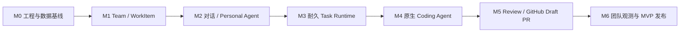

# CrewScope 实施计划

> 文档版本：v1.7<br>
> 对应设计：`CrewScope 团队协作式 AI 工作执行平台设计文档 v4.0`<br>
> 技术基线：Java 17、Spring Boot 4.0.4、AgentScope Java 2.0.0、Vue 3、PostgreSQL、Redis<br>
> 首个目标：团队对话到同级 Review 再到 GitHub Draft PR<br>
> 当前进度：M0、M1、M2、M3 已完成；M4-S01 至 M4-S04、M4-D01 至 M4-D09 已完成，下一项为 M4-I01（2026-08-18）

## 1. 实施目标

CrewScope 首个可用版本交付一条完整闭环：

```text
成员登录并进入 Team Workspace
  -> 通过对话提出研发目标
  -> Personal Agent 生成 TaskIntent
  -> 创建 Native WorkItem
  -> 确定 Owner / Executor / Gate Reviewer
  -> AgentScopeNativeRuntime 领取 TaskExecution
  -> Task Orchestrator 生成 PlanVersion
  -> Coding Specialist 在 Git Worktree 与 Sandbox 中修改代码
  -> 运行 Maven 测试并生成 DiffArtifact / TestEvidence
  -> Reviewer Specialist 生成 Advisory Finding
  -> TeamMember 完成 Gate Review
  -> Owner 确认 PlannedAction
  -> GitHubSourceCodeProvider 创建 Draft PR
  -> WorkItem、Activity、Inbox、Notification 和 Audit 更新
```

该闭环同时验证产品的五个核心能力：

1. 人是最终用户和责任主体；
2. 每位成员通过 Personal Agent 表达目标和管理工作；
3. Task Orchestrator 与 Specialist Agent 承担具体执行；
4. 责任、Review、确认和交付证据进入同一任务事实链；
5. 外部写操作通过 PlannedAction、Worker、Receipt 和 Audit 执行。

## 2. 当前工程基线

### 2.1 已具备

- 七模块 Maven Reactor 与 Vue 前端工程；
- Java 17、Spring Boot 4.0.4 和 AgentScope Java 2.0.0 BOM；
- AgentScope Harness、AG-UI、OpenAI Starter、Redis 与可选 Kubernetes Sandbox 依赖；MVP 实际使用 Harness 内置 Docker Sandbox；
- PostgreSQL、Redis 与 Docker Compose；
- Organization、Principal、Team、TeamMember、Workspace、AgentProfile、WorkProject、WorkItem、Responsibility、DomainEvent、Outbox、Audit 与 CommandReceipt 持久化基线；
- Team 创建、默认 Workspace、默认 Personal Agent、成员加入、Bootstrap/OIDC 身份映射和 Scope 权限边界；
- Native WorkItem、评论、ResourceLink、责任链、ReviewerEligibilityPolicy、Timeline、幂等命令和并发控制；
- AgentRuntime、CapabilityProvider 与三个内置 Provider 描述符；
- Spring Security Bootstrap/OIDC 双模式与 Spring Application Configuration 分业务装配；
- Conversation/Control 双入口、ScopeSwitcher、Today、Work List/Board、成员管理、WorkItem 详情、责任链和 Timeline Web；
- Maven、Vitest Coverage、Histoire、Playwright、视觉回归、Axe WCAG 和文档检查组成的 Release Gate。

### 2.2 M2 及后续待实现

- Conversation、Participant、Message、ConversationWorkItemLink、ConversationTaskLink、Agent Session、Provider Binding 与 TaskIntent；
- TaskExecution、Review、Action 和团队观察领域；
- 真实 AgentScope Agent 创建、调用、事件、中断和恢复；
- TaskExecution Claim、ExecutionLease、Heartbeat、Retry 和 Recovery；
- Task Token 与凭证换取；
- Git Worktree、Sandbox、Coding Tool 和 Diff Stream；
- GitHub 与飞书真实 Connector；
- 团队对话、看板、执行、Review、Inbox 和 Audit 前端。

## 3. MVP 范围

| 范围 | MVP 交付 |
|---|---|
| 用户 | TeamMember，开发环境支持 Bootstrap 用户，部署环境支持基础 OIDC |
| Agent | 每人一个默认 Personal Agent，任务级 Task Orchestrator、Coding Specialist 和 Reviewer Specialist，团队级只读 Team Agent |
| 仓库 | Java/Spring Boot、Git、Maven，单仓库为首个验收用例 |
| 工作项 | Native WorkItem，支持创建、看板、状态、责任、评论和关联任务 |
| Runtime | AgentScopeNativeRuntime |
| 执行 | PostgreSQL 耐久队列、Claim、Lease、Heartbeat、Pause、Resume、Cancel 和 Recovery |
| 工作区 | 同机 Execution Worker、Git Worktree、Docker Sandbox、文件修改、命令、Maven 测试、Diff 和 Artifact |
| Review | Reviewer Specialist Advisory Finding + TeamMember Gate Decision |
| Provider | Native WorkItem、GitHub SourceCode、Lark Collaboration |
| 写操作 | Push Branch 和 Draft PR 通过 PlannedAction 与 Confirmation |
| 观测 | Task Timeline、Activity、Inbox、Audit、Trace 和核心指标 |
| 交互端 | Web 工作台，飞书用于团队通知 |

MVP 以 Draft PR 为交付终点。多语言、External Coding Runtime、Preview Proxy、Plugin 市场、Autopilot、PR 合并、生产发布、Desktop 和 Mobile 进入后续里程碑。

## 4. 交付策略

### 4.1 纵向切片

每个里程碑同时交付领域模型、数据库迁移、应用用例、适配器、API、前端和测试。每个里程碑结束时形成可演示产品能力。

### 4.2 事实先行

PostgreSQL 保存团队、责任、任务、评审、动作和审计事实。Redis 保存 AgentScope 可恢复运行态。外部系统调用在数据库事务提交后执行。

### 4.3 原生 Runtime 优先

Phase 0 到 MVP 只实现 AgentScopeNativeRuntime。原生 Coding Agent 的质量通过固定任务集持续评测。External Coding Runtime 在 MVP 后通过相同 ExecutionRuntime Port 接入。

### 4.4 可恢复执行

每个长任务先落库再执行。Worker 必须使用 Claim Token、Fencing Token、ExecutionLease 和 Heartbeat。任务、Agent、Worktree 和外部动作分别实现恢复与对账。

### 4.5 安全边界

Agent 运行环境只获得 Task Token。长期 OAuth Token、PAT、GitHub App Key 和服务凭证通过 CredentialStore Port 保存。开发与 Team Beta 使用 AES-256-GCM DatabaseEnvelopeCredentialStore，主密钥由进程外 Secret 注入；生产加固接入 Vault/KMS。Provider 写操作使用 PlannedAction 和动作级短期凭证。开发、CI 和 MVP 验收默认使用 Docker Sandbox；本地进程只用于显式受信任仓库。

### 4.6 执行边界

- Task 保存业务目标生命周期，TaskExecution 保存一次执行尝试与 Claim/Lease 状态；
- MVP 只使用 TaskExecution Lease，StepExecution 在有效 Lease 内串行运行并使用乐观锁与检查点；
- Coding Specialist 与 Reviewer Specialist 由 Durable Task Runtime 创建为 StepExecution；
- AgentScope `agent_spawn` 只处理短时、可重算、无外部副作用的内部分析；
- 所有会修改 Artifact、Worktree 或外部系统的工作进入 StepExecution 或 PlannedAction Worker。

### 4.7 存储边界

- PostgreSQL 保存领域事实、Outbox、Audit 和投影检查点；
- Redis 保存 AgentScope 运行态、小型短期状态和分布式协调；
- ArtifactStore 保存 RuntimeArtifact、Diff、测试日志和 AgentStateSnapshot；
- 开发使用 FilesystemArtifactStore，部署使用 S3/MinIOArtifactStore；
- Redis 不保存大 Workspace Snapshot。

### 4.8 分层计划

本文件保存 M0–M6 的范围、依赖、周期和出口门槛。可执行 Backlog 与架构决策分别维护：

- [里程碑执行清单与任务规范](plans/README.md)；
- [M0：工程与数据基线执行清单](plans/M0-工程与数据基线.md)；
- [M1：Team、WorkItem 与责任基础执行清单](plans/M1-Team与WorkItem.md)；
- [M2：Conversation 与 Personal Agent 执行清单](plans/M2-Conversation与Personal-Agent.md)；
- [M3：耐久 Task Runtime 执行清单](plans/M3-耐久Task-Runtime.md)；
- [CrewScope 前端设计规范](CrewScope-前端设计规范.md)；
- [Architecture Decision Records](adr/README.md)。

当前里程碑和下一个里程碑拆到 0.5–2 天的 TASK。更远里程碑保留 Feature 级范围，在关键 Spike 和前序验收完成后滚动细化。

### 4.9 前端产品与视觉策略

前端按 Conversation Mode 和 Control Mode 双入口交付。Conversation Mode 承载 Personal Agent 对话、TaskIntent、计划和实时执行；Control Mode 承载 Team、WorkItem、责任、Review、Task、Artifact、Action 和 Audit 的传统 Web 管理。两个入口共享 Application Command、Domain Query 和事件投影，并提供对象级双向跳转。

交互研究参考 `vibe-kanban` 的对话/执行/Diff 联动和 `multica` 的多视图/管理控制面。实现使用 CrewScope 独立的信息架构、Design Token、Vue 组件和视觉资产，核心界面对象为 Responsibility Chain、Agent Presence、Task Timeline、Review Gate、Action Receipt 和 Team Activity。

每个里程碑的前端交付遵循 [CrewScope 前端设计规范](CrewScope-前端设计规范.md)，同步提供：

- 该里程碑事实对象的传统管理页面；
- 该里程碑对话或 Agent 能力的嵌入入口；
- Loading、Empty、Error、Forbidden、Conflict 和 Offline 状态；
- 桌面布局与窄屏降级行为；
- Vitest、Playwright、组件工作台和关键页面截图基线；
- 竞品参考来源与 CrewScope 差异说明。

## 5. 里程碑与依赖



| 里程碑 | 可演示结果 | 建议周期 |
|---|---|---:|
| M0 | 真实 PostgreSQL 仓储、Testcontainers、事件投影基线、存储 Port 和稳定 CI | 2–3 周 |
| M1 | 成员创建 Team、WorkProject、WorkItem 和责任 | 2 周 |
| M2 | 成员在 Web 与 Personal Agent 对话并生成 TaskIntent | 2 周 |
| M3 | TaskExecution 可领取、心跳、暂停、恢复、取消和重试 | 3–4 周 |
| M4 | AgentScope 原生 Coding Agent 在同机 Worktree 与 Docker Sandbox 中修改并测试代码 | 4–5 周 |
| M5 | 成员完成 Gate Review 并通过 ActionBundle 创建 GitHub Draft PR | 3–4 周 |
| M6 | Activity、Inbox、Audit、飞书通知、恢复和故障测试达标 | 3–4 周 |

建议周期以 2 名后端与 1 名前端小组为基准，18–24 周交付 Team Beta。单人实施按 M0 到 M6 串行推进，建议预留 7–10 个月。生产级 Kubernetes 执行拓扑、Vault/KMS 高可用、容灾和长期 SLO 加固在 Team Beta 后单独排期。

## 6. M0：工程与数据基线

### 6.1 目标

把当前骨架升级为可持续迭代的模块化单体基线。

### 6.2 实施任务

#### 领域与应用

- 统一 `AggregateId`、`PrincipalId`、`OrganizationId`、`TeamId`、`WorkspaceId`、`ArtifactId` 和时间类型；
- 定义领域错误、乐观锁错误和幂等冲突错误；
- 统一 Application Command、Query、Port 和事务边界；
- 定义 DomainEvent Envelope、统一实时事件信封与 Outbox Port；
- 定义 `ArtifactStore`、`CredentialStore` 和 `EventProjector` Port；
- 完成 AgentScope HarnessAgent、Structured Output、AG-UI、Interrupt/Resume 和 Docker Sandbox 最小技术验证。

#### 数据与基础设施

- 保留已发布迁移，通过 V2 建立身份与平台基线、V3 增加 DomainEvent 聚合版本、V4 增加 Outbox 租约与消费回执、V5 增加 Command Receipt；
- 增加 `principal`、`team_member`、`team_role`、`team_member_role`、`audit_event`、`event_projection_checkpoint`、开发环境 `credential_secret` 与必要索引；
- 为成员或 Agent 可修改的业务事实表增加乐观锁、审计时间、`created_by_principal_id`、`updated_by_principal_id` 和租户一致外键；
- 使用领域状态表达归档、取消、离开、移除、撤销和过期，删除原因写入 AuditEvent，MVP 不建立全表通用逻辑删除字段；
- 为 V1 中延后解析的 Principal 引用补齐外键；
- 实现 WorkItem JPA Entity、Mapper 和 Repository Adapter；
- 实现领域状态、DomainEvent 和 Outbox 同事务提交；
- 实现最小 Outbox Publisher：`SKIP LOCKED` Claim、租约 Token、分区顺序、并发发布、指数退避、过期回收、Dead Letter 和 `consumerName + eventId` 幂等消费；
- 实现 Projection Runner、ProjectionCheckpoint 和 AuditEvent 追加写；
- 实现 FilesystemArtifactStore 和开发环境加密 CredentialStore，主密钥从外部配置注入；
- 增加 PostgreSQL 与 Redis Testcontainers 测试基类；
- 增加数据库空库迁移、逐版本升级、非默认 `search_path` 与 Repository 集成测试；
- 所有迁移对象、索引、约束和外键显式使用 `crewscope.*`。

#### 服务端与前端

- 定义 `/api/v1` 错误信封、Cursor 分页和 `Idempotency-Key`；
- 按 ADR-008 引入全请求 Correlation ID、W3C Trace、Logstash JSON 结构化日志、字段级脱敏和低基数 API 指标；
- 建立 Vue Router、API Client、统一错误处理和双入口 AppShell；
- 建立 CrewScope Design Token、基础组件和 Responsibility/Agent/Task 状态语义；
- 增加 Histoire、Vitest、Playwright 与关键尺寸截图基线；
- CI 增加集成测试、前端测试和构建产物检查。

### 6.3 交付物

- 可持久化 WorkItem 的 Repository Adapter；
- 事务 Outbox 写入；
- 最小 Outbox 发布、Audit 追加写和投影检查点；
- ArtifactStore、CredentialStore 与 AgentScope 集成技术验证；
- Testcontainers 集成测试基础；
- 统一 API、前端工程骨架、Design Token 和组件工作台；
- 稳定的 `./mvnw clean verify` 和 `pnpm build` CI。

### 6.4 验收

1. PostgreSQL 启动后 Flyway 可从空库完成全量迁移；
2. WorkItem 创建、查询与状态迁移经过真实 PostgreSQL；
3. WorkItem 事实与 Outbox 在同一事务内提交；
4. Outbox 重复投递只产生一份有效投影和追加写 AuditEvent；
5. 版本冲突与重复幂等键返回稳定错误；
6. FilesystemArtifactStore 完成哈希校验、读取与清理，开发凭证密文不出现在日志和数据库明文字段；
7. AgentScope 最小 Harness、Structured Output、AG-UI Resume 和 Docker Sandbox 验证通过；
8. AppShell、基础组件与截图基线在桌面和窄屏尺寸通过；
9. CI 在无本地服务依赖的环境中完成验证。

## 7. M1：Team、WorkItem 与责任基础

### 7.1 目标

建立人、Personal Agent、Team、Workspace 和 WorkItem 的稳定产品事实。

### 7.2 实施任务

#### 领域与数据

- Principal：`USER/PERSONAL_AGENT/TEAM_AGENT/SPECIALIST_AGENT/SERVICE`；
- Team、TeamMember、内置 TeamRole 和 Team Workspace；
- WorkProject、WorkItem、Comment 和 ResourceLink；
- ResponsibilityAssignment：MVP 先实现 `OWNER/EXECUTOR/REVIEWER`；
- 一个 TeamMember 创建一个默认 Personal Agent Principal 与 AgentProfile；
- ResponsibilityAssignment 是责任事实源，WorkItem Owner 字段只保存受约束引用或投影；
- 使用部分唯一索引保证每个 WorkItem 只有一个 active Owner；
- 使用唯一约束保证每个成员只有一个 active 默认 Personal Agent Principal 与 AgentProfile；
- Gate Reviewer 必须是 active TeamMember，ReviewerEligibilityPolicy 默认要求 Reviewer 与 Owner/Executor 分离，单人团队通过显式 PolicyPack 降级；
- `V6__team_work_and_responsibility.sql` 及索引、唯一约束和乐观锁。

#### 用例与 API

- Team 创建、成员加入、Workspace 初始化；
- WorkProject 创建和仓库引用配置；
- WorkItem 创建时原子建立创建者 Owner，并提供查询、列表、看板、状态迁移和评论；
- Owner、Executor 和 Reviewer 分配；
- WorkItem 乐观锁、权限检查和事件时间线；
- M1 时间线直接读取 DomainEvent/Audit 基线，按 DomainEvent ID 去重，并以 `occurredAt + canonicalEventId` 专用 Cursor 续传；M6 再物化为 Activity 读模型；
- 开发 Profile 使用 Bootstrap Basic 登录，将用户名原子映射为 USER Principal；创建 Team 时绑定 Owner TeamMember；
- 部署 Profile 使用基础 OIDC Login，按 Registration 与 `sub` 原子映射 USER Principal；TeamMember 通过 Team 创建和成员管理用例绑定；
- 身份首次映射提交隐私安全的 DomainEvent 与 Outbox，认证访问不自动创建 TeamMember。

#### 前端

- Team/WorkProject ScopeSwitcher、Today 与 Work 管理导航；M1-F01 已交付真实 A01/A03 API Gateway、URL 范围恢复、成员管理与权限守卫，验证见[Scope 与团队管理前端](testing/M1-F01-Scope与团队管理前端.md)；
- WorkItem List/Board、筛选、详情抽屉和 URL 状态恢复；M1-F02 已交付真实 A04/A05 API Gateway、Native WorkItem 创建、Cursor、List/Board、共享 WorkItemCard 与 URL 视图状态，验证见[WorkItem 集合前端](testing/M1-F02-WorkItem集合前端.md)；
- M1-F03 已交付 WorkItem 一致性详情、状态迁移、评论、ResourceLink、版本冲突刷新、详情深链接与 Conversation 对象级跳转，验证见[WorkItem 详情与协作前端](testing/M1-F03-WorkItem详情与协作前端.md)；
- M1-F04 已交付 ResponsibilityChain、Owner/Executor/Gate/Advisory 分配与释放、资格提示、冲突刷新、业务时间线和 Personal Agent/执行占位入口，验证见[责任链与时间线前端](testing/M1-F04-责任链与时间线前端.md)；
- 评论、状态历史和责任活动统一进入 WorkItem 详情观察面；
- 桌面/窄屏响应式、键盘操作、视觉回归与竞品差异检查。

### 7.3 验收

1. 用户创建 Team 后自动成为 Team Owner；
2. 成员具有唯一默认 Personal Agent；
3. WorkItem 始终具有一个有效 Owner；
4. 成员可在看板与详情页查看责任和时间线；
5. 未授权成员无法访问 Team 资源；
6. 并发更新通过期望版本检测冲突；
7. List/Board 切换、筛选与详情对象可通过 URL 恢复；
8. 领域规则与数据库约束共同阻止重复 active Owner、重复默认 Personal Agent 和不合格 Gate Reviewer；
9. 关键页面通过响应式、可访问性、截图回归和竞品非雷同评审。

## 8. M2：Conversation 与 Personal Agent

### 8.1 目标

打通 Web 对话、AG-UI、AgentScope HarnessAgent 和结构化 TaskIntent。

### 8.2 实施任务

#### 对话领域

- Conversation、Participant、Message 和 ConversationWorkItemLink；
- Personal/Team 可见性和消息游标；
- ProviderDefinition、ProviderImplementation、Connection、ConnectionGrant 和 ProviderBinding 最小模型与只读 BindingResolver；
- `V7__conversation_agent_and_provider_binding.sql`；
- Conversation REST API 和 AG-UI Run 映射；
- 消息、Agent Run 与业务事件分层持久化。

#### AgentScope 原生运行时

- 将当前 `AgentRuntime` 扩展为 `ExecutionRuntime` Port；
- 实现 `AgentScopeNativeRuntime`、Agent Factory 和 Personal Agent Factory；
- 实现 `PlatformExecutionContext` 和 RuntimeContext 注入；
- 实现 Team/Workspace/Principal 中间件与基础 Audit Middleware；
- ProviderBinding 同级歧义失败关闭，解析结果只能来自服务端并写入 RuntimeContext；
- 配置 AgentScope DistributedStore、Session Key 和 FIFO Gate；
- 实现 TaskIntentV1、ClarificationRequestV1 和 WorkItemCreateV1；
- 实现 AgentScope 事件到 AG-UI 与 CrewScope Event 的映射；
- AG-UI、Conversation Event 与 Team Event 使用统一事件信封和 DomainEvent ID；
- Command 响应返回 `commandId/domainEventId/committedVersion/correlationId`，前端按投影版本清理 optimistic state；
- 实现 Token Usage、Model Error、Retry 和 Fallback 记录。

#### 对话用例

- 新对话、追加消息、断线重连和历史补发；
- Agent 进行信息澄清并生成 TaskIntent；
- 用户确认后创建 WorkItem 与责任关系；
- WorkItem 详情页与 Conversation 互相跳转。

#### 前端

- M2-F01 已交付真实 Conversation Gateway/Store、可见会话列表、当前 Participant 观察面、PRIVATE/TEAM 创建入口和 Team/Conversation 深链接恢复；
- 创建命令以 CommandReceipt 为边界，刷新后只选择服务端新增事实，不生成客户端 Conversation ID；
- Scope、Collection、Detail 分别使用 URL 规范化、请求取消和版本裁决，阻止慢请求或旧深链接污染当前 Team；
- 路由权限与 API `403` 统一进入 Access Denied，窄屏在会话列表和详情间显式切换；
- M2-F02 已交付真实 Message Gateway/Store、倒序历史转正序展示、不透明 Cursor 续页、ID 去重、USER/AGENT/SYSTEM 消息样式和响应式 Composer；
- 用户消息使用 Pending 及 CommandReceipt 后历史回读收口，失败重试复用原 `Idempotency-Key`，原输入和用户新草稿均保留；
- Markdown 禁用原始 HTML，经 DOM 白名单和链接协议白名单清理；Enter 发送、Shift+Enter 换行，输入上限 50,000 字符；
- M2-F03 已交付 Owner Personal Agent Invocation、AG-UI 公开文本流、同键断线重放、刷新恢复、显式取消、Conversation Event Cursor 和投影缺口追平；
- Owner 的 Composer 走 Invocation，非 Owner ACTIVE Participant 只追加普通 Message；瞬时文本在最终 AGENT Message 回读后收口；
- 前端只处理安全 AG-UI 白名单，Reasoning、Tool、State 和未知事件不进入 UI；验证见 [AG-UI 流式回复与 Conversation Event 恢复](testing/M2-F03-AG-UI流式回复与Conversation-Event恢复.md)；
- M2-F04 已交付结构化 Clarification 卡、字段化 Resume、TaskIntent 当前事实、完整修订、拒绝、确认预检、空 Body 确认、强 ETag 和版本冲突刷新；验证见 [Clarification 与 TaskIntent 前端](testing/M2-F04-Clarification与TaskIntent前端.md)。
- M2-F05 已交付 Conversation/WorkItem 双向关联、对象级深链接、责任事实同屏展示和刷新恢复；验证见 [Conversation 与 WorkItem 双向跳转](testing/M2-F05-Conversation与WorkItem双向跳转.md)。
- M2-F06 已交付六类页面状态、离线草稿保留、ARIA Live、对象级焦点恢复、Reduced Motion、窄屏 Composer 和浅绿色视觉回归；验证见 [前端状态与可访问性硬化](testing/M2-F06-前端状态与可访问性硬化.md)。

M2 使用 `ConversationWorkItemLink` 保存已确认 TaskIntent 与 WorkItem 的真实关联。`ConversationTaskLink` 随 M3 的 Task 聚合一起建立，V7 不保存缺少 Task 外键约束的悬空关联。

### 8.3 测试

- 使用可控测试 Model 或录制 Fixture 验证 AgentScope 事件映射；
- Structured Output Schema 、Bean Validation 和业务规则测试；
- 同一 Session FIFO 和不同 Session 并行测试；
- SSE 中断、续传和重复事件测试；
- AG-UI、Conversation Event 与 Team Event 交叉去重、乱序和投影追平测试；
- Prompt 注入与越权工具可见性测试。

### 8.4 验收

1. 成员可在 Web 工作台与自己的 Personal Agent 流式对话；
2. Agent 可澄清需求并输出合法 TaskIntent；
3. 用户确认后创建 WorkItem、Owner 和 Reviewer；
4. 页面断线后可从事件游标恢复；
5. Agent 无法伪造 Principal、TeamRole 和 ProviderBinding。

## 9. M3：耐久 Task Runtime

### 9.1 目标

建立可领取、可并发、可暂停、可重试和可恢复的任务执行内核。

### 9.2 数据模型

- Task 业务生命周期、TaskExecution 执行尝试、StepExecution 和 PlanVersion；
- ConversationTaskLink，将已有 Conversation 与 M3 Task 建立受外键约束的多对多关联；
- ExecutionRuntime、RuntimeWorker 和 RuntimeCapabilities；
- ExecutionRuntime Registry 使用 `Organization + RuntimeEnvironment + runtimeKey` 稳定隔离，RuntimeWorker 使用 Runtime 内 stable key 稳定识别；
- Worker 只在 Runtime 与 Worker 都为 ACTIVE、心跳未过期、容量可用、能力匹配且 Organization/环境/Runtime 谱系闭合时可被路由；
- `DRAINING` 保留在途负载并停止新 Claim，心跳失联由 `lastHeartbeatAt + timeout` 派生，不覆盖显式 Worker 状态；
- TaskExecution 级 ExecutionLease、TaskCredentialGrant，以及 TASK、STEP、SPECIALIST TaskAgentRuntimeSession；
- AgentRun、有限流 Segment、AgentInterrupt、RuntimeArtifact 和 AgentStateSnapshot；
- `V10__durable_task_runtime.sql`；
- READY 队列索引、过期租约索引与终态条件约束。

### 9.3 调度与 Worker

- 使用 `FOR UPDATE SKIP LOCKED` 实现 TaskExecution Claim；
- MVP 一个 TaskExecution 持有一个 Lease，Worker 在该 Lease 内串行驱动 StepExecution；
- StepExecution 使用状态、检查点和乐观锁，不独立 Claim、续租或创建 Step Lease；
- 实现 RuntimeCapabilities、Agent 配额与 Team 配额匹配；
- 生成一次性 Claim Token 和单调 Fencing Token，数据库只保存 Claim Token 哈希；
- TaskExecution 保存最后已提交 Fencing Token，每次 Claim 在同一事务中严格递增；ExecutionLease 绑定该纪元并不能自行分配 Fencing Token；
- Worker 命令使用 `TaskExecution + attempt + Runtime + Worker + ClaimTokenHash + FencingToken` 完整所有权坐标，任意一项不一致都失败关闭；
- PREPARE 和 RUN 使用有上下界的独立 Lease 时长，Heartbeat 只递增 Lease Version，不改写 TaskExecution Version；
- 实现 `CLAIMED -> PREPARING -> RUNNING` 和 Prepare/Run Lease；M3 的 PREPARING 负责 Runtime、Task Token、Skill Bundle 与 Agent Session，ExecutionWorkspace 在 M4 接入；
- 实现 Heartbeat、Progress、Complete、Fail 和 Cancel 条件更新；
- 实现 Lease Sweeper、`RECOVERING` 与失败分类；
- 实现 `attempt/max_attempts/parent_execution_id` 和指数退避；
- 实现 Pause、Resume、Cancel 安全点；
- `all` Profile 先使用 JVM Worker，保留独立 `worker` Profile；
- Coding/Reviewer Specialist 作为耐久 StepExecution 调度；AgentScope `agent_spawn` 仅用于可重算、无副作用的内部分析。

### 9.4 Task Token

- 使用 5 秒至 15 分钟的 HS256 JWT，且有效期不超过当前 ExecutionLease；外部 Key Ring 通过 `kid` 支持先扩展验证 Key、再切换签发 Key 的无中断轮换；
- `TaskTokenClaims` 与 `TaskCredentialGrant` 共享同一 `TaskTokenGrantScope`，闭合 Organization、Team、Workspace、Task、TaskExecution、attempt、Lease、Runtime、Worker、Claim Token Hash、Fencing Token、Execution Principal、PolicySnapshot 和 SafetyEnforcementOverlay；
- 数据库保存 TaskCredentialGrant 和 SHA-256 JTI Hash，明文 JTI 只进入一次性签发结果与受信签名边界；
- Provider 授权固化活动 ProviderBinding 的 Version、ConnectionGrant ID/Version、Capability 和显式资源最小子集；
- 每次使用检查 Grant/Claims 闭合、当前 Lease 全坐标、Tool、ProviderBinding、Capability、Resource、过期、撤销和 Grant Version；
- `ACTIVE -> REVOKED/EXPIRED` 为互斥终态，授权使用只前进 useCount、lastUsedAt 和 Version；
- Token 轮换在一个事务中撤销旧 Grant 并创建新 JTI/Grant，新 Tool、Provider、Capability 和资源范围只能等于或窄于旧范围；
- `/api/internal/v1/worker/**` 只接受 Bearer Task Token，中间件注入服务端验证的 `TaskTokenExecutionContext`，Basic、OIDC Session、重复 Header 和 Body 身份不能替代；
- Agent 环境只注入 Task Token；
- Runtime 凭证与用户长期凭证禁止进入 Agent 环境；
- Token 不可用时将当前 TaskExecution 转入安全失败并生成 AuditEvent。

### 9.5 恢复

- RedisDistributedStore 保存 AgentState；
- PostgreSQL 保存 Task、Step、Plan 和检查点；
- ArtifactStore 保存 AgentStateSnapshot 与大结果，开发使用 Filesystem 实现，部署使用 S3/MinIO 实现；
- Docker Compose 增加可选 MinIO Profile，验证对象哈希、服务端加密、TTL、删除 Tombstone 和断点恢复；
- AgentScope Sandbox Snapshot 通过 ArtifactStore Snapshot Adapter 保存，Redis 不保存大 Workspace Snapshot；
- 续接失败时创建新 AgentRun 并显式记录 continuity gap；
- 任务恢复前对账运行中 AgentRun 与 PlannedAction。

### 9.6 验收

1. 两个 Worker 并发 Claim 时只有一个成功；
2. Heartbeat 停止后 Lease Sweeper 将任务转入恢复；
3. Complete 与 Lease Sweeper 竞争时只产生一个有效终态；
4. Task Token 不能访问其他 Task、Provider 或资源；
5. 进程在 `CLAIMED`、`PREPARING` 和 `RUNNING` 退出后均能自动收敛；
6. 暂停、恢复和取消不产生孤立 AgentRun 和 StepExecution；
7. Task 业务状态与 TaskExecution 的 Claim、Lease 和恢复状态互不覆盖；
8. MVP 不产生 Step Lease，失效 TaskExecution Lease 后不能提交任何 Step 结果。

## 10. M4：AgentScope 原生 Coding Agent

### 10.1 目标

让 Coding Specialist 在可恢复的隔离工作区中完成真实 Java 仓库的分析、修改、测试和 Diff 交付。

### 10.2 ExecutionWorkspace

- RepositoryBinding、CodingTargetSnapshot、ExecutionWorkspace、WorkspacePolicy、DiffArtifact、CommandEvidence、TestEvidence 和 CodingCheckpoint 数据模型；
- M4 使用管理员登记的受管本地 Git 源仓库；成员只提交 Repository Key、Ref 与任务目标，不能提交任意宿主路径；
- `V14__execution_workspace_and_artifacts.sql`；
- 基于系统 Git 命令实现类型化 `GitCommandExecutor`；
- 命令参数使用数组构建，命令执行不经过 Shell 字符串拼接；
- 实现分支命名、Worktree 创建、路径级锁、Git 元数据校验和重试；
- 实现部分创建回滚、冷恢复、归档和清理；
- 实现 Sandbox Port：开发、CI 与 MVP 部署统一使用同机 Execution Worker 管理的 Docker Sandbox；
- Worker、Worktree、Docker bind mount 与 Diff Watcher 位于同一执行节点；
- Sandbox 挂载当前 Worktree，限制用户、CPU、内存、超时、网络和凭证；
- 本地进程只允许显式 `trusted-repository` Profile，禁止用于 CI、故障测试和 MVP 验收；
- Kubernetes Sandbox 进入后续 ADR，明确 DaemonSet Worker、节点亲和性、节点工作目录或 RWX PVC 后再实现。

### 10.3 Coding Toolkit

- Repository metadata、tree、search、read 和 history；
- 复用 HarnessAgent、DockerFilesystemSpec、AbstractFilesystem、Plan/Task List、Compaction、Interrupt/Resume 和 Sandbox 文件系统注入；CrewScope 包装 TaskExecution 级 Sandbox 生命周期，external Sandbox 注入和每次 Tool 调用均复验 Lease/Fencing；
- 原生 FilesystemTool 缺少 CrewScope AllowedPaths 与证据边界，原生 ShellExecuteTool 接受原始 Shell 字符串；M4 不直接注册两者，通过受控 CodingFilesystemTool 与结构化 SandboxCommandTool 包装底层 Sandbox 能力；
- 禁止注册可绕过上述边界的第二套文件、Shell、MCP、动态 Skill 或外部网络 Tool；
- Worktree 内文件创建、修改、Patch、重命名和删除；
- 受控命令执行，MVP 允许 Maven 构建、测试和项目内脚本白名单；
- Agent 可读取 Git status、diff、log 和 show；本地交付 Commit 由平台 Finalizer 在 Diff 与测试证据复验后创建；
- AllowedPaths、文件数、文件大小、命令、超时和输出限额；
- 大日志写入 RuntimeArtifact，Agent 只获取摘要和 Artifact 引用；
- 所有工具调用关联 Task、Step、AgentRun、Principal 和 Trace。

### 10.4 Coding Specialist

- 实现 RepositoryAnalysisV1、CodeChangeResultV1、TestEvidenceV1 和 DiffManifestV1；
- 实现“仓库分析—计划—修改—测试—Diff 自检—交付”循环；
- 实现 Task Orchestrator 对 Coding Specialist 的调度与结果验证；
- 实现测试失败修复轮次、Token 预算和最大尝试；
- 实现 PriorSession、PriorWorktree、Todo 和检查点恢复；
- 建立 10–20 个固定 Java/Spring Boot Coding 任务样例；
- 在 M4 开始前冻结评测集版本、功能门槛、安全门槛、恢复门槛和评测环境。

### 10.5 Diff Stream

- 文件系统事件监听；
- Git HEAD、索引和目标基线检查；
- 周期 Reconcile 与重置事件；
- 变更文件、新增行、删除行与 Patch 流；
- 单文件和累计 Diff 内容上限；
- SSE/WebSocket 游标续传和最终 DiffArtifact 固化。

### 10.6 Execution Studio

- WorkProject Settings 提供受管 RepositoryBinding 的 Preflight、创建、启停和版本管理；
- WorkItem 委托表单与 Conversation TaskIntent 确认支持选择 Repository、基线 Ref、AllowedPaths、BuildProfile 和验收条件；
- Task 详情展示 Workspace、Sandbox、Coding Agent、计划、Todo、当前命令、预算、恢复代次与最终结果；
- 文件树、实时 Diff、单文件 Patch、变更统计、CommandEvidence、TestEvidence 和 Artifact 下载；
- 命令与日志视图只读，不提供浏览器任意交互式终端；
- Conversation Mode 与 Control Mode 使用同一 Task/Workspace 服务端事实和对象级深链接；
- Loading、Empty、Error、Forbidden、Offline、Reconnecting、Recovering、Cancelled 与 Terminal 状态完整；
- 桌面、窄屏、键盘、ARIA Live、Reduced Motion、Axe WCAG 2.2 AA 和视觉回归进入门禁。

### 10.7 验收

1. 每个 TaskExecution 创建独立 Worktree 和分支；
2. 目录存在但 Git 元数据损坏时可自动恢复；
3. Coding Specialist 在固定任务集上的端到端成功率达到 `>=70%`，所有成功任务通过对应编译、测试和验收标准；
4. 超出 AllowedPaths 的文件修改、禁止命令实际执行和凭证泄漏数量均为 0；
5. Diff Stream 丢失文件事件后通过 Reconcile 恢复一致；
6. 任务中断后可从 Worktree、Plan、Todo 和检查点继续，固定故障样本恢复成功率达到 `>=95%`；
7. 至少一个真实 CrewScope 修改通过完整 Sandbox、Diff、测试和结构化交付闭环；
8. Docker Sandbox 内修改可被同机 Diff Watcher 观察，Worker 与 Sandbox 重启后 Worktree 仍可对账；
9. CI 和 MVP 验收没有使用本地进程 Sandbox。

## 11. M5：Review、PlannedAction 与 GitHub Draft PR

### 11.1 目标

将 Agent 产生的代码变更转化为经成员 Review、精确确认和可审计外部动作的 Draft PR。

### 11.2 Review

- ContextPackage、ReviewRequest、ReviewFinding 和 ReviewDecision；
- `V15__review_action_and_github.sql`；
- Review Subject 绑定基线 Commit、DiffArtifact、TestEvidence 和验收标准；
- Reviewer Specialist 使用独立 Session 生成 `ADVISORY` Finding；
- TeamMember 提交 `APPROVED/CHANGES_REQUESTED/REJECTED` Gate Decision；
- `CHANGES_REQUESTED` 重新激活 Coding Specialist；
- Diff 变化后原 ReviewRequest 失效并生成新版本。

### 11.3 Provider 与凭证

- 扩展 M2 的 ProviderDefinition、ProviderImplementation、Connection、ConnectionGrant、ProviderBinding 与 BindingResolver；
- MVP 使用内置注册表，保留后续 Plugin 扩展边界；
- 实现 BindingResolver：Action/Task 显式绑定、WorkProject、执行身份对应的 Workspace、Organization 默认；同级歧义时失败关闭；
- 将解析后的 ProviderBinding、ConnectionGrant、Credential Subject 和资源范围固化到 PolicySnapshot 与 ActionDigest；
- 实现 SourceCodeProvider 的仓库、分支、Push、Draft PR 和 PR 查询契约；
- 实现 GitHub Connector，支持 GitHub App 或 OAuth Connection；
- Team Beta 使用 AES-256-GCM DatabaseEnvelopeCredentialStore，主密钥由进程外 Secret 注入；Credential Service 只向 Connector Worker 签发动作级短期能力；
- 实现 Connection 凭证轮换、撤销、失效传播、审计和越权测试；
- Push 使用类型化系统 Git 命令、一次性 GitHub App installation token 和临时 `GIT_ASKPASS`，执行后立即清理；
- 使用可测试 HTTP Client 边界、错误归一化、限流和重试；
- Webhook 实现验签、去重、自身事件过滤和 PR 状态对账。

### 11.4 PlannedAction

- ActionBundle、PlannedAction、Confirmation、ActionReceipt 和 ReconcileJob；
- Push Branch 与 Create Draft PR 分别生成可审查动作，并由一个精确 ActionBundle 展示和确认；
- ActionDigest 绑定 Task、Plan、责任、ProviderBinding、参数、目标和基线；
- Owner 通过 AG-UI 或 Web 确认；
- Worker 使用幂等键与动作级短期凭证执行；
- Push Receipt 保存远端 Branch 与 Head SHA；Push 成功而 PR 失败时只重试 Create Draft PR；
- Push 返回超时或 Receipt 丢失时主动查询远端 Branch Head SHA，匹配预期 SHA 后补写 Receipt，不匹配则进入人工对账；
- 结果不确定时进入 `UNKNOWN -> RECONCILING`；
- 成功后保存 PR URL、编号、Head SHA、外部 Operation ID 和回执哈希。

### 11.5 前端

- Diff 文件列表与内容查看；
- TestEvidence 与验收标准；
- Reviewer Finding、Gate Decision 和修改轮次；
- PlannedAction 确认卡片；
- ActionBundle 展示两个动作的参数、风险、依赖和分别回执；
- Draft PR 结果和 ActionReceipt。

### 11.6 验收

1. ReviewRequest 绑定精确 Diff 和基线；
2. Agent 只能提交 Advisory Finding，TeamMember 提交 Gate Decision；
3. Diff 变化后原 Gate Decision 不能用于新动作；
4. GitHub 写操作未确认时不执行；
5. 重复调度只创建一个有效 Draft PR 或进入明确对账；
6. Draft PR、Receipt、WorkItem 和 Audit 使用同一 Correlation ID；
7. 一次确认只覆盖精确 ActionBundle，任一动作参数、基线、责任、Binding 或策略变化后必须重新确认；
8. Push 成功、PR 创建失败时不重复 Push，只重试 PR 动作；
9. GitHub 长期凭证、installation token 和 AskPass 内容不进入 Agent、日志、Artifact 和数据库明文字段；
10. Push 超时或 Receipt 丢失时通过远端 Head SHA 对账并补写唯一 Receipt，不产生重复 Push。

## 12. M6：团队观测、飞书通知与 MVP 发布

### 12.1 目标

补齐团队使用所需的活动、收件箱、通知、审计、可观测、故障恢复和产品验收。

### 12.2 投影与实时事件

- 加固 M0 的 Outbox Publisher、Projection Runner 与 Projection Checkpoint；
- WorkItem Activity、Team Activity、Inbox 和 Audit 投影；
- 统一事件信封下的 Team Event Cursor、Conversation Event Cursor、AG-UI 合并去重和断线补发；
- 重复事件、乱序事件和投影重建；
- 成员的“我的负责”、“我的执行”、“待 Review”、“待确认”和“异常”收件箱。

本里程碑同时创建默认 Team Service Principal 与只读 Team AgentProfile。Team Agent 只能读取团队可见 WorkItem、Task、Activity、Inbox 统计和 Artifact 摘要，用于团队进度、阻塞、Review 积压和风险汇总。

### 12.3 Lark Collaboration Provider

- 内置 Lark Connection 与用户/成员映射；
- 成员查询、固定模板消息、任务链接和回执；
- 通知写操作继续使用 PlannedAction 与 NotificationDelivery；
- 实现投递去重、重试、失败收件箱和再次投递；
- MVP 通知包含 WorkItem、Owner、Reviewer、PR 与最终状态。

MVP 的飞书能力仅为 CollaborationProvider 出站成员查询和固定模板通知。飞书入站对话 Channel、消息驱动任务和自由文本发送进入后续里程碑。

### 12.4 观测与审计

- OTel 关联 Conversation、AgentRun、Task、Lease、Workspace、Tool、Action 和 Connector；
- Prometheus 指标覆盖 Claim、Heartbeat、Recovery、Diff、Model、Tool、Provider 和 Projection；
- Task Timeline 展示责任、Plan、Step、Agent、Diff、Review、Action 和 Receipt；
- Audit 支持按 Team、Member、WorkItem、Task、Provider 和 Correlation ID 查询；
- 敏感字段、Token、命令输出和 Provider 响应完成脱敏。

### 12.5 端到端与故障测试

- Playwright 覆盖“对话—WorkItem—执行—Review—Draft PR”；
- 外部 Model、GitHub 和飞书使用可控 Stub/Mock Server；
- Worker 在 Claim、Prepare、Run、Complete 阶段退出；
- Redis 不可用与 AgentStateSnapshot 重建；
- Worktree 部分创建、元数据损坏和清理失败；
- External Tool 挂起、Confirmation 重复、Worker 重复调度和 Receipt 丢失；
- Webhook、Outbox、Projection、Inbox 和 Notification 重复投递；
- Task Token 过期、撤销和越权访问。

### 12.6 MVP 发布门槛

1. 首条纵向闭环在干净环境中可重复演示；
2. 安全测试集的越权工具与资源访问阻断率为 `100%`；
3. 故障注入中平台重复 Action Dispatch 为 0；
4. Worker 租约冲突后在至少 100 次固定故障样本中的自动恢复率达到 `>=99%`；
5. Worktree 创建失败后回滚完整率为 `100%`；
6. 进程重启后可从 PostgreSQL、Redis/Snapshot 和 Worktree 恢复任务；
7. 唯一有效 Draft PR、ActionReceipt 与完整 Audit 链可查询；
8. Team Agent 只能读取团队可见事实并生成进度、阻塞和风险汇总；
9. 所有后端、前端、集成、端到端和故障测试经过 CI；
10. 固定负载测试下 READY TaskExecution Claim 延迟与团队投影延迟达到目标，测试环境、并发量、样本量和结果归档；
11. 月度可用性与长期延迟作为上线后的运营 SLO，不作为发布前无法观测的阻塞条件。

## 13. 模块实施边界

| 模块 | 实施内容 |
|---|---|
| `crewscope-domain` | Principal、Team、WorkItem、Responsibility、Conversation、Task、Review、Action、Artifact 领域对象与状态机 |
| `crewscope-application` | Command/Query Service、Repository Port、ExecutionRuntime Port、Provider Port、策略编排与事务边界 |
| `crewscope-agentscope` | Agent Factory、AgentScopeNativeRuntime、RuntimeContext、Middleware、Structured Output、AG-UI、Tool 和 Agent 恢复 |
| `crewscope-infrastructure` | JPA/JDBC、Flyway、Outbox、Redis、Task Worker、Lease、Credential、Worktree、Sandbox、Artifact 和 Projection |
| `crewscope-integration` | Native WorkItem、GitHub、Lark、Connector HTTP Client、OAuth/Webhook 与 Provider Adapter |
| `crewscope-server` | Spring Boot 装配、Security、REST、AG-UI、SSE/WebSocket、Actuator 和内部 Worker 端点 |
| `crewscope-web` | Team Workspace、WorkItem、Conversation、Task Timeline、Diff、Review、Confirmation、Inbox 和 Audit UI |

领域层保持纯 Java。应用层定义 Port。AgentScope、JPA、GitHub、飞书、Redis、Git 和 Sandbox 均作为外部适配器实现。

Spring Boot 装配统一位于 `crewscope-server` 组合根，并按 `Platform/Identity/Team/WorkItem/<Business>` 拆分 `config/application/*ApplicationConfiguration`。Application Service 保持纯 Java，通过 `@Bean` 显式注册；Controller 使用 `@RestController` 和单构造器注入；基础设施 Adapter 使用 `@Repository` 与边界事务注解。禁止在 Domain/Application 引入 Spring 组件注解、使用字段注入，或重新创建聚合全部业务 Bean 的集中配置类。每个新业务边界同步维护 Spring Context 装配测试。

## 14. 数据库迁移计划

| 迁移 | 主要内容 | 里程碑 |
|---|---|---|
| `V1__bootstrap.sql` | Organization、Team、Workspace、WorkProject、WorkItem、DomainEvent、Outbox | 已有 |
| `V2__identity_and_platform_baseline.sql` | Principal、TeamMember、TeamRole、MemberRole、业务事实创建/修改 Principal、AuditEvent、ProjectionCheckpoint、开发加密 CredentialSecret、延后外键 | M0 |
| `V3__domain_event_aggregate_version.sql` | DomainEvent 聚合版本、幂等键与 Outbox 路由约束 | M0 |
| `V4__outbox_publication_lease.sql` | Outbox Claim 租约、状态约束、投递索引和消费回执 | M0 |
| `V5__command_receipt.sql` | 组织内命令幂等占位、Request Hash 和持久化 Command Receipt | M0 |
| `V6__team_work_and_responsibility.sql` | WorkItem 扩展、Comment、ResourceLink、ResponsibilityAssignment、AgentProfile | M1 |
| `V7__conversation_agent_and_provider_binding.sql` | Conversation、Participant、Message、ConversationWorkItemLink、TaskIntent、Agent Session、Provider/Connection/Binding 最小模型 | M2 |
| `V8__conversation_event_stream.sql` | Conversation Event 耐久历史、Cursor 与断线补发事实 | M2 |
| `V9__native_work_item_provider.sql` | NativeWorkItem Provider 注册、默认 Workspace Binding 与既有 Team 回填 | M2 |
| `V10__durable_task_runtime.sql` | Task、ConversationTaskLink、TaskExecution、StepExecution、PlanVersion、PolicySnapshot、Runtime、Worker、TaskExecution Lease、TaskCredentialGrant、Task/Step Agent Session、AgentRun、RuntimeArtifact、AgentStateSnapshot | M3 |
| `V11__task_creation_brief.sql` | TaskBrief 目标、验收条件、来源摘要与不可变 Brief Hash | M3 |
| `V12__task_query_indexes.sql` | Task 列表与 Runtime Facts 查询索引 | M3 |
| `V13__task_event_stream.sql` | Task Event 耐久流索引、关系上下文与 V12 既有事件回填 | M3 |
| `V14__execution_workspace_and_artifacts.sql` | RepositoryBinding、CodingTargetSnapshot、ExecutionWorkspace、WorkspacePolicy/Overlay、DiffArtifact/DiffFileEntry、CommandEvidence、TestEvidence/验收映射、CodingCheckpoint 和 Coding Artifact 类型 | M4 |
| `V15__review_action_and_github.sql` | Review、GitHub Connection 扩展、ActionBundle、PlannedAction、Confirmation、ActionReceipt | M5 |
| `V16__activity_inbox_notification.sql` | Activity、Inbox、Notification 与团队读模型 | M6 |

迁移只向前追加。已合并迁移文件保持不变。所有表、索引、约束和外键显式使用 `crewscope.*`；应用连接显式配置 `search_path`，测试同时覆盖默认与非默认 `search_path`。成员或 Agent 可修改的业务事实表记录创建和最后修改 Principal，技术表只保留自身运行时间与状态。约束、部分索引、外键删除语义和数据回填在同一迁移中明确声明。每个版本同时通过空库全量迁移和上一版本升级测试。

## 15. 测试计划

### 15.1 测试分层

| 层级 | 目标 | 主要工具 |
|---|---|---|
| 领域单元测试 | 状态机、不变式、责任、风险和幂等 | JUnit 5 |
| 应用用例测试 | Command/Query、权限、事务与事件 | JUnit 5、内存 Port |
| 基础设施集成测试 | PostgreSQL、Redis、Flyway、Outbox、Lease 与 Projection | Testcontainers |
| AgentScope 适配测试 | Harness、Context、Event、Structured Output、Interrupt 和 Resume | 可控测试 Model/Fixture |
| Git 与 Workspace 测试 | Worktree、分支、回滚、恢复和 Diff | 临时 Git Fixture Repository |
| Provider 契约测试 | GitHub/Lark 请求、错误、重试、Webhook 和回执 | Mock HTTP Server |
| API 测试 | Security、Validation、Idempotency、SSE 和错误信封 | WebTestClient |
| 前端单元测试 | Store、Composable、组件和状态 | Vitest |
| 端到端测试 | 用户闭环与断线恢复 | Playwright |
| 故障注入测试 | 重复、崩溃、超时、乱序、失联和对账 | 可控 Worker/Connector Fault Hook |

### 15.2 Coding Agent 评测

固定任务集包含：

- 单文件缺陷修复；
- 跨类小功能；
- 测试失败修复；
- 空指针、并发与状态机问题；
- 指定路径限制；
- 禁止命令与网络限制；
- 上下文压缩后继续；
- 进程退出与 Worktree 恢复；
- 测试或平台验收失败后二次修改。

评测指标：

```text
任务成功率
编译和测试通过率
验收标准覆盖率
越界文件修改数
禁止命令尝试数
Review Finding 命中率（M5 开始统计）
人工修改量
Token / 成本 / 耗时
中断恢复成功率
```

M4 出口门槛：固定任务集端到端成功率 `>=70%`；成功任务编译、测试和验收标准全部通过；越界修改、禁止命令实际执行和凭证泄漏为 0；固定故障样本恢复成功率 `>=95%`。评测开始前冻结任务集版本、环境、模型、Prompt、Tool、随机参数和判定脚本，结果以 RuntimeArtifact 归档。

M4 建立 AgentScopeNativeRuntime 基线。MVP 后的 External Coding Runtime 使用同一任务集、环境和指标评测。

### 15.3 Release Gate 与运营 SLO

发布前测试为每项指标声明样本量、并发量、超时、故障注入点、环境和通过率。月度 API 可用性、长期延迟和错误预算在上线后计算，属于运营 SLO。预发布报告与上线后 SLO 报告分别保存，不能使用未产生的月度数据替代发布验证。

前端 Release Gate 固定 Vitest 全局最低覆盖率：Statements 80%、Branches 70%、Functions 75%、Lines 80%。覆盖率门槛随产品风险和测试成熟度只升不降，调整必须在里程碑审查记录中说明原因。

## 16. 开发规范与完成定义

### 16.1 编码规范

- 公开类、公开方法、领域不变式、状态迁移、并发、恢复、幂等和安全逻辑编写注释；
- 注释说明意图、边界和原因；
- 领域层不依赖 Spring、JPA、AgentScope 和外部 SDK；
- 应用层不使用 Spring 组件注解，Application Service 在 `crewscope-server` 按业务边界通过 `@Bean` 装配；
- Controller 使用 `@RestController` 和单构造器注入，不使用字段注入和非必要的 `@Autowired`；
- 新业务边界使用独立 `<Business>ApplicationConfiguration`，不向集中式配置类持续追加 Bean；
- 所有时间、ID、状态和错误使用明确类型；
- 外部调用不放入数据库事务；
- 凭证、Token、完整命令输出和敏感 Provider 响应不进入日志；
- 数据库迁移、API Schema、Event Schema 和 Structured Output Schema 版本化；
- 现有迁移、API 和事件的兼容性变更通过 ADR 记录。

### 16.2 每个开发任务的完成定义

1. 代码已实现并通过编译；
2. 复杂逻辑和公开 API 已按约定添加注释；
3. 领域单元测试与必要集成测试已添加；
4. 新增或调整 Application Service 时，Spring Context 装配测试已覆盖唯一 Bean、缺失依赖和循环依赖；
5. 数据库变更通过空库迁移测试；
6. API、事件、配置和错误码已更新文档；
7. 权限、幂等、并发、失败与恢复路径已验证；
8. 日志、指标、Trace 和 Audit 覆盖关键路径；
9. `./mvnw clean verify` 与 `pnpm build` 通过；
10. 可在当前里程碑演示流程中完成验证。

## 17. 风险与决策点

### 17.1 开工 ADR

以下 ADR 已接受，实施任务遵循其中的边界和重新评估条件：

1. [ADR-001：Task、TaskExecution、StepExecution 与 Lease](adr/ADR-001-执行状态与租约.md)；
2. [ADR-002：ExecutionWorkspace 与 Sandbox 拓扑](adr/ADR-002-ExecutionWorkspace与Sandbox.md)；
3. [ADR-003：ArtifactStore 与 AgentStateSnapshot](adr/ADR-003-ArtifactStore与Snapshot.md)；
4. [ADR-004：CredentialStore 与动作级凭证](adr/ADR-004-CredentialStore与动作凭证.md)；
5. [ADR-005：DomainEvent、Outbox、Audit 与实时事件](adr/ADR-005-事件与投影协议.md)；
6. [ADR-006：ProviderBinding 解析与授权固化](adr/ADR-006-ProviderBinding解析与授权.md)。

### 17.2 风险表

| 风险 | 控制方式 | 决策点 |
|---|---|---|
| AgentScope 2.0.0 接口与预期不一致 | M0 完成 Harness、AG-UI、Structured Output、Interrupt/Resume 与 Docker Sandbox 技术验证 | M1 进入业务开发前 |
| 原生 Coding Agent 效果不稳定 | 固定任务集、分步 Structured Output、受控工具与人工 Review | M4 出口 |
| WebFlux 与 JPA 阻塞 | 专用有界 Scheduler、连接池指标与压力测试 | M0 基线和 M6 发布 |
| Worktree 和 Git 元数据损坏 | 路径锁、使用前校验、重试、回滚、冷恢复与故障注入 | M4 出口 |
| Kubernetes Pod 无法挂载 Worker 本地 Worktree | MVP 固定同机 Docker Sandbox；Kubernetes 通过单独 ADR 设计节点调度或 RWX PVC | Kubernetes 实施前 |
| Artifact 与 Snapshot 生命周期分裂 | 统一 ArtifactStore 与 Snapshot Adapter、哈希、TTL 和清理 | M3 入口 |
| 任务重复执行 | PostgreSQL Claim、Claim Token、Fencing Token、ExecutionLease、终态条件更新和幂等键 | M3 出口 |
| 外部动作结果不确定 | ActionReceipt、`UNKNOWN`、Webhook、主动查询和 Reconcile | M5 出口 |
| 凭证进入 Agent 上下文 | Task Token、信封加密、动作级凭证、脱敏和越权测试 | M3–M5 |
| 三条实时事件流重复或乱序 | 统一事件信封、DomainEvent ID、投影版本和 Cursor 去重 | M2 与 M6 出口 |
| 领域范围过大 | 按纵向闭环实现，MVP 仅保留必要状态与角色 | 每个里程碑评审 |

## 18. 首批开发任务

详细任务位于：

- [M0 执行清单](plans/M0-工程与数据基线.md)：20 个 SPIKE/TASK/HARDENING，覆盖 AgentScope 验证、数据库、事件、Artifact、Credential、API、前端和 CI；
- [M1 执行清单](plans/M1-Team与WorkItem.md)：20 个 TASK/FEATURE/HARDENING，覆盖 Team、Personal Agent、WorkItem、责任、API、OIDC、前端和 E2E；
- [M2 执行清单](plans/M2-Conversation与Personal-Agent.md)：32 个 SPIKE/TASK/FEATURE/HARDENING，覆盖 Conversation、TaskIntent、AgentScope Runtime、Provider Binding、AG-UI、安全入口、前端和恢复测试。
- [M3 执行清单](plans/M3-耐久Task-Runtime.md)：38 个 SPIKE/TASK/FEATURE/HARDENING，覆盖 Task、TaskExecution、Claim、Lease、Task Token、AgentRun、Snapshot、Worker、Conversation/Control 双入口和故障恢复。
- [M4 执行清单](plans/M4-AgentScope原生Coding-Agent.md)：44 个 SPIKE/TASK/FEATURE/HARDENING，覆盖 RepositoryBinding、CodingTarget、ExecutionWorkspace、Git Worktree、Docker Sandbox、受控代码工具、Coding Specialist、Diff/Test Artifact、Repository 管理、Execution Studio、安全、恢复和固定评测。

M0 至 M3 已通过各自 Release Gate。M2 已交付 Conversation、Personal Agent、TaskIntent、Provider Binding、Conversation/WorkItem 双向入口与安全恢复闭环；详细证据见 [M2 执行清单](plans/M2-Conversation与Personal-Agent.md)。

M3 的 38 个任务已全部完成，交付耐久 Task Runtime、AgentScope Task Orchestrator、Task Token、Claim/Lease/Fencing、AgentRun/Snapshot 恢复、Conversation/Control 双入口与成员控制闭环。最终门禁结果为 Maven `1082 / 1082`、Vitest `180 / 180`、Playwright `102 / 102`、固定故障与重放样本 `56 / 56`，详细证据见 [M3 执行清单](plans/M3-耐久Task-Runtime.md)与 [M3 Release Gate](testing/M3-Q03-Release-Gate.md)。

M4 已拆分为 44 个可执行任务，将在 M3 执行内核上交付 RepositoryBinding、CodingTargetSnapshot、ExecutionWorkspace、Git Worktree、Docker Sandbox、受控代码工具、Coding Specialist、DiffArtifact、TestEvidence、Repository 管理与 Execution Studio。`M4-S01` 至 `M4-S04`、`M4-D01` 至 `M4-D09` 已完成，下一项为 `M4-I01`。M4-D08 已交付 V14 Coding 数据结构、完整 Scope 外键、冲突唯一键、分层审计、Artifact 类型和恢复查询索引；M4-D09 已交付 9 个 Coding Repository Port 的 Spring JDBC Adapter、领域 Mapper、乐观锁与 Overlay 条件更新、Workspace `SKIP LOCKED` 查询、Artifact 对象图事务和稳定冲突映射。验证见 [M4-D08 V14 执行工作区与制品迁移](testing/M4-D08-V14执行工作区与制品迁移.md)与 [M4-D09 Coding 持久化与锁定查询](testing/M4-D09-Coding持久化与锁定查询.md)。

## 19. 项目管理与进度跟踪

每个里程碑使用 CrewScope Native WorkItem 类型管理：

```text
EPIC       里程碑
FEATURE    可演示产品能力
TASK       开发任务
BUG        缺陷
SPIKE      技术验证
HARDENING  安全、性能、恢复和故障测试
```

每周跟踪：

- 完成的纵向能力；
- 当前临界路径和阻塞；
- 测试通过率和故障注入结果；
- AgentScope Native Runtime 评测趋势；
- 租约恢复、重复 Dispatch、UNKNOWN Action 和对账积压；
- MVP 闭环的剩余手工步骤。

里程碑评审以可演示结果、验收测试和运行证据为准。
